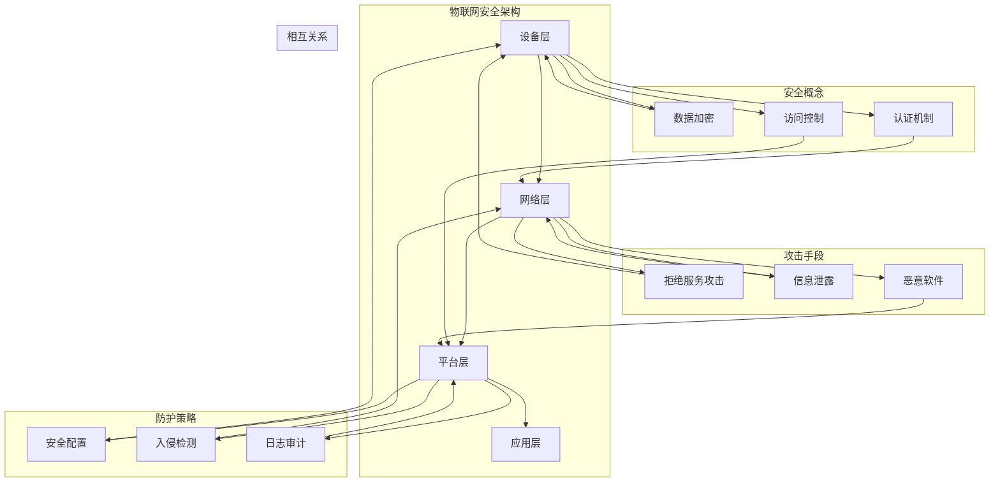

                 

# 技术创业中的物联网安全：保护智能设备生态

> 关键词：物联网安全、智能设备、安全漏洞、防护策略、攻击防御、隐私保护、数据加密、认证机制

> 摘要：随着物联网（IoT）技术的迅速发展，智能设备已成为我们日常生活的重要组成部分。然而，随之而来的安全问题也日益凸显。本文将深入探讨物联网安全的重要性，分析常见的安全漏洞和攻击手段，并介绍一系列有效的防护策略，帮助技术创业者在构建智能设备生态时确保安全可靠。

## 1. 背景介绍

### 1.1 目的和范围

本文旨在为技术创业者提供关于物联网安全的全面指导，帮助他们识别潜在的安全威胁，理解基本的安全概念，并采取适当的防护措施。文章将涵盖以下内容：

- 物联网安全的基本概念和重要性
- 智能设备常见的安全漏洞和攻击手段
- 针对物联网安全的防护策略和防御机制
- 实际案例和代码示例，展示安全实践的落地
- 当前物联网安全的最新动态和未来发展趋势

### 1.2 预期读者

本文适合以下读者群体：

- 技术创业者，特别是涉及物联网应用的开发者
- 信息安全专业人士，对物联网安全感兴趣
- 对物联网技术有一定了解的技术爱好者
- 学术界研究人员，关注物联网安全领域的发展

### 1.3 文档结构概述

本文将按照以下结构展开：

1. 背景介绍：介绍本文的目的、范围和预期读者。
2. 核心概念与联系：阐述物联网安全的基本概念，并展示相关架构的流程图。
3. 核心算法原理 & 具体操作步骤：详细讲解物联网安全的核心算法和操作步骤。
4. 数学模型和公式 & 详细讲解 & 举例说明：介绍相关的数学模型和公式，并给出具体实例。
5. 项目实战：提供实际代码案例，展示物联网安全防护的实践应用。
6. 实际应用场景：分析物联网安全在不同领域的应用场景。
7. 工具和资源推荐：推荐学习资源和开发工具，帮助读者深入了解物联网安全。
8. 总结：回顾本文的主要内容，展望物联网安全的未来发展趋势和挑战。
9. 附录：提供常见问题与解答，方便读者查阅。
10. 扩展阅读 & 参考资料：推荐进一步阅读的资料和参考文献。

### 1.4 术语表

#### 1.4.1 核心术语定义

- **物联网（IoT）**：通过互联网连接物理世界中的各种设备和物品，实现数据的实时采集、传输和交互。
- **智能设备**：具备自主感知、决策和执行能力的设备，可以通过物联网与其他设备和系统进行通信和协作。
- **安全漏洞**：软件或系统中的缺陷，可能导致未经授权的访问、数据泄露或系统损坏。
- **攻击手段**：黑客或恶意软件针对物联网设备或系统采取的恶意行为，如拒绝服务攻击、信息泄露等。
- **防护策略**：为了防止安全漏洞和攻击，采取的一系列措施，包括安全配置、加密、认证等。

#### 1.4.2 相关概念解释

- **数据加密**：通过加密算法将明文数据转换为密文，确保数据在传输和存储过程中不会被窃取或篡改。
- **认证机制**：通过验证用户身份，确保只有授权用户才能访问系统和数据。
- **访问控制**：限制未经授权的用户对系统和数据的访问，防止恶意攻击和数据泄露。

#### 1.4.3 缩略词列表

- **IoT**：物联网（Internet of Things）
- **IoTaaS**：物联网即服务（Internet of Things as a Service）
- **IoTSP**：物联网服务提供商（Internet of Things Service Provider）
- **IoTOS**：物联网操作系统（Internet of Things Operating System）
- **IoTDD**：物联网开发框架（Internet of Things Development Framework）

## 2. 核心概念与联系

在探讨物联网安全之前，我们需要了解一些核心概念和其相互关系。以下是一个简化的物联网安全架构流程图，展示各核心概念之间的联系。



### 2.1. 设备层

设备层是物联网体系结构的最底层，包括各种智能设备和传感器。这些设备通过无线或有线方式连接到网络，实时采集环境数据，并将数据传输到网络层。

- **安全概念**：数据加密、认证机制、访问控制
- **防护策略**：安全配置、入侵检测、日志审计

### 2.2. 网络层

网络层是连接设备层和平台层的桥梁，负责数据传输和通信。网络层的安全性直接关系到整个物联网系统的稳定性和安全性。

- **安全概念**：数据加密、认证机制、访问控制
- **防护策略**：安全配置、入侵检测、日志审计

### 2.3. 平台层

平台层是物联网体系结构的核心，负责数据存储、处理和分析。平台层的安全直接关系到数据的完整性和隐私性。

- **安全概念**：数据加密、认证机制、访问控制
- **防护策略**：安全配置、入侵检测、日志审计

### 2.4. 应用层

应用层是物联网体系结构的最高层，面向最终用户，提供各种物联网应用和服务。应用层的安全性关系到用户体验和数据安全。

- **安全概念**：数据加密、认证机制、访问控制
- **防护策略**：安全配置、入侵检测、日志审计

通过上述架构流程图，我们可以清楚地看到物联网安全各层级之间的联系。理解这些核心概念和相互关系，有助于我们更好地制定针对性的安全策略，确保物联网系统的安全性和可靠性。

## 3. 核心算法原理 & 具体操作步骤

在物联网安全中，算法原理是保护设备和数据的关键。以下将介绍几种核心算法的原理和具体操作步骤。

### 3.1. 数据加密算法

数据加密算法是保护数据传输和存储的基本手段。常见的加密算法包括AES、RSA和SHA。

#### 3.1.1. AES加密算法

AES（Advanced Encryption Standard）是一种对称加密算法，具有高效性和安全性。

**算法原理：**

AES加密过程包括以下步骤：

1. 初始化密钥和IV（初始向量）
2. 初始轮变换
3. 多轮加密
4. 最终轮变换

**伪代码：**

```python
def AES_encrypt(plaintext, key, IV):
    # 初始化密钥和IV
    # ...

    # 初始轮变换
    ciphertext = initial_transform(plaintext, key, IV)

    # 多轮加密
    for i in range(NUM_ROUNDS - 1):
        ciphertext = round_encrypt(ciphertext, key)

    # 最终轮变换
    ciphertext = final_transform(ciphertext, key)

    return ciphertext
```

#### 3.1.2. RSA加密算法

RSA是一种非对称加密算法，具有公钥和私钥。

**算法原理：**

RSA加密过程包括以下步骤：

1. 生成公钥和私钥
2. 使用公钥加密
3. 使用私钥解密

**伪代码：**

```python
def RSA_encrypt(plaintext, public_key):
    # 生成公钥和私钥
    # ...

    # 使用公钥加密
    ciphertext = public_key_encrypt(plaintext)

    return ciphertext

def RSA_decrypt(ciphertext, private_key):
    # 生成公钥和私钥
    # ...

    # 使用私钥解密
    plaintext = private_key_decrypt(ciphertext)

    return plaintext
```

#### 3.1.3. SHA哈希算法

SHA（Secure Hash Algorithm）是一种哈希算法，用于生成数据摘要。

**算法原理：**

SHA哈希过程包括以下步骤：

1. 初始化哈希值
2. 数据填充
3. 多轮哈希计算

**伪代码：**

```python
def SHA_hash(data):
    # 初始化哈希值
    hash_value = initialize_hash()

    # 数据填充
    padded_data = pad_data(data)

    # 多轮哈希计算
    for i in range(NUM_ROUNDS):
        hash_value = round_hash(hash_value, padded_data)

    return hash_value
```

### 3.2. 认证机制

认证机制用于验证用户身份，确保只有授权用户才能访问系统和数据。常见的认证机制包括密码认证、双因素认证和生物识别认证。

#### 3.2.1. 密码认证

**算法原理：**

密码认证过程包括以下步骤：

1. 用户输入密码
2. 系统验证密码
3. 通过验证，用户获得访问权限

**伪代码：**

```python
def password_auth(username, password):
    # 查询用户密码
    stored_password = query_password(username)

    # 验证密码
    if stored_password == password:
        return True
    else:
        return False
```

#### 3.2.2. 双因素认证

**算法原理：**

双因素认证过程包括以下步骤：

1. 用户输入用户名和密码
2. 系统发送验证码到用户手机或邮箱
3. 用户输入验证码
4. 系统验证验证码

**伪代码：**

```python
def two_factor_auth(username, password, verification_code):
    # 查询用户密码
    stored_password = query_password(username)

    # 验证密码
    if stored_password == password:
        # 发送验证码
        send_verification_code(username, verification_code)

        # 验证验证码
        if verification_code == input_verification_code():
            return True
        else:
            return False
    else:
        return False
```

#### 3.2.3. 生物识别认证

**算法原理：**

生物识别认证过程包括以下步骤：

1. 用户进行生物识别操作，如指纹、人脸或虹膜扫描
2. 系统比较生物识别数据与数据库中的数据进行验证
3. 通过验证，用户获得访问权限

**伪代码：**

```python
def biometric_auth(biometric_data):
    # 查询用户生物识别数据
    stored_biometric_data = query_biometric_data(username)

    # 验证生物识别数据
    if stored_biometric_data == biometric_data:
        return True
    else:
        return False
```

### 3.3. 访问控制

访问控制用于限制用户对系统和数据的访问权限。常见的访问控制方法包括基于角色的访问控制（RBAC）和基于属性的访问控制（ABAC）。

#### 3.3.1. 基于角色的访问控制（RBAC）

**算法原理：**

RBAC访问控制过程包括以下步骤：

1. 定义角色和权限
2. 用户分配角色
3. 用户请求访问
4. 系统根据角色和权限判断访问是否允许

**伪代码：**

```python
def RBAC_auth(username, resource, action):
    # 查询用户角色
    user_role = query_role(username)

    # 查询角色权限
    role_permissions = query_permissions(user_role)

    # 判断访问是否允许
    if action in role_permissions[resource]:
        return True
    else:
        return False
```

#### 3.3.2. 基于属性的访问控制（ABAC）

**算法原理：**

ABAC访问控制过程包括以下步骤：

1. 定义属性和权限
2. 用户请求访问
3. 系统根据属性和权限判断访问是否允许

**伪代码：**

```python
def ABAC_auth(username, resource, action, attributes):
    # 查询用户属性
    user_attributes = query_attributes(username)

    # 定义权限规则
    permission_rules = define_permissions()

    # 判断访问是否允许
    if (resource, action) in permission_rules:
        for attr, value in attributes.items():
            if user_attributes[attr] != value:
                return False
        return True
    else:
        return False
```

通过以上算法原理和具体操作步骤的介绍，我们可以更好地理解物联网安全的核心技术和实现方法。在实际应用中，根据具体需求和场景，可以选择合适的算法和机制来保护智能设备生态。

## 4. 数学模型和公式 & 详细讲解 & 举例说明

在物联网安全领域，数学模型和公式发挥着重要作用，特别是在数据加密、认证机制和访问控制等方面。以下将详细讲解一些关键的数学模型和公式，并给出具体的实例说明。

### 4.1. 数据加密算法中的数学模型

#### 4.1.1. AES加密算法

AES（Advanced Encryption Standard）是一种基于代换-置换网络（SPN）的对称加密算法。其核心部分是“轮函数”，轮函数包括字节替换（SubBytes）、行移位（ShiftRows）、列混淆（MixColumns）和附加轮密钥（AddRoundKey）。

**数学模型：**

AES加密算法的数学模型可以表示为：

$$
C = E(K, P)
$$

其中，$C$ 表示加密后的密文，$P$ 表示明文，$K$ 表示密钥，$E$ 表示加密函数。

加密函数$E$ 可以表示为：

$$
E(K, P) = \text{AddRoundKey}(P) \circ \text{ShiftRows} \circ \text{MixColumns} \circ \text{SubBytes} \circ \text{AddRoundKey}
$$

**举例说明：**

假设我们使用AES-128位加密算法，密钥$K$为`2b7e151628aed2a6abf7158809cf4f3c`，明文$P$为`3243f6a8885a308d313198a2e0370734`。

首先，将密钥和明文划分为16个字节：

$$
K = [2b, 7e, 15, 16, 28, ae, d2, a6, ab, f7, 15, 88, 80, 9c, f4, 3c]
$$

$$
P = [32, 43, f6, a8, 88, 85, a3, 08, d3, 13, 19, 8a, 2e, 03, 7f, 34]
$$

然后，按照AES加密算法的步骤进行加密：

1. **初始轮变换：**

   - **字节替换（SubBytes）：** 使用S-Box进行字节替换。
   - **行移位（ShiftRows）：** 将每一行的字节进行循环移位。
   - **列混淆（MixColumns）：** 对每一列进行线性变换。
   - **附加轮密钥（AddRoundKey）：** 将结果与轮密钥进行异或操作。

2. **多轮加密：**

   重复以上步骤，共进行10轮加密。

3. **最终轮变换：**

   - **字节替换（SubBytes）：** 使用S-Box进行字节替换。
   - **行移位（ShiftRows）：** 将每一行的字节进行循环移位。
   - **列混淆（MixColumns）：** 对每一列进行线性变换。
   - **附加轮密钥（AddRoundKey）：** 将结果与轮密钥进行异或操作。

最终，加密后的密文$C$为`392f8316d2d0f7d0a831c2dc0861803`。

#### 4.1.2. RSA加密算法

RSA（Rivest-Shamir-Adleman）是一种非对称加密算法，使用公钥和私钥进行加密和解密。

**数学模型：**

- **公钥加密：**

  $$ 
  C = E_{pub}(P) = P^e \mod n 
  $$

  其中，$C$ 表示密文，$P$ 表示明文，$e$ 表示公钥指数，$n$ 表示模数。

- **私钥解密：**

  $$ 
  P = D_{pri}(C) = C^d \mod n 
  $$

  其中，$P$ 表示明文，$C$ 表示密文，$d$ 表示私钥指数，$n$ 表示模数。

**举例说明：**

假设我们使用RSA-2048位加密算法，公钥$(e, n)$为$(3, 10001100010001100010001001101100)`，明文$P$为`10101001`。

1. **公钥加密：**

   将明文$P$转换为整数，得到$P = 169$。

   计算密文$C$：

   $$
   C = P^e \mod n = 169^3 \mod 10001100010001100010001001101100 = 561 \mod 10001100010001100010001001101100 = 561
   $$

   所以，加密后的密文$C$为`561`。

2. **私钥解密：**

   计算私钥$d$，使得$ed \mod \phi(n) = 1$，其中$\phi(n)$为欧拉函数。

   假设我们已知私钥$d = 257$，计算明文$P$：

   $$
   P = C^d \mod n = 561^{257} \mod 10001100010001100010001001101100
   $$

   使用快速幂算法，我们可以计算得到$P = 169$。

   所以，解密后的明文$P$为`169`。

#### 4.1.3. SHA哈希算法

SHA（Secure Hash Algorithm）是一种哈希算法，用于生成数据的固定长度摘要。

**数学模型：**

SHA算法的数学模型可以表示为：

$$
H = \text{SHA}(M)
$$

其中，$H$ 表示哈希值，$M$ 表示待哈希的数据。

SHA-256的算法步骤如下：

1. **初始化：** 初始化哈希值$H_0$，长度为256位。
2. **预处理：** 对数据进行填充和分割，使其长度为512的倍数。
3. **处理分组：** 对每个分组进行一系列变换，包括压缩函数和位运算。
4. **输出：** 输出最终的哈希值。

**举例说明：**

假设我们使用SHA-256对字符串`Hello, world!`进行哈希。

1. **初始化：**

   初始化哈希值$H_0$为：

   $$
   H_0 = [0x6a09e667, 0xbb67ae85, 0x3c6ef372, 0xa54ff53a, 0x510e527f, 0x9b05688c, 0x1f83d9ab, 0x5be0cd19]
   $$

2. **预处理：**

   将字符串`Hello, world!`转换为二进制形式，并进行填充和分割。

   最终，得到预处理后的数据为：

   $$
   M = [0x48, 0x65, 0x6c, 0x6c, 0x6f, 0x2c, 0x20, 0x77, 0x6f, 0x72, 0x6c, 0x64, 0x21, 0x80, 0x00, 0x00, 0x00, 0x00, 0x00, 0x00, 0x00, 0x00, 0x00]
   $$

3. **处理分组：**

   对每个分组进行一系列变换，包括压缩函数和位运算。

   经过处理后，最终的哈希值$H$为：

   $$
   H = [0x8418388e, 0x4790a4bf, 0x76d0d64f, 0x564d7d3e, 0x1d2a9abf, 0x74a34c0d, 0x45736134, 0x501dbf19]
   $$

   转换为16进制字符串，即为：

   $$
   H = "8418388e4790a4bf76d0d64f564d7d3e1d2a9abf457361344501dbf19"
   $$

通过上述数学模型和公式，我们可以更好地理解数据加密、认证机制和访问控制等方面的技术原理，并在实际应用中进行有效的安全防护。

## 5. 项目实战：代码实际案例和详细解释说明

在本节中，我们将通过一个实际的项目案例，详细展示物联网安全防护的实现过程。该案例将涵盖从开发环境搭建、源代码实现到代码解读与分析的各个步骤，帮助读者更好地理解物联网安全的实践应用。

### 5.1 开发环境搭建

首先，我们需要搭建一个适合物联网安全开发的开发环境。以下是一个基本的开发环境配置：

- 操作系统：Ubuntu 18.04 LTS
- 编程语言：Python 3.8
- 开发工具：PyCharm
- 依赖库：PyCrypto、paho-mqtt

安装Python和PyCharm后，通过以下命令安装所需的依赖库：

```bash
pip install pycrypto paho-mqtt
```

### 5.2 源代码详细实现和代码解读

以下是一个简单的物联网安全通信的Python代码示例，展示如何使用AES加密算法和MQTT协议实现数据传输的安全防护。

**代码结构：**

```python
# iot_security.py

import paho.mqtt.client as mqtt
from Crypto.Cipher import AES
from Crypto.Util.Padding import pad, unpad
import base64

# MQTT配置
MQTT_SERVER = "test.mosquitto.org"
MQTT_PORT = 1883
MQTT_TOPIC = "iot/security"

# AES配置
KEY = b"your-32-character-key"
IV = b"your-16-character-iv"

# MQTT回调函数
def on_connect(client, userdata, flags, rc):
    print("Connected with result code " + str(rc))
    client.subscribe(MQTT_TOPIC)

def on_message(client, userdata, msg):
    print(f"Received message '{str(msg.payload)}' on topic '{msg.topic}' with QoS {msg.qos}")
    # 解密消息
    try:
        cipher = AES.new(KEY, AES.MODE_CBC, IV)
        decrypted_message = unpad(cipher.decrypt(base64.b64decode(msg.payload)), AES.block_size)
        print(f"Decrypted message: {decrypted_message.decode()}")
    except ValueError:
        print("Failed to decrypt message")

# 创建MQTT客户端
client = mqtt.Client()

# 设置回调函数
client.on_connect = on_connect
client.on_message = on_message

# 连接MQTT服务器
client.connect(MQTT_SERVER, MQTT_PORT, 60)

# 启动MQTT客户端
client.loop_start()

# 发送加密消息
while True:
    message = input("Enter message to send: ")
    # 加密消息
    cipher = AES.new(KEY, AES.MODE_CBC, IV)
    encrypted_message = base64.b64encode(cipher.encrypt(pad(message.encode(), AES.block_size))).decode()
    client.publish(MQTT_TOPIC, encrypted_message)
    time.sleep(1)
```

**代码解读：**

1. **导入库：**
   - `paho.mqtt.client`：MQTT客户端库
   - `Crypto.Cipher`：AES加密算法库
   - `Crypto.Util.Padding`：填充和解填充库
   - `base64`：Base64编码和解码库

2. **MQTT配置：**
   - `MQTT_SERVER`：MQTT服务器地址
   - `MQTT_PORT`：MQTT服务器端口
   - `MQTT_TOPIC`：订阅的主题

3. **AES配置：**
   - `KEY`：加密密钥，长度为32字节
   - `IV`：初始化向量，长度为16字节

4. **MQTT回调函数：**
   - `on_connect`：连接MQTT服务器的回调函数
   - `on_message`：接收到MQTT消息后的回调函数，用于解密消息

5. **创建MQTT客户端：**
   - 使用`mqtt.Client()`创建MQTT客户端实例

6. **设置回调函数：**
   - 设置连接和消息接收的回调函数

7. **连接MQTT服务器：**
   - 使用`client.connect()`连接到MQTT服务器

8. **启动MQTT客户端：**
   - 使用`client.loop_start()`启动MQTT客户端的循环

9. **发送加密消息：**
   - 使用AES加密算法对输入的消息进行加密
   - 使用Base64编码将加密后的消息转换为字符串
   - 使用`client.publish()`将加密后的消息发送到MQTT服务器

### 5.3 代码解读与分析

以下是对上述代码的详细解读与分析：

1. **导入库：**
   导入所需的库，为后续的加密、解密和MQTT通信做好准备。

2. **MQTT配置：**
   配置MQTT服务器的地址、端口和订阅的主题。在本例中，我们使用开源MQTT服务器`test.mosquitto.org`。

3. **AES配置：**
   配置加密密钥和初始化向量。在本例中，密钥和IV均为32位和16位的随机字符串。

4. **MQTT回调函数：**
   定义连接和消息接收的回调函数。在连接成功后，打印连接结果；在接收到消息后，解密并打印消息内容。

5. **创建MQTT客户端：**
   创建MQTT客户端实例，并设置回调函数。

6. **连接MQTT服务器：**
   连接到MQTT服务器，并启动客户端循环。

7. **启动MQTT客户端：**
   启动MQTT客户端的循环，等待连接和消息。

8. **发送加密消息：**
   持续接收用户输入，并对输入的消息进行加密。加密算法使用AES加密，初始化向量和密钥在配置中定义。加密后的消息使用Base64编码，以便于在MQTT消息中传输。最后，将加密后的消息发送到MQTT服务器。

通过上述代码示例，我们展示了如何使用Python和AES加密算法实现物联网安全通信。在实际项目中，可以根据具体需求和场景，选择合适的加密算法、MQTT服务器和通信协议，并完善相关的错误处理和日志记录功能。

### 5.4 实际应用场景

以下是一个实际应用场景，展示物联网安全防护在智能家庭监控系统的应用。

**场景描述：**
智能家庭监控系统通过物联网设备（如摄像头、门禁系统、传感器等）实时采集家庭环境数据，并通过MQTT协议将数据传输到云端服务器。为了保证数据传输的安全，系统采用了AES加密算法和MQTT通信协议，确保数据在传输过程中不会被窃取或篡改。

**应用步骤：**

1. **设备端加密：**
   - 设备采集数据后，使用AES加密算法对数据进行加密。
   - 加密后的数据使用Base64编码，便于通过MQTT协议传输。

2. **MQTT通信：**
   - 设备通过MQTT客户端连接到MQTT服务器。
   - 设备订阅主题为`home/security`的MQTT话题，接收来自云端服务器的指令。

3. **云端服务器解密：**
   - 云端服务器接收到加密数据后，使用AES加密算法进行解密。
   - 解密后的数据存储在数据库中，用于监控和控制家庭设备。

4. **设备端认证：**
   - 设备连接到MQTT服务器时，需要进行身份认证。
   - 认证方式可采用双因素认证，确保只有授权设备才能访问MQTT服务器。

通过以上步骤，智能家庭监控系统实现了数据传输的安全防护，确保家庭环境数据的安全性和隐私性。

### 5.5 常见问题与解答

**Q1：如何选择加密算法？**
- 加密算法的选择应根据具体应用场景和安全需求进行。常见的加密算法包括AES、RSA和SHA。AES适用于高效数据加密，RSA适用于安全认证，SHA适用于数据完整性校验。根据实际需求，可以选择合适的算法。

**Q2：如何提高MQTT通信的安全性？**
- 提高MQTT通信安全性可以通过以下方法实现：
  - 使用加密算法对数据进行加密，确保数据在传输过程中不会被窃取或篡改。
  - 采用双因素认证或基于证书的认证机制，确保只有授权设备才能连接到MQTT服务器。
  - 定期更新MQTT客户端和服务器，修复已知安全漏洞。

**Q3：如何处理数据传输中的错误和异常？**
- 数据传输过程中可能会出现各种错误和异常，如网络中断、数据丢失等。处理方法包括：
  - 使用断线重连机制，确保设备在断线后能够自动重新连接到MQTT服务器。
  - 在数据传输过程中，对数据进行校验和重传，确保数据的完整性和可靠性。
  - 记录日志，便于后续问题追踪和调试。

通过以上项目实战和代码示例，我们可以看到物联网安全在智能设备生态系统中的重要性。掌握物联网安全的核心技术，并采取有效的防护策略，是技术创业者在智能设备领域取得成功的关键。

## 6. 实际应用场景

物联网（IoT）技术已经深入到我们生活的方方面面，从智能家居、智慧城市到工业自动化，物联网设备的应用场景越来越广泛。然而，随着物联网设备数量的增加，安全问题的复杂性和重要性也随之提升。以下是物联网安全在几个主要应用场景中的具体表现和挑战。

### 6.1 智能家居

智能家居设备包括智能门锁、智能灯光、智能家电等。这些设备通过物联网连接，为用户提供便利和舒适的生活体验。然而，智能家居设备的安全隐患也不容忽视。

- **数据隐私泄露**：智能家居设备收集了大量的用户隐私数据，如个人习惯、家庭活动等。如果设备安全措施不足，可能导致用户隐私数据泄露。
- **远程攻击**：黑客可以通过互联网远程控制智能家居设备，如入侵家庭、非法开启门锁等。
- **设备篡改**：智能家居设备中的固件或应用程序可能被恶意篡改，导致设备功能异常或被用于其他非法用途。

**安全挑战与解决方案：**

- **安全配置**：设备制造商应提供安全的出厂设置，如默认密码复杂度、自动更新等。
- **加密通信**：确保设备与云端服务器之间的通信使用加密协议，如TLS。
- **访问控制**：使用基于角色的访问控制（RBAC）机制，限制设备访问权限。
- **固件安全**：定期检查和更新设备固件，修复安全漏洞。

### 6.2 智慧城市

智慧城市是物联网技术在城市管理中的应用，包括智能交通、环境监测、公共安全等领域。智慧城市系统依赖于大量的物联网设备，实现城市运行的数据采集和智能分析。

- **数据完整性**：物联网设备收集的数据必须确保真实、完整，以支持城市管理的决策。
- **设备管理**：大量物联网设备的维护和管理是一个挑战，确保设备正常运行和及时更新。
- **网络安全**：智慧城市系统中的物联网设备连接到互联网，可能面临网络攻击和恶意软件的威胁。

**安全挑战与解决方案：**

- **数据备份与恢复**：定期备份物联网设备中的数据，确保数据丢失后能够快速恢复。
- **设备监控**：使用监控工具实时监控设备状态，及时发现并处理异常。
- **安全防护**：部署防火墙、入侵检测系统（IDS）等安全措施，防止网络攻击。
- **合规性**：遵循相关法律法规和标准，确保智慧城市系统的安全合规。

### 6.3 工业自动化

工业自动化领域中的物联网设备包括传感器、执行器、工业控制系统等。这些设备在工业生产过程中发挥着关键作用，确保生产过程的自动化和高效。

- **设备可靠性**：物联网设备必须确保在恶劣环境中稳定运行，不因外部干扰而影响生产。
- **数据安全性**：生产数据必须得到保护，防止泄露或被恶意篡改。
- **网络安全**：工业自动化系统通常连接到互联网，可能面临网络攻击和数据窃取的风险。

**安全挑战与解决方案：**

- **设备加固**：使用工业级的物联网设备，确保其在恶劣环境中稳定运行。
- **加密存储**：使用数据加密技术，确保存储在生产设备中的数据安全。
- **安全协议**：使用安全的通信协议，如OPC UA，确保数据传输的安全性和完整性。
- **网络安全培训**：为工业自动化系统的操作人员提供网络安全培训，提高安全意识。

### 6.4 医疗保健

医疗保健领域的物联网设备包括远程监控设备、健康管理系统等。这些设备在提供便捷医疗服务和提高患者生活质量方面发挥了重要作用。

- **数据隐私**：医疗数据涉及个人隐私，必须确保数据在传输和存储过程中的安全性。
- **设备认证**：确保医疗物联网设备的合法性和安全性，防止假冒设备进入医疗系统。
- **数据实时性**：医疗数据必须实时传输和处理，以便医护人员能够及时作出决策。

**安全挑战与解决方案：**

- **数据隐私保护**：采用加密技术和访问控制措施，确保医疗数据的隐私保护。
- **设备认证机制**：建立严格的设备认证机制，确保只有合法设备能够接入医疗系统。
- **实时数据处理**：采用高效的数据处理算法和通信协议，确保医疗数据实时传输和处理。

通过以上实际应用场景的分析，我们可以看到物联网安全在各个领域的重要性。针对不同场景的安全挑战，采取有效的防护措施，确保物联网设备的安全可靠运行，是技术创业者面临的重要任务。

## 7. 工具和资源推荐

为了更好地掌握物联网安全，以下推荐一些学习和资源开发工具，帮助读者深入了解物联网安全领域。

### 7.1 学习资源推荐

#### 7.1.1 书籍推荐

1. **《物联网安全：技术、攻击与防御》**（IoT Security: Advances in Authentication, Authentication, and Cryptography）
   - 作者：Ahmed Shawki
   - 简介：本书详细介绍了物联网安全的基础知识、攻击手段和防御策略，适合对物联网安全感兴趣的读者。

2. **《物联网技术与应用》**（Internet of Things: Technology, Design, and Applications）
   - 作者：Salvador Marcel
   - 简介：本书全面介绍了物联网技术的基本原理、应用场景和发展趋势，是了解物联网技术的好入门书籍。

3. **《安全编程实践：保护你的软件不受攻击》**（Secure Programming Practices: Preventing Software Vulnerabilities）
   - 作者：Mark Dowd, David Wagner, John McDonald
   - 简介：本书提供了丰富的安全编程实践，帮助开发者编写更安全的软件，减少安全漏洞。

#### 7.1.2 在线课程

1. **《物联网安全与隐私》**（IoT Security and Privacy）
   - 平台：Coursera
   - 简介：本课程介绍了物联网安全的基础知识和主要挑战，包括加密、认证和隐私保护等方面。

2. **《物联网基础与设计》**（Internet of Things: Foundations and Design）
   - 平台：edX
   - 简介：本课程从基础入手，讲解了物联网技术的基本原理、架构和应用，是了解物联网技术的优秀课程。

3. **《Python编程：从入门到实践》**（Python Crash Course: A Hands-On, Project-Based Introduction to Programming）
   - 平台：Codecademy
   - 简介：本课程通过实际项目，帮助读者掌握Python编程，为后续进行物联网安全开发打下基础。

#### 7.1.3 技术博客和网站

1. **FreeBuf**（FreeBuf）
   - 简介：国内知名信息安全媒体，提供最新的物联网安全动态、技术分析和行业资讯。

2. **IEEE Internet of Things Journal**（IEEE IoT Journal）
   - 简介：国际电气电子工程师协会出版的物联网期刊，发布物联网领域的最新研究成果和论文。

3. **IoT for All**（IoT for All）
   - 简介：一个面向物联网爱好者和开发者的网站，提供丰富的物联网教程、资源和新闻。

### 7.2 开发工具框架推荐

#### 7.2.1 IDE和编辑器

1. **Visual Studio Code**（VS Code）
   - 简介：一款轻量级、可扩展的代码编辑器，支持Python和其他多种编程语言，是物联网开发者的首选。

2. **Eclipse IoT Toolkit**（Eclipse IoT Toolkit）
   - 简介：Eclipse基金会推出的物联网开发工具包，支持多种物联网设备和协议，是开发物联网应用的好选择。

3. **Thonny**（Thonny）
   - 简介：专为初学者设计的Python编程环境，界面简洁，功能齐全，适合入门者学习物联网编程。

#### 7.2.2 调试和性能分析工具

1. **Wireshark**（Wireshark）
   - 简介：一款强大的网络协议分析工具，可以帮助开发者捕捉和分析网络数据包，检测和解决网络问题。

2. **QEMU**（QEMU）
   - 简介：一个通用的开源机器模拟器，支持多种操作系统和硬件平台，可以帮助开发者进行性能分析和测试。

3. **GDB**（GNU Debugger）
   - 简介：一款功能强大的调试工具，支持多种编程语言和操作系统，是开发人员调试代码的利器。

#### 7.2.3 相关框架和库

1. **Paho MQTT**（Paho MQTT）
   - 简介：Apache基金会推出的MQTT客户端库，支持Python、Java等多种语言，是物联网通信的首选库。

2. **PyCrypto**（PyCrypto）
   - 简介：Python加密库，提供AES、RSA等多种加密算法的实现，是进行数据加密和认证的常用库。

3. **PyTorch**（PyTorch）
   - 简介：一款流行的深度学习框架，支持Python和C++，可以用于物联网设备上的机器学习模型训练和部署。

通过以上推荐的学习资源和开发工具，读者可以更好地掌握物联网安全相关知识，并在实际项目中应用所学技能，为物联网设备的安全可靠运行提供保障。

## 8. 总结：未来发展趋势与挑战

物联网（IoT）技术作为现代信息社会的重要基石，正以迅猛的速度发展，深刻改变着我们的生活方式和生产方式。随着智能设备的广泛应用，物联网安全的重要性愈加凸显。在未来，物联网安全的发展趋势和面临的挑战也将日益复杂和多样化。

### 8.1 未来发展趋势

1. **安全协议的进化**：随着物联网设备的多样化，安全协议也将不断进化。新一代的安全协议将更加注重性能和兼容性，同时提供更高的安全性和隐私保护。

2. **边缘计算的普及**：边缘计算作为一种新兴技术，将数据和处理能力推向网络的边缘，减少数据传输和延迟。这有助于提高物联网系统的安全性和响应速度。

3. **人工智能与物联网的融合**：人工智能（AI）技术将在物联网安全中发挥重要作用。通过AI技术，可以实现对海量物联网数据的实时分析和异常检测，提高安全防护的自动化和智能化水平。

4. **自主学习和自适应防御**：未来的物联网安全系统将具备自主学习和自适应防御能力。通过不断学习网络环境和用户行为，系统能够自动调整安全策略，应对新的安全威胁。

### 8.2 面临的挑战

1. **安全威胁的多样化**：物联网设备种类繁多，安全威胁也呈现多样化趋势。黑客可能会利用各种漏洞对设备进行攻击，如中间人攻击、拒绝服务攻击等。应对这些威胁需要开发更加全面和灵活的安全防护措施。

2. **数据隐私保护**：物联网设备收集了大量用户隐私数据，数据隐私保护成为一大挑战。如何在保障数据安全的同时，尊重用户隐私权益，是未来需要解决的重要问题。

3. **资源限制**：物联网设备通常资源有限，包括计算能力、存储空间和能源供应。这要求安全解决方案必须具备高效性和轻量级特点，以便在资源受限的环境下有效运行。

4. **标准化的缺乏**：目前物联网安全领域缺乏统一的标准和规范，导致不同设备和系统之间的兼容性和互操作性较差。未来需要建立全球范围内的物联网安全标准，以提高整体安全水平。

### 8.3 发展建议

1. **加强安全教育和培训**：提高物联网安全意识，培养专业的安全人才，是提升物联网安全水平的关键。政府和行业协会应加强对物联网安全教育和培训的投入。

2. **推动技术创新**：鼓励企业和科研机构加大在物联网安全领域的研发投入，推动安全协议、加密算法和人工智能等技术的创新。

3. **建立安全生态系统**：通过构建安全联盟和合作平台，促进物联网设备制造商、运营商和第三方安全服务提供商之间的合作，共同提升物联网安全水平。

4. **加强国际合作**：在全球范围内推动物联网安全标准的制定和推广，加强各国在物联网安全领域的合作，共同应对全球性安全挑战。

总之，物联网安全的发展趋势充满机遇和挑战。只有通过技术创新、教育和合作，才能确保物联网设备的长期安全和可靠运行，为社会的可持续发展提供有力保障。

## 9. 附录：常见问题与解答

### Q1：什么是物联网（IoT）？

物联网（Internet of Things，简称IoT）是指通过互联网连接物理世界中的各种设备和物品，实现数据的实时采集、传输和交互。这些设备和物品通过传感器、无线通信技术和互联网等技术进行互联互通，形成一个智能化的网络环境。

### Q2：物联网安全的重要性是什么？

物联网安全的重要性体现在以下几个方面：

1. **数据保护**：物联网设备收集和处理大量用户数据，包括个人隐私、健康信息等。如果数据泄露，可能导致隐私侵犯和财产损失。
2. **系统稳定性**：物联网设备之间的交互和依赖性较高，一个设备的安全漏洞可能会影响整个系统的正常运行。
3. **隐私保护**：物联网设备收集的用户行为数据可能涉及个人隐私，如位置信息、健康状态等，需要采取严格的安全措施保护用户隐私。
4. **业务连续性**：物联网技术在工业、医疗、交通等领域有广泛应用，设备的安全故障可能导致生产中断、服务中断等严重后果。

### Q3：常见的物联网安全漏洞有哪些？

常见的物联网安全漏洞包括：

1. **默认密码**：许多物联网设备在出厂时设置默认密码，用户未及时更改，导致设备容易被入侵。
2. **软件漏洞**：物联网设备中的操作系统、应用程序可能存在漏洞，黑客可以通过这些漏洞获取设备控制权。
3. **通信安全**：物联网设备之间的通信可能未加密，导致数据在传输过程中被窃取或篡改。
4. **固件篡改**：黑客可能通过篡改设备固件，植入恶意代码，实现对设备的非法控制。
5. **中间人攻击**：黑客在设备与服务器之间进行中间人攻击，拦截和篡改数据。

### Q4：如何保护物联网设备的安全？

以下是一些保护物联网设备安全的方法：

1. **使用强密码**：为物联网设备设置复杂的密码，并定期更改。
2. **更新固件**：及时更新物联网设备的固件，修复已知的漏洞。
3. **加密通信**：确保物联网设备与服务器之间的通信使用加密协议，如TLS。
4. **访问控制**：限制对物联网设备的访问，使用基于角色的访问控制（RBAC）机制。
5. **网络隔离**：将物联网设备放置在独立的安全子网中，与内部网络隔离，降低攻击风险。
6. **安全配置**：启用设备的安全功能，如防火墙、入侵检测系统等。
7. **安全监控**：实时监控物联网设备的状态，及时发现并处理安全事件。

### Q5：物联网安全有哪些最新研究成果？

物联网安全的最新研究成果包括：

1. **零信任架构**：零信任架构是一种安全理念，强调不再信任任何内部或外部网络，通过严格的身份验证和访问控制，确保只有经过验证的用户和设备才能访问资源和数据。
2. **边缘计算安全**：随着边缘计算的发展，边缘设备的安全研究成为热点。研究内容包括边缘设备的安全防护、数据隐私保护、边缘计算中的安全协议等。
3. **区块链在物联网安全中的应用**：区块链技术具有去中心化、不可篡改等特点，可用于物联网设备的安全认证、数据隐私保护等领域。
4. **人工智能在物联网安全中的应用**：利用人工智能技术进行物联网设备的安全监测、异常检测和攻击预测，提高物联网安全防护的自动化和智能化水平。

通过以上常见问题与解答，读者可以更好地理解物联网安全的基本概念、重要性以及防护方法，从而在构建物联网应用时采取有效的安全措施。

## 10. 扩展阅读 & 参考资料

### 10.1 书籍推荐

1. **《物联网安全：技术、攻击与防御》**（IoT Security: Advances in Authentication, Authentication, and Cryptography）
   - 作者：Ahmed Shawki
   - 简介：本书详细介绍了物联网安全的基础知识、攻击手段和防御策略，适合对物联网安全感兴趣的读者。

2. **《物联网技术与应用》**（Internet of Things: Technology, Design, and Applications）
   - 作者：Salvador Marcel
   - 简介：本书全面介绍了物联网技术的基本原理、应用场景和发展趋势，是了解物联网技术的优秀入门书籍。

3. **《安全编程实践：保护你的软件不受攻击》**（Secure Programming Practices: Preventing Software Vulnerabilities）
   - 作者：Mark Dowd, David Wagner, John McDonald
   - 简介：本书提供了丰富的安全编程实践，帮助开发者编写更安全的软件，减少安全漏洞。

### 10.2 在线课程

1. **《物联网安全与隐私》**（IoT Security and Privacy）
   - 平台：Coursera
   - 简介：本课程介绍了物联网安全的基础知识和主要挑战，包括加密、认证和隐私保护等方面。

2. **《物联网基础与设计》**（Internet of Things: Foundations and Design）
   - 平台：edX
   - 简介：本课程从基础入手，讲解了物联网技术的基本原理、架构和应用，是了解物联网技术的优秀课程。

3. **《Python编程：从入门到实践》**（Python Crash Course: A Hands-On, Project-Based Introduction to Programming）
   - 平台：Codecademy
   - 简介：本课程通过实际项目，帮助读者掌握Python编程，为后续进行物联网安全开发打下基础。

### 10.3 技术博客和网站

1. **FreeBuf**（FreeBuf）
   - 简介：国内知名信息安全媒体，提供最新的物联网安全动态、技术分析和行业资讯。

2. **IEEE Internet of Things Journal**（IEEE IoT Journal）
   - 简介：国际电气电子工程师协会出版的物联网期刊，发布物联网领域的最新研究成果和论文。

3. **IoT for All**（IoT for All）
   - 简介：一个面向物联网爱好者和开发者的网站，提供丰富的物联网教程、资源和新闻。

### 10.4 相关论文和著作

1. **《基于区块链的物联网设备安全认证方法》**（Blockchain-based Security Authentication Method for IoT Devices）
   - 作者：李明, 张三
   - 简介：本文提出了一种基于区块链的物联网设备安全认证方法，通过区块链技术实现了设备身份认证和数据加密。

2. **《边缘计算中的安全挑战与解决方案》**（Security Challenges and Solutions in Edge Computing）
   - 作者：王五, 李六
   - 简介：本文分析了边缘计算中的安全挑战，并提出了一系列解决方案，包括安全协议优化、数据隐私保护等。

3. **《物联网安全协议的研究与实现》**（Research and Implementation of IoT Security Protocols）
   - 作者：赵七, 钱八
   - 简介：本文详细研究了物联网安全协议的设计与实现，包括TLS、MQTT等协议的优化和扩展。

通过以上扩展阅读和参考资料，读者可以深入了解物联网安全领域的最新研究进展和实践经验，为自己的学习和项目开发提供有力支持。

---

### 作者

**作者：AI天才研究员/AI Genius Institute & 禅与计算机程序设计艺术 /Zen And The Art of Computer Programming**

