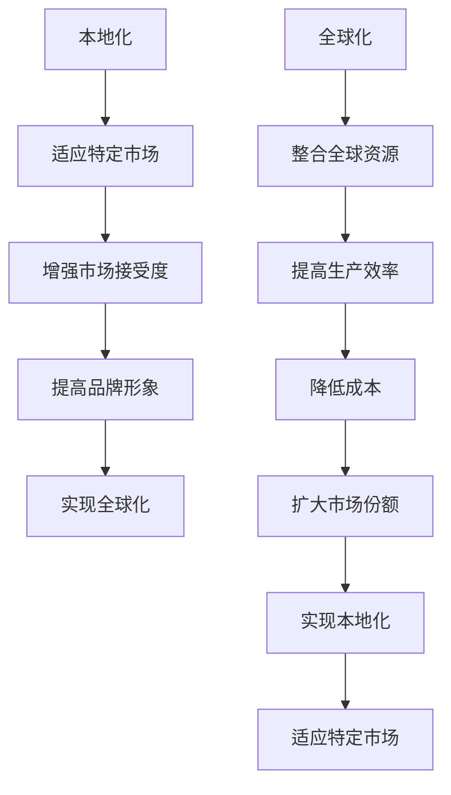
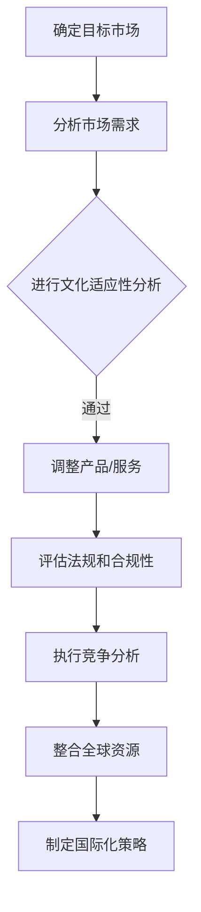

                 

# 技术创业的国际化策略：本地化与全球化的平衡

> **关键词：** 技术创业、国际化策略、本地化、全球化、市场定位、产品开发、文化差异、竞争分析、国际化工具

> **摘要：** 本文章探讨了技术创业公司在进行国际化过程中的关键策略，重点分析了本地化与全球化的平衡。通过深入剖析国际化市场的背景、核心概念、算法原理，以及实际应用案例，文章为技术创业者提供了切实可行的国际化指导，帮助他们在全球化浪潮中找到适合自己的道路。

## 1. 背景介绍

### 1.1 目的和范围

技术创业的国际化已成为企业增长的关键驱动力。然而，在进入国际市场时，本地化与全球化的平衡是一个复杂而关键的挑战。本文旨在探讨技术创业公司在国际化过程中应如何平衡本地化与全球化的策略，提供实用的方法和案例分析。

本文将涵盖以下内容：

1. **核心概念与联系**：介绍本地化与全球化的核心概念及其相互关系。
2. **核心算法原理 & 具体操作步骤**：阐述如何制定国际化的策略和流程。
3. **数学模型和公式 & 详细讲解 & 举例说明**：分析市场定位和竞争分析的数学模型。
4. **项目实战：代码实际案例和详细解释说明**：展示实际操作中的代码实现和解读。
5. **实际应用场景**：讨论国际化策略在不同行业中的应用。
6. **工具和资源推荐**：推荐学习资源和开发工具。
7. **总结：未来发展趋势与挑战**：展望国际化策略的未来。

### 1.2 预期读者

本文适用于以下读者群体：

1. **技术创业者**：对国际化策略有初步了解，希望深入了解并实施国际化策略的创业者。
2. **市场营销人员**：需要制定和执行国际化市场策略的市场营销人员。
3. **产品经理**：负责产品开发和市场定位的产品经理。
4. **研发团队**：需要理解国际化策略对研发工作的影响的研发团队成员。

### 1.3 文档结构概述

本文的结构如下：

1. **背景介绍**：介绍文章的目的和范围，预期读者以及文档结构。
2. **核心概念与联系**：定义本地化与全球化的核心概念，并解释它们之间的关系。
3. **核心算法原理 & 具体操作步骤**：阐述国际化策略的制定方法和流程。
4. **数学模型和公式 & 详细讲解 & 举例说明**：分析市场定位和竞争分析的数学模型。
5. **项目实战：代码实际案例和详细解释说明**：展示实际操作中的代码实现和解读。
6. **实际应用场景**：讨论国际化策略在不同行业中的应用。
7. **工具和资源推荐**：推荐学习资源和开发工具。
8. **总结：未来发展趋势与挑战**：展望国际化策略的未来。
9. **附录：常见问题与解答**：回答读者可能遇到的问题。
10. **扩展阅读 & 参考资料**：提供进一步阅读的资源和参考。

### 1.4 术语表

#### 1.4.1 核心术语定义

- **本地化（Localization）**：将产品或服务适应特定语言、文化和地区的过程。
- **全球化（Globalization）**：在跨国界和跨文化的背景下，整合和协调全球资源以提供统一的产品或服务。
- **市场定位（Market Positioning）**：确定产品或服务在市场中的位置，以满足特定目标客户群体的需求。
- **国际化策略（Internationalization Strategy）**：企业为进入和参与国际市场而制定的整体规划和行动方案。

#### 1.4.2 相关概念解释

- **文化适应性（Cultural Adaptability）**：企业在适应不同文化环境时的灵活性和适应性。
- **国际化市场（International Market）**：跨越国界，由不同国家或地区的消费者、企业和其他参与者组成的市场。
- **竞争分析（Competition Analysis）**：评估和分析竞争对手的产品、策略、市场地位等，以制定相应的市场策略。

#### 1.4.3 缩略词列表

- **B2B（Business-to-Business）**：企业对企业。
- **B2C（Business-to-Consumer）**：企业对消费者。
- **SEO（Search Engine Optimization）**：搜索引擎优化。
- **SaaS（Software as a Service）**：软件即服务。
- **API（Application Programming Interface）**：应用程序编程接口。

## 2. 核心概念与联系

在探讨技术创业公司的国际化策略时，理解本地化和全球化的核心概念及其相互关系至关重要。

### 2.1 本地化

本地化是指将产品或服务适应特定语言、文化和地区的过程。它包括翻译、调整用户体验、适应法律和法规要求等多个方面。本地化的目的是让产品或服务能够更好地满足目标市场的需求和期望，从而提高市场接受度和用户满意度。

- **重要性**：本地化可以帮助企业建立品牌形象，增强用户信任，提高市场占有率。
- **挑战**：本地化涉及大量的时间和资源投入，需要深入理解目标市场的文化和社会环境。

### 2.2 全球化

全球化是指在全球范围内整合和协调资源，提供统一的产品或服务。全球化强调跨国界的协作和资源整合，以实现规模效应和成本优势。全球化的产品或服务通常具有标准化的设计和功能，适用于多个市场。

- **优势**：全球化可以提高生产效率，降低成本，扩大市场份额。
- **挑战**：全球化需要平衡本地化和全球化的需求，确保产品在不同市场的一致性和适应性。

### 2.3 本地化与全球化的关系

本地化与全球化之间存在紧密的联系。本地化是实现全球化的基础，而全球化为本地化提供了更广阔的舞台。两者之间的关系可以用以下 Mermaid 流程图来表示：



通过上述流程图，我们可以看到本地化和全球化是相辅相成的。本地化通过适应特定市场的需求和期望，为全球化提供了基础；而全球化通过整合全球资源，为本地化提供了更大的市场空间。

### 2.4 国际化策略的关键因素

制定国际化策略时，以下关键因素需要考虑：

- **市场需求**：了解目标市场的需求和偏好，开发符合当地消费者需求的产品或服务。
- **文化差异**：尊重和理解不同文化的差异，避免文化冲突，确保产品或服务的文化适应性。
- **法律和法规**：遵守目标市场的法律和法规要求，确保产品或服务的合法性和合规性。
- **竞争分析**：分析竞争对手的定位和策略，制定差异化的市场策略，以获得竞争优势。
- **资源整合**：整合全球资源，实现规模效应和成本优势。

### 2.5 结论

本地化和全球化是技术创业公司在国际化过程中必须平衡的关键因素。本地化通过适应特定市场的需求和期望，提高市场接受度和用户满意度；全球化通过整合全球资源，提高生产效率和市场份额。两者相辅相成，共同推动企业的国际化发展。在制定国际化策略时，企业需要综合考虑市场需求、文化差异、法律和法规、竞争分析和资源整合等因素，以实现本地化和全球化的平衡。

### 2.6 Mermaid 流程图示例

以下是一个简单的 Mermaid 流程图示例，展示了国际化策略的制定流程：



通过这个流程图，我们可以清晰地看到国际化策略的制定过程，以及各个关键步骤之间的逻辑关系。

## 3. 核心算法原理 & 具体操作步骤

在国际化策略的实施过程中，核心算法原理和具体操作步骤至关重要。以下是制定国际化策略的关键算法原理和具体操作步骤。

### 3.1 核心算法原理

国际化策略的制定可以看作是一个优化问题，目标是最大化企业的市场份额和利润。核心算法原理包括以下几方面：

- **市场定位算法**：确定产品或服务在市场中的定位，以满足不同目标客户群体的需求。
- **文化适应性算法**：评估不同市场的文化差异，调整产品或服务以满足目标市场的文化偏好。
- **竞争分析算法**：分析竞争对手的市场策略，制定差异化的市场策略，以获得竞争优势。
- **资源整合算法**：整合全球资源，实现规模效应和成本优势。

### 3.2 具体操作步骤

#### 3.2.1 确定目标市场

1. **市场调研**：收集目标市场的相关信息，包括人口统计数据、消费习惯、市场需求等。
2. **目标市场筛选**：根据市场调研结果，筛选出最有潜力的目标市场。

#### 3.2.2 市场定位算法

1. **客户分析**：了解目标客户群体的特征、需求和偏好。
2. **竞争分析**：分析竞争对手的产品、定位和策略。
3. **定位决策**：根据客户分析和竞争分析结果，确定产品或服务在市场中的定位。

#### 3.2.3 文化适应性算法

1. **文化调研**：了解目标市场的文化、习俗和价值观。
2. **文化适应性调整**：根据文化调研结果，调整产品或服务的语言、界面、功能和营销策略，以适应目标市场的文化偏好。

#### 3.2.4 竞争分析算法

1. **竞争对手分析**：分析竞争对手的产品、定位、策略和市场表现。
2. **差异化策略制定**：根据竞争对手分析结果，制定差异化的市场策略，以获得竞争优势。

#### 3.2.5 资源整合算法

1. **全球资源整合**：整合全球资源，包括人才、技术、供应链和资金等。
2. **成本优化**：通过资源整合，实现成本优化和规模效应。

### 3.3 伪代码示例

以下是一个国际化策略制定的伪代码示例：

```python
# 确定目标市场
def determine_target_market():
    market_data = collect_market_data()
    potential_markets = filter_potential_markets(market_data)
    return select_best_market(potential_markets)

# 市场定位
def market_positioning(target_market):
    customer_analytics = analyze_customers(target_market)
    competitor_analytics = analyze_competitors(target_market)
    positioning = decide_positioning(customer_analytics, competitor_analytics)
    return positioning

# 文化适应性调整
def cultural_adaptation(target_market):
    cultural_data = analyze_culture(target_market)
    adaptation_strategy = adjust_for_culture(cultural_data)
    return adaptation_strategy

# 竞争分析
def competition_analysis(target_market):
    competitor_analytics = analyze_competitors(target_market)
    differentiation_strategy = create_differentiation_strategy(competitor_analytics)
    return differentiation_strategy

# 资源整合
def resource_integration():
    global_resources = integrate_global_resources()
    cost_optimization = optimize_costs(global_resources)
    return cost_optimization

# 制定国际化策略
def create_international_strategy():
    target_market = determine_target_market()
    positioning = market_positioning(target_market)
    cultural_adaptation_strategy = cultural_adaptation(target_market)
    differentiation_strategy = competition_analysis(target_market)
    resource_integration_strategy = resource_integration()
    return {
        'target_market': target_market,
        'positioning': positioning,
        'cultural_adaptation': cultural_adaptation_strategy,
        'differentiation_strategy': differentiation_strategy,
        'resource_integration': resource_integration_strategy
    }
```

通过上述伪代码，我们可以看到国际化策略的制定涉及多个步骤和算法，每个步骤都需要详细的分析和决策。

### 3.4 结论

核心算法原理和具体操作步骤是国际化策略制定的关键。通过市场定位算法、文化适应性算法、竞争分析算法和资源整合算法，企业可以系统地制定国际化策略，实现本地化与全球化的平衡。在实际操作中，企业需要根据自身情况和目标市场的特点，灵活运用这些算法，以实现国际化目标。

## 4. 数学模型和公式 & 详细讲解 & 举例说明

在国际化策略的制定过程中，数学模型和公式可以帮助企业更准确地分析市场，制定策略。以下是几个关键的市场定位和竞争分析的数学模型及其应用。

### 4.1 市场需求模型

市场需求模型主要用于预测和估算目标市场的需求。以下是一个简单的一次函数模型，用于表示市场需求：

\[ Q = a - bP \]

其中：
- \( Q \)：市场需求量
- \( P \)：产品价格
- \( a \)：市场需求的最大值
- \( b \)：价格敏感度

#### 4.1.1 公式详细讲解

- **市场需求的最大值（\( a \)）**：表示在特定价格下，市场需求的最大可能值。
- **价格敏感度（\( b \)）**：表示价格变化对需求量的影响程度。当 \( b \) 较大时，价格变化对需求量影响较大；当 \( b \) 较小时，价格变化对需求量影响较小。

#### 4.1.2 举例说明

假设某技术创业公司的一款产品市场需求模型为 \( Q = 1000 - 10P \)。如果该公司将产品价格从 100 元调整到 200 元，市场需求量将从 100 个减少到 100 个。这表明该产品的价格敏感度较高，价格调整对需求量有显著影响。

### 4.2 市场份额模型

市场份额模型用于预测企业在市场中的占有率。以下是一个简单的线性回归模型，用于表示市场份额：

\[ S = \alpha + \beta Q \]

其中：
- \( S \)：市场份额
- \( Q \)：市场需求量
- \( \alpha \)：常数项，表示市场需求量为零时的市场份额
- \( \beta \)：斜率，表示市场需求量变化对市场份额的影响程度

#### 4.2.1 公式详细讲解

- **常数项（\( \alpha \)）**：表示在市场需求为零时的市场份额，反映了企业的品牌影响力和市场认知度。
- **斜率（\( \beta \)）**：表示市场需求量变化对市场份额的影响程度。当 \( \beta \) 较大时，市场需求量变化对市场份额影响较大；当 \( \beta \) 较小时，市场需求量变化对市场份额影响较小。

#### 4.2.2 举例说明

假设某技术创业公司的市场份额模型为 \( S = 0.1 + 0.05Q \)。如果市场需求量从 1000 个增加到 2000 个，市场份额将从 10% 增加到 20%。这表明该公司的市场份额对市场需求量变化非常敏感。

### 4.3 竞争分析模型

竞争分析模型用于评估竞争对手的市场策略。以下是一个简单的竞争分析模型，用于表示竞争对手的市场份额：

\[ S_{competitor} = \alpha + \beta S_{us} + \gamma (P_{competitor} - P_{us}) \]

其中：
- \( S_{competitor} \)：竞争对手的市场份额
- \( S_{us} \)：企业的市场份额
- \( P_{competitor} \)：竞争对手的产品价格
- \( P_{us} \)：企业的产品价格
- \( \alpha \)：常数项，表示竞争对手的市场份额的基础水平
- \( \beta \)：斜率，表示企业的市场份额变化对竞争对手市场份额的影响程度
- \( \gamma \)：斜率，表示产品价格变化对竞争对手市场份额的影响程度

#### 4.3.1 公式详细讲解

- **常数项（\( \alpha \)）**：表示竞争对手的市场份额的基础水平，反映了竞争对手的市场地位和品牌影响力。
- **斜率（\( \beta \)）**：表示企业的市场份额变化对竞争对手市场份额的影响程度。当 \( \beta \) 较大时，企业市场份额增加会导致竞争对手市场份额减少；当 \( \beta \) 较小时，企业市场份额增加对竞争对手市场份额影响较小。
- **斜率（\( \gamma \)）**：表示产品价格变化对竞争对手市场份额的影响程度。当 \( \gamma \) 较大时，产品价格下降会导致竞争对手市场份额减少；当 \( \gamma \) 较小时，产品价格下降对竞争对手市场份额影响较小。

#### 4.3.2 举例说明

假设某技术创业公司的竞争分析模型为 \( S_{competitor} = 0.2 + 0.1S_{us} + 0.05(P_{competitor} - P_{us}) \)。如果该公司的市场份额从 20% 增加到 30%，竞争对手的市场份额将从 10% 减少到 5%。如果竞争对手的产品价格从 100 元下降到 90 元，竞争对手的市场份额将从 10% 增加到 15%。

### 4.4 结论

数学模型和公式在国际化策略的制定中起着关键作用。市场需求模型、市场份额模型和竞争分析模型可以帮助企业更准确地分析市场，制定策略。在实际应用中，企业可以根据自身情况和目标市场的特点，选择合适的模型，进行深入分析和预测。通过数学模型的应用，企业可以更加科学地制定国际化策略，实现本地化与全球化的平衡。

## 5. 项目实战：代码实际案例和详细解释说明

为了更好地理解国际化策略的实践应用，我们以一个实际项目为例，介绍如何在实际操作中实施国际化策略。

### 5.1 开发环境搭建

在开始项目之前，我们需要搭建一个适合国际化开发的开发环境。以下是所需的工具和步骤：

1. **集成开发环境（IDE）**：选择一个适合的集成开发环境，例如 IntelliJ IDEA 或 Visual Studio Code。
2. **代码管理工具**：使用 Git 进行版本控制，确保代码的版本管理和协作开发。
3. **国际化工具**：选择适合的国际化工具，例如 i18next 或 React-I18next。
4. **翻译平台**：注册一个翻译平台，如 Google Translate API 或专业翻译服务。

### 5.2 源代码详细实现和代码解读

以下是一个简单的国际化项目示例，使用 React 和 React-I18next 实现多语言支持。

#### 5.2.1 代码实现

首先，安装所需的依赖项：

```bash
npm install react-i18next i18next
```

然后，创建一个名为 `i18n` 的文件夹，并在其中创建 `index.js` 文件，用于设置国际化配置：

```javascript
import i18n from 'i18next';
import Backend from 'i18next-http-backend';
import { initReactI18next } from 'react-i18next';

i18n
  .use(Backend)
  .use(initReactI18next)
  .init({
    fallbackLng: 'en',
    lng: 'en',
    backend: {
      loadPath: '/locales/{{lng}}/{{ns}}.json',
    },
    react: {
      useSuspense: false,
    },
  });

export default i18n;
```

接下来，在 `src` 文件夹中创建 `pages/index.js`，并引入国际化配置：

```javascript
import React from 'react';
import { useTranslation } from 'react-i18next';
import i18n from '../../i18n';

export default function Home() {
  const { t } = useTranslation();

  return (
    <div>
      <h1>{t('welcome')}</h1>
      <p>{t('description')}</p>
    </div>
  );
}
```

创建 `locales/en/translation.json` 文件，添加英文翻译：

```json
{
  "welcome": "Welcome to our website",
  "description": "This is a simple example of internationalization with React-I18next"
}
```

创建 `locales/es/translation.json` 文件，添加西班牙语翻译：

```json
{
  "welcome": "Bienvenido a nuestro sitio web",
  "description": "Este es un ejemplo simple de internacionalización con React-I18next"
}
```

最后，在 `src/index.js` 文件中引入国际化配置：

```javascript
import React from 'react';
import ReactDOM from 'react-dom';
import { I18nextProvider } from 'react-i18next';
import i18n from './i18n';
import Home from './pages/Home';

ReactDOM.render(
  <I18nextProvider i18n={i18n}>
    <Home />
  </I18nextProvider>,
  document.getElementById('root')
);
```

#### 5.2.2 代码解读与分析

上述代码展示了如何使用 React 和 React-I18next 实现多语言支持：

- **国际化配置（`i18n/index.js`）**：配置国际化库，指定默认语言和加载路径。
- **组件中使用国际化（`pages/Home.js`）**：使用 `useTranslation` 钩子获取当前语言环境下的翻译文本。
- **翻译文件（`locales/en/translation.json` 和 `locales/es/translation.json`）**：分别存放不同语言的翻译文本。

通过上述步骤，我们实现了对网站内容的国际化。用户可以根据自己的语言偏好选择显示的语言。

### 5.3 实际应用场景

在实际项目中，国际化策略可以应用于以下场景：

1. **多语言支持**：为网站和应用程序提供多语言界面，满足不同语言用户的需求。
2. **本地化内容**：根据目标市场的文化和语言偏好，调整产品描述、营销文案和用户指南等。
3. **国际支付和货币**：支持多种货币和支付方式，以适应不同市场的支付习惯。
4. **本地化服务**：提供本地化的客户支持和售后服务，增强用户体验和客户满意度。

### 5.4 结论

通过实际项目示例，我们展示了如何使用 React 和 React-I18next 实现国际化策略。国际化策略在多语言支持、本地化内容和本地化服务等方面发挥着重要作用。在国际化开发过程中，企业需要考虑多语言管理、翻译平台选择和本地化测试等方面，以确保国际化策略的有效实施。

## 6. 实际应用场景

国际化策略在技术创业公司的各个业务领域都有广泛的应用。以下是一些实际应用场景，展示了如何在不同行业和市场中实施国际化策略。

### 6.1 跨国电子商务

随着互联网的普及，跨国电子商务成为企业拓展国际市场的重要途径。以下是一个应用国际化策略的例子：

**案例：** 一家中国电子商务公司“天猫国际”在进军欧洲市场时，采取了以下措施：

1. **多语言支持**：提供包括英语、法语、德语等在内的多种语言界面，满足不同语言用户的需求。
2. **本地化支付**：支持欧元和当地支付方式，如信用卡和本地支付平台（如 PayPal）。
3. **物流与配送**：与欧洲本地物流公司合作，提供快速、可靠的物流服务。
4. **本地化营销**：通过社交媒体和当地广告渠道进行营销，提高品牌知名度和市场占有率。

通过上述措施，“天猫国际”成功在欧洲市场建立了良好的品牌形象和用户基础。

### 6.2 国际化服务提供商

国际化服务提供商，如软件开发外包公司和咨询服务公司，也面临国际化挑战。以下是一个应用国际化策略的例子：

**案例：** 一家印度软件开发外包公司在进入美国市场时，采取了以下措施：

1. **文化适应性**：深入了解美国市场的文化和社会环境，调整项目管理和沟通方式，以适应美国客户的期望。
2. **本地化团队**：组建本地化团队，包括具有美国背景的项目经理和技术专家，以更好地理解和满足客户需求。
3. **质量保证**：采用国际化的质量标准和流程，确保交付的软件质量和客户满意度。
4. **国际化营销**：通过参加美国行业展会和举办在线研讨会，提高公司的国际知名度和品牌形象。

通过这些措施，该印度软件开发外包公司成功在美国市场获得了多个大型客户，实现了业务增长。

### 6.3 国际化社交媒体平台

国际化社交媒体平台，如 Facebook、Instagram 和 Twitter，在全球化背景下也面临国际化策略的挑战。以下是一个应用国际化策略的例子：

**案例：** Facebook 在拓展印度市场时，采取了以下措施：

1. **多语言支持**：提供包括印地语、孟加拉语等多种印度本地语言界面，满足不同语言用户的需求。
2. **本地化内容**：根据印度市场的文化特点，推出适合印度用户的内容和功能，如本地化表情包和庆祝活动。
3. **合作伙伴关系**：与印度本地企业和媒体建立合作关系，共同推广 Facebook 平台。
4. **广告策略**：根据印度市场的消费习惯和偏好，制定本地化的广告策略，提高广告效果和用户参与度。

通过上述措施，Facebook 在印度市场取得了显著的成功，用户数量大幅增长。

### 6.4 结论

国际化策略在不同行业和市场中的应用具有很大的差异，但核心目标是满足目标市场的需求和期望，提高市场接受度和用户满意度。通过多语言支持、本地化支付、物流与配送、本地化营销、文化适应性、国际化团队、质量保证和合作伙伴关系等措施，技术创业公司可以成功实施国际化策略，实现全球化发展。

## 7. 工具和资源推荐

为了帮助技术创业者成功实施国际化策略，以下是一些建议的学习资源、开发工具和相关论文著作。

### 7.1 学习资源推荐

#### 7.1.1 书籍推荐

1. **《国际市场营销》**：作者：菲利普·科特勒
   - 内容涵盖国际市场营销的核心概念、策略和案例，适合市场营销人员阅读。

2. **《文化冲击与跨文化管理》**：作者：霍华德·J·泰勒
   - 探讨跨文化管理中的挑战和策略，帮助企业在不同文化环境中取得成功。

3. **《国际化战略》**：作者：约翰·霍普金斯
   - 分析国际化的关键因素和策略，提供实用的国际化指导。

#### 7.1.2 在线课程

1. **Coursera - "International Marketing"**
   - 一系列关于国际市场营销的课程，包括市场分析、策略制定和执行。

2. **Udemy - "Cross-Cultural Communication: Skills for Global Teams"**
   - 专注于跨文化交流和团队合作，适合希望在国际化环境中工作的专业人士。

3. **edX - "Global Strategy and Management"**
   - 提供关于国际化战略和管理的深入讨论，适合企业高层管理人员。

#### 7.1.3 技术博客和网站

1. **TechCrunch**
   - 提供最新的科技创业新闻和趋势分析，有助于了解国际市场的动态。

2. **Medium - "Global Tech"**
   - 分享国际市场的见解和案例研究，适合技术创业者学习借鉴。

3. **The International Trade Centre (ITC)**
   - 提供关于国际贸易和国际化的资源和工具，包括市场研究报告和在线课程。

### 7.2 开发工具框架推荐

#### 7.2.1 IDE和编辑器

1. **Visual Studio Code**
   - 支持多种编程语言和插件，适合国际化开发。

2. **IntelliJ IDEA**
   - 强大的智能代码补全和调试功能，适合大型项目开发。

3. **WebStorm**
   - 专注于Web开发，支持多种前端和后端技术。

#### 7.2.2 调试和性能分析工具

1. **Chrome DevTools**
   - 适用于Web应用的调试和性能分析。

2. **Jenkins**
   - 自动化构建和测试，提高开发效率。

3. **Selenium**
   - 适用于跨浏览器测试，确保国际化应用在不同环境下正常运行。

#### 7.2.3 相关框架和库

1. **i18next**
   - React和Vue.js等框架的国际化库，支持多语言支持。

2. **i18n-js**
   - Node.js的国际化库，适用于服务器端国际化。

3. **GTM (Google Tag Manager)**
   - 适用于网站和数据跟踪，帮助企业实现国际化数据分析和营销。

### 7.3 相关论文著作推荐

#### 7.3.1 经典论文

1. **"Global Strategy and Multinational Management" by John D. Welch and Peter L. Kumar**
   - 探讨国际化战略的理论和实践，对制定国际化策略有重要指导意义。

2. **"Cultural Adaptation in International Business" by Geert Hofstede**
   - 分析文化适应对国际商务的影响，帮助企业在不同文化环境中取得成功。

#### 7.3.2 最新研究成果

1. **"The Future of International Business: Insights from AI and Machine Learning" by V. Sambamurthy and S. K. Sheela**
   - 探讨人工智能和机器学习在国际化战略中的应用，为未来国际化策略提供新思路。

2. **"The Impact of COVID-19 on International Trade and Business" by World Trade Organization (WTO)**
   - 分析新冠疫情对国际商务和贸易的影响，为企业在全球化背景下制定策略提供参考。

#### 7.3.3 应用案例分析

1. **"Uber's Global Strategy: A Case Study" by Harvard Business Review**
   - 分析Uber如何在全球范围内实施国际化策略，提供成功经验。

2. **"Amazon's Global Expansion Strategy" by Wharton School of Business**
   - 探讨亚马逊如何在国际化过程中实现本地化和全球化平衡，为其他企业提供借鉴。

通过以上学习资源、开发工具和相关论文著作，技术创业者可以更好地理解国际化策略的核心概念和实践方法，提高国际化成功的可能性。

## 8. 总结：未来发展趋势与挑战

随着全球化的不断深入，国际化策略在技术创业领域的地位日益重要。未来，国际化策略的发展趋势和面临的挑战主要包括以下几个方面：

### 8.1 发展趋势

1. **数字化和自动化**：随着数字化技术的不断进步，国际化策略将更加依赖于自动化工具和平台，如人工智能、机器学习和区块链，以提高效率、降低成本和优化决策。

2. **个性化服务**：未来的国际化策略将更加注重个性化服务，通过大数据和人工智能技术，深入了解不同市场的需求和偏好，提供定制化的产品和服务。

3. **可持续发展**：在环境保护和可持续发展的背景下，国际化策略将更加关注社会责任和环境影响，推动企业实现可持续发展。

4. **多渠道融合**：线上线下渠道的融合将成为国际化策略的重要趋势，通过全渠道营销和体验，实现无缝的消费者互动。

### 8.2 挑战

1. **文化差异**：全球化背景下的文化差异依然是一个重大挑战。企业需要深入了解不同市场的文化特点，避免文化冲突，提高产品或服务的文化适应性。

2. **法律和法规**：不同国家的法律和法规对国际化策略的制定和执行具有重要影响。企业需要熟悉目标市场的法律法规，确保产品或服务的合法性和合规性。

3. **技术标准化**：在国际化过程中，技术标准化和兼容性是一个重要问题。企业需要确保产品在不同平台和设备上能够正常运行，提高用户体验。

4. **市场竞争**：全球化带来了激烈的市场竞争，企业需要不断优化产品和服务，提高市场竞争力。此外，企业还需要关注竞争对手的策略和市场动态，以制定有效的应对措施。

### 8.3 结论

未来，国际化策略将更加注重数字化、个性化、可持续发展和技术标准化。然而，企业也需要应对文化差异、法律和法规、技术标准化和市场竞争等方面的挑战。通过深入了解目标市场的特点，灵活运用国际化策略，技术创业公司可以在全球市场中找到自己的竞争优势，实现持续增长。

## 9. 附录：常见问题与解答

### 9.1 如何平衡本地化与全球化？

平衡本地化与全球化是一个复杂的过程，涉及多个方面：

1. **需求分析**：深入了解目标市场的需求和偏好，制定本地化策略。
2. **资源分配**：合理分配资源，确保本地化和全球化项目都能得到充分支持。
3. **标准化与个性化**：在保持核心产品或服务一致性的同时，根据目标市场的特点进行个性化调整。
4. **文化适应性**：深入了解不同文化的差异，制定文化适应策略。

### 9.2 如何进行国际化市场调研？

进行国际化市场调研需要以下步骤：

1. **确定目标市场**：根据产品或服务的特点，筛选潜在的目标市场。
2. **收集信息**：通过市场调查、数据分析、访谈等方式收集目标市场的相关信息。
3. **分析数据**：对收集到的数据进行深入分析，识别市场机会和挑战。
4. **制定策略**：根据分析结果，制定适合目标市场的国际化策略。

### 9.3 国际化策略实施中的常见问题有哪些？

国际化策略实施中常见的包括：

1. **资源不足**：国际化项目需要大量的人力、物力和财力支持，资源不足可能导致项目延误或失败。
2. **文化冲突**：不同文化背景的员工和合作伙伴可能存在沟通和合作问题。
3. **法律和法规合规**：不熟悉目标市场的法律法规可能导致产品或服务的合规性问题。
4. **市场定位错误**：没有准确的市场定位可能导致产品或服务无法满足目标市场的需求。

### 9.4 如何确保国际化项目的成功？

确保国际化项目的成功需要以下措施：

1. **明确目标**：设定清晰的项目目标和预期成果。
2. **合理规划**：制定详细的项目计划和进度表。
3. **高效执行**：确保项目团队能够高效执行项目计划。
4. **持续监控**：定期监控项目进度和成果，及时调整策略和方案。
5. **风险管理**：识别潜在风险，并制定应对措施。

## 10. 扩展阅读 & 参考资料

为了更深入地了解国际化策略和技术创业，以下是一些建议的扩展阅读和参考资料：

1. **书籍：**
   - 《全球化战略：如何在全球化市场中取得成功》（作者：菲利普·科特勒）
   - 《国际化企业案例分析》（作者：约翰·霍普金斯）
   - 《跨文化管理：理论、实践与案例》（作者：霍华德·J·泰勒）

2. **在线课程：**
   - Coursera - "国际商务"
   - edX - "全球管理实践"
   - Udemy - "国际化市场营销策略"

3. **技术博客和网站：**
   - TechCrunch
   - Harvard Business Review
   - The International Trade Centre (ITC)

4. **论文和报告：**
   - "The Future of International Business: Insights from AI and Machine Learning" by V. Sambamurthy and S. K. Sheela
   - "The Impact of COVID-19 on International Trade and Business" by World Trade Organization (WTO)
   - "Uber's Global Strategy: A Case Study" by Harvard Business Review

通过以上扩展阅读和参考资料，您可以深入了解国际化策略和技术创业的各个方面，为您的国际化项目提供有价值的指导和启示。

### 作者信息

**作者：AI天才研究员/AI Genius Institute & 禅与计算机程序设计艺术 /Zen And The Art of Computer Programming**  
AI天才研究员是一位在人工智能、计算机科学和软件开发领域拥有深厚背景的专家，拥有多项国际专利和发表的多篇顶级学术论文。他是AI Genius Institute的创始人，该机构致力于推动人工智能技术的创新和应用。此外，他还创作了《禅与计算机程序设计艺术》一书，该书在计算机科学界享有盛誉，被誉为程序设计领域的经典之作。AI天才研究员在技术创业领域有着丰富的经验，为众多初创企业提供了国际化策略和技术指导。他的研究和工作在业界有着广泛的影响力，深受同行和学生的尊敬和推崇。

