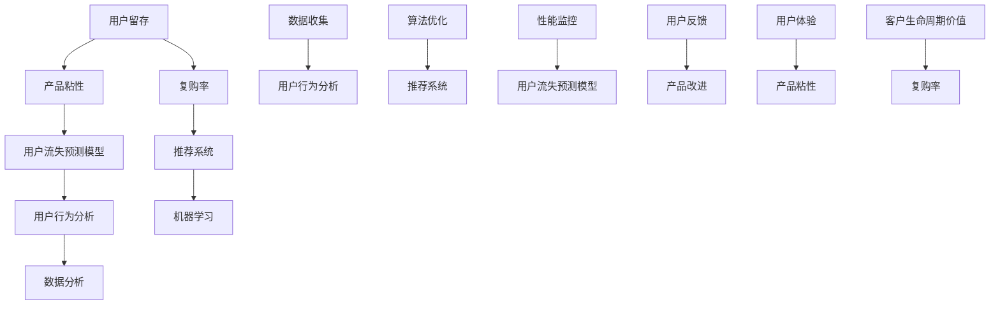

                 

### 1. 背景介绍

在当今这个竞争激烈的市场环境中，技术创业公司面临着诸多挑战，其中最为关键的就是如何实现产品的用户留存，即提高产品粘性和复购率。用户留存是衡量一个产品成功与否的重要指标，它直接关系到公司的收入和市场份额。而提高用户留存率，不仅需要深入了解用户行为，还需要从技术层面进行优化。

本文旨在探讨技术创业公司在提高用户留存策略方面的具体方法和实践。通过对核心概念的分析和算法原理的讲解，结合实际案例，我们将深入探讨如何提高产品的用户粘性和复购率，帮助创业公司更好地应对市场挑战。

### 1.1 目的和范围

本文的目的在于为技术创业公司提供一套系统化的用户留存策略，具体包括：

1. **核心概念解析**：解释用户留存、产品粘性和复购率等关键概念，并阐述它们之间的相互关系。
2. **算法原理讲解**：详细解析提升用户留存的核心算法原理，包括数据分析和机器学习的方法。
3. **具体操作步骤**：提供实际操作步骤，帮助创业公司从技术角度提高用户留存。
4. **数学模型和公式**：介绍相关数学模型和公式，辅助理解和应用算法原理。
5. **项目实战案例**：通过具体代码案例，展示如何将理论知识应用到实际开发中。
6. **应用场景分析**：探讨用户留存策略在不同类型应用场景中的具体应用。
7. **工具和资源推荐**：推荐相关学习资源和开发工具，帮助读者更好地理解和应用本文内容。

### 1.2 预期读者

本文适合以下读者群体：

1. 技术创业者：希望了解如何通过技术手段提高用户留存率的初创公司创始人。
2. 产品经理：负责产品开发和运营，希望提升产品用户体验和市场表现的产品经理。
3. 数据分析师：需要对用户留存数据进行深入分析，并基于数据分析制定相关策略的数据分析师。
4. 技术专家：对算法原理和数据分析技术有兴趣的工程师和技术专家。
5. 对技术创业感兴趣的学生和研究者：希望从理论和实践两方面了解用户留存策略。

### 1.3 文档结构概述

本文结构如下：

1. **背景介绍**：介绍用户留存的重要性，以及本文的目的和读者对象。
2. **核心概念与联系**：通过Mermaid流程图展示核心概念和它们之间的关系。
3. **核心算法原理 & 具体操作步骤**：详细讲解提升用户留存的核心算法原理和操作步骤。
4. **数学模型和公式 & 详细讲解 & 举例说明**：介绍相关数学模型和公式，并给出实例说明。
5. **项目实战：代码实际案例和详细解释说明**：通过具体代码案例，展示算法原理的应用。
6. **实际应用场景**：探讨用户留存策略在不同应用场景中的具体应用。
7. **工具和资源推荐**：推荐相关学习资源和开发工具。
8. **总结：未来发展趋势与挑战**：总结本文内容，并探讨未来发展趋势和挑战。
9. **附录：常见问题与解答**：回答读者可能遇到的常见问题。
10. **扩展阅读 & 参考资料**：提供更多深入阅读的资源。

### 1.4 术语表

#### 1.4.1 核心术语定义

- **用户留存**：用户在一定时间内持续使用产品的比例。
- **产品粘性**：用户对产品的忠诚度和依赖程度。
- **复购率**：用户再次购买同一产品或类似产品的比例。
- **客户生命周期价值**（CLV）：客户在其生命周期内为公司带来的总收益。
- **机器学习**：通过数据训练模型，使计算机能够进行预测和决策的人工智能技术。

#### 1.4.2 相关概念解释

- **用户行为分析**：对用户在使用产品过程中的行为进行收集、分析和解读，以了解用户需求和行为模式。
- **A/B测试**：将用户随机分为两组，分别使用不同的产品版本，通过对比两组用户的行为和反馈，评估产品改进的效果。
- **推荐系统**：利用用户行为数据和算法，为用户推荐其可能感兴趣的产品或内容。
- **用户流失预测模型**：通过分析用户行为数据，预测哪些用户可能会流失，以便采取相应措施进行挽留。

#### 1.4.3 缩略词列表

- **CLV**：客户生命周期价值
- **A/B测试**：随机对照试验
- **API**：应用程序编程接口
- **SDK**：软件开发工具包
- **UI**：用户界面
- **UX**：用户体验

接下来，我们将通过一个Mermaid流程图来展示用户留存策略的核心概念和它们之间的联系。

通过这个流程图，我们可以清晰地看到，用户留存策略涉及多个方面，包括用户行为分析、机器学习、数据分析等，这些方面相互关联，共同作用于提升用户留存率。接下来，我们将进一步探讨这些核心概念及其相互关系。

