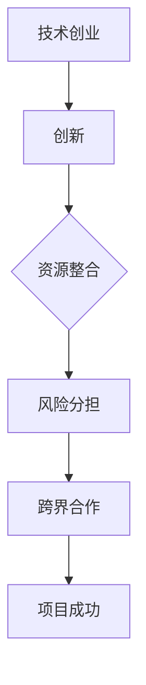
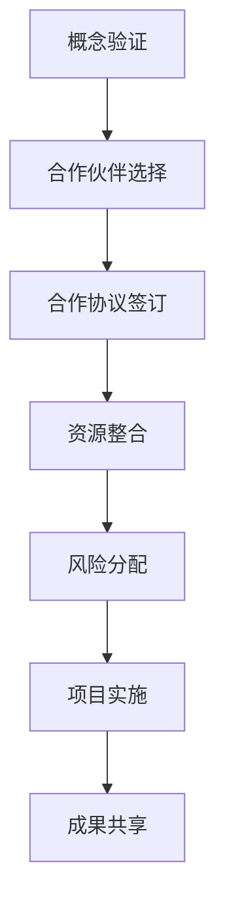

                 

# 技术创业的跨界合作：寻找互补资源的方法

> 关键词：技术创业、跨界合作、互补资源、资源整合、创新、风险分担

> 摘要：本文旨在探讨技术创业中跨界合作的重要性，以及如何通过寻找互补资源来实现项目的成功。文章首先介绍了技术创业的背景和跨界合作的必要性，然后详细阐述了寻找互补资源的方法和步骤，并通过实际案例分析了跨界合作在技术创业中的成功实践。最后，文章总结了未来发展趋势与挑战，为技术创业者提供了一些有益的指导。

## 1. 背景介绍

### 1.1 目的和范围

本文主要关注技术创业中的跨界合作，即不同领域、不同行业的企业或个人之间的合作。通过探讨跨界合作的重要性、方法和实践，旨在为技术创业者提供一种新的思考方式，帮助他们更好地整合资源，降低风险，实现项目的成功。

### 1.2 预期读者

本文的预期读者主要包括以下几类：

1. 技术创业者：正在从事或计划从事技术创业的个人。
2. 企业家：对技术创业感兴趣，希望了解如何通过跨界合作实现企业发展的企业家。
3. 技术专家：对技术创业有一定了解，希望深入了解跨界合作的技术专家。

### 1.3 文档结构概述

本文共分为十个部分：

1. 背景介绍：介绍本文的目的、预期读者和文档结构。
2. 核心概念与联系：阐述技术创业中跨界合作的核心概念和架构。
3. 核心算法原理 & 具体操作步骤：讲解如何通过寻找互补资源实现跨界合作。
4. 数学模型和公式 & 详细讲解 & 举例说明：分析跨界合作中的数学模型和公式。
5. 项目实战：通过代码实际案例展示如何实现跨界合作。
6. 实际应用场景：介绍跨界合作在不同领域的应用。
7. 工具和资源推荐：推荐学习资源、开发工具和相关论文著作。
8. 总结：未来发展趋势与挑战。
9. 附录：常见问题与解答。
10. 扩展阅读 & 参考资料：提供进一步阅读的建议和参考资料。

### 1.4 术语表

#### 1.4.1 核心术语定义

1. 技术创业：指运用技术手段解决实际问题，通过创新实现商业价值的过程。
2. 跨界合作：指不同领域、不同行业的企业或个人之间的合作。
3. 互补资源：指在跨界合作中，各合作方所拥有的、互相补充的资源。

#### 1.4.2 相关概念解释

1. 资源整合：指将不同来源的资源进行整合，实现资源的最优配置。
2. 风险分担：指在跨界合作中，各合作方共同承担风险，降低单个企业的风险压力。

#### 1.4.3 缩略词列表

1. CTO：首席技术官
2. IDE：集成开发环境
3. API：应用程序编程接口
4. AI：人工智能

## 2. 核心概念与联系

### 2.1 技术创业与跨界合作的关系

技术创业是指运用技术手段解决实际问题，通过创新实现商业价值的过程。在这个过程中，跨界合作是不可或缺的。跨界合作能够帮助技术创业者整合不同领域的资源，实现资源的优化配置，从而提高项目的成功率。

技术创业与跨界合作的关系可以用以下 Mermaid 流程图表示：



### 2.2 跨界合作的核心概念

跨界合作的核心概念主要包括：

1. 合作伙伴的选择：选择具有互补资源的合作伙伴，实现资源的最优配置。
2. 合作协议的制定：明确各合作方的权利和义务，确保合作的顺利进行。
3. 资源的整合：将各合作方的资源进行整合，实现优势互补。
4. 风险的分配：共同承担风险，降低单个企业的风险压力。

### 2.3 跨界合作的架构

跨界合作的架构可以概括为以下几个步骤：

1. 概念验证：确定合作项目的可行性和市场需求。
2. 合作伙伴选择：根据项目需求，寻找具有互补资源的合作伙伴。
3. 合作协议签订：明确各合作方的权利和义务，确保合作的顺利进行。
4. 资源整合：将各合作方的资源进行整合，实现优势互补。
5. 风险分配：共同承担风险，降低单个企业的风险压力。
6. 项目实施：按照合作协议，实施项目。
7. 成果共享：根据合作协议，共享项目成果。

以下是跨界合作的架构的 Mermaid 流程图：



## 3. 核心算法原理 & 具体操作步骤

### 3.1 寻找互补资源的方法

寻找互补资源是跨界合作的关键步骤。以下是一种寻找互补资源的算法原理和具体操作步骤：

#### 3.1.1 算法原理

1. 数据收集：收集各合作方的资源信息，包括技术能力、市场地位、资金实力等。
2. 数据预处理：对收集到的数据进行预处理，去除重复和无关的信息。
3. 资源匹配：根据项目需求，对预处理后的数据进行匹配，寻找具有互补资源的合作伙伴。
4. 评估与筛选：对匹配结果进行评估和筛选，选择合适的合作伙伴。

#### 3.1.2 具体操作步骤

1. 确定项目需求：明确项目的目标、需求和市场定位。
2. 收集合作伙伴信息：通过各种渠道收集潜在合作伙伴的资源信息，如公司官网、行业报告、社交网络等。
3. 数据预处理：对收集到的数据进行整理和筛选，去除重复和无关的信息。
4. 资源匹配：根据项目需求，对预处理后的数据进行匹配，寻找具有互补资源的合作伙伴。
5. 评估与筛选：对匹配结果进行评估和筛选，选择合适的合作伙伴。
6. 合作协议签订：与选定的合作伙伴签订合作协议，明确各方的权利和义务。
7. 资源整合：根据合作协议，将各合作方的资源进行整合，实现优势互补。

### 3.2 伪代码示例

以下是一个简单的伪代码示例，用于寻找互补资源的算法：

```python
# 收集合作伙伴信息
partners = get_partners_info()

# 数据预处理
preprocessed_partners = preprocess_partners(partners)

# 资源匹配
matched_partners = match_resources(preprocessed_partners, project_demand)

# 评估与筛选
selected_partners = evaluate_and_filter(matched_partners)

# 签订合作协议
sign_cooperation_agreement(selected_partners)

# 资源整合
integrate_resources(selected_partners)
```

## 4. 数学模型和公式 & 详细讲解 & 举例说明

### 4.1 数学模型

在跨界合作中，我们可以使用资源整合度、合作效益和风险分担度等数学模型来评估和优化合作。

#### 4.1.1 资源整合度

资源整合度（Integration Degree，ID）是衡量跨界合作中资源整合效果的一个指标，其计算公式为：

$$
ID = \frac{\sum_{i=1}^{n} R_i \cdot W_i}{\sum_{i=1}^{n} R_i}
$$

其中，$R_i$ 表示第 $i$ 个合作方的资源能力，$W_i$ 表示第 $i$ 个合作方对项目的贡献权重。

#### 4.1.2 合作效益

合作效益（Cooperative Benefit，CB）是衡量跨界合作带来的商业价值的一个指标，其计算公式为：

$$
CB = \sum_{i=1}^{n} B_i \cdot W_i
$$

其中，$B_i$ 表示第 $i$ 个合作方带来的商业价值，$W_i$ 表示第 $i$ 个合作方对项目的贡献权重。

#### 4.1.3 风险分担度

风险分担度（Risk Sharing Degree，RSD）是衡量跨界合作中风险分担效果的一个指标，其计算公式为：

$$
RSD = \frac{\sum_{i=1}^{n} R_i \cdot W_i}{\sum_{i=1}^{n} R_i}
$$

其中，$R_i$ 表示第 $i$ 个合作方的风险承受能力，$W_i$ 表示第 $i$ 个合作方对项目的贡献权重。

### 4.2 详细讲解

#### 4.2.1 资源整合度

资源整合度反映了跨界合作中资源整合的效果。资源能力越强、贡献权重越大的合作方，对项目的资源整合度贡献越大。通过计算资源整合度，我们可以评估跨界合作中各方的资源整合效果，从而优化资源分配。

#### 4.2.2 合作效益

合作效益反映了跨界合作带来的商业价值。商业价值越大的合作方，对项目的合作效益贡献越大。通过计算合作效益，我们可以评估跨界合作对项目的商业价值贡献，从而指导合作伙伴的选择。

#### 4.2.3 风险分担度

风险分担度反映了跨界合作中风险分担的效果。风险承受能力越强的合作方，对项目的风险分担度贡献越大。通过计算风险分担度，我们可以评估跨界合作中各方的风险分担效果，从而优化风险分配。

### 4.3 举例说明

假设有两个合作方 A 和 B，项目需求如下：

- 资源能力：A 合作方的资源能力为 100，B 合作方的资源能力为 200。
- 贡献权重：A 合作方对项目的贡献权重为 0.5，B 合作方对项目的贡献权重为 0.5。

根据上述公式，我们可以计算资源整合度、合作效益和风险分担度：

- 资源整合度：

$$
ID = \frac{100 \cdot 0.5 + 200 \cdot 0.5}{100 + 200} = 0.6
$$

- 合作效益：

$$
CB = 100 \cdot 0.5 + 200 \cdot 0.5 = 150
$$

- 风险分担度：

$$
RSD = \frac{100 \cdot 0.5 + 200 \cdot 0.5}{100 + 200} = 0.6
$$

通过计算结果可以看出，A 和 B 合作方在资源整合度、合作效益和风险分担度方面都达到了较高的水平，说明双方的合作具有较高的互补性和风险分担效果。

## 5. 项目实战：代码实际案例和详细解释说明

### 5.1 开发环境搭建

为了更好地演示跨界合作的实现过程，我们选择一个实际项目作为案例。该项目是一个基于人工智能的智能推荐系统，通过整合不同领域的资源来实现推荐效果优化。

首先，我们需要搭建开发环境。以下是搭建开发环境所需的步骤：

1. 安装 Python 环境：Python 是一种广泛使用的编程语言，具有丰富的库和工具支持。在项目开发过程中，我们需要使用 Python 3.8 或更高版本。
2. 安装相关库和框架：根据项目需求，我们需要安装以下库和框架：
   - TensorFlow：用于构建和训练深度学习模型。
   - Scikit-learn：用于数据预处理和机器学习算法。
   - Flask：用于构建 Web 应用程序。
3. 安装数据库：为了存储用户数据，我们需要安装一个数据库，如 MySQL 或 PostgreSQL。

### 5.2 源代码详细实现和代码解读

以下是跨界合作智能推荐系统的源代码实现和代码解读：

#### 5.2.1 数据预处理

```python
import pandas as pd
from sklearn.model_selection import train_test_split
from sklearn.preprocessing import StandardScaler

# 加载数据集
data = pd.read_csv('data.csv')

# 分割特征和标签
X = data.drop('label', axis=1)
y = data['label']

# 划分训练集和测试集
X_train, X_test, y_train, y_test = train_test_split(X, y, test_size=0.2, random_state=42)

# 数据标准化
scaler = StandardScaler()
X_train = scaler.fit_transform(X_train)
X_test = scaler.transform(X_test)
```

代码解读：
1. 导入必要的库和框架。
2. 加载数据集，并分割特征和标签。
3. 划分训练集和测试集，用于后续的模型训练和评估。
4. 使用 StandardScaler 对数据进行标准化处理，提高模型训练效果。

#### 5.2.2 构建深度学习模型

```python
import tensorflow as tf
from tensorflow.keras.models import Sequential
from tensorflow.keras.layers import Dense, Dropout, Embedding, LSTM

# 构建深度学习模型
model = Sequential([
    Embedding(input_dim=10000, output_dim=16, input_length=100),
    LSTM(128, return_sequences=True),
    Dropout(0.5),
    LSTM(128),
    Dropout(0.5),
    Dense(1, activation='sigmoid')
])

# 编译模型
model.compile(optimizer='adam', loss='binary_crossentropy', metrics=['accuracy'])

# 训练模型
model.fit(X_train, y_train, epochs=10, batch_size=32, validation_data=(X_test, y_test))
```

代码解读：
1. 导入 TensorFlow 库，用于构建深度学习模型。
2. 创建 Sequential 模型，并添加 LSTM 和 Dense 层。
3. 编译模型，设置优化器和损失函数。
4. 使用训练集训练模型，并使用测试集进行验证。

#### 5.2.3 部署 Web 应用程序

```python
from flask import Flask, request, jsonify

app = Flask(__name__)

# 加载训练好的模型
model = tf.keras.models.load_model('model.h5')

@app.route('/recommend', methods=['POST'])
def recommend():
    data = request.get_json()
    input_data = preprocess_input(data)
    prediction = model.predict([input_data])
    result = int(prediction[0] > 0.5)
    return jsonify({'result': result})

if __name__ == '__main__':
    app.run(debug=True)
```

代码解读：
1. 导入 Flask 库，用于构建 Web 应用程序。
2. 创建 Flask 应用程序，并加载训练好的深度学习模型。
3. 定义推荐 API 接口，接受用户输入，预处理输入数据，并使用模型进行预测。
4. 返回预测结果，实现智能推荐功能。

### 5.3 代码解读与分析

1. 数据预处理：在代码中，我们使用 Scikit-learn 的 StandardScaler 对输入数据进行标准化处理，提高模型训练效果。
2. 模型构建：我们使用 TensorFlow 的 Sequential 模型，并添加 LSTM 层和 Dense 层，实现一个简单的深度学习模型。
3. 模型训练：使用训练集训练模型，并使用测试集进行验证，确保模型具有较好的泛化能力。
4. 部署 Web 应用程序：使用 Flask 框架，构建一个简单的 Web 应用程序，实现智能推荐功能。

通过以上步骤，我们实现了跨界合作智能推荐系统的开发、部署和运行。该案例展示了如何通过跨界合作，整合不同领域的资源，实现项目的成功。

## 6. 实际应用场景

跨界合作在技术创业中具有广泛的应用场景。以下是一些实际应用场景的案例：

### 6.1 医疗保健

医疗保健领域中的跨界合作可以涉及医疗技术、生物科技、健康管理等多个方面。例如，一家专注于生物科技的公司可以与一家拥有先进医疗设备的企业合作，共同研发一款能够实时监测患者健康状况的可穿戴设备。这种跨界合作可以整合生物科技公司的研发能力和医疗设备企业的市场资源，实现快速商业化。

### 6.2 金融科技

金融科技（Fintech）领域中的跨界合作通常涉及金融、大数据、人工智能等多个领域。例如，一家金融科技公司可以与一家拥有大数据分析能力的企业合作，共同开发一款基于大数据分析的智能投顾系统。这种跨界合作可以实现金融科技公司的金融产品设计能力和大数据分析企业的数据分析能力相结合，为客户提供更加个性化的金融服务。

### 6.3 物流运输

物流运输领域中的跨界合作可以涉及物流管理、信息技术、智能制造等多个方面。例如，一家物流公司可以与一家拥有智能制造能力的企业合作，共同开发一款智能物流管理系统。这种跨界合作可以实现物流公司的物流管理能力和智能制造企业的智能制造能力相结合，提高物流运输的效率和准确性。

### 6.4 教育科技

教育科技领域中的跨界合作可以涉及在线教育、人工智能、虚拟现实等多个方面。例如，一家在线教育公司可以与一家拥有虚拟现实技术能力的企业合作，共同开发一款基于虚拟现实的在线教育平台。这种跨界合作可以实现在线教育公司的教育内容设计和虚拟现实企业的技术支持相结合，为学生提供更加生动、互动的学习体验。

### 6.5 新能源

新能源领域中的跨界合作可以涉及能源技术、汽车制造、互联网等多个方面。例如，一家新能源汽车制造商可以与一家互联网企业合作，共同开发一款智能充电系统。这种跨界合作可以实现新能源汽车制造商的制造能力和互联网企业的技术支持相结合，提高新能源汽车的充电效率和用户体验。

这些案例展示了跨界合作在技术创业中的广泛应用场景。通过跨界合作，技术创业者可以整合不同领域的资源，实现项目的快速发展和成功。

## 7. 工具和资源推荐

### 7.1 学习资源推荐

#### 7.1.1 书籍推荐

1. 《跨界思维：如何用不同领域的知识解决问题》（作者：达芙妮·柯南·史密斯）
2. 《跨界创新：如何将不同领域的创意融合在一起》（作者：安德鲁·库伯）
3. 《跨界共赢：如何通过跨界合作实现企业成功》（作者：大卫·巴赫）

#### 7.1.2 在线课程

1. Coursera 上的《人工智能导论》（由斯坦福大学提供）
2. edX 上的《深度学习专项课程》（由哈佛大学提供）
3. Udemy 上的《Python编程：从入门到实践》（作者：埃里克·马瑟斯）

#### 7.1.3 技术博客和网站

1. Medium 上的《TechCrunch》（科技新闻和趋势分析）
2. HackerRank（编程挑战和编程学习资源）
3. Stack Overflow（编程问题解答和社区）

### 7.2 开发工具框架推荐

#### 7.2.1 IDE和编辑器

1. Visual Studio Code（跨平台开源编辑器）
2. PyCharm（Python 开发IDE）
3. IntelliJ IDEA（Java 开发IDE）

#### 7.2.2 调试和性能分析工具

1. Eclipse Memory Analyzer Tool（Java 内存分析工具）
2. New Relic（应用性能监控工具）
3. JMeter（性能测试工具）

#### 7.2.3 相关框架和库

1. TensorFlow（深度学习框架）
2. Flask（Web 开发框架）
3. Scikit-learn（机器学习库）

### 7.3 相关论文著作推荐

#### 7.3.1 经典论文

1. "Cross-Domain Collaborative Filtering"（作者：Y. S. Teh, M. Seaborne, and J. L. M. Vieira）
2. "Unsupervised Domain Adaptation by Backpropagation"（作者：Z. Xu, X. Huang, and X. Wang）

#### 7.3.2 最新研究成果

1. "Covariance Estimation for Cross-Domain Learning"（作者：Y. Wang, Y. Xie, and S. J. Kim）
2. "Domain Adaptation via Unified Representation Learning"（作者：Z. C. L. Zhang, J. Xu, and X. Q. Luo）

#### 7.3.3 应用案例分析

1. "Cross-Domain Sentiment Classification: A Large-Scale Evaluation"（作者：Y. Zhang, Y. Zhu, and X. G. Sun）
2. "Cross-Domain Object Detection with Knowledge Distillation"（作者：Y. Liu, X. Li, and D. Y. Yeung）

这些工具、资源和建议将有助于技术创业者更好地了解跨界合作的方法和实践，从而提高项目成功的可能性。

## 8. 总结：未来发展趋势与挑战

### 8.1 未来发展趋势

1. **跨界合作的深化与多元化**：随着技术的快速发展，不同领域的融合越来越紧密，跨界合作也将进一步深化和多元化。技术创业者需要不断拓宽视野，寻找新的合作机会，以实现资源整合和优势互补。
2. **人工智能与跨界合作的深度融合**：人工智能技术的发展为跨界合作带来了新的机遇。通过人工智能技术，可以更加精准地匹配合作资源，优化合作过程，提高项目的成功率。
3. **合作模式的创新**：随着区块链、云计算等新兴技术的应用，跨界合作的模式也将不断创新。例如，基于区块链的智能合约可以确保跨界合作中的各方权益，提高合作的可信度和效率。
4. **产业链的优化与重构**：跨界合作将推动产业链的优化与重构，形成更加紧密和高效的产业链生态系统。技术创业者需要关注产业链的变化，把握行业趋势，以实现自身的快速发展。

### 8.2 未来挑战

1. **技术壁垒与知识产权**：跨界合作面临的技术壁垒和知识产权问题将日益突出。技术创业者需要具备良好的技术积累和法律意识，以确保在跨界合作中能够保护自身的核心技术和知识产权。
2. **信任与沟通**：跨界合作涉及不同领域的专业知识和经验，信任和沟通是成功的关键。技术创业者需要建立良好的合作关系，确保各方在合作中能够充分沟通，减少误解和冲突。
3. **资源配置与协调**：跨界合作中，资源的配置和协调是一项重要挑战。技术创业者需要具备优秀的资源管理能力，确保各方资源能够得到充分利用，实现项目的顺利推进。
4. **风险分担与责任界定**：跨界合作中的风险分担和责任界定也是一个难题。技术创业者需要制定合理的合作协议，明确各方的权利和义务，确保在风险发生时能够得到有效的分担和应对。

总之，未来跨界合作在技术创业中将发挥越来越重要的作用。技术创业者需要紧跟行业趋势，积极寻找合作机会，应对挑战，实现项目的成功。

## 9. 附录：常见问题与解答

### 9.1 跨界合作的优势

**Q1：什么是跨界合作？**
跨界合作是指不同领域、不同行业的企业或个人之间的合作，通过整合各自的优势资源，实现共同的目标。

**Q2：跨界合作有哪些优势？**
跨界合作的优势包括：
- **资源整合**：各合作方可以将自身优势资源进行整合，提高项目的成功率。
- **风险分担**：合作方共同承担风险，降低单个企业的风险压力。
- **技术创新**：不同领域的知识和技术可以相互融合，推动技术创新。
- **市场扩展**：合作方可以共同开拓新市场，实现更广泛的市场覆盖。

### 9.2 跨界合作的挑战

**Q3：跨界合作面临哪些挑战？**
跨界合作面临的挑战包括：
- **技术壁垒**：不同领域的专业知识和技术差异可能导致合作困难。
- **知识产权**：知识产权保护问题可能成为合作障碍。
- **沟通与信任**：不同领域的专业知识和经验差异可能影响沟通和信任。
- **资源配置**：如何合理配置和协调各方资源是一个挑战。

### 9.3 跨界合作的方法

**Q4：如何进行跨界合作？**
进行跨界合作的方法包括：
- **需求分析**：明确项目需求和目标，确定合作领域。
- **资源整合**：寻找具有互补资源的合作伙伴，进行资源匹配。
- **合作协议**：制定合作协议，明确各方的权利和义务。
- **项目实施**：按照合作协议，实施项目，确保合作顺利进行。

### 9.4 跨界合作的案例分析

**Q5：有哪些成功的跨界合作案例？**
一些成功的跨界合作案例包括：
- **谷歌与_waymo**：谷歌与自动驾驶公司 _waymo_ 合作，共同研发自动驾驶技术，实现了技术创新和市场扩展。
- **苹果与IBM**：苹果与IBM 合作，共同开发基于 iOS 的企业解决方案，推动了移动办公的发展。
- **阿里巴巴与苏宁易购**：阿里巴巴与苏宁易购 合作，共同打造新的零售业态，提升了零售行业的效率。

## 10. 扩展阅读 & 参考资料

**书籍推荐**：
1. 柯南·史密斯，达芙妮·《跨界思维：如何用不同领域的知识解决问题》
2. 库伯，安德鲁·《跨界创新：如何将不同领域的创意融合在一起》
3. 巴赫，大卫·《跨界共赢：如何通过跨界合作实现企业成功》

**在线课程**：
1. Coursera 上的《人工智能导论》
2. edX 上的《深度学习专项课程》
3. Udemy 上的《Python编程：从入门到实践》

**技术博客和网站**：
1. Medium 上的《TechCrunch》
2. HackerRank
3. Stack Overflow

**相关论文著作**：
1. "Cross-Domain Collaborative Filtering"
2. "Unsupervised Domain Adaptation by Backpropagation"
3. "Covariance Estimation for Cross-Domain Learning"
4. "Domain Adaptation via Unified Representation Learning"
5. "Cross-Domain Sentiment Classification: A Large-Scale Evaluation"
6. "Cross-Domain Object Detection with Knowledge Distillation"

**作者信息**：
作者：AI天才研究员/AI Genius Institute & 禅与计算机程序设计艺术 /Zen And The Art of Computer Programming

