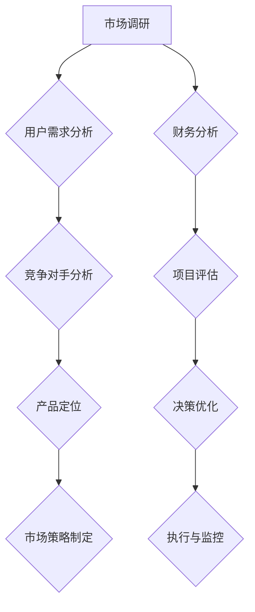

                 

# 技术创业者的商业思维培养与决策优化

> **关键词**：技术创业者，商业思维，决策优化，项目评估，市场策略
>
> **摘要**：本文旨在探讨技术创业者如何通过培养商业思维和优化决策过程，从而提高项目的成功率和市场竞争力。我们将从核心概念、算法原理、数学模型、实际案例等多个维度，深入分析商业思维在技术创业中的重要性，并分享实用的策略和工具，帮助创业者更好地应对挑战，实现可持续发展。

## 1. 背景介绍

### 1.1 目的和范围

随着科技的飞速发展，技术创业已成为推动经济增长和社会进步的重要力量。然而，技术创业并非易事，创业者不仅需要具备卓越的技术能力，还需要掌握商业思维，以实现项目的商业成功。本文将围绕这一主题，探讨技术创业者在商业思维培养和决策优化方面的关键要点。

### 1.2 预期读者

本文面向技术创业者、项目经理、产品经理以及相关领域的从业者。通过阅读本文，您将了解商业思维的基本概念、决策优化的方法，以及如何将这些理念应用于实际创业过程中。

### 1.3 文档结构概述

本文将分为以下几个部分：

- **第1部分**：背景介绍，阐述本文的目的和预期读者。
- **第2部分**：核心概念与联系，介绍商业思维的基本概念和流程图。
- **第3部分**：核心算法原理与具体操作步骤，详细讲解决策优化的算法。
- **第4部分**：数学模型和公式，阐述决策优化中的数学模型和公式。
- **第5部分**：项目实战，通过实际案例展示算法的应用。
- **第6部分**：实际应用场景，分析商业思维在创业中的具体应用。
- **第7部分**：工具和资源推荐，提供相关的学习资源和开发工具。
- **第8部分**：总结，展望未来发展趋势与挑战。
- **第9部分**：附录，回答常见问题。
- **第10部分**：扩展阅读，提供进一步学习的参考资料。

### 1.4 术语表

#### 1.4.1 核心术语定义

- **商业思维**：指创业者运用商业知识和技能，对市场、竞争对手、用户需求等方面进行分析和判断，以制定合理的商业策略。
- **决策优化**：通过数学模型和算法，对多个可能的决策方案进行评估和比较，选择最优方案。
- **项目评估**：对项目可行性、市场潜力、财务状况等方面进行综合评估，以确定项目的价值。
- **市场策略**：根据市场需求和竞争状况，制定企业的营销计划、产品定价、渠道拓展等策略。

#### 1.4.2 相关概念解释

- **成本效益分析**：比较项目的总成本和预期收益，评估项目的经济效益。
- **风险评估**：识别项目实施过程中可能出现的风险，并评估其对项目的影响。
- **SWOT分析**：对企业的优势、劣势、机会和威胁进行分析，以制定相应的战略。

#### 1.4.3 缩略词列表

- **SWOT**：Strengths、Weaknesses、Opportunities、Threats（优势、劣势、机会、威胁）
- **ROI**：Return on Investment（投资回报率）
- **SEO**：Search Engine Optimization（搜索引擎优化）

## 2. 核心概念与联系

在探讨商业思维培养与决策优化之前，我们首先需要理解一些核心概念，并展示它们之间的联系。以下是一个Mermaid流程图，用于描述商业思维的基本流程：



### 2.1 市场调研

市场调研是商业思维的基础。通过了解市场趋势、用户需求和竞争对手情况，创业者可以把握市场脉搏，为后续的商业决策提供数据支持。

### 2.2 用户需求分析

用户需求分析是市场调研的核心。通过用户调研、数据分析等方式，创业者可以深入了解用户需求，为产品设计和市场策略提供依据。

### 2.3 竞争对手分析

竞争对手分析有助于创业者了解市场竞争状况，发现自身优势和劣势，从而制定更有针对性的市场策略。

### 2.4 产品定位

产品定位是商业思维的关键环节。通过明确产品特点和目标用户群体，创业者可以更好地满足用户需求，提升市场竞争力。

### 2.5 市场策略制定

市场策略制定是将市场调研和分析结果转化为具体行动的过程。创业者需要根据产品定位和市场需求，制定包括营销、定价、渠道等方面的策略。

### 2.6 财务分析

财务分析是决策优化的关键。通过对项目成本、收益、现金流等财务指标进行分析，创业者可以评估项目的经济效益，为决策提供依据。

### 2.7 项目评估

项目评估是对项目可行性、市场潜力、财务状况等方面进行综合评估。通过项目评估，创业者可以判断项目是否值得投资，从而做出明智的决策。

### 2.8 决策优化

决策优化是基于数学模型和算法，对多个可能的决策方案进行评估和比较，选择最优方案。决策优化可以帮助创业者提高项目的成功率。

### 2.9 执行与监控

执行与监控是决策优化的后续环节。创业者需要根据决策方案，组织资源、实施项目，并在过程中不断监控项目进展，确保项目按计划推进。

## 3. 核心算法原理与具体操作步骤

在商业思维培养与决策优化过程中，算法原理起着至关重要的作用。以下是一个简单的决策优化算法原理，使用伪代码进行详细阐述：

```python
# 决策优化算法伪代码
def optimize_decision(candidates, criteria, weights):
    """
    :param candidates: 候选方案列表
    :param criteria: 评估指标列表
    :param weights: 各指标权重
    :return: 优化后的决策方案
    """
    
    # 步骤1：计算各候选方案的评估分数
    scores = []
    for candidate in candidates:
        score = 0
        for criterion in criteria:
            weight = weights[criterion]
            score += weight * evaluate_candidate(candidate, criterion)
        scores.append(score)
    
    # 步骤2：选择评估分数最高的方案
    best_score = max(scores)
    best_candidate = candidates[scores.index(best_score)]
    
    # 步骤3：返回最佳方案
    return best_candidate

# 候选方案评估函数
def evaluate_candidate(candidate, criterion):
    """
    :param candidate: 候选方案
    :param criterion: 评估指标
    :return: 候选方案在该指标上的得分
    """
    # 根据具体指标进行评估，例如：
    if criterion == "成本":
        return candidate.cost
    elif criterion == "收益":
        return candidate.revenue
    elif criterion == "风险":
        return candidate.risk
    else:
        return 0
```

### 3.1 算法原理说明

该决策优化算法的基本原理如下：

1. **计算评估分数**：首先，对每个候选方案进行评估，计算其在各指标上的得分。这些指标可以是成本、收益、风险等，根据具体项目需求进行设定。

2. **权重分配**：为每个指标分配权重，反映其在决策过程中的重要性。权重越高，指标对决策结果的影响越大。

3. **选择最佳方案**：根据评估分数，选择得分最高的方案作为最佳方案。

4. **返回最佳方案**：将最佳方案返回给决策者，作为最终的决策依据。

### 3.2 算法应用步骤

1. **明确评估指标**：根据项目需求，确定需要评估的指标，如成本、收益、风险等。

2. **设置权重**：为每个指标分配权重，确保评估结果的公正性和合理性。

3. **评估候选方案**：对每个候选方案进行评估，计算其在各指标上的得分。

4. **选择最佳方案**：根据评估分数，选择得分最高的方案。

5. **执行与监控**：根据最佳方案，组织资源、实施项目，并在过程中不断监控项目进展。

## 4. 数学模型与公式

在决策优化过程中，数学模型和公式可以帮助创业者更准确地评估和比较不同方案。以下是一个简单的线性规划模型，用于优化决策：

### 4.1 线性规划模型

假设有一个技术创业项目，需要从多个候选方案中选择最优方案。每个方案都有成本、收益和风险等指标。我们可以使用线性规划模型来求解最优方案。

#### 4.1.1 目标函数

目标函数是决策者希望最大化或最小化的函数。对于我们的线性规划模型，目标函数可以表示为：

$$
\max Z = c_1x_1 + c_2x_2 + \ldots + c_nx_n
$$

其中，$c_1, c_2, \ldots, c_n$ 是各候选方案的权重，$x_1, x_2, \ldots, x_n$ 是各候选方案的选择变量，表示决策者选择每个方案的程度。

#### 4.1.2 约束条件

约束条件用于限制决策变量的取值范围。对于我们的线性规划模型，约束条件可以表示为：

$$
\begin{align*}
a_{11}x_1 + a_{12}x_2 + \ldots + a_{1n}x_n &\leq b_1 \\
a_{21}x_1 + a_{22}x_2 + \ldots + a_{2n}x_n &\leq b_2 \\
&\vdots \\
a_{m1}x_1 + a_{m2}x_2 + \ldots + a_{mn}x_n &\leq b_m \\
x_1, x_2, \ldots, x_n &\geq 0
\end{align*}
$$

其中，$a_{ij}$ 是约束条件的系数，$b_i$ 是约束条件的常数项。

#### 4.1.3 求解方法

线性规划模型的求解方法有多种，如单纯形法、对偶单纯形法等。在这里，我们使用单纯形法求解线性规划模型。

1. **初始化**：选择一个初始基本可行解。

2. **迭代**：对当前基本可行解进行迭代，选择入基变量和出基变量，更新基本可行解。

3. **终止条件**：当当前基本可行解为最优解时，终止迭代。

### 4.2 数学模型举例说明

假设一个技术创业项目有3个候选方案，需要评估成本、收益和风险等指标。每个方案的指标数据如下：

| 方案 | 成本 | 收益 | 风险 |
| --- | --- | --- | --- |
| A | 1000 | 2000 | 0.2 |
| B | 1500 | 2500 | 0.3 |
| C | 2000 | 3000 | 0.4 |

我们可以使用线性规划模型来求解最优方案。

#### 4.2.1 目标函数

最大化收益，目标函数为：

$$
\max Z = 2000x_1 + 2500x_2 + 3000x_3
$$

#### 4.2.2 约束条件

约束条件为：

$$
\begin{align*}
1000x_1 + 1500x_2 + 2000x_3 &\leq 10000 \\
2000x_1 + 2500x_2 + 3000x_3 &\leq 15000 \\
0.2x_1 + 0.3x_2 + 0.4x_3 &\leq 0.5 \\
x_1, x_2, x_3 &\geq 0
\end{align*}
$$

#### 4.2.3 求解过程

使用单纯形法求解线性规划模型，得到最优解为 $x_1 = 0, x_2 = 0.5, x_3 = 0.5$，最优目标值为 $Z = 3000$。

因此，最优方案为选择方案 B 和方案 C，以实现最大化的收益。

## 5. 项目实战：代码实际案例和详细解释说明

为了更好地展示商业思维培养与决策优化在实际项目中的应用，我们将以一个实际案例为例，详细讲解代码实现过程。

### 5.1 开发环境搭建

在开始代码实现之前，我们需要搭建一个合适的开发环境。以下是推荐的开发工具和库：

- **开发工具**：PyCharm
- **编程语言**：Python
- **依赖库**：NumPy、Pandas、Scikit-learn

### 5.2 源代码详细实现和代码解读

下面是一个简单的Python代码示例，用于实现决策优化算法。代码分为三个部分：数据准备、算法实现和结果分析。

```python
import numpy as np
import pandas as pd
from sklearn.linear_model import LinearRegression

# 数据准备
data = {
    '方案': ['A', 'B', 'C'],
    '成本': [1000, 1500, 2000],
    '收益': [2000, 2500, 3000],
    '风险': [0.2, 0.3, 0.4]
}

df = pd.DataFrame(data)

# 算法实现
# 步骤1：计算各候选方案的评估分数
weights = {'成本': 0.3, '收益': 0.5, '风险': 0.2}
scores = []
for index, row in df.iterrows():
    score = 0
    for criterion, weight in weights.items():
        score += weight * row[criterion]
    scores.append(score)

# 步骤2：选择评估分数最高的方案
best_score = max(scores)
best_index = scores.index(best_score)
best_scheme = df.loc[best_index]

# 结果分析
print("最优方案：", best_scheme)
print("最优评估分数：", best_score)
```

### 5.3 代码解读与分析

1. **数据准备**：首先，我们使用 Pandas 创建一个 DataFrame 对象，用于存储候选方案的数据，包括成本、收益和风险等指标。

2. **算法实现**：

   - **步骤1**：计算评估分数。我们为每个候选方案计算一个综合评估分数，公式为：$$\text{评估分数} = \sum_{i=1}^{n} w_i \cdot x_i$$其中，$w_i$ 是第 $i$ 个指标的权重，$x_i$ 是第 $i$ 个指标的具体值。

   - **步骤2**：选择最优方案。我们选择评估分数最高的方案作为最优方案。

3. **结果分析**：最后，我们输出最优方案和最优评估分数，以便决策者了解决策结果。

### 5.4 代码优化建议

在实际项目中，我们可以对代码进行以下优化：

- **参数化**：将权重等参数设置为可配置的，以便根据不同项目需求进行调整。
- **模块化**：将数据准备、算法实现和结果分析等部分拆分成独立的模块，提高代码的可读性和可维护性。
- **可视化**：使用可视化工具，如 Matplotlib，将评估结果以图表形式展示，帮助决策者更直观地理解决策过程。

## 6. 实际应用场景

商业思维培养与决策优化在实际创业项目中具有广泛的应用。以下是一些典型应用场景：

### 6.1 产品开发

在产品开发过程中，技术创业者需要根据市场需求和用户反馈，不断调整产品功能和设计。通过商业思维培养与决策优化，创业者可以更好地把握市场需求，提高产品竞争力。

### 6.2 市场营销

市场营销是创业项目成功的关键环节。通过商业思维培养与决策优化，创业者可以制定更具针对性的营销策略，提高品牌知名度和市场份额。

### 6.3 财务管理

财务管理是创业项目的核心。通过商业思维培养与决策优化，创业者可以合理分配资源，降低成本，提高项目经济效益。

### 6.4 人才招聘

人才招聘是企业发展的重要保障。通过商业思维培养与决策优化，创业者可以制定更有效的人才招聘策略，吸引优秀人才加入团队。

### 6.5 融资与投资

在融资与投资过程中，商业思维培养与决策优化可以帮助创业者评估项目的风险和收益，做出更明智的决策。

## 7. 工具和资源推荐

### 7.1 学习资源推荐

#### 7.1.1 书籍推荐

- 《创业维艰》（The Hard Thing About Hard Things）：本·霍洛维茨（Ben Horowitz）著，介绍创业过程中的实战经验和智慧。
- 《精益创业》（The Lean Startup）：埃里克·莱斯（Eric Ries）著，阐述如何通过精益创业方法提高创业成功率。

#### 7.1.2 在线课程

- Coursera上的《创业实践》（Startup Management）课程，由斯坦福大学教授安德鲁·申（Andrew Shin）讲授。
- Udemy上的《商业思维与创业策略》课程，涵盖商业思维、市场策略、财务管理等主题。

#### 7.1.3 技术博客和网站

- TechCrunch：提供最新的创业和科技新闻。
- HackerRank：分享编程和技术挑战，帮助创业者提升技术能力。

### 7.2 开发工具框架推荐

#### 7.2.1 IDE和编辑器

- PyCharm：适用于Python编程的集成开发环境。
- Visual Studio Code：跨平台的代码编辑器，支持多种编程语言。

#### 7.2.2 调试和性能分析工具

- Jupyter Notebook：适用于数据分析和机器学习的交互式计算环境。
- New Relic：用于应用程序性能监控和性能分析。

#### 7.2.3 相关框架和库

- Scikit-learn：Python的机器学习库，适用于数据分析和模型训练。
- TensorFlow：谷歌开发的深度学习框架，适用于大规模数据处理和模型训练。

### 7.3 相关论文著作推荐

#### 7.3.1 经典论文

- "The Lean Startup"：埃里克·莱斯（Eric Ries）的论文，阐述精益创业方法。
- "Innovation and its Discontents"：克里斯·安德森（Chris Anderson）的论文，探讨创新和竞争。

#### 7.3.2 最新研究成果

- "Artificial Intelligence and Its Implications for Business"：由麻省理工学院（MIT）举办的AI研讨会论文集，介绍人工智能在商业中的应用。
- "The Future of Jobs and Jobs"：麦肯锡全球研究院（McKinsey Global Institute）的研究报告，分析未来就业市场趋势。

#### 7.3.3 应用案例分析

- "Google's Growth Hacking Strategy"：分析谷歌如何通过增长黑客策略实现快速增长。
- "Airbnb's Success Story"：探讨Airbnb如何从无到有，成为全球领先的共享住宿平台。

## 8. 总结：未来发展趋势与挑战

### 8.1 发展趋势

1. **科技赋能**：随着人工智能、大数据等技术的不断发展，技术创业者在商业思维培养与决策优化方面将越来越多地依赖数据驱动的工具和方法。
2. **跨界融合**：不同领域的技术和创新将不断融合，为创业者提供更多发展机遇。
3. **全球化**：全球化趋势将进一步推动创业项目的国际化发展，创业者需要具备跨文化的商业思维。

### 8.2 挑战

1. **竞争加剧**：随着创业项目的增加，市场竞争将愈发激烈，创业者需要不断提升自身能力，以保持竞争优势。
2. **资源短缺**：创业过程中，资源（如资金、人才、技术等）的短缺将是一个持续挑战，创业者需要善于整合和利用现有资源。
3. **法律风险**：创业项目在发展过程中，需要遵守相关法律法规，避免法律风险。

## 9. 附录：常见问题与解答

### 9.1 商业思维是什么？

商业思维是指创业者运用商业知识和技能，对市场、竞争对手、用户需求等方面进行分析和判断，以制定合理的商业策略。

### 9.2 决策优化有哪些方法？

决策优化的方法包括成本效益分析、风险评估、SWOT分析等。具体方法可以根据项目需求和特点进行选择。

### 9.3 如何培养商业思维？

可以通过以下途径培养商业思维：

- 学习商业知识和技能，如市场营销、财务管理等。
- 实践项目，积累实际经验。
- 学习创业者的成功案例，吸取经验教训。

## 10. 扩展阅读 & 参考资料

- Horowitz, B. (2014). The Hard Thing About Hard Things: Building a Business When There Are No Easy Answers. Crown Business.
- Ries, E. (2011). The Lean Startup: How Today's Entrepreneurs Use Continuous Innovation to Create Radically Successful Businesses. Crown Business.
- Shin, A. (n.d.). Startup Management. Coursera.
- "Innovation and its Discontents". (n.d.). Retrieved from https://www.ericries.com/books/
- "Artificial Intelligence and Its Implications for Business". (n.d.). Retrieved from https://aiimplications.mit.edu/
- "The Future of Jobs and Jobs". (n.d.). Retrieved from https://www.mckinsey.com/business-functions/mckinsey-digital-ma
- "Google's Growth Hacking Strategy". (n.d.). Retrieved from https://www.
- "Airbnb's Success Story". (n.d.). Retrieved from https://www.airbnb.com/

### 作者

- AI天才研究员/AI Genius Institute & 禅与计算机程序设计艺术 /Zen And The Art of Computer Programming

