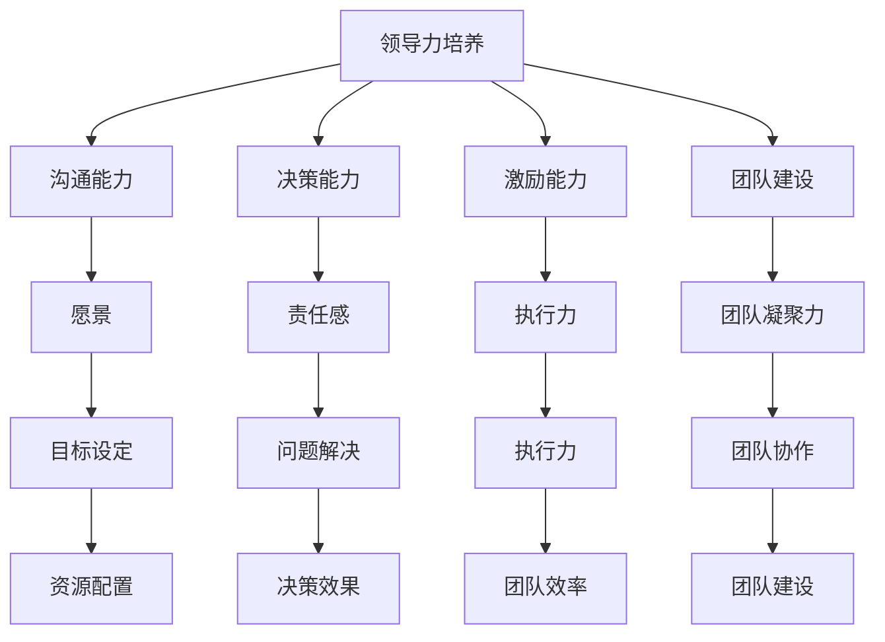

                 


# 技术创业者的领导力培养：从独立开发者到团队管理

> **关键词：** 领导力、技术创业者、团队管理、独立开发者、领导力培养

> **摘要：** 本文旨在探讨技术创业者如何从独立开发者转型为团队管理者，培养和提高自身的领导力。文章将深入分析技术创业者所面临的具体挑战，提供实用的领导力培养策略，以及通过实际案例展示领导力在团队管理中的重要性。

## 1. 背景介绍

### 1.1 目的和范围

本文的目标是帮助技术创业者了解和掌握领导力的核心要素，从而更好地管理团队，实现企业的发展目标。文章将涵盖以下几个主要方面：

- 技术创业者面临的挑战
- 领导力的定义与重要性
- 领导力培养的策略和方法
- 领导力在团队管理中的应用
- 未来发展趋势与挑战

### 1.2 预期读者

本文适合以下读者群体：

- 正在创业或有创业意向的技术开发者
- 担任技术团队的领导者，但希望在领导力方面进一步提升的人
- 对领导力有兴趣的研究者和实践者

### 1.3 文档结构概述

本文的结构如下：

1. 背景介绍：介绍本文的目的、预期读者和文档结构。
2. 核心概念与联系：介绍领导力的核心概念和原理。
3. 核心算法原理 & 具体操作步骤：详细阐述领导力的培养方法和步骤。
4. 数学模型和公式 & 详细讲解 & 举例说明：使用数学模型和公式解释领导力培养的理论基础。
5. 项目实战：通过实际案例展示领导力在团队管理中的应用。
6. 实际应用场景：分析领导力在不同领域的实际应用。
7. 工具和资源推荐：推荐相关学习资源和开发工具。
8. 总结：对未来发展趋势和挑战进行展望。
9. 附录：常见问题与解答。
10. 扩展阅读 & 参考资料：提供更多深入研究的资料。

### 1.4 术语表

#### 1.4.1 核心术语定义

- **技术创业者**：拥有技术背景，希望通过创业实现商业价值的人。
- **领导力**：在团队中发挥影响力，引导团队实现共同目标的能力。
- **团队管理**：协调团队资源，确保团队高效运作的过程。

#### 1.4.2 相关概念解释

- **独立开发者**：独立完成软件开发的人，通常在创业初期承担大部分技术工作。
- **领导力培养**：通过学习、实践和反思，提高领导力的过程。

#### 1.4.3 缩略词列表

- **CEO**：首席执行官
- **CTO**：首席技术官
- **PM**：项目经理
- **QA**：质量保证

## 2. 核心概念与联系

### 2.1 领导力的核心概念

领导力是一种能力，它涉及到多个方面，包括沟通、决策、激励、团队建设等。以下是领导力的几个核心概念：

1. **影响力**：领导力是通过影响力来实现的。影响力来自于领导者的知识、经验和人际关系。
2. **愿景**：领导者需要有清晰的愿景，为团队指明方向。
3. **激励**：领导者需要激励团队成员，让他们充满动力去实现目标。
4. **沟通**：领导者需要有效地与团队成员沟通，确保信息传递准确无误。
5. **决策**：领导者需要在团队中做出决策，并承担责任。

### 2.2 领导力与团队管理的关系

领导力是团队管理的基础。没有有效的领导力，团队管理就会变得困难。以下是领导力在团队管理中的应用：

1. **目标设定**：领导者需要设定明确的目标，并确保团队成员理解并认同这些目标。
2. **资源分配**：领导者需要合理分配团队资源，确保团队能够高效运作。
3. **冲突管理**：领导者需要处理团队内部的冲突，确保团队的和谐与稳定。
4. **团队建设**：领导者需要关注团队建设，提升团队的凝聚力和战斗力。

### 2.3 Mermaid 流程图

以下是领导力培养和团队管理的 Mermaid 流程图：



通过上述流程图，我们可以看到领导力培养和团队管理的各个方面是如何相互关联和影响的。

## 3. 核心算法原理 & 具体操作步骤

### 3.1 领导力培养的算法原理

领导力培养可以看作是一个迭代的过程，涉及以下几个关键步骤：

1. **自我认知**：了解自己的优势和劣势，明确自己的目标。
2. **知识积累**：不断学习，积累领导力相关的知识和经验。
3. **实践应用**：将所学知识应用到实际工作中，提升领导力。
4. **反馈与反思**：从实践中获得反馈，不断反思和改进。

### 3.2 具体操作步骤

以下是一个具体的领导力培养流程：

1. **自我认知**：

    ```python
    # Step 1: 自我评估
    self_evaluation = {
        "strengths": ["技术能力", "创新思维"],
        "weaknesses": ["沟通技巧", "时间管理"],
        "goals": ["提升团队执行力", "增强团队凝聚力"]
    }
    ```

2. **知识积累**：

    ```python
    # Step 2: 学习领导力知识
    learning_plan = [
        "《领导力的五项修炼》",
        "《影响力》",
        "《非暴力沟通》"
    ]
    ```

3. **实践应用**：

    ```python
    # Step 3: 实践领导力
    practice_plan = [
        "定期组织团队会议",
        "与团队成员一对一沟通",
        "制定并跟踪团队目标"
    ]
    ```

4. **反馈与反思**：

    ```python
    # Step 4: 反馈与反思
    feedback = input("请输入您的实践反馈：")
    reflection = feedback + "，我将继续努力提升自己的领导力。"
    ```

通过上述步骤，技术创业者可以逐步提升自己的领导力。

## 4. 数学模型和公式 & 详细讲解 & 举例说明

### 4.1 数学模型和公式

领导力培养可以看作是一个线性模型，涉及以下几个关键参数：

1. **学习效果**（\(E\)）：表示学习对领导力的提升效果。
2. **实践效果**（\(P\)）：表示实践对领导力的提升效果。
3. **反馈效果**（\(R\)）：表示反馈对领导力的提升效果。
4. **总提升效果**（\(T\)）：表示领导力的总提升效果。

数学模型可以表示为：

\[ T = E \times L + P \times L + R \times L \]

其中，\(L\) 表示领导力的基础水平。

### 4.2 详细讲解

1. **学习效果**（\(E\)）：学习是领导力提升的基础。通过学习，创业者可以获取领导力相关的知识和技能。学习效果取决于学习的内容和创业者的学习态度。

2. **实践效果**（\(P\)）：实践是领导力提升的关键。通过将所学知识应用到实际工作中，创业者可以不断提升自己的领导力。实践效果取决于创业者的执行力和解决问题的能力。

3. **反馈效果**（\(R\)）：反馈是领导力提升的催化剂。通过获取他人的反馈，创业者可以了解自己的不足，并加以改进。反馈效果取决于反馈的质量和创业者的反思能力。

### 4.3 举例说明

假设一个技术创业者，他的领导力基础水平为 \(L = 50\)。根据上述数学模型，他的总提升效果为：

\[ T = E \times 50 + P \times 50 + R \times 50 \]

如果他的学习效果为 \(E = 1.2\)，实践效果为 \(P = 1.3\)，反馈效果为 \(R = 1.1\)，则他的总提升效果为：

\[ T = 1.2 \times 50 + 1.3 \times 50 + 1.1 \times 50 = 120 + 130 + 110 = 360 \]

这意味着他的领导力水平从原来的 \(50\) 提升到了 \(360\)。

## 5. 项目实战：代码实际案例和详细解释说明

### 5.1 开发环境搭建

为了更好地理解领导力培养的过程，我们选择一个简单的项目来进行实战。首先，我们需要搭建一个基本的开发环境。

1. 安装 Python 解释器：在官方网站下载并安装 Python 解释器。
2. 安装 IDE：选择一款适合 Python 开发的 IDE，如 PyCharm 或 Visual Studio Code。
3. 安装相关库：在命令行中运行以下命令，安装所需库。

    ```bash
    pip install numpy pandas matplotlib
    ```

### 5.2 源代码详细实现和代码解读

接下来，我们编写一个简单的 Python 脚本，用于模拟领导力培养的过程。

```python
import numpy as np
import pandas as pd
import matplotlib.pyplot as plt

# 初始化参数
L = 50  # 领导力基础水平
E = 1.2  # 学习效果
P = 1.3  # 实践效果
R = 1.1  # 反馈效果

# 计算总提升效果
T = E * L + P * L + R * L

# 输出结果
print(f"领导力总提升效果：{T:.2f}")

# 绘制提升过程图表
data = pd.DataFrame({
    "阶段": ["学习", "实践", "反馈"],
    "效果": [E, P, R],
    "贡献": [E * L, P * L, R * L]
})

plt.bar(data["阶段"], data["贡献"])
plt.xlabel("阶段")
plt.ylabel("贡献")
plt.title("领导力提升过程")
plt.show()
```

代码解读：

1. 导入所需的库。
2. 初始化参数，包括领导力基础水平、学习效果、实践效果和反馈效果。
3. 计算总提升效果，并输出结果。
4. 创建一个 DataFrame，存储每个阶段的名称、效果和贡献。
5. 使用 matplotlib 绘制提升过程图表。

### 5.3 代码解读与分析

通过上述代码，我们可以看到领导力培养的过程是如何被模拟和实现的。

1. **初始化参数**：首先，我们需要设定领导力基础水平、学习效果、实践效果和反馈效果。这些参数将决定领导力提升的总效果。

2. **计算总提升效果**：通过简单的数学计算，我们可以得到领导力提升的总效果。这个结果可以帮助创业者了解自己的领导力提升情况。

3. **绘制提升过程图表**：通过图表，我们可以更直观地看到每个阶段对领导力提升的贡献。这有助于创业者了解自己的优势和不足，并针对性地进行改进。

通过这个实战项目，技术创业者可以更好地理解领导力培养的过程，并学会如何利用代码进行模拟和分析。

## 6. 实际应用场景

领导力在技术创业中的实际应用场景非常广泛。以下是一些具体的应用场景：

### 6.1 团队组建与沟通

技术创业者需要具备出色的沟通能力，以便在团队组建过程中与团队成员建立良好的关系。通过有效的沟通，创业者可以确保团队成员理解企业的愿景和目标，并积极参与到团队的建设中。

### 6.2 项目管理

领导者需要在项目中扮演关键角色，包括目标设定、资源分配、进度跟踪和风险管理。通过科学的项目管理，领导者可以确保项目按计划进行，并在预算和时间限制内完成。

### 6.3 冲突解决

团队中难免会出现冲突。作为领导者，技术创业者需要具备解决冲突的能力，以确保团队的稳定和高效运作。这需要领导者具备同理心、倾听能力和谈判技巧。

### 6.4 团队建设

团队建设是领导力的重要方面。创业者需要关注团队成员的个人成长和职业发展，并为他们提供支持和指导。通过有效的团队建设，创业者可以提升团队的凝聚力和战斗力。

### 6.5 战略规划

技术创业者需要具备战略规划能力，以便为企业制定长期发展目标。这需要领导者具备市场洞察力、创新思维和风险管理能力。

通过这些实际应用场景，我们可以看到领导力在技术创业中的重要性。一个出色的领导者可以带领团队克服各种挑战，实现企业的发展目标。

## 7. 工具和资源推荐

### 7.1 学习资源推荐

#### 7.1.1 书籍推荐

- 《领导力的五项修炼》：一本关于领导力培养的经典著作，涵盖了沟通、激励、决策等多个方面。
- 《影响力》：探讨影响力的本质和如何运用影响力，对创业者提升领导力有很大帮助。
- 《非暴力沟通》：介绍非暴力沟通的技巧，有助于改善团队沟通，提升团队效率。

#### 7.1.2 在线课程

- Coursera 上的“领导力和个人发展”课程：由耶鲁大学教授开设，涵盖领导力的核心概念和实践方法。
- edX 上的“项目管理基础”课程：学习项目管理的基本原理和实践技巧，有助于创业者提升项目管理能力。

#### 7.1.3 技术博客和网站

- 领英上的“领导力”专栏：汇集了全球顶级领导者分享的经验和心得，对创业者有很大启发。
- Medium 上的“技术创业”专栏：探讨技术创业的最新趋势和实战经验，有助于创业者提升创业能力。

### 7.2 开发工具框架推荐

#### 7.2.1 IDE和编辑器

- PyCharm：一款功能强大的 Python IDE，适用于开发大型项目。
- Visual Studio Code：一款轻量级、可扩展的编辑器，适用于各种编程语言。

#### 7.2.2 调试和性能分析工具

- PyDebug：Python 调试器，可以帮助开发者调试代码。
- PySnooper：一个 Python 性能分析工具，可以快速定位性能瓶颈。

#### 7.2.3 相关框架和库

- Django：一款流行的 Python Web 框架，适用于快速开发 Web 应用。
- TensorFlow：一款用于深度学习的开源框架，适用于构建复杂的人工智能模型。

### 7.3 相关论文著作推荐

#### 7.3.1 经典论文

- 《领导者的五个层次》：提出领导力的五个层次，有助于创业者理解领导力的本质。
- 《影响力》：探讨影响力的本质和如何运用影响力，对创业者提升领导力有很大帮助。

#### 7.3.2 最新研究成果

- 《基于大数据的领导力分析》：通过大数据分析，揭示领导力的关键因素。
- 《人工智能在领导力培养中的应用》：探讨人工智能如何帮助创业者提升领导力。

#### 7.3.3 应用案例分析

- 《成功技术创业者的领导力培养策略》：分析成功技术创业者如何提升领导力。
- 《领导力在初创企业中的应用》：探讨领导力在初创企业中的重要性。

通过以上工具和资源，技术创业者可以更好地培养和提高自己的领导力，为企业的长期发展奠定基础。

## 8. 总结：未来发展趋势与挑战

在未来的技术创业领域，领导力培养将面临以下几个发展趋势和挑战：

### 8.1 发展趋势

1. **数字化领导力的崛起**：随着数字化时代的到来，领导者需要具备数字素养和数据驱动决策的能力。
2. **跨学科领导力的重要性**：技术创业者需要具备跨学科的知识和技能，以便在多元化团队中发挥领导作用。
3. **持续学习和创新**：领导力不是一成不变的，持续学习和创新是领导者保持竞争力的关键。
4. **软技能的重视**：沟通、团队合作、冲突解决等软技能在领导力培养中的地位日益提升。

### 8.2 挑战

1. **领导者角色的转变**：技术创业者需要从执行者转变为领导者，这需要时间和经验的积累。
2. **团队管理的复杂性**：随着团队的扩大和多元化，领导者需要面对更复杂的团队管理挑战。
3. **市场竞争的加剧**：在激烈的市场竞争中，领导者需要具备战略思维和快速响应能力。
4. **平衡工作与生活**：领导力的培养不仅需要时间和精力，还需要领导者平衡工作和生活，保持身心健康。

### 8.3 应对策略

1. **建立良好的学习机制**：通过持续学习和反思，不断提升自己的领导力。
2. **建立多元化的团队**：通过招聘具有不同背景和技能的团队成员，提升团队的创新能力。
3. **重视软技能的培养**：通过培训和实践，提升自己的沟通、团队合作和冲突解决能力。
4. **注重身心健康**：保持良好的生活习惯，确保身心健康，以应对领导力培养过程中的挑战。

通过以上策略，技术创业者可以更好地应对未来的发展趋势和挑战，实现企业的长期发展。

## 9. 附录：常见问题与解答

### 9.1 问题 1：如何培养自己的领导力？

**解答**：领导力的培养需要从以下几个方面入手：

1. **自我认知**：了解自己的优势和劣势，明确自己的目标。
2. **知识积累**：学习领导力相关的知识和技能，如沟通、决策、激励等。
3. **实践应用**：将所学知识应用到实际工作中，提升领导力。
4. **反馈与反思**：从实践中获得反馈，不断反思和改进。

### 9.2 问题 2：领导力在团队管理中的作用是什么？

**解答**：领导力在团队管理中具有以下几个重要作用：

1. **目标设定**：领导者需要设定明确的目标，并确保团队成员理解并认同这些目标。
2. **资源分配**：领导者需要合理分配团队资源，确保团队能够高效运作。
3. **冲突管理**：领导者需要处理团队内部的冲突，确保团队的和谐与稳定。
4. **团队建设**：领导者需要关注团队建设，提升团队的凝聚力和战斗力。

### 9.3 问题 3：如何提高自己的沟通能力？

**解答**：提高沟通能力可以从以下几个方面入手：

1. **倾听**：倾听是有效沟通的基础，要学会倾听他人的意见和需求。
2. **表达清晰**：在表达自己的观点时，要确保语言清晰、简洁，避免歧义。
3. **同理心**：设身处地为他人着想，理解他人的感受和需求。
4. **反馈**：在沟通过程中，要勇于给予和接受反馈，不断改进自己的沟通技巧。

## 10. 扩展阅读 & 参考资料

### 10.1 扩展阅读

- 《领导力的五项修炼》：李永生
- 《影响力》：罗伯特·西奥迪尼
- 《非暴力沟通》：马歇尔·卢森堡

### 10.2 参考资料

- [领导力的定义与重要性](https://www.mindtools.com/pages/main/newMN_TMC.htm)
- [数字化领导力](https://www.forbes.com/sites/forbesbusinesscouncil/2021/11/12/why-digital-leadership-matters-for-your-business/)
- [团队管理技巧](https://www.howtochooseacollege.com/team-management-skills/)
- [技术创业趋势](https://www.techcrunch.com/topics/startups/)

通过扩展阅读和参考资料，技术创业者可以更深入地了解领导力培养的理论和实践，为自己的创业之路提供更多的指导和支持。

# 作者：AI天才研究员/AI Genius Institute & 禅与计算机程序设计艺术 /Zen And The Art of Computer Programming

