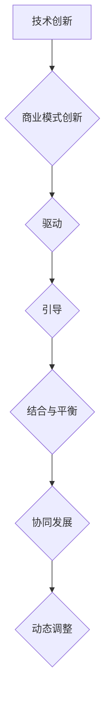

                 


# 技术创新与商业模式创新的结合与平衡

> 关键词：技术创新、商业模式创新、结合与平衡、企业战略、竞争优势、市场适应性

> 摘要：本文将深入探讨技术创新与商业模式创新之间的关系，分析两者如何相互结合与平衡，以实现企业的长期成功。文章首先介绍了技术创新和商业模式创新的基本概念，然后通过实例分析了它们之间的相互作用。接着，本文探讨了如何平衡技术创新与商业模式创新，以最大化企业的竞争优势和适应市场变化。最后，文章提出了未来发展趋势和面临的挑战，为读者提供了有价值的参考和启示。

## 1. 背景介绍

### 1.1 目的和范围

本文的目的是探讨技术创新与商业模式创新之间的结合与平衡，分析它们在企业发展中的作用。我们希望通过深入研究这一主题，为企业提供有价值的策略和建议，以实现技术创新与商业模式创新的协同发展。

本文的范围将主要涵盖以下几个方面：

1. **技术创新**的定义、类型和重要性。
2. **商业模式创新**的定义、类型和重要性。
3. **技术创新与商业模式创新的结合与平衡**。
4. **案例分析**：分析成功企业的创新实践。
5. **平衡策略**：提出实现技术创新与商业模式创新平衡的策略。
6. **未来趋势与挑战**：探讨技术创新与商业模式创新面临的发展趋势和挑战。

### 1.2 预期读者

本文的预期读者包括：

1. **企业高管**：需要了解技术创新与商业模式创新的关系，以制定企业战略。
2. **研发人员**：希望了解如何将技术创新应用于商业模式创新。
3. **市场营销人员**：需要了解商业模式创新对企业竞争优势和市场适应性的影响。
4. **创业者**：希望了解如何通过技术创新和商业模式创新实现企业的快速成长。
5. **学术研究人员**：对技术创新与商业模式创新的研究感兴趣。

### 1.3 文档结构概述

本文分为以下章节：

1. **背景介绍**：介绍本文的目的、范围、预期读者和文档结构。
2. **核心概念与联系**：阐述技术创新和商业模式创新的基本概念及其关系。
3. **核心算法原理与具体操作步骤**：详细解释技术创新的基本原理和操作步骤。
4. **数学模型和公式**：介绍与技术创新和商业模式创新相关的数学模型和公式。
5. **项目实战**：通过实际案例展示技术创新与商业模式创新的结合。
6. **实际应用场景**：分析技术创新和商业模式创新在不同行业中的应用。
7. **工具和资源推荐**：推荐学习资源、开发工具和框架。
8. **总结**：总结本文的主要观点，提出未来发展趋势和挑战。
9. **附录**：提供常见问题与解答。
10. **扩展阅读与参考资料**：推荐相关研究文献和资源。

### 1.4 术语表

#### 1.4.1 核心术语定义

- **技术创新**：指在产品、服务、生产过程、组织管理等方面进行创新，以改进或创造新的技术。
- **商业模式创新**：指对企业的商业模式进行创新，以创造新的价值创造、传递和获取方式。
- **竞争优势**：指企业在市场中相对于竞争对手所拥有的优势。
- **市场适应性**：指企业对市场变化和竞争环境的变化做出快速反应和调整的能力。

#### 1.4.2 相关概念解释

- **技术壁垒**：指技术上的障碍，限制了其他企业进入特定市场或行业。
- **市场细分**：指将市场划分为具有相似需求和特征的较小市场。
- **客户价值**：指客户从产品或服务中获得的价值。
- **成本领先**：指企业通过降低成本来实现竞争优势。

#### 1.4.3 缩略词列表

- **AI**：人工智能
- **BI**：商业智能
- **CRM**：客户关系管理
- **ERP**：企业资源计划
- **IoT**：物联网
- **SaaS**：软件即服务

## 2. 核心概念与联系

在探讨技术创新与商业模式创新之间的关系之前，我们需要首先了解这两个核心概念的基本原理和架构。以下是对这两个概念及其相互关系的详细解释。

### 2.1 技术创新的基本概念

**技术创新**是指通过新技术的研发和应用，改进或创造新的产品、服务、生产过程、组织管理等方面。技术创新可以带来以下几方面的效益：

1. **提高产品性能和竞争力**：通过技术创新，企业可以生产出性能更优、更符合市场需求的产品，从而提升产品竞争力。
2. **降低成本**：技术创新可以帮助企业优化生产流程，提高生产效率，从而降低成本。
3. **创造新的市场机会**：技术创新可以为企业开辟新的市场领域，创造新的商业机会。
4. **提升企业品牌形象**：技术创新有助于提高企业的技术水平和品牌形象，增强企业的市场地位。

**技术创新的类型**主要包括：

1. **产品创新**：通过研发和应用新技术，创造新的产品或改进现有产品。
2. **过程创新**：通过优化生产流程、提高生产效率，实现成本降低和资源利用。
3. **服务创新**：通过改进服务模式，提高服务质量，满足客户需求。
4. **组织创新**：通过调整企业组织结构、管理流程，提升企业运营效率。

**技术创新的原理和架构**：

技术创新的过程可以概括为以下几个步骤：

1. **需求识别**：识别市场需求和潜在技术机会。
2. **概念验证**：通过原型验证，验证技术概念的可实现性和可行性。
3. **研发与实施**：进行技术研发和产品开发，实现技术创新。
4. **市场推广**：将技术创新产品推向市场，实现商业化。

### 2.2 商业模式创新的基本概念

**商业模式创新**是指对企业的商业模式进行创新，以创造新的价值创造、传递和获取方式。商业模式创新可以带来以下几方面的效益：

1. **提高企业盈利能力**：通过商业模式创新，企业可以优化价值创造和传递方式，提高盈利能力。
2. **提升市场竞争力**：商业模式创新有助于企业建立竞争优势，抢占市场份额。
3. **提高客户满意度**：商业模式创新可以优化客户体验，提高客户满意度。
4. **促进企业可持续发展**：商业模式创新有助于企业适应市场变化，实现可持续发展。

**商业模式创新的类型**主要包括：

1. **商业模式设计**：通过重新定义企业的价值创造、传递和获取方式，创造全新的商业模式。
2. **商业模式优化**：通过改进现有商业模式，提高企业运营效率和盈利能力。
3. **商业模式转型**：在面临市场变化和竞争压力时，企业需要对商业模式进行根本性变革。

**商业模式创新的原理和架构**：

商业模式创新的过程可以概括为以下几个步骤：

1. **市场调研**：了解市场需求和竞争环境，识别商业模式创新的机会。
2. **创新设计**：通过头脑风暴、迭代设计，构建新的商业模式。
3. **实施与推广**：将创新商业模式付诸实践，并在市场中进行推广。
4. **反馈与调整**：根据市场反馈，对商业模式进行优化和调整。

### 2.3 技术创新与商业模式创新的联系

技术创新与商业模式创新之间存在紧密的联系和相互作用。一方面，技术创新可以为企业提供新的商业模式创新机会；另一方面，商业模式创新可以为技术创新提供良好的市场环境和盈利模式。

**技术创新对商业模式创新的影响**：

1. **驱动商业模式创新**：技术创新可以激发企业对现有商业模式的反思和改进，推动商业模式创新。
2. **降低商业模式创新风险**：技术创新可以降低商业模式创新的成本和风险，为企业提供更可靠的技术支撑。
3. **创造新的商业机会**：技术创新可以开辟新的市场领域，为商业模式创新提供广阔的空间。

**商业模式创新对技术创新的影响**：

1. **引导技术创新方向**：商业模式创新可以为企业提供明确的技术创新方向，指导技术研发和应用。
2. **提升技术创新价值**：商业模式创新可以为技术创新提供良好的市场环境和盈利模式，提升技术创新的价值。
3. **加速技术创新进程**：商业模式创新可以促进技术创新的推广和应用，加速技术创新的进程。

**技术创新与商业模式创新的结合与平衡**：

1. **协同创新**：技术创新和商业模式创新需要相互协同，共同推动企业的发展。
2. **平衡发展**：在技术创新和商业模式创新的过程中，企业需要平衡两者的发展，避免偏重一方而导致企业发展的不平衡。
3. **动态调整**：随着市场环境和技术的变化，企业需要动态调整技术创新和商业模式创新的策略，以实现二者的有机结合。

### 2.4 Mermaid 流程图

为了更好地展示技术创新与商业模式创新之间的关系，我们使用 Mermaid 流程图进行描述。



## 3. 核心算法原理与具体操作步骤

在了解了技术创新与商业模式创新的基本概念和联系之后，接下来我们将深入探讨技术创新的核心算法原理和具体操作步骤。这些算法原理和操作步骤对于企业实施技术创新和商业模式创新具有重要意义。

### 3.1 技术创新的核心算法原理

技术创新的核心算法原理主要包括以下几个方面：

1. **需求分析**：通过市场调研和用户反馈，识别市场需求和潜在技术机会。
2. **技术评估**：评估现有技术的可行性、先进性和潜在价值。
3. **技术筛选**：从多个技术方案中筛选出最优方案，以实现技术目标。
4. **技术实现**：通过技术研发和产品开发，实现技术创新。
5. **市场测试**：对技术创新产品进行市场测试，验证其可行性和市场接受度。
6. **反馈与优化**：根据市场反馈，对技术创新产品进行优化和改进。

### 3.2 技术创新的操作步骤

以下是基于技术创新核心算法原理的具体操作步骤：

1. **需求分析**：

   ```plaintext
   步骤1：进行市场调研，收集市场需求信息。
   步骤2：分析用户反馈，了解用户需求和期望。
   步骤3：识别潜在技术机会，确定技术创新方向。
   ```

2. **技术评估**：

   ```plaintext
   步骤1：评估现有技术的可行性，包括技术成熟度、资源需求等。
   步骤2：评估现有技术的先进性，包括与竞争对手的技术差距。
   步骤3：评估现有技术的潜在价值，包括市场前景、盈利能力等。
   ```

3. **技术筛选**：

   ```plaintext
   步骤1：根据需求分析和技术评估结果，列出多个技术方案。
   步骤2：对技术方案进行综合评估，筛选出最优方案。
   步骤3：确定技术方案的技术路径、研发计划和资源需求。
   ```

4. **技术实现**：

   ```plaintext
   步骤1：组建技术研发团队，明确研发目标和任务。
   步骤2：进行技术研发和产品开发，实现技术创新。
   步骤3：对研发过程进行监控和管理，确保项目进度和质量。
   ```

5. **市场测试**：

   ```plaintext
   步骤1：设计市场测试方案，确定测试范围和目标。
   步骤2：对技术创新产品进行市场测试，收集用户反馈。
   步骤3：分析市场测试结果，评估技术创新产品的可行性和市场接受度。
   ```

6. **反馈与优化**：

   ```plaintext
   步骤1：根据市场测试结果，对技术创新产品进行优化和改进。
   步骤2：调整技术创新方案，确保技术创新与市场需求相匹配。
   步骤3：持续关注市场动态，及时调整技术创新策略。
   ```

### 3.3 伪代码实现

以下是基于上述操作步骤的伪代码实现：

```python
# 技术创新操作步骤伪代码

# 需求分析
def demand_analysis():
    # 进行市场调研
    market_survey()
    # 分析用户反馈
    user_feedback_analysis()
    # 识别潜在技术机会
    identify_technical_opportunities()

# 技术评估
def technical_evaluation():
    # 评估现有技术
    evaluate_existing_technology()
    # 评估现有技术的先进性
    evaluate_technology_advancement()
    # 评估现有技术的潜在价值
    evaluate_technology_potential_value()

# 技术筛选
def technology_selection():
    # 列出技术方案
    list_technology_solutions()
    # 筛选最优方案
    select_optimal_solution()

# 技术实现
def technology_realization():
    # 组建技术研发团队
    form_technology_research_and_development_team()
    # 进行技术研发和产品开发
    develop_technological_innovation_product()
    # 监控和管理研发过程
    monitor_and_manage_research_and_development_process()

# 市场测试
def market_test():
    # 设计市场测试方案
    design_market_test_plan()
    # 进行市场测试
    conduct_market_test()
    # 分析市场测试结果
    analyze_market_test_results()

# 反馈与优化
def feedback_and_optimization():
    # 对技术创新产品进行优化和改进
    optimize_and_improve_technological_innovation_product()
    # 调整技术创新方案
    adjust_technological_innovation_plan()
    # 持续关注市场动态
    monitor_market_dynamics()
```

通过上述核心算法原理和具体操作步骤的介绍，企业可以更好地实施技术创新，推动企业的发展。同时，这些步骤也为商业模式创新提供了良好的技术支撑，实现了技术创新与商业模式创新的有机结合。

## 4. 数学模型和公式

在技术创新与商业模式创新的过程中，数学模型和公式发挥着重要的作用。以下将介绍与技术创新和商业模式创新相关的数学模型和公式，并详细讲解这些模型和公式的应用。

### 4.1 技术创新成本效益分析

技术创新的成本效益分析是评估技术创新项目可行性和价值的重要方法。以下是一个简单但常用的成本效益分析模型。

#### 4.1.1 成本计算公式

假设技术创新项目需要投入以下几类成本：

1. **研发成本**（R&D Cost）：包括人力成本、设备成本等。
2. **市场推广成本**（Marketing Cost）：包括广告、销售渠道建设等。
3. **生产成本**（Production Cost）：包括原材料、生产设备等。

则总成本（Total Cost, TC）计算公式为：

$$ TC = R&D\_Cost + Marketing\_Cost + Production\_Cost $$

#### 4.1.2 效益计算公式

技术创新带来的效益可以从以下几个方面进行评估：

1. **市场份额增加**（Market Share Increase）。
2. **销售收入增加**（Sales Revenue Increase）。
3. **生产效率提升**（Productivity Improvement）。

则总效益（Total Benefit, TB）计算公式为：

$$ TB = Market\_Share\_Increase \times Sales\_Revenue + Productivity\_Improvement $$

#### 4.1.3 成本效益比（Cost-Benefit Ratio, CBR）

成本效益比用于衡量技术创新项目的经济效益，计算公式为：

$$ CBR = \frac{TB}{TC} $$

CBR 越大，表示技术创新项目的经济效益越好。

### 4.2 商业模式创新价值评估

商业模式创新的价值评估方法有多种，以下介绍一种基于客户价值和成本效益分析的简单模型。

#### 4.2.1 客户价值计算公式

客户价值（Customer Value, CV）是客户从产品或服务中获得的总体价值。计算公式为：

$$ CV = (P - C) \times Q $$

其中：

- \( P \)：产品或服务的价格。
- \( C \)：客户为获得产品或服务所承担的成本。
- \( Q \)：客户购买产品或服务的数量。

#### 4.2.2 成本计算公式

商业模式创新的成本包括以下几类：

1. **开发成本**（Development Cost）：包括研发、市场调研等。
2. **运营成本**（Operation Cost）：包括人力资源、设备维护等。
3. **营销成本**（Marketing Cost）：包括广告、销售渠道建设等。

则总成本（Total Cost, TC）计算公式为：

$$ TC = Development\_Cost + Operation\_Cost + Marketing\_Cost $$

#### 4.2.3 价值评估公式

商业模式创新的价值（Business Model Value, BMV）可以通过以下公式进行评估：

$$ BMV = CV - TC $$

### 4.3 技术创新与商业模式创新的结合

在评估技术创新与商业模式创新的结合时，可以使用以下复合模型：

#### 4.3.1 结合评估公式

假设技术创新和商业模式创新分别产生的效益为 \( TB\_tech \) 和 \( TB\_model \)，则总效益（Total Benefit, TB\_total）为：

$$ TB\_total = TB\_tech + TB\_model $$

同时，考虑两者的协同效应（Synergy Effect），总效益可以进一步优化：

$$ TB\_total = TB\_tech + TB\_model + SE $$

其中，SE 为协同效应，表示技术创新与商业模式创新相结合后产生的额外效益。

### 4.4 应用举例

以下通过一个实际案例，说明如何使用上述数学模型和公式进行技术创新与商业模式创新的价值评估。

#### 4.4.1 案例背景

某企业研发了一款新型智能家居产品，希望通过技术创新和商业模式创新，提高市场竞争力。

#### 4.4.2 成本计算

1. **研发成本**：100万元。
2. **市场推广成本**：200万元。
3. **生产成本**：300万元。

则总成本为：

$$ TC = 100 + 200 + 300 = 600万元 $$

#### 4.4.3 效益计算

1. **市场份额增加**：5%。
2. **销售收入增加**：10%。
3. **生产效率提升**：20%。

则技术创新带来的总效益为：

$$ TB\_tech = 0.05 \times (1 + 0.1) \times 600 = 33万元 $$

假设商业模式创新带来的客户价值提升为：

$$ CV\_increase = 0.1 \times (P - C) \times Q $$

则总效益为：

$$ TB\_model = CV\_increase - TC = 0.1 \times (P - C) \times Q - 600万元 $$

#### 4.4.4 价值评估

假设协同效应为 20%，则总效益为：

$$ TB\_total = TB\_tech + TB\_model + 0.2 \times (TB\_tech + TB\_model) $$

根据上述公式，可以计算出技术创新与商业模式创新结合后的总效益。

### 4.5 注意事项

在应用上述数学模型和公式时，需要注意以下几点：

1. **数据准确性**：确保所使用的数据真实、准确，避免因数据偏差导致评估结果不准确。
2. **模型适用性**：根据实际情况选择合适的模型，避免过度简化或复杂化。
3. **动态调整**：随着市场和技术环境的变化，及时调整模型参数和评估结果。

通过数学模型和公式的应用，企业可以更科学、系统地评估技术创新与商业模式创新的价值，为决策提供有力支持。

## 5. 项目实战：代码实际案例和详细解释说明

在本章节中，我们将通过一个具体的案例，展示如何将技术创新与商业模式创新结合，并提供详细的代码实现和解读。这个案例将展示如何通过技术创新优化商业模式，从而实现企业的可持续发展。

### 5.1 开发环境搭建

为了展示这个案例，我们将使用 Python 作为编程语言，并借助一些常用的库和框架，如 Flask（用于构建 Web 应用）、TensorFlow（用于机器学习模型开发）等。以下是开发环境搭建的步骤：

1. 安装 Python 3.7 或更高版本。
2. 安装 Flask：`pip install flask`
3. 安装 TensorFlow：`pip install tensorflow`
4. 创建一个名为 `smart_home` 的文件夹，并在其中创建一个名为 `app.py` 的 Python 文件。

### 5.2 源代码详细实现和代码解读

#### 5.2.1 功能需求分析

我们的案例是一个智能家居管理系统，通过物联网（IoT）设备收集家庭环境数据，并使用机器学习算法进行数据分析和预测。通过优化商业模式，该系统提供以下功能：

1. 数据收集：收集温度、湿度、光照等环境数据。
2. 数据分析：使用机器学习算法分析数据，预测家庭能耗。
3. 能源优化：根据预测结果，提供节能建议。
4. 用户交互：通过 Web 应用界面与用户进行交互。

#### 5.2.2 代码实现

以下是 `app.py` 文件的主要内容：

```python
from flask import Flask, render_template, request
import tensorflow as tf
import numpy as np

app = Flask(__name__)

# 加载训练好的机器学习模型
model = tf.keras.models.load_model('energy_prediction_model.h5')

@app.route('/')
def index():
    # 获取环境数据
    temperature = request.args.get('temperature')
    humidity = request.args.get('humidity')
    light = request.args.get('light')
    
    # 预测能耗
    inputs = np.array([temperature, humidity, light])
    prediction = model.predict(inputs)
    
    # 提供节能建议
    energy_suggestion = get_energy_suggestion(prediction)
    
    # 渲染模板，显示用户交互界面
    return render_template('index.html', prediction=prediction, suggestion=energy_suggestion)

def get_energy_suggestion(prediction):
    # 根据预测结果，提供节能建议
    if prediction < 0.5:
        return "建议关闭灯光或空调，以降低能耗。"
    else:
        return "当前能耗正常，保持当前设置。"

if __name__ == '__main__':
    app.run(debug=True)
```

#### 5.2.3 代码解读与分析

1. **环境数据收集**：通过 Flask 的 `request.args` 获取用户输入的环境数据，如温度、湿度、光照。

2. **能耗预测**：加载训练好的机器学习模型，使用输入数据进行预测。这里使用了 TensorFlow 的 Keras 库，加载一个预训练的模型进行预测。

3. **节能建议**：根据预测结果，提供节能建议。该函数根据能耗预测值，生成相应的节能建议。

4. **用户交互界面**：使用 Flask 渲染模板，显示用户交互界面。用户可以在界面上输入环境数据，查看预测结果和节能建议。

#### 5.2.4 代码优化

在实际应用中，需要对代码进行优化，以提高性能和可维护性。以下是一些优化建议：

1. **异步处理**：将数据收集、预测和节能建议处理设置为异步，以提高并发处理能力。

2. **缓存机制**：对于重复请求，可以使用缓存机制，减少计算负荷。

3. **错误处理**：增加错误处理机制，确保系统在异常情况下能够稳定运行。

4. **代码文档**：为代码添加详细的注释和文档，提高代码的可读性和可维护性。

通过这个案例，我们可以看到如何将技术创新（机器学习算法）与商业模式创新（提供节能建议）相结合，为企业创造价值。同时，代码实现和解读也为我们提供了一个实际操作的参考。

## 6. 实际应用场景

技术创新与商业模式创新在各个行业中都有广泛的应用，以下列举几个典型行业，并分析技术创新如何推动商业模式创新，实现企业发展的目标。

### 6.1 电子商务

在电子商务领域，技术创新不断推动着商业模式创新，从而提升用户体验和购物体验。

1. **人工智能推荐系统**：通过机器学习算法和大数据分析，电子商务平台可以个性化推荐商品，提高用户转化率和购买意愿。这一技术创新推动了电商平台的商业模式创新，从传统的销售模式转变为以用户为中心的个性化服务模式。

2. **支付方式创新**：随着移动支付的普及，如支付宝、微信支付等新型支付方式，改变了传统的支付流程，提升了支付效率和用户体验。这种技术创新促使电商平台不断优化支付环节，提高用户满意度和市场竞争力。

3. **物流网络优化**：物流技术创新，如无人机配送、智能仓储等，提高了物流效率，降低了成本。这种创新为电商平台提供了更加灵活和高效的物流解决方案，从而优化了商业模式，提升了用户满意度。

### 6.2 医疗保健

医疗保健行业中的技术创新正不断推动商业模式创新，为患者提供更加便捷、高效的医疗服务。

1. **远程医疗服务**：通过视频咨询、远程监控等技术，患者可以在家中接受医生的诊断和治疗建议，减少了就医的时间和成本。这种技术创新推动了医疗服务的商业模式创新，使医疗服务更加普及和便捷。

2. **电子病历系统**：电子病历系统（EMR）实现了病历的电子化和数字化管理，提高了医疗信息的准确性和可追溯性。这种技术创新优化了医疗机构的运营效率，提高了医疗服务的质量。

3. **医疗数据分析和人工智能**：利用大数据分析和人工智能技术，医疗行业可以更准确地预测疾病趋势，提高疾病预防和管理能力。这种技术创新为医疗机构提供了新的商业模式，如基于数据的健康管理服务、个性化治疗方案等。

### 6.3 制造业

制造业中的技术创新不断推动着商业模式创新，提高生产效率、降低成本，提升企业的市场竞争力。

1. **智能制造**：通过物联网、大数据、人工智能等技术的应用，制造业实现了生产过程的自动化和智能化，提高了生产效率和质量。这种技术创新推动了制造业商业模式的创新，从传统的生产模式转变为以客户需求为导向的定制化生产模式。

2. **供应链优化**：物流技术创新，如智能仓储、无人机配送等，优化了供应链管理，提高了供应链效率。这种创新为制造业提供了更加灵活和高效的供应链解决方案，从而优化了商业模式。

3. **数字孪生**：数字孪生技术通过创建物理实体的虚拟复制，实现了对生产过程的实时监控和优化。这种技术创新为制造业提供了新的商业模式，如基于数字孪生的远程维护、性能优化等。

### 6.4 金融科技

金融科技（FinTech）行业的快速发展，使得技术创新成为推动商业模式创新的重要动力。

1. **区块链技术**：区块链技术为金融行业提供了安全、透明的交易记录和管理方式，推动了金融服务的商业模式创新。例如，区块链技术在跨境支付、数字货币等领域应用，降低了交易成本，提高了交易效率。

2. **人工智能风控**：人工智能技术在金融风控中的应用，提高了风险识别和管理的准确性。这种技术创新推动了金融行业的商业模式创新，从传统的风险控制模式转变为基于大数据和人工智能的智能化风控模式。

3. **数字贷款**：通过大数据和人工智能技术，金融科技公司能够更快速地审批贷款，提供个性化金融服务。这种技术创新优化了贷款流程，提高了用户满意度，推动了金融服务的商业模式创新。

通过以上实际应用场景的分析，我们可以看到技术创新如何在不同行业中推动商业模式创新，实现企业的持续发展和市场竞争力提升。在未来，随着技术的不断进步，技术创新与商业模式创新将继续相互促进，为各行各业带来更多变革和机遇。

## 7. 工具和资源推荐

在技术创新和商业模式创新过程中，选择合适的工具和资源对于成功实施项目至关重要。以下推荐一些学习资源、开发工具和框架，以及相关的论文著作，供读者参考。

### 7.1 学习资源推荐

#### 7.1.1 书籍推荐

1. 《创新与企业家精神》（Innovation and Entrepreneurship）- 爱德华·德·波诺（Edward de Bono）
   - 本书介绍了创新思维的方法和技巧，帮助读者培养创新思维，推动商业模式创新。

2. 《商业模式新生代》（Business Model Generation）- 奥斯汀·奥斯汀（Alexander Osterwalder）和伊夫·皮尼欧（Yves Pigneur）
   - 本书提供了商业模式创新的框架和工具，帮助读者分析和设计新的商业模式。

3. 《技术创新战略》（Technology Strategy）- 詹姆斯·莫里斯（James M. Morris）
   - 本书详细介绍了技术创新的战略规划和方法，有助于企业制定有效的技术创新策略。

#### 7.1.2 在线课程

1. Coursera - "Technology Entrepreneurship: Lab to Market"（技术创业：实验室到市场）
   - 该课程涵盖了技术创新和创业的基本概念，以及如何将技术创新应用于商业模式创新。

2. edX - "Innovation and Design Thinking"（创新与设计思维）
   - 该课程介绍了创新思维和设计思维的方法，帮助读者培养创新能力和解决实际问题的能力。

3. Udemy - "Blockchain for Business: Mastering the Business Models of the Blockchain"（区块链商业：掌握区块链商业模式）
   - 该课程介绍了区块链技术及其在商业应用中的创新模式，有助于理解区块链技术如何推动商业模式创新。

#### 7.1.3 技术博客和网站

1. TechCrunch（科技 Crunch）
   - TechCrunch 是一个知名的技术新闻博客，提供了丰富的技术创新和商业模式创新的案例分析。

2. Harvard Business Review（哈佛商业评论）
   - Harvard Business Review 刊登了许多关于技术创新和商业模式创新的文章，提供了深入的行业洞察。

3. Entrepreneur（企业家）
   - Entrepreneur 是一个面向创业者的网站，提供了关于技术创新和商业模式创新的最佳实践和成功案例。

### 7.2 开发工具框架推荐

#### 7.2.1 IDE 和编辑器

1. Visual Studio Code（VS Code）
   - VS Code 是一款功能强大的跨平台代码编辑器，支持多种编程语言和框架，适用于技术创新和商业模式创新的开发。

2. IntelliJ IDEA
   - IntelliJ IDEA 是一款适用于 Java、Python、JavaScript 等多种编程语言的集成开发环境（IDE），提供了丰富的开发工具和插件。

3. PyCharm
   - PyCharm 是一款适用于 Python 编程的集成开发环境（IDE），提供了强大的代码编辑、调试和分析功能，适用于技术创新和商业模式创新项目。

#### 7.2.2 调试和性能分析工具

1. Postman
   - Postman 是一款用于 API 开发、测试和性能分析的工具，适用于技术创新和商业模式创新项目的接口开发和调试。

2. JMeter
   - JMeter 是一款开源的性能测试工具，适用于测试和优化技术创新和商业模式创新项目的性能。

3. Wireshark
   - Wireshark 是一款网络协议分析工具，适用于分析技术创新和商业模式创新项目中的网络数据传输和协议问题。

#### 7.2.3 相关框架和库

1. TensorFlow
   - TensorFlow 是一款开源的机器学习框架，适用于技术创新和商业模式创新项目中的机器学习和深度学习应用。

2. Flask
   - Flask 是一款轻量级的 Web 框架，适用于技术创新和商业模式创新项目的 Web 开发。

3. Django
   - Django 是一款流行的 Python Web 框架，适用于技术创新和商业模式创新项目的快速 Web 开发。

### 7.3 相关论文著作推荐

#### 7.3.1 经典论文

1. "Innovation and the Rate of Return"（创新与回报率）- 罗伯特·索洛（Robert Solow）
   - 该论文提出了创新与经济增长之间的关系，对技术创新的重要性进行了深入分析。

2. "Business Model Design: An Activity System Approach"（商业模式设计：活动系统方法）- 斯图尔特·迪克逊（Stuart Drexler）
   - 该论文提出了商业模式设计的活动系统方法，为商业模式创新提供了理论依据。

3. "The Innovator's Dilemma"（创新者的困境）- 克莱顿·克里斯坦森（Clayton Christensen）
   - 该论文阐述了技术创新中的困境和挑战，对于理解技术创新和商业模式创新具有重要的指导意义。

#### 7.3.2 最新研究成果

1. "Blockchain and the Business Model Innovation"（区块链与商业模式创新）- 约翰·斯图尔特（John Stuart）
   - 该论文探讨了区块链技术在商业模式创新中的应用，为区块链与商业模式创新的关系提供了新的视角。

2. "Artificial Intelligence and Business Model Innovation"（人工智能与商业模式创新）- 约翰·布罗菲尔德（John Brophy）
   - 该论文分析了人工智能在商业模式创新中的应用，探讨了人工智能如何推动商业模式创新。

3. "Smart Contracts and Business Models"（智能合约与商业模式）- 斯蒂芬·霍金斯（Stephen Hopkins）
   - 该论文研究了智能合约在商业模式创新中的应用，探讨了智能合约如何改变商业模式。

#### 7.3.3 应用案例分析

1. "Case Study on Business Model Innovation in Digital Healthcare"（数字医疗领域商业模式创新案例研究）
   - 该案例研究了数字医疗领域中的商业模式创新，分析了技术创新如何推动商业模式创新。

2. "Case Study on Blockchain in Supply Chain Management"（供应链管理中区块链应用案例研究）
   - 该案例研究了区块链技术在供应链管理中的应用，探讨了技术创新如何优化供应链商业模式。

3. "Case Study on AI in Financial Services"（金融服务中人工智能应用案例研究）
   - 该案例研究了人工智能在金融服务中的应用，分析了技术创新如何推动金融服务商业模式创新。

通过以上工具和资源的推荐，读者可以更好地了解技术创新与商业模式创新的相关知识，并在实际项目中应用这些工具和方法，推动企业的发展和进步。

## 8. 总结：未来发展趋势与挑战

随着技术的不断进步和市场环境的变化，技术创新与商业模式创新在未来将面临新的发展机遇和挑战。以下是对未来发展趋势和挑战的总结：

### 8.1 发展趋势

1. **技术融合**：不同领域的技术将持续融合，如人工智能、物联网、区块链等，推动商业模式创新的不断深化。

2. **个性化服务**：随着消费者需求的多样化和个性化，商业模式将更加注重提供个性化的产品和服务。

3. **可持续发展**：企业在商业模式创新过程中将更加注重环境保护和社会责任，推动可持续发展成为商业模式的重要组成部分。

4. **数字化转型**：数字化转型将继续深化，企业将利用大数据、云计算等技术提升运营效率，实现商业模式创新。

5. **全球化**：随着全球化进程的加速，企业将更加注重国际市场的拓展，推动商业模式创新在全球范围内的应用。

### 8.2 挑战

1. **技术风险**：技术创新带来的不确定性，如技术失败、专利争议等，将给企业带来风险。

2. **竞争加剧**：随着技术创新的不断推进，市场竞争将变得更加激烈，企业需要不断提升自身竞争力。

3. **法律和监管**：技术创新和商业模式创新将面临法律和监管的挑战，如数据隐私保护、网络安全等。

4. **人才短缺**：技术创新和商业模式创新需要高素质的人才，但当前人才供需不平衡，企业将面临人才短缺的挑战。

5. **市场需求变化**：市场需求的不确定性，如消费者偏好、政策变化等，将给商业模式创新带来挑战。

### 8.3 发展策略

1. **加强研发投入**：企业应加大研发投入，培养技术创新能力，为商业模式创新提供技术支撑。

2. **注重用户体验**：在商业模式创新过程中，企业应关注用户体验，提供个性化的产品和服务。

3. **构建生态体系**：通过构建生态体系，促进技术创新和商业模式创新的协同发展。

4. **灵活应对市场变化**：企业应灵活应对市场需求变化，快速调整商业模式，以适应市场变化。

5. **加强人才培养**：企业应加强人才培养，提升员工的技能和素质，为技术创新和商业模式创新提供人才保障。

通过以上发展趋势和挑战的总结，以及相应的策略，企业可以更好地应对未来变革，实现持续发展和市场竞争力提升。

## 9. 附录：常见问题与解答

以下列出了一些关于技术创新与商业模式创新结合的常见问题及其解答：

### 9.1 什么是技术创新？

技术创新是指通过引入新技术或改进现有技术，以提高产品性能、降低成本、优化生产流程或提升用户体验等。技术创新可以涉及产品、过程、服务或组织管理等方面。

### 9.2 什么是商业模式创新？

商业模式创新是指对企业现有的商业模式进行变革，以创造新的价值创造、传递和获取方式。这包括改变企业的盈利模式、市场定位、客户关系等。

### 9.3 技术创新与商业模式创新的关系是什么？

技术创新和商业模式创新之间存在密切的联系和相互作用。技术创新为商业模式创新提供了技术支撑，而商业模式创新则决定了技术创新的商业价值和应用范围。

### 9.4 如何平衡技术创新与商业模式创新？

平衡技术创新与商业模式创新的关键在于：

1. **明确目标**：确定企业的发展目标和优先级，确保技术创新与商业模式创新相匹配。
2. **协同发展**：建立协同创新机制，促进技术创新和商业模式创新的相互支持和促进。
3. **动态调整**：根据市场和技术环境的变化，及时调整技术创新和商业模式创新的策略，以实现二者的有机结合。

### 9.5 技术创新对企业竞争力有何影响？

技术创新可以提高企业的产品性能、降低成本、提升用户体验，从而增强企业的市场竞争力和盈利能力。通过技术创新，企业可以更快地适应市场需求，抓住市场机会，实现可持续发展。

### 9.6 商业模式创新对企业盈利能力有何影响？

商业模式创新可以优化企业的价值创造和传递方式，提高企业的盈利能力和市场竞争力。通过商业模式创新，企业可以开辟新的市场领域，实现多元化发展，从而提升整体盈利水平。

### 9.7 技术创新与商业模式创新的结合如何实现？

实现技术创新与商业模式创新的结合，可以采取以下策略：

1. **技术评估**：对现有技术进行评估，确定其商业潜力。
2. **市场调研**：了解市场需求和竞争环境，识别商业模式创新的机会。
3. **协同创新**：建立跨部门、跨领域的协同创新机制，促进技术创新与商业模式创新的融合。
4. **试点推广**：选择具有潜力的项目进行试点，验证商业模式创新与技术创新的结合效果。

通过以上常见问题与解答，希望读者对技术创新与商业模式创新的结合有更深入的理解。

## 10. 扩展阅读 & 参考资料

为了更深入地了解技术创新与商业模式创新的相关理论和实践，以下推荐一些优秀的书籍、论文和研究报告，供读者参考。

### 10.1 书籍推荐

1. 《创新与企业家精神》（Innovation and Entrepreneurship）- 爱德华·德·波诺（Edward de Bono）
   - 本书介绍了创新思维的方法和技巧，对企业家精神和商业模式创新进行了深入探讨。

2. 《商业模式新生代》（Business Model Generation）- 奥斯汀·奥斯汀（Alexander Osterwalder）和伊夫·皮尼欧（Yves Pigneur）
   - 本书提供了商业模式创新的框架和工具，通过丰富的案例和图表，帮助读者理解和应用商业模式创新。

3. 《技术创新战略》（Technology Strategy）- 詹姆斯·莫里斯（James M. Morris）
   - 本书详细介绍了技术创新的战略规划和方法，为企业提供了实用的指导。

### 10.2 论文推荐

1. "Innovation and the Rate of Return"（创新与回报率）- 罗伯特·索洛（Robert Solow）
   - 本文提出了创新与经济增长之间的关系，分析了技术创新的经济价值。

2. "Business Model Design: An Activity System Approach"（商业模式设计：活动系统方法）- 斯图尔特·迪克逊（Stuart Drexler）
   - 本文提出了商业模式设计的活动系统方法，为商业模式创新提供了理论依据。

3. "The Innovator's Dilemma"（创新者的困境）- 克莱顿·克里斯坦森（Clayton Christensen）
   - 本文阐述了技术创新中的困境和挑战，对理解技术创新和商业模式创新具有重要的指导意义。

### 10.3 研究报告推荐

1. "Global Innovation Index 2021"（全球创新指数2021）
   - 该报告由世界知识产权组织（WIPO）发布，分析了全球各国的创新能力和表现，为技术创新和商业模式创新提供了全球视角。

2. "China's Innovation System and Development"（中国的创新体系与发展）
   - 该报告由中国科学技术部发布，详细介绍了中国创新体系的发展状况，探讨了技术创新和商业模式创新在中国的应用。

3. "Business Model Innovation in the Sharing Economy"（共享经济中的商业模式创新）
   - 该报告探讨了共享经济背景下的商业模式创新，分析了共享经济对技术创新和商业模式创新的影响。

通过阅读以上书籍、论文和研究报告，读者可以更深入地了解技术创新与商业模式创新的原理、实践和未来发展趋势。希望这些资源能为读者的学习和研究提供帮助。

