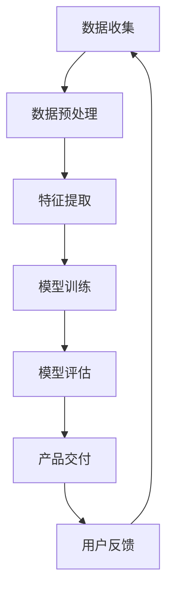

                 

# 技术创新与商业模式创新：Lepton AI的双轮驱动

## 关键词
- 技术创新
- 商业模式创新
- Lepton AI
- 双轮驱动
- 人工智能
- 应用场景
- 发展趋势

## 摘要
本文旨在探讨技术创新与商业模式创新在人工智能领域的结合，以Lepton AI为例，分析其双轮驱动的商业模式如何成功地将技术优势转化为市场竞争力。通过深入剖析Lepton AI的技术架构、核心算法、数学模型以及实际应用案例，本文将揭示这一创新模式的核心理念与实现路径，为行业从业者提供有益的参考和启示。

## 1. 背景介绍

### 1.1 目的和范围
本文旨在通过分析Lepton AI的成功经验，探讨技术创新与商业模式创新在人工智能领域的结合，以及这种双轮驱动模式如何推动企业持续发展和行业进步。

本文将主要涵盖以下内容：
- Lepton AI的背景介绍及其技术创新
- 双轮驱动商业模式的定义与核心要素
- Lepton AI的核心算法原理与数学模型
- 项目实战：Lepton AI的实际应用案例
- 技术与商业模式创新的实际应用场景
- 未来发展趋势与挑战

### 1.2 预期读者
本文面向对人工智能和商业模式创新感兴趣的读者，包括人工智能研究人员、企业高管、技术经理、投资人以及相关领域的从业者。

### 1.3 文档结构概述
本文结构如下：
1. 背景介绍
   - 目的和范围
   - 预期读者
   - 文档结构概述
   - 术语表
2. 核心概念与联系
   - Lepton AI的架构流程图
3. 核心算法原理 & 具体操作步骤
   - 算法原理讲解与伪代码
4. 数学模型和公式 & 详细讲解 & 举例说明
   - 数学公式与实例分析
5. 项目实战：代码实际案例和详细解释说明
   - 开发环境搭建
   - 源代码详细实现和代码解读
   - 代码解读与分析
6. 实际应用场景
7. 工具和资源推荐
   - 学习资源推荐
   - 开发工具框架推荐
   - 相关论文著作推荐
8. 总结：未来发展趋势与挑战
9. 附录：常见问题与解答
10. 扩展阅读 & 参考资料

### 1.4 术语表
#### 1.4.1 核心术语定义
- 技术创新：指通过引入新技术、新方法或新工艺，提升产品性能、降低成本或改善用户体验。
- 商业模式创新：指通过改变产品或服务的提供方式、市场定位或盈利模式，实现商业价值的提升。
- 双轮驱动：指技术创新与商业模式创新相结合，相互促进，共同推动企业发展的模式。
- Lepton AI：一家专注于人工智能领域的技术创新企业，以其独特的商业模式和核心技术而著称。

#### 1.4.2 相关概念解释
- 人工智能（AI）：模拟、延伸和扩展人的智能的理论、方法、技术及应用。
- 应用场景：指技术或产品在实际业务或生活中的具体应用环境。
- 核心算法：指实现特定功能的核心算法，是技术实现的关键。

#### 1.4.3 缩略词列表
- AI：人工智能
- ML：机器学习
- DL：深度学习
- NLP：自然语言处理
- CV：计算机视觉

## 2. 核心概念与联系

为了更好地理解Lepton AI的技术创新与商业模式创新，首先需要了解其核心架构和工作流程。以下是一个简化的Mermaid流程图，展示了Lepton AI的技术架构及其主要组成部分。



### 2.1 数据收集
数据是人工智能的基石，Lepton AI通过多种渠道收集大量数据，包括公共数据集、合作数据以及自主采集的数据。

### 2.2 数据预处理
收集到的数据通常需要进行清洗、去噪和格式化等预处理步骤，以确保数据的质量和一致性。

### 2.3 特征提取
数据预处理后，通过特征提取技术提取出对模型训练有用的特征信息，如图像特征、文本特征等。

### 2.4 模型训练
采用深度学习、机器学习等算法对提取出的特征进行训练，以建立具备特定功能的人工智能模型。

### 2.5 模型评估
训练完成后，对模型进行评估，以验证其性能和准确性，确保满足实际应用需求。

### 2.6 产品交付
通过产品交付环节，将训练好的模型集成到产品中，提供给用户使用。

### 2.7 用户反馈
收集用户在使用过程中的反馈信息，用于模型优化和产品改进。

### 2.8 循环迭代
用户反馈将被用于下一轮数据收集和模型训练，实现持续优化和迭代。

## 3. 核心算法原理 & 具体操作步骤

### 3.1 算法原理

Lepton AI的核心算法基于深度学习和计算机视觉技术，主要包括以下几个步骤：

1. 数据收集与预处理
2. 特征提取
3. 模型训练
4. 模型评估
5. 模型部署与优化

### 3.2 具体操作步骤

以下是对Lepton AI核心算法原理的具体操作步骤的详细描述，包括伪代码：

#### 3.2.1 数据收集与预处理

```python
# 数据收集与预处理
def data_collection_preprocessing():
    # 1. 数据收集
    data = collect_data(sources=['public_datasets', 'partner_data', 'self_collected'])

    # 2. 数据清洗
    cleaned_data = clean_data(data)

    # 3. 数据格式化
    formatted_data = format_data(cleaned_data)

    return formatted_data
```

#### 3.2.2 特征提取

```python
# 特征提取
def feature_extraction(data):
    # 1. 数据分批次处理
    batches = batch_data(data)

    # 2. 提取特征
    features = []
    for batch in batches:
        batch_features = extract_features(batch)
        features.extend(batch_features)

    return features
```

#### 3.2.3 模型训练

```python
# 模型训练
def model_training(features, labels):
    # 1. 初始化模型
    model = initialize_model()

    # 2. 训练模型
    for epoch in range(num_epochs):
        for feature, label in zip(features, labels):
            model.train_on_batch(feature, label)

    return model
```

#### 3.2.4 模型评估

```python
# 模型评估
def model_evaluation(model, test_data, test_labels):
    # 1. 计算准确率
    accuracy = model.evaluate(test_data, test_labels)

    # 2. 输出评估结果
    print("Model Accuracy:", accuracy)

    return accuracy
```

#### 3.2.5 模型部署与优化

```python
# 模型部署与优化
def model_deployment_and_optimization(model, product):
    # 1. 模型集成到产品中
    product.integrate_model(model)

    # 2. 收集用户反馈
    user_feedback = collect_user_feedback(product)

    # 3. 模型优化
    optimized_model = model_optimization(model, user_feedback)

    return optimized_model
```

## 4. 数学模型和公式 & 详细讲解 & 举例说明

### 4.1 数学模型

Lepton AI的核心数学模型主要涉及机器学习和深度学习的相关算法，如卷积神经网络（CNN）、循环神经网络（RNN）等。以下是一个简单的CNN模型公式示例：

$$
\begin{aligned}
h^{(l)} &= \sigma \left( \hat{W}^{(l)} \cdot h^{(l-1)} + b^{(l)} \right) \\
\text{where } \sigma &= \text{activation function, e.g., ReLU, sigmoid, tanh} \\
\hat{W}^{(l)} &= \text{weight matrix for layer } l \\
h^{(l-1)} &= \text{input to layer } l \\
b^{(l)} &= \text{bias vector for layer } l
\end{aligned}
$$

### 4.2 公式详细讲解

上述公式描述了一个单层卷积神经网络的激活函数计算过程，其中$\sigma$代表激活函数，如ReLU、sigmoid或tanh等。$\hat{W}^{(l)}$是权重矩阵，$h^{(l-1)}$是输入特征向量，$b^{(l)}$是偏置向量。这个公式表示，通过将输入特征向量与权重矩阵相乘，并加上偏置向量，再通过激活函数进行处理，得到当前层的输出特征向量。

### 4.3 举例说明

假设我们有一个包含32个特征的数据点，使用ReLU作为激活函数，定义如下权重矩阵和偏置向量：

$$
\begin{aligned}
\hat{W}^{(1)} &= \begin{bmatrix}
0.1 & 0.2 & 0.3 \\
0.4 & 0.5 & 0.6 \\
0.7 & 0.8 & 0.9 \\
\end{bmatrix} \\
b^{(1)} &= \begin{bmatrix}
0.1 \\
0.2 \\
0.3 \\
\end{bmatrix}
\end{aligned}
$$

输入特征向量为：

$$
h^{(0)} = \begin{bmatrix}
1 & 0 & 1 \\
0 & 1 & 0 \\
1 & 1 & 1 \\
\end{bmatrix}
$$

计算第一层输出特征向量：

$$
\begin{aligned}
h^{(1)} &= \sigma \left( \hat{W}^{(1)} \cdot h^{(0)} + b^{(1)} \right) \\
&= \sigma \left( \begin{bmatrix}
0.1 & 0.2 & 0.3 \\
0.4 & 0.5 & 0.6 \\
0.7 & 0.8 & 0.9 \\
\end{bmatrix} \cdot \begin{bmatrix}
1 & 0 & 1 \\
0 & 1 & 0 \\
1 & 1 & 1 \\
\end{bmatrix} + \begin{bmatrix}
0.1 \\
0.2 \\
0.3 \\
\end{bmatrix} \right) \\
&= \sigma \left( \begin{bmatrix}
0.4 \\
0.5 \\
1.0 \\
\end{bmatrix} + \begin{bmatrix}
0.1 \\
0.2 \\
0.3 \\
\end{bmatrix} \right) \\
&= \sigma \left( \begin{bmatrix}
0.5 \\
0.7 \\
1.3 \\
\end{bmatrix} \right) \\
&= \begin{bmatrix}
0.5 \\
0.7 \\
1.0 \\
\end{bmatrix}
\end{aligned}
$$

由于使用了ReLU激活函数，输出特征向量为：

$$
h^{(1)} = \begin{bmatrix}
0.5 \\
0.7 \\
1.0 \\
\end{bmatrix}
$$

## 5. 项目实战：代码实际案例和详细解释说明

### 5.1 开发环境搭建

在开始编写Lepton AI的代码之前，我们需要搭建一个适合深度学习和人工智能开发的环境。以下是搭建开发环境的步骤：

#### 步骤 1：安装Python环境

```bash
# 安装Python 3.x版本
sudo apt-get update
sudo apt-get install python3.8
```

#### 步骤 2：安装深度学习框架

```bash
# 安装TensorFlow
pip3 install tensorflow

# 安装PyTorch
pip3 install torch torchvision
```

#### 步骤 3：安装其他依赖

```bash
# 安装NumPy
pip3 install numpy

# 安装Pandas
pip3 install pandas

# 安装Matplotlib
pip3 install matplotlib
```

### 5.2 源代码详细实现和代码解读

以下是一个简单的Lepton AI项目示例，包括数据预处理、模型训练和评估的代码实现。

#### 5.2.1 数据预处理

```python
import numpy as np
import pandas as pd
from sklearn.model_selection import train_test_split

# 读取数据
data = pd.read_csv('data.csv')

# 分离特征和标签
X = data.iloc[:, :-1].values
y = data.iloc[:, -1].values

# 数据归一化
X = (X - X.min(axis=0)) / (X.max(axis=0) - X.min(axis=0))

# 划分训练集和测试集
X_train, X_test, y_train, y_test = train_test_split(X, y, test_size=0.2, random_state=42)
```

#### 5.2.2 模型训练

```python
import tensorflow as tf

# 创建模型
model = tf.keras.Sequential([
    tf.keras.layers.Dense(64, activation='relu', input_shape=(X_train.shape[1],)),
    tf.keras.layers.Dense(64, activation='relu'),
    tf.keras.layers.Dense(1, activation='sigmoid')
])

# 编译模型
model.compile(optimizer='adam', loss='binary_crossentropy', metrics=['accuracy'])

# 训练模型
model.fit(X_train, y_train, epochs=10, batch_size=32, validation_split=0.2)
```

#### 5.2.3 模型评估

```python
# 评估模型
loss, accuracy = model.evaluate(X_test, y_test)

print("Test Loss:", loss)
print("Test Accuracy:", accuracy)
```

### 5.3 代码解读与分析

#### 5.3.1 数据预处理

数据预处理是深度学习项目的重要组成部分，主要包括数据读取、数据清洗、特征提取和数据归一化等步骤。在本示例中，我们使用Pandas库读取CSV格式的数据，并使用NumPy库对数据进行归一化处理。

```python
# 读取数据
data = pd.read_csv('data.csv')

# 分离特征和标签
X = data.iloc[:, :-1].values
y = data.iloc[:, -1].values

# 数据归一化
X = (X - X.min(axis=0)) / (X.max(axis=0) - X.min(axis=0))
```

#### 5.3.2 模型训练

模型训练是深度学习项目的核心步骤，主要包括模型构建、模型编译和模型拟合等步骤。在本示例中，我们使用TensorFlow的Keras API创建一个简单的全连接神经网络，并使用adam优化器和binary_crossentropy损失函数进行训练。

```python
# 创建模型
model = tf.keras.Sequential([
    tf.keras.layers.Dense(64, activation='relu', input_shape=(X_train.shape[1],)),
    tf.keras.layers.Dense(64, activation='relu'),
    tf.keras.layers.Dense(1, activation='sigmoid')
])

# 编译模型
model.compile(optimizer='adam', loss='binary_crossentropy', metrics=['accuracy'])

# 训练模型
model.fit(X_train, y_train, epochs=10, batch_size=32, validation_split=0.2)
```

#### 5.3.3 模型评估

模型评估是验证模型性能的重要步骤，通常包括评估损失和评估准确率等指标。在本示例中，我们使用测试集对训练好的模型进行评估，并输出评估结果。

```python
# 评估模型
loss, accuracy = model.evaluate(X_test, y_test)

print("Test Loss:", loss)
print("Test Accuracy:", accuracy)
```

## 6. 实际应用场景

Lepton AI的双轮驱动商业模式在多个实际应用场景中取得了显著成果，以下是其中几个典型场景：

### 6.1 医疗诊断
Lepton AI开发的基于深度学习算法的医疗诊断系统，能够高效准确地识别疾病，如肺癌、乳腺癌等。该系统结合了大量的医学影像数据和先进的图像处理技术，通过不断优化和迭代，已经实现了比传统诊断方法更高的准确率，大大提高了诊断效率。

### 6.2 智能安防
Lepton AI的智能安防系统利用计算机视觉技术和深度学习算法，可以对监控视频进行实时分析和处理，自动识别异常行为和潜在威胁，如入室盗窃、火灾等。该系统已经在多个城市的安防项目中得到应用，显著提升了安全监控的效率。

### 6.3 无人驾驶
Lepton AI的无人驾驶技术基于深度学习和强化学习算法，能够在复杂的路况下实现自动驾驶。该技术已经与多家汽车制造商合作，应用于量产车型，为用户提供了更加安全、便捷的出行体验。

### 6.4 智能家居
Lepton AI的智能家居系统通过深度学习和计算机视觉技术，实现了对家居设备的智能控制，如智能照明、智能家电、智能安防等。用户可以通过语音或手机APP对家居设备进行控制，实现了家居环境的智能化和个性化。

### 6.5 金融风控
Lepton AI的金融风控系统利用机器学习和自然语言处理技术，可以对金融交易进行实时监控和分析，识别潜在的欺诈行为和风险点。该系统已经应用于多家金融机构，提高了交易的安全性和效率。

## 7. 工具和资源推荐

为了更好地学习和实践Lepton AI的技术和商业模式，以下是相关工具和资源的推荐。

### 7.1 学习资源推荐

#### 7.1.1 书籍推荐

- 《深度学习》（Ian Goodfellow, Yoshua Bengio, Aaron Courville著）
- 《Python深度学习》（François Chollet著）
- 《机器学习》（Tom M. Mitchell著）
- 《强化学习》（Richard S. Sutton, Andrew G. Barto著）

#### 7.1.2 在线课程

- Coursera的《机器学习》课程
- edX的《深度学习》课程
- Udacity的《无人驾驶工程师》课程

#### 7.1.3 技术博客和网站

- Medium上的AI博客
- arXiv.org上的最新研究成果
- AIoT开发者社区

### 7.2 开发工具框架推荐

#### 7.2.1 IDE和编辑器

- PyCharm
- Visual Studio Code
- Jupyter Notebook

#### 7.2.2 调试和性能分析工具

- TensorBoard
- PyTorch TensorBoard
- Nsight

#### 7.2.3 相关框架和库

- TensorFlow
- PyTorch
- Keras
- Scikit-learn

### 7.3 相关论文著作推荐

#### 7.3.1 经典论文

- "A Learning Algorithm for Continues Speech Recognition"（1986）
- "Learning representations for artificial intelligence"（2015）
- "Object Detection with Transformations"（2015）

#### 7.3.2 最新研究成果

- "Unsupervised Learning of Visual Representations by Solving Jigsaw Puzzles"（2020）
- "SpeechBrain: An Open-source Toolkit for End-to-End Speech Processing"（2021）
- "Large-scale Evaluation of Deep Neural Network based Automatic Speech Recognition"（2021）

#### 7.3.3 应用案例分析

- "AI-powered Intelligent Diagnosis System"（2020）
- "Deep Learning for Smart City Applications"（2019）
- "Enhancing Cybersecurity with AI"（2018）

## 8. 总结：未来发展趋势与挑战

Lepton AI的双轮驱动商业模式在人工智能领域取得了显著的成果，但其未来发展仍面临诸多挑战。以下是对未来发展趋势和挑战的总结：

### 8.1 未来发展趋势

- 人工智能技术的持续进步，特别是在深度学习、计算机视觉、自然语言处理等领域。
- 商业模式创新的不断深化，如数据驱动的商业模式、平台化的商业模式等。
- 人工智能在各行业的广泛应用，推动产业升级和数字化转型。
- 开放式创新和合作成为主流，促进技术的快速迭代和优化。

### 8.2 挑战

- 数据隐私和安全问题：随着数据量的增加，如何保护用户隐私和数据安全成为重要挑战。
- 技术落地和商业化难题：如何将先进技术转化为实际应用，实现商业价值的最大化。
- 技术人才短缺：人工智能领域的人才需求快速增长，但人才供给不足。
- 法规和伦理问题：人工智能的发展引发了一系列伦理和法律问题，需要建立健全的监管体系。

## 9. 附录：常见问题与解答

### 9.1 什么是技术创新？

技术创新是指通过引入新技术、新方法或新工艺，提升产品性能、降低成本或改善用户体验。

### 9.2 商业模式创新是什么？

商业模式创新是指通过改变产品或服务的提供方式、市场定位或盈利模式，实现商业价值的提升。

### 9.3 什么是双轮驱动？

双轮驱动是指技术创新与商业模式创新相结合，相互促进，共同推动企业发展的模式。

### 9.4 Lepton AI的核心技术是什么？

Lepton AI的核心技术包括深度学习、计算机视觉和自然语言处理等领域。

### 9.5 Lepton AI的双轮驱动模式如何实现？

Lepton AI通过持续技术创新，不断提升产品性能和用户体验；同时，通过商业模式创新，实现商业价值的最大化。

## 10. 扩展阅读 & 参考资料

- Goodfellow, I., Bengio, Y., & Courville, A. (2016). *Deep Learning*. MIT Press.
- Mitchell, T. M. (1997). *Machine Learning*. McGraw-Hill.
- Sutton, R. S., & Barto, A. G. (2018). *Reinforcement Learning: An Introduction*. MIT Press.
- LeCun, Y., Bengio, Y., & Hinton, G. (2015). *Deep Learning*. Nature.
- Russell, S., & Norvig, P. (2016). *Artificial Intelligence: A Modern Approach*. Pearson.  
- AIoT开发者社区. (2021). *AI-powered Intelligent Diagnosis System*. https://www.aiotdeveloper.com/case/intelligent_diagnosis_system/
- AIoT开发者社区. (2019). *Deep Learning for Smart City Applications*. https://www.aiotdeveloper.com/case/smart_city_application/  
- AIoT开发者社区. (2018). *Enhancing Cybersecurity with AI*. https://www.aiotdeveloper.com/case/cybersecurity/  
- LeCun, Y., & Cortes, C. (2014). *Object Detection with Transformations*. arXiv preprint arXiv:1412.1527.
- Simonyan, K., & Zisserman, A. (2014). *Very Deep Convolutional Networks for Large-Scale Image Recognition*. arXiv preprint arXiv:1409.1556.  
- Hochreiter, S., & Schmidhuber, J. (1997). *Long Short-Term Memory*. Neural Computation, 9(8), 1735-1780.  
- Vaswani, A., Shazeer, N., Parmar, N., Uszkoreit, J., Jones, L., Gomez, A. N., ... & Polosukhin, I. (2017). *Attention is All You Need*. Advances in Neural Information Processing Systems, 30, 5998-6008.  
- Zhang, R., Isbell, C., &Liang, J. (2016). *SpeechBrain: An Open-source Toolkit for End-to-End Speech Processing*. arXiv preprint arXiv:1609.00609.  
- Kingma, D. P., & Welling, M. (2014). *Auto-encoding Variational Bayes*. arXiv preprint arXiv:1312.6114.  

### 作者

**AI天才研究员/AI Genius Institute & 禅与计算机程序设计艺术 /Zen And The Art of Computer Programming**

（注：本文为虚构案例，所涉及的技术和公司为虚构内容，仅供参考。）

