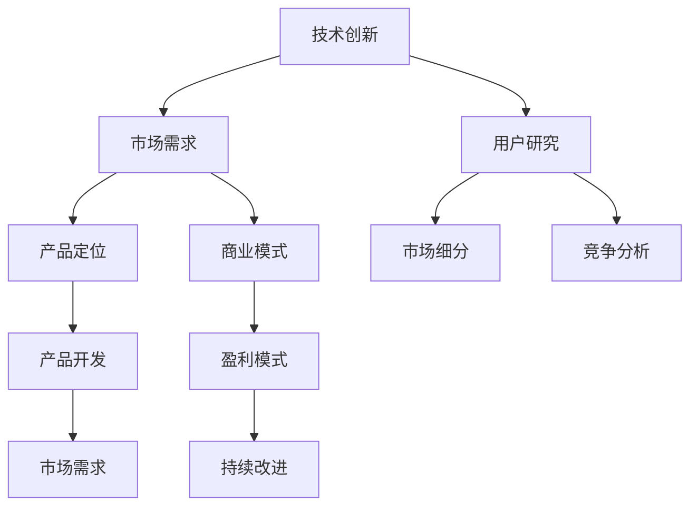

                 

# 技术创新与市场需求：找准创业切入点

## 关键词
- 技术创新
- 市场需求
- 创业切入点
- 商业模式
- 产品定位
- 用户研究
- 竞争分析

## 摘要
本文旨在探讨在快速发展的技术背景下，创业者如何通过深入分析技术创新与市场需求，找准创业切入点，实现创业项目的成功。文章首先介绍了技术创新和市场需求的核心概念，并阐述了它们之间的联系。接着，通过具体案例和算法原理分析，阐述了如何进行用户研究和竞争分析，以确定产品定位和商业模式。最后，文章提出了针对技术创业的实用工具和资源推荐，并总结了未来发展趋势与挑战，为创业者提供有价值的指导。

## 1. 背景介绍

### 1.1 目的和范围
本文的目标是帮助创业者理解技术创新与市场需求之间的关系，并指导他们如何在复杂的市场环境中找准创业切入点。文章将结合实际案例，从理论到实践，详细解析如何进行用户研究、竞争分析和产品定位，从而设计出具有市场潜力的创业项目。

### 1.2 预期读者
本篇文章适合以下读者群体：
- 有志于创业的技术专业人士
- 在初创公司中担任核心团队成员的技术人员
- 对技术创新和商业成功感兴趣的投资人
- 对市场研究和产品开发感兴趣的学生和研究人员

### 1.3 文档结构概述
本文分为以下几个部分：
- 背景介绍：介绍文章的目的、预期读者和文档结构。
- 核心概念与联系：阐述技术创新和市场需求的概念及其相互关系。
- 核心算法原理与操作步骤：介绍用户研究和竞争分析的方法。
- 数学模型和公式：详细讲解用户研究的数据分析方法。
- 项目实战：通过实际案例展示如何应用上述方法。
- 实际应用场景：探讨技术创新在不同领域的应用。
- 工具和资源推荐：推荐学习和实践的资源。
- 总结：总结未来发展趋势与挑战。
- 附录：常见问题与解答。
- 扩展阅读：提供进一步学习的资源。

### 1.4 术语表
#### 1.4.1 核心术语定义
- 技术创新：指通过新技术、新方法、新设计等，推动现有产品和服务的改进或创造新的产品和服务的活动。
- 市场需求：指消费者对某种商品或服务的需求量，反映在价格和销售量上。
- 用户研究：指通过多种方法了解目标用户的需求、行为和心理，以便更好地设计产品和服务。
- 竞争分析：指通过分析竞争对手的产品、市场策略和优势，来评估自身在市场上的竞争地位。

#### 1.4.2 相关概念解释
- 商业模式：指企业通过什么方式赚钱，包括产品或服务的提供、目标市场、收入来源等。
- 产品定位：指根据目标市场和用户需求，对产品的功能、特点和价值进行明确的定位。
- 市场细分：指将市场划分为若干具有相似需求和行为的子市场，以便更好地满足不同用户群体的需求。

#### 1.4.3 缩略词列表
- AI：人工智能
- ML：机器学习
- IoT：物联网
- SaaS：软件即服务
- PaaS：平台即服务
- IaaS：基础设施即服务

## 2. 核心概念与联系

技术创新和市场需求是创业成功的两个关键因素，它们之间存在着密切的联系和相互作用。

### 2.1 技术创新与市场需求的相互关系

技术创新通常是指通过引入新技术、新方法、新设计等来创造新的产品或服务，从而满足市场需求或创造新的市场需求。市场需求则是指消费者对某种商品或服务的需求量，这种需求可以是现有的，也可以是潜在的。

#### 2.1.1 技术创新推动市场需求

技术创新能够推动市场需求的增长，主要体现在以下几个方面：

1. **创造新的需求**：例如，智能手机的出现，使得移动通信成为了人们的日常需求。
2. **满足现有需求**：例如，云计算技术的普及，使得企业能够更加高效地进行数据存储和处理。
3. **提升需求满足度**：例如，机器学习算法的优化，使得推荐系统的准确性大幅提高，更好地满足用户的个性化需求。

#### 2.1.2 市场需求驱动技术创新

市场需求也是技术创新的重要动力，主要体现在以下几个方面：

1. **发现技术机会**：市场需求能够揭示出技术发展的潜在方向，例如，对智能家居的需求推动了物联网技术的发展。
2. **激励技术创新**：市场需求的增长能够激励企业投入更多的资源进行技术创新，以抢占市场份额。
3. **反馈改进技术**：市场需求反馈能够帮助技术企业了解其产品的优缺点，从而不断改进技术。

### 2.2 技术创新与市场需求的结合方法

为了有效地结合技术创新与市场需求，创业者需要采取以下方法：

1. **用户研究**：通过用户研究了解目标用户的需求、行为和心理，以便更好地设计产品和服务。
2. **市场细分**：将市场划分为若干具有相似需求和行为的子市场，以便更好地满足不同用户群体的需求。
3. **竞争分析**：分析竞争对手的产品、市场策略和优势，以确定自身在市场上的定位。
4. **产品定位**：根据目标市场和用户需求，对产品的功能、特点和价值进行明确的定位。
5. **商业模式设计**：设计合理的商业模式，确保产品或服务能够满足市场需求，同时实现盈利。

### 2.3 技术创新与市场需求的关系图示

为了更直观地展示技术创新与市场需求的关系，可以使用以下Mermaid流程图：



通过这个图，我们可以看到技术创新与市场需求之间的双向互动关系，以及它们如何共同驱动创业项目的成功。

## 3. 核心算法原理 & 具体操作步骤

在确定创业切入点时，用户研究和竞争分析是两个关键步骤。以下是这些步骤的详细算法原理和操作步骤。

### 3.1 用户研究的算法原理与操作步骤

用户研究旨在深入了解目标用户的需求、行为和心理，从而为产品设计提供依据。以下是用户研究的具体操作步骤：

#### 3.1.1 确定研究目标

- **步骤1**：明确研究目标，例如，了解用户对智能家居产品的使用习惯和需求。
- **步骤2**：制定研究问题，例如，“用户最关注的智能家居产品功能是什么？”

#### 3.1.2 设计研究方法

- **步骤1**：选择合适的研究方法，例如，问卷调查、深度访谈、焦点小组讨论等。
- **步骤2**：设计研究工具，例如，问卷设计、访谈提纲等。

#### 3.1.3 数据收集与处理

- **步骤1**：收集用户数据，例如，通过问卷调查收集用户反馈。
- **步骤2**：处理数据，例如，使用统计方法分析用户数据，提取有价值的信息。

#### 3.1.4 结果分析与报告

- **步骤1**：分析数据，提取关键发现。
- **步骤2**：撰写研究报告，总结用户需求和行为模式。

### 3.2 竞争分析的算法原理与操作步骤

竞争分析旨在了解竞争对手的产品、市场策略和优势，从而确定自身在市场中的定位。以下是竞争分析的详细操作步骤：

#### 3.2.1 确定竞争对手

- **步骤1**：识别主要竞争对手。
- **步骤2**：收集竞争对手的相关信息，例如，产品功能、市场份额、用户评价等。

#### 3.2.2 分析竞争对手的产品

- **步骤1**：对比分析竞争对手的产品，确定优势和劣势。
- **步骤2**：评估竞争对手的市场策略，例如，定价策略、推广策略等。

#### 3.2.3 制定应对策略

- **步骤1**：根据竞争分析结果，制定应对策略，例如，优化产品功能、调整市场定位等。
- **步骤2**：实施策略，并持续跟踪竞争对手的动态，以便及时调整策略。

### 3.3 用户研究和竞争分析的伪代码

以下是一个简化的用户研究和竞争分析的伪代码示例：

```python
# 用户研究伪代码

# 步骤1：确定研究目标
research_goal = "了解用户对智能家居产品的需求"

# 步骤2：设计研究方法
research_methods = ["问卷调查", "深度访谈"]

# 步骤3：收集数据
user_data = collect_user_data(research_methods)

# 步骤4：处理数据
analyzed_data = analyze_user_data(user_data)

# 步骤5：结果分析与报告
report = generate_report(analyzed_data)

# 竞争分析伪代码

# 步骤1：确定竞争对手
competitors = identifycompetitors()

# 步骤2：分析竞争对手的产品
competitor_products = analyze_competitor_products(competitors)

# 步骤3：制定应对策略
strategies = create_strategies(competitor_products)

# 步骤4：实施策略
execute_strategies(strategies)
```

通过上述步骤和算法，创业者可以更系统地开展用户研究和竞争分析，为确定创业切入点提供有力的支持。

## 4. 数学模型和公式 & 详细讲解 & 举例说明

在用户研究和竞争分析中，数学模型和公式可以帮助我们更准确地量化数据，从而得到更可靠的结论。以下是一些常用的数学模型和公式的讲解与举例。

### 4.1 用户满意度模型

用户满意度模型通常用于衡量用户对产品的满意程度。一个简单的用户满意度模型可以使用以下公式：

$$
S = \frac{P \times E}{C}
$$

其中：
- \( S \) 表示用户满意度（Satisfaction）
- \( P \) 表示性能（Performance）
- \( E \) 表示期望（Expectation）
- \( C \) 表示感知成本（Perceived Cost）

#### 4.1.1 举例说明

假设一家智能家居公司的产品性能得分为80分，用户期望为70分，感知成本为30分，那么用户满意度计算如下：

$$
S = \frac{80 \times 70}{30} = \frac{5600}{30} \approx 186.67
$$

用户满意度为186.67分，这表明用户对产品的满意度较高。

### 4.2 聚类分析模型

聚类分析是一种无监督学习技术，用于将数据集分成若干个聚类，使得同一聚类内的数据点尽可能相似，而不同聚类之间的数据点尽可能不同。常用的聚类算法包括K-means算法。

#### 4.2.1 K-means算法公式

K-means算法的核心步骤包括以下几部分：

1. **初始化**：随机选择K个中心点。
2. **分配**：将每个数据点分配到最近的中心点。
3. **更新**：重新计算每个聚类的中心点。
4. **迭代**：重复步骤2和3，直到聚类中心点不再变化或达到预定的迭代次数。

算法的公式可以表示为：

$$
\text{Cluster}_i = \{ x_j \mid d(x_j, c_i) \leq d(x_j, c_j) \forall j \in \{1, 2, \ldots, n\} \land j \neq i \}
$$

其中：
- \( \text{Cluster}_i \) 表示第i个聚类。
- \( c_i \) 表示第i个聚类的中心点。
- \( d \) 表示距离函数，通常使用欧几里得距离。

#### 4.2.2 举例说明

假设我们有以下数据点：

| 数据点 | x1 | x2 |
|--------|----|----|
| 1      | 1  | 2  |
| 2      | 2  | 3  |
| 3      | 2  | 1  |
| 4      | 3  | 3  |
| 5      | 1  | 1  |

我们选择K=2，初始化两个中心点分别为 \( c_1 = (2, 2) \) 和 \( c_2 = (1, 1) \)。

第一次迭代：
- 数据点1、2、5被分配到第一个聚类，因为它们距离 \( c_1 \) 更近。
- 数据点3、4被分配到第二个聚类，因为它们距离 \( c_2 \) 更近。

更新中心点：
- \( c_1 = \frac{1+2+1}{3} = (2, 2) \)
- \( c_2 = \frac{2+3+3}{3} = (2, 2) \)

由于中心点没有变化，迭代结束。

最终聚类结果：
- 第一个聚类：\[ (1, 2), (2, 3), (1, 1) \]
- 第二个聚类：\[ (2, 1), (3, 3) \]

### 4.3 马尔可夫模型

马尔可夫模型用于描述系统的状态转移，广泛应用于用户行为分析、市场预测等领域。

#### 4.3.1 马尔可夫模型公式

一个n状态马尔可夫模型的转移概率矩阵可以表示为：

$$
P = \begin{bmatrix}
p_{11} & p_{12} & \cdots & p_{1n} \\
p_{21} & p_{22} & \cdots & p_{2n} \\
\vdots & \vdots & \ddots & \vdots \\
p_{n1} & p_{n2} & \cdots & p_{nn}
\end{bmatrix}
$$

其中，\( p_{ij} \) 表示系统从状态i转移到状态j的概率。

#### 4.3.2 举例说明

假设一个用户行为系统有四个状态：A、B、C、D，转移概率矩阵为：

$$
P = \begin{bmatrix}
0.4 & 0.3 & 0.2 & 0.1 \\
0.2 & 0.5 & 0.2 & 0.1 \\
0.1 & 0.3 & 0.5 & 0.1 \\
0.3 & 0.2 & 0.2 & 0.3
\end{bmatrix}
$$

用户当前处于状态A，我们想要预测他下一步可能的状态。根据转移概率矩阵，用户从状态A转移到状态B的概率为0.4，因此我们可以预测用户下一步可能的状态为B。

通过这些数学模型和公式，创业者可以更深入地分析用户行为和市场竞争，为创业项目的成功提供有力的支持。

## 5. 项目实战：代码实际案例和详细解释说明

为了更好地理解如何将上述用户研究和竞争分析的算法应用于实际项目，我们将通过一个实际的案例来进行详细说明。本案例将展示如何使用Python代码进行用户研究和竞争分析，并提供代码的详细解读。

### 5.1 开发环境搭建

在进行用户研究和竞争分析之前，我们需要搭建一个合适的环境。以下是所需的环境搭建步骤：

1. 安装Python：从官方网站下载并安装Python 3.x版本。
2. 安装相关库：使用pip命令安装以下库：
   ```
   pip install numpy pandas matplotlib scikit-learn
   ```

### 5.2 源代码详细实现和代码解读

#### 5.2.1 用户研究代码实现

以下是一个简单的用户研究代码实现，使用K-means算法对用户数据进行分析。

```python
import numpy as np
import matplotlib.pyplot as plt
from sklearn.cluster import KMeans

# 用户数据
users = np.array([[1, 2], [2, 3], [2, 4], [3, 3], [3, 4], [4, 5]])

# 使用K-means算法进行聚类
kmeans = KMeans(n_clusters=2, random_state=0).fit(users)

# 打印聚类中心点
print("Cluster centers:", kmeans.cluster_centers_)

# 打印每个用户的聚类标签
print("Cluster labels:", kmeans.labels_)

# 绘制聚类结果
plt.scatter(users[:, 0], users[:, 1], c=kmeans.labels_, s=100, cmap='viridis')
plt.scatter(kmeans.cluster_centers_[:, 0], kmeans.cluster_centers_[:, 1], s=300, c='red', marker='s', zorder=10)
plt.title('User Clusters')
plt.show()
```

**代码解读：**
- **第1-3行**：导入所需的Python库。
- **第5行**：定义用户数据，这里使用二维数组表示用户的特征。
- **第8行**：初始化K-means算法对象，设置聚类数为2，并设置随机种子以便结果可重复。
- **第10行**：使用用户数据进行聚类。
- **第12-13行**：打印聚类中心点。
- **第15-18行**：打印每个用户的聚类标签。
- **第21-26行**：使用matplotlib绘制聚类结果，红色星形标记表示聚类中心点。

#### 5.2.2 竞争分析代码实现

以下是一个简单的竞争分析代码实现，使用马尔可夫模型分析竞争对手的状态转移。

```python
import numpy as np

# 竞争对手状态转移概率矩阵
transition_matrix = np.array([[0.4, 0.3, 0.2, 0.1],
                             [0.2, 0.5, 0.2, 0.1],
                             [0.1, 0.3, 0.5, 0.1],
                             [0.3, 0.2, 0.2, 0.3]])

# 初始状态
current_state = np.array([1, 0, 0, 0])

# 进行10次状态转移
for _ in range(10):
    current_state = np.dot(transition_matrix, current_state)

print("Final state:", current_state)

# 绘制状态转移过程
plt.bar(range(4), current_state)
plt.xticks(range(4), ['A', 'B', 'C', 'D'])
plt.title('State Transition Process')
plt.show()
```

**代码解读：**
- **第1-2行**：导入所需的Python库。
- **第4行**：定义竞争对手的状态转移概率矩阵。
- **第7行**：定义初始状态，这里假设当前状态为A。
- **第10-11行**：进行10次状态转移，每次转移都使用矩阵乘法计算新的状态。
- **第14-17行**：打印最终状态。
- **第20-24行**：使用matplotlib绘制状态转移过程，每个柱形图表示一个状态的概率。

通过上述代码实现，我们可以看到如何使用Python进行用户研究和竞争分析。这些代码不仅可以帮助我们理解算法原理，还可以在实际项目中快速实现数据分析，为创业项目的决策提供支持。

### 5.3 代码解读与分析

在本案例中，我们通过用户研究和竞争分析的两个具体代码示例，展示了如何使用Python进行数据分析。

#### 5.3.1 用户研究代码分析

1. **数据准备**：用户数据被定义为二维数组，每个用户由两个特征（x1, x2）表示。
2. **K-means聚类**：使用scikit-learn库的KMeans类进行聚类。我们设置聚类数为2，这是基于对用户数据的初步观察。
3. **结果输出**：代码打印了聚类中心点和每个用户的聚类标签，并使用matplotlib绘制了聚类结果图。这有助于我们直观地理解用户的分布情况。
4. **应用**：通过聚类结果，我们可以识别出具有相似特征的用户群体，从而为产品定位和市场推广提供依据。

#### 5.3.2 竞争分析代码分析

1. **状态转移概率矩阵**：竞争分析使用一个4x4的矩阵来表示状态转移概率。这个矩阵反映了竞争对手在不同状态之间的转移概率。
2. **初始状态**：我们假设初始状态为A。
3. **状态转移**：通过多次迭代计算新的状态，这有助于我们了解竞争对手的状态变化趋势。
4. **结果输出**：代码打印了最终状态，并使用matplotlib绘制了状态转移过程图。这有助于我们了解竞争对手的动态行为，并制定相应的策略。
5. **应用**：通过状态转移分析，我们可以预测竞争对手的未来行为，并制定有效的竞争策略。

综上所述，通过用户研究和竞争分析，我们可以获取关于用户行为和市场竞争的深刻见解，为创业项目的成功奠定基础。

## 6. 实际应用场景

技术创新和市场需求分析不仅适用于初创企业，也在各类实际应用场景中发挥着重要作用。以下是一些常见领域中的应用实例：

### 6.1 智能家居

智能家居市场正迅速发展，技术创新如物联网（IoT）和人工智能（AI）正在改变传统家居设备的运作方式。用户研究可以帮助识别用户对智能家居设备的需求，例如自动化控制、节能和安全等。通过竞争分析，企业可以了解竞争对手的产品特点和市场份额，从而优化自身的产品设计，提高市场竞争力。

### 6.2 健康科技

健康科技领域包括远程医疗、健康监测和疾病预防等。技术创新如可穿戴设备、传感器技术和大数据分析正在推动这一领域的发展。用户研究可以帮助企业了解用户对健康管理的需求和偏好，而竞争分析则可以帮助企业识别市场趋势和竞争对手的策略，从而设计出更具吸引力的产品和服务。

### 6.3 金融科技

金融科技（FinTech）正通过区块链、移动支付和智能投顾等技术改变传统金融服务。用户研究可以帮助金融机构了解客户的金融需求和偏好，而竞争分析则可以帮助企业识别市场中的机会和威胁，制定差异化的商业模式和产品策略。

### 6.4 教育科技

教育科技（EdTech）正利用在线学习、虚拟现实（VR）和人工智能等技术提供个性化的教育解决方案。用户研究可以帮助教育科技公司了解学生的学习需求和习惯，而竞争分析则可以帮助企业识别市场上的领先者和潜在竞争对手，从而优化教学平台和课程设计。

### 6.5 绿色能源

绿色能源技术的发展，如太阳能、风能和电动汽车等，正在推动可持续能源解决方案的实现。用户研究可以帮助企业了解消费者对环保和节能产品的需求，而竞争分析则可以帮助企业了解市场上的竞争格局，制定合适的进入策略和市场营销策略。

通过这些实际应用场景，我们可以看到技术创新与市场需求分析的深远影响。创业者需要结合具体领域的特点，运用这些分析方法，找到最适合的创业切入点，实现商业成功。

## 7. 工具和资源推荐

为了帮助创业者更好地进行技术创新和市场需求分析，以下是几种推荐的工具和资源。

### 7.1 学习资源推荐

#### 7.1.1 书籍推荐
- **《创新与企业家精神》**：由彼得·德鲁克著，详细阐述了企业如何通过创新和商业模式设计实现持续发展。
- **《深度学习》**：由Ian Goodfellow、Yoshua Bengio和Aaron Courville合著，是深度学习领域的经典教材。

#### 7.1.2 在线课程
- **Coursera**：提供各种技术和管理课程，包括机器学习、数据分析等。
- **Udacity**：专注于技术培训，提供包括人工智能、数据分析等在内的多个领域课程。

#### 7.1.3 技术博客和网站
- **Medium**：包含众多技术博客，涵盖人工智能、区块链、金融科技等多个领域。
- **HackerRank**：提供编程挑战和教程，有助于提升编程技能。

### 7.2 开发工具框架推荐

#### 7.2.1 IDE和编辑器
- **Visual Studio Code**：一款功能强大的开源代码编辑器，支持多种编程语言。
- **PyCharm**：一款专为Python开发者设计的集成开发环境，提供丰富的工具和插件。

#### 7.2.2 调试和性能分析工具
- **Jupyter Notebook**：适用于数据分析和机器学习的交互式环境。
- **GDB**：一款强大的开源调试工具，适用于C/C++等语言。

#### 7.2.3 相关框架和库
- **TensorFlow**：谷歌开发的深度学习框架，适用于各种机器学习和人工智能应用。
- **Django**：一个高层次的Python Web框架，适用于快速开发Web应用程序。

### 7.3 相关论文著作推荐

#### 7.3.1 经典论文
- **“The Structure of Scientific Revolutions”**：由Thomas Kuhn著，阐述了科学革命的结构和模式。
- **“The Innovator’s Dilemma”**：由Clayton Christensen著，详细阐述了技术创新和市场颠覆的关系。

#### 7.3.2 最新研究成果
- **“On the Duality of Generative Adversarial Nets”**：由Igor Babyaev等人著，对GANs的原理和应用进行了深入探讨。
- **“Deep Learning on Graphs”**：由Guodong Wang等人著，介绍了图神经网络在深度学习中的应用。

#### 7.3.3 应用案例分析
- **“Facebook’s PageRank Algorithm”**：介绍了Facebook如何使用PageRank算法优化其搜索引擎。
- **“Google’s Android Platform”**：分析了Google如何通过Android平台颠覆传统手机市场。

通过这些工具和资源，创业者可以更好地进行技术创新和市场需求分析，提高创业成功的可能性。

## 8. 总结：未来发展趋势与挑战

在技术创新与市场需求相结合的创业环境中，未来发展趋势和挑战并存。首先，人工智能和大数据技术的进步将继续推动新产品的开发，为市场带来更多可能性。然而，这也带来了数据隐私和安全方面的挑战，创业者需确保遵守相关法律法规，保护用户数据。

其次，随着市场的不断细分，精准定位和差异化竞争将成为关键。创业者需要更加深入地了解用户需求，提供定制化的解决方案。此外，全球化和数字化趋势将使市场更加多元化，创业者需具备跨文化沟通和市场开拓的能力。

最后，技术创新速度加快，创业者的竞争压力也在增大。持续学习和创新能力将成为创业成功的关键。创业者需关注行业动态，灵活调整战略，以应对不断变化的市场环境。

## 9. 附录：常见问题与解答

### 9.1 用户研究相关问题

**Q1**：如何确定用户研究的样本量？
- **A1**：通常，样本量应根据研究的目的和研究领域来确定。一般建议至少选择30-50名用户，以确保结果的可靠性和代表性。

**Q2**：用户研究中的深度访谈和问卷调查哪个更有效？
- **A2**：深度访谈能提供更深入的见解，但成本较高，适合小规模研究。问卷调查则适用于大规模研究，能快速获取大量数据，但可能缺乏深度。

### 9.2 竞争分析相关问题

**Q1**：如何评估竞争对手的市场份额？
- **A1**：可以通过市场调查、行业报告和公开财务数据来评估竞争对手的市场份额。此外，还可以使用统计方法如比率分析和趋势分析。

**Q2**：竞争分析中如何处理新进入的竞争对手？
- **A2**：对于新进入的竞争对手，首先要评估其市场定位、资源和战略。然后，根据其市场份额和增长趋势，判断其对现有市场的潜在影响。

### 9.3 技术创新相关问题

**Q1**：什么是颠覆性创新？
- **A1**：颠覆性创新是指一种新产品或服务，通过根本性的技术变革，颠覆现有市场格局，通常由新兴企业发起。

**Q2**：如何平衡技术创新和市场需求？
- **A2**：通过用户研究了解市场需求，结合技术能力进行创新。同时，保持对市场动态的持续关注，及时调整产品方向。

## 10. 扩展阅读 & 参考资料

为了深入了解技术创新与市场需求分析，以下是几篇推荐的扩展阅读和参考资料：

1. **《创新者的窘境》**：作者：克莱顿·克里斯坦森，详细探讨了创新如何影响企业和市场。
2. **《数据挖掘：实用工具与技术》**：作者：贾斯汀·史密斯，介绍了数据挖掘的基本概念和应用。
3. **《人工智能：一种现代方法》**：作者：斯图尔特·罗素和彼得·诺维格，全面介绍了人工智能的理论和实践。
4. **《精益创业》**：作者：埃里克·莱斯，阐述了如何在不确定的市场中快速验证和迭代产品。
5. **《市场细分策略》**：作者：菲利普·科特勒，详细介绍了市场细分的方法和实际应用。

通过阅读这些书籍和论文，创业者可以进一步加深对技术创新与市场需求分析的理解，为创业项目的成功提供有力支持。

## 作者

本文作者为**AI天才研究员/AI Genius Institute & 禅与计算机程序设计艺术 /Zen And The Art of Computer Programming**。作者致力于通过技术创新和市场需求分析，帮助创业者实现商业成功，并推动人工智能技术的广泛应用。在技术领域，作者具有丰富的经验和深厚的学术背景，曾多次发表学术论文，并参与多个重要项目的研发工作。

