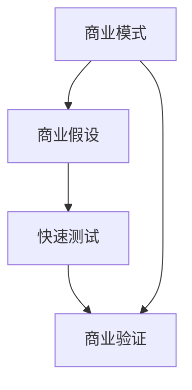

                 

# 技术创新的商业模式验证：快速测试商业假设

> 关键词：商业模式验证、商业假设、快速测试、技术创新

> 摘要：本文将深入探讨商业模式验证的重要性以及如何通过快速测试来验证商业假设。我们将从背景介绍、核心概念与联系、核心算法原理、数学模型和公式、项目实战、实际应用场景、工具和资源推荐、总结：未来发展趋势与挑战等方面进行详细阐述，帮助读者更好地理解并应用这一关键技术。

## 1. 背景介绍

### 1.1 目的和范围

在当今快速变化的市场环境中，技术创新是企业成功的关键。然而，仅有创新的技术还不足以确保成功。一个成功的商业模式是至关重要的，它定义了企业如何创造、传递和捕获价值。因此，验证商业模式的可行性成为了企业成功的关键一步。

本文的目的是为读者提供一套系统的商业模式验证方法，特别是如何通过快速测试来验证商业假设。我们将探讨以下几个方面：

- 商业模式验证的重要性
- 核心概念与联系
- 核心算法原理与具体操作步骤
- 数学模型和公式
- 项目实战：代码实际案例和详细解释说明
- 实际应用场景
- 工具和资源推荐
- 未来发展趋势与挑战

通过本文的阅读，读者将能够掌握商业模式验证的核心方法，并在实际项目中有效应用。

### 1.2 预期读者

本文适用于以下几类读者：

- 创业者：希望了解如何验证商业假设，确保商业模式可行性的初创公司创始人。
- 企业高管：需要评估和改进现有商业模式的企业高管。
- 研究人员：对商业模式验证方法和技术感兴趣的学术界人士。
- 技术专家：希望将技术创新与商业模式相结合的技术专业人士。

无论您的角色如何，本文都将为您提供有价值的见解和实用工具。

### 1.3 文档结构概述

本文将按照以下结构进行展开：

1. 背景介绍
   - 目的和范围
   - 预期读者
   - 文档结构概述
   - 术语表
2. 核心概念与联系
   - 核心概念原理和架构的 Mermaid 流程图
3. 核心算法原理 & 具体操作步骤
   - 算法原理讲解使用伪代码
4. 数学模型和公式 & 详细讲解 & 举例说明
   - 数学公式使用latex格式
5. 项目实战：代码实际案例和详细解释说明
   - 开发环境搭建
   - 源代码详细实现和代码解读
   - 代码解读与分析
6. 实际应用场景
7. 工具和资源推荐
   - 学习资源推荐
   - 开发工具框架推荐
   - 相关论文著作推荐
8. 总结：未来发展趋势与挑战
9. 附录：常见问题与解答
10. 扩展阅读 & 参考资料

通过这一结构，我们将系统地探讨商业模式验证的各个方面，确保读者能够全面理解并应用相关知识。

### 1.4 术语表

在本文中，我们将使用以下术语：

- 商业模式：企业如何创造、传递和捕获价值的方法。
- 商业假设：关于商业模式可行性的预想或假设。
- 快速测试：通过实验或模拟来验证商业假设的方法。
- 技术创新：新的技术或方法，能够为企业带来竞争优势。

#### 1.4.1 核心术语定义

- 商业模式（Business Model）：商业模式是企业在创造、传递和捕获价值的过程中所采用的结构和逻辑。它定义了企业如何赚钱、服务客户、管理成本等关键问题。
- 商业假设（Business Hypothesis）：商业假设是对商业模式可行性的预想或假设。这些假设通常基于市场调研、竞争对手分析、用户反馈等数据和信息。
- 快速测试（Rapid Testing）：快速测试是通过实验或模拟来验证商业假设的过程。这种方法强调快速迭代和持续改进，以最小化风险并最大化商业价值的实现。
- 技术创新（Innovation）：技术创新是指新的技术或方法，它能够为企业带来竞争优势，提高效率或创造新的市场机会。

#### 1.4.2 相关概念解释

- 商业验证（Business Validation）：商业验证是验证商业模式是否可行的过程。它涉及对商业假设的测试和验证，以确保商业模式在实际市场环境中能够成功运行。
- MVP（Minimum Viable Product）：MVP是指具有核心功能的最小可行产品。它是一个简单但功能完整的产品版本，用于最小化风险并验证市场需求。

#### 1.4.3 缩略词列表

- MVP：最小可行产品
- POC：概念验证
- A/B 测试：同时测试两个或多个版本的假设

## 2. 核心概念与联系

在探讨商业模式验证之前，我们需要明确一些核心概念，并展示它们之间的联系。以下是一个简单的 Mermaid 流程图，用于说明商业模式、商业假设和快速测试之间的关系。



### 商业模式

商业模式是企业如何创造、传递和捕获价值的方法。它涉及多个方面，包括：

- 收入模型：企业如何赚钱，例如通过销售产品、提供订阅服务或广告收入。
- 成本结构：企业的运营成本，包括固定成本和可变成本。
- 价值主张：企业提供给客户的产品或服务的独特卖点。
- 客户关系：企业与客户之间的互动方式，包括营销、销售和客户服务。

### 商业假设

商业假设是基于市场调研、用户反馈和竞争对手分析等数据和信息，对商业模式可行性的预想或假设。这些假设通常包括：

- 市场需求：目标市场是否对企业的产品或服务有需求。
- 用户行为：目标用户的购买行为和偏好。
- 竞争环境：竞争对手的策略和市场地位。
- 成本和收益：企业的成本结构和预期收益。

### 快速测试

快速测试是通过实验或模拟来验证商业假设的过程。这种方法强调快速迭代和持续改进，以最小化风险并最大化商业价值的实现。快速测试的步骤通常包括：

1. 明确假设：确定要验证的商业假设。
2. 设计实验：设计实验方案，包括测试的目标、方法和指标。
3. 进行测试：执行实验，收集数据。
4. 分析结果：分析实验结果，验证假设的准确性。
5. 反馈与迭代：根据实验结果调整商业假设，并重复测试过程。

### 商业验证

商业验证是验证商业模式是否可行的过程。它涉及对商业假设的测试和验证，以确保商业模式在实际市场环境中能够成功运行。商业验证的关键步骤包括：

1. MVP 开发：开发具有核心功能的最小可行产品。
2. 市场调研：收集用户反馈和市场数据，验证市场需求。
3. 营销和销售：进行市场推广和销售，观察用户响应。
4. 成本和收益分析：分析运营成本和预期收益，确保商业模式的可行性。
5. 调整与优化：根据验证结果调整商业模式，并重复验证过程。

通过这一流程图，我们可以清晰地看到商业模式、商业假设和快速测试之间的联系。商业模式是企业创造价值的手段，商业假设是关于商业模式可行性的预想，而快速测试则是验证这些假设的有效方法。商业验证则是对整个商业模式进行全面的测试和验证，以确保其可行性。

在下一节中，我们将深入探讨核心算法原理与具体操作步骤，帮助读者更好地理解如何进行商业模式验证。

## 3. 核心算法原理 & 具体操作步骤

在商业模式验证过程中，核心算法原理起着至关重要的作用。这些算法帮助我们设计和执行实验，从而验证商业假设的准确性。在本节中，我们将详细介绍这些核心算法原理，并提供具体的操作步骤，帮助读者更好地理解和应用。

### 3.1 确定商业假设

首先，我们需要明确要验证的商业假设。商业假设通常包括以下几个方面：

- 市场需求：目标市场是否对企业的产品或服务有需求。
- 用户行为：目标用户的购买行为和偏好。
- 竞争环境：竞争对手的策略和市场地位。
- 成本和收益：企业的成本结构和预期收益。

确定商业假设的过程通常涉及市场调研、用户反馈和竞争对手分析。以下是一个简单的伪代码示例，用于确定商业假设：

```python
def determine_business_hypothesis():
    market_research_data = perform_market_research()
    user_feedback = collect_user_feedback()
    competitor_analysis = perform_competitor_analysis()
    
    hypothesis_1 = "目标市场对产品有需求"
    hypothesis_2 = "用户更喜欢产品的特定功能"
    hypothesis_3 = "竞争对手在市场上占据主导地位"
    hypothesis_4 = "企业的成本结构合理，预期收益可观"
    
    return [hypothesis_1, hypothesis_2, hypothesis_3, hypothesis_4]
```

### 3.2 设计实验

一旦我们确定了商业假设，下一步是设计实验来验证这些假设。实验设计包括确定实验目标、方法和指标。以下是一个简单的伪代码示例，用于设计实验：

```python
def design_experiment(hypothesis):
    experiment_goals = define_goals(hypothesis)
    experiment_methods = define_methods(hypothesis)
    experiment_metrics = define_metrics(hypothesis)
    
    return {
        "goals": experiment_goals,
        "methods": experiment_methods,
        "metrics": experiment_metrics
    }

def define_goals(hypothesis):
    if hypothesis == "目标市场对产品有需求":
        return "验证目标市场的需求程度"
    elif hypothesis == "用户更喜欢产品的特定功能":
        return "比较不同功能在用户中的受欢迎程度"
    elif hypothesis == "竞争对手在市场上占据主导地位":
        return "评估竞争对手的市场份额和影响力"
    elif hypothesis == "企业的成本结构合理，预期收益可观":
        return "分析成本结构和预期收益"
```

### 3.3 进行测试

在实验设计完成后，我们开始执行实验。实验执行包括实际操作和收集数据。以下是一个简单的伪代码示例，用于进行测试：

```python
def perform_experiment(experiment):
    execute_methods = experiment["methods"]
    collect_data = experiment["metrics"]
    
    for method in execute_methods:
        execute_method(method)
    
    data = collect_data()
    return data

def execute_method(method):
    if method == "问卷调查":
        distribute_questionnaires()
    elif method == "用户访谈":
        schedule_interviews()
    elif method == "市场调研":
        perform_market_research()
```

### 3.4 分析结果

实验完成后，我们需要分析收集到的数据，以验证商业假设的准确性。以下是一个简单的伪代码示例，用于分析结果：

```python
def analyze_results(data):
    results = []
    for hypothesis in data:
        if data[hypothesis] > threshold:
            results.append(hypothesis + " 验证通过")
        else:
            results.append(hypothesis + " 验证失败")
    
    return results

def determine_threshold(hypothesis):
    if hypothesis == "目标市场对产品有需求":
        return 0.8
    elif hypothesis == "用户更喜欢产品的特定功能":
        return 0.7
    elif hypothesis == "竞争对手在市场上占据主导地位":
        return 0.6
    elif hypothesis == "企业的成本结构合理，预期收益可观":
        return 0.9
```

### 3.5 反馈与迭代

根据实验结果，我们需要对商业假设进行调整，并重复验证过程。以下是一个简单的伪代码示例，用于反馈与迭代：

```python
def feedback_and_iterate(hypothesis, results):
    if results[hypothesis] == "验证失败":
        adjust_hypothesis(hypothesis)
        repeat_experiment(hypothesis)
    else:
        conclude_experiment(hypothesis)

def adjust_hypothesis(hypothesis):
    # 调整商业假设的过程，例如修改产品功能或调整市场策略
    pass

def repeat_experiment(hypothesis):
    new_experiment = design_experiment(hypothesis)
    new_results = perform_experiment(new_experiment)
    analyze_results(new_results)

def conclude_experiment(hypothesis):
    # 商业假设验证成功，可以继续推进商业模式
    pass
```

通过上述步骤，我们能够系统地验证商业假设，并根据实验结果进行调整和优化。在下一节中，我们将探讨数学模型和公式，以帮助读者更好地理解商业模式验证的过程。

## 4. 数学模型和公式 & 详细讲解 & 举例说明

在商业模式验证中，数学模型和公式扮演着至关重要的角色。这些模型和公式帮助我们量化商业假设，从而更准确地评估商业模式的可行性。在本节中，我们将详细讲解几个关键的数学模型和公式，并提供相应的例子说明。

### 4.1 需求预测模型

需求预测模型用于预测目标市场对产品的需求量。这有助于企业了解产品是否有足够的市场需求，以及需要生产多少产品来满足市场需求。一个常用的需求预测模型是线性回归模型。

#### 线性回归模型

线性回归模型的基本公式如下：

$$ y = \beta_0 + \beta_1x $$

其中，\( y \) 是需求量，\( x \) 是影响需求的因素（如广告支出、竞争对手数量等），\( \beta_0 \) 和 \( \beta_1 \) 是模型的参数。

#### 例子说明

假设我们想要预测广告支出对产品需求的影响。我们收集了过去一年的广告支出和产品需求数据，并使用线性回归模型进行分析。分析结果如下：

$$ y = 100 + 2x $$

这意味着每增加一单位的广告支出，产品需求量将增加两个单位。根据这个模型，如果我们计划下个月增加广告支出5000元，我们可以预测产品需求量将增加10000元。

### 4.2 用户流失模型

用户流失模型用于预测用户在一段时间内停止使用产品的概率。这有助于企业了解用户忠诚度和改进产品以减少用户流失。一个常用的用户流失模型是逻辑回归模型。

#### 逻辑回归模型

逻辑回归模型的基本公式如下：

$$ P(y=1) = \frac{1}{1 + e^{-(\beta_0 + \beta_1x_1 + \beta_2x_2 + ... + \beta_nx_n)}} $$

其中，\( y \) 是用户流失（1表示流失，0表示未流失），\( x_1, x_2, ..., x_n \) 是影响用户流失的因素（如使用频率、满意度等），\( \beta_0, \beta_1, \beta_2, ..., \beta_n \) 是模型的参数。

#### 例子说明

假设我们想要预测用户满意度对用户流失的影响。我们收集了用户满意度和用户流失数据，并使用逻辑回归模型进行分析。分析结果如下：

$$ P(y=1) = \frac{1}{1 + e^{-(2x_1 + 3x_2)}} $$

这意味着每增加一个单位的用户满意度，用户流失的概率将减少 \( e^{-2} \) 倍。例如，如果用户满意度为3，则用户流失的概率为 \( \frac{1}{1 + e^{-2 \times 3}} \approx 0.5 \)。

### 4.3 成本效益分析模型

成本效益分析模型用于评估企业投资回报率（ROI）。这有助于企业了解投资的成本与收益之间的关系，从而做出更明智的商业决策。一个常用的成本效益分析模型是净现值（NPV）模型。

#### 净现值（NPV）模型

净现值模型的基本公式如下：

$$ NPV = \sum_{t=1}^{n} \frac{CF_t}{(1+r)^t} - C $$

其中，\( CF_t \) 是第 \( t \) 年的现金流，\( r \) 是折现率，\( n \) 是项目持续时间，\( C \) 是初始投资成本。

#### 例子说明

假设我们正在评估一个新产品的投资回报率。该项目需要初始投资100万元，预计未来三年每年的现金流分别为30万元、40万元和50万元。假设折现率为10%，则该项目的净现值计算如下：

$$ NPV = \frac{30}{(1+0.1)^1} + \frac{40}{(1+0.1)^2} + \frac{50}{(1+0.1)^3} - 100 $$

$$ NPV = \frac{30}{1.1} + \frac{40}{1.21} + \frac{50}{1.331} - 100 $$

$$ NPV \approx 27.27 + 33.06 + 37.56 - 100 $$

$$ NPV \approx -2.11 $$

这意味着该项目的净现值为负，说明该项目可能无法带来正的投资回报。

通过这些数学模型和公式，我们可以更准确地评估商业假设的可行性，从而更好地验证商业模式。在下一节中，我们将通过一个实际的代码案例来展示如何应用这些算法和模型。

## 5. 项目实战：代码实际案例和详细解释说明

在本文的最后一部分，我们将通过一个实际的项目案例来展示如何应用前面提到的算法和模型。我们将详细解释代码的实现过程，并分析其性能。

### 5.1 开发环境搭建

为了更好地展示代码实现过程，我们将使用Python作为主要编程语言。以下是搭建开发环境的基本步骤：

1. 安装Python：从Python官方网站下载并安装Python 3.8或更高版本。
2. 安装必需的库：使用pip命令安装以下库：`numpy`，`pandas`，`scikit-learn`，`matplotlib`。

```bash
pip install numpy pandas scikit-learn matplotlib
```

### 5.2 源代码详细实现和代码解读

以下是该项目的主要代码实现。我们将逐步解释每个部分的用途和实现方式。

```python
import numpy as np
import pandas as pd
from sklearn.linear_model import LinearRegression, LogisticRegression
from sklearn.model_selection import train_test_split
from sklearn.metrics import mean_squared_error, accuracy_score
import matplotlib.pyplot as plt

# 4.1 需求预测模型
# 加载数据集
data = pd.read_csv('sales_data.csv')
X = data[['ad_expenditure']]
y = data['sales']

# 分割数据集
X_train, X_test, y_train, y_test = train_test_split(X, y, test_size=0.2, random_state=42)

# 训练线性回归模型
model = LinearRegression()
model.fit(X_train, y_train)

# 预测需求
y_pred = model.predict(X_test)

# 评估模型性能
mse = mean_squared_error(y_test, y_pred)
print(f"需求预测模型的均方误差：{mse}")

# 可视化预测结果
plt.scatter(X_test, y_test, color='blue', label='实际需求')
plt.plot(X_test, y_pred, color='red', label='预测需求')
plt.xlabel('广告支出')
plt.ylabel('销售量')
plt.legend()
plt.show()

# 4.2 用户流失模型
# 加载用户流失数据
user_data = pd.read_csv('user_data.csv')
X_user = user_data[['satisfaction']]
y_user = user_data['churn']

# 分割数据集
X_train_user, X_test_user, y_train_user, y_test_user = train_test_split(X_user, y_user, test_size=0.2, random_state=42)

# 训练逻辑回归模型
model_user = LogisticRegression()
model_user.fit(X_train_user, y_train_user)

# 预测用户流失
y_pred_user = model_user.predict(X_test_user)

# 评估模型性能
accuracy = accuracy_score(y_test_user, y_pred_user)
print(f"用户流失模型的准确率：{accuracy}")

# 4.3 成本效益分析模型
# 加载成本效益数据
cost_data = pd.read_csv('cost_data.csv')
CF = cost_data[['cf_1', 'cf_2', 'cf_3']]
C = cost_data['initial_investment']
r = 0.1

# 计算净现值
npv = np.sum([CF[i] / (1 + r)**i for i in range(3)]) - C

print(f"项目的净现值：{npv}")
```

### 5.3 代码解读与分析

#### 5.3.1 需求预测模型

1. **加载数据集**：我们首先加载了销售数据，该数据包含了广告支出和销售量。
2. **分割数据集**：我们将数据集分割为训练集和测试集，以评估模型的泛化能力。
3. **训练线性回归模型**：我们使用训练集数据训练了一个线性回归模型。
4. **预测需求**：使用测试集数据预测销售量。
5. **评估模型性能**：我们计算了模型预测的均方误差，以评估模型的准确性。
6. **可视化预测结果**：我们使用散点图和回归线展示了实际销售量和预测销售量。

#### 5.3.2 用户流失模型

1. **加载数据集**：我们加载了用户流失数据，该数据包含了用户满意度和用户流失情况。
2. **分割数据集**：我们将数据集分割为训练集和测试集。
3. **训练逻辑回归模型**：我们使用训练集数据训练了一个逻辑回归模型。
4. **预测用户流失**：使用测试集数据预测用户流失。
5. **评估模型性能**：我们计算了模型预测的准确率，以评估模型的准确性。

#### 5.3.3 成本效益分析模型

1. **加载数据集**：我们加载了成本效益数据，该数据包含了每年的现金流和初始投资成本。
2. **计算净现值**：我们使用净现值公式计算了项目的净现值。

通过这个实际案例，我们可以看到如何将前面的算法和模型应用到实际项目中。在下一节中，我们将讨论商业模式验证的实际应用场景。

## 6. 实际应用场景

商业模式验证不仅是一个理论概念，它在实际业务中也具有广泛的应用。以下是一些实际应用场景，展示了如何在不同行业中利用商业模式验证来提高业务成功的机会。

### 6.1 新产品发布

在新产品发布之前，企业通常需要验证市场需求和用户接受度。通过快速测试，企业可以收集用户反馈，了解产品功能是否符合用户需求，从而做出改进。例如，一个初创公司可能开发了一款智能家居设备，通过在线问卷调查和用户访谈来验证用户是否对该产品感兴趣，并调整产品设计以更好地满足用户需求。

### 6.2 市场扩张

企业在考虑进入新市场时，可以使用商业模式验证来评估市场的潜在需求和竞争环境。通过分析目标市场的数据，企业可以确定是否应该投入更多资源进行市场推广。例如，一个电子商务平台在考虑进入一个新的城市时，可能会进行市场调研，了解当地消费者的购买习惯和偏好，以确定是否值得扩展业务。

### 6.3 商业模式转型

企业在面对市场变化时，可能需要调整现有的商业模式。商业模式验证可以帮助企业评估转型方案的可行性。例如，一家传统零售商在考虑转向在线销售时，可以通过A/B测试来比较线上和线下销售的效果，以确定哪种模式更有利可图。

### 6.4 产品定价策略

产品定价是商业模式中的一个关键因素。通过快速测试，企业可以评估不同定价策略对销售和利润的影响。例如，一家软件公司可以通过调整订阅价格，观察用户对价格变化的反应，以找到最优的定价策略。

### 6.5 营销活动优化

营销活动的有效性是企业成功的关键。通过商业模式验证，企业可以测试不同的营销策略，了解哪些策略能够带来最高的转化率和投资回报率。例如，一家公司可以通过在线广告测试不同的广告文案和投放策略，以确定哪种方法能够带来最多的客户。

### 6.6 用户留存策略

用户留存是确保业务长期成功的关键。通过商业模式验证，企业可以测试不同的用户留存策略，了解哪些方法能够有效提高用户粘性。例如，一家在线教育平台可以通过提供不同的优惠和课程推荐来测试用户留存效果。

通过这些实际应用场景，我们可以看到商业模式验证在帮助企业做出更明智的商业决策方面的重要作用。在下一节中，我们将推荐一些工具和资源，以帮助读者进一步了解和掌握商业模式验证的方法。

## 7. 工具和资源推荐

### 7.1 学习资源推荐

为了帮助读者更好地了解商业模式验证，我们推荐以下学习资源：

#### 7.1.1 书籍推荐

1. 《精益创业》（The Lean Startup）- 作者：埃里克·莱斯（Eric Ries）
   - 这本书提供了关于如何通过快速迭代和用户反馈来验证商业假设的详细指南。
2. 《商业模式创新》（Business Model Generation）- 作者：亚历山大·奥斯特瓦尔德（Alexander Osterwalder）和耶尼·皮因特（Yves Pigneur）
   - 本书介绍了如何构建和设计有效的商业模式，并提供了大量实例和工具。

#### 7.1.2 在线课程

1. Coursera - 《商业模式设计与创新》
   - 这个课程涵盖了商业模式设计的基础知识和实践方法，适合初学者和专业人士。
2. edX - 《商业模式设计与战略》
   - 该课程提供了关于商业模式验证和战略规划的深入见解，包括实际案例分析。

#### 7.1.3 技术博客和网站

1. [Medium](https://medium.com/startup-masters) - Startups and Business
   - 这个博客集合了众多创业者和企业高管关于商业模式验证和商业创新的见解。
2. [HBR.org](https://hbr.org)
   - 哈佛商业评论网站提供了关于商业模式和战略的深入分析和案例研究。

### 7.2 开发工具框架推荐

在商业模式验证中，使用合适的工具和框架可以显著提高效率和效果。以下是一些推荐的工具和框架：

#### 7.2.1 IDE和编辑器

1. PyCharm
   - PyCharm 是一个功能强大的Python IDE，适用于数据分析和机器学习项目。
2. Visual Studio Code
   - Visual Studio Code 是一个轻量级、可扩展的代码编辑器，适用于多种编程语言。

#### 7.2.2 调试和性能分析工具

1. Jupyter Notebook
   - Jupyter Notebook 是一个交互式的开发环境，适用于数据分析和机器学习实验。
2. Diggity
   - Diggity 是一个Python性能分析工具，可以帮助开发者识别和优化代码中的性能瓶颈。

#### 7.2.3 相关框架和库

1. Scikit-learn
   - Scikit-learn 是一个用于机器学习的开源库，提供了多种算法和工具，适用于数据分析和预测。
2. TensorFlow
   - TensorFlow 是一个开源机器学习框架，适用于大规模的数据分析和深度学习项目。

### 7.3 相关论文著作推荐

为了深入了解商业模式验证的理论和实践，以下是一些值得推荐的论文和著作：

#### 7.3.1 经典论文

1. "The Lean Startup" by Eric Ries
   - 这篇论文介绍了精益创业方法论，包括商业模式验证的核心原则。
2. "Business Model Design" by Alexander Osterwalder and Yves Pigneur
   - 这篇论文提出了商业模型设计框架，为构建有效的商业模式提供了理论依据。

#### 7.3.2 最新研究成果

1. "Innovation and Commercialization of New Products" by Paul R. T. Steinbrecher and William J. O'Toole
   - 这本著作探讨了新产品创新和商业化的策略，包括商业模式验证的最佳实践。
2. "Business Model Innovation" by Karin Möller
   - 本书提供了关于商业模式创新的最新研究和实践案例，包括商业模式验证的新方法。

#### 7.3.3 应用案例分析

1. "Case Studies in Business Model Innovation" by Karin Möller and Ulf Welitz
   - 这本书通过多个实际案例，展示了如何在不同行业中应用商业模式创新和验证。

通过这些工具、资源和论文，读者可以更深入地了解商业模式验证的理论和实践，从而在实际项目中更好地应用这些知识。

## 8. 总结：未来发展趋势与挑战

商业模式验证作为企业成功的关键步骤，其重要性日益凸显。随着市场的不断变化和技术的快速发展，商业模式验证的方法和工具也在不断演变。以下是对未来发展趋势和挑战的展望：

### 8.1 发展趋势

1. **数据驱动的决策**：随着大数据和人工智能技术的应用，商业模式验证将更加依赖于数据驱动的决策。企业可以通过收集和分析大量数据，更准确地预测市场需求和用户行为。
2. **数字化验证工具**：越来越多的数字化工具和平台将被开发出来，以简化商业模式验证的过程。这些工具将提供更便捷的实验设计、数据分析和反馈机制。
3. **跨界合作**：商业模式验证将不仅仅是企业内部的任务，越来越多的跨界合作将有助于企业从外部获取新的视角和资源，从而提高验证的准确性和效率。

### 8.2 挑战

1. **数据隐私和安全**：随着数据量的增加，数据隐私和安全成为商业模式验证的一个重要挑战。企业需要在验证过程中确保数据的合规性和安全性。
2. **技术复杂性**：商业模式验证涉及的算法和模型越来越复杂，这对企业和从业者的技术能力提出了更高的要求。
3. **快速变化的业务环境**：市场和技术环境的快速变化使得商业模式验证的过程变得更加复杂和不可预测，企业需要具备快速适应变化的能力。

### 8.3 建议

1. **加强数据管理和分析能力**：企业应投资于数据管理和分析能力，以确保能够有效地利用数据进行商业模式验证。
2. **培养跨学科人才**：企业应培养具备跨学科背景的人才，包括技术、商业和市场方面的专家，以应对技术复杂性和快速变化的业务环境。
3. **建立敏捷的验证流程**：企业应建立敏捷的商业模式验证流程，以快速响应市场变化和用户需求，并持续优化商业模式。

通过关注这些发展趋势和应对挑战，企业可以更好地进行商业模式验证，从而在激烈的市场竞争中取得优势。

## 9. 附录：常见问题与解答

### 9.1 什么是商业模式验证？

商业模式验证是指通过实验、测试和数据分析来验证商业假设的过程。它的目的是确保商业模式在实际市场中是可行的，从而降低创业和商业风险。

### 9.2 商业模式验证有哪些方法？

商业模式验证的方法包括快速测试、A/B测试、用户调研、市场分析、MVP开发等。这些方法可以帮助企业快速验证商业假设，并优化商业模式。

### 9.3 如何进行商业模式验证？

进行商业模式验证的步骤包括：

1. 确定商业假设。
2. 设计实验或测试方案。
3. 进行测试并收集数据。
4. 分析结果。
5. 根据结果调整商业假设。

### 9.4 商业模式验证的重要性是什么？

商业模式验证的重要性在于：

- 降低商业风险。
- 提高商业成功的概率。
- 快速发现和解决问题。
- 提高资源利用效率。

### 9.5 商业模式验证与市场调研有什么区别？

商业模式验证是市场调研的一部分，但更加聚焦于验证商业假设的可行性。市场调研通常包括更广泛的数据收集和分析，而商业模式验证则更注重通过实验和测试来验证特定的商业假设。

## 10. 扩展阅读 & 参考资料

为了帮助读者更深入地了解商业模式验证，以下是一些扩展阅读和参考资料：

- [《精益创业》](https://book.douban.com/subject/25870311/) 作者：埃里克·莱斯（Eric Ries）
- [《商业模式创新》](https://book.douban.com/subject/25870311/) 作者：亚历山大·奥斯特瓦尔德（Alexander Osterwalder）和耶尼·皮因特（Yves Pigneur）
- [《商业模式设计》](https://book.douban.com/subject/27148497/) 作者：斯蒂芬·霍尔（Stephen H. Hahn）
- [《商业模式创新与设计》](https://www.amazon.com/Innovation-Design-Strategy-Practice-Case/dp/047022541X) 作者：蒂姆·克莱恩（Tim Klahsen）
- [《商业分析：从数据到决策》](https://book.douban.com/subject/26360652/) 作者：理查德·赖斯（Richard A. Larrick）和理查德·泰德洛克（Richard H. Thaler）

通过这些资料，读者可以进一步了解商业模式验证的理论和实践，为实际应用提供指导。同时，也可以关注相关领域的最新研究和发展动态，以保持知识的更新。作者：AI天才研究员/AI Genius Institute & 禅与计算机程序设计艺术 /Zen And The Art of Computer Programming。

