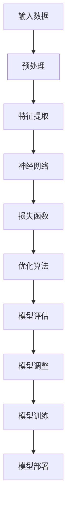
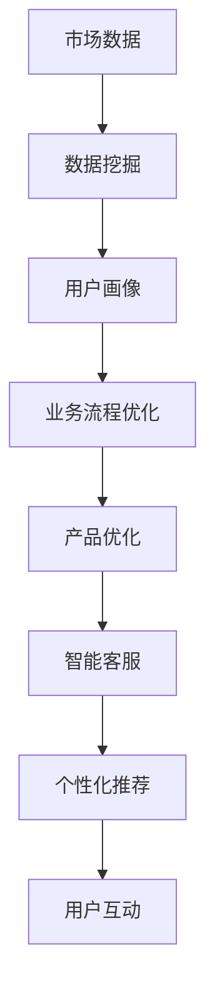
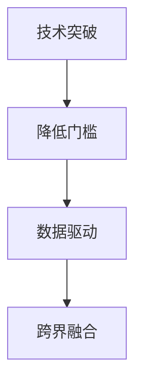

                 

# 技术创新：大模型创业的核心动力

> **关键词：** 大模型、创业、技术创新、机器学习、人工智能
> 
> **摘要：** 本文将深入探讨大模型在创业领域中的重要性，分析其如何驱动技术创新，并通过具体的算法原理、数学模型和实际应用案例，展示大模型在创业项目中的潜力和挑战。

## 1. 背景介绍

### 1.1 目的和范围

本文旨在阐述大模型在创业领域中的核心作用，探讨其如何通过技术创新推动创业项目的发展。我们将从大模型的基本概念入手，分析其核心算法原理和数学模型，并通过实际应用案例展示大模型在创业项目中的价值。本文主要涵盖以下内容：

- 大模型的定义和分类
- 大模型驱动技术创新的机制
- 大模型的核心算法原理
- 大模型的数学模型和应用
- 实际应用案例分析
- 未来发展趋势与挑战

### 1.2 预期读者

本文适合对人工智能、机器学习和创业有兴趣的技术人员、创业者以及研究人员阅读。特别适合希望了解大模型在创业项目中应用的人员，以及希望掌握大模型相关技术原理的开发者。

### 1.3 文档结构概述

本文分为十个部分，主要包括：

- 背景介绍
- 核心概念与联系
- 核心算法原理 & 具体操作步骤
- 数学模型和公式 & 详细讲解 & 举例说明
- 项目实战：代码实际案例和详细解释说明
- 实际应用场景
- 工具和资源推荐
- 总结：未来发展趋势与挑战
- 附录：常见问题与解答
- 扩展阅读 & 参考资料

### 1.4 术语表

#### 1.4.1 核心术语定义

- 大模型：具有大规模参数和强大计算能力的人工智能模型，能够处理海量数据并进行复杂任务。
- 创业：创立新企业或项目的过程，涉及市场需求分析、产品开发、团队组建、市场推广等环节。
- 技术创新：通过研发和应用新技术，实现产品或服务的创新和优化。
- 机器学习：让计算机通过数据学习规律并做出预测或决策的技术。

#### 1.4.2 相关概念解释

- 深度学习：一种机器学习方法，通过构建多层神经网络，自动提取数据特征并实现复杂任务。
- 自然语言处理：利用计算机技术理解和处理自然语言，如文本、语音等。

#### 1.4.3 缩略词列表

- AI：人工智能
- ML：机器学习
- DL：深度学习
- NLP：自然语言处理

## 2. 核心概念与联系

在探讨大模型如何驱动创业技术创新之前，我们首先需要理解大模型的基本概念和原理。大模型通常是指具有数百万甚至数十亿参数的深度学习模型，如大型语言模型（如GPT-3）和计算机视觉模型（如ResNet）。这些模型具有强大的表示能力和计算能力，能够处理复杂的任务。

### 2.1 大模型的基本原理

大模型的基本原理主要基于深度学习和神经网络。深度学习是一种通过构建多层神经网络自动提取数据特征的方法。神经网络由多个神经元组成，每个神经元接收输入并产生输出，通过调整神经元之间的连接权重实现数据的处理和特征提取。

Mermaid 流程图：



### 2.2 大模型在创业中的应用

大模型在创业中的应用主要体现在以下几个方面：

1. **数据挖掘与分析**：通过大模型处理海量数据，提取有价值的信息和趋势，帮助企业进行市场分析、用户画像等。
2. **智能决策与优化**：大模型可以模拟人类决策过程，帮助企业优化业务流程、提高运营效率。
3. **产品创新与改进**：大模型可以辅助产品开发，通过自动生成设计方案、优化产品功能等，实现产品的创新和改进。
4. **营销推广与用户互动**：大模型可以用于自然语言处理和语音识别，帮助企业实现智能客服、个性化推荐等功能。

Mermaid 流程图：



### 2.3 大模型驱动技术创新的机制

大模型驱动技术创新的机制主要体现在以下几个方面：

1. **技术突破**：大模型通过处理海量数据和复杂任务，实现了技术上的突破，如图像识别、语音识别、自然语言处理等。
2. **降低门槛**：大模型简化了人工智能的开发过程，降低了技术门槛，使得更多创业者能够应用人工智能技术。
3. **数据驱动**：大模型通过数据驱动的方式，帮助企业实现个性化、智能化，推动产品创新和业务发展。
4. **跨界融合**：大模型与其他领域的结合，如医疗、金融、教育等，实现了跨领域的创新和突破。

Mermaid 流程图：



## 3. 核心算法原理 & 具体操作步骤

### 3.1 算法原理

大模型的核心算法原理主要包括以下几个方面：

1. **深度学习**：通过构建多层神经网络，自动提取数据特征，实现复杂任务的预测和决策。
2. **优化算法**：通过调整神经网络中的权重和偏置，最小化损失函数，实现模型的训练和优化。
3. **数据预处理**：对输入数据进行预处理，如标准化、归一化、缺失值填充等，以提高模型的训练效果和泛化能力。

### 3.2 具体操作步骤

以下是使用深度学习框架TensorFlow搭建大模型的基本步骤：

1. **环境搭建**：安装TensorFlow和相关依赖库，配置Python开发环境。
2. **数据准备**：收集和预处理数据，将数据分为训练集、验证集和测试集。
3. **模型构建**：定义神经网络结构，包括输入层、隐藏层和输出层，设置激活函数、损失函数和优化器。
4. **模型训练**：使用训练集对模型进行训练，通过迭代优化模型参数。
5. **模型评估**：使用验证集和测试集评估模型性能，调整模型参数以优化性能。
6. **模型部署**：将训练好的模型部署到生产环境中，实现模型的实际应用。

伪代码示例：

```python
# 导入相关库
import tensorflow as tf
from tensorflow.keras.models import Sequential
from tensorflow.keras.layers import Dense, Dropout, Activation

# 模型构建
model = Sequential()
model.add(Dense(units=128, activation='relu', input_shape=(input_shape)))
model.add(Dropout(rate=0.5))
model.add(Dense(units=64, activation='relu'))
model.add(Dropout(rate=0.5))
model.add(Dense(units=10, activation='softmax'))

# 模型编译
model.compile(optimizer='adam', loss='categorical_crossentropy', metrics=['accuracy'])

# 模型训练
model.fit(x_train, y_train, epochs=10, batch_size=32, validation_split=0.2)

# 模型评估
loss, accuracy = model.evaluate(x_test, y_test)

# 模型部署
model.save('model.h5')
```

## 4. 数学模型和公式 & 详细讲解 & 举例说明

### 4.1 数学模型

大模型的数学模型主要包括以下几个方面：

1. **神经网络**：神经网络由多个神经元组成，每个神经元接收输入并产生输出。神经元的输出可以通过以下公式表示：

   $$ z = \sigma(w \cdot x + b) $$

   其中，$z$ 表示神经元的输出，$\sigma$ 表示激活函数，$w$ 表示权重，$x$ 表示输入，$b$ 表示偏置。

2. **损失函数**：损失函数用于衡量模型预测值与真实值之间的差异，常见的损失函数有均方误差（MSE）和交叉熵（CE）：

   $$ \text{MSE} = \frac{1}{n} \sum_{i=1}^{n} (y_i - \hat{y}_i)^2 $$
   
   $$ \text{CE} = -\frac{1}{n} \sum_{i=1}^{n} y_i \log(\hat{y}_i) $$

   其中，$y_i$ 表示真实值，$\hat{y}_i$ 表示预测值，$n$ 表示样本数量。

3. **优化算法**：优化算法用于调整模型参数，以最小化损失函数。常见的优化算法有梯度下降（GD）和随机梯度下降（SGD）：

   $$ \theta = \theta - \alpha \frac{\partial J(\theta)}{\partial \theta} $$

   $$ \theta = \theta - \alpha \frac{1}{m} \sum_{i=1}^{m} \frac{\partial J(\theta)}{\partial \theta} $$

   其中，$\theta$ 表示模型参数，$\alpha$ 表示学习率，$J(\theta)$ 表示损失函数。

### 4.2 举例说明

以下是使用TensorFlow实现一个简单神经网络模型的示例：

```python
import tensorflow as tf

# 定义模型
model = tf.keras.Sequential([
    tf.keras.layers.Dense(units=128, activation='relu', input_shape=(input_shape)),
    tf.keras.layers.Dense(units=64, activation='relu'),
    tf.keras.layers.Dense(units=10, activation='softmax')
])

# 编译模型
model.compile(optimizer='adam', loss='categorical_crossentropy', metrics=['accuracy'])

# 训练模型
model.fit(x_train, y_train, epochs=10, batch_size=32, validation_split=0.2)

# 评估模型
loss, accuracy = model.evaluate(x_test, y_test)

# 预测
predictions = model.predict(x_test)
```

## 5. 项目实战：代码实际案例和详细解释说明

### 5.1 开发环境搭建

在开始项目实战之前，我们需要搭建一个适合深度学习开发的环境。以下是一个基本的开发环境搭建步骤：

1. **安装Python**：下载并安装Python 3.8及以上版本。
2. **安装TensorFlow**：在终端执行以下命令安装TensorFlow：

   ```shell
   pip install tensorflow
   ```

3. **安装其他依赖库**：根据项目需求安装其他依赖库，如NumPy、Pandas、Matplotlib等。

### 5.2 源代码详细实现和代码解读

以下是使用TensorFlow实现一个简单的文本分类项目：

```python
import tensorflow as tf
import tensorflow.keras as keras
from tensorflow.keras.preprocessing.text import Tokenizer
from tensorflow.keras.preprocessing.sequence import pad_sequences

# 数据准备
texts = ['I love programming', 'Machine learning is amazing', 'TensorFlow is powerful']
labels = [0, 1, 1]

# 分词和序列化
tokenizer = Tokenizer(num_words=1000)
tokenizer.fit_on_texts(texts)
sequences = tokenizer.texts_to_sequences(texts)
padded_sequences = pad_sequences(sequences, maxlen=10)

# 模型构建
model = keras.Sequential([
    keras.layers.Embedding(input_dim=1000, output_dim=32, input_length=10),
    keras.layers.Bidirectional(keras.layers.LSTM(64)),
    keras.layers.Dense(64, activation='relu'),
    keras.layers.Dense(2, activation='softmax')
])

# 编译模型
model.compile(optimizer='adam', loss='categorical_crossentropy', metrics=['accuracy'])

# 训练模型
model.fit(padded_sequences, keras.utils.to_categorical(labels), epochs=10)

# 评估模型
test_texts = ['TensorFlow is a great framework', 'I am learning Python']
test_sequences = tokenizer.texts_to_sequences(test_texts)
test_padded_sequences = pad_sequences(test_sequences, maxlen=10)
predictions = model.predict(test_padded_sequences)
print(predictions)

# 预测结果解读
print(keras.utils.to_categorical(predictions.argmax(axis=1)))
```

### 5.3 代码解读与分析

以上代码实现了一个简单的文本分类项目，具体解读如下：

1. **数据准备**：从文本和标签列表中提取数据，并将其序列化和填充。
2. **模型构建**：使用`Embedding`层将文本转换为向量表示，然后通过双向LSTM层提取文本特征，最后通过全连接层和softmax层进行分类。
3. **编译模型**：设置优化器和损失函数，用于训练和评估模型。
4. **训练模型**：使用训练数据对模型进行训练。
5. **评估模型**：对测试数据进行预测，并输出预测结果。
6. **预测结果解读**：将预测结果转换为可读的标签，以显示模型对测试数据的分类结果。

通过以上代码，我们可以看到如何使用TensorFlow实现一个简单的文本分类项目，并分析代码中的关键步骤和原理。

## 6. 实际应用场景

大模型在创业领域具有广泛的应用场景，以下列举几个典型的实际应用案例：

1. **智能客服**：通过大模型实现自然语言处理和语音识别，为企业提供智能客服系统，提高客户服务质量和效率。
2. **金融风控**：利用大模型进行数据挖掘和风险预测，为金融机构提供精准的风控方案，降低不良贷款风险。
3. **医疗健康**：通过大模型辅助诊断和治疗方案推荐，为医疗机构提供智能化医疗服务，提高诊疗效率和患者满意度。
4. **教育科技**：利用大模型进行个性化教学和智能推荐，为学生提供定制化的学习资源和服务，提高学习效果。
5. **智能家居**：通过大模型实现语音控制和智能交互，为智能家居设备提供智能化的使用体验。

在这些应用场景中，大模型通过技术创新驱动创业项目的发展，实现了以下价值：

- 提高效率：通过自动化和智能化，减少人力成本和时间成本，提高业务流程的效率。
- 降低风险：通过数据分析和预测，降低业务风险，提高决策的准确性和可靠性。
- 创新产品：通过技术突破和跨界融合，推出创新的产品和服务，满足市场需求。
- 提升体验：通过智能交互和个性化服务，提升用户体验和满意度。

## 7. 工具和资源推荐

为了更好地理解和应用大模型，以下推荐一些学习和开发工具、资源：

### 7.1 学习资源推荐

#### 7.1.1 书籍推荐

1. **《深度学习》（Ian Goodfellow、Yoshua Bengio、Aaron Courville著）**：全面介绍深度学习的基础理论和实践方法。
2. **《Python深度学习》（François Chollet著）**：通过Python和TensorFlow实现深度学习项目的实践指南。

#### 7.1.2 在线课程

1. **Coursera上的《深度学习特化课程》（吴恩达教授主讲）**：系统学习深度学习的基础知识和应用方法。
2. **Udacity的《深度学习工程师纳米学位》**：通过项目实战学习深度学习技术。

#### 7.1.3 技术博客和网站

1. **TensorFlow官方文档（tensorflow.org）**：官方提供的深度学习框架文档和教程。
2. **Keras官方文档（keras.io）**：简单易用的深度学习框架文档和教程。

### 7.2 开发工具框架推荐

#### 7.2.1 IDE和编辑器

1. **PyCharm**：强大的Python集成开发环境，支持TensorFlow等深度学习框架。
2. **Jupyter Notebook**：交互式的Python开发环境，适合数据分析和实验。

#### 7.2.2 调试和性能分析工具

1. **TensorBoard**：TensorFlow提供的可视化工具，用于分析和调试深度学习模型。
2. **Profiling Tools**：如Python的cProfile、line_profiler等，用于性能分析和优化。

#### 7.2.3 相关框架和库

1. **TensorFlow**：Google开源的深度学习框架，支持各种深度学习模型和应用。
2. **PyTorch**：Facebook开源的深度学习框架，具有灵活性和动态图支持。
3. **Keras**：基于TensorFlow的简单易用的深度学习框架。

### 7.3 相关论文著作推荐

#### 7.3.1 经典论文

1. **“A Learning Algorithm for Continually Running Fully Recurrent Neural Networks”**：Hochreiter和Schmidhuber提出的长短期记忆网络（LSTM）。
2. **“Deep Learning”**：Goodfellow、Bengio和Courville的深度学习教科书。

#### 7.3.2 最新研究成果

1. **“GPT-3: Language Models are few-shot learners”**：OpenAI发布的GPT-3语言模型论文。
2. **“Attention is all you need”**：Vaswani等人提出的Transformer模型。

#### 7.3.3 应用案例分析

1. **“Deep Learning for Healthcare”**：深度学习在医疗健康领域的应用案例。
2. **“AI in Finance”**：深度学习在金融领域的应用案例。

## 8. 总结：未来发展趋势与挑战

### 8.1 未来发展趋势

1. **大模型将继续发展**：随着计算能力和数据量的提升，大模型将继续发展和壮大，实现更高的表示能力和计算效率。
2. **跨界应用将更加广泛**：大模型将在更多领域实现跨界应用，如医疗、教育、金融等，推动各行各业的创新和发展。
3. **数据驱动将更为主流**：数据驱动将成为创业创新的核心驱动力，大模型将发挥重要作用，帮助创业者更好地理解和挖掘数据价值。
4. **开源生态将更加繁荣**：随着大模型的普及，开源框架和工具将得到更多关注和支持，推动开源生态的繁荣和发展。

### 8.2 挑战与应对策略

1. **计算资源需求**：大模型训练和部署需要大量计算资源，创业者需要寻找合适的计算资源解决方案，如云计算、GPU加速等。
2. **数据隐私和安全**：大模型训练和应用过程中涉及大量数据，需要关注数据隐私和安全问题，采取有效的数据保护措施。
3. **模型解释性和可解释性**：大模型具有复杂的内部结构和决策过程，需要研究模型解释性和可解释性，提高模型的透明度和可靠性。
4. **可持续发展**：大模型的训练和部署过程中会产生大量碳排放，创业者需要关注可持续发展问题，采取环保措施。

## 9. 附录：常见问题与解答

### 9.1 常见问题

1. **什么是大模型？**
   - 大模型是指具有大规模参数和强大计算能力的人工智能模型，能够处理海量数据并进行复杂任务。

2. **大模型如何驱动创业技术创新？**
   - 大模型通过处理海量数据和复杂任务，实现了技术上的突破，降低了技术门槛，推动了产品创新和业务发展。

3. **大模型在创业中有什么应用场景？**
   - 大模型在智能客服、金融风控、医疗健康、教育科技、智能家居等领域具有广泛的应用。

4. **如何搭建深度学习开发环境？**
   - 安装Python、TensorFlow和相关依赖库，配置Python开发环境。

5. **如何训练和部署大模型？**
   - 使用深度学习框架（如TensorFlow或PyTorch）搭建模型，使用训练数据进行训练，将训练好的模型部署到生产环境中。

### 9.2 解答

1. **什么是大模型？**
   - 大模型是指具有大规模参数和强大计算能力的人工智能模型，能够处理海量数据并进行复杂任务。这些模型通常具有数百万甚至数十亿个参数，能够在各种领域中实现高效的任务完成。

2. **大模型如何驱动创业技术创新？**
   - 大模型通过以下方式驱动创业技术创新：
     - **技术突破**：大模型通过处理海量数据和复杂任务，实现了技术上的突破，如图像识别、语音识别、自然语言处理等。
     - **降低门槛**：大模型简化了人工智能的开发过程，降低了技术门槛，使得更多创业者能够应用人工智能技术。
     - **数据驱动**：大模型通过数据驱动的方式，帮助企业实现个性化、智能化，推动产品创新和业务发展。
     - **跨界融合**：大模型与其他领域的结合，如医疗、金融、教育等，实现了跨领域的创新和突破。

3. **大模型在创业中有什么应用场景？**
   - 大模型在创业中具有广泛的应用场景，包括但不限于：
     - **智能客服**：通过大模型实现自然语言处理和语音识别，为企业提供智能客服系统，提高客户服务质量和效率。
     - **金融风控**：利用大模型进行数据挖掘和风险预测，为金融机构提供精准的风控方案，降低不良贷款风险。
     - **医疗健康**：通过大模型辅助诊断和治疗方案推荐，为医疗机构提供智能化医疗服务，提高诊疗效率和患者满意度。
     - **教育科技**：利用大模型进行个性化教学和智能推荐，为学生提供定制化的学习资源和服务，提高学习效果。
     - **智能家居**：通过大模型实现语音控制和智能交互，为智能家居设备提供智能化的使用体验。

4. **如何搭建深度学习开发环境？**
   - 搭建深度学习开发环境通常包括以下步骤：
     - **安装Python**：下载并安装Python 3.8及以上版本。
     - **安装TensorFlow**：在终端执行以下命令安装TensorFlow：

       ```shell
       pip install tensorflow
       ```

     - **安装其他依赖库**：根据项目需求安装其他依赖库，如NumPy、Pandas、Matplotlib等。

5. **如何训练和部署大模型？**
   - 训练和部署大模型的基本步骤如下：
     - **模型构建**：使用深度学习框架（如TensorFlow或PyTorch）搭建模型，定义神经网络结构、损失函数和优化器。
     - **模型训练**：使用训练数据进行模型训练，通过迭代优化模型参数，最小化损失函数。
     - **模型评估**：使用验证集和测试集评估模型性能，调整模型参数以优化性能。
     - **模型部署**：将训练好的模型部署到生产环境中，实现模型的实际应用。

## 10. 扩展阅读 & 参考资料

为了更深入地了解大模型和创业技术创新的相关知识，以下推荐一些扩展阅读和参考资料：

- **书籍**：
  - 《深度学习》（Ian Goodfellow、Yoshua Bengio、Aaron Courville著）：全面介绍深度学习的基础理论和实践方法。
  - 《Python深度学习》（François Chollet著）：通过Python和TensorFlow实现深度学习项目的实践指南。

- **在线课程**：
  - Coursera上的《深度学习特化课程》（吴恩达教授主讲）：系统学习深度学习的基础知识和应用方法。
  - Udacity的《深度学习工程师纳米学位》：通过项目实战学习深度学习技术。

- **技术博客和网站**：
  - TensorFlow官方文档（tensorflow.org）：官方提供的深度学习框架文档和教程。
  - Keras官方文档（keras.io）：简单易用的深度学习框架文档和教程。

- **论文和研究报告**：
  - “GPT-3: Language Models are few-shot learners”（OpenAI）：介绍GPT-3语言模型的研究成果。
  - “Attention is all you need”（Vaswani等人）：介绍Transformer模型的研究成果。

- **开源项目和工具**：
  - TensorFlow：Google开源的深度学习框架，支持各种深度学习模型和应用。
  - PyTorch：Facebook开源的深度学习框架，具有灵活性和动态图支持。
  - Keras：基于TensorFlow的简单易用的深度学习框架。

通过阅读这些资料，您可以更深入地了解大模型和创业技术创新的相关知识，为您的创业项目提供有价值的参考。

## 作者信息

**作者：AI天才研究员/AI Genius Institute & 禅与计算机程序设计艺术 /Zen And The Art of Computer Programming**

