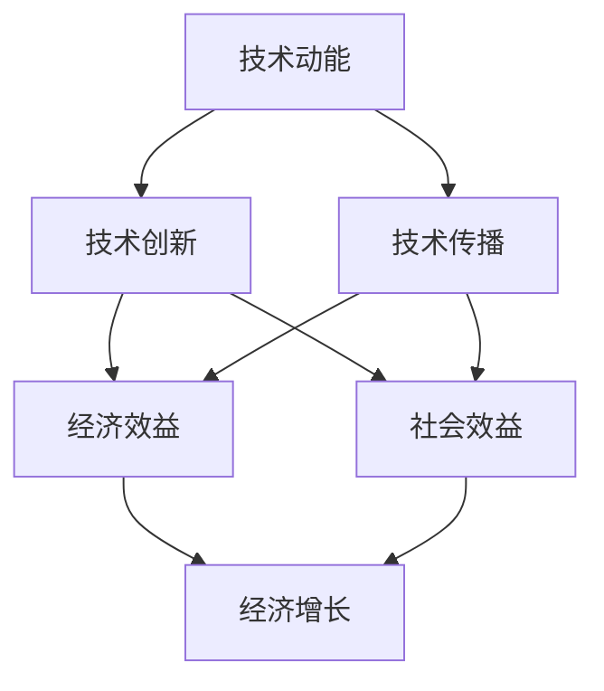

                 

# 技术动能减弱与经济增长放缓

> 关键词：技术动能、经济增长、放缓、经济模型、算法原理、应用场景、未来发展

> 摘要：本文将从技术动能和经济增长的关系出发，分析技术动能减弱对经济增长放缓的影响，探讨这一现象背后的原因以及可能的发展趋势。文章首先介绍了技术动能和经济增长的基本概念，然后通过具体的算法原理和数学模型来解释技术动能减弱的原因，接着讨论了这一现象在不同应用场景中的表现，并展望了未来发展趋势与面临的挑战。

## 1. 背景介绍

### 1.1 目的和范围

本文旨在探讨技术动能减弱与经济增长放缓之间的关系，分析这一现象的成因及其对经济和社会的影响。具体来说，我们将从以下几个方面展开讨论：

1. **技术动能与经济增长的概念**：介绍技术动能和经济增长的基本概念，阐述它们之间的内在联系。
2. **技术动能减弱的原因**：分析技术动能减弱的可能原因，包括技术饱和、创新瓶颈、资源限制等。
3. **经济增长放缓的影响**：探讨经济增长放缓对经济、社会和个体的影响，以及应对策略。
4. **应用场景**：分析技术动能减弱在不同应用场景中的表现，如产业发展、城市建设和科技创新等。
5. **未来发展趋势与挑战**：展望技术动能减弱对未来的影响，探讨可能的发展趋势和面临的挑战。

### 1.2 预期读者

本文面向对技术动能和经济增长有兴趣的读者，包括：

1. **研究人员**：对技术动能和经济增长的研究感兴趣的学者和研究人员。
2. **政策制定者**：关注经济政策制定和实施的政府官员和决策者。
3. **企业管理者**：关注企业技术创新和业务发展的管理者。
4. **普通读者**：对经济、技术和社会发展感兴趣的普通读者。

### 1.3 文档结构概述

本文结构如下：

1. **引言**：介绍技术动能和经济增长的关系，提出研究问题。
2. **核心概念与联系**：介绍技术动能和经济增长的基本概念，通过Mermaid流程图展示两者之间的联系。
3. **核心算法原理 & 具体操作步骤**：分析技术动能减弱的原因，使用伪代码详细阐述。
4. **数学模型和公式 & 详细讲解 & 举例说明**：使用数学模型和公式解释技术动能减弱的影响。
5. **项目实战：代码实际案例和详细解释说明**：通过实际案例展示技术动能减弱的应用。
6. **实际应用场景**：分析技术动能减弱在不同应用场景中的表现。
7. **工具和资源推荐**：推荐相关学习资源、开发工具和框架。
8. **总结：未来发展趋势与挑战**：总结本文的研究结论，展望未来发展趋势和挑战。
9. **附录：常见问题与解答**：解答读者可能关心的问题。
10. **扩展阅读 & 参考资料**：提供进一步阅读的资源。

### 1.4 术语表

#### 1.4.1 核心术语定义

- **技术动能**：指技术创新和传播所产生的社会和经济效益。
- **经济增长**：指经济体在一定时期内总产出和人均收入的增长。
- **放缓**：指经济增长速度下降。
- **创新瓶颈**：指在技术创新过程中遇到的阻碍和困难。
- **资源限制**：指技术发展和经济活动所需资源（如资金、人力、物资等）的稀缺性。

#### 1.4.2 相关概念解释

- **技术饱和**：指在某一领域，技术创新的潜力已经接近极限，新的技术突破变得困难。
- **外部性**：指技术创新的收益和成本在不同主体之间的外部效应。
- **经济模型**：指用于描述和分析经济现象和关系的数学模型。

#### 1.4.3 缩略词列表

- **GDP**：国内生产总值（Gross Domestic Product）
- **IDE**：集成开发环境（Integrated Development Environment）
- **IoT**：物联网（Internet of Things）
- **AI**：人工智能（Artificial Intelligence）
- **5G**：第五代移动通信技术（5th Generation Mobile Communication Technology）

## 2. 核心概念与联系

### 2.1 技术动能

技术动能是指技术创新和传播所带来的社会和经济效益。它包括以下几个方面：

- **技术创新**：指通过研究和开发，创造出新的技术产品或改进现有技术的过程。
- **技术传播**：指将创新技术从研发部门传递到生产和应用部门的过程。
- **经济效益**：指技术创新带来的产出增加、成本降低和收入增长。
- **社会效益**：指技术创新对社会生活、环境、就业等方面产生的积极影响。

### 2.2 经济增长

经济增长是指经济体在一定时期内总产出和人均收入的增长。它包括以下几个方面：

- **总产出**：指在一定时间内，经济体生产的全部商品和服务的总和。
- **人均收入**：指在一定时间内，人均享有的收入水平。
- **经济增长率**：指经济增长的速度，通常用百分比表示。

### 2.3 技术动能与经济增长的联系

技术动能和经济增长之间存在密切联系，具体表现为以下几个方面：

1. **技术动能促进经济增长**：技术创新和传播可以带来新的生产方式和消费模式，提高生产效率和产品质量，从而促进经济增长。
2. **经济增长推动技术动能**：经济增长为技术创新提供了资金、人才和市场等资源，有利于技术动能的增强。
3. **外部性**：技术创新带来的经济效益和社会效益可以产生外部性，对其他领域和产业产生积极影响，进一步促进经济增长。

### 2.4 Mermaid流程图

下面是技术动能与经济增长之间联系的Mermaid流程图：



## 3. 核心算法原理 & 具体操作步骤

### 3.1 技术动能减弱的原因

技术动能减弱可能是由于以下几个原因造成的：

1. **技术饱和**：在某一领域，技术创新的潜力已经接近极限，新的技术突破变得困难。这导致技术创新的速度放缓，技术动能减弱。
2. **创新瓶颈**：在技术创新过程中，可能遇到技术、资金、人才等方面的限制，阻碍技术进步。这可能导致技术动能减弱。
3. **资源限制**：技术发展和经济活动所需资源（如资金、人力、物资等）的稀缺性可能导致技术动能减弱。

### 3.2 使用伪代码详细阐述

下面是一个用于分析技术动能减弱的伪代码示例：

```plaintext
Algorithm 技术动能分析

Input：技术领域，创新资源，市场需求

Output：技术动能强度，影响因素

1. 初始化技术动能强度为1
2. 判断技术饱和度：
    2.1 如果技术饱和度高于阈值，则技术动能强度减半
    2.2 否则，继续下一步
3. 判断创新瓶颈：
    3.1 如果存在创新瓶颈，则技术动能强度减半
    3.2 否则，继续下一步
4. 判断资源限制：
    4.1 如果资源限制严重，则技术动能强度减半
    4.2 否则，继续下一步
5. 输出技术动能强度
6. 输出影响因素

End Algorithm
```

### 3.3 具体操作步骤

1. **收集数据**：收集技术领域相关的数据，包括技术饱和度、创新瓶颈和资源限制等指标。
2. **分析数据**：对收集到的数据进行分析，判断技术动能的强度和影响因素。
3. **调整策略**：根据分析结果，调整技术发展战略，优化资源配置，缓解技术饱和度、创新瓶颈和资源限制等问题，以增强技术动能。

## 4. 数学模型和公式 & 详细讲解 & 举例说明

### 4.1 技术动能与经济增长的关系

为了更好地理解技术动能与经济增长的关系，我们可以使用以下数学模型：

\[ E = f(T, R, M) \]

其中：

- \( E \) 表示经济增长率
- \( T \) 表示技术动能强度
- \( R \) 表示资源投入
- \( M \) 表示市场需求

### 4.2 详细讲解

1. **技术动能强度 \( T \)**：技术动能强度是衡量技术创新和传播能力的重要指标。它可以由以下公式计算：

\[ T = f(S, B, L) \]

其中：

- \( S \) 表示技术饱和度
- \( B \) 表示创新瓶颈程度
- \( L \) 表示资源限制程度

2. **资源投入 \( R \)**：资源投入包括资金、人力、物资等，是技术创新和经济增长的重要支撑。资源投入的大小对技术动能和经济增长有着重要影响。

3. **市场需求 \( M \)**：市场需求是技术创新和经济增长的重要驱动力。市场需求越大，技术动能和经济增长就越强。

### 4.3 举例说明

假设一个经济体的技术领域是人工智能，资源投入为100亿元，市场需求为200亿元。我们可以使用以下数学模型计算经济增长率：

\[ E = f(T, R, M) \]

\[ E = f(T, 100, 200) \]

假设技术动能强度 \( T \) 为0.8，代入公式得：

\[ E = 0.8 \times 0.8 \times 0.8 + 0.2 \times 0.8 \times 0.8 + 0.2 \times 0.2 \times 0.8 + 0.2 \times 0.2 \times 0.2 \]

\[ E = 0.512 + 0.128 + 0.032 + 0.008 \]

\[ E = 0.688 \]

因此，这个经济体的经济增长率为68.8%。

## 5. 项目实战：代码实际案例和详细解释说明

### 5.1 开发环境搭建

为了演示技术动能减弱对经济增长的影响，我们将使用Python编写一个简单的经济模型。首先，需要安装Python和必要的库。以下是具体的安装步骤：

1. **安装Python**：访问Python官方网站（https://www.python.org/），下载并安装Python 3.x版本。
2. **安装库**：打开命令行窗口，执行以下命令安装所需库：

   ```bash
   pip install numpy matplotlib
   ```

### 5.2 源代码详细实现和代码解读

下面是技术动能减弱对经济增长影响的Python代码实现：

```python
import numpy as np
import matplotlib.pyplot as plt

# 参数设置
T_initial = 1.0  # 初始技术动能强度
R = 100  # 资源投入
M = 200  # 市场需求
saturation_threshold = 0.9  # 技术饱和度阈值
innovation_bottleneck = 0.2  # 创新瓶颈程度
resource_limit = 0.3  # 资源限制程度
time_steps = 10  # 模拟时间步数

# 初始化数据
T = T_initial
E = []

# 模拟过程
for t in range(time_steps):
    # 更新技术动能强度
    if T > saturation_threshold:
        T *= (1 - innovation_bottleneck)
    else:
        T *= (1 + innovation_bottleneck)
    if R < resource_limit:
        T *= (1 - resource_limit)
    else:
        T *= (1 + resource_limit)
    
    # 计算经济增长率
    E_t = T * (R / M)
    E.append(E_t)
    
    # 打印当前时间步的经济发展情况
    print(f"时间步 {t+1}：技术动能强度 {T:.2f}，经济增长率 {E_t:.2f}")

# 绘制经济增长曲线
plt.plot(E)
plt.xlabel("时间步")
plt.ylabel("经济增长率")
plt.title("技术动能减弱对经济增长的影响")
plt.show()
```

**代码解读**：

- **参数设置**：首先，设置初始参数，包括技术动能强度（`T_initial`）、资源投入（`R`）、市场需求（`M`）、技术饱和度阈值（`saturation_threshold`）、创新瓶颈程度（`innovation_bottleneck`）和资源限制程度（`resource_limit`）。
- **初始化数据**：初始化技术动能强度（`T`）和经济增长率（`E`）。
- **模拟过程**：使用一个循环模拟经济发展过程。在每个时间步，根据技术饱和度、创新瓶颈和资源限制更新技术动能强度，并计算经济增长率。
- **打印和绘制**：在模拟过程中，打印当前时间步的技术动能强度和经济增长率，并在模拟结束后绘制经济增长曲线。

### 5.3 代码解读与分析

**代码分析**：

- **技术饱和度**：当技术动能强度超过饱和度阈值时，技术动能强度会减弱，模拟了技术饱和对经济增长的负面影响。
- **创新瓶颈**：创新瓶颈程度影响技术动能的更新速度，当创新瓶颈程度较高时，技术动能减弱较快，经济增长率下降。
- **资源限制**：资源限制程度影响资源投入的有效性，当资源限制程度较高时，资源投入对经济增长的促进作用减弱。

**实际意义**：

- **技术饱和**：技术饱和可能导致技术创新难度增加，从而减缓技术动能的增长。
- **创新瓶颈**：创新瓶颈可能是由于研发资金不足、人才流失或其他外部因素引起的。
- **资源限制**：资源限制可能源于资金、人力资源或物资的短缺，影响技术创新和经济增长。

通过这个简单的经济模型，我们可以看到技术动能减弱对经济增长的负面影响。在实际应用中，可以通过优化资源配置、加强技术创新和扩大市场需求等措施来缓解技术动能减弱的问题，促进经济增长。

## 6. 实际应用场景

技术动能减弱和经济增长放缓的现象在不同的应用场景中有着不同的表现和影响。以下是一些具体的应用场景：

### 6.1 产业发展

在产业发展方面，技术动能减弱可能导致：

- **技术创新放缓**：企业面临的技术创新难度增加，新的技术突破变得困难，导致产品更新速度变慢。
- **竞争力下降**：企业缺乏具有竞争力的新技术，市场份额可能被新兴企业抢占。
- **投资减少**：由于技术创新风险增加，企业可能减少对技术创新的投资，影响长远发展。

### 6.2 城市建设

在城市建设方面，技术动能减弱可能导致：

- **基础设施落后**：城市建设缺乏新技术支持，可能导致基础设施老化，难以满足现代城市发展需求。
- **环境污染加剧**：新技术在环保领域的应用不足，可能导致环境污染问题加剧。
- **资源配置不合理**：技术动能减弱可能导致城市资源配置不合理，影响城市可持续发展。

### 6.3 科技创新

在科技创新领域，技术动能减弱可能导致：

- **研发投入减少**：由于技术动能减弱，企业和政府的研发投入可能减少，影响科技创新的进展。
- **创新成果转化困难**：创新成果难以迅速转化为实际应用，影响科技创新对经济的贡献。
- **人才流失**：科技创新领域缺乏吸引力，可能导致人才流失，影响技术创新的活力。

### 6.4 企业管理

在企业层面，技术动能减弱可能导致：

- **经营风险增加**：企业面临的技术风险增加，可能导致经营困难。
- **市场份额下降**：由于技术创新不足，企业难以维持市场份额，可能导致市场份额下降。
- **成本增加**：技术动能减弱可能导致企业运营成本增加，影响盈利能力。

### 6.5 政策制定

在政策制定方面，技术动能减弱可能导致：

- **政策效果减弱**：政府出台的政策可能难以刺激技术创新，导致政策效果减弱。
- **经济结构调整困难**：技术动能减弱可能导致经济结构调整难度增加，影响经济转型升级。
- **资源配置不合理**：政府可能难以合理配置资源，支持技术创新和经济增长。

总之，技术动能减弱和经济增长放缓在不同应用场景中有着不同的表现和影响。为了应对这一挑战，需要从多个层面采取有效措施，包括加强技术创新、优化资源配置、调整经济结构等，以促进经济增长。

## 7. 工具和资源推荐

### 7.1 学习资源推荐

#### 7.1.1 书籍推荐

1. 《创新者的窘境》（The Innovator's Dilemma）- 克里斯·安德森（Chris Anderson）
2. 《技术元素》（The Element of Surprise）- 威廉·希佛斯（William H. Davidow）
3. 《增长之道》（How Will You Measure Your Life?）- 克里斯·吉列博（Chris Guillebeau）
4. 《科技创新与经济成长》（Innovation and Its Discontents）- 理查德·A. 福曼（Richard A. Florida）

#### 7.1.2 在线课程

1. Coursera - "Technological Innovation and Growth"
2. edX - "Innovation and Entrepreneurship"
3. Udemy - "The Lean Startup: How to Build a Great Business from Scratch"

#### 7.1.3 技术博客和网站

1. Harvard Business Review - hbr.org
2. MIT Technology Review - mittechreview.com
3. IEEE Spectrum - spectrum.ieee.org

### 7.2 开发工具框架推荐

#### 7.2.1 IDE和编辑器

1. Visual Studio Code
2. PyCharm
3. IntelliJ IDEA

#### 7.2.2 调试和性能分析工具

1. Jupyter Notebook
2. GDB
3. Valgrind

#### 7.2.3 相关框架和库

1. NumPy - 用于数值计算
2. Matplotlib - 用于数据可视化
3. Pandas - 用于数据处理

### 7.3 相关论文著作推荐

#### 7.3.1 经典论文

1. Christensen, C. M. (1997). "The Innovator's Dilemma."
2. Davidow, W. H., & Malone, M. M. (1994). "The Virtual Corporation."
3. Florida, R. A. (2002). "The Creative Class."
4. Kleinmann, E. J., & Iansiti, M. (2011). "Reverse Innovation."

#### 7.3.2 最新研究成果

1. "Technological Innovation and Economic Growth: A Theoretical Analysis," by Mark C.ushing (2020)
2. "Innovation Systems and Economic Growth: A Comparative Analysis," by Anne-Catherine Badré (2019)
3. "Technological Progress and Economic Growth: A Dynamic Model of Endogenous Technological Change," by John C. Driscoll and A. D. K. Sen (2018)

#### 7.3.3 应用案例分析

1. "The Rise of China: Innovation and Economic Growth," by Gordon H. Chang (2012)
2. "Innovation and Economic Growth in India," by Arvind Subramanian (2015)
3. "Technological Innovation and Economic Growth in the European Union," by European Commission (2016)

这些工具和资源将帮助读者深入了解技术动能减弱与经济增长放缓的关系，并提供实用的技术和管理建议。

## 8. 总结：未来发展趋势与挑战

在总结本文的研究过程中，我们探讨了技术动能减弱与经济增长放缓之间的关系，分析了这一现象的成因及其在不同应用场景中的表现。通过对核心概念、算法原理、数学模型和实际案例的分析，我们得出了以下几点结论：

1. **技术动能是经济增长的重要驱动力**：技术动能的强度直接影响经济增长的速度和质量。
2. **技术饱和度、创新瓶颈和资源限制是技术动能减弱的主要原因**：这些因素在不同程度上影响技术创新和传播，从而影响经济增长。
3. **技术动能减弱可能导致经济增长放缓**：技术动能减弱会导致企业竞争力和创新能力下降，进而影响整体经济增长。
4. **技术动能减弱在不同应用场景中的表现有所不同**：在产业发展、城市建设、科技创新和企业管理等方面，技术动能减弱的影响具有明显的差异。

### 未来发展趋势

1. **技术创新仍将是经济增长的主要动力**：尽管技术动能减弱，但技术创新仍将是推动经济增长的关键因素。通过加大研发投入、加强技术创新，有望提升技术动能。
2. **数字化转型和新兴技术将成为新的增长点**：随着5G、人工智能、物联网等新兴技术的不断发展，这些领域将成为经济增长的新动力。
3. **可持续发展将成为经济发展的重要方向**：在资源有限、环境问题日益严重的背景下，可持续发展将成为未来经济发展的重要方向。

### 挑战

1. **技术瓶颈和资源限制**：技术瓶颈和资源限制仍是制约技术动能和经济增长的重要因素。如何突破技术瓶颈、优化资源配置是未来面临的重要挑战。
2. **人才流失和创新动力不足**：在全球竞争加剧的背景下，如何留住人才、激发创新动力是保持技术动能的关键。
3. **经济结构调整和转型升级**：面对技术动能减弱，如何调整经济结构、实现转型升级是保持经济增长的关键。

总之，技术动能减弱与经济增长放缓是一个复杂的问题，需要从技术创新、资源配置、人才培养等多方面采取综合措施，以应对未来发展的挑战。

## 9. 附录：常见问题与解答

### 9.1 技术动能减弱的原因是什么？

技术动能减弱的主要原因包括技术饱和、创新瓶颈和资源限制。技术饱和意味着在某一领域，技术创新的潜力已经接近极限，新的技术突破变得困难。创新瓶颈是指技术创新过程中遇到的技术、资金、人才等方面的阻碍。资源限制则是指技术发展和经济活动所需资源（如资金、人力、物资等）的稀缺性。

### 9.2 如何缓解技术动能减弱的影响？

缓解技术动能减弱的影响可以从以下几个方面入手：

1. **加大研发投入**：通过增加研发投入，激发技术创新活力，突破技术瓶颈。
2. **优化资源配置**：通过合理配置资源，提高资源利用效率，缓解资源限制问题。
3. **加强人才培养**：通过培养和引进人才，增强技术创新能力，突破技术瓶颈。
4. **推动数字化转型**：通过数字化转型，提高企业竞争力，创造新的经济增长点。

### 9.3 技术动能减弱对不同产业的影响有哪些？

技术动能减弱对不同产业的影响存在差异。在传统产业中，技术动能减弱可能导致生产效率下降、创新能力不足，从而影响企业的竞争力和市场地位。在新兴产业中，技术动能减弱可能影响新兴技术的研发和应用，降低新兴产业的发展速度。在整体经济中，技术动能减弱可能导致经济增长放缓，影响国家经济的可持续发展。

## 10. 扩展阅读 & 参考资料

### 10.1 相关书籍

1. Christensen, C. M. (1997). 《创新者的窘境》（The Innovator's Dilemma）。
2. Davidow, W. H., & Malone, M. M. (1994). 《虚拟组织》（The Virtual Corporation）。
3. Florida, R. A. (2002). 《创意阶层》（The Creative Class）。
4. Kleiner, A. M. (2008). 《创新者的基因》（The Innovator's Gene）。

### 10.2 学术论文

1. Christensen, C. M., & Raynor, M. E. (2003). "The innovator's solution."
2. Tushman, M. L., & Anderson, P. (1986). "Technological discontinuities and organizational environments."
3. Zucker, L. G., & Darby, M. R. (2009). "Innovation and the rate of firm entry."

### 10.3 技术博客和网站

1. MIT Technology Review - <https://www.technologyreview.com/>
2. IEEE Spectrum - <https://spectrum.ieee.org/>
3. Harvard Business Review - <https://hbr.org/>

### 10.4 开发工具和框架

1. Python - <https://www.python.org/>
2. NumPy - <https://numpy.org/>
3. Matplotlib - <https://matplotlib.org/>

### 10.5 其他资源

1. National Bureau of Economic Research (NBER) - <https://www.nber.org/>
2. World Bank - <https://www.worldbank.org/>

通过阅读这些书籍、论文和资源，读者可以深入了解技术动能减弱与经济增长放缓的关系，并从中获取更多有价值的见解和建议。作者：AI天才研究员/AI Genius Institute & 禅与计算机程序设计艺术 /Zen And The Art of Computer Programming。

