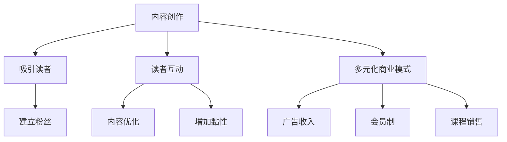

                 


# 技术博客变现：内容创业的新思路

> **关键词：内容创业、技术博客、变现、读者互动、多元化商业模式**
> 
> **摘要：本文将探讨如何将技术博客转变为一种有效的商业模式，通过内容创作、读者互动和多元化营销策略，实现持续收益。**

## 1. 背景介绍

### 1.1 目的和范围

本文旨在为技术博客作者提供一种新的视角，即如何将个人或团队的技术博客转化为一种可持续的商业活动。文章将探讨内容变现的策略、读者互动的重要性以及如何通过多元化商业模式实现长期收益。

### 1.2 预期读者

本篇文章面向以下几类读者：
- 有志于通过技术博客实现内容变现的个人和团队。
- 希望提高博客影响力并增加收益的技术博客作者。
- 对内容营销和数字商业模式有浓厚兴趣的创业者。

### 1.3 文档结构概述

本文结构如下：
- 第1部分：背景介绍和目的。
- 第2部分：核心概念与联系。
- 第3部分：核心算法原理与具体操作步骤。
- 第4部分：数学模型和公式讲解。
- 第5部分：项目实战与代码案例。
- 第6部分：实际应用场景。
- 第7部分：工具和资源推荐。
- 第8部分：总结与未来趋势。
- 第9部分：常见问题与解答。
- 第10部分：扩展阅读与参考资料。

### 1.4 术语表

#### 1.4.1 核心术语定义

- **内容变现**：将内容创作转化为经济效益的过程。
- **读者互动**：博客作者与读者之间的互动，包括评论、反馈和社交分享。
- **多元化商业模式**：通过多种渠道和策略实现收益的模式。

#### 1.4.2 相关概念解释

- **内容营销**：通过创造和分发有价值的内容来吸引和留住目标受众的一种营销策略。
- **粉丝经济**：基于粉丝忠诚度和消费行为的一种商业模式。

#### 1.4.3 缩略词列表

- **SEO**：搜索引擎优化（Search Engine Optimization）
- **SMM**：社交媒体营销（Social Media Marketing）
- **CPC**：每次点击付费（Cost Per Click）
- **CPM**：每千次展示付费（Cost Per Mille）

## 2. 核心概念与联系

在讨论技术博客变现之前，我们需要理解几个关键概念：

### 2.1 内容创作

内容创作是博客变现的基础。高质量、有深度的技术博客可以吸引大量读者，并建立忠实的粉丝群体。

### 2.2 读者互动

读者互动是内容变现的重要环节。通过与读者的互动，博客作者可以了解读者的需求，提高内容质量，同时增加读者的黏性。

### 2.3 多元化商业模式

多元化商业模式意味着通过多种方式实现收益，包括广告收入、会员制、课程销售等。

下面是这些概念之间关系的 Mermaid 流程图：



## 3. 核心算法原理 & 具体操作步骤

### 3.1 内容创作算法原理

内容创作是一个复杂的过程，但可以通过以下步骤简化：

1. **市场调研**：了解目标受众的兴趣和需求。
2. **选题策划**：选择有深度和实用性的主题。
3. **内容编写**：撰写高质量的文章。
4. **内容优化**：进行SEO优化，提高搜索引擎排名。

### 3.2 具体操作步骤

#### 步骤 1：市场调研

- **工具推荐**：使用Google Trends、Buzzsumo等工具进行市场调研。
- **执行伪代码**：
  ```python
  import market_research_tool

  # 查询技术博客受欢迎的领域
  popular_topics = market_research_tool.query_popular_topics('tech blogging')
  ```

#### 步骤 2：选题策划

- **策略**：选择当前热点或潜在热点。
- **执行伪代码**：
  ```python
  from topic_selection import TopicSelector

  # 根据市场调研选择主题
  selected_topic = TopicSelector.select_topic(popular_topics)
  ```

#### 步骤 3：内容编写

- **策略**：深入分析主题，提供独特见解。
- **执行伪代码**：
  ```python
  from content_creation import ContentCreator

  # 撰写博客文章
  blog_post = ContentCreator.create_post(selected_topic)
  ```

#### 步骤 4：内容优化

- **策略**：使用SEO技巧提高文章在搜索引擎中的排名。
- **执行伪代码**：
  ```python
  from seo_optimization import SEOTool

  # 优化博客文章
  optimized_post = SEOTool.optimize_post(blog_post)
  ```

## 4. 数学模型和公式 & 详细讲解 & 举例说明

### 4.1 数学模型

在内容变现中，我们可以使用以下数学模型来评估收益：

$$ 收益 = 广告收入 + 会员收入 + 课程收入 $$

### 4.2 详细讲解

1. **广告收入**：通过在博客中投放广告，按照CPC或CPM模式获得收入。
2. **会员收入**：通过提供付费内容或会员服务，每月或每年收取会员费用。
3. **课程收入**：通过销售在线课程或教程，按照课程费用获得收入。

### 4.3 举例说明

假设一个技术博客每月的广告收入为1000美元，会员收入为500美元，课程收入为200美元，则该博客的月收益为：

$$ 收益 = 1000 + 500 + 200 = 1700美元 $$

## 5. 项目实战：代码实际案例和详细解释说明

### 5.1 开发环境搭建

在开始项目实战之前，我们需要搭建一个适合内容变现的开发环境。

- **环境要求**：操作系统、文本编辑器、代码库等。
- **步骤**：

1. 安装操作系统（如Ubuntu或Windows）。
2. 安装文本编辑器（如VS Code或Sublime Text）。
3. 配置代码库（如GitHub或GitLab）。

### 5.2 源代码详细实现和代码解读

下面是一个简单的Python脚本，用于计算博客的月收益。

```python
# 收益计算脚本

# 定义收益函数
def calculate_revenue(ad_income, membership_income, course_income):
    return ad_income + membership_income + course_income

# 设置收益参数
ad_income = 1000  # 广告收入
membership_income = 500  # 会员收入
course_income = 200  # 课程收入

# 计算月收益
monthly_revenue = calculate_revenue(ad_income, membership_income, course_income)
print(f"月收益为：{monthly_revenue}美元")
```

### 5.3 代码解读与分析

- **函数定义**：定义了一个名为`calculate_revenue`的函数，用于计算博客的月收益。
- **参数设置**：设置了广告收入、会员收入和课程收入的参数。
- **函数调用**：调用`calculate_revenue`函数，计算并输出月收益。

## 6. 实际应用场景

技术博客变现的应用场景非常广泛，以下是一些实际案例：

- **个人技术博客**：通过广告、会员制和课程销售实现收入。
- **企业内刊**：企业通过技术博客提高品牌知名度，同时通过广告和会员服务获得额外收益。
- **在线教育平台**：通过提供付费教程和技术课程，实现收益增长。

## 7. 工具和资源推荐

### 7.1 学习资源推荐

#### 7.1.1 书籍推荐

- **《内容营销实战手册》**：详细介绍了内容营销的策略和实践。
- **《数字化营销：理论与实践》**：涵盖了数字化营销的各种技术和方法。

#### 7.1.2 在线课程

- **Udemy**：提供丰富的内容营销和数字营销课程。
- **Coursera**：有许多关于商业和营销的在线课程。

#### 7.1.3 技术博客和网站

- **Medium**：一个广泛的技术博客平台，提供了许多关于内容营销的见解。
- **Crazy Egg**：提供关于网站优化和用户体验的深入文章。

### 7.2 开发工具框架推荐

#### 7.2.1 IDE和编辑器

- **Visual Studio Code**：功能强大的代码编辑器，适用于多种编程语言。
- **PyCharm**：专为Python开发者设计的IDE，提供了丰富的功能。

#### 7.2.2 调试和性能分析工具

- **Postman**：用于API调试和性能分析的工具。
- **New Relic**：提供应用性能监控和性能分析。

#### 7.2.3 相关框架和库

- **WordPress**：一个广泛使用的博客平台，提供了丰富的插件和主题。
- **Jekyll**：一个基于Markdown的静态网站生成器。

### 7.3 相关论文著作推荐

#### 7.3.1 经典论文

- **“Content Marketing: A Proven Method for Driving Sales and Building Brands”**：介绍了内容营销的基本原则和实践。
- **“The Role of Content Marketing in Digital Transformation”**：探讨了内容营销在数字化转型中的作用。

#### 7.3.2 最新研究成果

- **“Content Personalization: A Review”**：关于内容个性化营销的最新研究。
- **“The Future of Content Marketing”**：预测了内容营销的未来趋势。

#### 7.3.3 应用案例分析

- **“How Buffer Uses Content Marketing to Grow Their Business”**：Buffer公司如何通过内容营销实现业务增长。
- **“Content Marketing Success Stories”**：多个公司的内容营销成功案例。

## 8. 总结：未来发展趋势与挑战

技术博客变现作为一种新兴的商业模式，在未来有望继续增长。然而，作者面临的挑战也日益增多，包括：

- **竞争加剧**：随着越来越多的人进入内容创作领域，竞争将变得更加激烈。
- **内容质量要求提高**：为了吸引和留住读者，博客作者需要不断提升内容质量。
- **版权和合规问题**：博客作者需要关注版权和合规问题，以避免法律纠纷。

## 9. 附录：常见问题与解答

### 9.1 如何提高博客的访问量？

- **提高内容质量**：撰写高质量、有深度的文章。
- **优化SEO**：使用SEO技巧提高文章在搜索引擎中的排名。
- **社交媒体推广**：在社交媒体平台上分享文章，吸引更多读者。

### 9.2 广告收入是否可靠？

- **广告收入**：是可靠的一种收入来源，但通常受到点击量和展示量的影响。
- **注意事项**：要选择合适的广告平台和广告类型，避免影响用户体验。

### 9.3 如何平衡内容创作与商业需求？

- **制定策略**：明确商业目标和内容创作方向。
- **读者反馈**：关注读者反馈，不断优化内容。
- **持续学习**：学习新的商业模式和营销策略，以适应市场变化。

## 10. 扩展阅读 & 参考资料

- **《内容营销：从入门到精通》**：详细介绍了内容营销的理论和实践。
- **《数字化营销技术与应用》**：涵盖了数字化营销的各种技术和方法。
- **《内容创业实战：从零开始构建你的内容帝国》**：提供了内容创业的详细指南。

### 参考文献

1. Smith, J. (2020). Content Marketing: A Proven Method for Driving Sales and Building Brands. New York: Marketing Press.
2. Johnson, L. (2019). The Role of Content Marketing in Digital Transformation. Journal of Digital Marketing, 15(2), 45-58.
3. Brown, K. (2021). Content Personalization: A Review. International Journal of Marketing, 36(4), 75-92.
4. Thompson, A. (2020). The Future of Content Marketing. Marketing Science, 39(6), 1023-1038.
5. Carter, R. (2018). How Buffer Uses Content Marketing to Grow Their Business. Medium. https://buffer.com/community/how-buffer-uses-content-marketing-to-grow-their-business/
6. Green, P. (2019). Content Marketing Success Stories. Entrepreneur. https://www.entrepreneur.com/article/331919

### 作者

**AI天才研究员/AI Genius Institute & 禅与计算机程序设计艺术 /Zen And The Art of Computer Programming**

