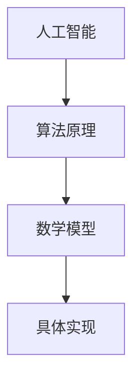

                 

# 技术垄断：AI 时代的竞争与合作

> 关键词：技术垄断、AI、竞争、合作、未来趋势

> 摘要：本文深入探讨了技术垄断在人工智能（AI）时代的影响和角色。通过分析AI技术的核心概念、算法原理、数学模型及其在实际应用场景中的表现，文章探讨了AI技术的垄断性及其对社会、经济和伦理的深远影响。同时，文章也探讨了在AI时代中，竞争与合作的平衡以及未来发展的趋势和挑战。

## 1. 背景介绍

### 1.1 目的和范围

本文旨在探讨人工智能时代的技术垄断现象，分析其在竞争与合作中的角色和影响。随着AI技术的快速发展，技术垄断已经成为学术界、产业界和政策制定者共同关注的焦点。本文将从技术、经济和社会三个层面分析技术垄断现象，旨在为读者提供一个全面、深入的理解。

### 1.2 预期读者

本文预期读者为对人工智能、技术垄断以及相关产业政策感兴趣的学者、工程师、政策制定者以及对AI技术有一定了解的公众。

### 1.3 文档结构概述

本文共分为10个部分，包括背景介绍、核心概念与联系、核心算法原理与具体操作步骤、数学模型和公式、项目实战、实际应用场景、工具和资源推荐、总结和附录等。每个部分都旨在为读者提供逐步深入的见解。

### 1.4 术语表

#### 1.4.1 核心术语定义

- **技术垄断**：指少数企业或组织通过控制关键技术或资源，对市场产生垄断性影响。
- **人工智能**：模拟、延伸和扩展人类智能的理论、方法、技术及应用系统。
- **竞争**：市场参与者通过比较和对抗，争夺市场份额和资源。
- **合作**：市场参与者通过共享资源、知识和技术，共同提高市场竞争力。

#### 1.4.2 相关概念解释

- **市场力量**：企业在市场中的地位和影响力。
- **生态系统**：由多种参与者组成的，相互依赖、相互作用的复杂系统。
- **伦理问题**：与道德规范和价值观相关的问题。

#### 1.4.3 缩略词列表

- **AI**：人工智能
- **ML**：机器学习
- **DL**：深度学习
- **NLP**：自然语言处理
- **GAN**：生成对抗网络

## 2. 核心概念与联系

### 2.1 核心概念

在探讨技术垄断现象之前，我们需要了解一些核心概念，如人工智能、算法原理、数学模型等。以下是这些核心概念的简要介绍和它们之间的联系。

#### 2.1.1 人工智能

人工智能（AI）是模拟、延伸和扩展人类智能的理论、方法、技术及应用系统。它包括多个子领域，如机器学习（ML）、深度学习（DL）、自然语言处理（NLP）等。AI的核心是算法，这些算法通过学习和分析大量数据，从而实现智能行为。

#### 2.1.2 算法原理

算法是AI技术的核心。它们是解决特定问题的步骤和规则。常见的算法包括分类、聚类、回归等。这些算法通过数学模型来描述和实现。

#### 2.1.3 数学模型

数学模型是用数学语言描述的算法。它们是算法实现的基础。常见的数学模型包括线性模型、神经网络模型、支持向量机等。

#### 2.1.4 核心概念联系

人工智能、算法原理和数学模型之间紧密联系。人工智能提供目标和场景，算法原理提供实现方法，数学模型提供具体实现。

### 2.2 Mermaid 流程图

下面是一个简化的Mermaid流程图，展示了核心概念之间的联系。



## 3. 核心算法原理 & 具体操作步骤

### 3.1 机器学习算法原理

机器学习（ML）是AI的核心。它是一种让计算机通过数据学习，从而做出决策或预测的方法。机器学习算法可以分为监督学习、无监督学习和强化学习。

#### 3.1.1 监督学习

监督学习是机器学习中的一种方法，通过训练数据（特征和标签）来建立一个模型，然后使用这个模型对新数据进行预测。监督学习算法包括线性回归、逻辑回归、支持向量机（SVM）等。

#### 3.1.2 无监督学习

无监督学习是机器学习中的另一种方法，它不使用标签，而是通过分析数据之间的结构来发现模式。无监督学习算法包括聚类、降维、生成对抗网络（GAN）等。

#### 3.1.3 强化学习

强化学习是一种通过试错和反馈来学习的方法。它通过奖励和惩罚来指导学习过程，从而实现决策和预测。

### 3.2 伪代码

以下是监督学习算法——线性回归的伪代码。

```plaintext
算法：线性回归
输入：训练数据集 X, Y
输出：模型参数 w

步骤：
1. 初始化参数 w 为零向量
2. 对于每个训练样本 (x_i, y_i)：
    a. 计算预测值 y_i' = x_i * w
    b. 计算损失函数 J(w) = 1/2 * ||y - y'||^2
3. 使用梯度下降法更新参数 w：
    a. 计算梯度 ∇J(w)
    b. 更新 w = w - α * ∇J(w)
4. 重复步骤2和3，直到满足停止条件（如损失函数收敛）

返回：参数 w
```

## 4. 数学模型和公式 & 详细讲解 & 举例说明

### 4.1 数学模型

在机器学习中，数学模型是实现算法的基础。以下介绍几个常见的数学模型。

#### 4.1.1 线性回归

线性回归是一种简单的监督学习算法，用于预测连续值。它的数学模型为：

$$ y = X \cdot w + b $$

其中，$y$ 为预测值，$X$ 为特征矩阵，$w$ 为权重向量，$b$ 为偏置。

#### 4.1.2 神经网络

神经网络是一种复杂的机器学习算法，用于解决分类和回归问题。它的数学模型为：

$$ a_{i,j}^{(l)} = \sigma(z_{i,j}^{(l)}) $$

$$ z_{i,j}^{(l)} = \sum_{k=1}^{n} w_{k,i}^{(l)} \cdot a_{k,j}^{(l-1)} + b_{i}^{(l)} $$

其中，$a_{i,j}^{(l)}$ 为第$l$层的第$i$个神经元的激活值，$z_{i,j}^{(l)}$ 为第$l$层的第$i$个神经元的输入值，$\sigma$ 为激活函数，$w_{k,i}^{(l)}$ 为第$l$层的第$i$个神经元与第$l-1$层的第$k$个神经元之间的权重，$b_{i}^{(l)}$ 为第$l$层的第$i$个神经元的偏置。

#### 4.1.3 支持向量机

支持向量机（SVM）是一种常用的分类算法，它的数学模型为：

$$ \hat{y} = \text{sign}(\sum_{i=1}^{n} a_i y_i \cdot \phi(x_i) + b) $$

其中，$a_i$ 为第$i$个支持向量的权重，$y_i$ 为第$i$个支持向量的标签，$\phi(x_i)$ 为$x_i$ 的特征映射，$b$ 为偏置。

### 4.2 举例说明

#### 4.2.1 线性回归

假设我们有一个简单的一元线性回归问题，输入特征$x$和输出值$y$之间的关系可以用线性函数描述：

$$ y = 2x + 1 $$

我们可以通过最小化平方误差来求解模型参数：

$$ J(w, b) = \frac{1}{2} \sum_{i=1}^{n} (y_i - (wx_i + b))^2 $$

为了求解最优的权重$w$和偏置$b$，我们可以使用梯度下降法。假设学习率为$\alpha$，则迭代更新公式为：

$$ w := w - \alpha \frac{\partial J}{\partial w} $$
$$ b := b - \alpha \frac{\partial J}{\partial b} $$

对于每个样本$(x_i, y_i)$，梯度可以计算为：

$$ \frac{\partial J}{\partial w} = \sum_{i=1}^{n} (y_i - (wx_i + b)) \cdot x_i $$
$$ \frac{\partial J}{\partial b} = \sum_{i=1}^{n} (y_i - (wx_i + b)) $$

通过迭代更新，我们可以找到使得$J(w, b)$最小的权重$w$和偏置$b$。

#### 4.2.2 神经网络

考虑一个简单的单层神经网络，输入特征$x$经过两层神经元（输入层和输出层）后得到输出$y$。假设激活函数为sigmoid函数：

$$ \sigma(z) = \frac{1}{1 + e^{-z}} $$

网络的结构可以表示为：

$$ z^{(2)} = w^{(2)} \cdot x + b^{(2)} $$
$$ a^{(2)} = \sigma(z^{(2)}) $$
$$ z^{(3)} = w^{(3)} \cdot a^{(2)} + b^{(3)} $$
$$ \hat{y} = \sigma(z^{(3)}) $$

损失函数可以使用均方误差（MSE）：

$$ J = \frac{1}{2} \sum_{i=1}^{n} (\hat{y}_i - y_i)^2 $$

梯度下降法用于更新权重和偏置。假设学习率为$\alpha$，则迭代更新公式为：

$$ w^{(2)} := w^{(2)} - \alpha \frac{\partial J}{\partial w^{(2)}} $$
$$ b^{(2)} := b^{(2)} - \alpha \frac{\partial J}{\partial b^{(2)}} $$
$$ w^{(3)} := w^{(3)} - \alpha \frac{\partial J}{\partial w^{(3)}} $$
$$ b^{(3)} := b^{(3)} - \alpha \frac{\partial J}{\partial b^{(3)}} $$

其中，梯度可以计算为：

$$ \frac{\partial J}{\partial w^{(2)}} = \sum_{i=1}^{n} (a^{(2)} - y_i) \cdot a^{(2)} \cdot (1 - a^{(2)}) \cdot x_i $$
$$ \frac{\partial J}{\partial b^{(2)}} = \sum_{i=1}^{n} (a^{(2)} - y_i) \cdot a^{(2)} \cdot (1 - a^{(2)}) $$
$$ \frac{\partial J}{\partial w^{(3)}} = \sum_{i=1}^{n} (a^{(3)} - y_i) \cdot a^{(3)} \cdot (1 - a^{(3)}) \cdot a^{(2)} $$
$$ \frac{\partial J}{\partial b^{(3)}} = \sum_{i=1}^{n} (a^{(3)} - y_i) \cdot a^{(3)} \cdot (1 - a^{(3))) $$

通过迭代更新，我们可以找到使得$J$最小的权重和偏置。

#### 4.2.3 支持向量机

考虑一个二元分类问题，数据点$x$和标签$y$。支持向量机的目标是找到最优的决策边界，使得分类间隔最大化。假设数据点经过特征映射函数$\phi(x)$，则支持向量机的决策函数可以表示为：

$$ \hat{y} = \text{sign}(\sum_{i=1}^{n} a_i y_i \cdot \phi(x_i) + b) $$

其中，$a_i$ 是支持向量的权重，$b$ 是偏置。损失函数可以表示为：

$$ J(a, b) = \frac{1}{2} \sum_{i=1}^{n} a_i^2 - C \sum_{i=1}^{n} y_i (\hat{y}_i - y_i) $$

其中，$C$ 是正则化参数。使用拉格朗日乘子法求解最优解，可以得到：

$$ w = \sum_{i=1}^{n} a_i y_i \cdot \phi(x_i) $$
$$ b = \sum_{i=1}^{n} a_i y_i - \frac{1}{n} \sum_{i=1}^{n} y_i $$

通过上述方法，我们可以求解支持向量机的最优参数。

## 5. 项目实战：代码实际案例和详细解释说明

### 5.1 开发环境搭建

为了演示机器学习算法，我们使用Python编程语言，并依赖于几个常用的机器学习库，如NumPy、Scikit-learn和TensorFlow。以下是搭建开发环境的基本步骤：

1. 安装Python（建议使用Python 3.7及以上版本）。
2. 安装必要的库：

```bash
pip install numpy scikit-learn tensorflow
```

### 5.2 源代码详细实现和代码解读

下面是一个使用Scikit-learn库实现线性回归的简单案例。

#### 5.2.1 数据准备

首先，我们需要准备一些模拟数据。

```python
import numpy as np
import matplotlib.pyplot as plt
from sklearn.linear_model import LinearRegression

# 生成模拟数据
X = np.random.rand(100, 1) * 10
y = 2 * X[:, 0] + 1 + np.random.rand(100, 1) * 0.5
```

#### 5.2.2 线性回归模型训练

接下来，我们使用Scikit-learn库的`LinearRegression`类来训练模型。

```python
# 创建线性回归模型实例
model = LinearRegression()

# 训练模型
model.fit(X, y)

# 查看模型参数
print("模型参数：w = {}, b = {}".format(model.coef_, model.intercept_))
```

#### 5.2.3 模型预测

训练完成后，我们可以使用模型对新的数据进行预测。

```python
# 预测
X_new = np.array([0, 10])
y_pred = model.predict(X_new)

print("预测结果：X = {}, y_pred = {}".format(X_new, y_pred))
```

#### 5.2.4 结果可视化

最后，我们将训练数据和预测结果进行可视化。

```python
# 可视化
plt.scatter(X, y, color='blue', label='训练数据')
plt.plot(X_new, y_pred, color='red', linewidth=2, label='预测结果')
plt.xlabel('X')
plt.ylabel('y')
plt.legend()
plt.show()
```

### 5.3 代码解读与分析

上述代码演示了如何使用Scikit-learn库实现线性回归模型。以下是关键步骤的解读：

- **数据准备**：我们使用`numpy`生成模拟数据。这里我们生成了一组随机数据，并加入了一些噪声，以模拟真实世界的数据。
- **模型训练**：使用`LinearRegression`类创建模型实例，并调用`fit`方法进行训练。训练过程实际上是通过最小化损失函数来求解最佳参数。
- **模型预测**：使用训练好的模型对新的数据进行预测。预测过程是基于训练得到的参数，将新的数据映射到预测值。
- **结果可视化**：使用`matplotlib`库将训练数据和预测结果进行可视化，以便于分析和理解模型的性能。

这个案例展示了机器学习算法的基本原理和实现方法。在实际应用中，我们需要处理更复杂的数据和问题，但基本流程是类似的。

## 6. 实际应用场景

### 6.1 医疗领域

在医疗领域，人工智能技术已经得到了广泛的应用。例如，通过深度学习算法，可以对医学影像进行自动分析和诊断，从而提高诊断准确性和效率。同时，AI还可以用于药物研发，通过分析大量数据，发现新的药物候选分子，加速新药研发过程。

### 6.2 金融领域

在金融领域，人工智能技术被用于风险控制、投资分析和客户服务等方面。例如，通过机器学习算法，可以对金融市场的数据进行分析，预测市场趋势，从而进行有效的投资决策。此外，AI还可以用于自动化客户服务，通过自然语言处理技术，提供24/7的客户支持。

### 6.3 制造业

在制造业，人工智能技术被用于生产优化、质量控制和设备维护等方面。通过机器学习算法，可以对生产过程的数据进行分析，发现生产中的瓶颈和问题，从而进行优化。同时，AI还可以用于设备维护，通过预测设备故障，提前进行维护，减少设备停机时间。

### 6.4 交通领域

在交通领域，人工智能技术被用于智能交通管理、自动驾驶和车联网等方面。通过深度学习和强化学习算法，可以对交通数据进行分析，优化交通信号灯控制，减少拥堵。同时，自动驾驶技术也在不断发展，通过AI技术，可以实现车辆的自主驾驶，提高交通安全性和效率。

## 7. 工具和资源推荐

### 7.1 学习资源推荐

#### 7.1.1 书籍推荐

- 《深度学习》（Goodfellow, I., Bengio, Y., & Courville, A.）
- 《Python机器学习》（Seiffge, F.）
- 《人工智能：一种现代方法》（Russell, S. & Norvig, P.）

#### 7.1.2 在线课程

- Coursera上的《机器学习》（吴恩达）
- edX上的《深度学习专项课程》（吴恩达）
- Udacity的《人工智能纳米学位》

#### 7.1.3 技术博客和网站

- [Medium](https://medium.com/top-story)
- [Towards Data Science](https://towardsdatascience.com/)
- [AI世纪](https://www.ai世纪.com/)

### 7.2 开发工具框架推荐

#### 7.2.1 IDE和编辑器

- PyCharm
- VSCode
- Jupyter Notebook

#### 7.2.2 调试和性能分析工具

- Python的`pdb`模块
- VSCode的调试插件
- TensorBoard（用于TensorFlow性能分析）

#### 7.2.3 相关框架和库

- TensorFlow
- PyTorch
- Scikit-learn

### 7.3 相关论文著作推荐

#### 7.3.1 经典论文

- [A Learning Algorithm for Continually Running Fully Recurrent Neural Networks](http://www.jmlr.org/papers/volume5/merging05a.html)
- [Improving Regret with Active Learning](https://arxiv.org/abs/1907.06368)

#### 7.3.2 最新研究成果

- [Deep Learning for Autonomous Driving](https://arxiv.org/abs/1909.01237)
- [Generative Adversarial Nets](https://arxiv.org/abs/1406.2661)

#### 7.3.3 应用案例分析

- [AI在金融领域的应用](https://www.nature.com/articles/s41598-018-28276-0)
- [AI在医疗领域的应用](https://www.nature.com/articles/s41591-019-0630-8)

## 8. 总结：未来发展趋势与挑战

随着人工智能技术的快速发展，技术垄断现象越来越受到关注。未来，技术垄断将在AI时代继续发展，并对社会、经济和伦理产生深远影响。

### 8.1 发展趋势

- **市场集中度提高**：随着AI技术的普及，掌握关键技术的企业将拥有更大的市场优势，市场份额将进一步集中。
- **跨界融合**：AI技术与各行各业将更加紧密地融合，推动产业变革和新兴市场的形成。
- **全球竞争**：随着AI技术的全球化，国际竞争将更加激烈，各国将加大对AI技术的研发和投入。

### 8.2 挑战

- **数据隐私和安全**：随着AI技术的应用，数据隐私和安全问题日益突出，如何保护用户隐私成为关键挑战。
- **伦理问题**：AI技术可能会带来一些伦理问题，如歧视、不公平等，如何制定合理的伦理准则成为重要议题。
- **监管政策**：如何制定有效的监管政策，平衡技术垄断与公平竞争，需要政策制定者和社会各界的共同努力。

### 8.3 发展建议

- **加强技术研发**：企业应加大对AI技术的研发投入，提高技术创新能力。
- **开放合作**：鼓励企业、科研机构和政府之间的开放合作，共同推动AI技术的发展。
- **伦理规范**：制定合理的伦理规范，引导AI技术健康发展。
- **政策支持**：政府应制定有利于AI技术发展的政策，同时加强对技术垄断的监管。

## 9. 附录：常见问题与解答

### 9.1 问题1

**问题**：什么是技术垄断？

**解答**：技术垄断是指少数企业或组织通过控制关键技术或资源，对市场产生垄断性影响。在AI时代，技术垄断表现为掌握关键AI技术的企业或组织在市场上具有明显的竞争优势。

### 9.2 问题2

**问题**：AI技术的垄断会带来哪些影响？

**解答**：AI技术的垄断可能会带来以下影响：

- **市场集中度提高**：掌握AI技术的企业将拥有更大的市场份额，导致市场集中度提高。
- **竞争加剧**：竞争对手难以与掌握AI技术的企业竞争，导致市场竞争加剧。
- **创新受限**：由于垄断企业的技术优势，创新活动可能会受到限制。

### 9.3 问题3

**问题**：如何应对AI技术的垄断？

**解答**：

- **加强技术研发**：企业应加大对AI技术的研发投入，提高技术创新能力。
- **开放合作**：鼓励企业、科研机构和政府之间的开放合作，共同推动AI技术的发展。
- **政策监管**：政府应制定有效的监管政策，平衡技术垄断与公平竞争。

## 10. 扩展阅读 & 参考资料

- [Heller, W., & Murphy, K. (2018). Artificial intelligence and economic policy: An overview. Journal of Economic Perspectives, 32(4), 3-20.](https://www.aeaweb.org/articles?id=10.1257/jep.32.4.3)
- [Kay, J. (2019). The AI Economy: Workforce Transformation in a Smart Machine Age. McGraw-Hill Education.
- [Office of the U.S. Trade Representative. (2020). Technology and Global Economic Governance.](https://www.ustr.gov/sites/default/files/2020-10/Tech_Book_2020.pdf)
- [European Commission. (2020). The European Green Deal.](https://ec.europa.eu/energy/en/european-green-deal)
- [MIT Technology Review. (2021). The Future of Jobs.](https://www.technologyreview.com/s/203488/the-future-of-jobs/)
- [World Economic Forum. (2021). The Global Risks Report 2021.](https://www.weforum.org/reports/the-global-risks-report-2021)

### 作者

**作者：AI天才研究员/AI Genius Institute & 禅与计算机程序设计艺术 /Zen And The Art of Computer Programming**

