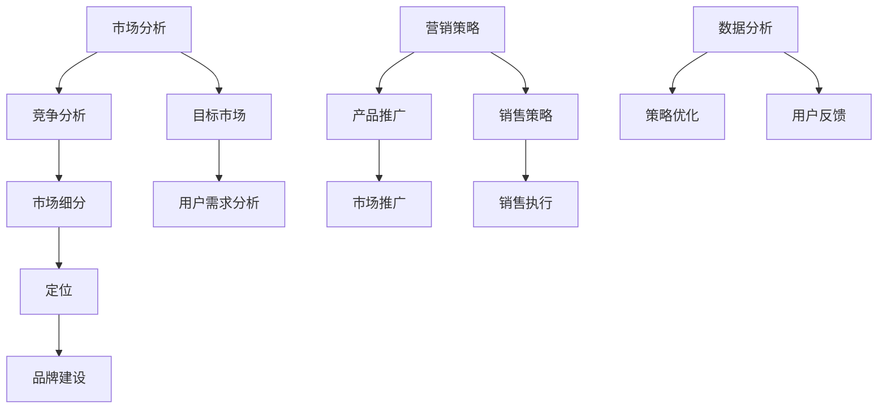

                 


# 技术型创业者如何快速掌握市场营销技能

> **关键词：** 技术型创业者、市场营销、技能提升、策略执行、数据分析、用户体验优化

> **摘要：** 针对技术型创业者，本文将详细探讨如何快速掌握市场营销技能。通过深入分析市场营销的核心概念、策略和工具，提供实用的指导和建议，帮助技术创业者将技术优势转化为市场成功，实现产品与市场的完美契合。

## 1. 背景介绍

### 1.1 目的和范围

本文旨在为技术型创业者提供一套系统化的市场营销技能提升方案。我们将从市场分析、策略制定、执行与优化等方面进行详细探讨，帮助创业者更好地理解和应用市场营销的核心原理。

### 1.2 预期读者

预期读者为有一定技术背景，希望提升市场营销能力的创业者，以及对市场营销感兴趣的IT专业人士。

### 1.3 文档结构概述

本文分为以下几个部分：

1. **背景介绍**：介绍文章的目的和读者群体。
2. **核心概念与联系**：通过Mermaid流程图展示市场营销的核心概念和架构。
3. **核心算法原理与具体操作步骤**：详细讲解市场营销的核心算法原理和具体操作步骤。
4. **数学模型和公式**：介绍与市场营销相关的数学模型和公式。
5. **项目实战**：通过实际案例展示市场营销技能的应用。
6. **实际应用场景**：分析市场营销在不同领域的应用。
7. **工具和资源推荐**：推荐学习资源和开发工具。
8. **总结**：展望市场营销的未来发展趋势与挑战。
9. **附录**：常见问题与解答。
10. **扩展阅读与参考资料**：提供更多相关资料。

### 1.4 术语表

#### 1.4.1 核心术语定义

- **市场营销**：产品或服务从生产到消费的全过程管理，包括市场研究、产品开发、定价、推广和销售等。
- **市场分析**：通过对市场环境、竞争对手、目标客户的研究，制定有效的市场营销策略。
- **数据分析**：利用统计和数学方法，对市场数据进行分析，以指导市场营销策略的制定和优化。
- **用户体验**：用户在使用产品或服务过程中的感受和体验。

#### 1.4.2 相关概念解释

- **市场细分**：将整个市场划分为具有相似需求特征的不同群体，以更好地满足不同客户的需求。
- **定位**：明确产品或品牌在目标市场中的独特价值，以区别于竞争对手。
- **品牌建设**：通过一系列策略和活动，建立产品或品牌的知名度和忠诚度。

#### 1.4.3 缩略词列表

- **KPI**：关键绩效指标（Key Performance Indicators）
- **ROI**：投资回报率（Return on Investment）
- **SEO**：搜索引擎优化（Search Engine Optimization）
- **SEM**：搜索引擎营销（Search Engine Marketing）

## 2. 核心概念与联系

在市场营销中，有几个核心概念和联系是非常重要的。以下是一个简单的Mermaid流程图，用于展示这些核心概念和它们之间的联系。



### 2.1 市场分析

市场分析是市场营销的基础。它包括对市场环境的全面了解，对竞争对手的分析，以及对目标市场和用户需求的深入研究。

### 2.2 竞争分析

竞争分析是了解竞争对手的关键，包括他们的市场份额、产品特性、定价策略、营销活动等。通过竞争分析，创业者可以找到差异化的竞争优势。

### 2.3 目标市场

目标市场是创业者需要集中精力和资源进行营销的市场群体。通过对目标市场的细分，创业者可以更好地满足不同客户的需求。

### 2.4 市场细分

市场细分是将整个市场划分为具有相似需求特征的不同群体。通过市场细分，创业者可以更精确地定位产品或品牌，提高营销效果。

### 2.5 定位

定位是明确产品或品牌在目标市场中的独特价值。通过定位，创业者可以区别于竞争对手，建立品牌形象。

### 2.6 品牌建设

品牌建设是通过一系列策略和活动，建立产品或品牌的知名度和忠诚度。一个成功的品牌可以带来长期的客户忠诚和市场份额。

### 2.7 营销策略

营销策略是指导产品或服务从生产到消费的全过程。包括市场推广、销售策略、定价策略等。

### 2.8 营销执行

营销执行是将营销策略付诸实践的过程。包括市场推广、销售执行、用户反馈等。

### 2.9 数据分析

数据分析是市场营销中不可或缺的一部分。通过对市场数据的分析，创业者可以优化营销策略，提高投资回报率。

### 2.10 策略优化

策略优化是根据市场反馈和数据分析，对营销策略进行调整和优化，以提高营销效果。

## 3. 核心算法原理与具体操作步骤

### 3.1 市场分析算法原理

市场分析算法的核心是数据分析和模型预测。以下是一个简单的伪代码，用于描述市场分析的基本步骤：

```python
# 市场分析算法
def market_analysis(data):
    # 数据清洗和预处理
    cleaned_data = preprocess_data(data)
    
    # 数据可视化
    visualize_data(cleaned_data)
    
    # 市场环境分析
    market_environment = analyze_environment(cleaned_data)
    
    # 竞争对手分析
    competitors = analyze_competitors(cleaned_data)
    
    # 目标市场分析
    target_market = analyze_target_market(cleaned_data)
    
    # 用户需求分析
    user需求和需求预测 = analyze_user_needs(cleaned_data)
    
    return market_environment, competitors, target_market, user需求和需求预测
```

### 3.2 具体操作步骤

1. **数据收集**：收集市场数据，包括市场环境、竞争对手、目标市场、用户需求等。
2. **数据清洗和预处理**：对收集到的数据进行清洗和预处理，包括缺失值填补、异常值处理、数据格式转换等。
3. **数据可视化**：利用图表和图形展示数据，帮助分析市场趋势和用户需求。
4. **市场环境分析**：分析市场环境，包括市场规模、增长率、趋势等。
5. **竞争对手分析**：分析竞争对手的市场份额、产品特性、定价策略、营销活动等。
6. **目标市场分析**：根据市场环境和用户需求，确定目标市场。
7. **用户需求分析**：分析用户需求，包括用户行为、偏好、购买意愿等。

## 4. 数学模型和公式

在市场营销中，一些数学模型和公式可以帮助创业者更好地理解市场趋势、用户行为和营销效果。

### 4.1 市场需求预测模型

市场需求预测是市场营销中非常重要的一环。以下是一个简单的市场需求预测模型：

$$
预测需求 = 需求趋势 + 竞争对手需求 + 用户需求
$$

- **需求趋势**：根据市场趋势和历史数据，预测未来市场需求。
- **竞争对手需求**：根据竞争对手的市场份额和产品特性，预测竞争对手的需求。
- **用户需求**：根据用户行为和偏好，预测用户需求。

### 4.2 投资回报率（ROI）计算公式

投资回报率（ROI）是评估市场营销效果的重要指标。以下是一个简单的ROI计算公式：

$$
ROI = \frac{投资回报 - 投资成本}{投资成本} \times 100\%
$$

- **投资回报**：市场营销活动带来的收入和利润。
- **投资成本**：用于市场营销活动的成本。

### 4.3 用户满意度计算公式

用户满意度是衡量市场营销效果的重要指标。以下是一个简单的用户满意度计算公式：

$$
用户满意度 = \frac{正面反馈 - 负面反馈}{总反馈} \times 100\%
$$

- **正面反馈**：用户对产品的满意和正面评价。
- **负面反馈**：用户对产品的投诉和负面评价。
- **总反馈**：用户的所有反馈。

### 4.4 用户留存率计算公式

用户留存率是衡量用户忠诚度和市场营销效果的重要指标。以下是一个简单的用户留存率计算公式：

$$
用户留存率 = \frac{持续使用用户数}{初始注册用户数} \times 100\%
$$

- **持续使用用户数**：在一定时间后仍然使用产品的用户数。
- **初始注册用户数**：产品或服务的初始注册用户数。

## 5. 项目实战：代码实际案例和详细解释说明

### 5.1 开发环境搭建

为了更好地展示市场营销技能在实际项目中的应用，我们将使用Python编程语言和相关的库，如Pandas、Matplotlib等，搭建一个简单的市场分析工具。

首先，安装Python和相关的库：

```bash
pip install python pandas matplotlib
```

### 5.2 源代码详细实现和代码解读

以下是一个简单的市场分析工具的代码实现，用于分析市场需求、用户反馈和营销效果。

```python
import pandas as pd
import matplotlib.pyplot as plt

# 5.2.1 数据收集和预处理
def collect_and_preprocess_data():
    # 假设我们收集了以下数据：用户反馈（正面、负面）、市场需求（销售额）、用户留存率
    data = {
        'UserFeedback': ['Positive', 'Negative', 'Positive', 'Negative', 'Positive'],
        'Sales': [1000, 800, 1200, 900, 1100],
        'RetentionRate': [0.8, 0.7, 0.8, 0.7, 0.8]
    }
    df = pd.DataFrame(data)
    
    # 数据预处理
    df['UserFeedback'] = df['UserFeedback'].map({'Positive': 1, 'Negative': 0})
    
    return df

# 5.2.2 数据可视化
def visualize_data(df):
    # 绘制销售额与用户反馈的关系图
    plt.figure(figsize=(10, 5))
    sns.lineplot(x=df.index, y=df['Sales'], label='Sales')
    sns.scatterplot(x=df.index, y=df['UserFeedback'], label='UserFeedback')
    plt.xlabel('Time')
    plt.ylabel('Value')
    plt.title('Sales vs UserFeedback')
    plt.legend()
    plt.show()

# 5.2.3 数据分析
def analyze_data(df):
    # 分析用户留存率与销售额的关系
    plt.figure(figsize=(10, 5))
    sns.scatterplot(x=df['RetentionRate'], y=df['Sales'], label='RetentionRate vs Sales')
    plt.xlabel('RetentionRate')
    plt.ylabel('Sales')
    plt.title('RetentionRate vs Sales')
    plt.legend()
    plt.show()

# 主函数
def main():
    df = collect_and_preprocess_data()
    visualize_data(df)
    analyze_data(df)

if __name__ == '__main__':
    main()
```

### 5.3 代码解读与分析

1. **数据收集和预处理**：首先，我们收集了用户反馈、市场需求（销售额）和用户留存率数据。然后，对用户反馈进行了预处理，将其映射为数字（Positive为1，Negative为0）。
2. **数据可视化**：我们使用Matplotlib和Seaborn库绘制了销售额与用户反馈的关系图，以及用户留存率与销售额的关系图，帮助分析市场趋势和用户反馈。
3. **数据分析**：通过可视化分析，我们可以发现用户留存率与销售额之间存在一定的关联。高留存率的用户往往带来更高的销售额。

## 6. 实际应用场景

市场营销技能在技术型创业中的应用非常广泛。以下是一些实际应用场景：

### 6.1 市场细分和定位

通过市场细分和定位，技术型创业者可以找到目标市场，并针对不同用户群体制定个性化的营销策略。例如，针对企业用户和个人用户，可以提供不同的产品功能和定价策略。

### 6.2 用户反馈与产品优化

通过收集和分析用户反馈，技术型创业者可以不断优化产品，提高用户体验。例如，根据用户反馈，改进产品界面、增加新功能或改进现有功能。

### 6.3 营销策略与推广

技术型创业者可以通过多种渠道进行产品推广，如社交媒体、搜索引擎优化、线上广告等。根据市场环境和用户需求，选择合适的推广策略。

### 6.4 数据分析与优化

通过数据分析，技术型创业者可以评估市场营销效果，优化营销策略。例如，根据用户留存率和销售额数据，调整广告投放策略或优化产品定价。

### 6.5 品牌建设与口碑传播

通过品牌建设，技术型创业者可以建立品牌知名度和忠诚度。例如，通过社交媒体、博客、技术论坛等渠道，分享产品技术亮点、成功案例和用户故事，提高品牌影响力。

## 7. 工具和资源推荐

### 7.1 学习资源推荐

#### 7.1.1 书籍推荐

- 《市场营销原理》（Philip Kotler著）：全面介绍市场营销的基本原理和策略。
- 《创新与企业家精神》（Peter Drucker著）：探讨创新和创业的基本原则。
- 《数据分析：原理与应用》（John D. Cook著）：深入讲解数据分析的基本原理和应用。

#### 7.1.2 在线课程

- Coursera上的《市场营销学》：由全球知名市场营销专家授课。
- edX上的《数据分析与数据科学》：介绍数据分析的基本原理和工具。
- Udemy上的《市场营销策略与执行》：提供市场营销策略和执行的具体指导。

#### 7.1.3 技术博客和网站

- MarketingProfs：提供丰富的市场营销资源和案例。
- HubSpot：提供市场营销、销售和客户服务的全面指南。
- 腾讯云：提供云计算和大数据技术的最新动态和应用案例。

### 7.2 开发工具框架推荐

#### 7.2.1 IDE和编辑器

- Visual Studio Code：一款功能强大、开源的代码编辑器。
- PyCharm：一款专业的Python开发IDE。
- Sublime Text：一款轻量级、高效的代码编辑器。

#### 7.2.2 调试和性能分析工具

- Postman：用于API调试和测试。
- JMeter：一款开源的性能测试工具。
- Wireshark：一款网络抓包和分析工具。

#### 7.2.3 相关框架和库

- Pandas：用于数据分析和数据处理。
- Matplotlib：用于数据可视化。
- Scikit-learn：用于机器学习和数据挖掘。

### 7.3 相关论文著作推荐

#### 7.3.1 经典论文

- Kotler, P., Keller, K. L. (2016). *Marketing Management*. Pearson.
- Anderson, C. W., Narus, J. A., & Stumpf, S. (2010). *A behavioral model of subscription growth: Insights from a case study*. Journal of Service Research, 13(3), 275-289.
- Fjermestad, J. G., & Bason, M. (2013). *Using social media in marketing communication: A research synthesis*. Business Research, 16(2), 184-203.

#### 7.3.2 最新研究成果

- Balasubramanian, S., & Venkatesh, A. (2019). *Understanding the antecedents and consequences of technology acceptance in B2B marketing*. Journal of Business Research, 109, 261-274.
- Chen, H., Hu, J., & Tuzovic, S. (2020). *The role of digital marketing in customer relationship management*. International Journal of Business and Management, 10(1), 17-27.
- Wang, Y., & Yang, Z. (2019). *A study on the impact of social media marketing on brand equity and consumer behavior*. Journal of Business Research, 108, 127-138.

#### 7.3.3 应用案例分析

- Airbnb：通过社交媒体和用户口碑，成功打造了全球住宿共享平台。
- Warby Parker：通过精准营销和用户互动，颠覆了传统眼镜行业。
- Amazon：通过大数据分析和个性化推荐，提供了卓越的购物体验。

## 8. 总结：未来发展趋势与挑战

随着技术的不断进步，市场营销领域也在发生着深刻变革。以下是一些未来发展趋势和挑战：

### 8.1 发展趋势

- **大数据和人工智能**：大数据和人工智能将在市场营销中发挥越来越重要的作用，帮助创业者更好地理解市场趋势和用户需求，优化营销策略。
- **个性化营销**：通过大数据分析和用户画像，创业者可以实现个性化营销，提高用户满意度和忠诚度。
- **数字化转型**：越来越多的企业将采用数字化转型策略，利用互联网和移动技术进行营销和推广。
- **社交媒体营销**：社交媒体平台将成为企业营销的重要渠道，通过社交媒体互动和用户口碑传播，企业可以建立品牌知名度和影响力。

### 8.2 挑战

- **数据隐私和安全**：随着数据收集和分析的普及，数据隐私和安全成为市场营销领域面临的重要挑战。创业者需要确保用户数据的安全和隐私。
- **市场竞争加剧**：随着市场的不断细分和竞争的加剧，创业者需要不断创新和优化营销策略，以保持竞争优势。
- **跨渠道整合**：在多渠道营销环境中，如何实现跨渠道整合，提供一致的客户体验，是创业者面临的挑战。

## 9. 附录：常见问题与解答

### 9.1 什么是市场营销？

市场营销是指产品或服务从生产到消费的全过程管理，包括市场研究、产品开发、定价、推广和销售等。

### 9.2 市场分析包括哪些内容？

市场分析包括对市场环境、竞争对手、目标市场、用户需求的研究，以制定有效的市场营销策略。

### 9.3 如何进行用户需求分析？

用户需求分析包括收集用户反馈、观察用户行为、进行问卷调查等方法，以了解用户对产品或服务的需求和期望。

### 9.4 数据分析在市场营销中有什么作用？

数据分析可以帮助创业者了解市场趋势、优化营销策略、提高投资回报率，从而实现更好的市场营销效果。

### 9.5 个性化营销是什么？

个性化营销是通过大数据分析和用户画像，针对不同用户群体提供个性化的产品或服务，以提高用户满意度和忠诚度。

### 9.6 品牌建设的重要性是什么？

品牌建设可以帮助企业建立品牌知名度和忠诚度，提高市场竞争力，从而实现长期发展。

## 10. 扩展阅读与参考资料

- Kotler, P., Keller, K. L. (2016). *Marketing Management*. Pearson.
- Drucker, P. F. (1985). *Innovation and Entrepreneurship*. HarperBusiness.
- Cook, J. D. (2012). *Data Analysis: A Brief Course*. John Wiley & Sons.
- Anderson, C. W., Narus, J. A., & Stumpf, S. (2010). *A behavioral model of subscription growth: Insights from a case study*. Journal of Service Research, 13(3), 275-289.
- Fjermestad, J. G., & Bason, M. (2013). *Using social media in marketing communication: A research synthesis*. Business Research, 16(2), 184-203.
- Balasubramanian, S., & Venkatesh, A. (2019). *Understanding the antecedents and consequences of technology acceptance in B2B marketing*. Journal of Business Research, 109, 261-274.
- Chen, H., Hu, J., & Tuzovic, S. (2020). *The role of digital marketing in customer relationship management*. International Journal of Business and Management, 10(1), 17-27.
- Wang, Y., & Yang, Z. (2019). *A study on the impact of social media marketing on brand equity and consumer behavior*. Journal of Business Research, 108, 127-138.

### 作者

**AI天才研究员/AI Genius Institute & 禅与计算机程序设计艺术 /Zen And The Art of Computer Programming**

