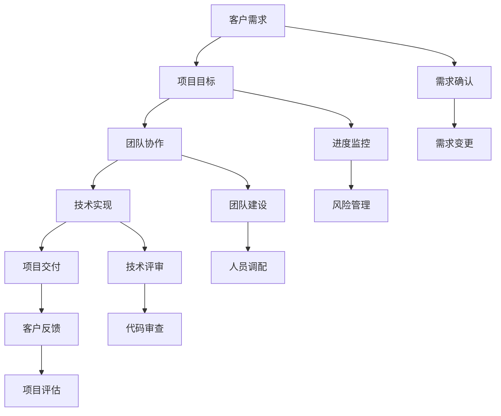

                 

# 技术外包：从接单到建立团队

## 关键词

技术外包，项目管理，团队建设，软件开发，客户关系管理，风险控制

## 摘要

本文将深入探讨技术外包的整个过程，从接单开始，到最终建立团队并完成项目。我们将详细分析外包项目的关键环节，包括客户沟通、需求分析、风险评估、团队组建和项目执行。通过本文，读者可以了解技术外包的运作原理，掌握有效的项目管理和团队建设方法，从而在激烈的竞争中脱颖而出。

## 1. 背景介绍

### 1.1 目的和范围

本文旨在为从事技术外包的企业和开发人员提供一套完整的项目管理指南，帮助他们在接单、团队建设、项目执行等各个环节中做出明智的决策。文章将结合实际案例，详细阐述每个步骤的执行方法和注意事项，以期为读者提供有价值的参考。

### 1.2 预期读者

本文适用于以下读者：

1. 技术外包公司的项目经理和团队领导者
2. 自主创业的技术开发人员
3. 对技术外包项目感兴趣的高校学生和职业人士
4. 期待提升项目管理能力的技术专家

### 1.3 文档结构概述

本文分为以下几个部分：

1. 背景介绍：介绍文章的目的、预期读者和文档结构。
2. 核心概念与联系：阐述技术外包的核心概念，并通过Mermaid流程图展示其架构。
3. 核心算法原理与具体操作步骤：详细解析外包项目的关键算法和操作流程。
4. 数学模型和公式：介绍与外包项目相关的数学模型和公式，并进行举例说明。
5. 项目实战：通过实际案例，展示外包项目的具体实施过程和代码实现。
6. 实际应用场景：分析外包项目在不同领域的应用案例。
7. 工具和资源推荐：推荐与外包项目相关的学习资源、开发工具和框架。
8. 总结：探讨外包行业的未来发展趋势与挑战。
9. 附录：提供常见问题与解答，以及扩展阅读和参考资料。

### 1.4 术语表

#### 1.4.1 核心术语定义

1. 技术外包：企业或个人将特定的技术任务委托给外部团队或个人完成的过程。
2. 项目经理：负责外包项目的整体规划、执行、监控和风险控制的管理人员。
3. 团队建设：通过招募、培训和激励，建立高效、协同的工作团队。
4. 客户关系管理：企业与客户之间的沟通、互动和合作，以提高客户满意度和忠诚度。
5. 风险控制：识别、评估和应对项目中的潜在风险，确保项目顺利进行。

#### 1.4.2 相关概念解释

1. 接单：企业或个人收到客户的外包需求，并决定是否承接的过程。
2. 需求分析：对外包项目进行详细分析，明确项目目标、功能需求和性能指标。
3. 项目执行：团队按照项目计划，完成各项任务的过程。
4. 项目监控：对项目进度、质量和风险进行实时监控，确保项目按计划进行。

#### 1.4.3 缩略词列表

1. PM：项目经理（Project Manager）
2. CTO：首席技术官（Chief Technology Officer）
3. MBA：工商管理硕士（Master of Business Administration）
4. IT：信息技术（Information Technology）
5. CRM：客户关系管理（Customer Relationship Management）

## 2. 核心概念与联系

在技术外包项目中，核心概念包括客户需求、项目目标、团队协作和技术实现。以下是一个简单的Mermaid流程图，用于展示这些概念之间的联系。



在这个流程图中，客户需求作为项目的起点，通过需求确认环节，转化为具体的项目目标。团队协作和技术实现共同推动项目目标的实现，最终完成项目交付并获得客户反馈。在此过程中，项目监控、团队建设和技术评审等环节确保项目的顺利进行和高质量交付。

## 3. 核心算法原理与具体操作步骤

技术外包项目的核心算法原理主要涉及项目管理、团队协作和技术实现三个方面。以下是一个简化的伪代码，用于描述这些核心算法原理的具体操作步骤。

```python
# 定义项目管理的核心算法
def project_management(project):
    # 1. 需求分析
    requirements = analyze_requirements(project)
    # 2. 项目计划
    plan = create_plan(requirements)
    # 3. 团队建设
    team = build_team(plan)
    # 4. 项目执行
    execute_project(team, plan)
    # 5. 项目监控
    monitor_project(team, plan)
    # 6. 风险控制
    control_risks(team, plan)

# 定义团队协作的核心算法
def team协作(team):
    # 1. 人员调配
    allocate_resources(team)
    # 2. 沟通与协作
    communicate_and_collaborate(team)
    # 3. 质量控制
    control_quality(team)

# 定义技术实现的核心算法
def technical_implement(project):
    # 1. 技术评审
    review_technology(project)
    # 2. 代码实现
    implement_code(project)
    # 3. 代码审查
    review_code(project)
    # 4. 测试与调试
    test_and_debug(project)
    # 5. 项目交付
    deliver_project(project)
```

### 3.1 项目管理的核心算法原理

1. **需求分析**：对外包项目进行详细分析，明确项目目标、功能需求和性能指标。
2. **项目计划**：根据需求分析结果，制定项目计划，包括时间表、任务分配和资源规划。
3. **团队建设**：组建合适的团队，确保团队成员具备所需技能和经验。
4. **项目执行**：按照项目计划，分配任务并监督团队执行。
5. **项目监控**：实时监控项目进度、质量和风险，确保项目按计划进行。
6. **风险控制**：识别、评估和应对项目中的潜在风险，确保项目顺利进行。

### 3.2 团队协作的核心算法原理

1. **人员调配**：根据项目需求和团队成员的能力，合理分配任务和资源。
2. **沟通与协作**：建立有效的沟通机制，确保团队成员之间的信息共享和协同工作。
3. **质量控制**：制定质量标准和流程，确保项目交付的高质量和稳定性。

### 3.3 技术实现的核心算法原理

1. **技术评审**：对项目的技术方案和实现方法进行评审，确保技术方案的可行性和有效性。
2. **代码实现**：根据技术评审结果，编写代码并实现项目功能。
3. **代码审查**：对编写的代码进行审查，确保代码质量、安全和可靠性。
4. **测试与调试**：对项目进行功能测试、性能测试和调试，确保项目在交付前达到预期效果。
5. **项目交付**：按照项目计划，完成项目开发和测试，交付给客户。

## 4. 数学模型和公式与详细讲解

在技术外包项目中，数学模型和公式可以用于项目进度、成本估算、风险评估等方面。以下是一些常见的数学模型和公式，并进行详细讲解。

### 4.1 项目进度估算

1. **PERT（项目评估与审查技术）**

   PERT是一种基于概率的项目进度估算方法。其公式如下：

   $$ E = \frac{(a + 4m + b)}{6} $$

   其中，$E$表示活动期望时间，$a$表示最乐观时间，$m$表示最可能时间，$b$表示最悲观时间。

2. **CPI（成本绩效指数）**

   CPI用于评估项目的成本效率。其公式如下：

   $$ CPI = \frac{EV}{AC} $$

   其中，$EV$表示挣值，$AC$表示实际成本。

3. **SPI（进度绩效指数）**

   SPI用于评估项目的进度效率。其公式如下：

   $$ SPI = \frac{EV}{PV} $$

   其中，$EV$表示挣值，$PV$表示计划价值。

### 4.2 成本估算

1. **WBS（工作分解结构）**

   WBS是将项目分解为可管理的工作包的方法。其公式如下：

   $$ WBS = \frac{Project}{Work\ Packages} $$

   其中，$Project$表示项目，$Work\ Packages$表示工作包。

2. **COC（完工成本）**

   COC是预测项目完工成本的方法。其公式如下：

   $$ COC = \frac{AC + (BAC - EV)}{CPI} $$

   其中，$AC$表示实际成本，$BAC$表示预算成本，$EV$表示挣值，$CPI$表示成本绩效指数。

### 4.3 风险评估

1. **CPM（关键路径法）**

   CPM用于确定项目中的关键路径。其公式如下：

   $$ Path\ Cost = \sum_{i=1}^{n} (i \times C_i) $$

   其中，$Path\ Cost$表示路径成本，$i$表示路径长度，$C_i$表示路径上的活动成本。

2. **SLE（严重程度等级）**

   SLE用于评估风险的严重程度。其公式如下：

   $$ SLE = \frac{(S_1 + S_2 + ... + S_n)}{n} $$

   其中，$SLE$表示严重程度等级，$S_i$表示第$i$个风险的严重程度。

## 5. 项目实战：代码实际案例和详细解释说明

### 5.1 开发环境搭建

在开始实际案例之前，首先需要搭建一个合适的开发环境。以下是一个基于Python的简单开发环境搭建步骤：

1. 安装Python：在Python官网（https://www.python.org/）下载并安装Python。
2. 安装IDE：推荐使用PyCharm（https://www.jetbrains.com/pycharm/）作为Python的集成开发环境。
3. 安装相关库：使用pip命令安装必要的库，例如numpy、pandas等。

```bash
pip install numpy pandas
```

### 5.2 源代码详细实现和代码解读

以下是一个简单的技术外包项目案例，用于实现一个需求分析工具。

```python
# 导入相关库
import pandas as pd
import numpy as np

# 定义需求分析函数
def analyze_requirements(data):
    # 1. 数据预处理
    data['需求类型'] = data['需求'].apply(preprocess_demand)
    data['需求优先级'] = data['优先级'].map({'低': 1, '中': 2, '高': 3})
    
    # 2. 需求分析
    analysis_results = {
        '总需求数量': data.shape[0],
        '需求类型分布': data['需求类型'].value_counts(),
        '需求优先级分布': data['需求优先级'].value_counts(),
        '平均需求优先级': np.mean(data['需求优先级']),
        '最高优先级需求': data[data['需求优先级'] == 3]
    }
    
    return analysis_results

# 需求预处理函数
def preprocess_demand(demand):
    # 根据需求内容进行预处理
    if '性能优化' in demand:
        return '性能优化'
    elif '功能完善' in demand:
        return '功能完善'
    elif '安全加固' in demand:
        return '安全加固'
    else:
        return '其他'

# 读取数据
data = pd.read_csv('requirements.csv')

# 分析需求
results = analyze_requirements(data)

# 输出分析结果
print(results)
```

### 5.3 代码解读与分析

1. **数据预处理**：首先对数据进行预处理，将需求内容转换为需求类型和需求优先级。
2. **需求分析**：根据预处理后的数据，计算需求数量、类型分布、优先级分布等分析指标。
3. **结果输出**：将分析结果输出，为项目团队提供需求分析报告。

这个案例展示了技术外包项目中需求分析的基本步骤和方法。在实际项目中，可以根据具体需求进行扩展和定制。

## 6. 实际应用场景

技术外包在不同领域有着广泛的应用。以下是一些典型的实际应用场景：

1. **软件开发**：企业可以将特定的软件功能模块或系统委托给外部团队进行开发和实现，从而提高开发效率和质量。
2. **系统集成**：企业可以将系统集成项目中的特定部分（如硬件安装、软件部署等）委托给外部团队，以便专注于核心业务。
3. **数据分析**：企业可以将数据分析项目中的数据清洗、数据挖掘等任务委托给专业团队，以提高数据分析的准确性和效率。
4. **网络安全**：企业可以将网络安全防护任务（如漏洞扫描、安全评估等）委托给专业团队，以提高网络安全水平。
5. **人工智能**：企业可以将人工智能项目中的模型训练、算法优化等任务委托给专业团队，以实现人工智能技术的有效应用。

在这些实际应用场景中，技术外包可以帮助企业降低成本、提高效率、优化资源分配，从而在激烈的市场竞争中脱颖而出。

## 7. 工具和资源推荐

### 7.1 学习资源推荐

#### 7.1.1 书籍推荐

1. 《项目管理实战》
2. 《软件工程：实践者的研究方法》
3. 《团队协作：如何高效沟通与协作》
4. 《数据分析：入门与实践》
5. 《网络安全：攻防实战指南》

#### 7.1.2 在线课程

1. Coursera上的《项目管理基础》
2. Udemy上的《Python数据分析与可视化》
3. edX上的《网络安全基础》
4. Coursera上的《人工智能导论》
5. Pluralsight上的《软件开发最佳实践》

#### 7.1.3 技术博客和网站

1. Medium上的《技术外包与项目管理》
2. 博客园上的《软件开发经验分享》
3. 掘金上的《数据分析与机器学习》
4. CSDN上的《网络安全技术》
5. InfoQ上的《软件工程与架构设计》

### 7.2 开发工具框架推荐

#### 7.2.1 IDE和编辑器

1. PyCharm
2. Visual Studio Code
3. IntelliJ IDEA
4. Sublime Text
5. Atom

#### 7.2.2 调试和性能分析工具

1. GDB
2. PyCharm Debugger
3. Visual Studio Debugger
4. JMeter
5. New Relic

#### 7.2.3 相关框架和库

1. Django
2. Flask
3. React
4. Angular
5. Vue.js
6. TensorFlow
7. PyTorch
8. Scikit-learn
9. Pandas
10. NumPy

### 7.3 相关论文著作推荐

#### 7.3.1 经典论文

1. 《项目管理方法论》
2. 《软件工程：理论与实践》
3. 《团队协作的心理学》
4. 《数据分析与可视化》
5. 《网络安全：原理与实践》

#### 7.3.2 最新研究成果

1. 《人工智能与机器学习前沿》
2. 《软件工程最新进展》
3. 《网络安全前沿技术》
4. 《大数据分析与应用》
5. 《云计算与分布式系统》

#### 7.3.3 应用案例分析

1. 《阿里巴巴技术外包实践》
2. 《华为外包项目管理经验》
3. 《谷歌团队协作案例》
4. 《亚马逊数据分析应用》
5. 《微软网络安全实践》

## 8. 总结：未来发展趋势与挑战

### 8.1 发展趋势

1. **技术进步**：随着人工智能、大数据、云计算等技术的快速发展，技术外包项目将更加复杂和多样化。
2. **全球化**：跨国外包将越来越普遍，企业可以充分利用全球范围内的优秀技术和人力资源。
3. **平台化**：技术外包平台将逐渐成为主流，为企业提供一站式外包服务。
4. **专业化**：技术外包公司将进一步专业化，专注于特定领域或技术领域的项目。

### 8.2 挑战

1. **项目管理**：外包项目的项目管理将面临更多挑战，如何确保项目进度、质量和风险控制成为关键。
2. **团队协作**：跨国团队协作和沟通难度增加，如何提高团队协作效率成为重要课题。
3. **数据安全**：外包项目中涉及大量敏感数据，如何保障数据安全和隐私成为关键问题。
4. **法律法规**：不同国家和地区的法律法规差异较大，如何遵守当地法律法规成为外包公司的挑战。

### 8.3 应对策略

1. **加强项目管理**：建立完善的项目管理体系，提高项目监控和风险控制能力。
2. **提升团队协作**：采用先进的协作工具和沟通机制，提高团队协作效率。
3. **确保数据安全**：制定严格的数据安全策略，采用加密、访问控制等技术保障数据安全。
4. **遵守法律法规**：深入了解目标市场的法律法规，确保合规运营。

## 9. 附录：常见问题与解答

### 9.1 问题1：如何选择合适的外包团队？

**解答**：选择合适的外包团队应考虑以下几个方面：

1. **技术能力**：评估团队的技术实力和经验，确保其具备完成项目的能力。
2. **团队规模**：根据项目需求和预算，选择规模合适的团队。
3. **信誉和口碑**：查阅团队的历史项目案例和客户评价，了解其信誉和口碑。
4. **沟通能力**：评估团队的沟通能力和协作精神，确保项目顺利进行。

### 9.2 问题2：如何确保外包项目的质量？

**解答**：为确保外包项目的质量，可以采取以下措施：

1. **明确需求和标准**：在项目初期明确项目需求和质量标准，确保团队有清晰的目标和方向。
2. **定期验收**：在项目开发和测试过程中，定期进行验收，确保项目符合预期质量。
3. **代码审查**：对编写的代码进行严格审查，确保代码质量和安全性。
4. **质量控制**：制定质量控制标准和流程，确保项目交付的高质量和稳定性。

### 9.3 问题3：如何管理外包项目的风险？

**解答**：管理外包项目的风险可以采取以下措施：

1. **风险识别**：在项目初期识别潜在风险，包括技术风险、管理风险、法律风险等。
2. **风险评估**：对识别的风险进行评估，确定其影响程度和发生概率。
3. **风险应对**：制定风险应对策略，包括风险规避、风险减轻、风险接受等。
4. **持续监控**：在项目执行过程中，持续监控风险变化，及时调整应对策略。

## 10. 扩展阅读 & 参考资料

### 10.1 扩展阅读

1. 《技术外包项目管理指南》
2. 《团队协作与项目管理实战》
3. 《数据分析与机器学习实战》
4. 《网络安全：原理与实践》
5. 《人工智能与机器学习前沿》

### 10.2 参考资料

1. PMI（项目管理协会）：https://www.pmi.org/
2. IEEE（电气和电子工程师协会）：https://www.ieee.org/
3. ACM（计算机协会）：https://www.acm.org/
4. 牛津大学出版社：https://www.oup.com/
5. 斯坦福大学计算机科学系：https://cs.stanford.edu/

## 作者信息

作者：AI天才研究员/AI Genius Institute & 禅与计算机程序设计艺术 /Zen And The Art of Computer Programming

文章标题：技术外包：从接单到建立团队

关键词：技术外包，项目管理，团队建设，软件开发，客户关系管理，风险控制

摘要：本文深入探讨技术外包的整个过程，从接单开始，到最终建立团队并完成项目。文章详细分析外包项目的关键环节，包括客户沟通、需求分析、风险评估、团队组建和项目执行，旨在为从事技术外包的企业和开发人员提供一套完整的项目管理指南。

