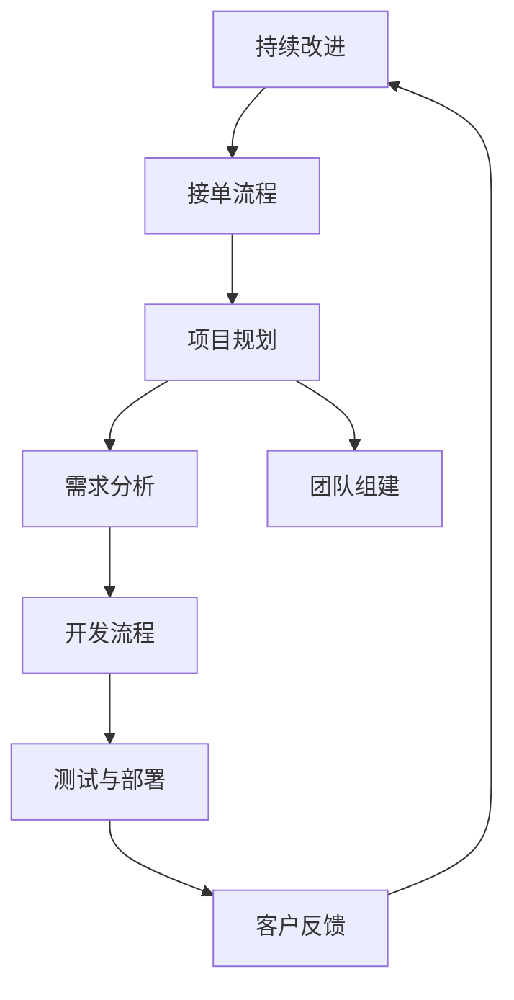

                 

# 技术外包：从接单到建立工作室

> 关键词：技术外包、接单、工作室、项目流程、项目管理、技术团队、创业

> 摘要：本文将深入探讨技术外包的运作模式，从接单到建立工作室的完整流程。通过分析核心概念、算法原理、数学模型、项目实战和实际应用场景，提供全面的指导，帮助读者了解如何成功开展技术外包业务，并在竞争激烈的市场中脱颖而出。

## 1. 背景介绍

### 1.1 目的和范围

本文旨在为那些希望进入技术外包领域，或者正在考虑扩展业务的技术专业人士提供全面的指导。文章将覆盖从接单、项目规划、项目管理到最终建立自己的技术工作室的整个流程。我们希望帮助读者理解外包业务的基本原理，掌握关键技能，并制定有效的业务策略。

### 1.2 预期读者

本文适合以下读者群体：

- 初入行的技术外包从业者
- 有志于拓展业务的技术公司创始人
- 技术团队负责人
- 对技术外包业务感兴趣的学生和研究人员

### 1.3 文档结构概述

本文将分为以下几个部分：

- 核心概念与联系：介绍技术外包的核心概念和架构。
- 核心算法原理与具体操作步骤：讲解技术外包项目的核心算法和操作流程。
- 数学模型和公式：详细阐述与外包业务相关的数学模型和计算方法。
- 项目实战：通过实际案例展示外包项目的开发和实现过程。
- 实际应用场景：分析技术外包在不同领域的应用和挑战。
- 工具和资源推荐：推荐学习资源、开发工具和框架。
- 总结：对未来外包领域的发展趋势和挑战进行展望。
- 附录：常见问题与解答。

### 1.4 术语表

#### 1.4.1 核心术语定义

- 技术外包：将特定技术任务委托给外部专业团队或个人完成。
- 接单：从客户那里获取外包项目的过程。
- 项目管理：规划和执行项目，以确保项目按时、按预算和按质量完成。
- 工作室：由专业技术人员组成的团队，专门从事外包业务。

#### 1.4.2 相关概念解释

- 外包公司：提供外包服务的企业。
- 客户：委托外包项目的企业或个人。
- 项目经理：负责规划和执行项目的专业人员。
- 开发团队：执行具体开发任务的团队。

#### 1.4.3 缩略词列表

- API：应用程序编程接口（Application Programming Interface）
- CRM：客户关系管理（Customer Relationship Management）
- PM：项目经理（Project Manager）
- SEO：搜索引擎优化（Search Engine Optimization）
- SaaS：软件即服务（Software as a Service）

## 2. 核心概念与联系

在技术外包中，理解核心概念和它们之间的联系至关重要。以下是技术外包的基本概念和它们之间的联系，我们将使用 Mermaid 流程图来展示这些概念和联系。



### 2.1 接单流程

接单是外包项目的第一步，客户将需求提交给外包公司。接单流程包括以下几个步骤：

1. **需求接收**：客户通过电话、电子邮件或在线平台提交需求。
2. **需求评估**：项目经理评估需求，确认是否能够承接。
3. **报价**：根据需求，提供报价和项目周期。
4. **合同签订**：双方签订合同，明确项目范围、费用、交付时间和质量标准。

### 2.2 项目规划

项目规划是确保项目成功的关键。项目经理负责制定项目计划，包括以下步骤：

1. **需求分析**：详细分析客户需求，制定详细的需求文档。
2. **项目计划**：制定项目进度表、资源分配和时间表。
3. **风险评估**：识别潜在风险，并制定应对策略。

### 2.3 需求分析

需求分析是理解客户需求的过程，包括：

1. **收集需求**：与客户沟通，收集详细信息。
2. **需求文档**：编写需求文档，确保所有需求都得到明确记录。
3. **需求评审**：与客户一起评审需求文档，确保理解一致。

### 2.4 团队组建

团队组建是确保项目能够顺利执行的重要环节。项目经理根据项目需求，组建合适的开发团队，包括：

1. **确定团队成员**：根据项目需求，选择合适的技术专家和团队成员。
2. **团队沟通**：建立有效的沟通机制，确保团队成员之间能够顺畅合作。
3. **职责分配**：明确团队成员的职责和工作任务。

## 3. 核心算法原理 & 具体操作步骤

技术外包项目的核心是解决客户的需求，这通常涉及到一系列的算法设计和实现。以下是技术外包项目中的核心算法原理和具体操作步骤，我们将使用伪代码来详细阐述。

### 3.1 需求分析算法

```python
def analyze_demand(client_demand):
    """
    分析客户需求，提取关键信息。
    :param client_demand: 客户需求文档
    :return: 需求摘要和功能列表
    """
    key_info = {}
    functional_requirements = []

    # 读取需求文档，提取关键信息
    for section in client_demand:
        if section['type'] == 'requirement':
            key_info[section['name']] = section['description']
            if section['category'] == 'functional':
                functional_requirements.append(section)

    return key_info, functional_requirements
```

### 3.2 项目计划算法

```python
def plan_project(key_info, functional_requirements):
    """
    根据需求分析结果，制定项目计划。
    :param key_info: 需求摘要
    :param functional_requirements: 功能列表
    :return: 项目计划和时间表
    """
    project_plan = {
        'start_date': None,
        'end_date': None,
        'tasks': [],
        'resources': [],
        'budget': 0
    }

    # 确定项目开始和结束时间
    project_plan['start_date'] = current_date()
    project_plan['end_date'] = add_days(current_date(), get_project_duration(key_info, functional_requirements))

    # 添加任务和资源
    for requirement in functional_requirements:
        task = {
            'name': requirement['name'],
            'duration': get_task_duration(requirement),
            'assigned_to': get_assigned_personnel(requirement),
            'start_date': add_days(project_plan['start_date'], get_previous_task_end_date(project_plan['tasks'])),
            'end_date': add_days(project_plan['start_date'], get_task_duration(requirement))
        }
        project_plan['tasks'].append(task)
        project_plan['resources'].append(task['assigned_to'])
        project_plan['budget'] += get_task_cost(task)

    return project_plan
```

### 3.3 风险评估算法

```python
def assess_risks(project_plan):
    """
    评估项目风险，并制定应对策略。
    :param project_plan: 项目计划
    :return: 风险评估结果和应对策略
    """
    risks = []
    risk.mitigation_strategy = None

    # 识别潜在风险
    for task in project_plan['tasks']:
        if task['duration'] > critical_duration:
            risks.append({
                'name': '任务超时',
                'impact': '项目延期',
                'likelihood': '高',
                'task': task['name']
            })

    # 制定应对策略
    for risk in risks:
        if risk['impact'] == '项目延期':
            risk['mitigation_strategy'] = '增加人力资源或调整任务优先级'

    return risks
```

## 4. 数学模型和公式 & 详细讲解 & 举例说明

在技术外包项目中，数学模型和公式用于评估项目进度、成本和风险。以下是几个关键的数学模型和它们的详细讲解。

### 4.1 项目持续时间模型

项目持续时间（\( T \)）可以通过以下公式计算：

\[ T = \sum_{i=1}^{n} d_i \]

其中，\( d_i \) 是第 \( i \) 个任务的持续时间。这个公式简单地累加所有任务的持续时间，得到整个项目的持续时间。

### 4.2 项目成本模型

项目成本（\( C \)）可以通过以下公式计算：

\[ C = \sum_{i=1}^{n} c_i \]

其中，\( c_i \) 是第 \( i \) 个任务的成本。这个公式简单地累加所有任务的成本，得到整个项目的总成本。

### 4.3 风险评估模型

风险评估模型通常使用概率和影响矩阵来计算风险得分。以下是风险得分的计算公式：

\[ \text{Risk Score} = \text{Probability} \times \text{Impact} \]

其中，概率和影响都是介于 0 和 1 之间的数值，用于评估风险的发生可能性和如果风险发生的影响程度。

### 4.4 举例说明

假设我们有一个包含三个任务的外包项目，每个任务的持续时间和成本如下：

- 任务 A：持续时间 5 天，成本 1000 美元
- 任务 B：持续时间 3 天，成本 1500 美元
- 任务 C：持续时间 4 天，成本 1200 美元

根据项目持续时间模型，项目的总持续时间为：

\[ T = 5 + 3 + 4 = 12 \text{ 天} \]

根据项目成本模型，项目的总成本为：

\[ C = 1000 + 1500 + 1200 = 3700 \text{ 美元} \]

假设任务 A 的风险概率为 0.5，影响为 0.8，任务 B 和任务 C 的风险概率和影响分别为 0.3 和 0.6，根据风险评估模型，每个任务的风险得分为：

- 任务 A：\( 0.5 \times 0.8 = 0.4 \)
- 任务 B：\( 0.3 \times 0.6 = 0.18 \)
- 任务 C：\( 0.3 \times 0.6 = 0.18 \)

总风险得分为：

\[ \text{Total Risk Score} = 0.4 + 0.18 + 0.18 = 0.76 \]

## 5. 项目实战：代码实际案例和详细解释说明

### 5.1 开发环境搭建

在开始实际项目开发之前，我们需要搭建一个合适的技术环境。以下是搭建开发环境的步骤：

1. **安装操作系统**：选择一个稳定且适合开发的外包项目的操作系统，如 Ubuntu 20.04。
2. **安装开发工具**：安装必要的开发工具，如 Python 3、Node.js、Git 和 MySQL。
3. **配置版本控制**：设置 Git 仓库，确保代码版本控制和协作开发。
4. **安装数据库**：安装 MySQL 或其他关系型数据库，用于存储项目数据。

### 5.2 源代码详细实现和代码解读

以下是一个简单的 Python 代码示例，用于实现一个简单的客户管理系统。代码分为几个模块，每个模块都有具体的职责。

#### 5.2.1 客户管理模块

```python
class Customer:
    def __init__(self, name, email, phone):
        self.name = name
        self.email = email
        self.phone = phone

    def display_info(self):
        print(f"Name: {self.name}, Email: {self.email}, Phone: {self.phone}")

def add_customer(customers, customer):
    customers.append(customer)
    print("Customer added successfully.")

def remove_customer(customers, customer_email):
    customers = [customer for customer in customers if customer.email != customer_email]
    print("Customer removed successfully.")
```

#### 5.2.2 数据存储模块

```python
import json

def save_customers(customers, file_name="customers.json"):
    with open(file_name, 'w') as file:
        json.dump([customer.__dict__ for customer in customers], file)

def load_customers(file_name="customers.json"):
    with open(file_name, 'r') as file:
        customers_data = json.load(file)
        customers = [Customer(**customer) for customer in customers_data]
        return customers
```

#### 5.2.3 用户界面模块

```python
def main_menu(customers):
    while True:
        print("\n--- Customer Management System ---")
        print("1. Add Customer")
        print("2. Remove Customer")
        print("3. Display All Customers")
        print("4. Exit")

        choice = input("Enter your choice: ")

        if choice == "1":
            name = input("Enter customer name: ")
            email = input("Enter customer email: ")
            phone = input("Enter customer phone: ")
            customer = Customer(name, email, phone)
            add_customer(customers, customer)

        elif choice == "2":
            email = input("Enter customer email to remove: ")
            remove_customer(customers, email)

        elif choice == "3":
            for customer in customers:
                customer.display_info()

        elif choice == "4":
            break

if __name__ == "__main__":
    customers = load_customers()
    main_menu(customers)
```

### 5.3 代码解读与分析

#### 5.3.1 客户管理模块

客户管理模块定义了 `Customer` 类，用于表示客户信息。每个客户都有名称、电子邮件和电话号码。`display_info` 方法用于打印客户信息。`add_customer` 和 `remove_customer` 函数用于添加和移除客户。

#### 5.3.2 数据存储模块

数据存储模块使用 JSON 格式存储和加载客户数据。`save_customers` 函数将客户数据保存到 JSON 文件中，`load_customers` 函数从 JSON 文件中加载数据。

#### 5.3.3 用户界面模块

用户界面模块提供了一个简单的命令行界面，允许用户添加、移除和查看客户信息。`main_menu` 函数显示菜单，并根据用户的选择执行相应的操作。

## 6. 实际应用场景

技术外包在不同领域有着广泛的应用，以下是一些典型的实际应用场景：

### 6.1 软件开发

软件公司通常会将一些非核心模块或功能外包给专业团队，以加快开发进度和降低成本。例如，游戏开发公司可能会将游戏引擎的开发外包给专业的游戏开发工作室。

### 6.2 移动应用开发

移动应用开发公司可能会将 iOS 或 Android 平台的应用开发外包给专门的技术团队，以确保应用的高质量和快速发布。

### 6.3 网站建设和维护

网站建设和维护公司可能会将前端设计、后端开发和搜索引擎优化（SEO）等任务外包给专业的外包团队。

### 6.4 数据分析和机器学习

数据分析和机器学习项目通常需要大量的计算资源和专业知识。企业可能会将数据预处理、模型训练和优化等任务外包给专业的数据分析团队。

### 6.5 IT 咨询和服务

IT 咨询公司可能会将特定行业的 IT 解决方案开发、IT 系统集成和数字化转型等任务外包给专业的 IT 服务团队。

## 7. 工具和资源推荐

### 7.1 学习资源推荐

#### 7.1.1 书籍推荐

- 《项目管理实战》（Project Management: A Managerial Approach）
- 《敏捷软件开发：实践指南》（Agile Software Development: Principles, Patterns, and Practices）
- 《团队协作：敏捷开发的艺术》（Team Collaboration: The Art of Agile Development）

#### 7.1.2 在线课程

- Coursera 的“项目管理专业”（Project Management Professional）
- Udemy 的“Python 编程：从入门到大师”（Python Programming: From Beginner to Advanced）

#### 7.1.3 技术博客和网站

- Medium 上的“技术外包”（Tech Outsourcing）
- HackerRank 的“编程挑战”（Programming Challenges）

### 7.2 开发工具框架推荐

#### 7.2.1 IDE和编辑器

- Visual Studio Code
- IntelliJ IDEA
- PyCharm

#### 7.2.2 调试和性能分析工具

- Postman（API 调试）
- JMeter（性能测试）
- Xdebug（Python 调试）

#### 7.2.3 相关框架和库

- Flask（Python Web 框架）
- React（前端框架）
- Angular（前端框架）

### 7.3 相关论文著作推荐

#### 7.3.1 经典论文

- “软件外包：机会与挑战”（Software Outsourcing: Opportunities and Challenges）
- “敏捷软件开发：理论与实践”（Agile Software Development: Theories and Practices）

#### 7.3.2 最新研究成果

- “面向服务的软件外包”（Service-Oriented Software Outsourcing）
- “云计算外包：技术挑战与解决方案”（Cloud Computing Outsourcing: Technical Challenges and Solutions）

#### 7.3.3 应用案例分析

- “外包软件开发：华为的成功经验”（Outsourcing Software Development: Huawei's Success Story）
- “敏捷外包：谷歌的实践方法”（Agile Outsourcing: Google's Practices）

## 8. 总结：未来发展趋势与挑战

技术外包领域正经历着快速的发展，以下是未来发展趋势和面临的挑战：

### 8.1 发展趋势

- **全球化**：随着互联网的普及，外包业务跨越国界，全球化的趋势愈加明显。
- **敏捷开发**：敏捷方法和 DevOps 文化的兴起，促使外包项目更加灵活和高效。
- **数字化转型**：越来越多的企业将数字化转型外包，以加快创新和业务转型。
- **人工智能**：AI 技术的应用，使得外包项目能够更智能地分析和预测项目进度和风险。

### 8.2 挑战

- **信息安全**：保护客户数据的安全和隐私是外包业务的一大挑战。
- **沟通协作**：跨时区和文化差异的沟通协作需要更高的管理技能和工具支持。
- **人才竞争**：优秀的外包人才供不应求，企业需要提高员工的职业发展和福利待遇。
- **质量控制**：确保外包项目符合高质量标准，需要严格的质量控制和测试流程。

## 9. 附录：常见问题与解答

### 9.1 如何选择合适的外包团队？

- **评估专业技能**：了解团队的技术背景和专业能力。
- **查看案例和评价**：查看团队完成的项目案例，并参考客户评价。
- **沟通和合作意愿**：与团队成员进行初步沟通，了解他们的合作意愿和专业态度。

### 9.2 外包项目如何保证进度和质量？

- **制定详细的项目计划**：明确项目目标和里程碑，确保项目按时完成。
- **定期沟通和评估**：与外包团队保持定期沟通，及时解决问题和调整计划。
- **质量控制和测试**：建立严格的质量控制和测试流程，确保项目符合高质量标准。

### 9.3 外包项目中的风险管理如何进行？

- **识别潜在风险**：在项目启动阶段，识别可能影响项目的风险因素。
- **制定应对策略**：根据风险的可能性和影响，制定相应的应对策略。
- **监控和调整**：在整个项目周期内，持续监控风险，并根据实际情况进行调整。

## 10. 扩展阅读 & 参考资料

- 《项目管理知识体系指南》（PMBOK Guide）
- 《敏捷实践指南》（Agile Practice Guide）
- 《DevOps 手册》（The DevOps Handbook）
- 《全球外包报告》（Global Sourcing Report）
- 《技术外包：机遇与挑战》（Tech Outsourcing: Opportunities and Challenges）

---

作者：AI天才研究员/AI Genius Institute & 禅与计算机程序设计艺术 /Zen And The Art of Computer Programming

