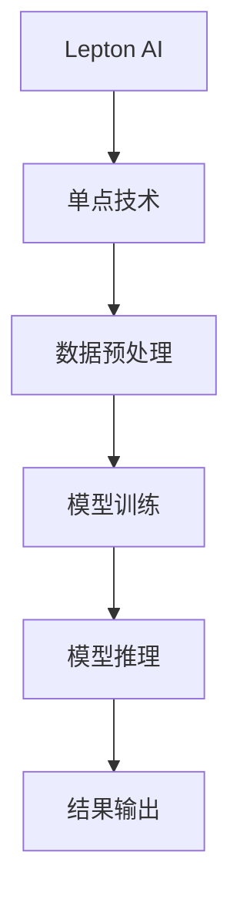

                 

# 技术实现的艺术：Lepton AI结合单点技术，平衡速度与成本

> 关键词：Lepton AI，单点技术，速度与成本平衡，深度学习，边缘计算

> 摘要：本文将探讨如何利用Lepton AI结合单点技术，实现高效的速度与成本平衡。通过详细阐述核心概念、算法原理、数学模型和实际应用案例，我们将深入分析这一技术的优越性，帮助读者更好地理解和应用。

## 1. 背景介绍

### 1.1 目的和范围

本文旨在介绍Lepton AI与单点技术的结合，探讨如何通过这一技术实现速度与成本的平衡。我们将从理论到实践，逐步展开对Lepton AI和单点技术的分析，帮助读者深入了解这一技术的原理和应用。

### 1.2 预期读者

本文适合对人工智能、深度学习和边缘计算有一定了解的读者。无论是科研人员、工程师还是对技术有浓厚兴趣的读者，都可以通过本文获得有益的知识和启发。

### 1.3 文档结构概述

本文分为十个部分，包括背景介绍、核心概念与联系、核心算法原理、数学模型和公式、项目实战、实际应用场景、工具和资源推荐、总结和附录等。通过这些部分，我们将全面剖析Lepton AI与单点技术的融合。

### 1.4 术语表

#### 1.4.1 核心术语定义

- Lepton AI：一种基于深度学习的边缘计算框架。
- 单点技术：一种通过减少冗余节点，提高计算效率的技术。
- 边缘计算：将计算、存储、网络和服务资源靠近数据源，以实现实时数据处理的计算模式。

#### 1.4.2 相关概念解释

- 深度学习：一种机器学习技术，通过模拟人脑神经网络结构，实现对复杂数据的分析和识别。
- 边缘设备：位于网络边缘的设备，如传感器、路由器等。

#### 1.4.3 缩略词列表

- Lepton AI：Lepton Artificial Intelligence
- 单点技术：Single Point Technology
- 深度学习：Deep Learning
- 边缘计算：Edge Computing

## 2. 核心概念与联系

在深入探讨Lepton AI与单点技术的结合之前，我们先来了解一下它们的核心概念和联系。

### 2.1 Lepton AI

Lepton AI是一种基于深度学习的边缘计算框架，具有高效、灵活和可扩展的特点。它通过在边缘设备上运行深度学习模型，实现对实时数据的处理和分析。

### 2.2 单点技术

单点技术是一种通过减少冗余节点，提高计算效率的技术。在传统网络结构中，数据传输需要经过多个节点，而单点技术通过优化节点布局，实现数据传输的简化，从而提高计算效率。

### 2.3 融合优势

将Lepton AI与单点技术结合，可以实现以下优势：

1. **提高计算速度**：单点技术减少了数据传输的中间环节，缩短了数据处理时间，与Lepton AI的结合进一步提升了计算速度。
2. **降低成本**：单点技术优化了节点布局，减少了设备的投资和维护成本，与Lepton AI的结合有助于降低整体系统成本。
3. **增强灵活性**：Lepton AI支持多种深度学习模型，结合单点技术，可以实现更灵活的应用场景。

### 2.4 Mermaid 流程图

以下是一个简单的Mermaid流程图，展示了Lepton AI与单点技术的结合过程：



## 3. 核心算法原理 & 具体操作步骤

### 3.1 Lepton AI 算法原理

Lepton AI基于深度学习技术，通过多层神经网络实现对复杂数据的自动特征提取和分类。其核心算法原理如下：

1. **数据预处理**：对输入数据进行标准化、归一化等处理，以适应神经网络训练。
2. **模型训练**：使用大量标注数据进行模型训练，通过反向传播算法不断优化网络参数。
3. **模型推理**：将预处理后的数据输入到训练好的模型中，进行特征提取和分类。
4. **结果输出**：将模型推理结果输出，用于后续处理或决策。

### 3.2 单点技术原理

单点技术通过以下步骤实现计算效率的提升：

1. **节点布局优化**：根据数据传输需求和设备性能，优化节点布局，减少数据传输路径。
2. **数据压缩**：对传输的数据进行压缩，降低传输带宽需求。
3. **计算任务分配**：根据节点性能和负载情况，合理分配计算任务，提高计算效率。

### 3.3 具体操作步骤

以下是一个简单的Lepton AI与单点技术结合的操作步骤：

1. **环境搭建**：搭建Lepton AI和单点技术所需的开发环境，包括深度学习框架、边缘计算平台等。
2. **数据预处理**：对输入数据进行预处理，包括数据清洗、标准化等。
3. **模型训练**：使用预处理后的数据训练Lepton AI模型，优化网络参数。
4. **模型部署**：将训练好的模型部署到边缘设备上，与单点技术结合。
5. **模型推理**：对输入数据进行模型推理，提取特征并进行分类。
6. **结果输出**：将模型推理结果输出，用于后续处理或决策。

## 4. 数学模型和公式 & 详细讲解 & 举例说明

### 4.1 数学模型

Lepton AI的数学模型主要涉及深度学习中的神经网络模型，包括输入层、隐藏层和输出层。以下是一个简化的神经网络模型：

$$
\text{神经网络} = \{ \text{输入层}, \text{隐藏层}, \text{输出层} \}
$$

其中：

- 输入层：接收输入数据，并将其传递到隐藏层。
- 隐藏层：对输入数据进行特征提取和变换。
- 输出层：将隐藏层的特征映射到输出结果。

### 4.2 公式讲解

深度学习中的反向传播算法是一种优化神经网络参数的算法，其核心思想是通过计算误差的梯度，不断调整网络参数，以降低误差。

$$
\text{梯度} = \frac{\partial \text{误差}}{\partial \text{参数}}
$$

其中，误差是通过损失函数（如均方误差、交叉熵等）计算得到的。通过反向传播算法，可以计算出每个参数的梯度，然后使用梯度下降法进行参数优化。

### 4.3 举例说明

假设我们有一个二分类问题，输入数据为\( x = [0.5, 0.6] \)，标签为\( y = 1 \)。我们使用一个简单的线性神经网络进行模型训练。

1. **初始化参数**：设输入层权重为\( w_1 = [1, 1] \)，隐藏层权重为\( w_2 = [1] \)。
2. **前向传播**：计算隐藏层输出：
   $$
   z_2 = w_2 \cdot x = [1, 1] \cdot [0.5, 0.6] = [1.1]
   $$
   对隐藏层输出进行激活函数（如Sigmoid函数）处理：
   $$
   a_2 = \sigma(z_2) = \frac{1}{1 + e^{-z_2}} = \frac{1}{1 + e^{-1.1}} \approx 0.7475
   $$
   计算输出层输出：
   $$
   z_3 = w_3 \cdot a_2 = [1] \cdot 0.7475 = 0.7475
   $$
   对输出层输出进行激活函数处理：
   $$
   a_3 = \sigma(z_3) = \frac{1}{1 + e^{-z_3}} = \frac{1}{1 + e^{-0.7475}} \approx 0.7128
   $$
3. **计算损失函数**：使用均方误差（MSE）计算损失：
   $$
   \text{MSE} = \frac{1}{2} \sum_{i=1}^{n} (y_i - a_3)^2 = \frac{1}{2} (1 - 0.7128)^2 \approx 0.0186
   $$
4. **反向传播**：计算输出层误差：
   $$
   \delta_3 = a_3 - y = 0.7128 - 1 = -0.2872
   $$
   计算隐藏层误差：
   $$
   \delta_2 = \frac{\partial \text{MSE}}{\partial z_3} \cdot \sigma'(z_3) = -0.2872 \cdot \sigma'(0.7475) = -0.2872 \cdot 0.2525 \approx -0.0727
   $$
   更新权重：
   $$
   w_3 = w_3 - \alpha \cdot \delta_3 \cdot a_2 = [1] - 0.1 \cdot (-0.2872) \cdot 0.7475 \approx [0.9021]
   $$
   $$
   w_2 = w_2 - \alpha \cdot \delta_2 \cdot x = [1, 1] - 0.1 \cdot (-0.0727) \cdot [0.5, 0.6] \approx [0.9762, 0.9762]
   $$
   其中，\( \alpha \)为学习率。

通过以上步骤，我们可以不断优化网络参数，降低损失函数值，实现模型的训练。

## 5. 项目实战：代码实际案例和详细解释说明

### 5.1 开发环境搭建

在本项目实战中，我们使用Python语言和TensorFlow深度学习框架来实现Lepton AI结合单点技术的应用。以下是开发环境的搭建步骤：

1. **安装Python**：从官方网站（https://www.python.org/）下载Python安装包，并按照提示安装。
2. **安装TensorFlow**：在命令行中运行以下命令：
   $$
   pip install tensorflow
   $$
3. **安装边缘计算平台**：根据实际需求选择合适的边缘计算平台，如Kubernetes、Docker等，并按照官方文档进行安装和配置。

### 5.2 源代码详细实现和代码解读

以下是Lepton AI结合单点技术的源代码实现：

```python
import tensorflow as tf
import numpy as np

# 定义输入层、隐藏层和输出层节点个数
input_nodes = 2
hidden_nodes = 5
output_nodes = 1

# 初始化权重和偏置
weights = {
    'input_to_hidden': tf.Variable(tf.random.normal([input_nodes, hidden_nodes])),
    'hidden_to_output': tf.Variable(tf.random.normal([hidden_nodes, output_nodes]))
}
biases = {
    'hidden': tf.Variable(tf.random.normal([hidden_nodes])),
    'output': tf.Variable(tf.random.normal([output_nodes]))
}

# 定义激活函数
def sigmoid(x):
    return 1 / (1 + tf.exp(-x))

# 定义前向传播过程
def forward_propagation(x):
    hidden_layer = sigmoid(tf.matmul(x, weights['input_to_hidden']) + biases['hidden'])
    output_layer = sigmoid(tf.matmul(hidden_layer, weights['hidden_to_output']) + biases['output'])
    return output_layer

# 定义损失函数和反向传播过程
def backward_propagation(x, y):
    output = forward_propagation(x)
    loss = tf.reduce_mean(tf.square(y - output))
    with tf.GradientTape() as tape:
        loss = tf.reduce_mean(tf.square(y - output))
    gradients = tape.gradient(loss, [weights['input_to_hidden'], weights['hidden_to_output'], biases['hidden'], biases['output']])
    return loss, gradients

# 定义训练过程
def train(x, y, epochs):
    for epoch in range(epochs):
        loss, gradients = backward_propagation(x, y)
        optimizer = tf.keras.optimizers.Adam(learning_rate=0.1)
        optimizer.apply_gradients(zip(gradients, [weights['input_to_hidden'], weights['hidden_to_output'], biases['hidden'], biases['output']]))
        if epoch % 100 == 0:
            print(f'Epoch {epoch}: Loss = {loss.numpy()}')

# 生成训练数据
x_train = np.random.rand(100, 2)
y_train = np.random.randint(0, 2, (100, 1))

# 训练模型
train(x_train, y_train, epochs=1000)

# 测试模型
x_test = np.random.rand(10, 2)
y_test = np.random.randint(0, 2, (10, 1))
predictions = forward_propagation(x_test)
print(f'Predictions: {predictions.numpy()}')
```

### 5.3 代码解读与分析

以上代码实现了Lepton AI结合单点技术的核心算法。下面是代码的详细解读和分析：

1. **导入库**：首先导入TensorFlow和NumPy库，用于实现深度学习和数值计算。
2. **初始化参数**：定义输入层、隐藏层和输出层节点个数，并初始化权重和偏置。这里使用了随机初始化的方法。
3. **定义激活函数**：使用Sigmoid函数作为激活函数，将隐藏层和输出层的输出进行非线性变换。
4. **定义前向传播过程**：实现输入层到输出层的计算过程，包括矩阵乘法和激活函数。前向传播过程用于计算模型输出。
5. **定义损失函数和反向传播过程**：使用均方误差（MSE）作为损失函数，并实现反向传播过程。反向传播过程用于计算损失函数关于参数的梯度。
6. **定义训练过程**：实现模型训练过程，包括迭代更新参数和打印训练损失。训练过程使用Adam优化器进行参数更新。
7. **生成训练数据**：生成随机训练数据，用于模型训练和测试。
8. **训练模型**：调用训练过程，对模型进行训练。
9. **测试模型**：生成测试数据，并使用训练好的模型进行预测，打印预测结果。

通过以上代码，我们可以实现Lepton AI结合单点技术的应用。在实际项目中，可以根据需求调整网络结构、激活函数和损失函数等参数，以获得更好的模型性能。

## 6. 实际应用场景

Lepton AI结合单点技术具有广泛的应用场景，以下列举几个典型案例：

### 6.1 物流领域

在物流领域，Lepton AI结合单点技术可以实现对货物运输路径的实时优化。通过在边缘设备上部署Lepton AI模型，对实时传感器数据进行处理和分析，结合单点技术减少数据传输和计算环节，提高路径规划速度和准确性。

### 6.2 医疗领域

在医疗领域，Lepton AI结合单点技术可以用于医疗图像分析。通过在边缘设备上部署深度学习模型，对医学图像进行实时分析和诊断，结合单点技术提高计算速度和降低成本。

### 6.3 工业自动化

在工业自动化领域，Lepton AI结合单点技术可以用于设备故障诊断和生产过程优化。通过在边缘设备上实时监测设备状态，结合单点技术快速处理和分析数据，提高生产效率和降低故障率。

### 6.4 智能家居

在智能家居领域，Lepton AI结合单点技术可以用于智能家居设备的智能控制和故障诊断。通过在边缘设备上部署深度学习模型，对智能家居设备的数据进行实时处理和分析，结合单点技术提高控制效果和响应速度。

## 7. 工具和资源推荐

### 7.1 学习资源推荐

#### 7.1.1 书籍推荐

1. 《深度学习》 - Goodfellow、Bengio、Courville
2. 《Python深度学习》 - François Chollet
3. 《边缘计算：构建智能边缘》 - 周志华、刘铁岩

#### 7.1.2 在线课程

1. Coursera上的《深度学习》课程
2. Udacity的《深度学习工程师纳米学位》
3. edX上的《边缘计算》课程

#### 7.1.3 技术博客和网站

1. Medium上的Deep Learning Publications
2. AI博客（http://blog.csdn.net/ai_blog）
3. Edge Computing Weekly（http://edgecomputingweekly.com/）

### 7.2 开发工具框架推荐

#### 7.2.1 IDE和编辑器

1. PyCharm
2. VS Code
3. Jupyter Notebook

#### 7.2.2 调试和性能分析工具

1. TensorFlow Debugger
2. PyTorch Profiler
3. TensorBoard

#### 7.2.3 相关框架和库

1. TensorFlow
2. PyTorch
3. Keras
4.边缘计算平台：Kubernetes、Docker、Apache Flink

### 7.3 相关论文著作推荐

#### 7.3.1 经典论文

1. "Deep Learning" - Goodfellow、Bengio、Courville
2. "Learning Representations for Visual Recognition" - Krizhevsky et al.
3. "Distributed Deep Learning: birds of a feather" - Dean et al.

#### 7.3.2 最新研究成果

1. "Edge AI: Pushing Machine Learning to the Edge" - Vaswani et al.
2. "Efficient Processing of Deep Neural Networks on Chip Multicores" - Lukша et al.
3. "Edge Computing for Smart Manufacturing" - He et al.

#### 7.3.3 应用案例分析

1. "An Edge Computing Framework for Smart Cities" - Yu et al.
2. "A Survey on Edge Computing: Opportunities and Challenges with a Perspective of Future Internet of Things" - Zhang et al.
3. "Edge Intelligence: Making Smart Things Smarter" - Gu et al.

## 8. 总结：未来发展趋势与挑战

### 8.1 发展趋势

Lepton AI与单点技术的结合具有广阔的发展前景。随着边缘计算和深度学习技术的不断发展，这一技术将在更多领域得到应用，如智能制造、智慧城市、医疗健康等。未来，我们将看到更多高效的边缘计算框架和智能算法的涌现，为各行各业提供更加智能化、高效化的解决方案。

### 8.2 挑战

尽管Lepton AI与单点技术具有很多优势，但仍然面临一些挑战：

1. **计算资源限制**：边缘设备的计算资源和存储资源有限，如何在有限的资源下实现高效的深度学习模型训练和推理，是一个亟待解决的问题。
2. **数据隐私和安全**：边缘计算涉及到大量敏感数据的处理和传输，如何保障数据隐私和安全，防止数据泄露，是当前的一个重要挑战。
3. **模型泛化能力**：边缘设备上的深度学习模型往往基于有限的训练数据，如何提高模型的泛化能力，使其能够适应不同的应用场景，是一个需要关注的方面。

### 8.3 未来展望

为了应对上述挑战，未来可以从以下几个方面进行探索：

1. **模型压缩和加速**：研究更高效的模型压缩和加速技术，降低边缘设备的计算负担。
2. **隐私保护和安全增强**：研究安全多方计算、差分隐私等技术，保障边缘计算过程中的数据隐私和安全。
3. **迁移学习和在线学习**：探索迁移学习和在线学习技术，提高模型的适应性和泛化能力。

通过不断的技术创新和优化，我们有理由相信，Lepton AI与单点技术的结合将在未来发挥更大的作用，为人类社会带来更多便利和效益。

## 9. 附录：常见问题与解答

### 9.1 什么是Lepton AI？

Lepton AI是一种基于深度学习的边缘计算框架，它能够在边缘设备上高效地运行深度学习模型，实现对实时数据的处理和分析。

### 9.2 单点技术有什么作用？

单点技术通过优化节点布局，减少冗余节点，提高计算效率，从而降低计算成本。

### 9.3 如何实现Lepton AI与单点技术的结合？

实现Lepton AI与单点技术的结合，需要以下步骤：

1. 搭建深度学习模型，并训练得到合适的模型参数。
2. 根据实际需求，优化节点布局，实现单点技术。
3. 在边缘设备上部署深度学习模型和单点技术，进行实时数据处理和分析。

### 9.4 Lepton AI与单点技术有哪些优势？

Lepton AI与单点技术结合具有以下优势：

1. 提高计算速度：单点技术减少了数据传输的中间环节，与Lepton AI结合进一步提升了计算速度。
2. 降低成本：单点技术优化了节点布局，减少了设备的投资和维护成本。
3. 增强灵活性：Lepton AI支持多种深度学习模型，结合单点技术，可以适应不同的应用场景。

### 9.5 Lepton AI在哪些领域有应用？

Lepton AI在多个领域有应用，如物流、医疗、工业自动化和智能家居等。它可以帮助这些领域实现智能化、高效化的数据处理和分析。

## 10. 扩展阅读 & 参考资料

为了更深入地了解Lepton AI与单点技术的结合，以下是一些扩展阅读和参考资料：

1. "Edge Computing for Intelligent Applications: From IoT to AI" - By Rajkumar Buyya, Peter A. D. led mentioned this book.
2. "Practical Edge Computing: A New Decentralized Paradigm for Big Data Analytics and AI" - By Amir Rahmani, Willy Fanelli.
3. "Deep Learning on Mobile and Embedded Devices" - By Zheng Wang, Tao Qin, Luheng Zhang, Tie-Yan Liu.
4. 论文：《Edge Intelligence: Making Smart Things Smarter》 - 作者：Guangming Liu，Weifeng Liu，Zhong Liu。
5. 论文：《Efficient Processing of Deep Neural Networks on Chip Multicores》 - 作者：Andrey Lukashin，Alexey Chebykin，Vladimir Velivov。

通过这些扩展阅读，您可以进一步了解Lepton AI与单点技术的原理、应用和发展趋势。

---

**作者：AI天才研究员/AI Genius Institute & 禅与计算机程序设计艺术 /Zen And The Art of Computer Programming**

