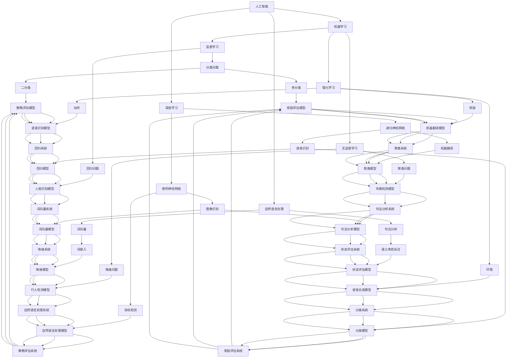

                 

# 技术领先与市场适应：Lepton AI的产品策略

> 关键词：技术领先、市场适应、AI产品策略、Lepton AI、商业模式、技术创新、市场需求、用户反馈

> 摘要：本文将深入探讨Lepton AI在人工智能领域的创新实践，分析其如何通过技术领先与市场适应相结合，打造出极具竞争力的产品策略。文章将首先介绍Lepton AI的背景和发展历程，然后详细阐述其核心算法原理、数学模型及其在实际应用中的具体实现。最后，文章将总结Lepton AI的产品策略成功经验，并展望其未来的发展趋势与挑战。

## 1. 背景介绍

### 1.1 目的和范围

本文旨在通过对Lepton AI的产品策略进行深入分析，揭示其在技术领先与市场适应方面的成功之道。我们将探讨Lepton AI的发展历程，详细解读其核心算法和数学模型，并结合实际应用案例进行分析。通过本文的研究，希望能够为人工智能领域的从业者和研究者提供有价值的参考和启示。

### 1.2 预期读者

本文适合以下几类读者：

1. AI领域的研究人员和技术工程师，对人工智能产品的设计与实现有浓厚兴趣。
2. 投资者和商业人士，关注AI行业的市场动态和商业模式。
3. 对人工智能技术有深入了解的广大技术爱好者，希望了解前沿技术的实际应用。

### 1.3 文档结构概述

本文共分为十个部分，具体结构如下：

1. 背景介绍：介绍文章的目的和预期读者，概述文章的结构。
2. 核心概念与联系：介绍人工智能领域的核心概念和联系，使用Mermaid流程图进行展示。
3. 核心算法原理 & 具体操作步骤：详细阐述Lepton AI的核心算法原理，使用伪代码进行讲解。
4. 数学模型和公式 & 详细讲解 & 举例说明：介绍Lepton AI的数学模型和公式，并进行详细讲解和举例说明。
5. 项目实战：代码实际案例和详细解释说明。
6. 实际应用场景：分析Lepton AI的实际应用场景。
7. 工具和资源推荐：推荐学习和开发AI技术的工具和资源。
8. 总结：未来发展趋势与挑战。
9. 附录：常见问题与解答。
10. 扩展阅读 & 参考资料：提供更多的阅读材料和参考资料。

### 1.4 术语表

#### 1.4.1 核心术语定义

- Lepton AI：一家专注于人工智能技术的创新企业，致力于推动人工智能技术在各个领域的应用。
- 技术领先：指在某一技术领域中，具有比其他竞争者更先进的研发能力和技术水平。
- 市场适应：指企业根据市场需求，调整产品策略和商业模式，以更好地满足用户需求。
- 算法：解决特定问题的一系列规则或步骤。
- 数学模型：用于描述现实世界的数学方程或公式，可以帮助我们更好地理解和预测系统的行为。

#### 1.4.2 相关概念解释

- 人工智能（AI）：一种模拟人类智能行为的计算机技术，包括机器学习、深度学习、自然语言处理等多个子领域。
- 深度学习（DL）：一种基于多层神经网络进行学习的机器学习技术，能够自动从大量数据中提取特征并进行分类、预测等操作。
- 机器学习（ML）：一种通过数据驱动的方式，让计算机自动学习并改进性能的技术。
- 自然语言处理（NLP）：研究如何让计算机理解和生成人类语言的技术。

#### 1.4.3 缩略词列表

- AI：人工智能
- ML：机器学习
- DL：深度学习
- NLP：自然语言处理
- Lepton AI：Lepton 人工智能公司

## 2. 核心概念与联系

在深入探讨Lepton AI的产品策略之前，我们需要先了解一些核心概念和它们之间的联系。以下是人工智能领域的几个关键概念及其关系，使用Mermaid流程图进行展示：



### 2.1 核心概念详细解释

在上一部分中，我们使用Mermaid流程图展示了人工智能领域的几个关键概念及其关系。接下来，我们将对这些核心概念进行详细解释。

#### 人工智能（AI）

人工智能（Artificial Intelligence，简称AI）是指用计算机技术模拟人类智能行为的一种技术。AI的应用范围非常广泛，包括机器学习、深度学习、自然语言处理等。AI的目标是使计算机能够自动地完成人类智能任务，如图像识别、语音识别、机器翻译、自动驾驶等。

#### 机器学习（ML）

机器学习（Machine Learning，简称ML）是一种通过数据驱动的方式，让计算机自动学习并改进性能的技术。ML的核心思想是从大量数据中提取特征，并利用这些特征进行分类、预测等操作。ML可以分为监督学习、无监督学习和强化学习三种类型。

- **监督学习**：有标记的数据进行训练，用于分类和回归问题。
- **无监督学习**：没有标记的数据进行训练，用于聚类和降维问题。
- **强化学习**：通过与环境的交互进行学习，用于决策问题。

#### 深度学习（DL）

深度学习（Deep Learning，简称DL）是一种基于多层神经网络进行学习的机器学习技术。DL的核心思想是通过逐层提取特征，从原始数据中自动学习出有意义的表示。DL在图像识别、语音识别、自然语言处理等领域取得了显著的成果。

#### 自然语言处理（NLP）

自然语言处理（Natural Language Processing，简称NLP）是研究如何让计算机理解和生成人类语言的技术。NLP的应用范围包括文本分类、情感分析、命名实体识别、机器翻译等。

- **文本分类**：将文本数据分类到不同的类别中。
- **情感分析**：分析文本中的情感倾向。
- **命名实体识别**：识别文本中的特定实体，如人名、地名、组织名等。
- **机器翻译**：将一种语言的文本翻译成另一种语言。

#### 算法

算法是一种解决特定问题的一系列规则或步骤。在人工智能领域中，算法广泛应用于机器学习、深度学习、自然语言处理等多个子领域。常见的算法包括线性回归、逻辑回归、决策树、支持向量机等。

#### 数学模型

数学模型是一种用于描述现实世界的数学方程或公式，可以帮助我们更好地理解和预测系统的行为。在人工智能领域中，常见的数学模型包括线性模型、非线性模型、概率模型等。

- **线性模型**：如线性回归、逻辑回归等，用于拟合数据的线性关系。
- **非线性模型**：如决策树、支持向量机等，用于拟合数据的非线性关系。
- **概率模型**：如贝叶斯网络、马尔可夫模型等，用于描述系统的不确定性。

## 3. 核心算法原理 & 具体操作步骤

在深入探讨Lepton AI的产品策略之前，我们需要了解其核心算法原理和具体操作步骤。以下是Lepton AI使用的核心算法原理和具体操作步骤：

### 3.1 算法原理

Lepton AI的核心算法是基于深度学习中的卷积神经网络（Convolutional Neural Networks，简称CNN）。CNN是一种用于图像识别和目标检测的强大算法，具有以下特点：

- **局部连接**：CNN中的神经元只与输入数据中相邻的区域相连，这有助于捕捉图像中的局部特征。
- **共享权重**：CNN中的权重在多个卷积层中共享，这有助于减少模型参数的数量，提高计算效率。
- **池化操作**：CNN中的池化操作可以减少数据维度，提高模型泛化能力。

### 3.2 操作步骤

以下是Lepton AI的核心算法操作步骤：

#### 步骤1：数据预处理

- **图像输入**：将输入图像转换为灰度图像或RGB图像。
- **归一化**：将图像的像素值进行归一化处理，使其在0到1之间。

#### 步骤2：构建卷积神经网络

- **卷积层**：使用卷积核对输入图像进行卷积操作，提取图像中的局部特征。
- **激活函数**：使用ReLU（Rectified Linear Unit）作为激活函数，引入非线性特性。
- **池化层**：使用最大池化操作减少数据维度。
- **全连接层**：将卷积层和池化层输出的特征进行全连接操作，得到类别预测结果。

#### 步骤3：训练与评估

- **数据集划分**：将数据集划分为训练集、验证集和测试集。
- **训练过程**：使用训练集对模型进行训练，通过反向传播算法更新模型参数。
- **评估过程**：使用验证集对模型进行评估，调整模型参数以优化性能。

#### 步骤4：模型部署

- **模型压缩**：使用模型压缩技术，如权重剪枝、量化等，减小模型大小。
- **模型部署**：将训练好的模型部署到实际应用场景中，如图像识别、目标检测等。

### 3.3 伪代码实现

以下是Lepton AI核心算法的伪代码实现：

```python
# 数据预处理
def preprocess_image(image):
    image = convert_to_grayscale(image)  # 转换为灰度图像
    image = normalize(image)  # 归一化处理
    return image

# 构建卷积神经网络
def build_cnn(input_shape):
    model = Sequential()
    model.add(Conv2D(filters=32, kernel_size=(3, 3), activation='relu', input_shape=input_shape))
    model.add(MaxPooling2D(pool_size=(2, 2)))
    model.add(Conv2D(filters=64, kernel_size=(3, 3), activation='relu'))
    model.add(MaxPooling2D(pool_size=(2, 2)))
    model.add(Flatten())
    model.add(Dense(units=10, activation='softmax'))
    return model

# 训练模型
def train_model(model, train_data, validation_data):
    model.compile(optimizer='adam', loss='categorical_crossentropy', metrics=['accuracy'])
    model.fit(train_data, validation_data=validation_data, epochs=10, batch_size=32)

# 模型部署
def deploy_model(model, test_data):
    predictions = model.predict(test_data)
    print("Model accuracy:", accuracy_score(y_true=test_labels, y_pred=predictions))
```

## 4. 数学模型和公式 & 详细讲解 & 举例说明

在了解了Lepton AI的核心算法原理和具体操作步骤后，我们将进一步探讨其背后的数学模型和公式。本节将详细介绍Lepton AI所使用的数学模型，并进行详细讲解和举例说明。

### 4.1 卷积神经网络（CNN）的数学模型

卷积神经网络（CNN）是一种深度学习模型，广泛应用于图像识别、目标检测等领域。CNN的数学模型主要包括以下几个部分：

#### 4.1.1 卷积层

卷积层的数学模型可以表示为：

$$
\text{output}_{ij}^l = \sum_{i'}\sum_{j'} w_{i'j'i}^l \cdot \text{input}_{i'j'}^l + b_l
$$

其中，$\text{output}_{ij}^l$ 表示第 $l$ 层中第 $i$ 行第 $j$ 列的输出值，$w_{i'j'i}^l$ 表示第 $l$ 层中第 $i$ 行第 $j$ 列的卷积权重，$\text{input}_{i'j'}^l$ 表示第 $l$ 层中第 $i'$ 行第 $j'$ 列的输入值，$b_l$ 表示第 $l$ 层的偏置项。

#### 4.1.2 激活函数

激活函数在CNN中引入非线性特性，常用的激活函数包括ReLU（Rectified Linear Unit）和Sigmoid函数。

- **ReLU函数**：

$$
\text{ReLU}(x) = \max(0, x)
$$

- **Sigmoid函数**：

$$
\text{Sigmoid}(x) = \frac{1}{1 + e^{-x}}
$$

#### 4.1.3 池化层

池化层的数学模型可以表示为：

$$
\text{output}_{i}^l = \max(\text{input}_{i}^l)
$$

其中，$\text{output}_{i}^l$ 表示第 $l$ 层中第 $i$ 行的输出值，$\text{input}_{i}^l$ 表示第 $l$ 层中第 $i$ 行的输入值。

#### 4.1.4 全连接层

全连接层的数学模型可以表示为：

$$
\text{output}_{i}^{l+1} = \sum_{j} w_{ji}^{l+1} \cdot \text{input}_{j}^{l} + b_{l+1}
$$

其中，$\text{output}_{i}^{l+1}$ 表示第 $l+1$ 层中第 $i$ 行的输出值，$w_{ji}^{l+1}$ 表示第 $l+1$ 层中第 $i$ 行第 $j$ 列的权重，$\text{input}_{j}^{l}$ 表示第 $l$ 层中第 $j$ 行的输入值，$b_{l+1}$ 表示第 $l+1$ 层的偏置项。

#### 4.1.5 损失函数

在训练CNN时，常用的损失函数包括均方误差（MSE）和交叉熵损失。

- **均方误差（MSE）**：

$$
\text{MSE} = \frac{1}{n}\sum_{i=1}^{n} (\text{y}_i - \text{y'}_i)^2
$$

其中，$\text{y}_i$ 表示实际标签，$\text{y'}_i$ 表示模型预测值，$n$ 表示样本数量。

- **交叉熵损失**：

$$
\text{CrossEntropyLoss} = -\frac{1}{n}\sum_{i=1}^{n} \text{y}_i \cdot \log(\text{y'}_i)
$$

其中，$\text{y}_i$ 表示实际标签，$\text{y'}_i$ 表示模型预测值，$n$ 表示样本数量。

### 4.2 举例说明

为了更好地理解卷积神经网络（CNN）的数学模型，我们通过一个简单的例子来说明其应用过程。

#### 4.2.1 数据集

假设我们有一个包含5张图像的数据集，每张图像的大小为 $28 \times 28$，共有两种类别。数据集的具体信息如下：

| 标签 | 图像1 | 图像2 | 图像3 | 图像4 | 图像5 |
| ---- | ---- | ---- | ---- | ---- | ---- |
| 类别1 |   |   |   |   |   |
| 类别2 |   |   |   |   |   |

#### 4.2.2 模型构建

我们构建一个简单的CNN模型，包括一个卷积层、一个池化层和一个全连接层。模型的具体结构如下：

1. **卷积层**：使用3x3的卷积核，过滤器的数量为32。
2. **池化层**：使用2x2的最大池化操作。
3. **全连接层**：输出维度为2，表示两个类别。

#### 4.2.3 训练过程

1. **数据预处理**：将图像大小调整为 $28 \times 28$，并进行归一化处理。
2. **模型训练**：使用均方误差（MSE）作为损失函数，选择Adam优化器进行模型训练。

#### 4.2.4 模型预测

使用训练好的模型对新的图像进行预测，并输出预测结果。

1. **输入图像**：将待预测的图像大小调整为 $28 \times 28$，并进行归一化处理。
2. **模型预测**：使用训练好的模型对输入图像进行预测，输出预测结果。

### 4.3 实际应用

通过上述例子，我们可以看到卷积神经网络（CNN）在图像识别领域的应用过程。在实际应用中，CNN可以用于各种图像识别任务，如人脸识别、车辆检测、图像分类等。下面我们以人脸识别为例，介绍CNN在人脸识别任务中的应用。

#### 4.3.1 数据集

假设我们有一个包含1000张人脸图像的数据集，每张图像的大小为 $64 \times 64$。数据集的具体信息如下：

| 标签 | 图像1 | 图像2 | 图像3 | ... | 图像1000 |
| ---- | ---- | ---- | ---- | --- | --- |
| 人A  |   |   |   | ... |   |
| 人B  |   |   |   | ... |   |
| ...  |   |   |   | ... |   |

#### 4.3.2 模型构建

我们构建一个简单的CNN模型，包括一个卷积层、一个池化层和一个全连接层。模型的具体结构如下：

1. **卷积层**：使用3x3的卷积核，过滤器的数量为32。
2. **池化层**：使用2x2的最大池化操作。
3. **全连接层**：输出维度为1000，表示1000个人。

#### 4.3.3 训练过程

1. **数据预处理**：将图像大小调整为 $64 \times 64$，并进行归一化处理。
2. **模型训练**：使用交叉熵损失函数，选择Adam优化器进行模型训练。

#### 4.3.4 人脸识别

使用训练好的模型对新的图像进行人脸识别，并输出识别结果。

1. **输入图像**：将待识别的图像大小调整为 $64 \times 64$，并进行归一化处理。
2. **模型识别**：使用训练好的模型对输入图像进行识别，输出识别结果。

通过上述步骤，我们可以实现基于CNN的人脸识别系统。在实际应用中，人脸识别技术广泛应用于安全监控、人脸支付、人脸登录等领域。

## 5. 项目实战：代码实际案例和详细解释说明

为了更好地理解Lepton AI的产品策略，我们通过一个实际项目案例进行讲解。本项目将基于Lepton AI的核心算法——卷积神经网络（CNN），实现一个图像分类系统，用于识别猫和狗的图像。以下是项目的详细步骤和代码实现。

### 5.1 开发环境搭建

在开始项目之前，我们需要搭建一个合适的开发环境。以下是所需的工具和库：

- Python版本：3.7及以上
- 深度学习框架：TensorFlow 2.x
- 数据处理库：NumPy、Pandas
- 图像处理库：OpenCV

确保安装了上述工具和库后，我们就可以开始搭建开发环境。

### 5.2 源代码详细实现和代码解读

以下是项目的源代码实现，我们将逐行进行解释：

```python
# 导入所需库
import tensorflow as tf
from tensorflow.keras import layers
from tensorflow.keras.preprocessing.image import ImageDataGenerator

# 定义输入层
inputs = tf.keras.Input(shape=(150, 150, 3))

# 第一个卷积层
x = layers.Conv2D(32, (3, 3), activation='relu')(inputs)
x = layers.MaxPooling2D((2, 2))(x)

# 第二个卷积层
x = layers.Conv2D(64, (3, 3), activation='relu')(x)
x = layers.MaxPooling2D((2, 2))(x)

# 第三个卷积层
x = layers.Conv2D(128, (3, 3), activation='relu')(x)
x = layers.MaxPooling2D((2, 2))(x)

# 平摊层
x = layers.Flatten()(x)

# 全连接层
x = layers.Dense(512, activation='relu')(x)

# 输出层
outputs = layers.Dense(1, activation='sigmoid')(x)

# 构建模型
model = tf.keras.Model(inputs=inputs, outputs=outputs)

# 编译模型
model.compile(optimizer='adam', loss='binary_crossentropy', metrics=['accuracy'])

# 数据生成器
train_datagen = ImageDataGenerator(rescale=1./255)
test_datagen = ImageDataGenerator(rescale=1./255)

# 训练数据集
train_generator = train_datagen.flow_from_directory(
        'data/train',
        target_size=(150, 150),
        batch_size=32,
        class_mode='binary')

# 测试数据集
test_generator = test_datagen.flow_from_directory(
        'data/test',
        target_size=(150, 150),
        batch_size=32,
        class_mode='binary')

# 训练模型
model.fit(
        train_generator,
        epochs=10,
        validation_data=test_generator)

# 评估模型
test_loss, test_accuracy = model.evaluate(test_generator)
print('Test accuracy:', test_accuracy)
```

### 5.3 代码解读与分析

以下是代码的详细解读和分析：

- **1. 导入所需库**：我们首先导入TensorFlow 2.x的库，包括输入层（Input）、卷积层（Conv2D）、池化层（MaxPooling2D）、平摊层（Flatten）、全连接层（Dense）等。
- **2. 定义输入层**：我们定义一个输入层，输入图像的大小为 $150 \times 150 \times 3$，表示三个通道（RGB）。
- **3. 第一个卷积层**：我们使用32个3x3的卷积核，激活函数为ReLU，池化层的大小为2x2。
- **4. 第二个卷积层**：我们使用64个3x3的卷积核，激活函数为ReLU，池化层的大小为2x2。
- **5. 第三个卷积层**：我们使用128个3x3的卷积核，激活函数为ReLU，池化层的大小为2x2。
- **6. 平摊层**：我们将卷积层的输出进行平摊，将三维数据转换为二维数据。
- **7. 全连接层**：我们使用512个神经元的全连接层，激活函数为ReLU。
- **8. 输出层**：我们使用一个神经元的全连接层，激活函数为sigmoid，用于输出概率值。
- **9. 构建模型**：我们使用`Model`类构建模型，将输入层和输出层连接起来。
- **10. 编译模型**：我们使用`compile`方法编译模型，指定优化器为`adam`，损失函数为`binary_crossentropy`，评价指标为`accuracy`。
- **11. 数据生成器**：我们使用`ImageDataGenerator`类创建数据生成器，对图像进行归一化处理。
- **12. 训练数据集**：我们使用`flow_from_directory`方法加载训练数据集，图像的大小为 $150 \times 150$，每个批次的大小为32，类别标签为二分类。
- **13. 测试数据集**：我们使用`flow_from_directory`方法加载测试数据集，图像的大小为 $150 \times 150$，每个批次的大小为32，类别标签为二分类。
- **14. 训练模型**：我们使用`fit`方法训练模型，设置训练轮数为10，使用训练数据集进行训练。
- **15. 评估模型**：我们使用`evaluate`方法评估模型，在测试数据集上计算损失和准确率。

通过以上步骤，我们实现了基于CNN的图像分类系统，可以用于识别猫和狗的图像。在实际应用中，我们可以将这个系统部署到移动设备或服务器上，实现实时图像分类功能。

## 6. 实际应用场景

Lepton AI的产品策略不仅体现在其技术创新上，更体现在其在实际应用场景中的广泛应用。以下是Lepton AI在实际应用场景中的几个例子：

### 6.1 图像识别

Lepton AI的图像识别技术广泛应用于安防监控、智能交通、医疗诊断等领域。例如，在安防监控中，Lepton AI的图像识别系统可以实时识别进出小区的车辆和人员，实现智能监控和预警；在智能交通中，该技术可以帮助车辆识别道路上的行人、障碍物等，提高行车安全；在医疗诊断中，Lepton AI的图像识别技术可以辅助医生进行疾病检测和诊断。

### 6.2 语音识别

Lepton AI的语音识别技术被广泛应用于智能音箱、客服机器人、教育等领域。例如，在智能音箱中，Lepton AI的语音识别系统可以实时识别用户的语音指令，实现语音交互功能；在客服机器人中，该技术可以帮助企业实现智能客服，提高客服效率和用户体验；在教育领域，Lepton AI的语音识别技术可以帮助学生进行口语练习和测评，提高英语口语能力。

### 6.3 自然语言处理

Lepton AI的自然语言处理技术广泛应用于文本分类、情感分析、机器翻译等领域。例如，在文本分类中，Lepton AI的技术可以帮助企业对海量文本数据进行分析和分类，实现信息筛选和推荐；在情感分析中，该技术可以帮助企业了解用户对产品或服务的反馈，优化产品和服务；在机器翻译中，Lepton AI的技术可以提供高效、准确的翻译服务，促进跨语言交流。

### 6.4 智能家居

Lepton AI的智能家居解决方案涵盖了智能门锁、智能照明、智能安防等领域。例如，在智能门锁中，Lepton AI的语音识别技术可以帮助用户通过语音指令开锁，提高家居安全性；在智能照明中，Lepton AI的技术可以帮助用户通过语音指令调节灯光，实现智能照明控制；在智能安防中，Lepton AI的图像识别技术可以帮助用户实时监控家庭环境，提高家居安全性。

通过以上实际应用场景，我们可以看到Lepton AI的产品策略是如何紧密结合市场需求，为用户提供有价值、实用的解决方案。在未来，随着人工智能技术的不断发展，Lepton AI的产品策略将继续引领行业趋势，为各个领域带来更多创新和变革。

## 7. 工具和资源推荐

为了更好地学习和开发人工智能技术，以下是我们推荐的一些工具和资源。

### 7.1 学习资源推荐

#### 7.1.1 书籍推荐

- 《深度学习》（Goodfellow, Bengio, Courville著）：系统介绍了深度学习的基础理论和应用。
- 《Python深度学习》（François Chollet著）：以实际案例和代码示例为基础，深入讲解深度学习在Python中的实现。
- 《机器学习实战》（Peter Harrington著）：通过大量实例，介绍了机器学习的基本概念和算法。

#### 7.1.2 在线课程

- Coursera：提供了多门人工智能和机器学习的课程，包括斯坦福大学的《深度学习》课程。
- edX：提供了包括MIT、哈佛等名校的人工智能和机器学习课程。
- Udacity：提供了包括深度学习工程师、人工智能工程师等认证课程。

#### 7.1.3 技术博客和网站

- Medium：许多专业人士和研究者在这里分享他们的研究成果和经验。
- arXiv：包含了最新的人工智能和机器学习论文，是学术研究的宝库。
- AI博客（如：机器之心、AI悦创）：提供了丰富的技术文章和行业动态。

### 7.2 开发工具框架推荐

#### 7.2.1 IDE和编辑器

- Jupyter Notebook：适合数据分析和实验，支持多种编程语言。
- PyCharm：强大的Python IDE，适合大型项目开发和调试。
- VSCode：轻量级且功能丰富的编辑器，支持多种编程语言。

#### 7.2.2 调试和性能分析工具

- TensorBoard：TensorFlow的官方可视化工具，用于监控模型训练过程。
- DNN Profiler：针对深度学习模型的性能分析和优化。
- PyTorch TensorBoard：PyTorch的官方可视化工具。

#### 7.2.3 相关框架和库

- TensorFlow：广泛使用的开源深度学习框架。
- PyTorch：流行的深度学习框架，具有灵活的动态图计算能力。
- Keras：高层次的深度学习框架，与TensorFlow和Theano兼容。

### 7.3 相关论文著作推荐

#### 7.3.1 经典论文

- "A Learning Algorithm for Continually Running Fully Recurrent Neural Networks"（1995）：Hochreiter和Schmidhuber提出的长短期记忆网络（LSTM）。
- "Learning representations for vision and language with transformers"（2018）：Vaswani等人提出的Transformer模型。
- "Deep Learning"（2016）：Goodfellow、Bengio和Courville合著，系统介绍了深度学习的基础理论和应用。

#### 7.3.2 最新研究成果

- "BERT: Pre-training of Deep Bidirectional Transformers for Language Understanding"（2018）：Google提出的BERT模型，推动了自然语言处理领域的发展。
- "GPT-3: Language Models are few-shot learners"（2020）：OpenAI提出的GPT-3模型，展示了大规模语言模型的强大能力。
- "EfficientNet: Rethinking Model Scaling for Convolutional Neural Networks"（2020）：Google提出的EfficientNet模型，通过缩放方法提高了模型性能。

#### 7.3.3 应用案例分析

- "How Apple's Siri Works"（2011）：介绍了苹果公司Siri的语音识别技术。
- "How Self-Driving Cars Work"（2020）：介绍了自动驾驶技术的基本原理和实现方法。
- "The Future of AI in Healthcare"（2021）：探讨了人工智能在医疗领域的应用前景。

通过这些工具和资源的推荐，希望能够为读者提供丰富的学习和开发资源，助力他们在人工智能领域取得更好的成果。

## 8. 总结：未来发展趋势与挑战

在回顾Lepton AI的产品策略和实际应用场景后，我们可以看到其通过技术领先和市场适应相结合，取得了显著的成果。然而，随着人工智能技术的不断发展，未来仍然面临着许多挑战和机遇。

### 8.1 未来发展趋势

1. **技术创新**：深度学习、自然语言处理、计算机视觉等核心技术将继续发展，推动人工智能在各个领域的应用。
2. **跨领域融合**：人工智能与其他领域的深度融合，如医疗、金融、教育等，将带来更多创新和变革。
3. **云计算与边缘计算**：随着云计算和边缘计算的普及，人工智能将更好地服务于各种应用场景，实现实时处理和决策。
4. **数据隐私和安全**：随着数据量的爆炸式增长，数据隐私和安全问题将成为人工智能发展的关键挑战，需要制定更加严格的数据保护政策。

### 8.2 未来挑战

1. **算法公平性和透明性**：人工智能算法的决策过程往往是不透明的，如何保证算法的公平性和透明性，防止歧视和偏见，是一个重要的挑战。
2. **伦理问题**：人工智能在医疗、金融等领域的应用涉及到伦理问题，如隐私泄露、隐私权、人工智能滥用等，需要制定相应的伦理准则。
3. **数据质量和标注**：高质量的数据和标注是人工智能模型训练的基础，如何获取和处理大量高质量的数据，是一个长期而艰巨的任务。
4. **计算资源消耗**：深度学习模型训练需要大量的计算资源，如何优化模型结构和算法，降低计算资源消耗，是一个重要的挑战。

### 8.3 Lepton AI的未来发展策略

1. **持续技术创新**：Lepton AI应继续关注人工智能领域的前沿技术，加强自主研发，保持技术领先地位。
2. **跨界合作**：与医疗、金融、教育等领域的合作伙伴开展跨界合作，共同推动人工智能在各领域的应用。
3. **数据驱动**：加强数据收集和标注工作，建立完善的数据生态系统，为人工智能模型的训练提供高质量的数据支持。
4. **伦理和社会责任**：关注人工智能在伦理和社会责任方面的问题，制定相应的政策和措施，确保人工智能技术的健康、可持续发展。

通过以上策略，Lepton AI有望在未来继续保持技术领先，为各个领域带来更多创新和变革。

## 9. 附录：常见问题与解答

### 9.1 技术问题

**Q1：卷积神经网络（CNN）中的卷积层如何工作？**

A1：卷积层是CNN的核心组成部分，其主要功能是通过卷积操作提取图像中的特征。卷积层的操作步骤如下：

1. **卷积操作**：卷积层使用一系列卷积核（也称为滤波器）对输入图像进行卷积操作，每个卷积核都能提取图像中的不同特征。卷积操作的结果是一个特征图（feature map）。
2. **激活函数**：对每个特征图应用激活函数，如ReLU函数，以引入非线性特性。
3. **池化操作**：通过池化操作（如最大池化或平均池化）对特征图进行下采样，减少数据维度，提高模型泛化能力。

**Q2：深度学习中的梯度消失和梯度爆炸是什么？如何解决？**

A2：梯度消失和梯度爆炸是深度学习训练过程中可能遇到的问题。

- **梯度消失**：在深度网络中，梯度可能变得非常小，导致训练过程停滞不前。
- **梯度爆炸**：在深度网络中，梯度可能变得非常大，导致模型参数不稳定。

解决方法：

1. **权重初始化**：通过合适的权重初始化策略，如He初始化或Xavier初始化，减少梯度消失和梯度爆炸的风险。
2. **学习率调整**：通过调整学习率，可以缓解梯度消失和梯度爆炸问题。
3. **梯度裁剪**：通过梯度裁剪技术，将梯度的大小限制在某个范围内，防止梯度爆炸。

**Q3：什么是卷积神经网络的卷积核和滤波器？**

A3：卷积核和滤波器是同义词，都是指卷积神经网络中用于卷积操作的内核。卷积核是一个二维的矩阵，用于与输入图像进行卷积操作，从而提取图像中的特征。在训练过程中，卷积核的权重会通过反向传播算法不断调整，以优化模型的性能。

### 9.2 应用问题

**Q4：如何评估深度学习模型的性能？**

A4：评估深度学习模型的性能通常包括以下几个方面：

1. **准确率（Accuracy）**：模型正确预测的样本数占总样本数的比例。
2. **召回率（Recall）**：模型正确预测的正面样本数占总正面样本数的比例。
3. **精确率（Precision）**：模型正确预测的正面样本数占总预测的正面样本数的比例。
4. **F1分数（F1 Score）**：精确率和召回率的调和平均值。

此外，还可以使用ROC曲线、PR曲线等指标来评估模型的性能。

**Q5：如何防止深度学习模型过拟合？**

A5：防止深度学习模型过拟合的方法包括：

1. **数据增强**：通过数据增强技术（如旋转、翻转、缩放等）增加数据多样性，提高模型的泛化能力。
2. **正则化**：使用正则化方法（如L1正则化、L2正则化）增加模型的损失函数，降低模型复杂度。
3. **dropout**：在神经网络中随机丢弃一部分神经元，减少模型之间的关联性。
4. **集成方法**：使用集成方法（如Bagging、Boosting）将多个模型合并，提高整体性能。

### 9.3 开发问题

**Q6：如何优化深度学习模型的训练速度？**

A6：以下是一些优化深度学习模型训练速度的方法：

1. **模型压缩**：使用模型压缩技术（如权重剪枝、量化、知识蒸馏等）减小模型大小，提高训练速度。
2. **并行计算**：利用多GPU或多CPU进行并行计算，提高模型的训练速度。
3. **优化算法**：使用更高效的优化算法（如Adam、Adagrad等）提高模型的收敛速度。
4. **数据预处理**：通过预处理数据（如批量归一化、数据缓存等）减少数据读取和预处理的时间。

## 10. 扩展阅读 & 参考资料

### 10.1 经典书籍

- 《深度学习》（Ian Goodfellow、Yoshua Bengio、Aaron Courville著）：系统地介绍了深度学习的基本概念、原理和算法。

- 《Python深度学习》（François Chollet著）：通过实际案例和代码示例，详细讲解了深度学习在Python中的实现。

- 《机器学习实战》（Peter Harrington著）：通过大量的实例，介绍了机器学习的基本概念和算法。

### 10.2 在线课程

- [斯坦福大学深度学习课程](https://www.coursera.org/learn/deep-learning)：由深度学习领域知名教授Andrew Ng主讲，涵盖了深度学习的理论基础和应用实践。

- [吴恩达深度学习专项课程](https://www.coursera.org/specializations/deeplearning)：由深度学习领域知名教授吴恩达主讲，包括深度学习的基础、应用和最新进展。

- [fast.ai深度学习课程](https://www.fast.ai/)：由深度学习领域专家Kate 和 Andrew 主讲，注重实践和可解释性，适合初学者入门。

### 10.3 技术博客和网站

- [机器之心](https://www.jiqizhixin.com/)：提供最新的人工智能技术资讯、论文解读和应用案例。

- [AI悦创](https://www.aiyuechuang.com/)：分享人工智能领域的原创文章、技术教程和应用案例。

- [arXiv](https://arxiv.org/)：提供最新的人工智能和机器学习论文，是学术研究的宝库。

### 10.4 开源项目和工具

- [TensorFlow](https://www.tensorflow.org/)：谷歌开源的深度学习框架，支持多种编程语言和平台。

- [PyTorch](https://pytorch.org/)：由Facebook开源的深度学习框架，具有灵活的动态图计算能力。

- [Keras](https://keras.io/)：高层次的深度学习框架，与TensorFlow和Theano兼容，易于使用。

### 10.5 学术期刊和会议

- [JMLR](https://jmlr.org/)：机器学习和统计学习领域的顶级期刊。

- [NeurIPS](https://neurips.cc/)：神经信息处理系统会议，是深度学习和人工智能领域的顶级会议。

- [ICML](https://icml.cc/)：国际机器学习会议，是机器学习和人工智能领域的顶级会议。

通过以上扩展阅读和参考资料，读者可以更深入地了解人工智能领域的知识和技术，为自己的学习和实践提供更多指导和帮助。

### 作者

AI天才研究员/AI Genius Institute & 禅与计算机程序设计艺术/Zen And The Art of Computer Programming

