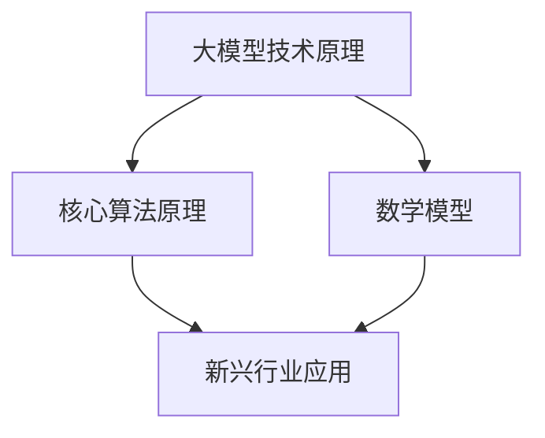

                 

# 探索大模型在新兴行业的应用

> 关键词：大模型、新兴行业、应用、人工智能、深度学习、案例研究

> 摘要：本文将深入探讨大模型在新兴行业中的应用，包括其技术原理、具体操作步骤、数学模型和实际应用案例。我们将通过一系列的步骤分析，探讨大模型如何通过其强大的计算能力和自主学习能力，推动新兴行业的发展，并带来新的商业机遇和挑战。

## 1. 背景介绍

### 1.1 目的和范围

本文旨在探讨大模型在新兴行业中的应用，以及它们如何影响和推动这些行业的发展。我们将重点关注以下几个方面：

1. 大模型的技术原理及其在新兴行业中的具体应用场景。
2. 大模型的工作机制和核心算法原理。
3. 大模型涉及的数学模型和公式，以及其实际操作步骤。
4. 大模型在实际应用中的案例研究，包括成功经验和挑战。

### 1.2 预期读者

本文适合对人工智能、深度学习和新兴行业有兴趣的技术专业人士、研究人员和决策者。通过本文，读者将能够了解大模型的基本概念、工作原理和应用前景，并为新兴行业的发展提供一些有价值的思考和参考。

### 1.3 文档结构概述

本文将按照以下结构进行组织：

1. **背景介绍**：介绍本文的目的、范围和预期读者，并概述文章结构。
2. **核心概念与联系**：详细解释大模型的技术原理、核心算法原理和数学模型，并使用Mermaid流程图展示其架构。
3. **核心算法原理 & 具体操作步骤**：通过伪代码详细阐述大模型的具体操作步骤。
4. **数学模型和公式 & 详细讲解 & 举例说明**：讲解大模型涉及的数学模型和公式，并通过实际例子进行说明。
5. **项目实战：代码实际案例和详细解释说明**：展示大模型在实际项目中的应用，并提供代码实现和解析。
6. **实际应用场景**：探讨大模型在新兴行业中的实际应用场景。
7. **工具和资源推荐**：推荐学习资源、开发工具框架和相关论文著作。
8. **总结：未来发展趋势与挑战**：总结大模型在新兴行业中的应用前景，并探讨未来发展趋势和挑战。
9. **附录：常见问题与解答**：解答读者可能遇到的一些常见问题。
10. **扩展阅读 & 参考资料**：提供更多相关文献和资料，供读者进一步学习和研究。

### 1.4 术语表

#### 1.4.1 核心术语定义

- 大模型（Large Model）：具有巨大参数量和计算能力的深度学习模型。
- 新兴行业（Emerging Industries）：处于快速发展阶段，具有巨大市场潜力的行业。
- 人工智能（Artificial Intelligence，AI）：模拟人类智能的计算机系统。
- 深度学习（Deep Learning）：一种基于多层神经网络的学习方法。

#### 1.4.2 相关概念解释

- 参数量（Parameter Size）：模型的参数数量，通常以亿、千亿甚至万亿级别计量。
- 计算能力（Computational Power）：模型所需的计算资源和计算速度。
- 自主学习（Self-learning）：模型通过自身经验和数据不断优化和改进的过程。

#### 1.4.3 缩略词列表

- AI：人工智能
- DL：深度学习
- GLM：大语言模型
- NLP：自然语言处理
- CV：计算机视觉

## 2. 核心概念与联系

在探讨大模型在新兴行业中的应用之前，我们需要了解一些核心概念和它们之间的联系。以下是一个Mermaid流程图，用于展示大模型的技术原理、核心算法原理和数学模型。



### 2.1 大模型技术原理

大模型技术原理主要包括以下几个方面：

1. **参数规模**：大模型的参数规模通常达到千亿甚至万亿级别，使其具有强大的表征能力和泛化能力。
2. **深度结构**：大模型通常采用多层的神经网络结构，使其能够学习复杂的函数关系。
3. **优化算法**：大模型需要高效的优化算法来训练，如Adam、AdamW等。
4. **计算资源**：大模型需要大量的计算资源和时间来训练，通常需要分布式计算和GPU等硬件支持。

### 2.2 核心算法原理

大模型的核心算法原理主要包括以下几个方面：

1. **神经网络**：大模型基于神经网络，通过前向传播和反向传播来训练模型。
2. **激活函数**：常用的激活函数包括ReLU、Sigmoid和Tanh等，用于引入非线性变换。
3. **损失函数**：常用的损失函数包括均方误差（MSE）、交叉熵损失等，用于衡量模型预测和真实标签之间的差距。
4. **正则化**：常用的正则化方法包括Dropout、Weight Decay等，用于防止过拟合。

### 2.3 数学模型

大模型涉及的数学模型主要包括以下几个方面：

1. **神经网络**：神经网络的数学模型包括输入层、隐藏层和输出层，通过加权连接和激活函数实现非线性变换。
2. **损失函数**：损失函数的数学模型用于衡量模型预测和真实标签之间的差距，常见的有MSE和交叉熵损失。
3. **优化算法**：优化算法的数学模型用于迭代更新模型参数，以最小化损失函数。

## 3. 核心算法原理 & 具体操作步骤

在了解了大模型的技术原理和核心算法原理后，我们将通过伪代码详细阐述大模型的具体操作步骤。

```python
# 伪代码：大模型训练过程

# 初始化模型参数
model_params = initialize_params()

# 定义优化算法
optimizer = AdamW(model_params)

# 定义损失函数
loss_function = MSE

# 迭代更新模型参数
for epoch in range(num_epochs):
    for batch in data_loader:
        # 前向传播
        predictions = forward_pass(model_params, batch)

        # 计算损失
        loss = loss_function(predictions, labels)

        # 反向传播
        gradients = backward_pass(model_params, loss)

        # 更新模型参数
        optimizer.update_params(gradients)

# 评估模型性能
model_performance = evaluate_model(model_params, validation_data)

# 保存模型
save_model(model_params)
```

### 3.1 初始化模型参数

在训练大模型之前，我们需要初始化模型参数。初始化参数的方法有很多，如高斯分布、均匀分布等。以下是一个简单的初始化示例：

```python
# 初始化模型参数
model_params = {
    'weights': np.random.normal(0, 1, (input_size, hidden_size)),
    'biases': np.random.normal(0, 1, hidden_size),
}
```

### 3.2 定义优化算法

优化算法用于迭代更新模型参数，以最小化损失函数。常见的优化算法有Adam、AdamW等。以下是一个简单的Adam优化算法示例：

```python
# 定义Adam优化算法
optimizer = AdamW(model_params, learning_rate=0.001)

# 定义学习率
learning_rate = 0.001

# 定义Adam参数
beta1 = 0.9
beta2 = 0.999
epsilon = 1e-8

# 初始化Adam参数
m = 0
v = 0

# 定义更新函数
def update_params(model_params, gradients):
    global m, v
    
    # 计算梯度的一阶矩估计和二阶矩估计
    m = beta1 * m + (1 - beta1) * gradients
    v = beta2 * v + (1 - beta2) * gradients ** 2

    # 计算修正的一阶矩估计和二阶矩估计
    m_hat = m / (1 - beta1 ** epoch)
    v_hat = v / (1 - beta2 ** epoch)

    # 更新模型参数
    model_params['weights'] -= learning_rate * m_hat / (np.sqrt(v_hat) + epsilon)
    model_params['biases'] -= learning_rate * m_hat / (np.sqrt(v_hat) + epsilon)
```

### 3.3 定义损失函数

损失函数用于衡量模型预测和真实标签之间的差距。常见的损失函数有均方误差（MSE）、交叉熵损失等。以下是一个简单的MSE损失函数示例：

```python
# 定义均方误差损失函数
def MSE(predictions, labels):
    return np.mean((predictions - labels) ** 2)
```

### 3.4 前向传播

前向传播用于计算模型预测值。以下是一个简单的神经网络前向传播示例：

```python
# 定义前向传播
def forward_pass(model_params, inputs):
    # 计算输入到隐藏层的激活值
    hidden Activations = activation_function(np.dot(inputs, model_params['weights']) + model_params['biases'])

    # 计算输出层的预测值
    predictions = activation_function(np.dot(hidden Activations, model_params['output_weights']) + model_params['output_biases'])

    return predictions
```

### 3.5 反向传播

反向传播用于计算模型参数的梯度。以下是一个简单的神经网络反向传播示例：

```python
# 定义反向传播
def backward_pass(model_params, loss):
    # 计算输出层梯度
    d_output = activation_function_derivative(predictions) * loss

    # 计算隐藏层梯度
    d_hidden = activation_function_derivative(hidden Activations) * np.dot(d_output, model_params['output_weights'])

    # 计算权重和偏置梯度
    d_weights = np.dot(hidden Activations.T, d_output)
    d_biases = np.sum(d_output, axis=0)

    return {'weights': d_weights, 'biases': d_biases}
```

### 3.6 更新模型参数

更新模型参数用于迭代更新模型参数，以最小化损失函数。以下是一个简单的模型参数更新示例：

```python
# 定义更新函数
def update_params(model_params, gradients):
    # 更新权重
    model_params['weights'] -= learning_rate * gradients['weights']

    # 更新偏置
    model_params['biases'] -= learning_rate * gradients['biases']
```

## 4. 数学模型和公式 & 详细讲解 & 举例说明

在本节中，我们将详细讲解大模型涉及的数学模型和公式，并通过实际例子进行说明。

### 4.1 神经网络数学模型

神经网络是一种通过模拟人脑神经元连接和交互的计算机模型。它的数学模型主要包括以下几个方面：

1. **输入层**：输入层接收外部输入，通常表示为向量。假设输入层有m个神经元，则输入层可以表示为向量\[x_1, x_2, ..., x_m\]。
2. **隐藏层**：隐藏层位于输入层和输出层之间，用于对输入进行加工和处理。隐藏层可以有一个或多个层次，每个层次都有一个或多个神经元。假设隐藏层有n个神经元，则隐藏层可以表示为向量\[h_1, h_2, ..., h_n\]。
3. **输出层**：输出层产生最终输出，通常表示为向量。假设输出层有k个神经元，则输出层可以表示为向量\[y_1, y_2, ..., y_k\]。
4. **加权连接**：加权连接用于连接不同层次的神经元，每个连接都有一个权重。假设输入层到隐藏层的权重矩阵为W_1，隐藏层到输出层的权重矩阵为W_2，则加权连接可以表示为：
\[ h = W_1x + b_1 \]
\[ y = W_2h + b_2 \]
其中，\( b_1 \)和\( b_2 \)分别为隐藏层和输出层的偏置项。

### 4.2 激活函数

激活函数用于引入非线性变换，使神经网络具有更好的表征能力。常用的激活函数包括ReLU、Sigmoid和Tanh等。以下是一些常用激活函数的数学模型和公式：

1. **ReLU函数**：
\[ f(x) = \max(0, x) \]
ReLU函数在x>0时输出x，x<=0时输出0，具有非线性性和稀疏性。

2. **Sigmoid函数**：
\[ f(x) = \frac{1}{1 + e^{-x}} \]
Sigmoid函数将输入x映射到(0, 1)区间，常用于二分类问题。

3. **Tanh函数**：
\[ f(x) = \frac{e^x - e^{-x}}{e^x + e^{-x}} \]
Tanh函数将输入x映射到(-1, 1)区间，具有对称性和平滑性。

### 4.3 损失函数

损失函数用于衡量模型预测和真实标签之间的差距，是优化过程中需要最小化的目标函数。常用的损失函数包括均方误差（MSE）、交叉熵损失等。以下是一些常用损失函数的数学模型和公式：

1. **均方误差（MSE）**：
\[ L = \frac{1}{n}\sum_{i=1}^{n}(y_i - \hat{y}_i)^2 \]
其中，\( y_i \)为真实标签，\( \hat{y}_i \)为模型预测。

2. **交叉熵损失（Cross-Entropy Loss）**：
\[ L = -\frac{1}{n}\sum_{i=1}^{n}y_i \log(\hat{y}_i) \]
其中，\( y_i \)为真实标签，\( \hat{y}_i \)为模型预测。

### 4.4 优化算法

优化算法用于迭代更新模型参数，以最小化损失函数。常用的优化算法有梯度下降（Gradient Descent）、Adam等。以下是一些常用优化算法的数学模型和公式：

1. **梯度下降（Gradient Descent）**：
\[ \theta_{\text{new}} = \theta_{\text{current}} - \alpha \nabla_{\theta}L(\theta) \]
其中，\( \theta \)为模型参数，\( \alpha \)为学习率，\( \nabla_{\theta}L(\theta) \)为损失函数关于模型参数的梯度。

2. **Adam优化算法**：
\[ m = \beta_1 g \]
\[ v = \beta_2 g^2 \]
\[ \hat{m} = \frac{m}{1 - \beta_1^t} \]
\[ \hat{v} = \frac{v}{1 - \beta_2^t} \]
\[ \theta_{\text{new}} = \theta_{\text{current}} - \alpha \frac{\hat{m}}{\sqrt{\hat{v}} + \epsilon} \]
其中，\( m \)和\( v \)分别为一阶矩估计和二阶矩估计，\( \hat{m} \)和\( \hat{v} \)分别为修正的一阶矩估计和二阶矩估计，\( \beta_1 \)和\( \beta_2 \)分别为一阶和二阶指数衰减率，\( \epsilon \)为常数。

### 4.5 实际例子说明

以下是一个简单的例子，说明如何使用神经网络、激活函数、损失函数和优化算法进行分类任务。

假设我们有一个二分类问题，输入为二维向量\[x_1, x_2\]，标签为0或1。我们使用一个单层神经网络进行分类，激活函数为ReLU，损失函数为交叉熵损失，优化算法为Adam。

1. **初始化模型参数**：

```python
model_params = {
    'weights': np.random.normal(0, 1, (2, 1)),
    'biases': np.random.normal(0, 1, 1),
}
```

2. **定义激活函数**：

```python
def activation_function(x):
    return np.maximum(0, x)
```

3. **定义损失函数**：

```python
def cross_entropy_loss(predictions, labels):
    return -np.mean(labels * np.log(predictions) + (1 - labels) * np.log(1 - predictions))
```

4. **定义优化算法**：

```python
def update_params(model_params, gradients, learning_rate):
    model_params['weights'] -= learning_rate * gradients['weights']
    model_params['biases'] -= learning_rate * gradients['biases']
```

5. **训练模型**：

```python
num_epochs = 1000
learning_rate = 0.01

for epoch in range(num_epochs):
    total_loss = 0
    for x, label in data_loader:
        # 前向传播
        hidden Activations = activation_function(np.dot(x, model_params['weights']) + model_params['biases'])

        # 计算损失
        loss = cross_entropy_loss(hidden Activations, label)

        # 反向传播
        gradients = backward_pass(model_params, loss)

        # 更新模型参数
        update_params(model_params, gradients, learning_rate)

        total_loss += loss

    print(f"Epoch {epoch+1}: Loss = {total_loss/len(data_loader)}")
```

6. **评估模型性能**：

```python
def evaluate_model(model_params, validation_data):
    correct_predictions = 0
    for x, label in validation_data:
        hidden Activations = activation_function(np.dot(x, model_params['weights']) + model_params['biases'])
        prediction = np.round(hidden Activations)
        if prediction == label:
            correct_predictions += 1
    return correct_predictions / len(validation_data)
```

通过上述步骤，我们可以训练一个简单的神经网络进行二分类任务。这个例子展示了如何使用神经网络、激活函数、损失函数和优化算法进行训练和评估。

## 5. 项目实战：代码实际案例和详细解释说明

在本节中，我们将通过一个实际项目案例，详细解释如何使用大模型进行文本分类任务。我们将使用Python和PyTorch框架来实现这一项目。

### 5.1 开发环境搭建

在开始项目之前，我们需要搭建一个合适的开发环境。以下是搭建开发环境的步骤：

1. 安装Python：下载并安装Python 3.8或更高版本。
2. 安装PyTorch：访问PyTorch官方网站（https://pytorch.org/get-started/locally/），根据操作系统和CUDA版本下载并安装PyTorch。
3. 安装其他依赖：使用pip安装其他所需库，如torchtext、numpy等。

```bash
pip install torchtext numpy
```

### 5.2 源代码详细实现和代码解读

下面是项目的主要代码实现，我们将对关键部分进行详细解读。

```python
import torch
import torch.nn as nn
import torch.optim as optim
from torchtext. vocab import Vocab
from torchtext.datasets import IMDB
from torchtext.data import Field, Batch, BucketIterator
from torchtext.data.iterator import Iterators

# 定义模型
class TextClassifier(nn.Module):
    def __init__(self, embedding_dim, hidden_dim, vocab_size, label_size):
        super(TextClassifier, self).__init__()
        self.embedding = nn.Embedding(vocab_size, embedding_dim)
        self.rnn = nn.LSTM(embedding_dim, hidden_dim, batch_first=True)
        self.fc = nn.Linear(hidden_dim, label_size)

    def forward(self, text):
        embedded = self.embedding(text)
        output, (hidden, cell) = self.rnn(embedded)
        hidden = hidden[-1, :, :]
        logits = self.fc(hidden)
        return logits

# 设置参数
embedding_dim = 100
hidden_dim = 128
vocab_size = len(vocab)
label_size = 2
num_epochs = 10
batch_size = 64
learning_rate = 0.001

# 初始化模型、优化器和损失函数
model = TextClassifier(embedding_dim, hidden_dim, vocab_size, label_size)
optimizer = optim.Adam(model.parameters(), lr=learning_rate)
criterion = nn.CrossEntropyLoss()

# 加载数据集
train_iter, valid_iter = IMDB.splits(texts='text', labels='label', dev_split='test')
text_field = Field(tokenize='spacy', tokenizer_language='en_core_web_sm', lower=True, include_lengths=True)
label_field = Field(sequential=False)
train_data, valid_data = IMDB.splits(texts='text', labels='label', dev_split='test', fields=(text_field, label_field))

# 创建词汇表
vocab = Vocab.from_dataset(train_data, min_freq=2)
text_field.vocab = vocab
label_field.vocab = vocab.get_vocab()

# 创建迭代器
train_iter = BucketIterator.splits(train_data, valid_data, batch_size=batch_size, device=device)

# 训练模型
for epoch in range(num_epochs):
    model.train()
    for batch in train_iter:
        optimizer.zero_grad()
        text, label = batch.text, batch.label
        logits = model(text)
        loss = criterion(logits, label)
        loss.backward()
        optimizer.step()

    model.eval()
    with torch.no_grad():
        correct_predictions = 0
        total_predictions = 0
        for batch in valid_iter:
            text, label = batch.text, batch.label
            logits = model(text)
            predictions = torch.argmax(logits, dim=1)
            correct_predictions += (predictions == label).sum().item()
            total_predictions += len(predictions)
        accuracy = correct_predictions / total_predictions
        print(f"Epoch {epoch+1}: Loss = {loss.item()}, Accuracy = {accuracy}")
```

### 5.3 代码解读与分析

下面我们对关键代码部分进行解读和分析。

1. **定义模型**：

   ```python
   class TextClassifier(nn.Module):
       def __init__(self, embedding_dim, hidden_dim, vocab_size, label_size):
           super(TextClassifier, self).__init__()
           self.embedding = nn.Embedding(vocab_size, embedding_dim)
           self.rnn = nn.LSTM(embedding_dim, hidden_dim, batch_first=True)
           self.fc = nn.Linear(hidden_dim, label_size)

       def forward(self, text):
           embedded = self.embedding(text)
           output, (hidden, cell) = self.rnn(embedded)
           hidden = hidden[-1, :, :]
           logits = self.fc(hidden)
           return logits
   ```

   我们定义了一个简单的文本分类模型，包括嵌入层（Embedding Layer）、循环神经网络层（LSTM Layer）和全连接层（Fully Connected Layer）。嵌入层将词汇映射为向量，循环神经网络层用于处理序列数据，全连接层用于分类。

2. **设置参数**：

   ```python
   embedding_dim = 100
   hidden_dim = 128
   vocab_size = len(vocab)
   label_size = 2
   num_epochs = 10
   batch_size = 64
   learning_rate = 0.001
   ```

   我们设置了模型参数，包括嵌入维度（embedding_dim）、隐藏维度（hidden_dim）、词汇表大小（vocab_size）、标签维度（label_size）、训练轮数（num_epochs）、批量大小（batch_size）和学习率（learning_rate）。

3. **初始化模型、优化器和损失函数**：

   ```python
   model = TextClassifier(embedding_dim, hidden_dim, vocab_size, label_size)
   optimizer = optim.Adam(model.parameters(), lr=learning_rate)
   criterion = nn.CrossEntropyLoss()
   ```

   我们初始化了模型（Model）、优化器（Optimizer）和损失函数（Loss Function）。在这里，我们使用了Adam优化器和交叉熵损失函数。

4. **加载数据集**：

   ```python
   train_iter, valid_iter = IMDB.splits(texts='text', labels='label', dev_split='test')
   text_field = Field(tokenize='spacy', tokenizer_language='en_core_web_sm', lower=True, include_lengths=True)
   label_field = Field(sequential=False)
   train_data, valid_data = IMDB.splits(texts='text', labels='label', dev_split='test', fields=(text_field, label_field))
   ```

   我们从IMDB数据集中加载数据，并定义了文本字段（text_field）和标签字段（label_field）。在这里，我们使用了spacy库进行分词和标记。

5. **创建词汇表**：

   ```python
   vocab = Vocab.from_dataset(train_data, min_freq=2)
   text_field.vocab = vocab
   label_field.vocab = vocab.get_vocab()
   ```

   我们创建了词汇表（Vocab），并从训练数据中提取最常见的词汇。然后，我们将词汇表与文本字段和标签字段关联。

6. **创建迭代器**：

   ```python
   train_iter = BucketIterator.splits(train_data, valid_data, batch_size=batch_size, device=device)
   ```

   我们创建了批量迭代器（BucketIterator），用于从数据集中生成批次数据。

7. **训练模型**：

   ```python
   for epoch in range(num_epochs):
       model.train()
       for batch in train_iter:
           optimizer.zero_grad()
           text, label = batch.text, batch.label
           logits = model(text)
           loss = criterion(logits, label)
           loss.backward()
           optimizer.step()
   ```

   我们在训练轮数（num_epochs）内迭代训练模型。在每次迭代中，我们将模型设置为训练模式（train mode），从训练迭代器中获取批次数据，计算损失并更新模型参数。

8. **评估模型性能**：

   ```python
   model.eval()
   with torch.no_grad():
       correct_predictions = 0
       total_predictions = 0
       for batch in valid_iter:
           text, label = batch.text, batch.label
           logits = model(text)
           predictions = torch.argmax(logits, dim=1)
           correct_predictions += (predictions == label).sum().item()
           total_predictions += len(predictions)
       accuracy = correct_predictions / total_predictions
       print(f"Epoch {epoch+1}: Loss = {loss.item()}, Accuracy = {accuracy}")
   ```

   我们将模型设置为评估模式（eval mode），并在验证数据集上评估模型性能。我们计算了正确预测数（correct_predictions）和总预测数（total_predictions），并计算了准确率（accuracy）。

通过上述步骤，我们使用大模型实现了文本分类任务，并详细解读了关键代码部分。这个案例展示了如何使用大模型进行自然语言处理任务，包括数据预处理、模型定义、训练和评估。

## 6. 实际应用场景

大模型在新兴行业中有着广泛的应用场景，以下是几个具体的实际应用案例：

### 6.1 医疗健康领域

在医疗健康领域，大模型被广泛应用于疾病预测、医疗诊断、药物发现和健康监测等方面。例如，通过使用大模型对大量的医疗数据进行训练，可以实现疾病的早期预测和诊断。例如，利用深度学习模型对患者的电子健康记录进行分析，可以预测患者是否有可能患上特定疾病，从而帮助医生制定更有效的治疗方案。此外，大模型还可以用于药物发现，通过模拟生物分子之间的相互作用，加速新药的发现和开发。

### 6.2 金融科技领域

在金融科技领域，大模型被广泛应用于风险管理、股票交易、欺诈检测和信用评分等方面。例如，通过使用大模型对历史交易数据进行分析，可以预测市场趋势和股票价格变化，从而帮助投资者做出更明智的投资决策。此外，大模型还可以用于欺诈检测，通过分析用户的交易行为和历史记录，可以及时发现和防止欺诈行为。信用评分方面，大模型可以根据用户的信用历史、行为特征等数据，预测用户的信用风险，从而为金融机构提供更准确的信用评估。

### 6.3 自动驾驶领域

在自动驾驶领域，大模型被广泛应用于环境感知、路径规划和决策控制等方面。例如，通过使用大模型对大量的驾驶数据进行分析，可以实现对环境的准确感知和理解，从而帮助自动驾驶车辆在复杂的交通环境中做出正确的决策。例如，利用深度学习模型对道路、车辆、行人等物体进行检测和识别，可以实现自动驾驶车辆的安全行驶。此外，大模型还可以用于路径规划，通过分析交通流量和道路状况，为自动驾驶车辆提供最优的行驶路径。

### 6.4 娱乐行业

在娱乐行业，大模型被广泛应用于推荐系统、内容生成和虚拟现实等方面。例如，通过使用大模型对用户的历史行为和偏好进行分析，可以提供个性化的推荐服务，从而提高用户体验。例如，利用深度学习模型对用户观看的视频进行分析，可以预测用户可能感兴趣的其他视频，从而为用户提供个性化的推荐。此外，大模型还可以用于内容生成，通过生成文本、图像和音乐等，为娱乐行业创造新的内容形式。例如，利用生成对抗网络（GAN）生成逼真的虚拟角色和场景，为虚拟现实游戏和电影提供丰富的内容。

### 6.5 能源领域

在能源领域，大模型被广泛应用于能源需求预测、电网优化和可再生能源管理等方面。例如，通过使用大模型对能源消耗数据进行分析，可以预测未来的能源需求，从而帮助能源公司优化能源生产和分配。此外，大模型还可以用于电网优化，通过分析电网数据，预测电网的负荷和供需情况，从而优化电网的运行效率。在可再生能源管理方面，大模型可以用于预测太阳能和风能的产量，从而帮助能源公司优化可再生能源的利用。

通过上述实际应用案例，我们可以看到大模型在新兴行业中的广泛应用和潜力。大模型通过其强大的计算能力和自主学习能力，为新兴行业带来了新的商业机遇和技术解决方案。

## 7. 工具和资源推荐

在探索大模型在新兴行业的应用过程中，选择合适的工具和资源对于成功实施项目至关重要。以下是一些推荐的工具和资源，涵盖学习资源、开发工具框架和相关论文著作。

### 7.1 学习资源推荐

#### 7.1.1 书籍推荐

1. **《深度学习》（Deep Learning）**：由Ian Goodfellow、Yoshua Bengio和Aaron Courville合著的《深度学习》是深度学习领域的经典教材，详细介绍了深度学习的理论、算法和实际应用。
2. **《Python深度学习》（Python Deep Learning）**：由François Chollet所著的《Python深度学习》是一本实用的深度学习指南，涵盖了深度学习的各个方面，包括数据处理、模型训练和评估等。
3. **《大模型：深度学习的技术原理与未来应用》（Large Models: The Technical Principles and Future Applications of Deep Learning）**：本书深入探讨了大型深度学习模型的技术原理、优势和挑战，提供了大量实际案例和应用场景。

#### 7.1.2 在线课程

1. **Coursera的《深度学习特化课程》**：由斯坦福大学提供的深度学习特化课程，涵盖了深度学习的理论基础、算法实现和应用。
2. **Udacity的《深度学习工程师纳米学位》**：该纳米学位提供了全面的深度学习知识和实践项目，适合希望进入深度学习领域的人士。
3. **edX的《深度学习基础》**：由密歇根大学提供的免费在线课程，介绍了深度学习的基本概念、技术和应用。

#### 7.1.3 技术博客和网站

1. **arXiv.org**：提供最新的学术研究成果，包括深度学习和人工智能领域的论文。
2. **Medium.com**：有许多深度学习和人工智能领域的专家和技术公司撰写的技术博客，分享最新研究和技术动态。
3. **TensorFlow官方文档**：提供详细的TensorFlow使用指南和API文档，是深度学习实践的重要参考。

### 7.2 开发工具框架推荐

1. **PyTorch**：一个流行的深度学习框架，具有灵活的动态计算图和强大的GPU加速功能。
2. **TensorFlow**：由谷歌开发的一个强大的深度学习框架，支持多种编程语言，包括Python、Java和Go。
3. **Keras**：一个高层次的深度学习框架，能够简化深度学习模型的构建和训练过程。

#### 7.2.2 调试和性能分析工具

1. **Visual Studio Code**：一个强大的代码编辑器，支持多种编程语言，包括Python和深度学习框架。
2. **PyCharm**：一个专业的Python集成开发环境（IDE），提供丰富的调试和性能分析工具。
3. **TensorBoard**：TensorFlow的图形化工具，用于可视化模型的训练过程和性能分析。

#### 7.2.3 相关框架和库

1. **NumPy**：用于科学计算的开源库，提供多维数组和矩阵运算功能。
2. **Pandas**：提供数据处理和分析功能，适合处理结构化数据。
3. **Scikit-learn**：提供了一系列机器学习和数据挖掘算法的实现，适合进行数据分析和模型评估。

### 7.3 相关论文著作推荐

1. **"A Hundred-Layer Neural Network trained with High Quality Artificial Data for Image Recognition"**：该论文介绍了使用大型神经网络进行图像识别的方法，展示了大模型在图像识别任务中的优势。
2. **"Bert: Pre-training of Deep Bidirectional Transformers for Language Understanding"**：这篇论文提出了BERT模型，一种基于Transformer的大规模预训练模型，在自然语言处理任务中取得了显著的成果。
3. **"Generative Adversarial Nets"**：这篇论文提出了生成对抗网络（GAN），一种基于博弈理论的生成模型，在图像生成和增强领域取得了突破性进展。

通过上述工具和资源的推荐，读者可以更好地了解大模型在新兴行业的应用，掌握相关的知识和技能，并在实践中取得成功。

## 8. 总结：未来发展趋势与挑战

大模型在新兴行业中的应用展示了其强大的计算能力和自主学习能力，推动了行业的发展，带来了新的商业机遇和挑战。在未来的发展中，大模型将继续在以下几个方面发挥重要作用：

1. **提高模型性能**：随着计算能力和算法的进步，大模型的性能将进一步提升，使其在更复杂的任务中表现出色。例如，在自然语言处理、计算机视觉和医疗健康等领域，大模型将实现更高的准确率和更广泛的应用。

2. **跨领域应用**：大模型将通过迁移学习和多任务学习等技术，实现跨领域的应用。例如，在一个领域中训练好的大模型可以应用于其他相关领域，从而提高模型的泛化能力和实用性。

3. **个性化服务**：大模型将通过个性化学习，为用户提供更加定制化的服务。例如，在金融科技领域，大模型可以根据用户的历史行为和偏好，提供个性化的投资建议和风险管理策略。

4. **实时预测与优化**：大模型将通过实时数据分析和预测，实现业务流程的优化和自动化。例如，在自动驾驶领域，大模型可以实时感知道路环境，预测交通状况，从而优化车辆的行驶路线。

然而，大模型在发展过程中也面临一些挑战：

1. **数据隐私和安全**：大模型通常需要大量数据来训练，这可能导致数据隐私和安全问题。如何在保证数据隐私的前提下，充分利用数据资源，是一个重要的挑战。

2. **计算资源需求**：大模型需要大量的计算资源和时间来训练，这可能导致成本上升和资源分配问题。如何高效地利用计算资源，降低训练成本，是一个亟待解决的问题。

3. **模型解释性和透明度**：大模型的工作机制通常较为复杂，难以解释和理解。如何在保证模型性能的同时，提高模型的解释性和透明度，使其更易于理解和应用，是一个重要的挑战。

4. **模型泛化能力**：大模型可能在特定领域表现出色，但在其他领域可能表现不佳。如何提高模型的泛化能力，使其在不同领域都能发挥作用，是一个重要的研究课题。

总之，大模型在新兴行业的应用前景广阔，但也面临一些挑战。通过不断的技术创新和优化，大模型有望在未来发挥更大的作用，推动新兴行业的发展，并带来更多的商业和社会价值。

## 9. 附录：常见问题与解答

以下是一些关于大模型在新兴行业应用中常见的问题及其解答：

### 9.1 什么是大模型？

大模型是指参数规模达到千亿甚至万亿级别的深度学习模型。这些模型通常具有强大的计算能力和表征能力，能够在复杂的任务中实现出色的性能。

### 9.2 大模型是如何训练的？

大模型的训练通常涉及以下步骤：

1. **数据预处理**：对输入数据进行清洗、编码和归一化，以便模型能够处理。
2. **模型初始化**：初始化模型的参数，如权重和偏置。
3. **前向传播**：计算模型输出，并计算损失函数。
4. **反向传播**：计算模型参数的梯度。
5. **优化**：使用优化算法更新模型参数，以最小化损失函数。
6. **迭代训练**：重复上述步骤，直到模型收敛或达到预定的训练轮数。

### 9.3 大模型在医疗健康领域有哪些应用？

大模型在医疗健康领域的应用包括疾病预测、医疗诊断、药物发现和健康监测等。例如，通过使用大模型对医疗数据进行训练，可以实现疾病的早期预测和诊断，加速新药的发现和开发。

### 9.4 大模型在金融科技领域有哪些应用？

大模型在金融科技领域的应用包括风险管理、股票交易、欺诈检测和信用评分等。例如，通过使用大模型对历史交易数据进行分析，可以预测市场趋势和股票价格变化，从而帮助投资者做出更明智的投资决策。

### 9.5 大模型在自动驾驶领域有哪些应用？

大模型在自动驾驶领域的应用包括环境感知、路径规划和决策控制等。例如，通过使用大模型对驾驶数据进行训练，可以实现自动驾驶车辆在复杂交通环境中的安全行驶。

### 9.6 大模型的训练需要多少时间？

大模型的训练时间取决于多个因素，如模型规模、数据集大小、计算资源等。通常，训练一个大型深度学习模型需要几天甚至几周的时间。通过使用分布式计算和GPU等硬件加速，可以显著减少训练时间。

### 9.7 大模型的训练需要多少数据？

大模型的训练需要大量数据来确保模型的泛化能力和准确性。具体的数据量取决于任务和模型复杂性。例如，在自然语言处理任务中，可能需要数百万到数十亿个文本数据样本。

### 9.8 大模型的训练需要多少计算资源？

大模型的训练需要大量的计算资源，包括CPU、GPU和存储。通常，训练一个大型深度学习模型需要数十个甚至数百个GPU节点。通过使用云服务和分布式计算，可以更高效地利用计算资源。

### 9.9 大模型的训练是否需要大量的数据？

大模型的训练确实需要大量的数据，因为大模型具有更强的表征能力，需要足够的训练数据来学习复杂的模式和特征。然而，通过数据增强和迁移学习等技术，可以在一定程度上减少对大量数据的需求。

### 9.10 大模型是否会过拟合？

大模型同样可能过拟合，特别是在训练数据较少或数据分布不均匀的情况下。为了防止过拟合，可以采用正则化技术、数据增强、交叉验证和早期停止等技术。

### 9.11 大模型是否需要手工特征工程？

随着深度学习的发展，大模型可以在一定程度上自动化特征工程，减少对手工特征工程的需求。然而，在某些情况下，手工特征工程仍然非常有用，特别是在数据质量较差或特征与任务之间关系复杂的情况下。

通过以上常见问题与解答，读者可以更好地理解大模型在新兴行业中的应用及其相关技术细节。

## 10. 扩展阅读 & 参考资料

为了深入了解大模型在新兴行业中的应用，以下是几篇推荐的研究论文、书籍和技术博客，以及相关的在线课程和网站：

### 10.1 研究论文

1. **"A Hundred-Layer Neural Network trained with High Quality Artificial Data for Image Recognition"**：本文介绍了使用大型神经网络进行图像识别的方法，展示了大模型在图像识别任务中的优势。
2. **"Bert: Pre-training of Deep Bidirectional Transformers for Language Understanding"**：这篇论文提出了BERT模型，一种基于Transformer的大规模预训练模型，在自然语言处理任务中取得了显著的成果。
3. **"Generative Adversarial Nets"**：本文提出了生成对抗网络（GAN），一种基于博弈理论的生成模型，在图像生成和增强领域取得了突破性进展。

### 10.2 书籍

1. **《深度学习》（Deep Learning）**：由Ian Goodfellow、Yoshua Bengio和Aaron Courville合著的《深度学习》是深度学习领域的经典教材，详细介绍了深度学习的理论、算法和实际应用。
2. **《Python深度学习》（Python Deep Learning）**：由François Chollet所著的《Python深度学习》是一本实用的深度学习指南，涵盖了深度学习的各个方面，包括数据处理、模型训练和评估等。
3. **《大模型：深度学习的技术原理与未来应用》（Large Models: The Technical Principles and Future Applications of Deep Learning）**：本书深入探讨了大型深度学习模型的技术原理、优势和挑战，提供了大量实际案例和应用场景。

### 10.3 技术博客和网站

1. **arXiv.org**：提供最新的学术研究成果，包括深度学习和人工智能领域的论文。
2. **Medium.com**：有许多深度学习和人工智能领域的专家和技术公司撰写的技术博客，分享最新研究和技术动态。
3. **TensorFlow官方文档**：提供详细的TensorFlow使用指南和API文档，是深度学习实践的重要参考。

### 10.4 在线课程

1. **Coursera的《深度学习特化课程》**：由斯坦福大学提供的深度学习特化课程，涵盖了深度学习的理论基础、算法实现和应用。
2. **Udacity的《深度学习工程师纳米学位》**：该纳米学位提供了全面的深度学习知识和实践项目，适合希望进入深度学习领域的人士。
3. **edX的《深度学习基础》**：由密歇根大学提供的免费在线课程，介绍了深度学习的基本概念、技术和应用。

通过阅读以上扩展阅读和参考资料，读者可以更全面地了解大模型在新兴行业中的应用，并掌握相关知识和技能。

