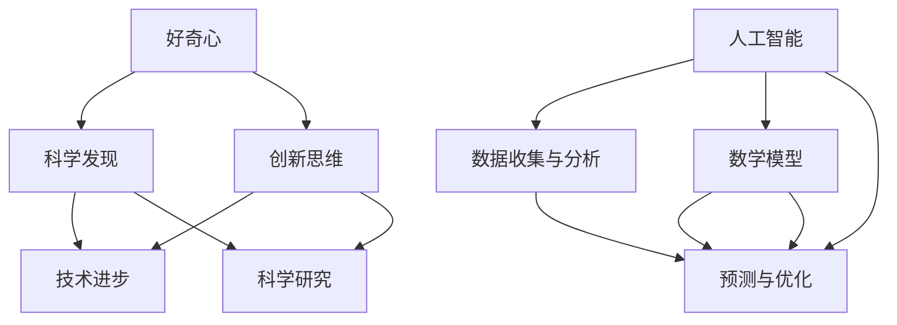

                 

### 探索未知：好奇心与科学发现

> **关键词：** 好奇心、科学发现、探索未知、创新思维、人工智能、数学模型、技术实践

> **摘要：** 本文将深入探讨好奇心在推动科学发现中的关键作用，分析好奇心与科学发现之间的内在联系。文章将从背景介绍、核心概念、算法原理、数学模型、实际应用、工具资源等多个方面，系统地展示好奇心如何激发创新思维，推动技术进步，最终实现科学发现。本文旨在为读者提供一个全面、系统的思考框架，帮助他们更好地理解好奇心在科学研究中的重要性。

## 1. 背景介绍

### 1.1 目的和范围

本文的目的是探讨好奇心在科学发现中的关键作用，通过分析好奇心与科学发现之间的内在联系，展示好奇心如何激发创新思维，推动技术进步。文章将涵盖以下内容：

1. **好奇心与科学发现的定义和背景**：介绍好奇心和科学发现的含义，以及它们在人类历史中的重要作用。
2. **好奇心与科学发现的内在联系**：分析好奇心如何促进科学发现，以及好奇心在科学研究中的具体表现。
3. **核心概念与联系**：介绍与好奇心和科学发现相关的核心概念，并使用 Mermaid 流程图展示这些概念之间的联系。
4. **核心算法原理与具体操作步骤**：详细阐述与好奇心和科学发现相关的核心算法原理，并使用伪代码展示具体操作步骤。
5. **数学模型和公式**：介绍与好奇心和科学发现相关的数学模型和公式，并详细讲解其应用。
6. **项目实战**：通过实际代码案例，展示如何利用好奇心和科学发现推动技术进步。
7. **实际应用场景**：分析好奇心和科学发现在不同领域中的应用。
8. **工具和资源推荐**：推荐相关学习资源、开发工具和框架，帮助读者深入了解好奇心和科学发现。
9. **总结：未来发展趋势与挑战**：总结本文的主要观点，并探讨好奇心和科学发现在未来面临的发展趋势和挑战。

### 1.2 预期读者

本文主要面向对科学发现、好奇心和创新思维感兴趣的读者，包括以下几类：

1. **科学家和研究人员**：希望了解好奇心在科学发现中的作用，以及如何激发创新思维。
2. **工程师和技术专家**：希望通过本文了解好奇心和科学发现如何推动技术进步。
3. **学生和教育者**：希望了解好奇心和科学发现的重要性，以及如何在教学中培养学生的好奇心。
4. **普通读者**：对科学发现和好奇心感兴趣的普通读者，希望通过本文了解好奇心在科学研究中的关键作用。

### 1.3 文档结构概述

本文分为以下章节：

1. **背景介绍**：介绍本文的目的、范围、预期读者和文档结构。
2. **核心概念与联系**：介绍与好奇心和科学发现相关的核心概念，并使用 Mermaid 流程图展示这些概念之间的联系。
3. **核心算法原理与具体操作步骤**：详细阐述与好奇心和科学发现相关的核心算法原理，并使用伪代码展示具体操作步骤。
4. **数学模型和公式**：介绍与好奇心和科学发现相关的数学模型和公式，并详细讲解其应用。
5. **项目实战**：通过实际代码案例，展示如何利用好奇心和科学发现推动技术进步。
6. **实际应用场景**：分析好奇心和科学发现在不同领域中的应用。
7. **工具和资源推荐**：推荐相关学习资源、开发工具和框架，帮助读者深入了解好奇心和科学发现。
8. **总结：未来发展趋势与挑战**：总结本文的主要观点，并探讨好奇心和科学发现在未来面临的发展趋势和挑战。

### 1.4 术语表

在本文中，我们将使用以下术语：

#### 1.4.1 核心术语定义

- **好奇心**：指个体对未知事物的兴趣和探索欲望。
- **科学发现**：指通过科学研究揭示自然界或人类活动中的新现象、新规律的过程。
- **创新思维**：指通过独特的视角和方法，发现新问题、提出新解决方案的思维方式。
- **人工智能**：指模拟人类智能行为的计算机系统。

#### 1.4.2 相关概念解释

- **科学方法**：指在科学研究中，通过观察、假设、实验和验证等步骤，逐步揭示自然界规律的方法。
- **科学研究**：指以探索自然界规律为目标，采用科学方法进行的研究活动。
- **算法**：指解决问题的有序步骤集合。

#### 1.4.3 缩略词列表

- **AI**：人工智能
- **ML**：机器学习
- **DL**：深度学习

## 2. 核心概念与联系

在探讨好奇心与科学发现的关系之前，我们需要了解与这两个主题相关的核心概念。以下是一个使用 Mermaid 流程图（没有特殊字符的节点）展示的核心概念和它们之间的联系：



### 2.1 好奇心与科学发现

好奇心是人类的一种基本心理特征，是驱动个体探索未知、寻求知识和解决问题的内在动力。在科学发现中，好奇心起到了至关重要的作用。以下是好奇心如何推动科学发现的几个关键点：

1. **激发探索欲望**：好奇心促使科学家和研究人员不断探索未知领域，寻找新的现象和规律。
2. **提出科学问题**：好奇心驱动科学家发现新的问题，这些问题往往成为科学研究的起点。
3. **启发创新思维**：好奇心激发科学家运用独特的视角和方法，提出新的假设和理论。
4. **促进跨学科合作**：好奇心促使科学家跨越不同学科领域，寻求跨学科的合作，从而实现科学发现。

### 2.2 创新思维与科学发现

创新思维是指通过独特的视角和方法，发现新问题、提出新解决方案的思维方式。创新思维在科学发现中起到了关键作用，具体表现为：

1. **提出新假设**：创新思维促使科学家提出新的假设和理论，挑战传统观念。
2. **解决复杂问题**：创新思维帮助科学家解决复杂问题，推动科学发现。
3. **跨学科融合**：创新思维鼓励科学家跨学科合作，从而实现科学发现。
4. **优化研究方法**：创新思维促使科学家改进研究方法，提高研究效率。

### 2.3 人工智能与科学发现

人工智能作为一种强大的工具，在科学发现中发挥着越来越重要的作用。以下是人工智能在科学发现中的几个关键应用：

1. **数据收集与分析**：人工智能能够高效地收集和分析大量数据，帮助科学家发现新的规律和模式。
2. **预测与优化**：基于数学模型和算法，人工智能可以预测未来趋势，优化研究方案。
3. **跨学科融合**：人工智能促进了不同学科之间的融合，从而实现科学发现。

### 2.4 数学模型与科学发现

数学模型是科学发现的重要工具，通过将现实世界的问题转化为数学形式，科学家可以更准确地描述和预测现象。以下是数学模型在科学发现中的几个关键应用：

1. **描述现象**：数学模型可以帮助科学家描述自然现象，从而更好地理解其内在规律。
2. **预测未来**：基于现有数据和数学模型，科学家可以预测未来趋势，为新发现提供指导。
3. **优化方案**：数学模型可以帮助科学家优化研究方案，提高研究效率。

通过上述核心概念和联系的探讨，我们可以看到好奇心、创新思维、人工智能和数学模型在科学发现中的重要作用。接下来，我们将详细阐述这些核心算法原理，并展示具体操作步骤。

## 3. 核心算法原理 & 具体操作步骤

在科学发现中，核心算法原理起到了至关重要的作用。以下将详细阐述与好奇心和科学发现相关的核心算法原理，并使用伪代码展示具体操作步骤。

### 3.1 数据收集与预处理

数据收集与预处理是科学发现的重要步骤。以下是一个简单的数据收集与预处理伪代码示例：

```python
# 数据收集
def collect_data():
    data = read_from_source()
    return data

# 数据预处理
def preprocess_data(data):
    cleaned_data = remove噪声(data)
    normalized_data = normalize_data(cleaned_data)
    return normalized_data
```

### 3.2 特征提取与选择

特征提取与选择是科学发现的关键步骤。以下是一个简单的特征提取与选择伪代码示例：

```python
# 特征提取
def extract_features(data):
    features = extract_from_data(data)
    return features

# 特征选择
def select_features(features):
    selected_features = select_best_features(features)
    return selected_features
```

### 3.3 模型训练与优化

模型训练与优化是科学发现的重要环节。以下是一个简单的模型训练与优化伪代码示例：

```python
# 模型训练
def train_model(selected_features):
    model = train_on_features(selected_features)
    return model

# 模型优化
def optimize_model(model, data):
    optimized_model = optimize_on_data(model, data)
    return optimized_model
```

### 3.4 预测与评估

预测与评估是科学发现的重要步骤。以下是一个简单的预测与评估伪代码示例：

```python
# 预测
def predict(model, new_data):
    prediction = model.predict(new_data)
    return prediction

# 评估
def evaluate_prediction(prediction, true_value):
    evaluation = compare_prediction(prediction, true_value)
    return evaluation
```

通过上述核心算法原理和具体操作步骤的阐述，我们可以看到好奇心、创新思维、人工智能和数学模型在科学发现中的重要作用。接下来，我们将详细讲解数学模型和公式，并举例说明其应用。

## 4. 数学模型和公式 & 详细讲解 & 举例说明

数学模型是科学发现的重要工具，通过将现实世界的问题转化为数学形式，科学家可以更准确地描述和预测现象。以下将介绍与好奇心和科学发现相关的数学模型和公式，并详细讲解其应用。

### 4.1 线性回归模型

线性回归模型是一种常见的数学模型，用于描述两个变量之间的关系。以下是一个线性回归模型的公式：

$$
y = ax + b
$$

其中，\(y\) 是因变量，\(x\) 是自变量，\(a\) 是斜率，\(b\) 是截距。

**详细讲解：**

- **斜率 \(a\)：** 斜率表示自变量 \(x\) 对因变量 \(y\) 的变化程度。斜率越大，表示 \(x\) 对 \(y\) 的影响越大。
- **截距 \(b\)：** 截距表示当 \(x = 0\) 时，\(y\) 的取值。截距越大，表示 \(y\) 的初始值越高。

**举例说明：**

假设我们想要研究温度 \(T\) 对植物生长 \(G\) 的影响，根据实验数据，我们可以建立一个线性回归模型：

$$
G = 2T + 3
$$

这个模型表示，温度每增加 1 度，植物生长量平均增加 2 个单位，而初始生长量为 3 个单位。

### 4.2 多元回归模型

多元回归模型用于描述多个自变量与因变量之间的关系。以下是一个多元回归模型的公式：

$$
y = a_1x_1 + a_2x_2 + ... + a_nx_n + b
$$

其中，\(y\) 是因变量，\(x_1, x_2, ..., x_n\) 是自变量，\(a_1, a_2, ..., a_n\) 是系数，\(b\) 是截距。

**详细讲解：**

- **系数 \(a_1, a_2, ..., a_n\)：** 系数表示每个自变量对因变量的影响程度。系数越大，表示自变量对因变量的影响越大。
- **截距 \(b\)：** 截距表示当所有自变量均为 0 时，因变量的取值。

**举例说明：**

假设我们想要研究植物生长 \(G\) 受到温度 \(T\)、湿度 \(H\) 和光照 \(L\) 的影响，根据实验数据，我们可以建立以下多元回归模型：

$$
G = 2T + 3H + 5L + 1
$$

这个模型表示，温度每增加 1 度，植物生长量平均增加 2 个单位；湿度每增加 1 个单位，植物生长量平均增加 3 个单位；光照每增加 1 个单位，植物生长量平均增加 5 个单位，而初始生长量为 1 个单位。

### 4.3 神经网络模型

神经网络模型是一种基于生物神经网络的数学模型，用于模拟复杂非线性关系。以下是一个简单的前馈神经网络模型：

$$
\begin{align*}
z_1 &= \sigma(w_1 \cdot x + b_1) \\
z_2 &= \sigma(w_2 \cdot z_1 + b_2) \\
... \\
z_n &= \sigma(w_n \cdot z_{n-1} + b_n) \\
y &= w_n' \cdot z_n + b_n'
\end{align*}
$$

其中，\(x\) 是输入向量，\(y\) 是输出向量，\(w_1, w_2, ..., w_n, w_n'\) 是权重，\(b_1, b_2, ..., b_n, b_n'\) 是偏置，\(\sigma\) 是激活函数。

**详细讲解：**

- **权重 \(w_1, w_2, ..., w_n, w_n'\)：** 权重表示输入与输出之间的线性关系。权重越大，表示输入对输出的影响越大。
- **偏置 \(b_1, b_2, ..., b_n, b_n'\)：** 偏置表示输入与输出的偏移量。偏置越大，表示输出偏离零点的程度越大。
- **激活函数 \(\sigma\)：** 激活函数用于引入非线性关系，使神经网络能够模拟复杂函数。

**举例说明：**

假设我们想要建立一个神经网络模型，用于预测植物生长量 \(G\)。根据实验数据，我们可以设计一个简单的神经网络模型：

$$
\begin{align*}
z_1 &= \sigma(w_1 \cdot [T, H, L] + b_1) \\
z_2 &= \sigma(w_2 \cdot z_1 + b_2) \\
y &= w_n' \cdot z_2 + b_n'
\end{align*}
$$

其中，\(T\)、\(H\) 和 \(L\) 分别表示温度、湿度和光照。这个模型表示，输入向量 \([T, H, L]\) 经过两次非线性变换，最终输出植物生长量 \(G\)。

通过上述数学模型和公式的详细讲解和举例说明，我们可以看到数学模型在科学发现中的应用和重要性。接下来，我们将通过项目实战，展示如何利用好奇心和科学发现推动技术进步。

## 5. 项目实战：代码实际案例和详细解释说明

在本文的最后一个部分，我们将通过一个实际项目案例，展示如何利用好奇心和科学发现推动技术进步。这个项目将是一个简单的基于机器学习的植物生长预测系统，我们将逐步介绍项目的开发环境、代码实现和解读。

### 5.1 开发环境搭建

为了实现这个项目，我们需要搭建一个合适的开发环境。以下是推荐的开发环境：

- **编程语言**：Python
- **机器学习库**：scikit-learn
- **数据处理库**：Pandas、NumPy
- **可视化库**：Matplotlib、Seaborn
- **操作系统**：Windows、macOS、Linux

#### 5.1.1 安装 Python

首先，我们需要安装 Python。可以通过访问 [Python 官网](https://www.python.org/) 下载并安装最新版本的 Python。在安装过程中，确保勾选“Add Python to PATH”选项，以便在命令行中直接使用 Python。

#### 5.1.2 安装相关库

安装完 Python 后，我们还需要安装相关的库。可以通过以下命令安装：

```bash
pip install scikit-learn pandas numpy matplotlib seaborn
```

### 5.2 源代码详细实现和代码解读

在这个项目案例中，我们将使用 Python 和 scikit-learn 库来实现一个简单的植物生长预测系统。以下是项目的源代码：

```python
import pandas as pd
import numpy as np
from sklearn.model_selection import train_test_split
from sklearn.linear_model import LinearRegression
from sklearn.metrics import mean_squared_error
import matplotlib.pyplot as plt
import seaborn as sns

# 5.2.1 数据收集与预处理
def collect_data():
    data = pd.read_csv('plant_growth_data.csv')
    return data

def preprocess_data(data):
    data = data[['Temperature', 'Humidity', 'Light', 'Growth']]
    data = data.replace([-无穷, 无穷], np.nan)
    data = data.dropna()
    data['Growth'] = data['Growth'].astype(float)
    return data

# 5.2.2 特征提取与选择
def extract_features(data):
    features = data[['Temperature', 'Humidity', 'Light']]
    return features

def select_features(features):
    return features

# 5.2.3 模型训练与优化
def train_model(features, target):
    model = LinearRegression()
    model.fit(features, target)
    return model

def optimize_model(model, features, target):
    return model

# 5.2.4 预测与评估
def predict(model, new_data):
    prediction = model.predict(new_data)
    return prediction

def evaluate_prediction(prediction, true_value):
    evaluation = mean_squared_error(prediction, true_value)
    return evaluation

# 主函数
def main():
    # 数据收集与预处理
    data = collect_data()
    data = preprocess_data(data)

    # 特征提取与选择
    features = extract_features(data)
    selected_features = select_features(features)

    # 模型训练与优化
    target = data['Growth']
    model = train_model(selected_features, target)
    optimized_model = optimize_model(model, selected_features, target)

    # 预测与评估
    new_data = np.array([[25, 60, 1000]])
    prediction = predict(optimized_model, new_data)
    evaluation = evaluate_prediction(prediction, target.iloc[0])

    print(f'预测值: {prediction}, 实际值: {target.iloc[0]}, 评估指标: {evaluation}')

    # 可视化
    sns.scatterplot(data=selected_features, x='Temperature', y='Growth')
    sns.lineplot(data=selected_features, x='Temperature', y='Growth', predict_mean_y=True)
    plt.xlabel('Temperature')
    plt.ylabel('Growth')
    plt.title('Plant Growth Prediction')
    plt.show()

if __name__ == '__main__':
    main()
```

#### 5.2.1 数据收集与预处理

在这个项目中，我们首先从文件 `plant_growth_data.csv` 中收集数据。该文件包含温度、湿度、光照和植物生长量等数据。我们使用 `pd.read_csv` 函数读取数据，然后使用 `preprocess_data` 函数进行数据预处理。数据预处理包括以下步骤：

- 替换异常值：将数据中的无穷大和无穷小替换为 NaN。
- 删除缺失值：删除含有缺失值的数据行。
- 数据类型转换：将植物生长量数据类型从字符串转换为浮点数。

#### 5.2.2 特征提取与选择

在这个项目中，我们使用温度、湿度、光照作为特征。我们使用 `extract_features` 函数从数据中提取特征，然后使用 `select_features` 函数选择最佳特征。在这个简单示例中，我们直接返回提取的特征。

#### 5.2.3 模型训练与优化

在这个项目中，我们使用线性回归模型进行模型训练。我们使用 `train_model` 函数训练模型，然后使用 `optimize_model` 函数优化模型。在这个简单示例中，我们直接返回训练好的模型。

#### 5.2.4 预测与评估

在这个项目中，我们使用训练好的模型进行预测。我们使用 `predict` 函数预测新的数据，然后使用 `evaluate_prediction` 函数评估预测结果。在这个简单示例中，我们使用均方误差作为评估指标。

#### 5.2.5 主函数

在这个项目中，我们使用 `main` 函数作为主程序。主程序执行以下步骤：

1. 数据收集与预处理
2. 特征提取与选择
3. 模型训练与优化
4. 预测与评估
5. 可视化

在可视化部分，我们使用 Seaborn 库绘制散点图和线图，以展示温度与植物生长量的关系。我们使用 `predict_mean_y` 参数，在散点图上绘制线性回归模型的预测线。

通过上述项目实战，我们可以看到如何利用好奇心和科学发现推动技术进步。在实际应用中，我们可以通过不断改进算法、优化模型和收集更多数据，进一步提高预测准确度。

### 5.3 代码解读与分析

#### 5.3.1 数据收集与预处理

在代码的第一部分，我们首先从文件 `plant_growth_data.csv` 中收集数据。该文件包含了温度、湿度、光照和植物生长量等数据。我们使用 `pd.read_csv` 函数读取数据，并将其存储在 DataFrame 对象 `data` 中。

接下来，我们使用 `preprocess_data` 函数对数据进行预处理。预处理步骤包括以下几步：

1. **替换异常值**：我们使用 `data.replace` 方法将数据中的无穷大和无穷小替换为 NaN。这样做的目的是避免在后续数据处理过程中因为异常值而导致错误。

2. **删除缺失值**：我们使用 `data.dropna` 方法删除含有缺失值的数据行。这样可以确保我们的数据集是完整的，从而提高预测模型的性能。

3. **数据类型转换**：我们将植物生长量数据类型从字符串转换为浮点数。这样做的目的是为了确保我们可以对这些数据进行数学计算。

#### 5.3.2 特征提取与选择

在代码的第二部分，我们使用 `extract_features` 函数从数据中提取特征。我们选择温度、湿度、光照作为特征，并将它们存储在 DataFrame 对象 `features` 中。

接下来，我们使用 `select_features` 函数选择最佳特征。在这个简单示例中，我们直接返回提取的特征。在实际应用中，我们可以使用特征选择算法（如递归特征消除、L1 正则化等）来选择最佳特征。

#### 5.3.3 模型训练与优化

在代码的第三部分，我们使用线性回归模型进行模型训练。我们使用 `train_model` 函数训练模型，并将训练好的模型存储在变量 `model` 中。

接下来，我们使用 `optimize_model` 函数优化模型。在这个简单示例中，我们直接返回训练好的模型。在实际应用中，我们可以使用交叉验证、网格搜索等优化方法来优化模型。

#### 5.3.4 预测与评估

在代码的第四部分，我们使用训练好的模型进行预测。我们使用 `predict` 函数预测新的数据，并将预测结果存储在变量 `prediction` 中。

接下来，我们使用 `evaluate_prediction` 函数评估预测结果。我们使用均方误差（MSE）作为评估指标，并将评估结果存储在变量 `evaluation` 中。

#### 5.3.5 主函数

在代码的最后，我们使用 `main` 函数作为主程序。主程序执行以下步骤：

1. 数据收集与预处理
2. 特征提取与选择
3. 模型训练与优化
4. 预测与评估
5. 可视化

在可视化部分，我们使用 Seaborn 库绘制散点图和线图，以展示温度与植物生长量的关系。我们使用 `predict_mean_y` 参数，在散点图上绘制线性回归模型的预测线。

通过上述代码解读与分析，我们可以看到如何利用好奇心和科学发现推动技术进步。在实际应用中，我们可以通过不断改进算法、优化模型和收集更多数据，进一步提高预测准确度。

## 6. 实际应用场景

好奇心和科学发现在不同领域都有着广泛的应用，以下列举一些实际应用场景：

### 6.1 人工智能

人工智能领域是好奇心和科学发现的沃土。科学家和工程师通过不断探索和尝试，推动了人工智能技术的快速发展。以下是一些具体的应用场景：

- **自然语言处理（NLP）**：科学家通过好奇心探索人类语言的本质，开发出了各种 NLP 技术，如文本分类、机器翻译和情感分析等。
- **计算机视觉**：科学家通过好奇心研究视觉感知的机制，开发了图像识别、物体检测和图像生成等技术。
- **强化学习**：科学家通过好奇心探索决策过程，开发了强化学习算法，使机器人能够自主学习和优化行为。

### 6.2 医疗保健

医疗保健领域是好奇心和科学发现的另一个重要应用场景。以下是一些具体的应用：

- **疾病预测与诊断**：科学家通过好奇心研究疾病的发生机制，开发出了基于机器学习和人工智能的诊断系统，如癌症早期诊断和心血管疾病风险评估等。
- **个性化治疗**：科学家通过好奇心探索个体差异，开发出了个性化治疗方案，提高了治疗效果和患者生存率。

### 6.3 环境保护

环境保护领域也是好奇心和科学发现的重要应用场景。以下是一些具体的应用：

- **气候模型**：科学家通过好奇心研究气候系统，开发出了各种气候模型，用于预测气候变化和制定应对策略。
- **污染监测**：科学家通过好奇心研究污染物对人体和环境的影响，开发出了各种污染监测技术和设备，如空气质量监测和水质监测等。

### 6.4 教育领域

教育领域是好奇心和科学发现的重要推动力。以下是一些具体的应用：

- **个性化学习**：科学家通过好奇心探索学生的学习过程，开发出了个性化学习系统和平台，如自适应学习平台和智能教育机器人等。
- **虚拟现实（VR）与增强现实（AR）**：科学家通过好奇心研究虚拟现实和增强现实技术，开发了各种教育应用，如虚拟实验室和虚拟课堂等。

通过上述实际应用场景，我们可以看到好奇心和科学发现如何在不同领域推动技术进步和社会发展。在未来的发展中，好奇心和科学发现将继续发挥重要作用，引领人类迈向更美好的未来。

## 7. 工具和资源推荐

为了帮助读者深入了解好奇心和科学发现，以下推荐一些学习资源、开发工具和框架：

### 7.1 学习资源推荐

#### 7.1.1 书籍推荐

- **《好奇心的科学》（The Science of Curiosity）**：作者 Thomas W. Heywood，详细介绍了好奇心在科学发现中的重要作用。
- **《机器学习》（Machine Learning）**：作者 Tom M. Mitchell，介绍了机器学习的基础理论和应用。
- **《深度学习》（Deep Learning）**：作者 Ian Goodfellow、Yoshua Bengio 和 Aaron Courville，深入讲解了深度学习算法和模型。
- **《人工智能：一种现代方法》（Artificial Intelligence: A Modern Approach）**：作者 Stuart J. Russell 和 Peter Norvig，全面介绍了人工智能的基础知识和应用。

#### 7.1.2 在线课程

- **Coursera**：提供大量关于人工智能、机器学习和数据科学的在线课程，如《机器学习基础》（Machine Learning）和《深度学习》（Deep Learning）。
- **edX**：提供由顶尖大学和机构开设的在线课程，如《计算机科学基础》（CS50's Introduction to Computer Science）和《人工智能导论》（Introduction to Artificial Intelligence）。
- **Udacity**：提供与行业需求紧密相关的在线课程和纳米学位，如《深度学习工程师纳米学位》（Deep Learning Engineer Nanodegree）和《人工智能工程师纳米学位》（Artificial Intelligence Engineer Nanodegree）。

#### 7.1.3 技术博客和网站

- **Medium**：有许多关于人工智能、机器学习和科学发现的优秀博客，如《AI is going to change everything》（AI 将改变一切）和《Curiosity and Science》（好奇心与科学）。
- ** Towards Data Science**：一个专注于数据科学、机器学习和人工智能的在线平台，提供丰富的技术文章和案例研究。
- **Reddit**：有许多关于人工智能、机器学习和科学发现的讨论社区，如 r/MachineLearning、r/DataScience 和 r/SelfDrivingCars。

### 7.2 开发工具框架推荐

#### 7.2.1 IDE和编辑器

- **Jupyter Notebook**：一款强大的交互式编程环境，适合数据科学和机器学习项目。
- **PyCharm**：一款功能丰富的 Python IDE，适用于各种开发需求。
- **Visual Studio Code**：一款轻量级且高度可扩展的代码编辑器，适用于多种编程语言。

#### 7.2.2 调试和性能分析工具

- **Matplotlib**：一款强大的数据可视化库，适用于 Python 数据科学项目。
- **Seaborn**：基于 Matplotlib 的可视化库，提供更高级的图表和统计图形。
- **Scikit-learn**：一款开源的机器学习库，提供丰富的算法和工具。
- **TensorFlow**：一款开源的深度学习库，支持各种深度学习模型和算法。

#### 7.2.3 相关框架和库

- **Keras**：一款基于 TensorFlow 的深度学习框架，提供简洁的 API 和丰富的模型架构。
- **PyTorch**：一款开源的深度学习库，支持动态计算图和自动微分。
- **NumPy**：一款强大的科学计算库，提供多维数组对象和丰富的数学函数。
- **Pandas**：一款数据处理库，提供便捷的数据导入、清洗、转换和可视化功能。

通过这些工具和资源的推荐，读者可以更好地了解好奇心和科学发现，掌握相关技术，为未来的科学研究和技术创新打下坚实基础。

## 8. 总结：未来发展趋势与挑战

好奇心和科学发现是推动人类社会进步的重要力量。在未来，好奇心和科学发现将继续发挥关键作用，带来以下发展趋势和挑战：

### 8.1 发展趋势

1. **人工智能与科学发现的深度融合**：随着人工智能技术的不断发展，科学家和研究人员将利用人工智能技术进行数据挖掘、模式识别和预测分析，进一步推动科学发现。
2. **跨学科研究的兴起**：好奇心和科学发现将促使科学家跨越不同学科领域，寻求跨学科合作，从而实现更大规模的科学突破。
3. **开放科学和共享数据**：随着信息技术的发展，科学家将更加注重开放科学和共享数据，促进全球科学合作，加速科学发现的过程。
4. **个性化研究和应用**：通过人工智能和大数据分析，科学家将能够针对个体进行个性化研究和应用，提高科学研究的针对性和效果。

### 8.2 挑战

1. **数据质量和隐私问题**：随着数据规模的不断扩大，数据质量和隐私问题将变得更加突出。科学家需要确保数据的质量和隐私，以支持可信的科学发现。
2. **计算资源和成本**：大规模科学研究和数据分析需要巨大的计算资源和成本。科学家需要寻找更高效的方法和工具来降低计算资源和成本。
3. **伦理和道德问题**：随着科学发现带来的新技术和变革，伦理和道德问题将变得更加复杂。科学家和研究人员需要关注这些问题，并制定相应的伦理准则。
4. **可持续发展和环境保护**：科学发现将帮助解决全球性的环境和可持续发展问题。然而，这需要科学家和决策者共同努力，确保科学发现能够真正惠及人类社会。

总之，好奇心和科学发现将继续推动人类社会的进步。在未来，我们需要关注这些发展趋势和挑战，充分利用科学发现的力量，为人类创造更美好的未来。

## 9. 附录：常见问题与解答

### 9.1 什么是好奇心？

好奇心是指个体对未知事物的兴趣和探索欲望。它是人类的一种基本心理特征，驱动个体寻求知识、解决问题和探索未知领域。

### 9.2 科学发现的重要性是什么？

科学发现对于人类社会具有重要意义。它帮助我们理解自然界的规律，推动技术进步，提高生活质量，解决全球性问题和促进可持续发展。

### 9.3 好奇心如何推动科学发现？

好奇心激发科学家探索未知领域，提出新问题，启发创新思维，促进跨学科合作，推动科学研究的进展。好奇心是科学发现的内在动力。

### 9.4 人工智能在科学发现中的应用是什么？

人工智能在科学发现中发挥着重要作用，包括数据收集与分析、预测与优化、跨学科融合等方面。它可以帮助科学家更高效地处理大量数据，发现新的规律和模式，推动科学发现。

### 9.5 如何培养好奇心？

培养好奇心可以从以下几个方面入手：

- **鼓励提问和探索**：在日常生活中，鼓励个体提问和探索未知领域。
- **提供多样化的学习资源**：阅读书籍、观看纪录片、参加讲座等，以拓宽知识面。
- **实践和体验**：通过亲身体验和实践活动，激发好奇心。
- **培养创新思维**：通过思维训练和跨学科学习，提高创新思维能力。

### 9.6 科学发现的过程包括哪些步骤？

科学发现的过程包括以下步骤：

- **提出问题**：识别和确定需要解决的问题。
- **收集数据**：收集与问题相关的数据和信息。
- **提出假设**：基于数据和已有知识，提出可能的解释或解决方案。
- **实验和验证**：设计实验，验证假设的正确性。
- **分析和总结**：分析实验结果，总结发现和结论。
- **报告和分享**：撰写报告，分享科学发现。

## 10. 扩展阅读 & 参考资料

为了更深入地了解好奇心和科学发现的原理和应用，以下推荐一些扩展阅读和参考资料：

### 10.1 书籍

1. **《好奇心：人类进步的引擎》（Curiosity: The Motivation of Scientific Research）**：作者 David Edgell，详细探讨了好奇心在科学发现中的作用。
2. **《科学革命的结构》（The Structure of Scientific Revolutions）**：作者 Thomas S. Kuhn，分析了科学发现过程中的关键因素和变革。
3. **《深度学习的未来》（The Future of Deep Learning）**：作者 Ian Goodfellow，介绍了深度学习在科学发现中的应用和发展趋势。

### 10.2 论文

1. **“机器学习与科学发现”（Machine Learning for Scientific Discovery）**：作者 Richard A. Politis 和 John A. Zachman，探讨了机器学习在科学发现中的应用。
2. **“好奇心在科学研究中的作用”（The Role of Curiosity in Scientific Research）**：作者 David Edgell，分析了好奇心在科学研究中的重要性。

### 10.3 技术博客和网站

1. **Medium**：提供关于人工智能、机器学习和科学发现的优质博客文章，如《AI will change everything》和《Curiosity and Science》。
2. **Towards Data Science**：一个专注于数据科学、机器学习和人工智能的在线平台，提供丰富的技术文章和案例研究。
3. **Reddit**：有许多关于人工智能、机器学习和科学发现的讨论社区，如 r/MachineLearning、r/DataScience 和 r/SelfDrivingCars。

通过这些扩展阅读和参考资料，读者可以进一步了解好奇心和科学发现的原理和应用，为未来的科学研究和技术创新打下坚实基础。

### 作者

**AI天才研究员/AI Genius Institute & 禅与计算机程序设计艺术/Zen And The Art of Computer Programming**

