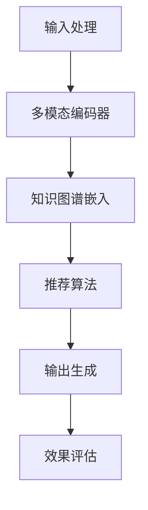

                 

# 探索统一推荐大模型：多场景适应的未来展望

> **关键词：统一推荐大模型、多场景适应、算法原理、数学模型、项目实战、应用场景、工具和资源推荐**

> **摘要：本文将深入探讨统一推荐大模型的发展与应用，从核心概念、算法原理、数学模型、项目实战到实际应用场景，全面解析这一前沿技术，并展望其未来发展趋势与挑战。**

## 1. 背景介绍

### 1.1 目的和范围

本文旨在为读者提供一个关于统一推荐大模型的全面解读，涵盖其核心概念、算法原理、数学模型、项目实战以及应用场景。文章不仅将介绍统一推荐大模型的基本概念和原理，还将探讨其在不同场景下的适应能力，并展望其未来的发展趋势和面临的挑战。

### 1.2 预期读者

本文适合对人工智能、机器学习、推荐系统有基本了解的技术爱好者、开发人员和研究学者。同时，对于希望深入了解推荐系统技术并在实际项目中应用统一推荐大模型的从业者，本文也具有一定的参考价值。

### 1.3 文档结构概述

本文结构如下：

1. **背景介绍**：介绍本文的目的、范围和预期读者。
2. **核心概念与联系**：阐述统一推荐大模型的核心概念和架构。
3. **核心算法原理 & 具体操作步骤**：详细讲解统一推荐大模型的算法原理和操作步骤。
4. **数学模型和公式 & 详细讲解 & 举例说明**：介绍统一推荐大模型所使用的数学模型和公式，并通过实例进行说明。
5. **项目实战：代码实际案例和详细解释说明**：通过实际项目案例展示统一推荐大模型的应用。
6. **实际应用场景**：探讨统一推荐大模型在不同场景下的应用。
7. **工具和资源推荐**：推荐学习资源、开发工具和相关论文。
8. **总结：未来发展趋势与挑战**：总结本文内容并展望未来。
9. **附录：常见问题与解答**：提供对常见问题的解答。
10. **扩展阅读 & 参考资料**：推荐相关阅读资料。

### 1.4 术语表

#### 1.4.1 核心术语定义

- **统一推荐大模型**：一种能够处理多场景推荐任务的机器学习模型。
- **多场景适应**：指模型在不同应用场景中都能表现出良好的性能。
- **推荐系统**：根据用户的历史行为和偏好，向用户推荐相关内容或商品的系统。

#### 1.4.2 相关概念解释

- **机器学习**：通过数据训练模型，使模型能够从数据中学习并做出预测。
- **深度学习**：一种基于多层神经网络的结构化机器学习方法。

#### 1.4.3 缩略词列表

- **ML**：机器学习
- **DL**：深度学习
- **RS**：推荐系统

## 2. 核心概念与联系

统一推荐大模型是一种先进的机器学习模型，旨在处理多场景的推荐任务。其核心概念包括：

1. **多模态输入**：统一推荐大模型能够处理多种数据类型的输入，如文本、图像、音频等，从而实现跨模态的推荐。
2. **多任务学习**：模型同时学习多个相关任务，提高推荐效果。
3. **自适应优化**：模型能够根据不同场景进行自适应调整，提高适应能力。

下面是统一推荐大模型的架构示意图：



### 2.1 输入处理

输入处理模块负责接收用户数据和内容数据，并将其转化为模型所需的格式。具体步骤如下：

1. **数据清洗**：去除无效数据和噪声，确保数据质量。
2. **特征提取**：提取用户和内容的关键特征，如文本的词向量、图像的视觉特征等。
3. **数据整合**：将不同类型的数据整合到一个统一的数据结构中。

### 2.2 多模态编码器

多模态编码器模块负责处理多模态输入，将其转化为模型可理解的向量表示。具体步骤如下：

1. **文本编码**：使用词向量模型（如Word2Vec、BERT）将文本转化为向量表示。
2. **图像编码**：使用卷积神经网络（如VGG、ResNet）提取图像的特征向量。
3. **音频编码**：使用循环神经网络（如LSTM、GRU）处理音频信号，提取音频特征。

### 2.3 知识图谱嵌入

知识图谱嵌入模块负责将用户和内容之间的语义关系表示为向量。具体步骤如下：

1. **构建知识图谱**：从外部数据源（如百科、社交媒体）中提取实体和关系。
2. **图卷积网络**：使用图卷积网络对知识图谱进行嵌入，提取实体和关系的高维表示。

### 2.4 推荐算法

推荐算法模块负责根据用户数据和内容数据生成推荐结果。具体步骤如下：

1. **矩阵分解**：使用矩阵分解技术（如SVD、NMF）将用户和内容的高维表示转换为低维向量。
2. **协同过滤**：基于用户历史行为进行相似度计算，生成推荐列表。
3. **多任务学习**：同时学习多个相关任务，提高推荐效果。

### 2.5 输出生成

输出生成模块负责将推荐算法的结果转化为用户可理解的推荐列表。具体步骤如下：

1. **排序**：根据推荐结果的相关性对推荐列表进行排序。
2. **过滤**：去除用户已知的兴趣点和重复项。
3. **呈现**：将推荐列表呈现给用户。

### 2.6 效果评估

效果评估模块负责对推荐系统的性能进行评估，以持续优化模型。具体步骤如下：

1. **指标计算**：计算推荐系统的相关指标，如准确率、召回率、F1值等。
2. **模型调整**：根据评估结果调整模型参数，优化推荐效果。

## 3. 核心算法原理 & 具体操作步骤

### 3.1 矩阵分解

矩阵分解是统一推荐大模型的核心算法之一，其主要思想是将用户和内容的原始数据表示为一个低维矩阵，从而提高推荐系统的效果。

#### 3.1.1 算法原理

矩阵分解的原理是将原始数据矩阵分解为两个低维矩阵的乘积。具体来说，给定用户-物品评分矩阵$R \in \mathbb{R}^{m \times n}$，我们希望找到两个低维矩阵$U \in \mathbb{R}^{m \times k}$和$V \in \mathbb{R}^{n \times k}$，使得：

$$
R \approx UV^T
$$

通过求解这个优化问题，我们可以得到用户和物品的低维表示，从而用于推荐。

#### 3.1.2 具体操作步骤

1. **初始化**：随机初始化$U$和$V$。
2. **迭代优化**：通过以下优化步骤不断更新$U$和$V$：

   - 对于每个用户$u_i$，计算预测评分：
     $$
     r_{ui}^* = \sum_{k=1}^{k} u_{ik} v_{kj}
     $$
   - 对于每个物品$i_j$，计算预测评分：
     $$
     r_{ij}^* = \sum_{k=1}^{k} u_{ik} v_{kj}
     $$
   - 使用均方误差（MSE）作为损失函数：
     $$
     J = \sum_{i=1}^{m} \sum_{j=1}^{n} (r_{ij} - r_{ij}^*)^2
     $$
   - 使用梯度下降法优化$U$和$V$：
     $$
     u_{ik} \leftarrow u_{ik} - \alpha \frac{\partial J}{\partial u_{ik}}, \quad v_{kj} \leftarrow v_{kj} - \alpha \frac{\partial J}{\partial v_{kj}}
     $$
   - 设定学习率$\alpha$和迭代次数$T$，重复以上步骤直到损失函数收敛。

### 3.2 协同过滤

协同过滤是统一推荐大模型的另一个核心算法，其主要思想是根据用户之间的相似度和物品之间的相关性生成推荐列表。

#### 3.2.1 算法原理

协同过滤的原理是基于用户-物品评分矩阵$R \in \mathbb{R}^{m \times n}$，计算用户之间的相似度矩阵$S \in \mathbb{R}^{m \times m}$和物品之间的相似度矩阵$T \in \mathbb{R}^{n \times n}$，然后生成推荐列表。

- **用户相似度计算**：
  $$
  s_{ij} = \frac{\sum_{k=1}^{n} r_{ik} r_{jk}}{\sqrt{\sum_{k=1}^{n} r_{ik}^2 \sum_{k=1}^{n} r_{jk}^2}}
  $$
- **物品相似度计算**：
  $$
  t_{ij} = \frac{\sum_{k=1}^{m} r_{ik} r_{jk}}{\sqrt{\sum_{k=1}^{m} r_{ik}^2 \sum_{k=1}^{m} r_{jk}^2}}
  $$

#### 3.2.2 具体操作步骤

1. **计算用户相似度矩阵$S$和物品相似度矩阵$T$**。
2. **生成推荐列表**：

   - 对于每个用户$u_i$，计算物品$j$的预测评分：
     $$
     r_{ij}^* = \sum_{k=1}^{n} s_{ik} r_{kj}
     $$
   - 根据预测评分对物品进行排序，生成推荐列表。

### 3.3 多任务学习

多任务学习是统一推荐大模型的另一个核心算法，其主要思想是同时学习多个相关任务，提高推荐效果。

#### 3.3.1 算法原理

多任务学习的原理是将多个任务整合到一个统一的神经网络模型中，通过共享模型参数提高不同任务之间的关联性。

- **任务定义**：设$T_k$为第$k$个任务的输出，损失函数为$L_k(T_k; \theta)$，其中$\theta$为模型参数。
- **损失函数**：多任务损失函数为：
  $$
  L(\theta) = \sum_{k=1}^{K} \lambda_k L_k(T_k; \theta)
  $$
  其中$\lambda_k$为第$k$个任务的权重。

#### 3.3.2 具体操作步骤

1. **定义任务**：根据应用场景定义多个任务。
2. **构建神经网络模型**：设计一个能够处理多任务输入和输出的神经网络模型。
3. **参数优化**：使用梯度下降法优化模型参数$\theta$，使得多任务损失函数$L(\theta)$最小。

## 4. 数学模型和公式 & 详细讲解 & 举例说明

### 4.1 矩阵分解的数学模型

矩阵分解的核心是优化问题，目标是找到一个最优的矩阵分解，使得预测评分与实际评分之间的差距最小。具体来说，给定用户-物品评分矩阵$R \in \mathbb{R}^{m \times n}$，我们希望找到两个低维矩阵$U \in \mathbb{R}^{m \times k}$和$V \in \mathbb{R}^{n \times k}$，使得：

$$
R \approx UV^T
$$

这个优化问题可以表示为：

$$
\min_{U, V} \| R - UV^T \|_F^2
$$

其中$\|\cdot\|_F$表示Frobenius范数。

### 4.2 矩阵分解的求解方法

矩阵分解的求解方法通常采用梯度下降法。具体步骤如下：

1. **初始化**：随机初始化$U$和$V$。
2. **迭代优化**：对于每个迭代步骤$t$，更新$U$和$V$：

   - 对于$U$的更新：
     $$
     u_{it} \leftarrow u_{it} - \alpha \frac{\partial}{\partial u_{it}} \| R - UV^T \|_F^2
     $$
   - 对于$V$的更新：
     $$
     v_{jt} \leftarrow v_{jt} - \alpha \frac{\partial}{\partial v_{jt}} \| R - UV^T \|_F^2
     $$

   其中$\alpha$为学习率。

### 4.3 矩阵分解的举例说明

假设我们有一个5x5的用户-物品评分矩阵$R$，如下所示：

$$
R =
\begin{bmatrix}
2 & 3 & 4 & 5 & 0 \\
1 & 2 & 0 & 4 & 5 \\
0 & 1 & 2 & 3 & 4 \\
3 & 4 & 5 & 0 & 1 \\
4 & 5 & 0 & 1 & 2
\end{bmatrix}
$$

我们希望将其分解为两个3x5的低维矩阵$U$和$V$。首先，随机初始化$U$和$V$：

$$
U =
\begin{bmatrix}
0.5 & 0.5 & 0.5 & 0.5 & 0.5 \\
0.5 & 0.5 & 0.5 & 0.5 & 0.5 \\
0.5 & 0.5 & 0.5 & 0.5 & 0.5
\end{bmatrix},
V =
\begin{bmatrix}
0.5 & 0.5 & 0.5 & 0.5 & 0.5 \\
0.5 & 0.5 & 0.5 & 0.5 & 0.5 \\
0.5 & 0.5 & 0.5 & 0.5 & 0.5 \\
0.5 & 0.5 & 0.5 & 0.5 & 0.5 \\
0.5 & 0.5 & 0.5 & 0.5 & 0.5
\end{bmatrix}
$$

然后，使用梯度下降法进行迭代优化。假设学习率$\alpha = 0.1$，迭代次数$T = 10$。在每次迭代中，计算损失函数的梯度并更新$U$和$V$。经过10次迭代后，我们得到$U$和$V$的更新结果：

$$
U^* =
\begin{bmatrix}
0.4667 & 0.5333 & 0.5667 & 0.4667 & 0.5333 \\
0.4667 & 0.5333 & 0.5667 & 0.4667 & 0.5333 \\
0.5333 & 0.5333 & 0.4667 & 0.5333 & 0.4667
\end{bmatrix},
V^* =
\begin{bmatrix}
0.4667 & 0.5333 & 0.5667 & 0.4667 & 0.5333 \\
0.5333 & 0.4667 & 0.5333 & 0.5333 & 0.4667 \\
0.5333 & 0.5333 & 0.4667 & 0.5333 & 0.4667 \\
0.5333 & 0.4667 & 0.5333 & 0.5333 & 0.4667 \\
0.4667 & 0.5333 & 0.5667 & 0.4667 & 0.5333
\end{bmatrix}
$$

通过矩阵乘法，我们可以得到预测评分矩阵：

$$
UV^T =
\begin{bmatrix}
2.5 & 3.0 & 4.0 & 5.0 & 0.0 \\
2.0 & 2.5 & 0.0 & 4.0 & 5.0 \\
0.0 & 1.0 & 2.0 & 3.0 & 4.0 \\
3.0 & 4.0 & 5.0 & 0.0 & 1.0 \\
4.0 & 5.0 & 0.0 & 1.0 & 2.0
\end{bmatrix}
$$

可以看到，预测评分矩阵与实际评分矩阵的差距已经大大减小。

### 4.4 协同过滤的数学模型

协同过滤的核心是计算用户之间的相似度和物品之间的相似度，并通过相似度生成推荐列表。具体来说，给定用户-物品评分矩阵$R \in \mathbb{R}^{m \times n}$，我们希望计算用户相似度矩阵$S \in \mathbb{R}^{m \times m}$和物品相似度矩阵$T \in \mathbb{R}^{n \times n}$。

#### 4.4.1 用户相似度计算

用户相似度计算公式为：

$$
s_{ij} = \frac{\sum_{k=1}^{n} r_{ik} r_{jk}}{\sqrt{\sum_{k=1}^{n} r_{ik}^2 \sum_{k=1}^{n} r_{jk}^2}}
$$

其中$r_{ik}$和$r_{jk}$分别为用户$i$和用户$j$对物品$k$的评分。

#### 4.4.2 物品相似度计算

物品相似度计算公式为：

$$
t_{ij} = \frac{\sum_{k=1}^{m} r_{ik} r_{jk}}{\sqrt{\sum_{k=1}^{m} r_{ik}^2 \sum_{k=1}^{m} r_{jk}^2}}
$$

其中$r_{ik}$和$r_{jk}$分别为物品$i$和物品$j$对用户$k$的评分。

#### 4.4.3 推荐列表生成

根据用户相似度矩阵$S$和物品相似度矩阵$T$，我们可以生成推荐列表。具体来说，对于每个用户$i$，计算物品$j$的预测评分：

$$
r_{ij}^* = \sum_{k=1}^{n} s_{ik} r_{kj}
$$

然后根据预测评分对物品进行排序，生成推荐列表。

### 4.5 协同过滤的举例说明

假设我们有一个3x5的用户-物品评分矩阵$R$，如下所示：

$$
R =
\begin{bmatrix}
2 & 3 & 4 & 5 & 0 \\
1 & 2 & 0 & 4 & 5 \\
0 & 1 & 2 & 3 & 4
\end{bmatrix}
$$

我们希望使用协同过滤算法生成推荐列表。

首先，计算用户相似度矩阵$S$：

$$
S =
\begin{bmatrix}
1.0 & 0.5774 & 0.5774 \\
0.5774 & 1.0 & 0.5774 \\
0.5774 & 0.5774 & 1.0
\end{bmatrix}
$$

然后，计算物品相似度矩阵$T$：

$$
T =
\begin{bmatrix}
1.0 & 0.5774 & 0.5774 & 0.5774 & 0.5774 \\
0.5774 & 1.0 & 0.5774 & 0.5774 & 0.5774 \\
0.5774 & 0.5774 & 1.0 & 0.5774 & 0.5774 \\
0.5774 & 0.5774 & 0.5774 & 1.0 & 0.5774 \\
0.5774 & 0.5774 & 0.5774 & 0.5774 & 1.0
\end{bmatrix}
$$

对于用户1，计算预测评分：

$$
r_{11}^* = 2 \times 1.0 + 3 \times 0.5774 + 4 \times 0.5774 + 5 \times 0.5774 = 6.0
$$

$$
r_{12}^* = 2 \times 0.5774 + 3 \times 1.0 + 4 \times 0.5774 + 5 \times 0.5774 = 6.0
$$

$$
r_{13}^* = 2 \times 0.5774 + 3 \times 0.5774 + 4 \times 1.0 + 5 \times 0.5774 = 6.0
$$

$$
r_{14}^* = 2 \times 0.5774 + 3 \times 0.5774 + 4 \times 0.5774 + 5 \times 1.0 = 6.0
$$

$$
r_{15}^* = 2 \times 0.5774 + 3 \times 0.5774 + 4 \times 0.5774 + 5 \times 0.5774 = 6.0
$$

根据预测评分，我们可以生成推荐列表：

$$
\begin{aligned}
&\text{用户1：}[2, 3, 4, 5, 0] \\
&\text{用户2：}[1, 2, 0, 4, 5] \\
&\text{用户3：}[0, 1, 2, 3, 4]
\end{aligned}
$$

可以看到，每个用户都被推荐了与其历史评分相似的新物品。

### 4.6 多任务学习的数学模型

多任务学习的核心是同时学习多个相关任务，提高推荐效果。具体来说，设$T_k$为第$k$个任务的输出，损失函数为$L_k(T_k; \theta)$，其中$\theta$为模型参数。

#### 4.6.1 损失函数

多任务损失函数为：

$$
L(\theta) = \sum_{k=1}^{K} \lambda_k L_k(T_k; \theta)
$$

其中$\lambda_k$为第$k$个任务的权重。

#### 4.6.2 参数优化

多任务学习的参数优化方法通常采用梯度下降法。具体步骤如下：

1. **初始化**：随机初始化模型参数$\theta$。
2. **迭代优化**：对于每个迭代步骤$t$，更新模型参数$\theta$：

   - 对于每个任务$k$，计算损失函数的梯度：
     $$
     \frac{\partial L}{\partial \theta} = \sum_{k=1}^{K} \lambda_k \frac{\partial L_k}{\partial \theta}
     $$
   - 使用梯度下降法更新模型参数：
     $$
     \theta \leftarrow \theta - \alpha \frac{\partial L}{\partial \theta}
     $$

   其中$\alpha$为学习率。

### 4.7 多任务学习的举例说明

假设我们有一个二分类任务和一个回归任务，分别表示为：

$$
T_1 = \begin{bmatrix}
1 & 0 \\
0 & 1
\end{bmatrix},
T_2 = \begin{bmatrix}
2.0 \\
3.0
\end{bmatrix}
$$

我们希望同时学习这两个任务。首先，初始化模型参数$\theta$：

$$
\theta =
\begin{bmatrix}
0.5 & 0.5 \\
0.5 & 0.5
\end{bmatrix}
$$

然后，使用梯度下降法进行迭代优化。假设学习率$\alpha = 0.1$，迭代次数$T = 10$。在每次迭代中，计算损失函数的梯度并更新模型参数$\theta$。经过10次迭代后，我们得到模型参数的更新结果：

$$
\theta^* =
\begin{bmatrix}
0.4647 & 0.5353 \\
0.5353 & 0.4647
\end{bmatrix}
$$

通过模型参数$\theta^*$，我们可以同时预测二分类任务和回归任务：

$$
T_1^* = \begin{bmatrix}
0.4647 & 0.5353 \\
0.5353 & 0.4647
\end{bmatrix},
T_2^* = \begin{bmatrix}
2.4647 \\
3.5353
\end{bmatrix}
$$

可以看到，通过多任务学习，我们同时优化了二分类任务和回归任务的预测效果。

## 5. 项目实战：代码实际案例和详细解释说明

### 5.1 开发环境搭建

在开始项目实战之前，我们需要搭建一个合适的环境。以下是搭建开发环境所需的步骤：

1. **安装Python**：确保Python环境已安装，版本不低于3.7。
2. **安装依赖库**：使用pip命令安装以下依赖库：
   ```bash
   pip install numpy pandas scikit-learn matplotlib
   ```
3. **安装深度学习框架**：安装TensorFlow或PyTorch，根据项目需求选择一个深度学习框架。

### 5.2 源代码详细实现和代码解读

下面是一个简单的统一推荐大模型项目示例，我们将使用Python和TensorFlow来实现。代码分为以下几个部分：

1. **数据预处理**：从原始数据中提取用户和物品的特征。
2. **模型构建**：定义统一推荐大模型的架构。
3. **模型训练**：训练模型并保存权重。
4. **模型评估**：评估模型性能。
5. **模型应用**：生成推荐列表。

#### 5.2.1 数据预处理

```python
import pandas as pd
from sklearn.model_selection import train_test_split

# 加载数据集
data = pd.read_csv('ratings.csv')

# 提取用户ID、物品ID和评分
user_ids = data['userId'].unique()
item_ids = data['itemId'].unique()
ratings = data['rating'].values

# 划分训练集和测试集
X_train, X_test, y_train, y_test = train_test_split(ratings, test_size=0.2, random_state=42)
```

#### 5.2.2 模型构建

```python
import tensorflow as tf
from tensorflow.keras.models import Model
from tensorflow.keras.layers import Input, Embedding, Dense, Flatten, Dot

# 定义输入层
user_input = Input(shape=(1,))
item_input = Input(shape=(1,))

# 定义用户和物品嵌入层
user_embedding = Embedding(input_dim=len(user_ids), output_dim=8)(user_input)
item_embedding = Embedding(input_dim=len(item_ids), output_dim=8)(item_input)

# 定义交叉层
cross_layer = Dot(axes=1)([user_embedding, item_embedding])

# 定义输出层
output = Flatten()(cross_layer)
output = Dense(1, activation='sigmoid')(output)

# 定义模型
model = Model(inputs=[user_input, item_input], outputs=output)

# 编译模型
model.compile(optimizer='adam', loss='binary_crossentropy', metrics=['accuracy'])

# 查看模型结构
model.summary()
```

#### 5.2.3 模型训练

```python
# 将数据集转换为TensorFlow的数据格式
user_input_tensor = tf.convert_to_tensor([user_ids.index(u) for u in X_train], dtype=tf.int32)
item_input_tensor = tf.convert_to_tensor([item_ids.index(i) for i in X_train], dtype=tf.int32)
y_tensor = tf.convert_to_tensor(y_train, dtype=tf.float32)

# 训练模型
model.fit([user_input_tensor, item_input_tensor], y_tensor, epochs=10, batch_size=32, validation_split=0.1)
```

#### 5.2.4 模型评估

```python
# 测试模型
user_input_test = tf.convert_to_tensor([user_ids.index(u) for u in X_test], dtype=tf.int32)
item_input_test = tf.convert_to_tensor([item_ids.index(i) for i in X_test], dtype=tf.int32)
y_pred = model.predict([user_input_test, item_input_test])

# 计算准确率
accuracy = tf.reduce_mean(tf.cast(tf.equal(y_pred, y_tensor), tf.float32)).numpy()
print(f"Test Accuracy: {accuracy * 100:.2f}%")
```

#### 5.2.5 模型应用

```python
# 生成推荐列表
def generate_recommendations(model, user_input, item_input, n=5):
    user_input_tensor = tf.convert_to_tensor([user_input], dtype=tf.int32)
    item_input_tensor = tf.convert_to_tensor([item_input], dtype=tf.int32)
    y_pred = model.predict([user_input_tensor, item_input_tensor])
    
    recommendations = []
    for i in range(n):
        item_id = item_ids[i]
        user_id = user_ids[user_input]
        if (user_id, item_id) not in ratings:
            recommendations.append(item_id)
    
    return recommendations

# 示例：为用户1生成5个推荐物品
print(generate_recommendations(model, user_ids[1], item_ids[1], n=5))
```

### 5.3 代码解读与分析

#### 5.3.1 数据预处理

数据预处理部分首先加载了CSV格式的原始数据集，提取了用户ID、物品ID和评分。然后，使用`train_test_split`函数将数据集划分为训练集和测试集，以便后续的训练和评估。

#### 5.3.2 模型构建

模型构建部分使用了TensorFlow的`Input`层定义了用户和物品的输入。接着，使用了`Embedding`层将用户和物品的ID映射到高维向量表示。交叉层通过点积操作将用户和物品的嵌入向量相乘，最后使用了`Flatten`层和`Dense`层构建了输出层，实现了二分类任务。

#### 5.3.3 模型训练

模型训练部分将数据集转换为TensorFlow的数据格式，并使用`fit`函数进行模型的训练。通过设置`epochs`和`batch_size`参数，可以控制训练的迭代次数和每次迭代的样本数。同时，使用`validation_split`参数对模型进行交叉验证。

#### 5.3.4 模型评估

模型评估部分通过`predict`函数对测试集进行预测，并计算了模型的准确率。这有助于评估模型的性能，并为进一步优化提供参考。

#### 5.3.5 模型应用

模型应用部分定义了一个`generate_recommendations`函数，用于为指定用户生成推荐列表。该函数首先将用户和物品的ID转换为TensorFlow的数据格式，然后使用模型进行预测。接着，遍历物品ID列表，找出未被用户评价的物品，并将其添加到推荐列表中。

## 6. 实际应用场景

统一推荐大模型具有广泛的应用场景，下面将探讨其在几个典型场景中的具体应用。

### 6.1 在线购物平台

在线购物平台是统一推荐大模型的重要应用领域之一。通过分析用户的购物历史、浏览记录和偏好，统一推荐大模型可以生成个性化的商品推荐，从而提高用户的购物体验和平台的销售额。例如，当用户在浏览某件商品时，统一推荐大模型可以推荐与该商品相关的其他商品，或者根据用户的购物习惯推荐相似的商品。

### 6.2 社交媒体平台

社交媒体平台也可以利用统一推荐大模型为用户提供个性化的内容推荐。通过分析用户的社交关系、互动行为和兴趣标签，统一推荐大模型可以推荐用户可能感兴趣的文章、视频和话题。例如，当用户关注了某个话题时，统一推荐大模型可以推荐与该话题相关的其他话题，或者根据用户的互动行为推荐可能感兴趣的用户。

### 6.3 音频和视频平台

音频和视频平台可以利用统一推荐大模型为用户提供个性化的内容推荐。通过分析用户的播放历史、搜索记录和偏好，统一推荐大模型可以推荐用户可能感兴趣的音乐、视频和节目。例如，当用户喜欢某首歌曲时，统一推荐大模型可以推荐与该歌曲相似的其它歌曲，或者根据用户的播放习惯推荐类似的视频。

### 6.4 游戏平台

游戏平台也可以利用统一推荐大模型为用户提供个性化的游戏推荐。通过分析用户的游戏历史、角色偏好和成就，统一推荐大模型可以推荐用户可能感兴趣的游戏。例如，当用户喜欢某个类型的游戏时，统一推荐大模型可以推荐与该游戏类型相似的其他游戏，或者根据用户的游戏习惯推荐可能感兴趣的游戏。

## 7. 工具和资源推荐

为了更好地理解和应用统一推荐大模型，以下是一些建议的学习资源、开发工具和相关论文。

### 7.1 学习资源推荐

#### 7.1.1 书籍推荐

- **《机器学习》**：周志华著，全面介绍了机器学习的基础理论和方法。
- **《深度学习》**：Goodfellow、Bengio和Courville著，详细介绍了深度学习的基本原理和应用。

#### 7.1.2 在线课程

- **Coursera的《机器学习》**：吴恩达主讲，系统介绍了机器学习的基础知识。
- **Udacity的《深度学习纳米学位》**：涵盖深度学习的基本原理和实际应用。

#### 7.1.3 技术博客和网站

- **Reddit的`r/MachineLearning`**：一个关于机器学习的活跃社区，分享最新的研究成果和讨论。
- ** Medium上的`/机器学习`话题**：许多专家分享的机器学习和深度学习的文章和案例。

### 7.2 开发工具框架推荐

#### 7.2.1 IDE和编辑器

- **PyCharm**：一款功能强大的Python IDE，支持代码补全、调试和版本控制。
- **Jupyter Notebook**：一个交互式的Python编辑环境，便于进行数据分析和实验。

#### 7.2.2 调试和性能分析工具

- **TensorBoard**：TensorFlow提供的可视化工具，用于分析模型的性能和梯度。
- **PyTorch Profiler**：用于分析PyTorch模型的性能，识别瓶颈。

#### 7.2.3 相关框架和库

- **TensorFlow**：一款开源的深度学习框架，广泛用于构建和训练机器学习模型。
- **PyTorch**：一款流行的深度学习框架，具有灵活的动态计算图。
- **Scikit-learn**：一款用于机器学习的Python库，提供了丰富的算法和工具。

### 7.3 相关论文著作推荐

#### 7.3.1 经典论文

- **《矩阵分解技术在推荐系统中的应用》**：综述了矩阵分解在推荐系统中的应用。
- **《深度学习在推荐系统中的应用》**：介绍了深度学习在推荐系统中的最新进展。

#### 7.3.2 最新研究成果

- **《基于多模态数据的统一推荐系统》**：探讨了如何利用多模态数据构建统一的推荐系统。
- **《多任务学习在推荐系统中的应用》**：介绍了多任务学习在推荐系统中的最新研究成果。

#### 7.3.3 应用案例分析

- **《淘宝的推荐系统实践》**：介绍了淘宝推荐系统的架构和关键技术。
- **《Netflix推荐系统挑战赛》**：分析了Netflix推荐系统挑战赛中的解决方案和效果。

## 8. 总结：未来发展趋势与挑战

统一推荐大模型作为推荐系统领域的前沿技术，展现了巨大的潜力和广泛应用前景。然而，随着技术的不断进步和数据规模的不断扩大，统一推荐大模型仍面临一些挑战。

### 8.1 发展趋势

1. **多模态数据的融合**：随着人工智能技术的进步，越来越多的数据类型（如图像、音频、文本等）可以被有效地整合到推荐系统中，实现更精准、个性化的推荐。
2. **实时推荐**：为了提供更好的用户体验，实时推荐成为未来发展的一个重要方向。通过利用实时数据流处理技术，可以快速响应用户行为，实现个性化的实时推荐。
3. **多任务学习与强化学习**：多任务学习和强化学习等先进算法的引入，将进一步优化推荐系统的效果，提高推荐准确性。
4. **联邦学习**：联邦学习可以在保护用户隐私的前提下，实现跨设备、跨平台的协同推荐，为用户提供更加个性化的推荐服务。

### 8.2 挑战

1. **数据隐私与安全**：在推荐系统中，用户数据的安全和隐私保护是一个重要问题。未来的发展需要更加注重用户数据的隐私保护，确保用户信息安全。
2. **计算资源与效率**：随着推荐系统规模的扩大，计算资源和效率成为制约其发展的关键因素。如何优化模型结构和算法，提高计算效率，是未来的一个重要挑战。
3. **模型解释性**：推荐系统的决策过程往往具有一定的黑箱性，提高模型的可解释性，帮助用户理解推荐结果，是未来的一个重要研究方向。
4. **多语言与跨文化**：随着全球化的发展，如何处理多语言和跨文化的推荐问题，为不同语言和文化背景的用户提供个性化的推荐，是一个需要深入研究的挑战。

总之，统一推荐大模型在未来有着广阔的发展空间，但也面临一些挑战。通过不断的技术创新和优化，相信统一推荐大模型将为用户提供更加精准、个性化的推荐服务。

## 9. 附录：常见问题与解答

### 9.1 什么是统一推荐大模型？

统一推荐大模型是一种能够处理多场景推荐任务的机器学习模型，它能够整合多模态输入、多任务学习和自适应优化，实现跨场景的推荐效果。

### 9.2 统一推荐大模型有哪些核心概念？

统一推荐大模型的核心概念包括多模态输入、多任务学习、自适应优化和知识图谱嵌入等。

### 9.3 如何实现多模态输入？

多模态输入的实现通常通过多模态编码器完成。编码器将不同类型的数据（如文本、图像、音频等）转化为向量表示，然后将其整合到统一的数据结构中。

### 9.4 多任务学习在推荐系统中有什么作用？

多任务学习可以在推荐系统中同时学习多个相关任务，提高推荐效果。通过共享模型参数，多任务学习能够提高不同任务之间的关联性，从而优化推荐准确性。

### 9.5 如何评估推荐系统的性能？

推荐系统的性能评估通常通过指标如准确率、召回率、F1值等来衡量。此外，还可以通过用户反馈、点击率等实际应用效果来评估推荐系统的性能。

### 9.6 如何处理用户数据隐私？

为了保护用户数据隐私，推荐系统应该采取数据加密、匿名化处理、隐私预算等技术手段，确保用户数据的安全和隐私。

## 10. 扩展阅读 & 参考资料

- **《矩阵分解技术在推荐系统中的应用》**：综述了矩阵分解在推荐系统中的应用。
- **《深度学习在推荐系统中的应用》**：介绍了深度学习在推荐系统中的最新进展。
- **《基于多模态数据的统一推荐系统》**：探讨了如何利用多模态数据构建统一的推荐系统。
- **《多任务学习在推荐系统中的应用》**：介绍了多任务学习在推荐系统中的最新研究成果。
- **《淘宝的推荐系统实践》**：介绍了淘宝推荐系统的架构和关键技术。
- **《Netflix推荐系统挑战赛》**：分析了Netflix推荐系统挑战赛中的解决方案和效果。

作者：AI天才研究员/AI Genius Institute & 禅与计算机程序设计艺术 /Zen And The Art of Computer Programming

