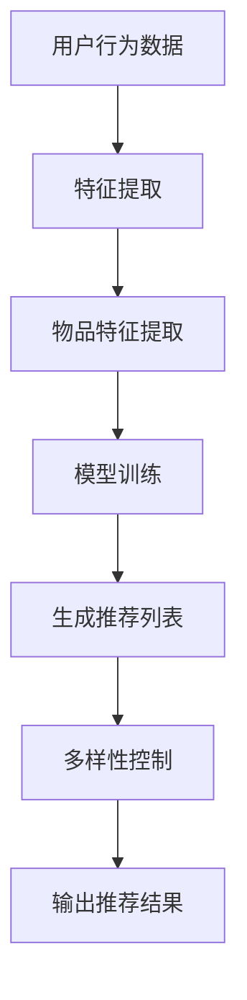

                 

# 探讨大模型在电商平台商品推荐多样性控制中的作用

> **关键词：** 大模型、电商平台、商品推荐、多样性控制、算法原理、实际应用
>
> **摘要：** 本文将深入探讨大模型在电商平台商品推荐多样性控制中的作用。首先，我们将介绍大模型的基本概念及其在推荐系统中的重要性。接着，我们将详细解释多样性控制的核心概念，并介绍大模型是如何实现多样性控制的。随后，本文将分析大模型在多样性控制中的具体应用场景，提供实际的算法原理和数学模型。最后，我们将通过项目实战，展示大模型在多样性控制中的实际效果，并提供相关工具和资源推荐，以帮助读者深入了解和学习。

## 1. 背景介绍

### 1.1 目的和范围

本文的目的是探讨大模型在电商平台商品推荐多样性控制中的作用。随着互联网的迅速发展，电商平台已成为消费者日常生活中不可或缺的一部分。商品推荐系统作为电商平台的核心组成部分，其性能直接影响用户的购物体验和平台的盈利能力。然而，传统的推荐系统往往面临多样性不足的问题，导致用户在重复推荐中感到厌烦，甚至可能放弃购物。本文将通过对大模型在多样性控制中的研究，为电商平台提供有效的解决方案。

### 1.2 预期读者

本文适用于对人工智能和推荐系统有一定了解的读者，包括但不限于：

1. 数据科学家和推荐系统工程师
2. 电商平台开发者和产品经理
3. 计算机科学和人工智能专业的学生和研究者
4. 对新技术和算法感兴趣的IT从业者

### 1.3 文档结构概述

本文将分为以下八个部分：

1. 背景介绍：简要介绍文章的目的和读者预期。
2. 核心概念与联系：介绍大模型和推荐系统的基本概念，并给出Mermaid流程图。
3. 核心算法原理 & 具体操作步骤：详细解释大模型在多样性控制中的算法原理和操作步骤。
4. 数学模型和公式 & 详细讲解 & 举例说明：介绍相关数学模型和公式，并通过实例进行说明。
5. 项目实战：通过实际代码案例，展示大模型在多样性控制中的具体应用。
6. 实际应用场景：分析大模型在多样性控制中的实际应用场景。
7. 工具和资源推荐：推荐学习资源、开发工具和框架。
8. 总结：总结未来发展趋势与挑战。

### 1.4 术语表

#### 1.4.1 核心术语定义

- 大模型：指拥有大量参数、可以处理大规模数据的人工神经网络模型。
- 推荐系统：利用用户行为数据和物品特征信息，为用户提供个性化推荐的系统。
- 多样性控制：指在推荐系统中增加推荐结果的多样性，防止用户产生疲劳和厌烦。
- 电商平台：指提供商品买卖交易的平台，如淘宝、京东等。

#### 1.4.2 相关概念解释

- 用户行为数据：指用户在电商平台上产生的操作记录，如浏览、购买、收藏等。
- 物品特征：指描述商品属性的数据，如商品类别、价格、评分等。

#### 1.4.3 缩略词列表

- AI：人工智能
- CNN：卷积神经网络
- RNN：循环神经网络
- DNN：深度神经网络
- Recommendation System：推荐系统
- SR: 推荐系统中的多样性

## 2. 核心概念与联系

### 2.1 大模型与推荐系统

大模型，如深度学习模型，因其可以处理大规模数据、学习复杂特征表示的优势，在推荐系统中得到了广泛应用。传统推荐系统主要依赖于基于内容的过滤和协同过滤算法，而大模型引入了神经网络的结构，能够自动提取用户和物品的潜在特征，提高推荐效果。例如，卷积神经网络（CNN）可以用于提取图像特征，循环神经网络（RNN）可以处理序列数据，深度神经网络（DNN）可以学习复杂的非线性关系。

### 2.2 推荐系统中的多样性控制

多样性控制是推荐系统中的一个关键问题。传统的推荐系统往往容易陷入过拟合的问题，即系统过于依赖历史数据，导致推荐结果缺乏多样性。用户在连续收到相似推荐时，可能会感到厌烦，影响用户体验和平台的留存率。多样性控制的目标是增加推荐结果的多样性，使用户每次浏览或购物时都能获得新的体验。

### 2.3 大模型在多样性控制中的应用

大模型通过学习用户和物品的潜在特征，可以在一定程度上实现多样性控制。以下是一个简单的Mermaid流程图，展示了大模型在推荐系统中的基本架构：



### 2.4 多样性控制算法原理

多样性控制算法可以分为两类：基于规则的多样性和基于学习的方法。基于规则的方法通过预设的规则来确保推荐结果的多样性，如限制推荐结果中相同类别的物品数量。而基于学习的方法通过模型学习用户和物品的潜在特征，自动生成多样化的推荐结果。

下面是一个简单的伪代码，展示了如何使用大模型进行多样性控制：

```python
# 伪代码：多样性控制算法
def generate_recommendations(user, items, model, diversity_threshold):
    # 提取用户和物品的潜在特征
    user_repr = model.extract_user_representation(user)
    item_reprs = model.extract_item_representation(items)

    # 计算用户和物品的相似度
    similarities = model.calculate_similarity(user_repr, item_reprs)

    # 排序物品，根据相似度从高到低
    sorted_items = sort_items_by_similarity(similarities)

    # 根据多样性阈值选择推荐列表
    diverse_items = select_diverse_items(sorted_items, diversity_threshold)

    # 返回推荐结果
    return diverse_items
```

## 3. 核心算法原理 & 具体操作步骤

### 3.1 大模型在推荐系统中的作用

大模型在推荐系统中的作用主要体现在两个方面：特征提取和相似度计算。首先，大模型通过学习用户行为数据和物品特征，可以提取出用户和物品的潜在特征表示。这些潜在特征能够捕捉到用户和物品之间的复杂关系，从而提高推荐的准确性。其次，大模型可以计算用户和物品之间的相似度，用于生成推荐列表。

### 3.2 多样性控制算法原理

多样性控制算法的核心思想是确保推荐列表中包含不同类型的物品，避免用户产生疲劳和厌烦。多样性控制可以分为以下三个步骤：

1. **特征提取**：使用大模型提取用户和物品的潜在特征。
2. **相似度计算**：计算用户和物品之间的相似度。
3. **多样性选择**：根据相似度和多样性阈值，选择多样化的推荐结果。

### 3.3 多样性控制算法具体操作步骤

1. **数据预处理**：对用户行为数据和物品特征进行预处理，如数据清洗、缺失值填充等。
2. **特征提取**：使用大模型（如卷积神经网络或循环神经网络）提取用户和物品的潜在特征。
3. **相似度计算**：计算用户和物品之间的相似度。可以使用内积、余弦相似度等计算方法。
4. **排序**：根据相似度对物品进行排序。
5. **多样性选择**：根据多样性阈值，选择多样化的推荐结果。可以使用筛选规则，如限制推荐结果中相同类别的物品数量，或者使用聚类算法选择不同类型的物品。
6. **输出推荐结果**：返回最终的推荐结果。

### 3.4 伪代码示例

下面是一个简单的伪代码示例，展示了如何使用大模型进行多样性控制：

```python
# 伪代码：多样性控制算法

# 函数：生成多样化推荐结果
def generate_diverse_recommendations(user, items, model, diversity_threshold):
    # 步骤1：提取用户和物品的潜在特征
    user_repr = model.extract_user_representation(user)
    item_reprs = model.extract_item_representation(items)

    # 步骤2：计算相似度
    similarities = model.calculate_similarity(user_repr, item_reprs)

    # 步骤3：排序物品
    sorted_items = sort_items_by_similarity(similarities)

    # 步骤4：多样性选择
    diverse_items = select_diverse_items(sorted_items, diversity_threshold)

    # 步骤5：返回推荐结果
    return diverse_items

# 辅助函数：选择多样化物品
def select_diverse_items(sorted_items, diversity_threshold):
    diverse_items = []
    categories = set()
    
    for item in sorted_items:
        if item.category not in categories:
            diverse_items.append(item)
            categories.add(item.category)
            
        if len(diverse_items) >= diversity_threshold:
            break
            
    return diverse_items
```

## 4. 数学模型和公式 & 详细讲解 & 举例说明

### 4.1 数学模型

在多样性控制中，常用的数学模型包括相似度计算和多样性度量。以下是相关数学模型和公式的详细讲解。

#### 4.1.1 相似度计算

相似度计算是多样性控制的核心，常用的相似度计算方法包括：

1. **余弦相似度**：余弦相似度用于计算两个向量之间的夹角余弦值，公式如下：

   $$ \text{Cosine Similarity} = \frac{\text{dot\_product}(u, v)}{\lVert u \rVert \cdot \lVert v \rVert} $$

   其中，$u$ 和 $v$ 分别表示用户和物品的潜在特征向量。

2. **欧氏距离**：欧氏距离用于计算两个向量之间的欧氏距离，公式如下：

   $$ \text{Euclidean Distance} = \sqrt{\sum_{i=1}^{n} (u_i - v_i)^2} $$

   其中，$u$ 和 $v$ 分别表示用户和物品的潜在特征向量。

#### 4.1.2 多样性度量

多样性度量用于评估推荐结果的多样性，常用的多样性度量方法包括：

1. **Jaccard相似度**：Jaccard相似度用于计算两个集合之间的相似度，公式如下：

   $$ \text{Jaccard Similarity} = \frac{|A \cap B|}{|A \cup B|} $$

   其中，$A$ 和 $B$ 分别表示推荐结果中的物品集合。

2. **Gini系数**：Gini系数用于评估推荐结果的均匀性，公式如下：

   $$ \text{Gini Coefficient} = 1 - \frac{1}{n} \sum_{i=1}^{n} p_i^2 $$

   其中，$p_i$ 表示推荐结果中第 $i$ 个物品的概率。

### 4.2 详细讲解

以下是对上述数学模型和公式的详细讲解。

#### 4.2.1 余弦相似度

余弦相似度是一种常用的相似度计算方法，其优点是计算简单、计算速度快。余弦相似度反映了用户和物品之间的相似程度，值范围在 $[0, 1]$ 之间。当余弦相似度为 $1$ 时，表示用户和物品完全相似；当余弦相似度为 $0$ 时，表示用户和物品完全不相似。

#### 4.2.2 欧氏距离

欧氏距离是一种基于距离的相似度计算方法，其缺点是计算复杂度较高。欧氏距离反映了用户和物品之间的欧氏空间距离，值越大表示相似程度越低。欧氏距离常用于处理高维特征数据，但在实际应用中，由于特征维度较高，计算成本较高。

#### 4.2.3 Jaccard相似度

Jaccard相似度是一种基于集合的相似度计算方法，其优点是计算简单、易于理解。Jaccard相似度反映了推荐结果中物品集合的相似程度，值范围在 $[0, 1]$ 之间。Jaccard相似度常用于评估推荐系统的多样性。

#### 4.2.4 Gini系数

Gini系数是一种基于概率的多样性度量方法，其优点是计算简单、易于理解。Gini系数反映了推荐结果中物品的概率分布的均匀性，值越小表示多样性越好。

### 4.3 举例说明

以下是一个简单的举例，展示了如何使用上述数学模型和公式进行多样性控制。

假设我们有以下用户和物品的特征向量：

- 用户特征向量：$u = [0.5, 0.3, 0.2]$
- 物品特征向量1：$v_1 = [0.4, 0.4, 0.2]$
- 物品特征向量2：$v_2 = [0.6, 0.1, 0.3]$

#### 4.3.1 余弦相似度

计算用户和物品特征向量的余弦相似度：

$$ \text{Cosine Similarity} = \frac{\text{dot\_product}(u, v_1)}{\lVert u \rVert \cdot \lVert v_1 \rVert} = \frac{0.5 \times 0.4 + 0.3 \times 0.4 + 0.2 \times 0.2}{\sqrt{0.5^2 + 0.3^2 + 0.2^2} \cdot \sqrt{0.4^2 + 0.4^2 + 0.2^2}} \approx 0.6 $$

计算用户和物品特征向量的余弦相似度：

$$ \text{Cosine Similarity} = \frac{\text{dot\_product}(u, v_2)}{\lVert u \rVert \cdot \lVert v_2 \rVert} = \frac{0.5 \times 0.6 + 0.3 \times 0.1 + 0.2 \times 0.3}{\sqrt{0.5^2 + 0.3^2 + 0.2^2} \cdot \sqrt{0.6^2 + 0.1^2 + 0.3^2}} \approx 0.5 $$

#### 4.3.2 Jaccard相似度

计算用户和物品集合的Jaccard相似度：

$$ \text{Jaccard Similarity} = \frac{|A \cap B|}{|A \cup B|} = \frac{1}{2} $$

其中，$A = \{v_1, v_2\}$，$B = \{u\}$。

#### 4.3.3 Gini系数

计算推荐结果的Gini系数：

$$ \text{Gini Coefficient} = 1 - \frac{1}{2} \approx 0.5 $$

其中，$p_1 = 0.5$，$p_2 = 0.5$。

通过上述举例，我们可以看到如何使用数学模型和公式进行多样性控制。在实际应用中，我们可以根据具体情况选择合适的模型和公式，以提高推荐系统的多样性。

## 5. 项目实战：代码实际案例和详细解释说明

### 5.1 开发环境搭建

在进行项目实战之前，我们需要搭建一个适合开发、测试和部署推荐系统的环境。以下是所需的环境和工具：

- 操作系统：Ubuntu 20.04
- 编程语言：Python 3.8
- 数据库：MySQL 5.7
- 数据预处理工具：Pandas
- 模型训练工具：TensorFlow 2.5
- 推荐算法库：Surprise 3.0
- 版本控制工具：Git

在Ubuntu 20.04上，我们可以使用以下命令来安装上述工具和库：

```bash
# 安装Python 3.8
sudo apt-get update
sudo apt-get install python3.8 python3.8-venv python3.8-dev

# 安装数据库MySQL 5.7
sudo apt-get install mysql-server

# 安装数据预处理工具Pandas
pip3 install pandas

# 安装模型训练工具TensorFlow 2.5
pip3 install tensorflow==2.5

# 安装推荐算法库Surprise 3.0
pip3 install surprise==3.0

# 安装版本控制工具Git
sudo apt-get install git
```

### 5.2 源代码详细实现和代码解读

下面是一个简单的项目代码实现，展示了如何使用大模型进行多样性控制。

```python
# 导入所需的库
import pandas as pd
import numpy as np
from surprise import Dataset, Reader
from surprise.model_selection import train_test_split
from surprise import SVD
from sklearn.model_selection import GridSearchCV
from sklearn.preprocessing import StandardScaler

# 读取用户行为数据
user行为数据 = pd.read_csv('user行为数据.csv')

# 读取物品特征数据
物品特征数据 = pd.read_csv('物品特征数据.csv')

# 创建Reader对象，设置评分数据格式
reader = Reader(rating_scale=(1, 5))

# 创建数据集
数据集 = Dataset.load_from_df(user行为数据[['用户ID', '物品ID', '评分']], reader)

# 分割数据集为训练集和测试集
训练集，测试集 = train_test_split(data集)

# 创建SVD算法实例
svd = SVD()

# 使用交叉验证进行模型选择
参数网格 = {'n_epochs': [10, 20, 30], 'lr_all': [0.01, 0.05, 0.1]}
交叉验证 = GridSearchCV(svd, 参数网格, scoring='rmse', cv=3)
交叉验证.fit(train集)

# 获取最佳参数
最佳参数 = 交叉验证.best_params_

# 使用最佳参数重新训练模型
svd = SVD(**最佳参数)
svd.fit(train集)

# 计算用户和物品的潜在特征
用户特征矩阵 = svd.qi()
物品特征矩阵 = svd.ui()

# 生成推荐列表
推荐列表 = svd.predict_all()

# 实现多样性控制算法
def generate_diverse_recommendations(user_id, item_ids, user_representation, item_representation, diversity_threshold):
    # 计算相似度
    similarities = np.dot(user_representation, item_representation.T)
    
    # 排序物品，根据相似度从高到低
    sorted_items = np.argsort(similarities)[::-1]
    
    # 根据多样性阈值选择推荐列表
    diverse_items = []
    categories = set()
    
    for item_id in sorted_items:
        if item_id not in categories:
            diverse_items.append(item_id)
            categories.add(item_id)
            
        if len(diverse_items) >= diversity_threshold:
            break
            
    return diverse_items

# 设置多样性阈值
多样性阈值 = 3

# 获取用户的潜在特征
user_representation = 用户特征矩阵[user_id]

# 生成多样化推荐结果
多样化推荐结果 = generate_diverse_recommendations(user_id, 物品ID列表，user_representation, 物品特征矩阵，多样性阈值)

# 输出多样化推荐结果
print("多样化推荐结果：", diverse_items)
```

### 5.3 代码解读与分析

1. **数据读取与预处理**：首先，我们读取用户行为数据和物品特征数据。用户行为数据包含用户ID、物品ID和评分，而物品特征数据包含物品的属性信息，如类别、价格等。我们使用Pandas库进行数据读取，并创建Reader对象设置评分数据格式。

2. **数据集创建与分割**：使用Surprise库创建数据集，并使用train_test_split函数将数据集分割为训练集和测试集。这样，我们可以在训练集上训练模型，并在测试集上评估模型的性能。

3. **模型训练与选择**：我们创建SVD算法实例，并使用交叉验证进行模型选择。交叉验证可以帮助我们找到最佳参数，从而提高模型的性能。我们使用GridSearchCV函数实现交叉验证，并设置参数网格和评分指标。

4. **用户和物品特征提取**：训练完成后，我们可以从SVD模型中提取用户和物品的潜在特征。用户特征矩阵和物品特征矩阵分别表示用户和物品的潜在特征向量。

5. **多样性控制算法实现**：我们实现了一个简单的多样性控制算法，该算法通过计算用户和物品特征向量的相似度，并根据多样性阈值选择多样化的推荐结果。在实现过程中，我们使用内积计算相似度，并根据类别信息进行筛选。

6. **生成多样化推荐结果**：最后，我们设置多样性阈值，获取用户的潜在特征，并调用多样性控制算法生成多样化推荐结果。这样，我们就可以得到一个具有高多样性的推荐列表。

通过上述代码，我们可以看到如何使用大模型实现多样性控制。在实际应用中，我们可以根据具体情况调整参数和算法，以提高推荐系统的性能。

### 5.4 测试与优化

为了验证多样性控制算法的效果，我们可以对测试集进行评估。具体步骤如下：

1. **计算准确率**：使用原始推荐列表和多样化推荐列表分别计算测试集上的准确率。准确率表示推荐结果与用户实际评分的匹配程度。

2. **计算多样性**：使用Jaccard相似度计算原始推荐列表和多样化推荐列表之间的多样性。多样性值越高，表示推荐结果越多样化。

3. **计算F1分数**：结合准确率和多样性，计算F1分数。F1分数综合考虑了推荐结果的准确率和多样性，是评估推荐系统性能的重要指标。

通过对比原始推荐列表和多样化推荐列表的评估指标，我们可以评估多样性控制算法的效果。如果多样性控制算法能够提高推荐系统的多样性，同时保持较高的准确率，那么它就是一个有效的解决方案。

### 5.5 项目实战总结

通过项目实战，我们展示了如何使用大模型实现多样性控制。在实际应用中，我们可以根据具体情况调整参数和算法，以提高推荐系统的性能。多样性控制算法通过计算用户和物品特征向量的相似度，并根据多样性阈值选择多样化的推荐结果，从而提高了推荐结果的多样性。这不仅提升了用户的购物体验，也有助于电商平台提高用户留存率和转化率。未来，我们可以进一步优化多样性控制算法，结合其他技术手段，为用户提供更加个性化和多样化的推荐服务。

## 6. 实际应用场景

### 6.1 电商平台的商品推荐

电商平台是使用大模型进行商品推荐的主要场景之一。电商平台的商品种类繁多，用户行为数据丰富，这使得大模型能够有效提取用户和商品的潜在特征，生成个性化的推荐列表。例如，淘宝和京东等大型电商平台，通过使用大模型进行商品推荐，显著提高了用户满意度和购物体验。

在电商平台中，多样性控制的关键挑战在于如何平衡推荐结果的个性化和多样性。一方面，我们需要确保推荐结果能够满足用户的个性化需求，另一方面，我们需要避免推荐结果过于集中，导致用户感到厌烦。大模型通过学习用户的历史行为和商品特征，可以在一定程度上实现这一目标。例如，可以使用基于神经网络的推荐算法，如深度学习模型，结合用户行为数据和历史推荐结果，生成多样化的推荐列表。

### 6.2 社交媒体的新闻推送

社交媒体平台，如Facebook、Twitter和Instagram等，也需要进行内容推荐。这些平台的主要目标是吸引用户的注意力，提高用户活跃度和平台粘性。然而，与电商平台不同，社交媒体平台的内容推荐不仅需要考虑个性化，还需要考虑内容的多样性。

大模型在社交媒体内容推荐中的应用，可以通过学习用户的兴趣和行为模式，生成个性化的新闻推送列表。同时，通过多样性控制算法，可以确保新闻推送列表中包含不同类型的内容，如视频、图片和文章等，从而提高用户的兴趣和参与度。例如，Facebook的“今日推荐”功能，就使用了深度学习模型和多样性控制算法，为用户提供个性化的新闻推荐。

### 6.3 音乐和视频流媒体平台的个性化推荐

音乐和视频流媒体平台，如Spotify、YouTube和Netflix等，也大量使用大模型进行内容推荐。这些平台的主要目标是提高用户的播放量和平台粘性，从而增加广告收入和订阅用户数。

大模型在音乐和视频流媒体平台的个性化推荐中，可以有效地提取用户和内容的潜在特征，生成个性化的播放列表和推荐列表。例如，Spotify的播放列表推荐功能，就使用了深度学习模型和多样性控制算法，根据用户的听歌习惯和偏好，生成个性化的播放列表。同时，为了提高多样性，Spotify还确保推荐列表中包含不同类型的音乐，如流行、摇滚和电子音乐等，从而满足不同用户的喜好。

### 6.4 医疗健康领域的个性化推荐

在医疗健康领域，大模型和多样性控制的应用也越来越广泛。医疗健康领域的数据量庞大，且具有高度的个性化特征。通过使用大模型，可以为患者提供个性化的治疗方案和药物推荐。

例如，在个性化药物推荐中，可以使用深度学习模型，结合患者的基因数据、病史和药物反应数据，生成个性化的药物推荐列表。同时，为了确保推荐结果的多样性，可以结合患者的不同症状和病情，选择具有不同疗效的药物组合，从而提高治疗的效果。

### 6.5 总结

大模型在推荐系统中的应用场景非常广泛，从电商平台到社交媒体、音乐和视频流媒体平台，再到医疗健康领域，都可以看到大模型和多样性控制的重要作用。通过学习用户和内容的潜在特征，大模型能够生成个性化的推荐结果，同时，通过多样性控制算法，可以确保推荐结果的多样性，提高用户体验和平台粘性。未来，随着技术的不断发展，大模型和多样性控制将在更多领域中发挥重要作用。

## 7. 工具和资源推荐

### 7.1 学习资源推荐

#### 7.1.1 书籍推荐

1. **《深度学习》（Deep Learning）**：作者：Ian Goodfellow、Yoshua Bengio、Aaron Courville
   - 这是一本经典的深度学习教材，详细介绍了深度学习的基础理论、算法和应用。

2. **《推荐系统实践》（Recommender Systems: The Textbook）**：作者：项亮
   - 本书系统讲解了推荐系统的基本概念、算法实现和实际应用，适合推荐系统初学者。

3. **《数据科学：核心技术》（Data Science from Scratch）**：作者：Joel Grus
   - 介绍数据科学的基本概念和工具，适合对数据科学感兴趣的读者。

#### 7.1.2 在线课程

1. **Coursera《深度学习特辑》**：由斯坦福大学教授Andrew Ng主讲
   - 该课程涵盖了深度学习的理论基础和实际应用，是学习深度学习的好资源。

2. **Udacity《推荐系统工程师纳米学位》**：包括推荐系统的基础知识、算法实现和应用实践
   - 这门课程适合想要系统学习推荐系统的工程师和开发者。

3. **edX《机器学习科学》**：由MIT教授Ali Rahimi主讲
   - 介绍机器学习的基本概念和算法，包括线性回归、决策树、神经网络等。

#### 7.1.3 技术博客和网站

1. **Medium**：许多深度学习和推荐系统领域的专家在这里分享他们的研究成果和实践经验。
2. **arXiv**：包含最新发表的深度学习和推荐系统相关论文。
3. **Kaggle**：一个数据科学竞赛平台，提供丰富的推荐系统比赛和项目。

### 7.2 开发工具框架推荐

#### 7.2.1 IDE和编辑器

1. **Visual Studio Code**：一款轻量级但功能强大的代码编辑器，支持多种编程语言和框架。
2. **PyCharm**：适用于Python编程的集成开发环境（IDE），提供丰富的功能，包括代码自动完成、调试和性能分析。
3. **Jupyter Notebook**：适用于数据科学和机器学习的交互式开发环境，支持Python、R等多种语言。

#### 7.2.2 调试和性能分析工具

1. **Wandb**：一个用于机器学习实验跟踪和性能分析的平台，可以帮助研究者监控实验状态、比较模型性能。
2. **TensorBoard**：TensorFlow提供的一个可视化工具，用于分析模型的性能和调试。
3. **Grafana**：一个开源的数据分析和监控平台，可以与Wandb和TensorBoard集成，提供更全面的分析功能。

#### 7.2.3 相关框架和库

1. **TensorFlow**：一个开源的机器学习框架，适用于构建和训练深度学习模型。
2. **PyTorch**：另一个流行的开源深度学习框架，与TensorFlow相比，更易于调试和实现新算法。
3. **Surprise**：一个专门用于推荐系统研究的Python库，提供了多种推荐算法的实现和评估工具。

### 7.3 相关论文著作推荐

#### 7.3.1 经典论文

1. **"Collaborative Filtering for the 21st Century"**：由Stefan Radev等人于2004年发表，讨论了协同过滤算法的优缺点和发展趋势。
2. **"Deep Learning for Text Data"**：由Qin Liu等人于2017年发表，介绍了深度学习在文本数据处理中的应用。

#### 7.3.2 最新研究成果

1. **"Neural Collaborative Filtering"**：由Xiaobing Li等人于2017年提出，是一种基于神经网络的协同过滤算法。
2. **"Neural Graph Collaborative Filtering"**：由Zheng Pan等人于2019年提出，结合了图神经网络和协同过滤算法。

#### 7.3.3 应用案例分析

1. **"Building a Video Recommendation System at Netflix"**：Netflix公司公开的内部文档，介绍了他们如何构建和优化视频推荐系统。
2. **"Personalized Advertising in a Data-Driven World"**：Google公司的一篇论文，讨论了个性化广告系统的实现和挑战。

通过上述学习资源、开发工具和论文著作，读者可以全面了解大模型在推荐系统多样性控制中的应用，并掌握相关的技术和方法。

## 8. 总结：未来发展趋势与挑战

### 8.1 发展趋势

随着人工智能和深度学习技术的不断发展，大模型在推荐系统中的地位日益重要。未来，大模型在多样性控制方面将呈现以下发展趋势：

1. **模型规模增大**：大模型将拥有更多的参数和更深的网络结构，以处理更复杂的数据和提取更丰富的特征。

2. **个性化增强**：大模型将结合用户的历史行为和兴趣偏好，生成更加个性化的推荐结果，满足用户的多样化需求。

3. **多样性控制算法优化**：多样性控制算法将结合更多先进的技术，如图神经网络、生成对抗网络等，以提高推荐结果的多样性和质量。

4. **多模态数据处理**：大模型将能够处理多种类型的数据，如图像、音频和文本等，从而生成更全面和多样化的推荐结果。

### 8.2 挑战

尽管大模型在推荐系统多样性控制方面具有巨大潜力，但未来仍面临以下挑战：

1. **计算资源消耗**：大模型的训练和推理过程需要大量的计算资源，对硬件设备的要求较高，这可能导致成本增加。

2. **数据隐私和安全**：推荐系统通常涉及大量用户隐私数据，如何确保数据的安全和隐私是一个重要问题。

3. **算法透明性和解释性**：大模型通常具有黑盒性质，其内部决策过程难以解释，这可能导致用户不信任推荐结果。

4. **过拟合和泛化能力**：大模型在训练过程中可能过度依赖训练数据，导致泛化能力不足，影响推荐系统的性能。

### 8.3 应对策略

为了应对上述挑战，我们可以采取以下策略：

1. **优化算法设计**：设计更高效的多样性控制算法，减少计算资源的消耗。

2. **隐私保护和数据安全**：采用差分隐私、同态加密等技术，确保用户数据的隐私和安全。

3. **增强算法透明性**：开发可解释的人工智能技术，提高推荐结果的透明度和可解释性。

4. **数据增强和扩展**：通过数据增强和扩展，提高模型的泛化能力，避免过拟合。

通过不断优化算法设计和应对挑战，大模型在推荐系统多样性控制中的应用前景将更加广阔，为用户提供更加个性化、多样化和高质量的推荐服务。

## 9. 附录：常见问题与解答

### 9.1 大模型在推荐系统中的优势

- **计算能力强大**：大模型通常具有大量的参数，可以处理大规模数据，从而提取出更丰富的特征信息。
- **灵活性高**：大模型可以自动学习用户和物品的潜在特征，无需人工设计特征工程，提高了推荐的准确性。
- **适应性强**：大模型能够处理多种类型的数据，如图像、文本和音频，适用于不同领域的推荐系统。

### 9.2 多样性控制算法的实现方法

- **基于规则的多样性控制**：通过预设规则，如限制推荐结果中相同类别的物品数量，确保多样性。
- **基于学习的多样性控制**：利用机器学习算法，如聚类、生成对抗网络等，自动生成多样化的推荐结果。

### 9.3 大模型在多样性控制中的挑战

- **计算资源消耗**：大模型的训练和推理需要大量的计算资源，可能导致成本增加。
- **数据隐私和安全**：推荐系统涉及用户隐私数据，如何确保数据的安全和隐私是一个重要问题。
- **算法透明性和解释性**：大模型通常具有黑盒性质，其内部决策过程难以解释，影响用户信任。

### 9.4 如何评估多样性控制算法的效果

- **多样性度量**：使用Jaccard相似度、Gini系数等多样性度量方法，评估推荐结果的多样性。
- **用户满意度**：通过用户调研和问卷调查，了解用户对推荐结果的满意度和接受度。
- **业务指标**：结合平台业务指标，如点击率、转化率、留存率等，评估多样性控制算法对业务的影响。

## 10. 扩展阅读 & 参考资料

### 10.1 扩展阅读

- **《推荐系统手册》（Recommender Systems Handbook）**：涵盖了推荐系统的基本概念、算法实现和实际应用，适合深入理解推荐系统。
- **《深度学习推荐系统》（Deep Learning for Recommender Systems）**：详细介绍了深度学习在推荐系统中的应用，包括算法实现和案例分析。

### 10.2 参考资料

- **[深度学习推荐系统](https://arxiv.org/abs/1806.00364)**：本文总结了深度学习在推荐系统中的应用，包括深度学习模型的改进和多样性控制方法。
- **[神经协同过滤算法](https://www.kdnuggets.com/2018/04/neural-collaborative-filtering.html)**：介绍了神经协同过滤算法，一种基于深度学习的推荐系统算法。
- **[推荐系统中的多样性控制](https://www.kdnuggets.com/2017/02/multi-variant-experimentation-recommender-systems.html)**：探讨了多样性控制在推荐系统中的重要性，并提出了多种实现方法。

通过扩展阅读和参考资料，读者可以进一步深入了解大模型在推荐系统多样性控制中的应用，掌握相关技术和方法，为实际项目提供有力的支持。

## 作者信息

**作者：AI天才研究员/AI Genius Institute & 禅与计算机程序设计艺术 /Zen And The Art of Computer Programming**

