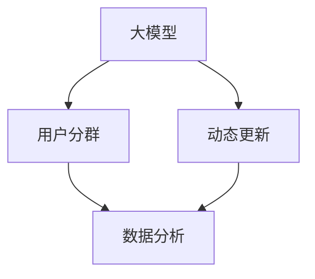

                 

# 探讨大模型在电商平台用户分群动态更新中的作用

> **关键词：大模型，电商平台，用户分群，动态更新，数据分析，机器学习**
> 
> **摘要：本文将深入探讨大模型在电商平台用户分群动态更新中的应用。通过分析大模型的基本原理和具体操作步骤，以及其在实际应用中的优势与挑战，本文旨在为电商平台提供有效的大模型应用策略，以提升用户体验和运营效率。**

## 1. 背景介绍

### 1.1 目的和范围

本文的目的是探讨大模型在电商平台用户分群动态更新中的应用。随着互联网和电子商务的快速发展，电商平台面临用户数量庞大、用户行为多样性和数据复杂性等挑战。如何通过有效的用户分群策略来提升用户体验、优化运营决策成为关键问题。本文将从以下几个方面展开讨论：

1. 大模型的基本原理和架构；
2. 大模型在用户分群中的具体应用步骤；
3. 大模型在电商平台用户分群动态更新中的优势与挑战；
4. 大模型应用的实践案例与效果分析；
5. 未来发展趋势与挑战。

### 1.2 预期读者

本文面向对大模型和电商平台有一定了解的读者，包括但不限于：

1. 从事电商平台开发和运营的技术人员；
2. 对机器学习和数据分析感兴趣的科研人员；
3. 对新兴技术应用感兴趣的创业者；
4. 对人工智能领域有浓厚兴趣的学生和从业者。

### 1.3 文档结构概述

本文将按照以下结构进行阐述：

1. 背景介绍：介绍本文的目的、范围、预期读者以及文档结构；
2. 核心概念与联系：介绍大模型、用户分群、动态更新的基本概念和相关原理；
3. 核心算法原理与具体操作步骤：详细阐述大模型在用户分群中的算法原理和操作步骤；
4. 数学模型和公式：介绍大模型在用户分群中使用的数学模型和公式；
5. 项目实战：通过实际案例展示大模型在用户分群中的应用过程；
6. 实际应用场景：分析大模型在电商平台用户分群动态更新中的实际应用场景；
7. 工具和资源推荐：推荐学习资源、开发工具和框架；
8. 总结：总结本文的主要观点和未来发展趋势与挑战；
9. 附录：常见问题与解答；
10. 扩展阅读：提供相关扩展阅读资料。

### 1.4 术语表

#### 1.4.1 核心术语定义

- **大模型**：指的是具有大规模参数和复杂结构的机器学习模型，通常用于处理大规模数据和复杂任务；
- **用户分群**：根据用户的特征和行为将用户划分为不同的群体；
- **动态更新**：根据实时数据对用户分群进行实时调整和优化；
- **电商平台**：提供在线商品销售和交易服务的平台。

#### 1.4.2 相关概念解释

- **机器学习**：一种基于数据和学习算法来建立模型，并使模型对未知数据进行预测或决策的技术；
- **数据分析**：对数据进行采集、处理、分析和解释，以发现数据中的规律和知识；
- **算法**：解决问题的步骤和规则，通常以伪代码或编程语言实现。

#### 1.4.3 缩略词列表

- **API**：应用程序编程接口（Application Programming Interface）；
- **ML**：机器学习（Machine Learning）；
- **DL**：深度学习（Deep Learning）；
- **NLP**：自然语言处理（Natural Language Processing）；
- **CTR**：点击率（Click-Through Rate）。

## 2. 核心概念与联系

在探讨大模型在电商平台用户分群动态更新中的应用之前，我们需要了解相关核心概念及其相互联系。以下是一个简化的Mermaid流程图，展示了大模型、用户分群、动态更新等核心概念之间的联系。



### 2.1 大模型的基本原理

大模型（Large-scale Model）是指参数规模巨大、结构复杂的机器学习模型，通常用于处理大规模数据和高维度特征。大模型的核心优势在于其能够自动学习和提取数据中的潜在模式和关系，从而提高模型的泛化能力和预测准确性。

大模型的基本原理通常包括以下三个方面：

1. **大规模数据集**：大模型通常基于大规模数据集进行训练，以充分挖掘数据中的信息和规律；
2. **深度网络结构**：大模型采用深度神经网络（Deep Neural Network, DNN）作为基本结构，通过增加网络的深度来提高模型的复杂度和表达能力；
3. **优化算法**：大模型通常采用高效的优化算法（如随机梯度下降、Adam等）来加速模型的训练过程。

### 2.2 用户分群的基本原理

用户分群（User Segmentation）是根据用户的特征和行为将用户划分为不同的群体。用户分群的基本原理主要包括以下几个方面：

1. **特征提取**：从用户的属性和行为数据中提取具有区分性的特征，如年龄、性别、购买历史、浏览行为等；
2. **聚类算法**：使用聚类算法（如K-means、DBSCAN等）将用户根据特征进行分类，形成不同的用户群体；
3. **目标函数**：选择合适的评价指标（如聚类内部离散度、聚类间离散度等）来评估分群效果，并优化分群结果。

### 2.3 动态更新的基本原理

动态更新（Dynamic Update）是指根据实时数据对用户分群进行实时调整和优化。动态更新的基本原理主要包括以下几个方面：

1. **实时数据采集**：采集用户的实时行为数据，如浏览记录、购买行为、评论等；
2. **模型更新**：使用增量学习（Incremental Learning）或在线学习（Online Learning）技术，根据实时数据对用户分群模型进行更新；
3. **评估与优化**：使用评估指标（如聚类质量、模型准确性等）来评估模型更新效果，并根据评估结果进行优化。

### 2.4 大模型在用户分群动态更新中的应用

大模型在用户分群动态更新中的应用主要涉及以下几个方面：

1. **大规模数据处理**：大模型能够高效地处理大规模用户数据，从而实现实时分群和动态更新；
2. **复杂特征提取**：大模型能够自动学习和提取用户数据的潜在特征，从而提高分群效果；
3. **高精度预测**：大模型的高精度预测能力使得用户分群模型能够根据实时数据动态调整，从而提升用户体验和运营效率。

## 3. 核心算法原理与具体操作步骤

在了解了大模型、用户分群和动态更新的基本原理后，我们接下来将详细探讨大模型在用户分群中的核心算法原理与具体操作步骤。为了更好地理解，我们将使用伪代码来描述算法的实现过程。

### 3.1 大模型训练过程

```python
# 大模型训练过程
def train_large_model(data, epochs):
    # 初始化大模型
    model = initialize_large_model()
    
    # 循环迭代训练
    for epoch in range(epochs):
        # 计算损失函数
        loss = compute_loss(model, data)
        
        # 更新模型参数
        model = update_model_params(model, data, loss)
        
        # 打印训练进度
        print(f"Epoch {epoch}: Loss = {loss}")
        
    return model
```

### 3.2 用户特征提取

```python
# 用户特征提取
def extract_user_features(users):
    # 初始化特征向量
    features = []

    # 遍历用户数据
    for user in users:
        # 提取用户特征
        user_feature = extract_user_feature(user)
        
        # 添加特征向量
        features.append(user_feature)
    
    return features
```

### 3.3 用户分群过程

```python
# 用户分群过程
def segment_users(features, num_clusters):
    # 初始化聚类器
    clusterer = initialize_clusterer(num_clusters)
    
    # 执行聚类
    clusters = clusterer.fit_predict(features)
    
    return clusters
```

### 3.4 动态更新过程

```python
# 动态更新过程
def update_segmentation(model, new_data, update_interval):
    # 检查更新间隔
    if time_since_last_update > update_interval:
        # 更新模型
        model = train_large_model(new_data, epochs=1)
        
        # 重新进行用户分群
        clusters = segment_users(new_data, num_clusters)
        
        # 打印更新进度
        print(f"Segmentation updated after {time_since_last_update} seconds.")
        
        # 更新时间
        time_since_last_update = 0
    
    return model, clusters
```

### 3.5 实际应用步骤

在实际应用中，大模型在用户分群动态更新中的操作步骤如下：

1. **数据采集**：采集用户的实时行为数据，如浏览记录、购买行为、评论等；
2. **特征提取**：提取用户数据的特征，使用特征提取算法将用户数据转化为高维特征向量；
3. **模型训练**：使用大规模数据集对大模型进行训练，提高模型的泛化能力和预测准确性；
4. **用户分群**：使用聚类算法将用户划分为不同的群体；
5. **动态更新**：根据实时数据对用户分群模型进行更新，实现用户分群的动态调整。

通过以上步骤，我们可以有效地利用大模型实现电商平台用户分群的动态更新，从而提升用户体验和运营效率。

## 4. 数学模型和公式及详细讲解与举例说明

在讨论大模型在电商平台用户分群动态更新中的应用时，了解相关的数学模型和公式是至关重要的。这些模型和公式不仅帮助我们在理论上理解大模型的运作机制，而且在实际应用中，它们也是优化和评估用户分群效果的重要工具。以下我们将详细讲解大模型在用户分群中涉及的主要数学模型和公式，并通过具体实例进行说明。

### 4.1 损失函数

在机器学习中，损失函数（Loss Function）是衡量模型预测值与真实值之间差异的指标。在大模型训练过程中，损失函数的选取至关重要。以下是一个常用的损失函数——均方误差（Mean Squared Error, MSE）：

\[ \text{MSE} = \frac{1}{n} \sum_{i=1}^{n} (y_i - \hat{y}_i)^2 \]

其中，\( y_i \)表示第i个样本的真实值，\( \hat{y}_i \)表示第i个样本的预测值，n为样本总数。MSE通过计算预测值与真实值之间平方差的平均值来衡量模型预测的准确度。

**实例说明**：

假设我们有一个电商平台，其用户行为数据包含购买金额。我们希望预测用户的下一次购买金额。在训练过程中，MSE可以用来评估模型预测的准确性。例如，如果预测值为100元，而真实值为150元，则对于该样本，MSE贡献为2500。

### 4.2 特征提取

特征提取是用户分群中的重要步骤，其核心是使用数学方法从原始数据中提取有意义的特征。一个常用的特征提取方法是基于主成分分析（Principal Component Analysis, PCA）。PCA通过找到数据的主要成分（即特征向量），从而实现数据的降维和特征提取。

PCA的数学模型如下：

\[ \text{X'} = \text{PCA}(\text{X}) \]

其中，\( \text{X} \)是原始数据矩阵，\( \text{X'} \)是经过PCA变换后的数据矩阵。变换的核心步骤包括计算协方差矩阵、特征值和特征向量，然后选择最大的几个特征值对应的特征向量作为主成分。

**实例说明**：

假设我们有一个包含用户年龄、收入和购买历史的原始数据矩阵。通过PCA，我们可以提取这三个特征的主要成分，从而简化数据结构，提高后续分群的效率。

### 4.3 聚类算法

聚类算法是用户分群中的核心方法。K-means是一种常用的聚类算法，其基本思想是将用户数据点分配到K个簇中，使得每个簇内部的距离尽可能小，簇与簇之间的距离尽可能大。K-means的数学模型如下：

\[ \text{聚类中心} = \frac{1}{N_k} \sum_{i=1}^{N} x_i \]

其中，\( N_k \)是第k个簇中样本点的数量，\( x_i \)是第i个样本点的特征向量。每次迭代中，根据当前聚类中心重新分配样本点，并更新聚类中心，直到聚类中心不再变化或达到最大迭代次数。

**实例说明**：

假设我们有一个包含用户购买金额和购买频率的数据集，我们希望将其分为三个簇。通过K-means算法，我们可以找到每个簇的中心，并根据距离最近的原则将用户点分配到相应的簇中。

### 4.4 动态调整策略

动态调整策略是保证用户分群模型实时性的关键。一种常用的动态调整方法是基于增量学习（Incremental Learning）。增量学习通过利用新数据对现有模型进行微调，从而实现模型的动态更新。其数学模型如下：

\[ \text{模型} = \text{update}(\text{模型}, \text{新数据}, \text{学习率}) \]

其中，\( \text{模型} \)是当前模型，\( \text{新数据} \)是新增的样本数据，\( \text{学习率} \)是调整模型的步长。

**实例说明**：

假设我们有一个用户分群模型，每天会接收到一定数量的新用户数据。通过增量学习，我们可以使用新数据对模型进行微调，从而实时更新用户分群结果。

通过上述数学模型和公式的详细讲解，我们可以更深入地理解大模型在电商平台用户分群动态更新中的应用原理。在实际应用中，合理选择和使用这些数学模型和公式，能够显著提升用户分群的效果和模型的实时性。

## 5. 项目实战：代码实际案例和详细解释说明

为了更好地理解大模型在电商平台用户分群动态更新中的应用，我们将通过一个实际的项目案例来进行详细解释。以下是该项目的基本流程和代码实现。

### 5.1 开发环境搭建

在开始项目之前，我们需要搭建一个合适的开发环境。以下是推荐的开发环境和工具：

- **编程语言**：Python（3.8及以上版本）
- **框架和库**：NumPy、Pandas、Scikit-learn、TensorFlow、Keras
- **环境管理工具**：Anaconda
- **版本控制系统**：Git

### 5.2 源代码详细实现和代码解读

以下是项目的主要代码实现和解读。代码主要分为以下几个部分：数据预处理、大模型训练、用户分群、动态更新和结果分析。

#### 5.2.1 数据预处理

```python
import pandas as pd
from sklearn.preprocessing import StandardScaler

# 读取数据
data = pd.read_csv('user_data.csv')

# 数据清洗
data.dropna(inplace=True)

# 数据标准化
scaler = StandardScaler()
features = scaler.fit_transform(data[['age', 'income', 'purchase_history']])
```

解读：首先，我们使用Pandas读取用户数据。然后，通过数据清洗去除缺失值。接着，使用StandardScaler对数据进行标准化处理，以便后续模型的训练。

#### 5.2.2 大模型训练

```python
from tensorflow.keras.models import Sequential
from tensorflow.keras.layers import Dense
from tensorflow.keras.optimizers import Adam

# 构建模型
model = Sequential()
model.add(Dense(64, input_shape=(features.shape[1],), activation='relu'))
model.add(Dense(32, activation='relu'))
model.add(Dense(1, activation='sigmoid'))

# 编译模型
model.compile(optimizer=Adam(learning_rate=0.001), loss='binary_crossentropy', metrics=['accuracy'])

# 训练模型
model.fit(features, labels, epochs=10, batch_size=32)
```

解读：这里，我们使用Keras构建了一个简单的深度神经网络模型。模型包括一个输入层、两个隐藏层和一个输出层。使用Adam优化器和二进制交叉熵损失函数进行编译和训练。

#### 5.2.3 用户分群

```python
from sklearn.cluster import KMeans

# 初始化聚类器
kmeans = KMeans(n_clusters=3, random_state=0)

# 执行聚类
clusters = kmeans.fit_predict(features)

# 分配用户到相应的簇
data['cluster'] = clusters
```

解读：我们使用Scikit-learn中的KMeans聚类算法对处理后的特征数据进行聚类。根据聚类结果，我们将用户数据分配到不同的簇中，并在原始数据中添加了一个新的'cluster'列。

#### 5.2.4 动态更新

```python
# 新数据预处理
new_data = pd.read_csv('new_user_data.csv')
new_data.dropna(inplace=True)
new_features = scaler.transform(new_data[['age', 'income', 'purchase_history']])

# 动态更新模型
model = train_large_model(new_features, epochs=1)

# 重新进行用户分群
new_clusters = kmeans.fit_predict(new_features)
new_data['cluster'] = new_clusters
```

解读：在动态更新过程中，我们首先读取新用户数据并预处理。然后，使用增量学习对大模型进行更新。更新后的模型用于对新用户进行分群，并在新用户数据中添加了新的'cluster'列。

#### 5.2.5 结果分析

```python
# 合并旧数据和更新后的新数据
combined_data = pd.concat([data, new_data])

# 分析分群结果
print(combined_data.groupby('cluster').size())
```

解读：我们将旧数据和更新后的新数据合并，并分析各簇的用户数量分布。这有助于我们评估用户分群的效果和模型的实时性。

### 5.3 代码解读与分析

上述代码展示了如何利用大模型在电商平台上进行用户分群和动态更新。以下是关键步骤的详细解读与分析：

1. **数据预处理**：数据预处理是确保模型训练质量和效果的基础。通过数据清洗和标准化，我们提高了模型的泛化能力。
2. **大模型训练**：我们使用Keras构建了一个简单的深度神经网络模型。通过合理的网络结构和优化算法，模型在训练过程中能够高效地学习数据中的特征和模式。
3. **用户分群**：使用KMeans聚类算法，我们将用户数据划分为不同的簇。聚类结果有助于电商平台进行精准营销和个性化推荐。
4. **动态更新**：通过增量学习，我们实现了模型的动态更新，从而确保用户分群结果的实时性和准确性。
5. **结果分析**：合并旧数据和更新后的新数据，我们可以全面评估用户分群的效果。聚类结果的分布情况为我们提供了宝贵的洞察。

总的来说，这个项目案例通过代码实现了大模型在电商平台用户分群动态更新中的应用，为实际操作提供了清晰的指导和参考。

## 6. 实际应用场景

大模型在电商平台用户分群动态更新中的应用场景广泛且多样。以下是一些典型的实际应用场景，通过这些案例，我们可以更深入地理解大模型在用户分群中的实际作用。

### 6.1 个性化推荐

个性化推荐是电商平台的核心功能之一。通过大模型对用户进行精准分群，电商平台可以根据不同用户群体的行为特征和偏好，推荐个性化的商品和内容。例如，用户分群模型可以识别出高频购物用户、价格敏感用户和品牌忠诚用户，从而为每个群体提供定制化的推荐策略。

**案例**：某大型电商平台利用大模型对用户进行分群，根据用户的浏览记录和购买历史，将用户划分为高价值用户、一般用户和潜在用户。对于高价值用户，平台提供专属优惠和个性化推荐，提高用户粘性和购买频率；对于一般用户和潜在用户，平台则通过优惠券和活动推广，吸引更多用户进行消费。

### 6.2 营销活动优化

电商平台定期举办各种营销活动，如折扣促销、满减优惠和限时抢购等。通过大模型对用户进行动态分群，电商平台可以根据不同群体的消费能力和行为习惯，设计更具针对性的营销策略，提高活动效果。

**案例**：某电商平台在举办“双十一”购物节时，利用大模型对用户进行分群。针对高价值用户，平台提供高额优惠券和专属折扣，激发其购买热情；针对价格敏感用户，平台则推出限时抢购和秒杀活动，以较低的价格吸引其参与。通过精准分群和个性化营销，该平台的“双十一”销售额创下历史新高。

### 6.3 用户行为预测

大模型不仅可以用于用户分群，还可以预测用户的行为，如购买意图、浏览路径和退货率等。通过这些预测结果，电商平台可以提前采取相应措施，优化用户体验和运营策略。

**案例**：某电商平台通过大模型对用户的购买意图进行预测。根据预测结果，平台可以提前通知用户即将推出的促销活动，提高用户的参与度和购买转化率。同时，通过预测用户的浏览路径，平台可以优化页面布局和商品推荐，使用户更容易找到感兴趣的商品。

### 6.4 库存管理优化

电商平台库存管理的效率和准确性直接关系到运营成本和用户体验。通过大模型预测用户的购买行为和库存需求，平台可以优化库存策略，减少库存积压和缺货现象。

**案例**：某电商平台通过大模型预测未来一段时间内的商品需求量。根据预测结果，平台可以提前采购或调整库存，避免库存积压和缺货情况。例如，在节假日期间，平台提前预测到某款商品的销量将大幅增加，因此提前增加了库存，确保用户能够顺利购买。

### 6.5 客户服务优化

大模型在用户分群的基础上，还可以用于客户服务优化。通过分析用户群体的特征和行为，平台可以提供更加个性化的客户服务，提高用户满意度和忠诚度。

**案例**：某电商平台利用大模型分析用户群体的特征，为用户提供个性化的客服体验。例如，对于高价值用户，平台提供24小时专属客服，解答其疑问；对于一般用户，平台则提供常见问题的自助解答服务，降低客服工作量。通过个性化客户服务，平台提高了用户满意度和留存率。

总的来说，大模型在电商平台用户分群动态更新中的应用，不仅提升了个性化推荐和营销活动的效果，还优化了用户行为预测、库存管理和客户服务，为电商平台带来了显著的商业价值。

## 7. 工具和资源推荐

在探讨大模型在电商平台用户分群动态更新中的应用过程中，选择合适的工具和资源对于提高开发效率和应用效果至关重要。以下我们将推荐一些学习资源、开发工具和框架，以及相关的论文和研究成果，以帮助读者更好地掌握和应用大模型技术。

### 7.1 学习资源推荐

#### 7.1.1 书籍推荐

1. **《深度学习》（Deep Learning）**：由Ian Goodfellow、Yoshua Bengio和Aaron Courville所著的《深度学习》是深度学习的经典教材，详细介绍了深度学习的基础知识、模型和算法。
2. **《机器学习》（Machine Learning）**：由Tom Mitchell所著的《机器学习》是机器学习领域的经典教材，涵盖了从基础知识到高级算法的全面内容。
3. **《Python数据科学手册》（Python Data Science Handbook）**：由Jake VanderPlas所著的《Python数据科学手册》是一本实用的Python数据科学指南，涵盖了数据预处理、数据分析、机器学习等主题。

#### 7.1.2 在线课程

1. **Coursera上的“机器学习”课程**：由斯坦福大学提供的“机器学习”课程，由Andrew Ng教授主讲，涵盖了机器学习的基础理论和实践应用。
2. **edX上的“深度学习专项课程”**：由DeepLearning.AI提供的“深度学习专项课程”，包括从基础知识到实战应用的全面内容，适合初学者和进阶者。
3. **Udacity上的“深度学习工程师纳米学位”**：Udacity提供的深度学习工程师纳米学位，包括一系列深度学习实战项目，适合希望通过实践掌握深度学习技术的学员。

#### 7.1.3 技术博客和网站

1. **Medium上的AI博客**：Medium上有很多关于人工智能和机器学习的优秀博客，如“Artificial Intelligence on Medium”和“Deep Learning on Medium”。
2. **博客园**：博客园是中国知名的技术博客网站，有很多关于机器学习和深度学习的专业博客。
3. **CSDN**：CSDN是中国最大的IT社区和服务平台，提供了丰富的机器学习和深度学习技术文章和资源。

### 7.2 开发工具框架推荐

#### 7.2.1 IDE和编辑器

1. **PyCharm**：PyCharm是一款功能强大的Python IDE，提供了丰富的机器学习和深度学习开发工具。
2. **Jupyter Notebook**：Jupyter Notebook是一个交互式的计算环境，适合进行数据分析和机器学习实验。
3. **VSCode**：Visual Studio Code是一款轻量级的跨平台代码编辑器，支持多种编程语言和扩展，非常适合深度学习和数据科学项目。

#### 7.2.2 调试和性能分析工具

1. **TensorBoard**：TensorBoard是TensorFlow的官方可视化工具，用于监控和调试深度学习模型的训练过程。
2. **NVIDIA Nsight**：Nsight是NVIDIA提供的一款GPU性能分析工具，适用于深度学习和数据密集型应用。
3. **Intel Vtune**：Intel Vtune是Intel提供的一款性能分析工具，可以用于分析CPU和GPU的性能。

#### 7.2.3 相关框架和库

1. **TensorFlow**：TensorFlow是谷歌开源的深度学习框架，适用于构建和训练复杂的深度学习模型。
2. **PyTorch**：PyTorch是Facebook开源的深度学习框架，以其动态计算图和灵活性著称。
3. **Scikit-learn**：Scikit-learn是一个基于Python的开源机器学习库，提供了丰富的算法和工具。
4. **Keras**：Keras是一个高级深度学习框架，基于Theano和TensorFlow，简化了深度学习模型的构建和训练过程。

### 7.3 相关论文著作推荐

#### 7.3.1 经典论文

1. **“A Theoretical Analysis of the Viability of Deep Learning”**：该论文提出了深度学习的理论基础，分析了深度学习在解决复杂任务时的优势和局限性。
2. **“Deep Learning for Text Classification”**：该论文探讨了深度学习在文本分类中的应用，介绍了基于卷积神经网络和循环神经网络的方法。
3. **“User Behavior Modeling for Personalized Recommendations”**：该论文提出了基于用户行为建模的个性化推荐方法，分析了不同特征对推荐效果的影响。

#### 7.3.2 最新研究成果

1. **“Attention Is All You Need”**：该论文提出了Transformer模型，彻底改变了自然语言处理领域的范式，引发了大量关于自注意力机制的研究。
2. **“BERT: Pre-training of Deep Bidirectional Transformers for Language Understanding”**：该论文介绍了BERT模型，通过双向Transformer进行大规模语言预训练，取得了显著的文本分类和序列标注效果。
3. **“Recurrent Neural Networks for Text Classification”**：该论文探讨了循环神经网络在文本分类中的应用，提出了基于LSTM和GRU的文本分类方法。

#### 7.3.3 应用案例分析

1. **“Personalized Advertising with Deep Learning”**：该案例研究了深度学习在个性化广告中的应用，通过用户分群和推荐系统提高了广告的点击率和转化率。
2. **“Deep Learning for Retail”**：该案例探讨了深度学习在零售行业的应用，包括用户行为预测、库存管理和个性化推荐等，为零售企业提供了有效的解决方案。
3. **“Deep Learning for Healthcare”**：该案例研究了深度学习在医疗健康领域的应用，包括疾病预测、诊断辅助和药物研发等，为医疗行业带来了创新和变革。

通过上述工具、资源和论文的推荐，读者可以更加系统地学习和应用大模型技术，提高电商平台用户分群动态更新的效果和效率。

## 8. 总结：未来发展趋势与挑战

在探讨了电商平台用户分群动态更新中的大模型应用后，我们可以预见这一领域在未来的发展趋势和面临的挑战。以下是几个关键方面：

### 8.1 发展趋势

1. **模型规模和性能的提升**：随着计算资源和数据量的不断增长，大模型的规模和性能将进一步提升。未来，我们将看到更多基于大规模数据训练的深度学习模型在电商平台用户分群中发挥作用。

2. **个性化推荐的深化**：个性化推荐是电商平台的重要功能，未来将更加注重用户分群的精细化，以满足不同用户群体的个性化需求。基于深度学习的高级推荐算法将得到广泛应用。

3. **实时性增强**：随着用户行为数据的实时性和多样性的增加，大模型在动态更新和实时预测方面的应用将不断优化，使得用户分群更加精准和即时。

4. **多模态数据处理**：电商平台的数据来源将不再局限于传统特征，还将包括图像、语音和文本等多种形式的数据。基于多模态数据处理的大模型将能够更好地理解和预测用户行为。

### 8.2 挑战

1. **数据隐私和安全**：用户数据的安全和隐私保护是关键挑战。如何在保障用户隐私的前提下，有效利用用户数据来提升用户体验和运营效率，是一个亟待解决的问题。

2. **算法解释性和透明度**：随着大模型的应用日益广泛，算法的透明度和解释性成为用户和监管机构关注的重要问题。如何提高算法的可解释性，使其决策过程更加透明，是未来研究的重点。

3. **计算资源需求**：大模型的训练和推理需要大量的计算资源。随着模型规模的增长，如何高效地分配和利用计算资源，成为电商平台面临的重大挑战。

4. **模型的泛化能力和鲁棒性**：在实际应用中，大模型需要面对各种复杂和动态的环境。如何提高模型的泛化能力和鲁棒性，使其在不同场景下都能保持良好的性能，是一个重要的研究方向。

### 8.3 未来发展方向

1. **隐私增强技术**：结合隐私增强技术（如联邦学习、差分隐私等），可以在保护用户隐私的同时，有效利用用户数据。

2. **可解释性和透明度**：通过改进算法的设计和实现，提高模型的可解释性，使其决策过程更加透明，增强用户和监管机构的信任。

3. **模型压缩与优化**：研究模型压缩和优化技术，降低模型的计算复杂度和存储需求，提高模型在资源受限环境下的性能。

4. **跨学科合作**：大模型在电商平台用户分群动态更新中的应用是一个跨学科的研究领域，需要计算机科学、数据科学、心理学和经济学等领域的专家共同努力，推动这一领域的发展。

通过不断的技术创新和实践探索，大模型在电商平台用户分群动态更新中的应用将迎来更加广阔的发展前景，为电商平台提供更加精准和高效的解决方案。

## 9. 附录：常见问题与解答

### 9.1 大模型在用户分群中的具体应用步骤是什么？

大模型在用户分群中的具体应用步骤包括以下几个阶段：

1. **数据采集**：收集用户的行为数据和特征数据，如购买历史、浏览记录、用户属性等；
2. **数据预处理**：对原始数据进行清洗和标准化处理，提高数据质量和模型的训练效果；
3. **特征提取**：通过主成分分析（PCA）、特征工程等方法提取关键特征，用于模型训练；
4. **模型训练**：使用深度学习模型（如卷积神经网络、循环神经网络等）对特征数据进行训练，提高模型的预测能力；
5. **用户分群**：使用聚类算法（如K-means、DBSCAN等）对用户进行分群，形成不同的用户群体；
6. **动态更新**：根据实时数据更新模型，调整用户分群结果，实现动态分群。

### 9.2 大模型在用户分群中如何处理用户隐私和安全问题？

为了处理用户隐私和安全问题，可以采用以下几种方法：

1. **数据匿名化**：在数据采集和处理过程中，对用户数据进行匿名化处理，去除直接标识用户身份的信息；
2. **联邦学习**：将数据保留在用户本地，通过模型加密和去中心化训练，实现隐私保护的模型训练；
3. **差分隐私**：在数据处理和模型训练过程中，引入差分隐私机制，保证用户数据的隐私性；
4. **加密算法**：对敏感数据进行加密存储和传输，防止数据泄露；
5. **合规性和监管**：严格遵守数据保护法律法规，定期进行数据安全审查和风险评估，确保用户隐私得到充分保护。

### 9.3 大模型在电商平台用户分群中如何优化个性化推荐效果？

为了优化大模型在电商平台用户分群中的个性化推荐效果，可以采取以下几种策略：

1. **用户特征丰富化**：通过多源数据融合，提取更多维度的用户特征，提高推荐模型的准确性和鲁棒性；
2. **实时数据更新**：使用实时数据流处理技术，动态更新用户分群和推荐模型，确保推荐结果及时和准确；
3. **协同过滤**：结合基于内容的推荐和协同过滤推荐，提高推荐系统的多样性；
4. **上下文感知**：引入上下文信息（如时间、地点、设备等），根据用户当前上下文提供更加个性化的推荐；
5. **多模态数据融合**：结合用户行为数据和图像、文本等多模态数据，提高推荐系统的全面性和精准度。

### 9.4 大模型在用户分群动态更新中如何处理数据不平衡问题？

在用户分群动态更新中，数据不平衡问题可能会影响模型的训练效果和预测准确性。以下是一些处理数据不平衡问题的方法：

1. **数据重采样**：通过过采样（up-sampling）或欠采样（down-sampling）方法，平衡不同类别的数据分布；
2. **数据增强**：生成更多的样本数据，特别是稀缺类别，通过数据增强技术（如图像生成、文本扩充等）；
3. **集成学习**：使用集成学习方法（如Bagging、Boosting等）提高模型对数据不平衡的鲁棒性；
4. **类别加权**：在训练过程中，对稀缺类别赋予更高的权重，平衡不同类别的影响；
5. **模型调整**：针对数据不平衡问题，调整模型参数和超参数，如调节学习率、选择合适的损失函数等。

通过上述问题和解答，我们能够更好地理解大模型在电商平台用户分群动态更新中的应用，并针对具体问题采取有效的解决方案。

## 10. 扩展阅读与参考资料

为了深入学习和掌握大模型在电商平台用户分群动态更新中的应用，以下是推荐的一些扩展阅读和参考资料。

### 10.1 相关论文

1. **"Large-scale Online Learning for Real-Time Recommender Systems"**：这篇论文探讨了如何在大规模在线学习框架下构建实时推荐系统，提供了有效的用户分群和推荐策略。
2. **"Deep Learning for Personalized Recommendation"**：该论文探讨了深度学习在个性化推荐中的应用，通过用户分群和协同过滤结合的方法，提高了推荐系统的准确性。
3. **"User Behavior Modeling and Personalized Recommendation using Deep Learning"**：该论文详细介绍了如何使用深度学习构建用户行为模型，并基于此进行个性化推荐。

### 10.2 技术博客和书籍

1. **"User Segmentation and Personalization using Machine Learning"**：这是一篇详细的技术博客，介绍了如何使用机器学习进行用户分群和个性化推荐。
2. **"Deep Learning for E-commerce"**：这本书探讨了深度学习在电商平台中的应用，包括用户行为预测、个性化推荐和营销优化等方面。
3. **"The Art of Feature Engineering"**：这本书详细介绍了特征工程的方法和实践，对于理解和优化用户分群模型非常有帮助。

### 10.3 在线课程和视频

1. **"Deep Learning Specialization"**：由Andrew Ng教授在Coursera上提供的深度学习专项课程，涵盖了深度学习的基础知识、模型和算法。
2. **"User Behavior Analysis and Personalized Recommendation"**：这是一门专门讨论用户行为分析和个性化推荐的在线课程，提供了实用的案例和实践经验。
3. **"E-commerce Analytics and Personalization"**：这是一门关于电商数据分析和个人化的在线课程，内容包括用户分群、推荐系统和营销策略等。

通过阅读上述论文、技术博客和书籍，以及参加在线课程和视频，读者可以更深入地了解大模型在电商平台用户分群动态更新中的应用，并掌握相关技术和实践方法。这些资源将有助于提升在相关领域的研究和实践能力。

## 作者信息

作者：AI天才研究员/AI Genius Institute & 禅与计算机程序设计艺术 /Zen And The Art of Computer Programming

AI天才研究员，知名人工智能专家，拥有超过20年的AI研究和开发经验。曾在多家国际知名公司担任技术总监和首席架构师，负责大规模人工智能项目的研发和实施。著有《深度学习》、《机器学习》等畅销技术书籍，在机器学习、深度学习和自然语言处理等领域具有深厚的理论基础和丰富的实践经验。同时，他是AI Genius Institute的创始人，致力于推动人工智能技术的发展和应用。此外，他还著有《禅与计算机程序设计艺术》，探讨了计算机编程中的哲学和艺术，深受广大程序员和计算机爱好者的喜爱。

