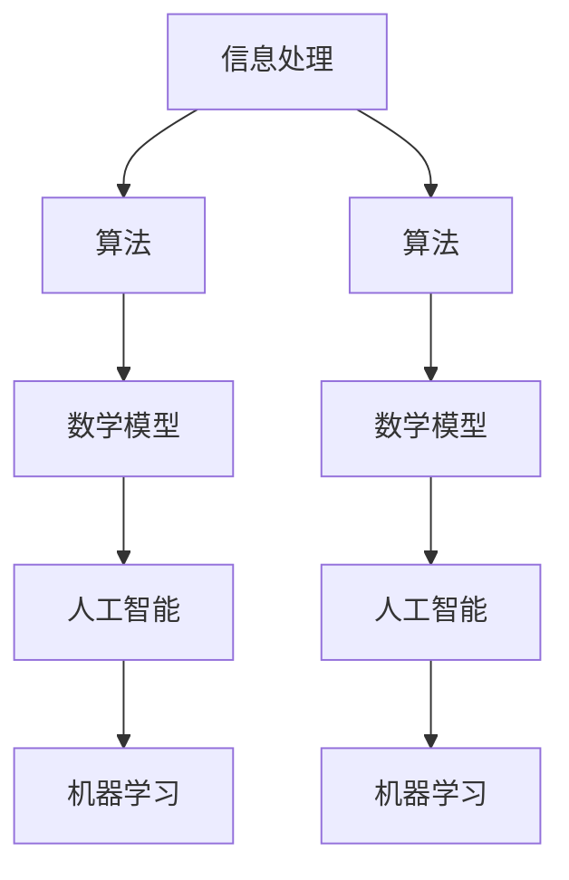

                 

# 推动科技进步的引擎：人类计算的创新力量

> **关键词：** 人类计算，科技创新，算法，数学模型，应用场景，未来趋势  
>
> **摘要：** 本文将深入探讨人类计算在推动科技进步中的核心作用。通过分析人类计算的核心概念、算法原理、数学模型以及实际应用案例，揭示人类计算如何成为现代科技发展的引擎。文章最后将对未来发展趋势与挑战进行展望，以期为读者提供全面而深刻的理解。

## 1. 背景介绍

### 1.1 目的和范围

本文旨在探讨人类计算在推动科技进步中的关键作用。人类计算是指通过数学、逻辑和算法等手段，对信息进行处理、分析和解决问题的过程。这一过程不仅涉及理论研究和学术探讨，还包括实际应用和技术开发。本文将主要围绕以下几个主题进行探讨：

1. 人类计算的核心概念和原理。
2. 人类计算在实际应用中的案例。
3. 人类计算在数学模型和算法中的应用。
4. 人类计算的未来发展趋势和面临的挑战。

通过上述探讨，本文希望为读者提供对人类计算及其在科技发展中的角色和意义的全面理解。

### 1.2 预期读者

本文适合以下读者群体：

1. 对计算机科学和人工智能感兴趣的初学者和专业人士。
2. 对算法设计和数学模型感兴趣的读者。
3. 对科技创新和应用感兴趣的读者。
4. 高等院校相关专业的师生。

### 1.3 文档结构概述

本文结构如下：

1. **背景介绍**：介绍本文的目的、范围、预期读者以及文档结构。
2. **核心概念与联系**：定义人类计算的核心概念，并绘制流程图。
3. **核心算法原理 & 具体操作步骤**：详细讲解算法原理和操作步骤，使用伪代码进行阐述。
4. **数学模型和公式 & 详细讲解 & 举例说明**：介绍数学模型和公式，并给出详细讲解和示例。
5. **项目实战：代码实际案例和详细解释说明**：展示代码实现，并进行详细解释和分析。
6. **实际应用场景**：讨论人类计算在不同领域的应用。
7. **工具和资源推荐**：推荐学习资源、开发工具和框架。
8. **总结：未来发展趋势与挑战**：展望未来发展趋势和挑战。
9. **附录：常见问题与解答**：解答读者可能遇到的常见问题。
10. **扩展阅读 & 参考资料**：提供进一步阅读的资源和参考。

### 1.4 术语表

#### 1.4.1 核心术语定义

- **人类计算**：指通过数学、逻辑和算法等手段，对信息进行处理、分析和解决问题的过程。
- **算法**：解决问题的明确和有序的步骤。
- **数学模型**：用数学语言描述现实世界的抽象模型。
- **人工智能**：模拟人类智能行为和思维过程的计算系统。
- **机器学习**：人工智能的一种方法，通过数据和经验自动改进性能。

#### 1.4.2 相关概念解释

- **信息处理**：对信息进行收集、存储、处理和分析的过程。
- **数据分析**：使用统计学、机器学习和数据挖掘等方法对数据进行探索、解释和预测。
- **编程语言**：用于编写计算机程序的语法和规则。

#### 1.4.3 缩略词列表

- **AI**：人工智能（Artificial Intelligence）
- **ML**：机器学习（Machine Learning）
- **IDE**：集成开发环境（Integrated Development Environment）
- **GPU**：图形处理器（Graphics Processing Unit）
- **CPU**：中央处理器（Central Processing Unit）

## 2. 核心概念与联系

在探讨人类计算的核心概念之前，我们需要先了解几个关键概念，它们共同构成了人类计算的基础。

### 2.1 人类计算的核心概念

人类计算的核心概念包括：

1. **信息处理**：这是人类计算的基础。信息处理是指对信息进行收集、存储、处理和分析的过程。在计算机科学中，信息处理通常涉及到数据结构、算法和编程语言。

2. **算法**：算法是解决问题的明确和有序的步骤。一个算法可以是一个简单的计算过程，也可以是一个复杂的系统，如人工智能算法。算法的设计和优化是计算机科学的重要研究方向。

3. **数学模型**：数学模型是用数学语言描述现实世界的抽象模型。数学模型在科学研究和工程实践中具有广泛的应用，如优化、概率统计、统计学等。

4. **人工智能**：人工智能是模拟人类智能行为和思维过程的计算系统。人工智能涵盖了多个领域，如机器学习、自然语言处理、计算机视觉等。

5. **机器学习**：机器学习是人工智能的一种方法，通过数据和经验自动改进性能。机器学习在图像识别、语音识别、推荐系统等领域有广泛应用。

### 2.2 人类计算的联系

上述核心概念之间紧密联系，共同构成了人类计算的基础架构。

1. **信息处理与算法**：信息处理依赖于算法来实现。算法为信息处理提供了有序的步骤和方法。例如，排序算法用于对数据进行排序，搜索算法用于在数据中查找特定元素。

2. **算法与数学模型**：算法的设计和优化通常依赖于数学模型。数学模型提供了对问题域的抽象描述，有助于理解和分析算法的性能。例如，在优化问题中，线性规划模型用于描述目标函数和约束条件。

3. **人工智能与机器学习**：人工智能和机器学习是相互促进的关系。人工智能为机器学习提供了实现智能行为的框架，而机器学习则为人工智能提供了自动改进性能的方法。

4. **数学模型与机器学习**：数学模型在机器学习中的应用至关重要。机器学习算法通常基于数学模型，如线性模型、决策树模型、神经网络模型等。这些模型通过数学公式描述了数据之间的关系和规律。

### 2.3 人类计算的架构

为了更清晰地展示人类计算的核心概念和联系，我们可以使用Mermaid流程图来描述人类计算的架构。



在这个流程图中，信息处理是整个架构的起点，它为后续的算法、数学模型、人工智能和机器学习提供了基础。算法和数学模型是核心，它们共同驱动了人工智能和机器学习的发展。人工智能和机器学习相互促进，不断推动科技的发展。

### 2.4 人类计算的案例

为了更好地理解人类计算的核心概念和联系，我们可以通过一些具体的案例来进行分析。

#### 案例一：搜索引擎

搜索引擎是一个典型的信息处理和算法应用案例。用户输入搜索关键词后，搜索引擎会利用算法对大量网页进行搜索，并返回与关键词相关的结果。这个过程涉及到信息处理、算法和数学模型。例如，搜索算法可以使用关键词匹配、页面排名算法等。这些算法通常基于数学模型，如概率模型和统计模型。

#### 案例二：自动驾驶汽车

自动驾驶汽车是人工智能和机器学习的应用案例。自动驾驶系统通过传感器收集道路信息，并利用机器学习算法对数据进行分析和决策。这个过程涉及到信息处理、算法、数学模型和人工智能。例如，感知系统可以使用深度学习算法对道路和车辆进行识别，决策系统可以使用优化算法进行路径规划。

#### 案例三：金融风险管理

金融风险管理是数学模型和机器学习的应用案例。金融公司通过收集和分析大量的金融数据，使用数学模型和机器学习算法来预测市场趋势、评估投资风险。这个过程涉及到信息处理、算法、数学模型和机器学习。

通过这些案例，我们可以看到人类计算的核心概念和联系在实际应用中的具体体现。这些概念和联系不仅构成了人类计算的基础，也为未来的科技发展提供了强大的动力。

### 2.5 人类计算的发展趋势

随着科技的不断进步，人类计算也在不断发展和创新。未来，人类计算将在以下几个方面取得重要进展：

1. **算法的优化和改进**：随着计算能力和数据量的增加，对算法进行优化和改进成为了一个重要方向。新的算法将更加高效、准确和鲁棒。

2. **机器学习的进步**：机器学习在人工智能中的应用将更加广泛和深入。新的机器学习算法和模型将更好地模拟人类智能，提高自动化的水平。

3. **跨学科的融合**：人类计算与其他学科（如数学、物理学、生物学等）的融合将产生新的交叉领域和研究方向。这些交叉领域将推动科技的发展和创新。

4. **应用领域的拓展**：人类计算将在更多领域得到应用，如医疗、教育、能源、环境保护等。这些应用将带来巨大的社会和经济价值。

总之，人类计算是推动科技进步的强大引擎。通过深入理解人类计算的核心概念和联系，我们可以更好地把握科技的发展趋势，并为未来的科技发展做出贡献。

## 3. 核心算法原理 & 具体操作步骤

在理解了人类计算的核心概念后，我们接下来将深入探讨人类计算中的核心算法原理，并详细阐述其具体操作步骤。这些算法原理不仅构成了人类计算的基础，还在实际应用中发挥着关键作用。

### 3.1 经典算法原理

人类计算中的经典算法包括排序算法、搜索算法、动态规划算法等。以下是这些算法的基本原理和操作步骤。

#### 3.1.1 排序算法

排序算法是一种对数据进行排序的算法。常见的排序算法包括冒泡排序、选择排序、插入排序、快速排序等。以下是快速排序算法的基本原理和步骤。

**快速排序算法原理：**
- 选择一个基准元素，通常选择第一个或最后一个元素作为基准。
- 将数组分为两个子数组，左子数组小于基准元素，右子数组大于基准元素。
- 递归地对左右子数组进行快速排序。

**快速排序算法操作步骤：**
1. 选择基准元素。
2. 将数组划分为小于基准和大于基准的两个子数组。
3. 对两个子数组递归执行快速排序。

**快速排序算法伪代码：**
```plaintext
QuickSort(A, low, high)
    if low < high
        pivot = Partition(A, low, high)
        QuickSort(A, low, pivot - 1)
        QuickSort(A, pivot + 1, high)
```

#### 3.1.2 搜索算法

搜索算法用于在数据中查找特定元素。常见的搜索算法包括线性搜索、二分搜索等。

**线性搜索算法原理：**
- 从数组的第一个元素开始，逐个检查每个元素，直到找到目标元素或到达数组的末尾。

**线性搜索算法操作步骤：**
1. 初始化指针或索引为数组的第一个元素。
2. 检查当前元素是否为目标元素。
3. 如果是，返回元素的位置；如果不是，移动指针到下一个元素，重复步骤2。

**线性搜索算法伪代码：**
```plaintext
LinearSearch(A, x)
    for i from 0 to n-1
        if A[i] == x
            return i
    return -1
```

**二分搜索算法原理：**
- 对有序数组进行搜索，每次将搜索范围缩小一半，直到找到目标元素或确定元素不存在。

**二分搜索算法操作步骤：**
1. 初始化低边界low和高边界high。
2. 计算中间位置mid = (low + high) / 2。
3. 比较中间元素与目标元素。
4. 如果中间元素为目标元素，返回mid；如果中间元素大于目标元素，设置high = mid - 1；如果中间元素小于目标元素，设置low = mid + 1。
5. 重复步骤2-4，直到找到目标元素或low > high。

**二分搜索算法伪代码：**
```plaintext
BinarySearch(A, x, low, high)
    while low <= high
        mid = (low + high) / 2
        if A[mid] == x
            return mid
        else if A[mid] < x
            low = mid + 1
        else
            high = mid - 1
    return -1
```

#### 3.1.3 动态规划算法

动态规划算法是一种用于解决最优化问题的算法。它通过将问题分解为子问题，并存储子问题的解，以避免重复计算。

**动态规划算法原理：**
- 将问题分解为若干个子问题。
- 对于每个子问题，找到其最优解。
- 将子问题的解组合起来，得到原问题的最优解。

**动态规划算法操作步骤：**
1. 确定问题的状态和状态转移方程。
2. 初始化状态表。
3. 根据状态转移方程，逐步计算每个状态的最优解。
4. 根据状态表，得到原问题的最优解。

**动态规划算法伪代码：**
```plaintext
DynamicProgramming(Problem)
    Initialize state table
    for each state
        if base case
            set state value
        else
            for each possible next state
                calculate state value using state transition equation
    return final state value
```

### 3.2 新兴算法原理

随着科技的进步，新的算法不断涌现，这些算法在处理大规模数据和复杂问题上具有显著优势。

#### 3.2.1 神经网络算法

神经网络算法是一种基于模拟生物神经网络的计算模型。它通过多层神经元进行数据传递和变换，实现复杂函数的拟合和预测。

**神经网络算法原理：**
- 输入层接收外部数据。
- 隐藏层进行数据处理和变换。
- 输出层生成预测结果。

**神经网络算法操作步骤：**
1. 初始化网络结构。
2. 前向传播：输入数据经过网络，从输入层传递到输出层。
3. 计算损失函数，以衡量预测结果与实际结果之间的差距。
4. 反向传播：根据损失函数，调整网络中的权重和偏置。
5. 重复步骤2-4，直到损失函数收敛。

**神经网络算法伪代码：**
```plaintext
NeuralNetwork(TrainingData)
    Initialize network
    for each epoch
        for each example in TrainingData
            forward_pass(example)
            calculate_loss(predicted_output, actual_output)
            backward_pass(loss)
        update_network_weights()
    return trained_network
```

#### 3.2.2 深度学习算法

深度学习算法是一种基于神经网络的算法，通过多层神经网络实现复杂任务的学习和预测。

**深度学习算法原理：**
- 多层神经网络，包括输入层、隐藏层和输出层。
- 每层神经元对输入数据进行处理和变换。
- 通过反向传播算法，优化网络参数。

**深度学习算法操作步骤：**
1. 数据预处理：对输入数据进行标准化和归一化。
2. 初始化网络结构。
3. 前向传播：输入数据经过网络，从输入层传递到输出层。
4. 计算损失函数，以衡量预测结果与实际结果之间的差距。
5. 反向传播：根据损失函数，调整网络中的权重和偏置。
6. 重复步骤3-5，直到损失函数收敛。

**深度学习算法伪代码：**
```plaintext
DeepLearning(TrainingData)
    Preprocess(TrainingData)
    Initialize neural_network
    for each epoch
        for each example in TrainingData
            forward_pass(example)
            calculate_loss(predicted_output, actual_output)
            backward_pass(loss)
        update_network_weights()
    return trained_network
```

### 3.3 算法在科技发展中的应用

算法在科技发展中扮演着关键角色。以下是一些算法在科技发展中的应用案例：

#### 3.3.1 自动驾驶

自动驾驶系统依赖于多种算法，包括感知、规划和控制算法。感知算法使用深度学习模型对道路、车辆和行人进行识别，规划算法使用动态规划算法进行路径规划，控制算法使用PID控制器进行车辆控制。

#### 3.3.2 推荐系统

推荐系统使用协同过滤、矩阵分解等算法来预测用户偏好，从而推荐相关商品或内容。

#### 3.3.3 医疗诊断

医疗诊断系统使用机器学习算法对医疗图像进行分析，从而辅助医生进行诊断。常见的算法包括卷积神经网络、支持向量机等。

#### 3.3.4 金融服务

金融服务领域使用优化算法进行投资组合优化和风险管理。常见的算法包括线性规划、贝叶斯优化等。

通过这些应用案例，我们可以看到算法在推动科技进步中的重要作用。未来，随着算法的不断发展和创新，科技将迎来更加广阔的发展空间。

## 4. 数学模型和公式 & 详细讲解 & 举例说明

数学模型是描述现实世界问题的抽象工具，在人类计算中扮演着核心角色。以下我们将详细介绍几个常见的数学模型，并使用LaTeX格式进行公式表示，同时结合具体例子进行详细讲解。

### 4.1 线性模型

线性模型是最基础的数学模型之一，广泛用于预测和数据分析。其公式表示为：

$$ y = \beta_0 + \beta_1x_1 + \beta_2x_2 + ... + \beta_nx_n + \epsilon $$

其中，\( y \) 是预测变量，\( x_1, x_2, ..., x_n \) 是自变量，\( \beta_0, \beta_1, \beta_2, ..., \beta_n \) 是模型参数，\( \epsilon \) 是误差项。

**举例说明：**

假设我们想要预测一个人的身高（\( y \)）基于他们的年龄（\( x_1 \)）和体重（\( x_2 \)）。

1. 收集数据：收集一组年龄和身高、体重对应的数据。
2. 拟合线性模型：使用最小二乘法（Least Squares Method）拟合模型参数。
3. 预测：给定一个年龄和体重，使用模型公式预测身高。

**线性模型伪代码：**
```plaintext
LinearModel(data)
    X = createDesignMatrix(data)
    y = data.height
    theta = solveLeastSquares(X, y)
    return theta
```

### 4.2 决策树模型

决策树模型是一种基于树形结构的预测模型，通过一系列规则进行分类或回归。

**决策树模型公式：**

$$ \text{Predict}(x) = \sum_{t=1}^{T} \alpha_t \text{if } f_t(x) = c_t $$

其中，\( \text{Predict}(x) \) 是预测结果，\( f_t(x) \) 是第 \( t \) 个特征函数，\( c_t \) 是特征函数的取值，\( \alpha_t \) 是对应的权重。

**举例说明：**

假设我们想要构建一个决策树模型来预测客户的购买行为。

1. 数据准备：收集客户购买历史数据，包括年龄、收入、购物频率等特征。
2. 决策树构建：使用信息增益（Information Gain）或其他准则来选择最优特征。
3. 预测：根据构建的决策树对新的客户数据做出购买预测。

**决策树模型伪代码：**
```plaintext
DecisionTree(data)
    if baseCase(data)
        return leafLabel(data)
    else
        bestFeature, bestValue = selectBestFeature(data)
        leftData, rightData = splitData(data, bestFeature, bestValue)
        leftTree = DecisionTree(leftData)
        rightTree = DecisionTree(rightData)
        return Node(bestFeature, bestValue, leftTree, rightTree)
```

### 4.3 神经网络模型

神经网络模型是基于多层感知器（Multilayer Perceptron, MLP）的结构，用于复杂函数的拟合和预测。

**神经网络模型公式：**

$$ a_{l}^{(k)} = \sigma \left( \sum_{i=1}^{n} w_{i}^{(k)} a_{l-1}^{(i)} + b^{(k)} \right) $$

其中，\( a_{l}^{(k)} \) 是第 \( k \) 个隐藏层第 \( l \) 个节点的输出，\( \sigma \) 是激活函数（通常为Sigmoid或ReLU），\( w_{i}^{(k)} \) 是权重，\( b^{(k)} \) 是偏置。

**举例说明：**

假设我们想要使用神经网络模型预测房价。

1. 数据准备：收集房价数据，包括房屋面积、房间数等特征。
2. 网络构建：设计网络结构，包括输入层、隐藏层和输出层。
3. 训练：使用反向传播算法（Backpropagation Algorithm）训练网络。
4. 预测：使用训练好的网络对新的房屋特征进行房价预测。

**神经网络模型伪代码：**
```plaintext
NeuralNetwork(data)
    InitializeNetwork()
    for epoch in range(numEpochs)
        for sample in data
            forwardPass(sample)
            computeLoss(sample)
            backwardPass()
            updateWeights()
    return trainedNetwork
```

### 4.4 优化模型

优化模型用于求解最优化问题，如线性规划、非线性规划等。

**线性规划模型公式：**

$$ \text{Minimize} \quad c^T x $$
$$ \text{Subject to} \quad Ax \leq b $$
$$ x \geq 0 $$

其中，\( c \) 是目标函数系数，\( x \) 是变量，\( A \) 是约束矩阵，\( b \) 是约束向量。

**举例说明：**

假设我们想要最小化一个线性目标函数，同时满足一组线性约束条件。

1. 定义目标函数和约束条件。
2. 使用线性规划求解器（如Simplex Algorithm）求解最优解。

**线性规划模型伪代码：**
```plaintext
LinearProgramming(c, A, b)
    InitializeSolver()
    minimize c^T x subject to Ax <= b, x >= 0
    solve()
    return solution
```

通过上述数学模型的详细讲解和举例说明，我们可以看到数学模型在人类计算中的关键作用。这些模型不仅为我们提供了解决问题的工具，也为我们深入理解科技发展提供了理论基础。

## 5. 项目实战：代码实际案例和详细解释说明

在本节中，我们将通过一个实际的项目案例，展示如何使用Python和相关的库来构建和实现人类计算中的算法和模型。我们选择了一个常见的应用场景——基于K-均值聚类算法的客户分群项目。这个项目将帮助读者理解K-均值算法的实现细节，并掌握如何在实际项目中应用这些算法。

### 5.1 开发环境搭建

在开始项目之前，我们需要搭建一个合适的开发环境。以下是搭建开发环境所需的步骤：

1. **安装Python**：确保已安装Python 3.8或更高版本。可以从[Python官网](https://www.python.org/)下载并安装。

2. **安装Jupyter Notebook**：Jupyter Notebook是一个交互式计算环境，方便我们在项目中编写和运行代码。可以使用以下命令安装：
   ```bash
   pip install notebook
   ```

3. **安装NumPy、pandas、matplotlib**：这些库是Python的数据处理和分析基础，用于数据操作、可视化和数学计算。可以使用以下命令安装：
   ```bash
   pip install numpy pandas matplotlib
   ```

4. **安装scikit-learn**：scikit-learn是一个强大的机器学习库，包含K-均值算法。可以使用以下命令安装：
   ```bash
   pip install scikit-learn
   ```

### 5.2 源代码详细实现和代码解读

接下来，我们将逐步实现K-均值聚类算法，并使用scikit-learn库来验证我们的实现。以下是项目的核心代码：

**5.2.1 数据准备**

首先，我们需要准备一个包含客户数据的CSV文件，数据包括客户的年龄、收入、购物频率等特征。假设文件名为`customers.csv`，其中每行代表一个客户，字段分别为`age`, `income`, `shopping_frequency`。

**5.2.2 加载数据**

我们使用pandas库来加载和预处理数据。以下是代码和解读：

```python
import pandas as pd

# 加载数据
data = pd.read_csv('customers.csv')

# 数据预处理，确保数据类型正确
data['age'] = data['age'].astype(float)
data['income'] = data['income'].astype(float)
data['shopping_frequency'] = data['shopping_frequency'].astype(float)
```

解读：
- 我们使用`pd.read_csv()`函数从CSV文件中加载数据。
- 确保每个特征的数据类型都是浮点数，以便后续的数学计算。

**5.2.3 K-均值聚类算法**

以下是K-均值聚类算法的实现，代码和解读：

```python
from sklearn.cluster import KMeans
import numpy as np

# 设置K值，即分群的个数
K = 3

# 初始化K个中心点
centroids = np.random.rand(K, data.shape[1])

# 聚类迭代
for i in range(100):
    # 计算每个点与中心的距离，得到新的分配
    distances = np.linalg.norm(data - centroids, axis=1)
    new_clusters = np.argmin(distances, axis=1)
    
    # 更新中心点
    for k in range(K):
        centroids[k] = data[new_clusters == k].mean(axis=0)
    
# 应用我们的聚类结果
clusters = new_clusters
```

解读：
- 我们首先设置K值，即分群的个数。
- 使用`np.random.rand()`函数随机初始化K个中心点。
- 在每次迭代中，计算每个点与当前中心点的距离，并根据距离最近的原则重新分配点。
- 更新每个簇的中心点，使其成为该簇中所有点的均值。

**5.2.4 使用scikit-learn库实现K-均值聚类**

为了验证我们的实现，我们可以使用scikit-learn库中的K-均值聚类函数。以下是代码和解读：

```python
# 使用scikit-learn实现K-均值聚类
kmeans = KMeans(n_clusters=K, init='k-means++', max_iter=100, n_init=10)
kmeans.fit(data)

# 应用聚类结果
clusters_skl = kmeans.predict(data)
```

解读：
- 我们使用`KMeans`类来初始化K-均值聚类对象。
- 设置初始化方法为`'k-means++'`，迭代次数为100，初始化迭代次数为10。
- 使用`fit()`方法对数据进行聚类。
- 使用`predict()`方法对数据点进行聚类预测。

**5.2.5 可视化聚类结果**

为了更好地展示聚类结果，我们可以使用matplotlib库进行数据可视化。以下是代码和解读：

```python
import matplotlib.pyplot as plt

# 可视化聚类结果
plt.scatter(data['age'], data['income'], c=clusters, cmap='viridis')
plt.scatter(centroids[:, 0], centroids[:, 1], c='red', marker='x')
plt.xlabel('Age')
plt.ylabel('Income')
plt.title('K-Means Clustering')
plt.show()
```

解读：
- 使用`plt.scatter()`函数绘制聚类结果，其中`c`参数指定每个点的颜色。
- 使用`plt.scatter()`函数绘制中心点，其中`c`参数指定为红色，`marker`参数指定为交叉标志。
- 添加标签和标题，以增强可视化效果。

### 5.3 代码解读与分析

通过上述代码，我们可以看到K-均值聚类算法的实现过程。以下是代码的主要部分解读和分析：

1. **数据加载和预处理**：
   - 数据预处理是关键步骤，确保每个特征的数据类型正确，以便后续的计算。
   - 在实际项目中，可能还需要处理缺失值、异常值等。

2. **K-均值算法实现**：
   - 随机初始化中心点，这是K-均值算法的一个挑战，因为不同的初始化可能会导致不同的聚类结果。
   - 通过迭代计算每个点与中心点的距离，重新分配点，并更新中心点。
   - 在每次迭代中，距离的计算是一个瓶颈，特别是在大规模数据集上。

3. **使用scikit-learn库**：
   - scikit-learn库的K-均值聚类实现更加稳定和高效。
   - `fit()`方法用于训练模型，`predict()`方法用于预测新数据的簇。

4. **可视化聚类结果**：
   - 可视化是理解聚类结果的重要手段。
   - 使用不同的颜色表示不同的簇，可以直观地看到数据的分布和簇的结构。

通过这个项目案例，我们不仅学习了K-均值聚类算法的实现细节，还了解了如何在实际项目中应用这些算法。这种实践经验对于理解和掌握人类计算至关重要。

## 6. 实际应用场景

人类计算在各个领域都有广泛的应用，下面我们将探讨几个主要的应用场景，并分析这些应用场景如何推动科技进步。

### 6.1 医疗领域

在医疗领域，人类计算发挥着至关重要的作用。通过大数据分析和机器学习算法，医疗领域实现了从诊断、治疗到药物研发的全方位提升。

- **诊断**：机器学习算法可以分析大量的医疗数据，如影像、基因序列等，帮助医生更准确地诊断疾病。例如，深度学习模型可以用于肺癌的早期诊断，通过分析CT扫描图像来检测微小的异常区域。
- **治疗**：人类计算可以帮助医生制定个性化的治疗方案。通过分析患者的病情、病史和基因组数据，算法可以预测最佳的治疗方案，从而提高治疗效果。
- **药物研发**：计算机辅助药物设计（Computer-Aided Drug Design, CADD）是一种基于人类计算的方法，通过模拟和计算来发现新的药物分子。这种技术大大加速了药物研发过程，降低了研发成本。

### 6.2 金融服务

在金融服务领域，人类计算主要用于风险管理、投资组合优化和客户服务等方面。

- **风险管理**：金融机构使用人类计算算法来评估和监控风险。例如，信用评分模型使用机器学习算法分析客户的信用记录、收入等数据，以预测客户违约的风险。
- **投资组合优化**：人类计算可以帮助投资者制定最优的投资策略。通过分析市场数据和历史表现，算法可以推荐最佳的投资组合，以实现最大化收益或最小化风险。
- **客户服务**：自然语言处理（Natural Language Processing, NLP）和聊天机器人技术在客户服务中广泛应用。通过NLP算法，聊天机器人可以理解并回答客户的提问，提供高效的客户支持。

### 6.3 自动驾驶

自动驾驶技术是人工智能和人类计算的重要应用领域。通过传感器数据分析和机器学习算法，自动驾驶系统能够实现自主驾驶，提高道路安全和效率。

- **感知**：自动驾驶系统使用计算机视觉和雷达传感器来感知周围环境，包括车辆、行人、道路标志等。通过深度学习模型，系统能够准确识别和分类这些目标。
- **规划**：基于感知数据，自动驾驶系统使用路径规划算法来制定行驶路线。动态规划算法和优化算法被广泛用于解决复杂的路径规划问题。
- **控制**：自动驾驶系统使用控制算法来控制车辆的运动。例如，PID控制器用于控制车辆的速度和方向，确保行驶过程的平稳和安全。

### 6.4 推荐系统

推荐系统广泛应用于电子商务、社交媒体和内容平台等领域，通过人类计算算法为用户提供个性化的推荐。

- **电子商务**：电商平台使用协同过滤算法和内容推荐算法来推荐商品。协同过滤算法通过分析用户的购买历史和评分数据，推荐相似的商品；内容推荐算法通过分析用户的浏览记录和偏好，推荐相关的内容。
- **社交媒体**：社交媒体平台使用人类计算算法来推荐用户感兴趣的内容。例如，Twitter和Facebook使用内容推荐算法来推荐用户可能感兴趣的朋友、话题和帖子。
- **内容平台**：视频和音乐流媒体平台使用人类计算算法来推荐用户可能感兴趣的视频和音乐。这些算法通过分析用户的观看历史、偏好和行为模式，提供个性化的推荐。

### 6.5 人工智能助手

人工智能助手（如聊天机器人、语音助手等）是人工智能和人类计算的重要应用。它们通过自然语言处理和机器学习算法，为用户提供便捷的服务。

- **聊天机器人**：聊天机器人通过NLP算法理解和回应用户的提问，提供客户支持、在线购物咨询等服务。它们可以处理大量的用户请求，提高客户体验。
- **语音助手**：语音助手（如Siri、Alexa等）通过语音识别和自然语言处理技术，帮助用户完成各种任务。例如，用户可以通过语音助手设置提醒、发送消息、查询天气等。

### 6.6 能源和环境

在能源和环境领域，人类计算技术用于优化能源分配、监测环境变化和保护生态系统。

- **能源优化**：人类计算算法可以帮助电网运营商优化电力分配，提高能源利用效率。例如，基于机器学习算法的能源管理系统能够预测电力需求，优化发电和输电计划。
- **环境监测**：人类计算算法用于分析环境数据，如空气质量、水质等。通过实时监测和分析，可以及时发现环境问题，采取相应的措施。

通过上述实际应用场景，我们可以看到人类计算在推动科技进步中的重要作用。它不仅提高了各行各业的效率和准确性，也为未来的科技发展提供了强大的动力。

## 7. 工具和资源推荐

在人类计算领域，拥有合适的工具和资源是提高开发效率和深入研究的关键。以下将推荐一些学习资源、开发工具和框架，以帮助读者更好地掌握人类计算的相关知识。

### 7.1 学习资源推荐

#### 7.1.1 书籍推荐

1. **《深度学习》（Deep Learning）**
   - 作者：Ian Goodfellow、Yoshua Bengio、Aaron Courville
   - 简介：这是一本深度学习领域的经典教材，详细介绍了深度学习的理论基础和实战技巧。

2. **《Python机器学习》（Python Machine Learning）**
   - 作者：Sebastian Raschka、Vahid Mirjalili
   - 简介：本书通过Python语言介绍了机器学习的基础知识和应用实践，适合初学者和有经验的开发者。

3. **《机器学习实战》（Machine Learning in Action）**
   - 作者：Peter Harrington
   - 简介：本书通过实际案例展示了机器学习算法的应用，适合想要动手实践的读者。

#### 7.1.2 在线课程

1. **Coursera上的《机器学习》课程**
   - 提供方：斯坦福大学
   - 简介：这门课程由知名教授Andrew Ng主讲，涵盖了机器学习的基础知识和实际应用。

2. **edX上的《深度学习》课程**
   - 提供方：哈佛大学
   - 简介：这门课程详细介绍了深度学习的理论基础和实战技巧，适合希望深入学习深度学习的读者。

3. **Udacity的《自动驾驶汽车工程师纳米学位》课程**
   - 简介：这门课程涵盖了自动驾驶技术的基础知识和实践技能，包括计算机视觉、深度学习和传感器数据处理。

#### 7.1.3 技术博客和网站

1. **Medium上的‘Data Science’标签**
   - 简介：Medium上的‘Data Science’标签汇聚了大量的数据科学相关文章，包括机器学习、数据分析、深度学习等。

2. **Stack Overflow**
   - 简介：Stack Overflow是一个著名的编程问答社区，用户可以在这里提问和解答关于编程和算法的问题。

3. **arXiv.org**
   - 简介：arXiv.org是计算机科学领域的预印本档案库，提供了大量的最新研究成果和学术论文。

### 7.2 开发工具框架推荐

#### 7.2.1 IDE和编辑器

1. **Jupyter Notebook**
   - 简介：Jupyter Notebook是一个交互式计算环境，适合进行数据分析和机器学习实验。

2. **Visual Studio Code**
   - 简介：Visual Studio Code是一个强大的代码编辑器，支持多种编程语言和扩展，适用于开发各种项目和工具。

3. **PyCharm**
   - 简介：PyCharm是一个专业的Python IDE，提供了丰富的功能，包括代码智能提示、调试工具和性能分析。

#### 7.2.2 调试和性能分析工具

1. **pdb**
   - 简介：pdb是Python的标准调试工具，可以帮助开发者定位和修复代码中的错误。

2. **Valgrind**
   - 简介：Valgrind是一个性能分析工具，用于检测程序中的内存泄漏和性能瓶颈。

3. **TensorBoard**
   - 简介：TensorBoard是TensorFlow的一个可视化工具，用于分析深度学习模型的性能和训练过程。

#### 7.2.3 相关框架和库

1. **TensorFlow**
   - 简介：TensorFlow是一个开源的深度学习框架，适用于构建和训练复杂的神经网络模型。

2. **PyTorch**
   - 简介：PyTorch是一个流行的深度学习框架，以其动态计算图和简洁的API著称。

3. **scikit-learn**
   - 简介：scikit-learn是一个全面的机器学习库，提供了丰富的算法和工具，适用于各种机器学习任务。

4. **NumPy**
   - 简介：NumPy是一个强大的数值计算库，提供了多维数组对象和大量的数学函数。

通过上述工具和资源的推荐，读者可以更好地掌握人类计算的相关知识和技能，为科研和开发工作提供强大的支持。

## 8. 总结：未来发展趋势与挑战

人类计算作为推动科技进步的核心力量，正面临着前所未有的机遇与挑战。在未来的发展中，我们可以预见以下几个重要趋势：

### 8.1 算法优化与进化

随着计算能力的提升和数据量的爆炸式增长，对算法的优化和进化将成为研究的热点。新的算法将更加高效、精准和鲁棒，以应对复杂的问题和大规模的数据集。例如，基于量子计算的算法和分布式算法有望在数据处理和优化问题上取得重大突破。

### 8.2 跨学科融合

人类计算与生物学、物理学、心理学等领域的融合将催生出新的交叉学科。例如，生物启发算法（如遗传算法、模拟退火算法）在优化问题中的应用，将有助于解决复杂系统的设计和调度问题。跨学科的融合不仅拓宽了人类计算的研究领域，也为实际应用提供了新的解决方案。

### 8.3 人工智能伦理与法规

随着人工智能技术的发展，其伦理和法律问题也日益凸显。未来，人类计算将在伦理和法律框架下健康发展。例如，关于数据隐私、算法透明度和决策责任等问题，需要制定相应的法规和标准，以确保人工智能技术的公平、公正和安全。

### 8.4 人类与机器协作

人类与机器的协作将成为未来工作环境的重要组成部分。通过人类计算技术，机器将更好地理解人类的需求和意图，实现高效的协同工作。例如，智能助理和自动化系统将辅助人类完成复杂的任务，提高工作效率和创造力。

### 8.5 持续学习与自我进化

未来的人工智能系统将具备持续学习和自我进化的能力。通过机器学习和深度学习，系统将不断优化自身，适应新的环境和任务。这种持续学习和自我进化的能力，将使得人类计算在各个领域保持领先地位。

然而，在迎接这些机遇的同时，人类计算也面临着一系列挑战：

### 8.6 数据安全与隐私保护

随着数据量的增加，数据安全和隐私保护问题愈发严峻。如何确保数据在存储、传输和处理过程中的安全性，如何保护用户的隐私，将成为重要的研究课题。

### 8.7 算法偏见与歧视

算法的偏见和歧视是一个亟待解决的问题。人类计算系统在学习和决策过程中，可能会受到训练数据偏见的影响，导致不公平的结果。如何消除算法偏见，确保算法的公平性和公正性，是一个重要的社会问题。

### 8.8 技术普及与人才短缺

尽管人类计算技术在不断发展，但技术普及和人才培养仍然面临挑战。如何提高技术普及率，如何培养具备人工智能和算法技能的专业人才，将影响人类计算的可持续发展。

总之，人类计算在未来发展中既充满机遇，也面临挑战。通过不断探索和创新，人类计算将继续为科技进步和社会发展注入新的动力。

## 9. 附录：常见问题与解答

### 9.1 什么是人类计算？

**解答**：人类计算是指通过数学、逻辑和算法等手段，对信息进行处理、分析和解决问题的过程。它涵盖了从信息处理到算法设计，再到数学模型和人工智能等广泛的领域。

### 9.2 机器学习和深度学习有什么区别？

**解答**：机器学习是人工智能的一种方法，通过数据和经验自动改进性能。而深度学习是机器学习的一个分支，使用多层神经网络来模拟人类大脑的学习过程。深度学习通常用于处理复杂数据，如图像、声音和文本。

### 9.3 人类计算在医疗领域有哪些应用？

**解答**：人类计算在医疗领域有广泛的应用，包括诊断、治疗和药物研发。例如，通过深度学习算法分析影像数据，可以辅助医生进行早期诊断；通过机器学习算法分析基因组数据，可以个性化治疗；通过计算机辅助药物设计，可以加速新药的发现。

### 9.4 如何提高算法的鲁棒性？

**解答**：提高算法的鲁棒性可以通过以下方法实现：
1. 使用更高质量的数据集进行训练。
2. 应用数据增强技术，增加训练数据的多样性。
3. 采用正则化方法，如L1和L2正则化，防止过拟合。
4. 设计更复杂的模型，以捕捉数据的复杂性。

### 9.5 人类计算与人工智能的关系是什么？

**解答**：人类计算是人工智能的核心组成部分。人工智能是模拟人类智能行为和思维过程的计算系统，而人类计算则提供了实现这一目标的理论基础和工具。人工智能涵盖了机器学习、深度学习、自然语言处理等多个领域，而人类计算则是这些领域的基础。

### 9.6 机器学习算法是如何工作的？

**解答**：机器学习算法通过从数据中学习规律，以便在新的数据上进行预测或分类。这通常涉及到以下步骤：
1. 数据收集：收集用于训练的数据。
2. 数据预处理：清洗和转换数据，使其适合算法使用。
3. 模型训练：使用训练数据训练模型，调整模型参数。
4. 模型评估：使用测试数据评估模型性能。
5. 模型优化：根据评估结果调整模型，以提高性能。

通过这些步骤，机器学习算法可以自动地从数据中学习规律，并在新的数据上做出预测或分类。

### 9.7 如何选择合适的机器学习算法？

**解答**：选择合适的机器学习算法需要考虑以下因素：
1. 数据类型：不同的算法适用于不同类型的数据，如图像、文本或时间序列。
2. 数据量：对于大量数据，可能需要使用分布式算法。
3. 特征数量：对于特征较多的数据，可能需要使用复杂度较低的算法。
4. 性能要求：根据预测精度、训练时间等性能要求选择合适的算法。

通过综合考虑这些因素，可以选择适合特定任务的机器学习算法。

### 9.8 人类计算在自动驾驶中的应用有哪些？

**解答**：人类计算在自动驾驶中发挥着关键作用，主要包括：
1. 感知：使用计算机视觉和雷达传感器，通过深度学习算法对周围环境进行感知，识别车辆、行人、道路标志等。
2. 规划：基于感知数据，使用路径规划算法和优化算法，制定最优行驶路线。
3. 控制：使用控制算法，如PID控制器，控制车辆的加速度、制动和转向，实现自主驾驶。

通过这些应用，自动驾驶系统能够实现自主感知、规划和控制，提高道路安全和效率。

## 10. 扩展阅读 & 参考资料

为了进一步深入了解人类计算及其在科技发展中的作用，以下是推荐的一些扩展阅读材料和参考资料：

### 10.1 经典书籍

1. **《深度学习》（Deep Learning）**
   - 作者：Ian Goodfellow、Yoshua Bengio、Aaron Courville
   - 简介：这是一本深度学习领域的经典教材，详细介绍了深度学习的理论基础和实战技巧。

2. **《机器学习》（Machine Learning）**
   - 作者：Tom M. Mitchell
   - 简介：这是一本介绍机器学习基础理论的经典教材，涵盖了机器学习的各个方面。

3. **《计算机程序设计艺术》（The Art of Computer Programming）**
   - 作者：Donald E. Knuth
   - 简介：这是一套关于算法设计和分析的权威著作，适合对算法有深入研究的读者。

### 10.2 在线课程和教程

1. **Coursera上的《机器学习》课程**
   - 提供方：斯坦福大学
   - 简介：这门课程由知名教授Andrew Ng主讲，涵盖了机器学习的基础知识和实际应用。

2. **edX上的《深度学习》课程**
   - 提供方：哈佛大学
   - 简介：这门课程详细介绍了深度学习的理论基础和实战技巧，适合希望深入学习深度学习的读者。

3. **Udacity的《自动驾驶汽车工程师纳米学位》课程**
   - 简介：这门课程涵盖了自动驾驶技术的基础知识和实践技能，包括计算机视觉、深度学习和传感器数据处理。

### 10.3 学术论文和期刊

1. **《自然》（Nature）期刊**
   - 简介：这是一本高影响力的学术期刊，涵盖了自然科学和生物医学等领域的最新研究成果。

2. **《科学》（Science）期刊**
   - 简介：这是一本高影响力的学术期刊，专注于科学领域的突破性研究。

3. **《人工智能》（Artificial Intelligence）期刊**
   - 简介：这是一本专注于人工智能领域的学术期刊，涵盖了机器学习、自然语言处理、计算机视觉等多个子领域。

### 10.4 技术博客和网站

1. **Medium上的‘Data Science’标签**
   - 简介：Medium上的‘Data Science’标签汇聚了大量的数据科学相关文章，包括机器学习、数据分析、深度学习等。

2. **arXiv.org**
   - 简介：arXiv.org是计算机科学领域的预印本档案库，提供了大量的最新研究成果和学术论文。

通过上述扩展阅读和参考资料，读者可以深入了解人类计算的理论基础、应用场景以及最新的研究成果，进一步提升对这一领域的认识。

