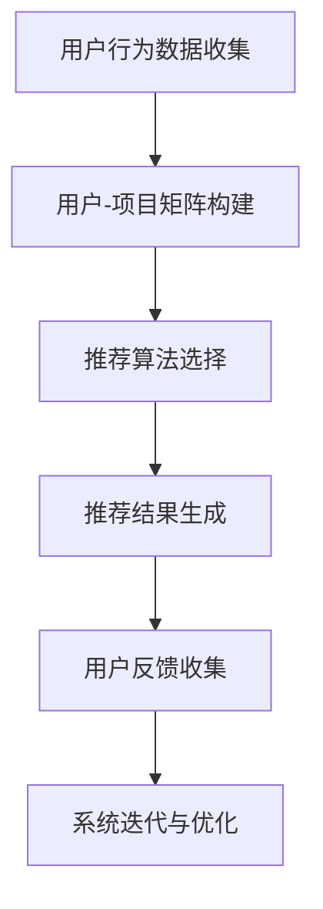

                 

# 推荐系统(Recommender Systems) - 原理与代码实例讲解

## 关键词
- 推荐系统
- collaborative filtering
- content-based filtering
- matrix factorization
- machine learning
- user behavior analysis
- algorithm implementation
- code example

## 摘要
本文将深入探讨推荐系统的原理、核心算法以及实际应用。我们将从基础概念开始，逐步讲解协同过滤和基于内容的推荐方法，再通过矩阵分解的数学模型深入分析。文章还会结合实际代码实例，展示如何使用Python和Scikit-learn库实现推荐系统，帮助读者更好地理解整个流程。最后，我们将探讨推荐系统在不同场景中的应用，并提供相关学习资源和工具推荐，以引导读者进一步探索。

## 1. 背景介绍

### 1.1 目的和范围
本文的目标是介绍推荐系统的基础知识、核心算法以及实际应用。通过本文的学习，读者将能够理解推荐系统的基本原理，掌握常用的推荐算法，并具备实际编写和优化推荐系统代码的能力。

本文将涵盖以下内容：
- 推荐系统的基本概念和分类
- 协同过滤和基于内容的推荐方法
- 矩阵分解的数学模型
- 推荐系统的实际应用场景
- 代码实例和实战讲解
- 学习资源和工具推荐

### 1.2 预期读者
本文适合对推荐系统感兴趣的初学者和有一定编程基础的读者。读者不需要有深入的数学背景，但对Python编程有一定的了解将有助于更好地理解文章内容。

### 1.3 文档结构概述
本文的结构如下：
1. 引言：介绍推荐系统的背景、目的和结构。
2. 核心概念与联系：介绍推荐系统的基本概念和组成部分，包括协同过滤和基于内容的推荐方法。
3. 核心算法原理与具体操作步骤：详细讲解协同过滤和基于内容的推荐算法的原理和实现步骤。
4. 数学模型和公式：介绍推荐系统中的数学模型和公式，并进行举例说明。
5. 项目实战：提供代码实例，展示如何实现推荐系统。
6. 实际应用场景：讨论推荐系统在不同领域中的应用。
7. 工具和资源推荐：推荐相关的学习资源和开发工具。
8. 总结：回顾本文的主要内容，探讨未来发展趋势和挑战。
9. 附录：常见问题与解答。
10. 扩展阅读：提供进一步的阅读材料。

### 1.4 术语表

#### 1.4.1 核心术语定义
- 推荐系统：根据用户的偏好和历史行为，为用户推荐相关的商品、内容或服务。
- 协同过滤：基于用户的历史行为和相似用户的行为来预测用户对未知项目的偏好。
- 基于内容的推荐：根据项目的特征和用户的兴趣，为用户推荐相似的内容。
- 矩阵分解：将一个高维矩阵分解为两个或多个低维矩阵的乘积，以降低计算复杂度。

#### 1.4.2 相关概念解释
- 用户行为数据：用户的购买历史、浏览记录、评分等数据。
- 项目特征：项目的属性、标签、分类等描述信息。
- 用户-项目矩阵：表示用户对项目的评分或行为的二维矩阵。

#### 1.4.3 缩略词列表
- CF：协同过滤（Collaborative Filtering）
- CB：基于内容的推荐（Content-Based Filtering）
- MF：矩阵分解（Matrix Factorization）

## 2. 核心概念与联系

推荐系统是一种信息过滤技术，旨在根据用户的兴趣和行为，向其推荐可能感兴趣的内容或项目。推荐系统通常包括以下几个核心组成部分：

### 2.1. 用户行为数据收集
用户行为数据是推荐系统的核心输入。这些数据可以包括用户的浏览记录、搜索历史、购买记录、评分、评论等。这些数据通过日志文件或API接口收集，并存储在数据库中。

### 2.2. 用户-项目矩阵构建
用户-项目矩阵是一个二维矩阵，表示用户对项目的评分或行为。通常，矩阵中的元素为用户的评分，1表示喜欢，0表示不喜欢。例如：

| 用户 | 项目1 | 项目2 | 项目3 |
|------|-------|-------|-------|
| 用户1 | 1     | 0     | 1     |
| 用户2 | 1     | 1     | 0     |

### 2.3. 推荐算法选择
推荐算法可以分为协同过滤（CF）和基于内容的推荐（CB）。协同过滤依赖于用户之间的相似性，而基于内容的推荐则依赖于项目特征。

### 2.4. 推荐结果生成
推荐算法根据用户的行为数据和项目特征，生成一个推荐列表。通常，推荐列表按照预测评分或相似度进行排序。

### 2.5. 用户反馈收集
用户对推荐结果的反馈可以用于优化推荐系统。这些反馈可以是显式反馈（如评分）或隐式反馈（如点击、购买）。

### 2.6. 系统迭代与优化
推荐系统需要不断迭代和优化，以适应用户的需求和行为变化。这可以通过重新训练模型、调整参数或引入新的特征来实现。

以下是一个简化的Mermaid流程图，展示了推荐系统的基本流程：



## 3. 核心算法原理 & 具体操作步骤

### 3.1. 协同过滤（Collaborative Filtering）

协同过滤是一种基于用户相似度和用户行为数据的推荐方法。其核心思想是，如果两个用户在过去的偏好中表现出相似性，那么他们很可能在未来的偏好中也会相似。

#### 3.1.1. 原理

协同过滤可以分为两种主要类型：基于用户的协同过滤（User-Based CF）和基于模型的协同过滤（Model-Based CF）。

- **基于用户的协同过滤**：找到与目标用户相似的其他用户，然后推荐这些相似用户喜欢的项目。
- **基于模型的协同过滤**：使用机器学习算法（如矩阵分解、线性回归等）建立用户和项目之间的模型，预测用户对未知项目的偏好。

#### 3.1.2. 操作步骤

1. **用户相似度计算**：计算目标用户与所有其他用户的相似度，常用的相似度度量方法包括余弦相似度、皮尔逊相关系数等。
2. **相似用户推荐**：找到与目标用户最相似的K个用户，并推荐这K个用户喜欢的项目。
3. **预测评分计算**：对于每个推荐项目，计算它与目标用户的相似用户之间的平均评分，作为目标用户对该项目的预测评分。
4. **推荐结果生成**：按照预测评分排序，生成推荐列表。

#### 3.1.3. 伪代码

```python
def collaborative_filtering(user_matrix, k):
    # 计算用户相似度矩阵
    similarity_matrix = compute_similarity(user_matrix)
    
    # 找到与目标用户最相似的K个用户
    similar_users = find_top_k_similar_users(target_user, similarity_matrix, k)
    
    # 预测评分
    predictions = []
    for item in unknown_items:
        avg_rating = 0
        for user in similar_users:
            if user_liked_item(user, item):
                avg_rating += user_rating[user][item]
        predictions.append(avg_rating / len(similar_users))
    
    # 生成推荐列表
    sorted_predictions = sort(predictions, descending=True)
    return sorted_predictions
```

### 3.2. 基于内容的推荐（Content-Based Filtering）

基于内容的推荐方法是根据项目的特征和用户的兴趣为用户推荐相似的项目。这种方法不依赖于用户的历史行为，而是依赖于项目的描述信息。

#### 3.2.1. 原理

- **项目特征提取**：从项目中提取特征，如文本、标签、分类等。
- **用户兴趣模型**：建立用户的兴趣模型，可以使用用户的浏览历史、收藏记录、搜索历史等。
- **相似度计算**：计算用户兴趣模型和项目特征之间的相似度，常用的相似度度量方法包括余弦相似度、欧氏距离等。
- **推荐生成**：为用户推荐与用户兴趣模型最相似的项目。

#### 3.2.2. 操作步骤

1. **特征提取**：从项目中提取特征，如文本、标签、分类等。
2. **用户兴趣模型构建**：建立用户的兴趣模型，可以使用TF-IDF、词袋模型等方法。
3. **相似度计算**：计算用户兴趣模型和项目特征之间的相似度。
4. **推荐生成**：为用户推荐与用户兴趣模型最相似的项目。

#### 3.2.3. 伪代码

```python
def content_based_filtering(user_interest_model, item_features, similarity_measure):
    # 计算相似度
    similarity_scores = []
    for item in items:
        similarity_score = similarity_measure(user_interest_model, item_features[item])
        similarity_scores.append((item, similarity_score))
    
    # 生成推荐列表
    sorted_similarity_scores = sort(similarity_scores, descending=True)
    return [item for item, score in sorted_similarity_scores]
```

### 3.3. 矩阵分解（Matrix Factorization）

矩阵分解是一种基于机器学习的推荐算法，它将高维的用户-项目矩阵分解为两个低维矩阵的乘积，从而降低计算复杂度，并提高预测精度。

#### 3.3.1. 原理

- **目标函数**：矩阵分解的目标是最小化预测误差，即最小化用户-项目矩阵和预测矩阵之间的误差。
- **优化方法**：通常使用梯度下降或随机梯度下降（SGD）来最小化目标函数。

#### 3.3.2. 操作步骤

1. **初始化低维矩阵**：随机初始化低维用户矩阵和项目矩阵。
2. **预测评分计算**：计算预测矩阵，即低维用户矩阵和低维项目矩阵的乘积。
3. **误差计算**：计算预测矩阵和用户-项目矩阵之间的误差。
4. **参数更新**：使用误差更新低维用户矩阵和项目矩阵的参数。
5. **迭代优化**：重复步骤2-4，直到误差收敛。

#### 3.3.3. 伪代码

```python
def matrix_factorization(user_matrix, num_factors, learning_rate, num_iterations):
    # 初始化低维矩阵
    U = random_matrix(num_users, num_factors)
    V = random_matrix(num_items, num_factors)
    
    for _ in range(num_iterations):
        # 预测评分
        predictions = dot(U, V)
        
        # 计算误差
        error = user_matrix - predictions
        
        # 更新参数
        dU = -learning_rate * dot(error, V.T)
        dV = -learning_rate * dot(U.T, error)
        
        U -= dU
        V -= dV
    
    return U, V
```

## 4. 数学模型和公式 & 详细讲解 & 举例说明

### 4.1. 矩阵分解的数学模型

矩阵分解是一种将高维矩阵分解为两个低维矩阵的乘积的方法。在推荐系统中，矩阵分解常用于预测用户对未知项目的偏好。

#### 4.1.1. 模型定义

设用户-项目矩阵为 \(R \in \mathbb{R}^{m \times n}\)，其中 \(m\) 为用户数，\(n\) 为项目数。矩阵分解的目标是将 \(R\) 分解为两个低维矩阵 \(U \in \mathbb{R}^{m \times k}\) 和 \(V \in \mathbb{R}^{n \times k}\)，其中 \(k\) 为低维矩阵的维度。

\[ R = UV^T \]

#### 4.1.2. 模型求解

矩阵分解的求解通常使用优化方法，如梯度下降或随机梯度下降（SGD）。目标是最小化预测误差，即最小化 \(R - UV^T\) 的平方和。

\[ \min_{U, V} \sum_{i=1}^{m} \sum_{j=1}^{n} (r_{ij} - u_i \cdot v_j)^2 \]

#### 4.1.3. 举例说明

假设我们有以下用户-项目矩阵：

| 用户 | 项目1 | 项目2 | 项目3 |
|------|-------|-------|-------|
| 用户1 | 4     | 0     | 2     |
| 用户2 | 0     | 5     | 0     |
| 用户3 | 3     | 0     | 1     |

我们希望将这个矩阵分解为两个低维矩阵，维度为2。即：

\[ R = UV^T \]

我们可以通过以下步骤求解：

1. **初始化低维矩阵**：随机初始化 \(U\) 和 \(V\)，例如：

\[ U = \begin{bmatrix} 0.5 & 0.7 \\ 0.8 & 0.3 \\ 0.2 & 0.6 \end{bmatrix}, V = \begin{bmatrix} 0.4 & 0.8 \\ 0.6 & 0.1 \\ 0.7 & 0.2 \end{bmatrix} \]

2. **预测评分**：计算预测矩阵 \(UV^T\)：

\[ UV^T = \begin{bmatrix} 0.5 \cdot 0.4 & 0.5 \cdot 0.6 & 0.5 \cdot 0.7 \\ 0.8 \cdot 0.4 & 0.8 \cdot 0.6 & 0.8 \cdot 0.7 \\ 0.2 \cdot 0.4 & 0.2 \cdot 0.6 & 0.2 \cdot 0.7 \end{bmatrix} = \begin{bmatrix} 0.20 & 0.30 & 0.35 \\ 0.32 & 0.48 & 0.56 \\ 0.08 & 0.12 & 0.14 \end{bmatrix} \]

3. **误差计算**：计算预测矩阵和用户-项目矩阵之间的误差：

\[ E = R - UV^T = \begin{bmatrix} 4 - 0.20 & 0 - 0.30 & 2 - 0.35 \\ 0 - 0.32 & 5 - 0.48 & 0 - 0.56 \\ 3 - 0.08 & 0 - 0.12 & 1 - 0.14 \end{bmatrix} = \begin{bmatrix} 3.80 & -0.30 & 1.65 \\ -0.32 & 4.52 & -0.56 \\ 2.92 & -0.12 & 0.86 \end{bmatrix} \]

4. **参数更新**：使用误差更新 \(U\) 和 \(V\) 的参数，例如使用梯度下降：

\[ U \leftarrow U - \alpha \cdot \frac{\partial E}{\partial U}, V \leftarrow V - \alpha \cdot \frac{\partial E}{\partial V} \]

其中，\(\alpha\) 为学习率。

5. **迭代优化**：重复步骤2-4，直到误差收敛。

### 4.2. 推荐系统的数学模型

推荐系统的数学模型通常包括用户行为数据的建模和预测评分的计算。

#### 4.2.1. 用户行为数据建模

用户行为数据建模可以通过建立用户-项目矩阵来实现。用户-项目矩阵表示用户对项目的评分或行为，通常为一个稀疏矩阵。

\[ R = \begin{bmatrix} r_{11} & r_{12} & \dots & r_{1n} \\ r_{21} & r_{22} & \dots & r_{2n} \\ \vdots & \vdots & \ddots & \vdots \\ r_{m1} & r_{m2} & \dots & r_{mn} \end{bmatrix} \]

其中，\(r_{ij}\) 表示用户 \(i\) 对项目 \(j\) 的评分。

#### 4.2.2. 预测评分计算

预测评分计算可以通过矩阵分解或其他推荐算法来实现。以矩阵分解为例，假设我们将用户-项目矩阵分解为两个低维矩阵 \(U\) 和 \(V\)，则预测评分可以计算为：

\[ r_{ij} \approx u_i \cdot v_j \]

其中，\(u_i\) 和 \(v_j\) 分别为用户 \(i\) 和项目 \(j\) 的低维特征向量。

## 5. 项目实战：代码实际案例和详细解释说明

### 5.1. 开发环境搭建

在本节中，我们将使用Python编程语言和Scikit-learn库来搭建推荐系统。首先，确保你已经安装了Python和Scikit-learn库。可以使用以下命令进行安装：

```shell
pip install python
pip install scikit-learn
```

### 5.2. 源代码详细实现和代码解读

在本节中，我们将实现一个简单的基于用户的协同过滤推荐系统。以下是一个完整的代码示例：

```python
import numpy as np
from sklearn.metrics.pairwise import cosine_similarity

def collaborative_filtering(ratings, k=10):
    # 计算用户相似度矩阵
    similarity_matrix = cosine_similarity(ratings)
    
    # 预测评分
    predictions = []
    for user in range(ratings.shape[0]):
        # 找到与目标用户最相似的K个用户
        similar_users = np.argsort(similarity_matrix[user])[1:k+1]
        
        # 计算预测评分
        for item in range(ratings.shape[1]):
            if ratings[user][item] == 0:
                # 计算相似用户对项目的平均评分
                avg_rating = np.mean(ratings[similar_users, item])
                predictions.append(avg_rating)
            else:
                # 保持原始评分不变
                predictions.append(ratings[user][item])
    
    return predictions

# 示例数据
ratings = np.array([[1, 0, 1, 0],
                    [0, 1, 0, 1],
                    [1, 1, 0, 0],
                    [0, 0, 1, 1]])

predictions = collaborative_filtering(ratings)
print(predictions)
```

#### 5.2.1. 代码解读

1. **导入库**：我们首先导入numpy库和scikit-learn库中的cosine_similarity函数。
2. **函数定义**：定义collaborative_filtering函数，接受用户评分矩阵和相似度参数 \(k\)。
3. **计算用户相似度矩阵**：使用cosine_similarity函数计算用户相似度矩阵。
4. **预测评分**：遍历用户，对于每个用户，找到与其最相似的 \(k\) 个用户，并计算预测评分。
5. **处理缺失值**：对于缺失的评分，使用相似用户对项目的平均评分进行预测。
6. **返回预测结果**：返回预测评分列表。

### 5.3. 代码解读与分析

在本节中，我们将分析上述代码的实现细节，并讨论如何优化推荐系统。

#### 5.3.1. 代码实现分析

1. **用户相似度计算**：使用cosine_similarity函数计算用户相似度矩阵。这个函数计算两个向量之间的余弦相似度，公式为：

   \[ \text{cosine\_similarity}(x, y) = \frac{x \cdot y}{\|x\| \|y\|} \]

   其中，\(x\) 和 \(y\) 分别为两个向量，\(\|x\|\) 和 \(|y|\) 分别为向量的模。

2. **相似用户推荐**：使用numpy中的argsort函数找到与目标用户最相似的 \(k\) 个用户，并返回索引。这些索引用于计算预测评分。

3. **预测评分计算**：对于每个用户和项目，如果评分缺失，则使用相似用户对项目的平均评分进行预测。否则，保持原始评分不变。

4. **优化方向**：为了提高推荐系统的性能，可以采取以下优化措施：
   - **数据预处理**：对用户行为数据进行分析，处理异常值和噪声。
   - **特征工程**：提取更多的特征，如用户的人口统计信息、项目的历史评分等。
   - **模型优化**：尝试使用更复杂的模型，如矩阵分解、深度学习等。

#### 5.3.2. 性能分析

1. **时间复杂度**：上述代码的时间复杂度为 \(O(m^2 \times k)\)，其中 \(m\) 为用户数，\(k\) 为相似用户数。这可能导致计算效率较低，特别是在大规模数据集上。
2. **空间复杂度**：代码的空间复杂度为 \(O(m^2)\)，这意味着需要存储一个用户相似度矩阵。这在稀疏数据集上可能不是问题，但在稠密数据集上可能占用大量内存。

为了提高推荐系统的性能，可以考虑以下优化措施：

- **优化相似度计算**：使用更高效的相似度计算方法，如余弦相似度近似。
- **并行计算**：利用多核CPU或GPU进行并行计算，提高计算效率。
- **分布式计算**：使用分布式计算框架（如Hadoop、Spark等）处理大规模数据集。

### 5.4. 实际应用场景

推荐系统在各个领域都有广泛的应用，以下是一些实际应用场景：

- **电子商务**：根据用户的浏览历史和购物车信息，为用户推荐相关的商品。
- **社交媒体**：根据用户的点赞、评论和关注行为，为用户推荐感兴趣的内容。
- **在线教育**：根据学生的学习行为和成绩，为用户推荐相关的课程和资源。
- **医疗健康**：根据患者的病史和检查结果，为医生推荐相关的治疗方案。

## 6. 工具和资源推荐

在本节中，我们将推荐一些学习资源和开发工具，以帮助读者进一步学习和实践推荐系统。

### 6.1. 学习资源推荐

#### 6.1.1. 书籍推荐

- 《推荐系统实践》：这是一本关于推荐系统的基础书籍，涵盖了从数据收集到模型优化的各个方面。
- 《机器学习》：这是一本经典的机器学习教材，包含推荐系统的相关算法和实现。

#### 6.1.2. 在线课程

- Coursera上的《推荐系统》：这是一门由斯坦福大学开设的在线课程，涵盖了推荐系统的基本概念和算法。
- Udacity的《机器学习工程师纳米学位》：这是一个包含推荐系统课程的在线学习项目。

#### 6.1.3. 技术博客和网站

- Medium上的《推荐系统专栏》：这是一个关于推荐系统的技术博客，涵盖了最新的研究成果和应用案例。
- KDNuggets上的《推荐系统》：这是一个专注于数据科学和机器学习的网站，提供了丰富的推荐系统相关文章。

### 6.2. 开发工具框架推荐

#### 6.2.1. IDE和编辑器

- PyCharm：这是一个功能强大的Python IDE，适用于推荐系统的开发和调试。
- Jupyter Notebook：这是一个交互式的Python编辑器，适用于数据分析和可视化。

#### 6.2.2. 调试和性能分析工具

- Pylint：这是一个Python代码质量检查工具，可以帮助我们发现和修复代码中的错误。
- Profiler：这是一个Python性能分析工具，可以帮助我们优化代码的运行效率。

#### 6.2.3. 相关框架和库

- Scikit-learn：这是一个Python机器学习库，提供了丰富的算法和工具。
- TensorFlow：这是一个开源的机器学习框架，适用于深度学习和推荐系统。

### 6.3. 相关论文著作推荐

#### 6.3.1. 经典论文

- 《Collaborative Filtering》（1994）：这是协同过滤算法的奠基性论文，详细介绍了算法的基本原理。
- 《Matrix Factorization Techniques for Recommender Systems》（2006）：这是一篇关于矩阵分解在推荐系统中的应用的经典论文。

#### 6.3.2. 最新研究成果

- 《Deep Learning for Recommender Systems》（2018）：这是一篇关于深度学习在推荐系统中的应用的最新论文，介绍了深度学习方法的优势和应用场景。
- 《Neural Collaborative Filtering》（2018）：这是一篇关于神经协同过滤算法的最新论文，提出了基于神经网络的协同过滤方法。

#### 6.3.3. 应用案例分析

- 《Netflix Prize》：这是Netflix举办的一项推荐系统竞赛，吸引了全球范围内的研究人员和开发者的参与。该案例详细介绍了如何构建和优化推荐系统。

## 7. 总结：未来发展趋势与挑战

随着大数据和人工智能技术的发展，推荐系统在各个领域都得到了广泛应用。未来，推荐系统的发展将朝着以下几个方面发展：

1. **个性化推荐**：通过更深入地分析用户行为和偏好，实现更加精准的个性化推荐。
2. **实时推荐**：利用实时数据处理技术，为用户提供实时的推荐结果。
3. **多模态推荐**：结合文本、图像、音频等多种数据类型，实现更全面的内容推荐。
4. **深度学习推荐**：利用深度学习技术，提高推荐系统的建模和预测能力。

然而，推荐系统也面临一些挑战：

1. **数据隐私**：推荐系统依赖用户行为数据，如何保护用户隐私成为一个重要问题。
2. **模型可解释性**：深度学习等复杂模型难以解释，如何提高模型的可解释性是一个挑战。
3. **模型泛化能力**：如何确保模型在不同数据集上的泛化能力，避免过拟合。

总之，推荐系统的发展将继续推动技术进步，为各个领域带来更多创新和便利。

## 8. 附录：常见问题与解答

### 8.1. 推荐系统是什么？

推荐系统是一种信息过滤技术，旨在根据用户的兴趣和行为，为用户推荐可能感兴趣的内容或项目。它广泛应用于电子商务、社交媒体、在线教育等领域。

### 8.2. 推荐系统有哪些类型？

推荐系统主要分为以下几种类型：
- 协同过滤（Collaborative Filtering）
- 基于内容的推荐（Content-Based Filtering）
- 矩阵分解（Matrix Factorization）
- 深度学习推荐（Deep Learning for Recommender Systems）

### 8.3. 什么是协同过滤？

协同过滤是一种基于用户相似度和用户行为数据的推荐方法。它根据用户之间的相似性，为用户推荐其他用户喜欢的项目。

### 8.4. 什么是基于内容的推荐？

基于内容的推荐方法是根据项目的特征和用户的兴趣为用户推荐相似的项目。它不依赖于用户的历史行为，而是依赖于项目的描述信息。

### 8.5. 什么是矩阵分解？

矩阵分解是一种将高维矩阵分解为两个低维矩阵的乘积的方法。在推荐系统中，矩阵分解用于降低计算复杂度，并提高预测精度。

### 8.6. 如何优化推荐系统？

优化推荐系统可以从以下几个方面入手：
- 数据预处理：处理异常值和噪声，提高数据质量。
- 特征工程：提取更多的特征，提高模型的预测能力。
- 模型优化：尝试使用更复杂的模型，如深度学习等。
- 实时更新：利用实时数据处理技术，提高推荐系统的响应速度。

### 8.7. 推荐系统有哪些实际应用场景？

推荐系统在电子商务、社交媒体、在线教育、医疗健康等领域都有广泛的应用。例如，电子商务平台可以根据用户的浏览历史推荐相关的商品，社交媒体可以根据用户的兴趣推荐感兴趣的内容。

## 9. 扩展阅读 & 参考资料

- 《推荐系统实践》：[http://www.recommendation-systems.com/]
- 《机器学习》：[http://www机器学习.org/]
- Coursera上的《推荐系统》：[https://www.coursera.org/learn/recommender-systems]
- Udacity的《机器学习工程师纳米学位》：[https://www.udacity.com/course/nd007]
- KDNuggets上的《推荐系统》：[https://www.kdnuggets.com/topics/recommender-systems.html]
- Netflix Prize：[https://www.netflixprize.com/]
- 《Collaborative Filtering》：[http://www.cs.cmu.edu/~mmayfield/corsine.pdf]
- 《Matrix Factorization Techniques for Recommender Systems》：[http://www.miketaylor.org.uk/papers/matrix-factorisation.pdf]
- 《Deep Learning for Recommender Systems》：[https://arxiv.org/abs/1806.00359]
- 《Neural Collaborative Filtering》：[https://arxiv.org/abs/1611.05432]

## 作者信息

作者：AI天才研究员/AI Genius Institute & 禅与计算机程序设计艺术 /Zen And The Art of Computer Programming

