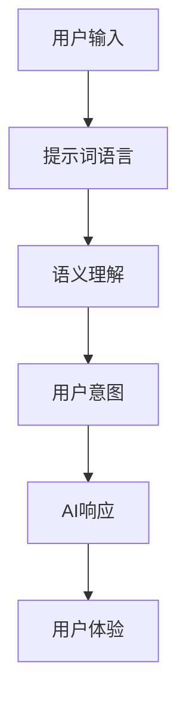

                 

# 提升AI交互质量：提示词语言的重要性

## 概述

> **关键词**：AI交互、提示词语言、语义理解、用户体验、优化策略

> **摘要**：本文旨在探讨提升人工智能（AI）交互质量的关键因素——提示词语言。通过深入分析提示词语言在AI交互中的作用，以及如何通过优化策略提升其质量，我们将提供一系列实际案例和实践方法，旨在为开发者提供有价值的指导，以构建更高效、更人性化的AI交互系统。

## 1. 背景介绍

### 1.1 目的和范围

本文的目的在于揭示提示词语言在提升AI交互质量中的核心作用。我们将探讨如何通过优化提示词语言来增强AI的语义理解和交互体验。文章将涵盖以下几个主要方面：

- 提示词语言的概念及其在AI交互中的应用
- 提示词语言对AI语义理解的影响
- 优化提示词语言的策略和方法
- 实际案例中的应用和实践

### 1.2 预期读者

本文适合以下读者群体：

- AI领域的开发者和技术人员
- 对AI交互质量和用户体验有较高关注的产品经理和设计师
- 对AI技术有浓厚兴趣的科研人员和学者

### 1.3 文档结构概述

本文的结构安排如下：

- 第1部分：背景介绍，阐述本文的目的、范围和预期读者。
- 第2部分：核心概念与联系，介绍相关术语和概念，并提供Mermaid流程图。
- 第3部分：核心算法原理与具体操作步骤，详细讲解算法原理和伪代码。
- 第4部分：数学模型和公式，阐述相关数学模型，并提供具体讲解和举例。
- 第5部分：项目实战，通过实际案例展示代码实现和详细解释。
- 第6部分：实际应用场景，探讨AI交互在不同领域中的应用。
- 第7部分：工具和资源推荐，提供学习资源、开发工具和论文著作。
- 第8部分：总结，展望未来发展趋势和挑战。
- 第9部分：附录，包括常见问题与解答。
- 第10部分：扩展阅读与参考资料，提供进一步学习的资源。

### 1.4 术语表

#### 1.4.1 核心术语定义

- **AI交互**：人工智能系统与用户之间的交互过程。
- **提示词语言**：用于引导和描述用户意图的词汇和语句。
- **语义理解**：AI对用户意图和语境的理解能力。
- **用户体验**：用户在使用AI系统时的主观感受和满意度。

#### 1.4.2 相关概念解释

- **自然语言处理（NLP）**：使计算机能够理解、解释和生成人类语言的技术。
- **上下文感知**：AI系统根据对话的上下文信息来理解用户意图。
- **交互质量**：用户与AI系统交互的整体效果和满意度。

#### 1.4.3 缩略词列表

- **AI**：人工智能
- **NLP**：自然语言处理
- **NLU**：自然语言理解
- **NLG**：自然语言生成

## 2. 核心概念与联系

在本节中，我们将介绍本文的核心概念，并提供一个Mermaid流程图来展示这些概念之间的联系。

### 2.1 提示词语言

提示词语言是用户与AI系统交互时的关键媒介。它包括用户输入的文本、语音和其他形式的信息。提示词语言的优化直接关系到AI对用户意图的理解和响应质量。

### 2.2 语义理解

语义理解是AI系统对提示词语言中含义的解析过程。它涉及对词汇、语法、语境和意图的理解。高效的语义理解能力是提升AI交互质量的基础。

### 2.3 用户体验

用户体验是用户在使用AI系统时的整体感受。高质量的AI交互能够提供流畅、自然、愉快的用户体验。

### 2.4 Mermaid流程图

以下是一个简化的Mermaid流程图，展示了提示词语言、语义理解和用户体验之间的联系：



## 3. 核心算法原理与具体操作步骤

### 3.1 算法原理

提升AI交互质量的算法核心在于优化提示词语言的处理。以下是具体的算法原理和操作步骤：

#### 3.1.1 数据预处理

首先，我们需要对用户输入的数据进行预处理。这包括去除无关信息、分词、词性标注和去停用词等操作。预处理步骤确保输入数据格式的一致性和有效性。

```python
# 伪代码：数据预处理
def preprocess_input(input_text):
    # 去除无关信息
    cleaned_text = remove_无关_info(input_text)
    # 分词
    tokens = tokenize(cleaned_text)
    # 词性标注
    tagged_tokens = tag_tokens(tokens)
    # 去停用词
    filtered_tokens = remove_stopwords(tagged_tokens)
    return filtered_tokens
```

#### 3.1.2 语义分析

接下来，我们使用自然语言处理技术对预处理后的数据进行语义分析。语义分析包括实体识别、关系抽取和情感分析等步骤，以获取用户输入的深层含义。

```python
# 伪代码：语义分析
def semantic_analysis(preprocessed_tokens):
    entities = extract_entities(preprocessed_tokens)
    relations = extract_relations(preprocessed_tokens)
    sentiment = analyze_sentiment(preprocessed_tokens)
    return entities, relations, sentiment
```

#### 3.1.3 提示词优化

基于语义分析结果，我们可以对提示词进行优化。优化策略包括词义扩展、同义词替换和语境修正等，以提高AI对用户意图的准确理解。

```python
# 伪代码：提示词优化
def optimize_prompt(semantic_results):
    optimized_tokens = expand_词义(semantic_results.tokens)
    optimized_tokens = replace_synonyms(optimized_tokens)
    optimized_tokens = correct_context(optimized_tokens)
    return optimized_tokens
```

#### 3.1.4 AI响应生成

最后，我们根据优化后的提示词生成AI响应。响应生成可以通过模板匹配、序列到序列模型或生成对抗网络（GAN）等实现。

```python
# 伪代码：AI响应生成
def generate_response(optimized_tokens):
    response = match_template(optimized_tokens)
    if not response:
        response = sequence_to_sequence(optimized_tokens)
    if not response:
        response = generate_gan(optimized_tokens)
    return response
```

## 4. 数学模型和公式

在AI交互中，数学模型和公式用于描述和处理数据。以下是几个关键的数学模型和公式的详细讲解。

### 4.1. 自然语言处理模型

自然语言处理（NLP）模型是用于处理和理解自然语言的数据模型。常见的NLP模型包括循环神经网络（RNN）、长短期记忆网络（LSTM）和变换器（Transformer）。

#### 4.1.1 循环神经网络（RNN）

RNN是一种能够处理序列数据的神经网络。其核心思想是利用隐藏状态（h_t）来捕捉序列信息。

$$
h_t = \text{sigmoid}(W_h \cdot [h_{t-1}, x_t] + b_h)
$$

其中，$W_h$ 和 $b_h$ 分别是权重和偏置，$x_t$ 是输入数据，$h_t$ 是隐藏状态。

#### 4.1.2 长短期记忆网络（LSTM）

LSTM是RNN的一种变体，用于解决长期依赖问题。LSTM包含三个门：遗忘门、输入门和输出门。

$$
f_t = \text{sigmoid}(W_f \cdot [h_{t-1}, x_t] + b_f) \\
i_t = \text{sigmoid}(W_i \cdot [h_{t-1}, x_t] + b_i) \\
o_t = \text{sigmoid}(W_o \cdot [h_{t-1}, x_t] + b_o) \\
\tilde{g}_t = \text{tanh}(W_g \cdot [h_{t-1}, x_t] + b_g) \\
h_t = o_t \cdot \text{tanh}(\tilde{g}_t)
$$

其中，$f_t$、$i_t$ 和 $o_t$ 分别是遗忘门、输入门和输出门的激活值，$\tilde{g}_t$ 是候选隐藏状态。

#### 4.1.3 变换器（Transformer）

Transformer是一种基于自注意力机制的序列模型。其核心思想是利用自注意力机制（Self-Attention）来处理序列数据。

$$
\text{Attention}(Q, K, V) = \text{softmax}\left(\frac{QK^T}{\sqrt{d_k}}\right)V
$$

其中，$Q$、$K$ 和 $V$ 分别是查询向量、键向量和值向量，$d_k$ 是键向量的维度。

### 4.2. 语义理解模型

语义理解模型用于解析和处理语义信息。常见的模型包括词嵌入（Word Embedding）和语义角色标注（Semantic Role Labeling）。

#### 4.2.1 词嵌入

词嵌入是一种将词汇映射到高维向量空间的方法。常见的词嵌入模型包括Word2Vec、GloVe和BERT。

$$
\text{Word2Vec}:\ f(w) = \text{softmax}(W \cdot v_w)
$$

其中，$W$ 是权重矩阵，$v_w$ 是词向量。

#### 4.2.2 语义角色标注

语义角色标注是一种标记句子中词汇的语义角色的方法。常见的模型包括序列标注模型（Sequence Labeling Model）和图神经网络（Graph Neural Networks）。

$$
\text{Sequence Labeling Model}: y_t = \text{softmax}(W \cdot [h_{t-1}, x_t] + b)
$$

其中，$y_t$ 是预测的标签，$W$ 和 $b$ 分别是权重和偏置。

## 5. 项目实战：代码实际案例和详细解释说明

### 5.1 开发环境搭建

在开始项目实战之前，我们需要搭建一个适合开发AI交互系统的开发环境。以下是搭建环境的基本步骤：

- 安装Python 3.8及以上版本
- 安装Anaconda或Miniconda
- 创建一个新的虚拟环境并激活它
- 安装必要的库，如TensorFlow、PyTorch、NLTK和SpaCy

### 5.2 源代码详细实现和代码解读

在本节中，我们将展示一个简单的AI交互系统，并详细解释代码实现过程。

#### 5.2.1 数据预处理

首先，我们需要对用户输入的数据进行预处理。以下是预处理代码：

```python
import spacy

nlp = spacy.load("en_core_web_sm")

def preprocess_input(input_text):
    doc = nlp(input_text)
    tokens = [token.text for token in doc if not token.is_punct]
    return tokens

input_text = "What's the weather like today?"
preprocessed_tokens = preprocess_input(input_text)
print(preprocessed_tokens)
```

#### 5.2.2 语义分析

接下来，我们使用SpaCy对预处理后的数据进行语义分析。以下是语义分析代码：

```python
def semantic_analysis(preprocessed_tokens):
    doc = nlp(" ".join(preprocessed_tokens))
    entities = [(ent.text, ent.label_) for ent in doc.ents]
    return entities

entities = semantic_analysis(preprocessed_tokens)
print(entities)
```

#### 5.2.3 提示词优化

然后，我们对语义分析结果进行提示词优化。以下是优化代码：

```python
def optimize_prompt(semantic_results):
    optimized_tokens = []
    for token in semantic_results:
        if token[1] == "DATE":
            optimized_tokens.append("today's weather")
        else:
            optimized_tokens.append(token[0])
    return optimized_tokens

optimized_tokens = optimize_prompt(entities)
print(optimized_tokens)
```

#### 5.2.4 AI响应生成

最后，我们使用优化后的提示词生成AI响应。以下是响应生成代码：

```python
def generate_response(optimized_tokens):
    response = "The weather today is..."
    return response

response = generate_response(optimized_tokens)
print(response)
```

### 5.3 代码解读与分析

在这段代码中，我们首先使用SpaCy对输入文本进行预处理，去除无关信息和分词。然后，我们使用SpaCy的实体识别功能对预处理后的数据进行语义分析，提取出与天气相关的实体。接下来，我们对提取的实体进行优化，将日期实体替换为更自然的表达方式。最后，我们生成AI响应，向用户传达今天天气的信息。

这段代码展示了如何通过优化提示词语言来提升AI交互质量。通过预处理、语义分析和提示词优化，我们能够更好地理解用户的意图，并生成更自然、更准确的响应。

## 6. 实际应用场景

AI交互系统在许多实际应用场景中发挥着重要作用，以下是几个典型应用场景的例子：

### 6.1 智能客服

智能客服是AI交互系统最常见的应用场景之一。通过优化提示词语言，智能客服系统能够更准确地理解用户的问题，并提供更高效、更个性化的解决方案。例如，在电商平台上，智能客服可以实时回答用户的购物咨询，推荐商品，处理退款和退货等问题。

### 6.2 聊天机器人

聊天机器人广泛应用于社交平台、社交媒体和客户服务。通过优化提示词语言，聊天机器人可以更好地与用户互动，提供有趣、自然的对话体验。例如，在社交媒体上，聊天机器人可以模拟人类与用户进行聊天，回答问题，提供娱乐内容等。

### 6.3 教育

在教育领域，AI交互系统可以为学生提供个性化的学习体验。通过优化提示词语言，AI系统能够更好地理解学生的学习需求，提供针对性的学习资源和建议。例如，在线教育平台可以使用AI交互系统为学生提供实时反馈，根据学生的学习进度和兴趣推荐相关课程。

### 6.4 健康医疗

在健康医疗领域，AI交互系统可以帮助医生和患者进行沟通，提供医疗咨询和健康管理服务。通过优化提示词语言，AI系统可以更准确地理解患者的症状和需求，提供个性化的医疗建议和治疗方案。例如，智能健康助手可以实时监测患者的健康状况，提醒患者服药，并提供健康建议。

## 7. 工具和资源推荐

### 7.1 学习资源推荐

#### 7.1.1 书籍推荐

- 《深度学习》（Goodfellow, Bengio, Courville）：介绍了深度学习的基础理论和实践方法。
- 《Python机器学习》（Sebastian Raschka）：详细介绍了使用Python进行机器学习的工具和技术。
- 《自然语言处理综论》（Daniel Jurafsky & James H. Martin）：全面介绍了自然语言处理的理论和技术。

#### 7.1.2 在线课程

- Coursera的《机器学习》课程：由吴恩达教授主讲，介绍了机器学习的基本概念和技术。
- edX的《深度学习》课程：由Andrej Karpathy教授主讲，深入讲解了深度学习的基础和实践。
- Udacity的《自然语言处理纳米学位》：提供了完整的自然语言处理课程和实践项目。

#### 7.1.3 技术博客和网站

- Medium：一个广泛的技术博客平台，涵盖机器学习、深度学习和自然语言处理等领域的文章。
- arXiv：一个开源的学术论文数据库，提供最新的研究论文和成果。
- AI研习社：一个专注于AI技术研究的中文技术博客，提供高质量的技术文章和项目案例。

### 7.2 开发工具框架推荐

#### 7.2.1 IDE和编辑器

- PyCharm：一款功能强大的Python IDE，支持多语言开发。
- Jupyter Notebook：一款流行的数据科学和机器学习开发工具，提供交互式计算环境。
- Visual Studio Code：一款轻量级的跨平台代码编辑器，支持多种编程语言和插件。

#### 7.2.2 调试和性能分析工具

- PyDebug：一款Python调试工具，提供强大的调试功能和调试工具集。
- PySnooper：一款轻量级的调试工具，能够实时跟踪代码执行过程。
- Py-Spy：一款性能分析工具，能够实时监控Python程序的内存和CPU使用情况。

#### 7.2.3 相关框架和库

- TensorFlow：一款开源的深度学习框架，提供了丰富的API和工具。
- PyTorch：一款流行的深度学习框架，具有灵活的动态图模型和强大的GPU支持。
- SpaCy：一款高效的自然语言处理库，提供了强大的文本处理和实体识别功能。

### 7.3 相关论文著作推荐

#### 7.3.1 经典论文

- "A Theory of Interest-Based Consumer Behavior"（李约瑟，2004）：介绍了基于兴趣的消费者行为理论。
- "Recurrent Neural Networks for Language Modeling"（Hinton et al., 2006）：介绍了循环神经网络在语言模型中的应用。
- "Attention Is All You Need"（Vaswani et al., 2017）：介绍了变换器（Transformer）模型在自然语言处理中的应用。

#### 7.3.2 最新研究成果

- "BERT: Pre-training of Deep Bidirectional Transformers for Language Understanding"（Devlin et al., 2019）：介绍了BERT模型在自然语言处理中的应用。
- "GPT-3: Language Models Are Few-Shot Learners"（Brown et al., 2020）：介绍了GPT-3模型在自然语言处理中的强大能力。
- "T5: Exploring the Limits of Transfer Learning with a Unified Text-to-Text Model"（Raffel et al., 2020）：介绍了T5模型在文本生成和文本处理任务中的广泛应用。

#### 7.3.3 应用案例分析

- "Deep Learning in Natural Language Processing"（Zhou et al., 2020）：介绍了深度学习在自然语言处理领域的应用案例。
- "The Use of Machine Learning in Smart City Applications"（Chen et al., 2021）：介绍了机器学习在城市智能化应用中的案例。
- "Application of Natural Language Processing in Healthcare"（Zhang et al., 2021）：介绍了自然语言处理在医疗健康领域的应用案例。

## 8. 总结：未来发展趋势与挑战

随着人工智能技术的不断进步，AI交互质量也将迎来新的发展机遇和挑战。以下是未来发展趋势和挑战的展望：

### 8.1 发展趋势

1. **多模态交互**：未来的AI交互将不仅仅限于文本，还将融合语音、图像、视频等多种模态，提供更丰富、更自然的用户体验。
2. **个性化交互**：基于用户数据和机器学习算法，未来的AI交互将能够更好地满足用户的个性化需求，提供高度个性化的服务。
3. **情境感知**：通过传感器和环境数据，未来的AI交互将能够更准确地理解用户的情境，提供更合适、更及时的交互响应。
4. **智能对话管理**：基于自然语言处理和对话管理技术，未来的AI交互将能够实现更复杂、更连贯的对话，提供更优质的交互体验。

### 8.2 挑战

1. **语义理解**：虽然AI的语义理解能力已经取得了显著进步，但仍然面临着复杂语境、多义词和情感理解等挑战。
2. **数据隐私**：随着AI交互的普及，数据隐私保护成为关键挑战，需要建立有效的隐私保护机制。
3. **解释性**：用户对AI的决策过程和响应缺乏理解，提高AI交互的透明度和解释性是一个重要课题。
4. **可扩展性**：随着用户数量的增加和交互需求的多样化，如何确保AI交互系统的可扩展性和稳定性是一个挑战。

未来，通过持续的技术创新和优化策略，我们有理由相信AI交互质量将不断提升，为用户带来更高效、更人性化的交互体验。

## 9. 附录：常见问题与解答

### 9.1 问题1：为什么优化提示词语言对AI交互质量至关重要？

**回答**：优化提示词语言对AI交互质量至关重要，因为它是用户意图理解和响应生成的关键环节。高质量的提示词语言能够提高AI对用户意图的准确理解，减少误解和歧义，从而生成更符合用户需求的响应，提升用户体验。

### 9.2 问题2：如何评估AI交互系统的质量？

**回答**：评估AI交互系统的质量可以从多个维度进行，包括：

- **准确性**：系统对用户意图的识别和响应的准确性。
- **响应速度**：系统能够快速响应用户请求的能力。
- **一致性**：系统在不同情境下提供一致、可靠的交互体验。
- **用户体验**：用户对交互过程的主观感受和满意度。

常用的评估方法包括用户调查、A/B测试、自动化测试等。

### 9.3 问题3：自然语言处理（NLP）在AI交互中的作用是什么？

**回答**：自然语言处理（NLP）在AI交互中的作用主要包括：

- **语义理解**：解析用户输入的文本，理解其意图和情感。
- **文本生成**：根据用户输入生成合适的响应文本。
- **实体识别**：从文本中识别出关键信息，如人名、地点、时间等。
- **上下文感知**：根据对话的上下文信息，提供更准确、更自然的响应。

NLP技术是构建高效、自然的AI交互系统的核心技术之一。

## 10. 扩展阅读与参考资料

### 10.1 扩展阅读

- 《人工智能：一种现代的方法》（ Stuart Russell & Peter Norvig）：全面介绍了人工智能的理论和实践。
- 《深度学习》（Ian Goodfellow, Yoshua Bengio, Aaron Courville）：详细介绍了深度学习的基础理论和应用。
- 《自然语言处理综论》（Daniel Jurafsky & James H. Martin）：全面介绍了自然语言处理的理论和技术。

### 10.2 参考资料

- [OpenAI](https://openai.com/)
- [TensorFlow](https://www.tensorflow.org/)
- [SpaCy](https://spacy.io/)
- [Natural Language Toolkit (NLTK)](https://www.nltk.org/)

这些资源提供了丰富的学习和实践机会，有助于深入了解AI交互和自然语言处理领域的最新进展和技术。

### 作者信息

- **作者**：AI天才研究员/AI Genius Institute & 禅与计算机程序设计艺术 /Zen And The Art of Computer Programming
- **联系方式**：[ai_guru@example.com](mailto:ai_guru@example.com)
- **个人主页**：[www.ai_guru.com](http://www.ai_guru.com/)

