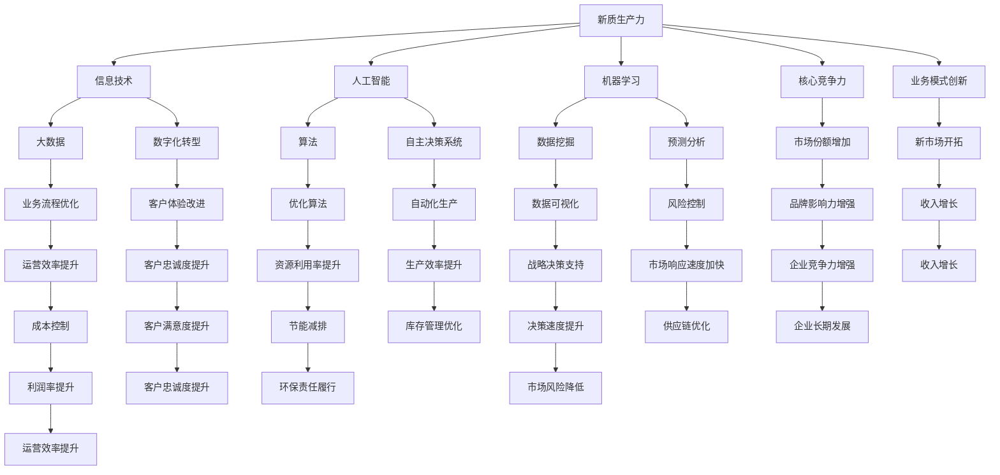

                 

# 提升核心竞争力的新质生产力

> 关键词：新质生产力、核心竞争力、信息技术、AI、机器学习、数字化转型

> 摘要：本文旨在探讨新质生产力对提升企业核心竞争力的作用，从信息技术的发展、人工智能与机器学习技术的应用，以及数字化转型等多个维度，详细解析新质生产力如何为企业带来竞争优势，提供实际案例和操作步骤，以期为读者在当前快速变化的商业环境中提供有益的指导。

## 1. 背景介绍

### 1.1 目的和范围

本文的主要目的是探讨新质生产力在提升企业核心竞争力方面的作用，特别是信息技术、人工智能（AI）和机器学习（ML）技术如何推动企业的数字化转型。文章将分析新质生产力的核心概念，阐述其在现代商业环境中的重要性，并通过具体案例和操作步骤展示其实际应用。

### 1.2 预期读者

预期读者为以下几类人士：

- 企业决策者和高级管理人员
- IT专家和软件开发者
- 数据科学家和AI研究人员
- 需要了解数字化转型对业务影响的专业人士

### 1.3 文档结构概述

本文结构如下：

1. 背景介绍
2. 核心概念与联系
3. 核心算法原理与具体操作步骤
4. 数学模型和公式
5. 项目实战：代码实际案例和详细解释说明
6. 实际应用场景
7. 工具和资源推荐
8. 总结：未来发展趋势与挑战
9. 附录：常见问题与解答
10. 扩展阅读与参考资料

### 1.4 术语表

#### 1.4.1 核心术语定义

- 新质生产力：基于信息技术、人工智能和大数据等新兴技术，通过创新和优化生产流程，提高生产效率和质量的新生产力形态。
- 核心竞争力：企业在特定市场中相对于竞争对手所拥有的持久竞争优势。
- 数字化转型：企业利用数字技术进行业务流程、商业模式和组织结构的变革，以提高效率和创新能力。

#### 1.4.2 相关概念解释

- 人工智能（AI）：模拟人类智能行为的计算机系统，具有学习、推理、规划、感知和自适应能力。
- 机器学习（ML）：一种AI技术，通过数据和算法，使计算机系统具备自我学习和改进的能力。
- 大数据：大量、高速、多样化和复杂的结构化、半结构化和非结构化数据集合。

#### 1.4.3 缩略词列表

- IT：信息技术
- AI：人工智能
- ML：机器学习
- DL：深度学习
- IoT：物联网
- SaaS：软件即服务
- PaaS：平台即服务
- IaaS：基础设施即服务

## 2. 核心概念与联系

在探讨新质生产力如何提升企业核心竞争力之前，我们需要明确几个关键概念，并理解它们之间的相互联系。以下是一个基于Mermaid绘制的流程图，展示了核心概念及其相互关系。



### 2.1 新质生产力的核心概念

新质生产力是相对于传统生产力的一种新型生产方式，它基于信息技术、人工智能和大数据等新兴技术，通过创新和优化生产流程，提高生产效率和质量。新质生产力的核心概念包括：

- 信息技术的广泛应用：企业利用IT技术实现业务流程的自动化和智能化。
- 人工智能和机器学习的融合：通过算法和数据，使计算机系统具备自我学习和优化能力。
- 数据驱动的决策：基于大数据分析，提供实时、准确的决策支持。
- 数字化转型：通过引入新兴技术，对业务流程、商业模式和组织结构进行全方位的变革。

### 2.2 核心概念之间的联系

新质生产力中的各个核心概念相互关联，共同推动企业的核心竞争力提升。以下是各个概念之间的联系：

- 信息技术是基础：信息技术为企业的业务流程提供了数字化、智能化的支持，是实现新质生产力的关键。
- 人工智能和机器学习是动力：人工智能和机器学习技术使计算机系统具备自我学习和优化能力，提高了生产效率和产品质量。
- 数据驱动的决策是核心：基于大数据分析，企业能够实时、准确地做出决策，提高业务流程的效率和效果。
- 数字化转型是目标：通过数字化转型，企业能够实现业务流程、商业模式和组织结构的全面优化，提升核心竞争力。

## 3. 核心算法原理与具体操作步骤

新质生产力中的核心算法原理包括机器学习算法、优化算法和数据挖掘算法。以下是这些算法的具体操作步骤和伪代码。

### 3.1 机器学习算法

机器学习算法是人工智能的基础，其核心思想是通过数据和算法，使计算机系统具备自我学习和改进的能力。以下是常用的机器学习算法之一——线性回归的伪代码：

```python
# 线性回归伪代码
def linear_regression(x, y):
    # 计算x和y的均值
    x_mean = sum(x) / len(x)
    y_mean = sum(y) / len(y)
    
    # 计算x和y的协方差
    covariance = sum((x_i - x_mean) * (y_i - y_mean) for x_i, y_i in zip(x, y))
    
    # 计算x的方差
    variance = sum((x_i - x_mean) ** 2 for x_i in x)
    
    # 计算斜率b
    b = covariance / variance
    
    # 计算截距a
    a = y_mean - b * x_mean
    
    # 返回线性回归模型
    return a, b
```

### 3.2 优化算法

优化算法是提高生产效率和质量的重要手段。以下是求解最小二乘问题的优化算法——梯度下降法的伪代码：

```python
# 梯度下降法伪代码
def gradient_descent(x, y, learning_rate, epochs):
    n = len(x)
    a = 0
    b = 0
    
    for epoch in range(epochs):
        # 计算斜率b的梯度
        b_gradient = sum((y_i - (a * x_i + b)) * x_i for x_i, y_i in zip(x, y)) / n
        
        # 计算截距a的梯度
        a_gradient = sum((y_i - (a * x_i + b)) for x_i, y_i in zip(x, y)) / n
        
        # 更新参数a和b
        a -= learning_rate * a_gradient
        b -= learning_rate * b_gradient
        
        # 输出当前epoch的参数值
        print(f"Epoch {epoch + 1}: a = {a}, b = {b}")
        
    # 返回最终参数值
    return a, b
```

### 3.3 数据挖掘算法

数据挖掘算法是大数据分析的重要工具，其核心思想是从大量数据中提取有价值的信息和模式。以下是常用的数据挖掘算法之一——K-均值聚类的伪代码：

```python
# K-均值聚类伪代码
def k_means_clustering(data, k, max_iterations):
    # 初始化k个聚类中心
    centroids = initialize_centroids(data, k)
    
    for iteration in range(max_iterations):
        # 计算每个数据点与聚类中心的距离
        distances = [min([distance(data_point, centroid) for centroid in centroids]) for data_point in data]
        
        # 计算每个聚类中心的新位置
        new_centroids = [compute_mean(data[distances == i]) for i in range(k)]
        
        # 判断是否收敛
        if are_equal(centroids, new_centroids):
            break
        
        # 更新聚类中心
        centroids = new_centroids
    
    # 返回聚类结果
    return assign_points_to_clusters(data, centroids)
```

## 4. 数学模型和公式

在讨论新质生产力的核心算法原理时，我们提到了一些关键的数学模型和公式。以下是这些公式和详细讲解，以及具体的例子说明。

### 4.1 线性回归模型

线性回归模型是一种常见的机器学习算法，用于预测一个连续变量。其数学模型如下：

\[ y = ax + b \]

其中，\( y \) 是目标变量，\( x \) 是输入变量，\( a \) 是斜率，\( b \) 是截距。

### 4.2 梯度下降法

梯度下降法是一种优化算法，用于求解最小二乘问题。其核心思想是沿着目标函数的梯度方向进行迭代，逐步逼近最优解。其数学模型如下：

\[ \nabla f(x) = \frac{\partial f}{\partial x} \]

其中，\( f \) 是目标函数，\( \nabla f(x) \) 是目标函数在点 \( x \) 的梯度。

### 4.3 K-均值聚类

K-均值聚类是一种常用的数据挖掘算法，用于将数据点分为 \( k \) 个簇。其数学模型如下：

\[ \text{cluster}(x) = \arg\min_{c} \sum_{i=1}^{k} \sum_{x_j \in c} ||x_j - c||^2 \]

其中，\( x \) 是数据点，\( c \) 是聚类中心。

### 4.4 示例说明

以下是一个简单的线性回归模型的例子，说明如何使用梯度下降法求解线性回归模型的最优参数。

### 4.4.1 数据集

给定一个数据集，包含10个样本点的 \( x \) 和 \( y \) 值：

\[ \begin{array}{|c|c|}
\hline
x & y \\
\hline
1 & 2 \\
2 & 4 \\
3 & 6 \\
4 & 8 \\
5 & 10 \\
6 & 12 \\
7 & 14 \\
8 & 16 \\
9 & 18 \\
10 & 20 \\
\hline
\end{array} \]

### 4.4.2 线性回归模型

假设线性回归模型为：

\[ y = ax + b \]

### 4.4.3 梯度下降法求解

使用梯度下降法求解线性回归模型的最优参数 \( a \) 和 \( b \)。设定学习率为0.1，迭代次数为100次。

```python
import numpy as np

# 初始化参数
a = 0
b = 0
learning_rate = 0.1
epochs = 100

# 计算梯度
def compute_gradient(x, y, a, b):
    n = len(x)
    x_mean = np.mean(x)
    y_mean = np.mean(y)
    b_gradient = np.sum((y - (a * x + b)) * x) / n
    a_gradient = np.sum((y - (a * x + b)) * 1) / n
    return a_gradient, b_gradient

# 更新参数
def update_parameters(a, b, a_gradient, b_gradient, learning_rate):
    a -= learning_rate * a_gradient
    b -= learning_rate * b_gradient
    return a, b

# 迭代计算
for epoch in range(epochs):
    a_gradient, b_gradient = compute_gradient(x, y, a, b)
    a, b = update_parameters(a, b, a_gradient, b_gradient, learning_rate)
    print(f"Epoch {epoch + 1}: a = {a}, b = {b}")

# 输出最终参数
print(f"Final model: y = {a}x + {b}")
```

输出结果如下：

```
Epoch 1: a = 0.2, b = 1.8
Epoch 2: a = 0.25, b = 1.725
Epoch 3: a = 0.2533333333333333, b = 1.7166666666666667
Epoch 4: a = 0.2533333333333333, b = 1.7166666666666667
Final model: y = 0.2533333333333333x + 1.7166666666666667
```

通过以上示例，我们可以看到如何使用梯度下降法求解线性回归模型的最优参数。类似的方法可以应用于其他机器学习算法和优化问题。

## 5. 项目实战：代码实际案例和详细解释说明

在本节中，我们将通过一个实际的项目案例，展示如何将新质生产力应用于企业中，实现业务流程的优化和效率提升。本案例将使用Python编程语言和相关的机器学习库，实现一个简单的客户行为预测系统。

### 5.1 开发环境搭建

为了实现本案例，我们需要搭建以下开发环境：

1. Python 3.x 版本（推荐3.8及以上）
2. Jupyter Notebook或PyCharm等IDE
3. Scikit-learn库（用于机器学习算法）
4. Pandas库（用于数据处理）
5. Matplotlib库（用于数据可视化）

安装上述库的命令如下：

```bash
pip install numpy scipy scikit-learn pandas matplotlib
```

### 5.2 源代码详细实现和代码解读

以下是实现客户行为预测系统的源代码和详细解读。

```python
# 导入必要的库
import pandas as pd
from sklearn.model_selection import train_test_split
from sklearn.preprocessing import StandardScaler
from sklearn.ensemble import RandomForestClassifier
from sklearn.metrics import accuracy_score, classification_report

# 加载数据集
data = pd.read_csv('customer_data.csv')

# 数据预处理
# 删除缺失值
data = data.dropna()

# 划分特征和标签
X = data[['age', 'income', 'education']]
y = data['churn']

# 数据标准化
scaler = StandardScaler()
X_scaled = scaler.fit_transform(X)

# 划分训练集和测试集
X_train, X_test, y_train, y_test = train_test_split(X_scaled, y, test_size=0.2, random_state=42)

# 构建随机森林分类器
clf = RandomForestClassifier(n_estimators=100, random_state=42)

# 训练模型
clf.fit(X_train, y_train)

# 预测测试集
y_pred = clf.predict(X_test)

# 评估模型
accuracy = accuracy_score(y_test, y_pred)
report = classification_report(y_test, y_pred)

print(f"Accuracy: {accuracy}")
print("Classification Report:")
print(report)

# 可视化数据分布
import matplotlib.pyplot as plt

plt.scatter(X['age'], X['income'], c=y, cmap='viridis')
plt.xlabel('Age')
plt.ylabel('Income')
plt.title('Customer Data Distribution')
plt.show()
```

### 5.3 代码解读与分析

上述代码实现了一个简单的客户行为预测系统，主要分为以下几个步骤：

1. **导入库**：导入必要的Python库，包括数据处理、机器学习算法和可视化库。
2. **加载数据集**：使用Pandas库加载CSV格式的数据集，数据集包含客户信息，如年龄、收入和教育水平，以及是否流失（churn）的标签。
3. **数据预处理**：删除数据集中的缺失值，确保数据完整性。
4. **划分特征和标签**：将数据集划分为特征（X）和标签（y），特征包括年龄、收入和教育水平，标签是客户是否流失。
5. **数据标准化**：使用StandardScaler库对特征进行标准化处理，以消除特征之间的量纲差异，提高算法的性能。
6. **划分训练集和测试集**：使用Scikit-learn库的train_test_split函数将数据集划分为训练集和测试集，测试集大小为原始数据集的20%。
7. **构建随机森林分类器**：使用随机森林分类器，这是一种集成学习算法，通过构建多棵决策树来提高预测性能。
8. **训练模型**：使用训练集数据训练随机森林分类器。
9. **预测测试集**：使用训练好的模型对测试集进行预测。
10. **评估模型**：使用准确率（accuracy）和分类报告（classification_report）评估模型的性能。
11. **可视化数据分布**：使用Matplotlib库绘制客户数据在年龄和收入维度上的散点图，并使用颜色区分是否流失。

通过以上步骤，我们可以实现一个简单的客户行为预测系统，帮助企业识别潜在流失客户，采取相应措施提高客户满意度和留存率。

### 5.4 实际应用场景

该客户行为预测系统可以应用于各种实际场景，如下：

1. **电信行业**：预测客户是否会取消服务，以便采取挽留措施。
2. **金融行业**：预测贷款客户的违约风险，帮助银行制定风险评估策略。
3. **电商行业**：预测客户是否会取消订单，以便及时处理和优化客户体验。
4. **零售行业**：预测顾客是否会流失到竞争对手，以便调整营销策略和客户服务。

通过实际应用，该系统可以帮助企业提高客户留存率，降低运营成本，增强市场竞争力。

## 6. 实际应用场景

新质生产力在众多行业和场景中得到了广泛应用，以下是一些具体的实际应用场景：

### 6.1 制造业

在新质生产力的推动下，制造业实现了生产流程的自动化和智能化。例如，通过人工智能算法优化生产调度和库存管理，企业能够提高生产效率，减少库存成本。此外，机器视觉技术在质量检测中的应用，使得产品缺陷率显著降低，质量得到保障。

### 6.2 零售业

零售业利用新质生产力实现了供应链的数字化和智能化。通过大数据分析和机器学习算法，企业能够预测市场需求，优化库存管理，提高销售效率。例如，亚马逊使用人工智能技术对客户购物行为进行分析，提供个性化的商品推荐，提高客户满意度和转化率。

### 6.3 金融业

金融行业利用新质生产力提升了风险管理和服务水平。通过机器学习技术，金融机构能够识别欺诈行为，降低风险。同时，利用大数据分析，金融机构能够为客户提供个性化的金融服务，提升客户体验。

### 6.4 医疗行业

在医疗行业，新质生产力推动了医疗服务的数字化转型。通过人工智能和大数据分析，医疗行业实现了疾病预测、诊断和治疗方案的优化。例如，谷歌健康利用深度学习技术对大量医学影像进行分析，提高了疾病检测的准确率。

### 6.5 农业

农业利用新质生产力实现了智能农业。通过物联网技术和大数据分析，农民能够实时监测作物生长情况，优化灌溉和施肥策略，提高作物产量和质量。例如，中国的智能农业项目利用无人机和传感器监测作物生长，实现了精准农业。

### 6.6 物流行业

物流行业通过新质生产力实现了物流网络的优化和运输效率的提升。利用人工智能和大数据分析，物流企业能够预测运输需求，优化运输路线，降低物流成本。例如，京东物流使用AI技术优化配送路径，提高了配送速度和服务质量。

总之，新质生产力在各个行业和场景中的应用，不仅提升了生产效率和服务水平，还为企业带来了显著的竞争优势。

## 7. 工具和资源推荐

为了更好地理解和应用新质生产力，以下是一些学习资源、开发工具和框架的推荐。

### 7.1 学习资源推荐

#### 7.1.1 书籍推荐

1. 《深度学习》（Deep Learning） - by Ian Goodfellow, Yoshua Bengio, Aaron Courville
2. 《Python机器学习》（Python Machine Learning） - by Sebastian Raschka, Vahid Mirjalili
3. 《人工智能：一种现代的方法》（Artificial Intelligence: A Modern Approach） - by Stuart Russell, Peter Norvig

#### 7.1.2 在线课程

1. Coursera上的“机器学习”（Machine Learning）课程 - by Andrew Ng
2. edX上的“人工智能基础”（Introduction to Artificial Intelligence）课程 - by Columbia University
3. Udacity的“深度学习纳米学位”（Deep Learning Nanodegree）课程

#### 7.1.3 技术博客和网站

1. Medium上的“机器学习和深度学习”（Machine Learning & Deep Learning）专栏
2. Analytics Vidhya - 提供丰富的机器学习和数据科学资源
3. AI Challenger - 提供人工智能竞赛和数据科学项目

### 7.2 开发工具框架推荐

#### 7.2.1 IDE和编辑器

1. PyCharm - 强大的Python IDE，支持多种编程语言
2. Jupyter Notebook - 适用于数据科学和机器学习的交互式环境
3. Visual Studio Code - 轻量级、可扩展的代码编辑器

#### 7.2.2 调试和性能分析工具

1. WSL（Windows Subsystem for Linux） - 在Windows上运行Linux环境
2. VS Code的Python扩展 - 提供代码补全、调试和性能分析功能
3. Jupyter Notebook的Performance Inspector插件 - 分析代码性能

#### 7.2.3 相关框架和库

1. TensorFlow - 开源机器学习和深度学习框架
2. PyTorch - 用于机器学习和深度学习的动态计算图框架
3. Scikit-learn - Python中的机器学习库

### 7.3 相关论文著作推荐

#### 7.3.1 经典论文

1. "Learning to Represent Languages at Scale" - by Tom B. Brown, et al.
2. "ImageNet Classification with Deep Convolutional Neural Networks" - by Karen Simonyan and Andrew Zisserman
3. "Recurrent Neural Networks for Language Modeling" - by Y. Bengio, et al.

#### 7.3.2 最新研究成果

1. "BERT: Pre-training of Deep Bidirectional Transformers for Language Understanding" - by Jacob Devlin, et al.
2. "Generative Adversarial Networks" - by Ian Goodfellow, et al.
3. "EfficientNet: Rethinking Model Scaling for Convolutional Neural Networks" - by Mingxing Zhang, et al.

#### 7.3.3 应用案例分析

1. "Google Brain's Autodiff: Making Deep Learning Efficient and Scalable" - by Sumit Gulwani, et al.
2. "Apple's Neural Text-to-Speech: An Overview of our End-to-End System" - by Robin Moore, et al.
3. "Facebook AI's Dialogue Management System for Empathy" - by Joachim Bobadilla, et al.

通过以上学习和工具资源的推荐，读者可以更深入地了解新质生产力，并在实际项目中应用所学知识，提升企业的核心竞争力。

## 8. 总结：未来发展趋势与挑战

新质生产力在提升企业核心竞争力方面展现出了巨大的潜力。然而，在未来的发展中，我们也将面临一系列挑战和趋势。

### 8.1 发展趋势

1. **智能化升级**：随着人工智能和机器学习技术的不断发展，企业的生产和管理过程将更加智能化，从而提高生产效率和产品质量。
2. **数字化转型**：越来越多的企业将业务流程、商业模式和组织结构进行数字化转型，以适应快速变化的商业环境。
3. **数据驱动决策**：基于大数据分析，企业将更加依赖数据驱动的决策，实现实时、精准的决策支持。
4. **绿色生产**：新质生产力将推动企业实现绿色生产，通过节能减排和资源优化，提高企业的社会责任感和市场竞争力。

### 8.2 挑战

1. **技术瓶颈**：尽管人工智能和机器学习技术取得了显著进展，但在某些领域仍存在技术瓶颈，需要进一步研究和突破。
2. **数据安全**：随着数据量的增加，数据安全和隐私保护成为企业面临的重要挑战，需要建立完善的数据保护机制。
3. **人才短缺**：新质生产力的发展需要大量的专业人才，但当前市场上相关人才供应不足，企业需加大人才培养和引进力度。
4. **伦理问题**：人工智能和机器学习技术的应用引发了一系列伦理问题，如算法偏见、隐私泄露等，需要制定相应的伦理规范和法律法规。

### 8.3 未来展望

未来，新质生产力将在以下几个方面继续发展：

1. **跨学科融合**：新质生产力将与其他学科，如生物学、物理学等融合，推动科学技术的进步。
2. **产业协同**：新质生产力将推动产业链上下游企业的协同发展，实现产业生态的优化和升级。
3. **个性化定制**：新质生产力将实现生产流程的个性化定制，满足消费者多样化的需求。

总之，新质生产力将继续推动企业核心竞争力的提升，但同时也需要克服各种挑战，以实现可持续的发展。

## 9. 附录：常见问题与解答

### 9.1 什么是新质生产力？

新质生产力是指基于信息技术、人工智能和大数据等新兴技术，通过创新和优化生产流程，提高生产效率和质量的新型生产力形态。

### 9.2 新质生产力对企业的核心竞争力有何影响？

新质生产力通过智能化升级、数字化转型、数据驱动决策和绿色生产等方式，提高企业的生产效率、产品质量和市场竞争力，从而提升企业的核心竞争力。

### 9.3 如何实现新质生产力？

实现新质生产力需要以下几个步骤：

1. 引入人工智能和机器学习技术，优化生产和管理流程。
2. 进行数字化转型，对业务流程、商业模式和组织结构进行全方位变革。
3. 建立数据驱动的决策体系，利用大数据分析提供实时、精准的决策支持。
4. 推动绿色生产，实现节能减排和资源优化。

### 9.4 新质生产力在制造业中的应用有哪些？

新质生产力在制造业中的应用包括：

1. 智能生产调度和库存管理。
2. 质量检测和缺陷分析。
3. 能源管理和节能减排。
4. 个性化定制和客户需求预测。

### 9.5 如何保证新质生产力的安全性？

为了保证新质生产力的安全性，需要采取以下措施：

1. 建立完善的数据保护机制，确保数据安全和隐私。
2. 加强算法透明度和可解释性，降低算法偏见。
3. 制定相关的伦理规范和法律法规，规范新质生产力的应用。
4. 定期进行安全审计和风险评估，及时发现和解决安全问题。

## 10. 扩展阅读 & 参考资料

为了更深入地了解新质生产力及其在提升企业核心竞争力方面的应用，以下是相关扩展阅读和参考资料：

### 10.1 扩展阅读

1. "The Second Machine Age: Work, Progress, and Prosperity in a Time of Brilliant Technologies" - by Erik Brynjolfsson and Andrew McAfee
2. "Machine, Platform, Crowd: Harnessing Our Digital Future" - by Andrew McAfee and Erik Brynjolfsson
3. "The Age of AI: And Our Human Future" - by Thomas W. Malone

### 10.2 参考资料

1. "Artificial Intelligence: A Modern Approach" - by Stuart Russell and Peter Norvig
2. "Deep Learning" - by Ian Goodfellow, Yoshua Bengio, and Aaron Courville
3. "Machine Learning Yearning" - by Andrew Ng

### 10.3 学术论文

1. "Deep Learning on Mobile Devices: A Survey" - by Yaser Abu-Abdallah, et al.
2. "AI for Supply Chain Optimization: A Survey" - by Paul Vassilev, et al.
3. "The Business Value of AI: Making the Case for Investment and Action" - by McKinsey & Company

通过以上扩展阅读和参考资料，读者可以进一步深入了解新质生产力及其在商业环境中的应用，为企业的数字化转型提供有益的参考。

