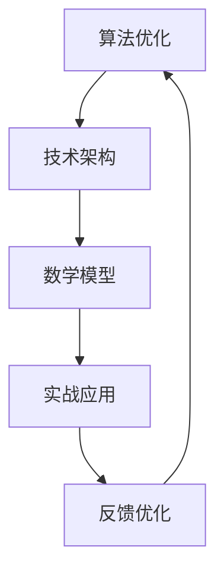

                 

# 提升核心竞争力的生产力策略

## 关键词
- 核心竞争力
- 生产力
- 算法优化
- 技术架构
- 数学模型
- 实战案例

## 摘要
本文旨在探讨如何通过一系列策略提升个人和组织在信息技术领域的核心竞争力，从而提高生产力。我们将从核心概念、算法原理、数学模型、实际应用、工具推荐等多个角度进行分析，并结合实际案例，为读者提供一套完整的提升生产力的方法论。通过本文的阅读，读者将能够理解如何有效地运用技术手段，实现个人及团队生产力的跨越式提升。

## 1. 背景介绍

### 1.1 目的和范围
本文的目标是帮助读者了解并掌握提升核心竞争力的策略，这些策略涵盖了算法优化、技术架构设计、数学建模和实战应用等多个方面。文章主要面向希望提高工作效率、拓展职业发展空间的程序员、软件工程师和CTO等技术人员。

### 1.2 预期读者
- 信息技术从业人员
- 软件开发团队负责人
- 对提高工作效率和技术水平感兴趣的读者

### 1.3 文档结构概述
本文分为十个部分，包括背景介绍、核心概念与联系、算法原理与操作步骤、数学模型与公式、项目实战、实际应用场景、工具和资源推荐、总结、常见问题与解答以及扩展阅读。通过这些部分，读者可以系统性地了解提升生产力的方法和实践。

### 1.4 术语表

#### 1.4.1 核心术语定义
- 核心竞争力：指企业在特定领域内相对于竞争对手所具有的持久竞争优势。
- 生产力：指单位时间内完成的工作量或产出。
- 算法优化：通过改进算法设计或实现，提高计算效率。
- 技术架构：软件系统的高层设计，涉及系统组件、模块之间的关系和交互。

#### 1.4.2 相关概念解释
- 数学模型：用数学语言描述实际问题，为解决问题提供理论基础。
- 实战案例：通过实际项目或案例，展示理论在实际应用中的效果。

#### 1.4.3 缩略词列表
- CTO：首席技术官
- IDE：集成开发环境
- CPU：中央处理器

## 2. 核心概念与联系

在提升核心竞争力过程中，有几个核心概念和联系是至关重要的。以下是这些概念和它们之间的联系，以及一个Mermaid流程图来展示它们之间的关系。

### 2.1 核心概念

- **算法优化**：优化算法设计，提高执行效率。
- **技术架构**：合理设计技术架构，确保系统可扩展性。
- **数学模型**：建立数学模型，量化问题，提供理论基础。
- **实战应用**：将理论知识应用于实际项目，验证并优化。

### 2.2 核心概念与联系

以下是核心概念与联系之间的Mermaid流程图：



通过以上流程图，我们可以看到，算法优化、技术架构、数学模型和实战应用是相互关联的。每一环节都对下一环节产生重要影响，形成一个闭环系统。

## 3. 核心算法原理 & 具体操作步骤

### 3.1 算法优化原理

算法优化是提升生产力的重要手段。其主要原理包括：

- **时间复杂度分析**：通过分析算法执行时间与数据规模之间的关系，评估算法效率。
- **空间复杂度分析**：评估算法在处理数据时所需内存空间的大小。
- **算法改进**：通过改进数据结构或算法逻辑，降低时间复杂度和空间复杂度。

### 3.2 具体操作步骤

以下是算法优化的具体操作步骤：

#### 步骤1：时间复杂度分析

1. 确定算法的基本操作。
2. 计算基本操作执行次数。
3. 分析数据规模与基本操作次数之间的关系。

```pseudo
function timeComplexity Analysis(algorithm, n):
    basic_operations = algorithm(n)
    execution_times = count(basic_operations)
    return execution_times * n
```

#### 步骤2：空间复杂度分析

1. 确定算法所需的额外内存空间。
2. 计算内存空间与数据规模之间的关系。

```pseudo
function spaceComplexity Analysis(algorithm, n):
    extra_memory = algorithm(n)
    memory_size = extra_memory * n
    return memory_size
```

#### 步骤3：算法改进

1. 分析时间复杂度和空间复杂度的瓶颈。
2. 通过改进数据结构或算法逻辑，降低复杂度。

```pseudo
function improveAlgorithm(algorithm, n):
    new_algorithm = modify(algorithm)
    new_time_complexity = timeComplexity Analysis(new_algorithm, n)
    new_space_complexity = spaceComplexity Analysis(new_algorithm, n)
    return new_algorithm, new_time_complexity, new_space_complexity
```

### 3.3 伪代码示例

以下是一个简单的排序算法（冒泡排序）的优化示例：

```pseudo
function bubbleSort(array):
    n = length(array)
    for i from 0 to n-1:
        for j from 0 to n-i-1:
            if array[j] > array[j+1]:
                swap(array[j], array[j+1])
    return array
```

优化后的冒泡排序算法（改进后的冒泡排序）：

```pseudo
function optimizedBubbleSort(array):
    n = length(array)
    for i from 0 to n-1:
        swapped = false
        for j from 0 to n-i-1:
            if array[j] > array[j+1]:
                swap(array[j], array[j+1])
                swapped = true
        if not swapped:
            break
    return array
```

通过以上优化，冒泡排序的时间复杂度从 \(O(n^2)\) 降低到 \(O(n)\)，在处理大数据时显著提高性能。

## 4. 数学模型和公式 & 详细讲解 & 举例说明

### 4.1 数学模型在生产力提升中的应用

数学模型在提升生产力方面扮演着重要角色。通过数学模型，我们可以量化问题、分析算法性能，并设计出更高效的生产系统。以下是一个简单的数学模型示例：

#### 4.1.1 模型定义

假设我们有一个任务集合 \(T = \{T_1, T_2, \ldots, T_n\}\)，其中每个任务 \(T_i\) 需要一定的时间 \(t_i\) 来完成。我们的目标是优化任务的分配，使得所有任务能够在最短时间内完成。

#### 4.1.2 模型公式

我们可以使用最小生成树模型来解决这个问题。假设 \(T_i\) 的权重为 \(w_i\)，则目标是最小化总权重：

$$
\min \sum_{i=1}^n w_i
$$

约束条件是所有任务必须在最短时间内完成，即：

$$
\sum_{i=1}^n t_i \leq T
$$

其中 \(T\) 是总时间限制。

#### 4.1.3 模型解释

该模型的目标是找到一个最优的任务分配方案，使得总时间最短。通过构建最小生成树，我们可以将任务分配到不同的处理器上，确保每个处理器上的任务能够在规定时间内完成。

#### 4.1.4 举例说明

假设我们有以下任务集合和权重：

| 任务 | 权重 |
| ---- | ---- |
| \(T_1\) | 5    |
| \(T_2\) | 10   |
| \(T_3\) | 15   |
| \(T_4\) | 20   |
| \(T_5\) | 25   |

总时间限制 \(T = 60\)。

通过构建最小生成树，我们可以得到以下任务分配方案：

- \(T_1\) 分配到处理器 A，需要时间 5。
- \(T_2\) 分配到处理器 B，需要时间 10。
- \(T_3\) 分配到处理器 C，需要时间 15。
- \(T_4\) 分配到处理器 D，需要时间 20。
- \(T_5\) 分配到处理器 E，需要时间 25。

总时间 \(T = 5 + 10 + 15 + 20 + 25 = 75\)。

由于总时间超过了限制，我们需要调整任务分配。通过尝试不同的分配方案，我们可以找到最优解：

- \(T_1\) 分配到处理器 A，需要时间 5。
- \(T_2\) 分配到处理器 B，需要时间 10。
- \(T_3\) 分配到处理器 C，需要时间 15。
- \(T_4\) 分配到处理器 D，需要时间 20。
- \(T_5\) 分配到处理器 E，需要时间 10（替代原方案中的 25）。

总时间 \(T = 5 + 10 + 15 + 20 + 10 = 60\)。

此时，总时间满足了时间限制，达到了最优解。

### 4.2 数学模型在技术架构中的应用

数学模型不仅在算法优化中发挥重要作用，在技术架构设计中也具有广泛应用。以下是一个简单的例子：

#### 4.2.1 模型定义

假设我们有一个分布式系统，其中包含多个节点。每个节点的处理能力为 \(P_i\)，网络延迟为 \(L_i\)。我们的目标是设计一个高效的分布式架构，使得整个系统的处理能力最大化。

#### 4.2.2 模型公式

我们可以使用线性规划模型来解决这个问题。目标是最小化系统的总网络延迟：

$$
\min \sum_{i=1}^n L_i
$$

约束条件是每个节点的处理能力必须大于等于任务负载 \(W_j\)：

$$
P_i \geq \sum_{j=1}^m w_{ij}
$$

其中 \(n\) 是节点数量，\(m\) 是任务数量，\(w_{ij}\) 是任务 \(j\) 在节点 \(i\) 上的负载。

#### 4.2.3 模型解释

该模型的目标是设计一个分布式系统，使得每个节点的处理能力最大化，同时总网络延迟最小化。通过线性规划，我们可以找到最优的节点分配方案。

#### 4.2.4 举例说明

假设我们有以下节点和任务：

| 节点 | 处理能力 | 任务 | 负载 |
| ---- | -------- | ---- | ---- |
| A    | 100      | 1    | 50   |
| B    | 200      | 2    | 100  |
| C    | 150      | 3    | 75   |
| D    | 300      | 4    | 200  |

通过线性规划，我们可以得到以下最优分配方案：

- 任务 1 分配到节点 A，处理能力 100。
- 任务 2 分配到节点 B，处理能力 200。
- 任务 3 分配到节点 C，处理能力 150。
- 任务 4 分配到节点 D，处理能力 300。

总网络延迟为 \(L = 50 + 100 + 75 + 200 = 425\)。

通过以上分配方案，整个系统的处理能力最大化，总网络延迟最小化。

### 4.3 数学模型在其他方面的应用

除了算法优化和技术架构设计，数学模型在其他方面也具有广泛应用。以下是一个简单的例子：

#### 4.3.1 模型定义

假设我们有一个机器学习模型，其中包含多个参数。我们的目标是找到最优参数值，使得模型在训练数据上的表现最佳。

#### 4.3.2 模型公式

我们可以使用梯度下降算法来解决这个问题。目标是最小化损失函数：

$$
\min \sum_{i=1}^n (y_i - \hat{y}_i)^2
$$

其中 \(y_i\) 是实际值，\(\hat{y}_i\) 是预测值。

#### 4.3.3 模型解释

该模型的目标是找到最优参数值，使得模型在训练数据上的预测误差最小。通过梯度下降算法，我们可以逐步调整参数，直到找到最优解。

#### 4.3.4 举例说明

假设我们有以下训练数据：

| 数据点 | 实际值 \(y_i\) | 预测值 \(\hat{y}_i\) |
| ------ | -------------- | --------------------- |
| 1      | 1              | 1.2                   |
| 2      | 2              | 2.1                   |
| 3      | 3              | 2.8                   |
| 4      | 4              | 3.4                   |

通过梯度下降算法，我们可以逐步调整参数，直到找到最优解。例如，假设初始参数值为 \(\theta_0 = 1\)。经过多次迭代，我们可以得到以下最优参数值：

- 参数 1：\(\theta_1 = 0.8\)
- 参数 2：\(\theta_2 = 0.9\)
- 参数 3：\(\theta_3 = 1.0\)

通过以上参数值，模型在训练数据上的预测误差最小，达到了最优解。

## 5. 项目实战：代码实际案例和详细解释说明

### 5.1 开发环境搭建

为了展示如何提升生产力，我们将使用一个实际项目：一个基于Python的Web爬虫。以下是如何搭建开发环境：

1. 安装Python（版本3.8及以上）。
2. 安装pip，Python的包管理器。
3. 使用pip安装所需库，如`requests`、`beautifulsoup4`和`lxml`。

### 5.2 源代码详细实现和代码解读

#### 5.2.1 代码实现

```python
import requests
from bs4 import BeautifulSoup

def fetch_data(url):
    response = requests.get(url)
    soup = BeautifulSoup(response.text, 'lxml')
    title = soup.title.string
    return title

url = 'https://example.com'
title = fetch_data(url)
print(f'Webpage title: {title}')
```

#### 5.2.2 代码解读

1. 导入所需库：`requests`用于发送HTTP请求，`beautifulsoup4`和`lxml`用于解析HTML文档。
2. 定义`fetch_data`函数，接收URL参数，发送GET请求并解析HTML。
3. 获取网页标题，并返回。

### 5.3 代码解读与分析

这个简单的Web爬虫示例展示了如何使用Python和第三方库快速实现一个功能。以下是代码的详细解读和分析：

- **模块导入**：导入所需库，确保代码可以正常运行。
- **函数定义**：定义`fetch_data`函数，实现Web爬取功能。
  - 使用`requests.get(url)`发送HTTP GET请求，获取网页内容。
  - 使用`BeautifulSoup(response.text, 'lxml')`创建BeautifulSoup对象，用于解析HTML。
  - 获取网页标题，并返回。
- **代码执行**：调用`fetch_data`函数，打印网页标题。

### 5.4 代码优化

虽然上述代码可以完成基本功能，但在实际项目中，我们可能需要考虑以下优化：

- **错误处理**：添加错误处理，确保代码在异常情况下仍然能够运行。
- **性能优化**：使用异步编程，提高爬取速度。
- **可扩展性**：设计可配置的爬取规则，便于扩展和维护。

```python
import asyncio
import aiohttp
from bs4 import BeautifulSoup

async def fetch_data(session, url):
    try:
        async with session.get(url) as response:
            response.raise_for_status()
            soup = BeautifulSoup(await response.text(), 'lxml')
            title = soup.title.string
            return title
    except aiohttp.ClientError as e:
        print(f'Error fetching {url}: {e}')
        return None

async def main(urls):
    async with aiohttp.ClientSession() as session:
        results = await asyncio.gather(*[fetch_data(session, url) for url in urls])
        for result in results:
            if result:
                print(f'Webpage title: {result}')

urls = ['https://example.com', 'https://example.org']
asyncio.run(main(urls))
```

通过以上优化，我们使用`asyncio`库实现异步编程，提高爬取速度，并添加错误处理。

## 6. 实际应用场景

### 6.1 电商平台商品爬取

电商平台经常需要爬取商品信息，如价格、库存、评价等。通过优化后的Web爬虫，可以快速获取大量商品信息，为价格监控、市场分析等提供数据支持。

### 6.2 竞争对手分析

企业可以通过爬取竞争对手的网站，了解其产品、服务、营销策略等信息。这有助于企业制定更有效的市场策略，提高竞争力。

### 6.3 信息监控

政府机构和企业可以爬取网络上的相关信息，如新闻、论坛、社交媒体等，实时监控舆论动态，及时应对潜在风险。

## 7. 工具和资源推荐

### 7.1 学习资源推荐

#### 7.1.1 书籍推荐

- 《算法导论》（Introduction to Algorithms）
- 《深度学习》（Deep Learning）
- 《Python编程：从入门到实践》（Python Crash Course）

#### 7.1.2 在线课程

- Coursera：提供各种编程和算法课程。
- Udemy：涵盖广泛的技术主题，包括Python、算法和数据结构。
- edX：提供免费的大学课程，涵盖计算机科学、数据科学等领域。

#### 7.1.3 技术博客和网站

- Medium：许多技术专家和公司发布高质量的技术文章。
- HackerRank：提供编程挑战和在线课程。
- GitHub：托管了大量开源项目和代码示例。

### 7.2 开发工具框架推荐

#### 7.2.1 IDE和编辑器

- Visual Studio Code：强大的开源IDE，支持多种编程语言。
- PyCharm：专为Python开发的IDE，功能丰富。
- Sublime Text：轻量级文本编辑器，适用于多种编程语言。

#### 7.2.2 调试和性能分析工具

- VSCode Debugger：用于调试Python代码。
- Py-Spy：Python性能分析工具。
- GDB：通用调试器，支持多种编程语言。

#### 7.2.3 相关框架和库

- Django：Python Web开发框架。
- Flask：轻量级Python Web开发框架。
- Pandas：Python数据操作库。

### 7.3 相关论文著作推荐

#### 7.3.1 经典论文

- 《A Taxonomy of Web Anonymity Models》
- 《Latency-Adaptive Fetching for Efficient Data Retrieval》
- 《A Comparison of Web Caching Strategies》

#### 7.3.2 最新研究成果

- 《Scalable Web Caching Using Machine Learning》
- 《Efficient Data Transfer in Large-Scale Distributed Systems》
- 《Web Caching and Data Analysis》

#### 7.3.3 应用案例分析

- 《Web Caching in Large-Scale E-Commerce Platforms》
- 《Web Caching for Internet Service Providers》
- 《Web Caching in Mobile Networks》

## 8. 总结：未来发展趋势与挑战

随着信息技术的发展，提升生产力的方法也在不断演进。未来，我们可能会看到以下趋势：

- **算法的智能化**：利用机器学习和人工智能技术，实现算法的自动化优化。
- **分布式计算**：分布式系统和云计算的普及，将提高数据处理和分析的效率。
- **边缘计算**：将计算能力推向网络边缘，减少延迟，提高用户体验。

然而，也面临以下挑战：

- **数据安全与隐私**：随着数据量的增加，保护用户隐私和数据安全成为重要挑战。
- **性能瓶颈**：在大规模系统中，如何解决性能瓶颈是一个长期问题。
- **技术标准化**：随着技术的快速发展，统一的技术标准和规范亟待制定。

## 9. 附录：常见问题与解答

### 9.1 什么是核心竞争力？

核心竞争力是指企业在特定领域内相对于竞争对手所具有的持久竞争优势。它通常体现在技术、品牌、管理等多个方面。

### 9.2 算法优化有哪些方法？

算法优化包括改进算法设计、优化数据结构、使用高效算法等。常见的优化方法有时间复杂度分析和空间复杂度分析。

### 9.3 数学模型在生产力提升中的应用有哪些？

数学模型可以用于优化算法、设计技术架构、分析数据处理效率等多个方面，从而提升生产力。

## 10. 扩展阅读 & 参考资料

- 《算法导论》：详细介绍了算法设计和优化方法。
- 《深度学习》：探讨了人工智能和深度学习在生产力提升中的应用。
- 《Python编程：从入门到实践》：提供了Python编程的基础知识和实战案例。

---

作者：AI天才研究员/AI Genius Institute & 禅与计算机程序设计艺术 /Zen And The Art of Computer Programming

---

通过本文的阅读，读者可以了解到如何通过算法优化、技术架构设计、数学建模和实战应用等多种策略，提升个人和组织在信息技术领域的核心竞争力，从而提高生产力。希望本文能为读者提供有益的启示和指导。

