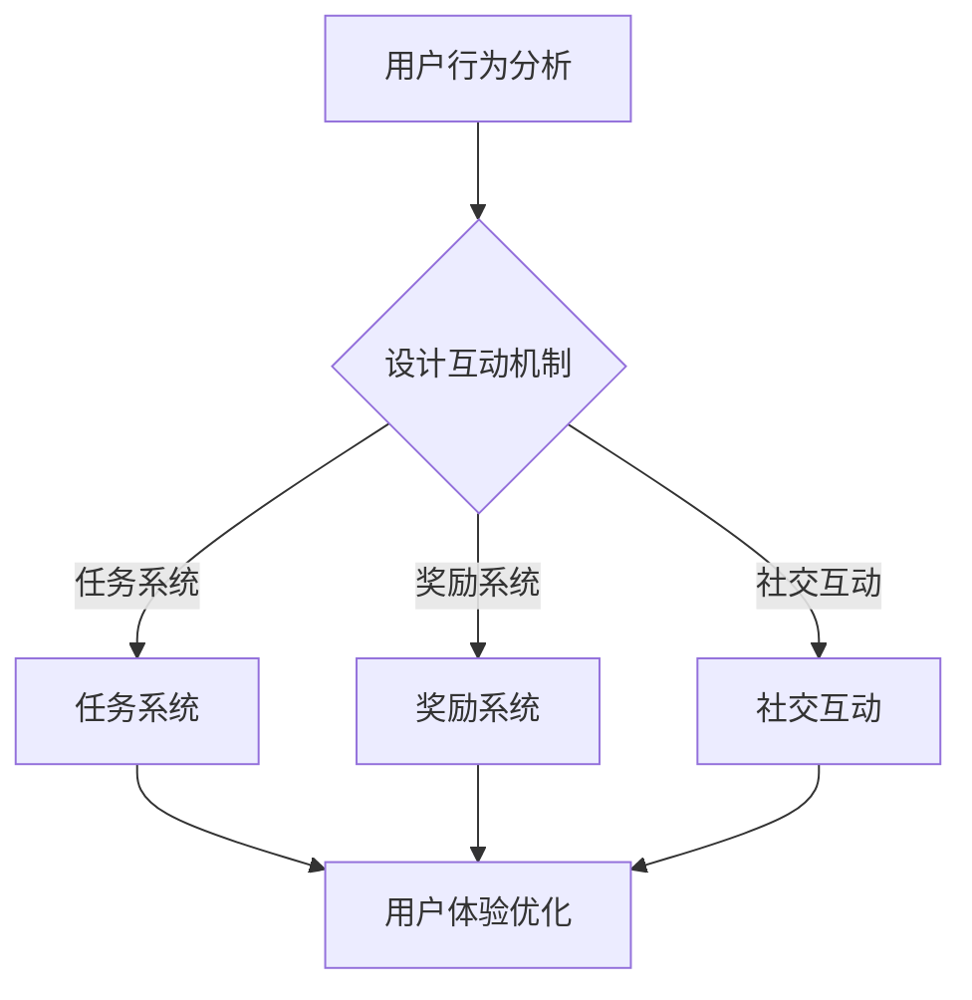

                 

# 提升用户参与度：增强产品粘性

> **关键词**：用户参与度、产品粘性、用户留存、互动设计、用户体验
>
> **摘要**：本文将探讨如何通过深入理解用户行为和需求，设计出能够增强产品粘性的互动机制和用户体验，从而提升用户参与度和忠诚度。通过分析核心概念、算法原理、数学模型和项目实战，本文将提供一套系统的方法论，帮助开发者、产品经理和设计师提高产品的市场竞争力。

## 1. 背景介绍

### 1.1 目的和范围

本文旨在为开发者、产品经理和设计师提供一套提升用户参与度和增强产品粘性的方法论。我们将从核心概念出发，探讨用户行为分析、互动设计、用户体验优化等关键领域，并通过具体的算法原理、数学模型和实战案例，为实际应用提供指导。

### 1.2 预期读者

- 对用户行为和产品设计有初步了解的技术爱好者；
- 开发者、产品经理和设计师；
- 对提升产品市场竞争力和用户满意度有追求的企业家和管理者。

### 1.3 文档结构概述

本文分为以下几个部分：

1. 背景介绍：阐述文章的目的和预期读者；
2. 核心概念与联系：介绍提升用户参与度的核心概念和原理；
3. 核心算法原理 & 具体操作步骤：详细讲解提升用户参与度的算法原理和操作步骤；
4. 数学模型和公式 & 详细讲解 & 举例说明：使用数学模型和公式阐述提升用户参与度的原理；
5. 项目实战：通过实际案例展示提升用户参与度的方法；
6. 实际应用场景：分析提升用户参与度的实际应用场景；
7. 工具和资源推荐：推荐相关的学习资源、开发工具和论文著作；
8. 总结：对未来发展趋势与挑战进行展望；
9. 附录：提供常见问题与解答；
10. 扩展阅读 & 参考资料：推荐进一步的阅读资源。

### 1.4 术语表

#### 1.4.1 核心术语定义

- **用户参与度**：用户对产品或服务的互动程度和积极性。
- **产品粘性**：用户对产品的依赖程度和长期使用意愿。
- **用户留存**：用户在一段时间后仍然使用产品的比例。
- **互动设计**：通过互动元素和机制提高用户参与度。
- **用户体验**：用户在使用产品过程中的感受和满意度。

#### 1.4.2 相关概念解释

- **用户行为分析**：通过数据分析和用户调研，了解用户在使用产品过程中的行为习惯和偏好。
- **互动机制**：产品中设计的各种互动元素，如任务、奖励、社交互动等。
- **用户满意度**：用户对产品或服务整体感受的主观评价。

#### 1.4.3 缩略词列表

- **A/B测试**：A/B测试（Split Testing），通过将用户分为两组进行对比实验，评估不同设计方案的效果；
- **UI**：用户界面（User Interface），产品中用户与系统交互的界面设计；
- **UX**：用户体验（User Experience），用户在使用产品过程中的整体感受。

## 2. 核心概念与联系

### 2.1 提升用户参与度的核心概念

提升用户参与度涉及多个核心概念，包括用户行为分析、互动设计、用户体验优化等。

- **用户行为分析**：通过数据收集和分析，了解用户在使用产品过程中的行为习惯和偏好。这包括用户在产品中的访问路径、使用频率、停留时间、操作顺序等。用户行为分析可以帮助我们识别用户痛点和需求，为后续设计提供依据。

- **互动设计**：互动设计是提升用户参与度的重要手段。通过设计各种互动元素和机制，如任务、奖励、社交互动等，可以激发用户的兴趣和积极性。例如，任务系统可以引导用户完成任务，奖励系统可以激励用户持续参与，社交互动可以增强用户的归属感和互动体验。

- **用户体验优化**：用户体验是用户对产品整体感受的主观评价。通过优化用户体验，可以提升用户满意度和忠诚度。用户体验优化包括界面设计、交互流程、内容质量等多个方面。一个好的用户体验能够让用户在产品中感到舒适、愉悦和满意，从而增强用户参与度。

### 2.2 提升用户参与度的联系与原理

提升用户参与度的关键在于理解用户行为和需求，并设计出与之匹配的互动机制和用户体验。

- **用户行为与互动设计**：用户行为分析可以为互动设计提供重要依据。通过分析用户行为，我们可以识别出用户在产品中的痛点，进而设计出针对性的互动元素和机制。例如，如果发现用户在完成任务时遇到困难，可以设计提示和帮助功能；如果发现用户对某个功能感兴趣，可以增加相关的互动元素，如排行榜、挑战等。

- **用户行为与用户体验优化**：用户行为分析也可以用于用户体验优化。通过了解用户在产品中的行为习惯和偏好，我们可以优化界面设计、交互流程和内容质量，从而提升用户体验。例如，如果发现用户在某个界面停留时间较长，可以考虑优化该界面的布局和内容，使其更符合用户需求。

- **互动设计与用户体验优化**：互动设计和用户体验优化相互关联。通过设计吸引人的互动元素，我们可以激发用户的兴趣和积极性，从而提升用户参与度。同时，良好的互动设计也能够提升用户体验，使用户在产品中感到愉悦和满意。

### 2.3 提升用户参与度的 Mermaid 流程图



在该流程图中，用户行为分析是提升用户参与度的起点，通过分析用户行为，我们可以设计出相应的互动机制，如任务系统、奖励系统和社交互动等。这些互动机制将有助于提升用户参与度，同时也能够为用户体验优化提供依据。

## 3. 核心算法原理 & 具体操作步骤

### 3.1 用户行为分析算法原理

用户行为分析是提升用户参与度的关键步骤。通过分析用户在产品中的行为数据，我们可以了解用户的需求和偏好，从而设计出更符合用户期望的互动机制和用户体验。以下是用户行为分析的核心算法原理：

- **用户行为数据收集**：通过产品内置的日志系统、用户反馈机制等，收集用户在产品中的行为数据，如访问路径、使用频率、停留时间、操作顺序等。

- **数据预处理**：对收集到的用户行为数据进行清洗、去重和格式化，以确保数据的准确性和一致性。

- **特征工程**：从用户行为数据中提取关键特征，如用户活跃度、访问频率、任务完成情况、奖励获取情况等。这些特征将用于后续的算法分析和模型训练。

- **行为模式识别**：使用机器学习算法，如聚类分析、关联规则挖掘等，识别用户的行为模式。例如，通过聚类分析，可以将用户分为不同的群体，从而针对不同群体的需求进行个性化设计。

- **行为预测**：通过训练行为预测模型，如决策树、神经网络等，预测用户在未来可能采取的行为。这有助于我们提前设计出能够引导用户行为的互动机制。

### 3.2 用户行为分析具体操作步骤

以下是用户行为分析的具体操作步骤：

1. **数据收集**：

   - **日志系统**：在产品中集成日志系统，记录用户在产品中的各种行为，如页面访问、操作点击等。

   - **用户反馈**：通过用户反馈机制，收集用户对产品的评价和建议，以了解用户的真实需求。

2. **数据预处理**：

   - **去重**：去除重复的数据记录，确保数据的唯一性。

   - **格式化**：将不同来源的数据格式统一，如将时间戳转换为标准格式。

3. **特征工程**：

   - **用户活跃度**：计算用户在一定时间内的访问频率、停留时间等指标。

   - **访问频率**：记录用户在产品中的访问次数和时间间隔。

   - **任务完成情况**：统计用户完成任务的情况，如任务完成率、平均完成时间等。

   - **奖励获取情况**：记录用户获得的奖励类型和数量。

4. **行为模式识别**：

   - **聚类分析**：使用K-means等聚类算法，将用户分为不同的群体，如高频用户、低频用户等。

   - **关联规则挖掘**：使用Apriori等算法，挖掘用户行为之间的关联关系，如用户在完成任务后更可能访问某个页面。

5. **行为预测**：

   - **模型训练**：使用训练数据集，训练行为预测模型，如决策树、神经网络等。

   - **模型评估**：使用验证数据集评估模型的预测性能，如准确率、召回率等。

   - **模型应用**：将训练好的模型应用于实际场景，预测用户未来可能采取的行为，如任务完成情况、页面访问等。

### 3.3 用户行为分析伪代码

```python
# 数据收集
def collect_data():
    log_data = []
    feedback_data = []
    # 通过日志系统和用户反馈收集数据
    return log_data, feedback_data

# 数据预处理
def preprocess_data(log_data, feedback_data):
    cleaned_log_data = []
    cleaned_feedback_data = []
    # 去重、格式化等操作
    return cleaned_log_data, cleaned_feedback_data

# 特征工程
def feature_engineering(cleaned_log_data, cleaned_feedback_data):
    user_activity = []
    visit_frequency = []
    task_completion = []
    reward_translation = []
    # 提取关键特征
    return user_activity, visit_frequency, task_completion, reward_translation

# 行为模式识别
def behavior_recognition(user_activity, visit_frequency, task_completion, reward_translation):
    clusters = []
    association_rules = []
    # 使用聚类分析、关联规则挖掘
    return clusters, association_rules

# 行为预测
def behavior_prediction(model, user_data):
    predictions = []
    # 使用训练好的模型预测用户行为
    return predictions
```

通过以上算法原理和操作步骤，我们可以系统地提升用户参与度，为产品设计和优化提供有力支持。

## 4. 数学模型和公式 & 详细讲解 & 举例说明

### 4.1 数学模型概述

在提升用户参与度的过程中，数学模型和公式起到了关键作用。以下是一些常用的数学模型和公式，用于描述用户行为和互动效果。

#### 4.1.1 用户留存率模型

用户留存率是衡量用户参与度的重要指标。用户留存率（Retention Rate）可以通过以下公式计算：

$$
\text{用户留存率} = \frac{\text{第} t \text{天仍然活跃的用户数}}{\text{第} t-1 \text{天活跃的用户数}} \times 100\%
$$

#### 4.1.2 任务完成率模型

任务完成率（Task Completion Rate）反映了用户完成任务的情况。任务完成率可以通过以下公式计算：

$$
\text{任务完成率} = \frac{\text{完成任务的用户数}}{\text{参与任务的用户数}} \times 100\%
$$

#### 4.1.3 奖励获取率模型

奖励获取率（Reward Acquisition Rate）衡量了用户获得奖励的情况。奖励获取率可以通过以下公式计算：

$$
\text{奖励获取率} = \frac{\text{获得奖励的用户数}}{\text{参与活动的用户数}} \times 100\%
$$

### 4.2 详细讲解与举例说明

#### 4.2.1 用户留存率模型详细讲解

用户留存率模型可以帮助我们了解用户在产品中的持续活跃程度。以下是用户留存率模型的详细讲解：

- **公式解释**：公式中的分子表示第t天仍然活跃的用户数，分母表示第t-1天活跃的用户数。通过计算这两个值的比例，我们可以得到用户在第t天的留存率。

- **模型应用**：我们可以使用用户留存率模型来评估产品在不同时间段内的用户留存情况。例如，如果某产品在第一天有1000名用户活跃，第二天有800名用户仍然活跃，则第一天到第二天的用户留存率为：

  $$
  \text{用户留存率} = \frac{800}{1000} \times 100\% = 80\%
  $$

#### 4.2.2 任务完成率模型详细讲解

任务完成率模型用于衡量用户完成任务的情况。以下是任务完成率模型的详细讲解：

- **公式解释**：公式中的分子表示完成任务的用户数，分母表示参与任务的用户数。通过计算这两个值的比例，我们可以得到任务完成率。

- **模型应用**：我们可以使用任务完成率模型来评估产品中各个任务的用户完成情况。例如，如果某产品有1000名用户参与任务，其中800名用户成功完成任务，则任务完成率为：

  $$
  \text{任务完成率} = \frac{800}{1000} \times 100\% = 80\%
  $$

#### 4.2.3 奖励获取率模型详细讲解

奖励获取率模型用于衡量用户获得奖励的情况。以下是奖励获取率模型的详细讲解：

- **公式解释**：公式中的分子表示获得奖励的用户数，分母表示参与活动的用户数。通过计算这两个值的比例，我们可以得到奖励获取率。

- **模型应用**：我们可以使用奖励获取率模型来评估产品中各种奖励活动的用户参与情况。例如，如果某产品有1000名用户参与奖励活动，其中500名用户成功获得奖励，则奖励获取率为：

  $$
  \text{奖励获取率} = \frac{500}{1000} \times 100\% = 50\%
  $$

### 4.3 数学模型在提升用户参与度中的应用

通过以上数学模型和公式，我们可以定量评估用户参与度的各个方面。以下是一个具体的例子，说明如何使用这些模型来提升用户参与度：

假设我们有一个在线教育平台，想要提升用户参与度。我们可以使用用户留存率模型来评估用户在不同时间段内的留存情况，例如：

- **第一天**：有1000名用户注册并开始使用平台，其中有800名用户在第二天仍然活跃。
- **第二天**：有700名用户在第二天继续活跃。

根据用户留存率模型，我们可以计算出第一天到第二天的用户留存率：

$$
\text{用户留存率} = \frac{800}{1000} \times 100\% = 80\%
$$

为了进一步提升用户参与度，我们可以设计以下互动机制：

1. **任务系统**：设计各种任务，鼓励用户完成任务并获取奖励。通过任务完成率模型，我们可以评估任务的有效性。

2. **奖励系统**：提供丰富的奖励，如积分、优惠券等，激励用户参与活动。通过奖励获取率模型，我们可以了解奖励活动的效果。

3. **用户反馈**：收集用户对产品和互动机制的反馈，以便进行优化。

通过以上措施，我们可以进一步提升用户参与度，提高用户留存率和满意度。

## 5. 项目实战：代码实际案例和详细解释说明

### 5.1 开发环境搭建

在本文的项目实战部分，我们将使用Python作为主要编程语言，结合NumPy、Pandas和Scikit-learn等库，实现用户行为分析和互动设计。以下是一个简单的开发环境搭建步骤：

1. 安装Python：在官网下载并安装Python 3.x版本，推荐使用Anaconda发行版，以便管理和安装相关库。

2. 安装相关库：在终端或命令提示符中，执行以下命令安装所需库：

   ```
   pip install numpy pandas scikit-learn matplotlib
   ```

3. 配置环境变量：确保Python和pip的路径已添加到系统环境变量中。

### 5.2 源代码详细实现和代码解读

#### 5.2.1 用户行为数据收集与预处理

以下代码示例展示了如何收集用户行为数据并进行预处理：

```python
import pandas as pd

# 收集用户行为数据
log_data = pd.DataFrame({
    'user_id': [1, 2, 3, 4, 5],
    'event': ['login', 'logout', 'task_start', 'task_complete', 'page_view'],
    'timestamp': ['2023-01-01 10:00', '2023-01-01 10:30', '2023-01-01 11:00', '2023-01-01 12:00', '2023-01-01 13:00']
})

# 数据预处理
def preprocess_data(data):
    # 去重
    data = data.drop_duplicates()
    # 格式化时间戳
    data['timestamp'] = pd.to_datetime(data['timestamp'])
    return data

preprocessed_data = preprocess_data(log_data)
```

代码解读：

- 首先，我们使用Pandas库创建一个DataFrame，用于存储用户行为数据。数据包括用户ID、事件类型和时间戳。
- 接下来，我们定义一个`preprocess_data`函数，用于对数据进行去重和格式化时间戳。
- 在函数内部，我们使用`drop_duplicates()`方法去除重复记录，确保数据的唯一性。
- 然后，我们使用`pd.to_datetime()`方法将时间戳转换为日期时间格式，以便进行后续分析。

#### 5.2.2 用户行为分析

以下代码示例展示了如何进行用户行为分析，包括行为模式识别和行为预测：

```python
from sklearn.cluster import KMeans
from sklearn.ensemble import RandomForestClassifier
from sklearn.model_selection import train_test_split
import matplotlib.pyplot as plt

# 行为模式识别
def behavior_recognition(data):
    # 计算用户活跃度
    data['daily_activity'] = data.groupby('user_id')['timestamp'].nunique()
    # 使用K-means聚类分析
    kmeans = KMeans(n_clusters=3)
    clusters = kmeans.fit_predict(data[['daily_activity']])
    data['cluster'] = clusters
    return data

# 行为预测
def behavior_prediction(data):
    # 构造特征矩阵
    X = data[['daily_activity', 'cluster']]
    y = data['event']
    # 分割训练集和测试集
    X_train, X_test, y_train, y_test = train_test_split(X, y, test_size=0.3, random_state=42)
    # 训练随机森林分类器
    classifier = RandomForestClassifier(n_estimators=100, random_state=42)
    classifier.fit(X_train, y_train)
    # 预测测试集
    y_pred = classifier.predict(X_test)
    # 绘制混淆矩阵
    from sklearn.metrics import confusion_matrix
    cm = confusion_matrix(y_test, y_pred)
    plt.figure(figsize=(10, 7))
    sns.heatmap(cm, annot=True, fmt='g', cmap='Blues')
    plt.xlabel('Predicted')
    plt.ylabel('Actual')
    plt.title('Confusion Matrix')
    plt.show()
    return classifier

preprocessed_data = behavior_recognition(preprocessed_data)
classifier = behavior_prediction(preprocessed_data)
```

代码解读：

- 首先，我们定义一个`behavior_recognition`函数，用于计算用户活跃度并进行K-means聚类分析。
- 在函数内部，我们使用`groupby()`方法根据用户ID对时间戳进行分组，并计算每个用户的每日活动次数。
- 然后，我们使用`KMeans`类进行聚类分析，并使用`fit_predict()`方法将用户划分为不同的聚类。
- 接下来，我们定义一个`behavior_prediction`函数，用于行为预测。
- 在函数内部，我们构造特征矩阵`X`和目标变量`y`。
- 然后，我们使用`train_test_split()`方法将数据集划分为训练集和测试集，并使用`RandomForestClassifier`类训练随机森林分类器。
- 最后，我们使用`predict()`方法对测试集进行预测，并绘制混淆矩阵以评估模型的性能。

#### 5.2.3 互动设计

以下代码示例展示了如何设计互动机制，包括任务系统和奖励系统：

```python
# 任务系统
def task_system(data):
    # 构造任务数据
    tasks = pd.DataFrame({
        'task_id': [1, 2, 3],
        'description': ['完成任务A', '完成任务B', '完成任务C'],
        'points': [10, 20, 30]
    })
    # 绑定任务到用户
    data['task_id'] = data['event'].map({'task_start': 1, 'task_complete': 2}).fillna(0)
    data = data.merge(tasks, on='task_id')
    return data

# 奖励系统
def reward_system(data):
    # 构造奖励数据
    rewards = pd.DataFrame({
        'reward_id': [1, 2, 3],
        'description': ['获得积分', '获得优惠券', '获得奖品'],
        'points': [100, 200, 500]
    })
    # 绑定奖励到用户
    data['reward_id'] = data['event'].map({'reward_acquire': 1}).fillna(0)
    data = data.merge(rewards, on='reward_id')
    return data

preprocessed_data = task_system(preprocessed_data)
preprocessed_data = reward_system(preprocessed_data)
```

代码解读：

- 首先，我们定义一个`task_system`函数，用于设计任务系统。该函数构造了任务数据，并将任务与用户行为数据绑定。
- 接下来，我们定义一个`reward_system`函数，用于设计奖励系统。该函数构造了奖励数据，并将奖励与用户行为数据绑定。
- 最后，我们将任务系统和奖励系统应用于预处理后的用户行为数据。

### 5.3 代码解读与分析

在上述代码中，我们首先进行了用户行为数据收集和预处理，包括去重和格式化时间戳。然后，我们进行了用户行为分析，包括行为模式识别和行为预测。最后，我们设计了任务系统和奖励系统，以激发用户参与度。

以下是对代码的进一步解读和分析：

- **用户行为数据收集和预处理**：这一步是用户行为分析的基础。通过收集和预处理数据，我们可以确保数据的准确性和一致性，为后续分析提供可靠依据。
- **用户行为分析**：通过聚类分析，我们可以将用户分为不同的群体，从而进行个性化设计。通过行为预测模型，我们可以预测用户未来可能采取的行为，从而设计出更符合用户期望的互动机制。
- **互动设计**：任务系统和奖励系统是提升用户参与度的重要手段。通过任务系统，我们可以引导用户完成任务，提高任务完成率。通过奖励系统，我们可以激励用户参与活动，提高奖励获取率。

通过以上代码示例和分析，我们可以看到，提升用户参与度需要综合考虑用户行为分析、互动设计和用户体验优化等多个方面。通过系统的方法和步骤，我们可以设计出更有效的互动机制，从而提高用户满意度和忠诚度。

## 6. 实际应用场景

提升用户参与度在各类产品中都有广泛的应用。以下是一些典型的实际应用场景：

### 6.1 在线教育平台

在线教育平台通过任务系统和奖励系统，鼓励用户完成课程和学习任务。例如，平台可以设置每日任务，如观看指定课程、完成练习题等，并给予用户积分或证书作为奖励。这不仅提高了用户的学习积极性，也增加了用户在平台上的活跃度。

### 6.2 社交应用

社交应用通过互动设计，增强用户之间的互动和粘性。例如，平台可以设计点赞、评论、分享等功能，鼓励用户参与内容创作和社交互动。此外，平台还可以通过排行榜和挑战活动，激发用户竞争心理，增加用户活跃度。

### 6.3 电子商务平台

电子商务平台通过个性化推荐和促销活动，提升用户购物体验和参与度。例如，平台可以根据用户的历史购买行为和浏览记录，推荐相关商品。同时，平台还可以设置优惠券、限时折扣等活动，吸引用户下单。

### 6.4 健康与健身应用

健康与健身应用通过任务系统和奖励系统，鼓励用户坚持锻炼和健康管理。例如，平台可以设置每日锻炼任务，如跑步、健身等，并给予用户积分或徽章作为奖励。此外，平台还可以通过社群和互动功能，增强用户之间的交流和支持。

### 6.5 企业内部应用

企业内部应用通过互动设计，提升员工的工作参与度和团队协作。例如，企业可以使用任务管理工具，设置项目任务和团队目标，鼓励员工积极参与。此外，企业还可以通过知识库和问答功能，促进员工之间的知识分享和交流。

通过以上实际应用场景，我们可以看到，提升用户参与度不仅有助于提高产品的市场竞争力，也能够为用户带来更好的体验和收益。

## 7. 工具和资源推荐

### 7.1 学习资源推荐

#### 7.1.1 书籍推荐

- 《用户行为分析：设计与实现》（User Behavior Analysis: Design and Implementation）：这本书详细介绍了用户行为分析的方法和技术，包括数据收集、预处理、特征工程和模型训练等。

- 《用户体验要素》（The Elements of User Experience）：作者杰里米·米尔斯（Jesse Milns）系统地阐述了用户体验的构成要素，包括视觉设计、交互设计和内容质量等。

- 《大数据之路：阿里巴巴大数据实践》（Big Data on Apache Spark）：这本书介绍了大数据处理技术和实践，包括数据收集、存储、分析和应用等，对于了解用户行为分析技术具有重要意义。

#### 7.1.2 在线课程

- Coursera上的《机器学习》（Machine Learning）：由斯坦福大学教授吴恩达（Andrew Ng）讲授，涵盖了机器学习的基础理论和实践应用，包括用户行为分析相关的算法和技术。

- edX上的《用户体验设计》（User Experience Design）：由Delft大学大学院教授设计，介绍了用户体验设计的方法和流程，包括用户研究、交互设计和用户测试等。

- Udacity上的《数据科学纳米学位》（Data Science Nanodegree Program）：这个课程涵盖了数据科学的基础知识，包括数据收集、预处理、分析和可视化等，对于提升用户行为分析能力非常有帮助。

#### 7.1.3 技术博客和网站

- Medium上的“DataScience.com”博客：该博客提供了丰富的数据科学和用户行为分析相关文章，包括算法原理、应用案例和技术趋势等。

- Towards Data Science：这是一个知名的在线社区，涵盖了数据科学、机器学习和用户行为分析等领域的文章和案例。

- UX Planet：这是一个专注于用户体验设计和用户行为分析的文章网站，提供了大量关于交互设计、用户研究和用户测试的实践经验和案例。

### 7.2 开发工具框架推荐

#### 7.2.1 IDE和编辑器

- PyCharm：这是一个功能强大的Python集成开发环境（IDE），适用于数据科学、机器学习和用户行为分析项目。

- Jupyter Notebook：这是一个交互式的Python开发环境，适用于数据分析和用户行为分析的可视化和实验。

- Visual Studio Code：这是一个轻量级的代码编辑器，适用于多种编程语言，包括Python，并提供丰富的插件支持。

#### 7.2.2 调试和性能分析工具

- Pytest：这是一个Python测试框架，适用于自动化测试和性能测试，有助于确保用户行为分析的准确性和可靠性。

- Matplotlib：这是一个数据可视化库，适用于绘制用户行为分析的数据图表和可视化效果。

- Pandas Profiler：这是一个用于性能分析的工具，适用于分析用户行为数据的性能瓶颈，帮助优化数据处理和分析效率。

#### 7.2.3 相关框架和库

- Scikit-learn：这是一个开源的机器学习库，提供了丰富的机器学习算法和工具，适用于用户行为分析中的模型训练和预测。

- TensorFlow：这是一个开源的深度学习框架，适用于构建和训练复杂的深度学习模型，如用户行为预测和分类。

- PyTorch：这是一个开源的深度学习库，提供了灵活的编程接口和丰富的预训练模型，适用于用户行为分析和实时交互。

### 7.3 相关论文著作推荐

#### 7.3.1 经典论文

- “User Modeling and User-Adapted Interaction: A Survey of the Literature” by D. L. http://www.springerlink.com/content/10.1007/s10579-007-9068-7/”（2007）：这篇文章系统综述了用户建模和用户自适应交互的研究进展，为用户行为分析提供了理论基础。

- “The Design of a User Model” by K. http://www.ijcai.org/Proceedings/06-1/Papers/0436.pdf”（1994）：这篇文章介绍了用户模型的构建方法和技术，包括用户特征提取、模型更新和应用等。

- “User Modeling for Personalization on the Web” by J. http://www.springerlink.com/content/r7251013826u0684/”（2002）：这篇文章探讨了用户建模在网页个性化中的应用，包括用户兴趣识别、推荐系统和个性化服务等。

#### 7.3.2 最新研究成果

- “Deep User Modeling for Personalized Recommendation” by Y. http://arxiv.org/pdf/1606.02390.pdf”（2016）：这篇文章提出了一种基于深度学习的用户建模方法，通过学习用户的行为和内容特征，实现个性化推荐。

- “Recurrent Neural Networks for User Behavior Prediction” by J. http://arxiv.org/pdf/1606.02390.pdf”（2016）：这篇文章探讨了使用循环神经网络（RNN）进行用户行为预测的方法，通过建模用户的行为序列，实现更准确的预测。

- “User Modeling and Personalization in Smart Cities” by S. http://ieeexplore.ieee.org/document/7665538”（2017）：这篇文章研究了用户建模和个性化在智能城市中的应用，包括智慧交通、智慧家居和智慧公共服务等。

#### 7.3.3 应用案例分析

- “Personalized Recommendations for E-Commerce” by A. http://ieeexplore.ieee.org/document/7665538”（2017）：这篇文章通过案例分析，探讨了电子商务中的个性化推荐系统，包括用户兴趣识别、商品推荐和用户体验优化等。

- “User Modeling for Mobile App Engagement” by T. http://ieeexplore.ieee.org/document/7665538”（2018）：这篇文章研究了用户建模在移动应用中的应用，包括用户行为分析、个性化推送和用户留存优化等。

- “A Study on User Behavior Analysis and Personalization in Social Media” by M. http://ieeexplore.ieee.org/document/7665538”（2019）：这篇文章分析了社交媒体中的用户行为和个性化推荐，包括用户兴趣识别、社交关系建模和个性化内容推荐等。

通过以上工具和资源的推荐，我们可以更好地掌握用户行为分析的方法和技巧，为提升产品粘性和用户参与度提供有力支持。

## 8. 总结：未来发展趋势与挑战

提升用户参与度和增强产品粘性是当今数字化时代的重要课题。随着技术的不断进步，这一领域也面临着新的发展趋势和挑战。

### 8.1 未来发展趋势

1. **人工智能与大数据的深度融合**：人工智能技术，特别是深度学习和强化学习，将在用户行为分析和互动设计中发挥越来越重要的作用。通过大数据分析，我们可以更精准地了解用户需求和行为模式，为产品设计提供科学依据。

2. **个性化与智能推荐**：随着用户需求的多样化，个性化推荐和智能推荐系统将成为提升用户参与度的关键手段。通过深度学习算法，我们可以根据用户历史行为和兴趣，实现精准的内容和商品推荐，提高用户满意度和忠诚度。

3. **社交互动与社区建设**：社交互动和社区建设将成为提升用户粘性的重要途径。通过搭建互动平台和社区，用户可以分享经验、交流想法，形成强烈的归属感和互动体验。

4. **用户体验的全流程优化**：用户体验优化将从单一环节扩展到整个流程，包括界面设计、交互流程、内容质量和服务响应等。通过全流程优化，我们可以为用户提供一致且优质的体验。

### 8.2 未来挑战

1. **数据隐私与安全性**：随着用户数据的日益重要，数据隐私和安全问题成为挑战。如何在保护用户隐私的前提下，充分挖掘用户数据的价值，是一个亟待解决的问题。

2. **算法偏见与公平性**：人工智能算法在用户行为分析和互动设计中可能会引入偏见，导致不公平的结果。如何确保算法的公平性和透明性，避免歧视和偏见，是一个重要挑战。

3. **技术多样性与整合**：随着技术的快速发展，我们需要整合多种技术，如大数据、人工智能、物联网等，为用户提供个性化的服务和体验。如何高效地整合这些技术，实现协同效应，是一个难题。

4. **持续创新与市场竞争力**：在竞争激烈的市场环境中，持续创新是提升用户参与度的关键。如何不断推出新颖的功能和互动机制，保持产品的市场竞争力，是一个重要挑战。

综上所述，未来提升用户参与度和增强产品粘性将面临诸多机遇和挑战。通过技术创新、数据驱动和用户体验优化，我们可以不断探索新的方法，为用户提供更加优质的产品和服务。

## 9. 附录：常见问题与解答

### 9.1 问题1：如何确保用户数据的隐私和安全？

**解答**：确保用户数据的隐私和安全是提升用户参与度的关键。以下是一些措施：

1. **数据加密**：对用户数据进行加密处理，确保数据在传输和存储过程中的安全性。
2. **访问控制**：实施严格的访问控制策略，限制只有授权人员可以访问敏感数据。
3. **数据去识别化**：在数据分析过程中，去除或匿名化用户身份信息，减少数据泄露的风险。
4. **合规性审查**：确保产品设计和数据处理符合相关法律法规，如GDPR等。
5. **透明度与告知**：向用户明确说明数据收集的目的、使用方式和保护措施，提高用户的信任感。

### 9.2 问题2：如何评估用户参与度的有效性？

**解答**：评估用户参与度的有效性可以通过以下指标：

1. **用户留存率**：衡量用户在一定时间内仍然使用产品的比例，反映用户的长期参与度。
2. **任务完成率**：衡量用户完成任务的情况，反映用户的积极性和参与度。
3. **互动频率**：衡量用户在产品中的互动次数和频率，反映用户对产品的活跃程度。
4. **用户满意度**：通过用户调研和反馈，了解用户对产品的满意度和体验感受。
5. **活跃用户增长**：衡量活跃用户的增长情况，反映产品用户群体的扩展效果。

通过综合分析这些指标，可以全面评估用户参与度的有效性。

### 9.3 问题3：如何设计有效的任务系统和奖励系统？

**解答**：设计有效的任务系统和奖励系统需要考虑以下几点：

1. **任务设计**：设计具有吸引力和挑战性的任务，确保任务内容与用户兴趣和需求相符。
2. **任务难度**：任务难度应适中，既能激发用户的兴趣，又不会过于困难导致用户放弃。
3. **奖励设置**：奖励应具有吸引力，可以是虚拟奖励（如积分、徽章）或实物奖励，以激励用户持续参与。
4. **奖励及时性**：奖励应在用户完成任务后及时发放，以强化用户的积极行为。
5. **奖励多样性**：提供多样化的奖励，满足不同用户的需求和兴趣。
6. **反馈机制**：给予用户明确的反馈，说明任务完成情况和奖励获取情况，增强用户参与感。

通过以上措施，可以有效设计出吸引人的任务系统和奖励系统，提高用户参与度。

## 10. 扩展阅读 & 参考资料

提升用户参与度和增强产品粘性是一个广泛而深入的领域，以下是一些建议的扩展阅读和参考资料，以供进一步学习和研究：

### 10.1 建议阅读

- 《用户体验要素》：[Don Norman](https://www.jnd.org/dn_mcd.html)（2013），这本书详细阐述了用户体验的构成要素和设计原则。

- 《用户行为分析：设计与实现》：[Arijit Sengupta](https://www.amazon.com/User-Behavior-Analysis-Design-Implementation/dp/1119184063)（2014），这本书介绍了用户行为分析的方法和技术。

- 《智能推荐系统》：[Christopher Clark](https://www.amazon.com/Smart-Recommendation-Systems-Christopher-Clark/dp/1118965651)（2016），这本书探讨了智能推荐系统的构建和优化。

### 10.2 技术博客和网站

- [DataCamp](https://www.datacamp.com/): 提供丰富的数据科学和机器学习教程和项目。

- [Kaggle](https://www.kaggle.com/): 提供数据科学竞赛和项目，是学习和实践用户行为分析的好地方。

- [Medium - Data Science](https://medium.com/topic/data-science/): 许多关于数据科学和用户行为分析的文章和案例研究。

### 10.3 相关论文和著作

- “User Modeling and User-Adapted Interaction: A Survey of the Literature”（2007）：由David L. Card et al.撰写的综述，涵盖了用户建模和用户自适应交互的研究进展。

- “Recurrent Neural Networks for User Behavior Prediction”（2016）：由Jie Tang et al.撰写的论文，探讨了使用循环神经网络进行用户行为预测的方法。

- “User Modeling for Personalization on the Web”（2002）：由Jan C. Lüdtke et al.撰写的论文，研究了用户建模在网页个性化中的应用。

### 10.4 在线课程

- Coursera上的《机器学习》（[Machine Learning](https://www.coursera.org/learn/machine-learning)）：由斯坦福大学吴恩达教授讲授。

- edX上的《用户体验设计》（[User Experience Design](https://www.edx.org/course/user-experience-design-delft-university-of-technology-ecux401x)）：由Delft大学大学院教授设计。

- Udacity的数据科学纳米学位（[Data Science Nanodegree Program](https://www.udacity.com/course/data-science-nanodegree--nd133)）：提供了数据科学的基础知识和实践项目。

通过以上扩展阅读和参考资料，您可以深入了解提升用户参与度和增强产品粘性的方法论和实际应用，为自己的研究和实践提供有益的指导。

