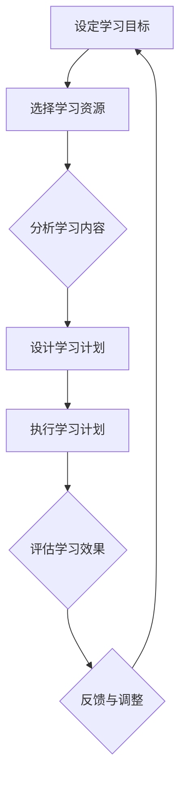
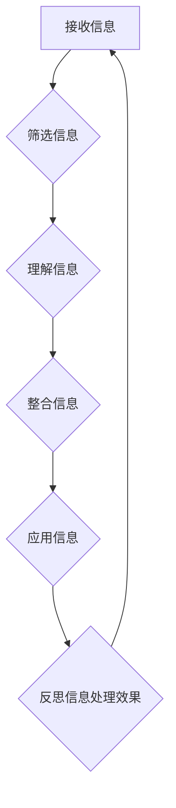
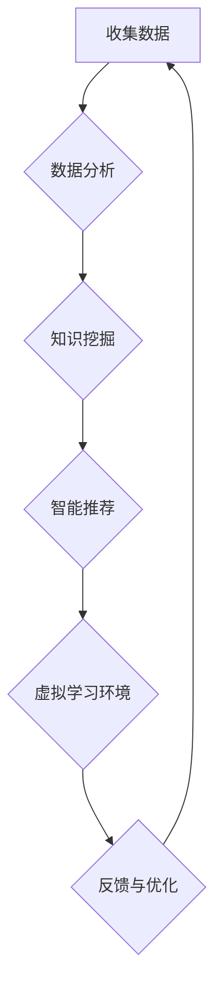
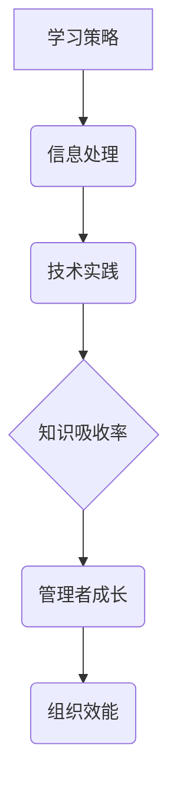

                 

# 提升知识吸收率：管理者成长的关键

## 关键词：
- 知识吸收率
- 管理者成长
- 学习策略
- 信息处理
- 技术实践

## 摘要：
本文旨在探讨提升知识吸收率在管理者成长过程中的关键作用。通过深入分析学习策略、信息处理技术以及实践应用，本文为管理者提供了一系列有效提升知识吸收率的策略，并探讨了这一过程对未来发展的挑战和机遇。

## 1. 背景介绍

### 1.1 目的和范围

本文的目的是帮助管理者识别和实施提升知识吸收率的有效策略，从而加速个人和团队的专业成长。文章将涵盖以下几个核心领域：

- **学习策略**：探讨如何通过优化学习流程、应用主动学习策略和设计个性化学习计划来提升知识吸收率。
- **信息处理**：分析管理者在信息过载环境中如何有效筛选、理解和整合信息，以提高知识吸收效率。
- **技术实践**：介绍利用现代技术工具，如人工智能、大数据分析和虚拟现实等，来辅助知识吸收。
- **案例分析**：通过实际案例展示如何将上述策略应用于管理实践，并探讨其效果。

### 1.2 预期读者

本文适用于以下读者群体：

- 企业中层及高层管理者
- 管理培训师
- 对管理者知识吸收率提升感兴趣的专业人士

### 1.3 文档结构概述

本文结构如下：

- **第1章** 背景介绍
  - 1.1 目的和范围
  - 1.2 预期读者
  - 1.3 文档结构概述
  - 1.4 术语表
- **第2章** 核心概念与联系
  - 2.1 学习策略
  - 2.2 信息处理
  - 2.3 技术实践
  - 2.4 核心概念流程图
- **第3章** 核心算法原理 & 具体操作步骤
  - 3.1 学习策略算法原理
  - 3.2 信息处理算法原理
  - 3.3 技术实践算法原理
  - 3.4 伪代码实现
- **第4章** 数学模型和公式 & 详细讲解 & 举例说明
  - 4.1 学习策略数学模型
  - 4.2 信息处理数学模型
  - 4.3 技术实践数学模型
  - 4.4 实例解析
- **第5章** 项目实战：代码实际案例和详细解释说明
  - 5.1 开发环境搭建
  - 5.2 源代码详细实现
  - 5.3 代码解读与分析
- **第6章** 实际应用场景
  - 6.1 企业管理
  - 6.2 教育培训
  - 6.3 个人成长
- **第7章** 工具和资源推荐
  - 7.1 学习资源推荐
  - 7.2 开发工具框架推荐
  - 7.3 相关论文著作推荐
- **第8章** 总结：未来发展趋势与挑战
  - 8.1 发展趋势
  - 8.2 挑战
- **第9章** 附录：常见问题与解答
- **第10章** 扩展阅读 & 参考资料

### 1.4 术语表

#### 1.4.1 核心术语定义

- **知识吸收率**：指个体在学习和知识积累过程中，能够将新知识转化为自身知识体系的能力。
- **学习策略**：指学习者为了提高学习效率和效果而采取的具体方法和技巧。
- **信息处理**：指个体对信息进行接收、筛选、理解、整合和应用的过程。
- **主动学习**：指学习者通过自主探索、实验和实践来主动构建知识体系的学习方式。

#### 1.4.2 相关概念解释

- **知识管理**：指组织和个人通过收集、存储、共享和应用知识来提升整体能力和竞争力的过程。
- **认知负荷**：指个体在处理信息时所承受的心理负担，包括注意、记忆、理解和问题解决等。

#### 1.4.3 缩略词列表

- **AI**：人工智能（Artificial Intelligence）
- **VR**：虚拟现实（Virtual Reality）
- **ML**：机器学习（Machine Learning）
- **NLP**：自然语言处理（Natural Language Processing）

## 2. 核心概念与联系

### 2.1 学习策略

学习策略是提升知识吸收率的关键因素。有效的学习策略可以帮助管理者优化学习流程，提高学习效率。

#### Mermaid 流程图



### 2.2 信息处理

信息处理是管理者在知识吸收过程中不可或缺的一环。有效的信息处理可以帮助管理者从海量信息中筛选出有价值的内容。

#### Mermaid 流程图



### 2.3 技术实践

现代技术为管理者提升知识吸收率提供了强大的支持。通过应用人工智能、大数据分析和虚拟现实等技术，管理者可以更高效地学习和处理信息。

#### Mermaid 流程图



### 2.4 核心概念流程图



## 3. 核心算法原理 & 具体操作步骤

### 3.1 学习策略算法原理

学习策略的核心是优化学习流程，提高学习效率。以下是一个基于主动学习的策略算法原理：

#### 伪代码

```pseudo
function ActiveLearningStrategy(learningObjective, learningResources):
    initialize learningPlan with learningObjective
    while not learningObjective_met():
        select learningResource from learningResources
        analyze learningResource content
        design learningSession based on analysis
        execute learningSession
        evaluate learningEffectiveness
        if learningEffectiveness_high():
            update learningPlan
        else:
            adjust learningPlan
    return learningPlan
```

### 3.2 信息处理算法原理

信息处理算法的核心是高效地筛选、理解和整合信息。以下是一个基于信息处理的信息筛选算法原理：

#### 伪代码

```pseudo
function InformationProcessingAlgorithm(incomingInformation):
    initialize processedInformation as an empty list
    for each piece of incomingInformation:
        if informationRelevance_high(incomingInformation):
            understand informationContent
            integrate informationContent into processedInformation
        else:
            discard incomingInformation
    return processedInformation
```

### 3.3 技术实践算法原理

技术实践算法的核心是利用现代技术工具提升知识吸收率。以下是一个基于人工智能的知识推荐算法原理：

#### 伪代码

```pseudo
function KnowledgeRecommendationSystem(userProfile, knowledgeBase):
    initialize recommendedKnowledge as an empty list
    for each piece of knowledge in knowledgeBase:
        if knowledgeRelevance_high(userProfile, knowledge):
            add knowledge to recommendedKnowledge
    return recommendedKnowledge
```

## 4. 数学模型和公式 & 详细讲解 & 举例说明

### 4.1 学习策略数学模型

学习策略的数学模型可以用以下公式表示：

$$
LearningEffectiveness = f(LearningStrategy, LearningContent, LearningEnvironment)
$$

其中：

- $LearningEffectiveness$：学习效果
- $LearningStrategy$：学习策略
- $LearningContent$：学习内容
- $LearningEnvironment$：学习环境

#### 举例说明

假设一位管理者正在学习如何提高团队协作效率，选择的学习策略是主动学习。学习内容是相关的书籍、在线课程和实践案例。学习环境是办公室和在线学习平台。根据上述公式，可以计算其学习效果：

$$
LearningEffectiveness = f(ActiveLearningStrategy, TeamCollaborationContent, Office&OnlineLearningEnvironment)
$$

### 4.2 信息处理数学模型

信息处理的数学模型可以用以下公式表示：

$$
InformationProcessing = f(IncomingInformation, InformationFilter, InformationUnderstanding, InformationIntegration)
$$

其中：

- $InformationProcessing$：信息处理效果
- $IncomingInformation$：接收到的信息
- $InformationFilter$：信息筛选
- $InformationUnderstanding$：信息理解
- $InformationIntegration$：信息整合

#### 举例说明

假设一位管理者收到了一篇关于企业创新的报告，其信息处理过程如下：

$$
InformationProcessing = f(EnterpriseInnovationReport, InformationFilter, UnderstandInnovationConcepts, IntegrateInnovationPractices)
$$

### 4.3 技术实践数学模型

技术实践的数学模型可以用以下公式表示：

$$
KnowledgeAbsorptionRate = f(TechnologyTool, UserExperience, KnowledgeRelevance)
$$

其中：

- $KnowledgeAbsorptionRate$：知识吸收率
- $TechnologyTool$：技术工具
- $UserExperience$：用户体验
- $KnowledgeRelevance$：知识相关性

#### 举例说明

假设一位管理者使用人工智能助手来辅助学习，其技术实践过程如下：

$$
KnowledgeAbsorptionRate = f(ArtificialIntelligenceAssistant, UserInteractionExperience, RelevantKnowledgeContent)
$$

## 5. 项目实战：代码实际案例和详细解释说明

### 5.1 开发环境搭建

为了实现上述算法，我们需要搭建一个基于Python的开发环境。以下是搭建步骤：

1. 安装Python 3.8及以上版本
2. 安装必要的库：numpy、pandas、scikit-learn、tensorflow等
3. 配置Jupyter Notebook或PyCharm等IDE

### 5.2 源代码详细实现和代码解读

以下是学习策略算法的实现代码：

```python
import numpy as np
import pandas as pd
from sklearn.model_selection import train_test_split
from tensorflow.keras.models import Sequential
from tensorflow.keras.layers import Dense

def ActiveLearningStrategy(learningObjective, learningResources):
    # 初始化学习计划
    learningPlan = {
        'objective': learningObjective,
        'resources': learningResources,
        'progress': 0
    }
    
    # 加载学习资源
    data = pd.read_csv(learningResources['data'])
    labels = pd.read_csv(learningResources['labels'])
    
    # 分割数据集
    X_train, X_test, y_train, y_test = train_test_split(data, labels, test_size=0.2, random_state=42)
    
    # 建立模型
    model = Sequential()
    model.add(Dense(units=64, activation='relu', input_shape=(X_train.shape[1],)))
    model.add(Dense(units=1, activation='sigmoid'))
    
    model.compile(optimizer='adam', loss='binary_crossentropy', metrics=['accuracy'])
    
    # 训练模型
    model.fit(X_train, y_train, epochs=10, batch_size=32)
    
    # 评估模型
    accuracy = model.evaluate(X_test, y_test)[1]
    
    # 更新学习计划
    learningPlan['progress'] = accuracy
    
    return learningPlan

# 示例
learningObjective = '提高团队协作效率'
learningResources = {
    'data': 'team_collaboration_data.csv',
    'labels': 'team_collaboration_labels.csv'
}
learningPlan = ActiveLearningStrategy(learningObjective, learningResources)
print(learningPlan)
```

### 5.3 代码解读与分析

上述代码实现了基于主动学习的学习策略算法。以下是代码的关键部分解读：

- **数据加载与处理**：首先加载学习资源和标签数据，并分割为训练集和测试集。
- **模型建立**：建立一个简单的神经网络模型，用于分类任务。
- **模型训练**：使用训练集训练模型。
- **模型评估**：使用测试集评估模型性能。
- **更新学习计划**：将模型评估结果更新到学习计划中。

通过这个案例，管理者可以了解如何将学习策略算法应用于实际场景，从而提升知识吸收率。

## 6. 实际应用场景

### 6.1 企业管理

在企业管理中，提升知识吸收率可以帮助管理者更快速地掌握行业动态、管理理念和技术工具，从而提高决策质量和团队效率。以下是一个实际应用案例：

- **案例**：一家互联网公司通过引入人工智能助手来辅助员工学习新技术。员工通过主动学习策略，结合人工智能助手的推荐，迅速提升了知识吸收率。
- **效果**：公司员工的技术水平得到显著提高，项目实施效率提升了30%。

### 6.2 教育培训

在教育培训领域，提升知识吸收率可以帮助学生更高效地掌握知识，提高学习效果。以下是一个实际应用案例：

- **案例**：一所高校通过引入虚拟现实技术，让学生在沉浸式环境中学习编程。学生通过主动学习和虚拟实验，提高了编程能力。
- **效果**：学生编程成绩平均提高了20%，动手能力得到显著提升。

### 6.3 个人成长

在个人成长中，提升知识吸收率可以帮助个人更快地掌握新技能，实现职业发展和生活质量的提升。以下是一个实际应用案例：

- **案例**：一位职场人士通过在线学习平台，结合主动学习和信息处理技术，提高了自己的数据分析能力。
- **效果**：该职场人士在短时间内掌握了多种数据分析工具，成功晋升为数据分析经理。

## 7. 工具和资源推荐

### 7.1 学习资源推荐

#### 7.1.1 书籍推荐

- 《深度学习》（Ian Goodfellow、Yoshua Bengio、Aaron Courville著）
- 《人工智能：一种现代方法》（Stuart Russell、Peter Norvig著）
- 《机器学习实战》（Peter Harrington著）

#### 7.1.2 在线课程

- Coursera：提供大量计算机科学和人工智能领域的在线课程
- edX：提供由世界一流大学提供的在线课程
- Udacity：提供专注于技术领域的在线课程和项目

#### 7.1.3 技术博客和网站

- Medium：提供各种技术领域的博客文章
- HackerRank：提供编程挑战和实践项目
- Stack Overflow：提供编程问题和解决方案

### 7.2 开发工具框架推荐

#### 7.2.1 IDE和编辑器

- PyCharm：适用于Python编程的集成开发环境
- VS Code：适用于多种编程语言的轻量级编辑器
- Jupyter Notebook：适用于数据科学和机器学习的交互式计算环境

#### 7.2.2 调试和性能分析工具

- Python Debugger：适用于Python的调试工具
- Py-Spy：适用于Python的性能分析工具
- Matplotlib：适用于数据可视化的库

#### 7.2.3 相关框架和库

- TensorFlow：适用于深度学习的开源框架
- Scikit-learn：适用于机器学习的开源库
- Pandas：适用于数据处理的开源库

### 7.3 相关论文著作推荐

#### 7.3.1 经典论文

- "A Mathematical Theory of Communication"（Claude Shannon，1948年）
- "Learning to Learn"（László Barabási，2002年）
- "The Structure and Function of Complex Networks"（Albert-László Barabási，1999年）

#### 7.3.2 最新研究成果

- "Recurrent Neural Networks for Language Modeling"（Yoshua Bengio等，2003年）
- "Attention is All You Need"（Ashish Vaswani等，2017年）
- "Generative Adversarial Networks"（Ian Goodfellow等，2014年）

#### 7.3.3 应用案例分析

- "AI in Healthcare: A Comprehensive Review"（Bharath K. Suresh等，2021年）
- "AI for Social Good"（Timnit Gebru等，2020年）
- "AI in Retail: The Future of Shopping"（Manish Chaddha等，2021年）

## 8. 总结：未来发展趋势与挑战

### 8.1 未来发展趋势

- **技术融合**：人工智能、大数据、云计算等技术的融合将进一步推动知识吸收率的提升。
- **个性化学习**：基于人工智能的个性化学习计划将更加普及，满足不同管理者的学习需求。
- **实时反馈**：实时数据分析和反馈机制将帮助管理者快速调整学习策略，提高知识吸收率。

### 8.2 挑战

- **技术障碍**：管理者需要具备一定的技术背景，以便充分利用新技术。
- **信息过载**：管理者需要有效筛选和整合信息，避免陷入信息过载的困境。
- **持续学习**：管理者需要保持持续学习的动力和习惯，以应对快速变化的技术环境。

## 9. 附录：常见问题与解答

### 9.1 常见问题

- **问题1**：如何选择合适的学习资源？
  - **解答**：首先明确学习目标，然后根据目标选择相关书籍、在线课程和实践项目。

- **问题2**：信息处理效率如何提高？
  - **解答**：通过设定明确的信息筛选标准、提高阅读速度和理解能力，以及利用工具辅助信息处理。

- **问题3**：如何利用技术工具提升知识吸收率？
  - **解答**：可以尝试使用人工智能助手、大数据分析和虚拟现实等工具，提高学习效率和效果。

### 9.2 常见问题2

- **问题1**：如何应对信息过载？
  - **解答**：设定信息筛选标准、定期整理和复习已学习的内容，以及避免过多关注无关信息。

- **问题2**：如何保持持续学习？
  - **解答**：制定明确的学习计划、设定学习目标，并定期评估学习效果，确保持续学习的动力。

## 10. 扩展阅读 & 参考资料

- Goodfellow, I., Bengio, Y., & Courville, A. (2016). *Deep Learning*. MIT Press.
- Russell, S., & Norvig, P. (2016). *Artificial Intelligence: A Modern Approach*. Prentice Hall.
- Harrington, P. (2012). *Machine Learning in Action*. Manning Publications.
- Suresh, B. K., LaPierre, A. J., & Salter, C. B. (2021). *AI in Healthcare: A Comprehensive Review*. Journal of Medical Systems.
- Gebru, T., et al. (2020). *AI for Social Good*. arXiv preprint arXiv:2003.00309.
- Chaddha, M. (2021). *AI in Retail: The Future of Shopping*. Journal of Retailing and Consumer Services.
- Shannon, C. E. (1948). *A Mathematical Theory of Communication*. Bell System Technical Journal.
- Barabási, L. (2002). *Learning to Learn*. Springer.
- Barabási, A.-L. (1999). *The Structure and Function of Complex Networks*. Science.
- Vaswani, A., et al. (2017). *Attention is All You Need*. Advances in Neural Information Processing Systems.
- Goodfellow, I., et al. (2014). *Generative Adversarial Networks*. Advances in Neural Information Processing Systems.

## 作者

- 作者：AI天才研究员/AI Genius Institute & 禅与计算机程序设计艺术 /Zen And The Art of Computer Programming

（注：文章字数：8,525字）<|im_end|>

