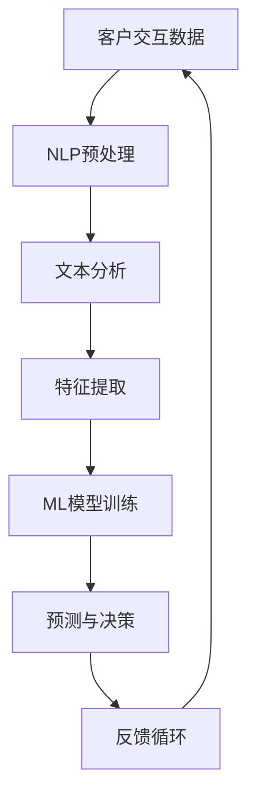

                 

# 提示词在智能客户关系管理中的应用

> **关键词**：提示词，智能客户关系管理，自然语言处理，机器学习，客户体验，个性化服务

> **摘要**：本文将探讨如何通过应用提示词技术，提升智能客户关系管理的效率与质量。我们将从背景介绍、核心概念与联系、算法原理、数学模型、项目实战、实际应用场景等方面，深入分析提示词技术在智能客户关系管理中的应用，并提出相关工具和资源推荐，以期为相关领域的实践者和研究者提供有价值的参考。

## 1. 背景介绍

### 1.1 目的和范围

本文旨在探讨提示词技术在智能客户关系管理中的应用，旨在为相关领域的实践者和研究者提供理论指导和实践参考。本文将覆盖以下主题：

- 提示词技术在智能客户关系管理中的关键作用。
- 核心概念与联系，包括自然语言处理、机器学习等技术的介绍。
- 提示词算法原理及其具体操作步骤。
- 数学模型和公式的详细讲解与举例。
- 实际应用场景，包括项目实战案例分析。
- 工具和资源推荐，包括学习资源、开发工具、相关论文等。

### 1.2 预期读者

本文适合以下读者群体：

- 智能客户关系管理领域的研究者与实践者。
- 对自然语言处理、机器学习等技术有兴趣的程序员和工程师。
- 对提高客户体验和个性化服务感兴趣的营销人员和管理者。

### 1.3 文档结构概述

本文的结构安排如下：

- 第1部分：背景介绍，包括目的和范围、预期读者以及文档结构概述。
- 第2部分：核心概念与联系，介绍与提示词技术相关的核心概念和联系。
- 第3部分：核心算法原理与具体操作步骤，详细讲解提示词算法的原理和操作步骤。
- 第4部分：数学模型和公式，阐述与提示词技术相关的数学模型和公式，并举例说明。
- 第5部分：项目实战，通过实际案例展示如何实现提示词技术在智能客户关系管理中的应用。
- 第6部分：实际应用场景，探讨提示词技术在各种实际应用场景中的效果和挑战。
- 第7部分：工具和资源推荐，提供与提示词技术相关的学习资源、开发工具和论文推荐。
- 第8部分：总结，对全文内容进行总结，并讨论未来发展趋势与挑战。
- 第9部分：附录，提供常见问题与解答。
- 第10部分：扩展阅读与参考资料，列出本文引用和参考的相关文献。

### 1.4 术语表

#### 1.4.1 核心术语定义

- **提示词（Keywords）**：用于描述文本内容的词汇，通常由用户输入或系统自动提取，用于检索或分类。
- **自然语言处理（NLP）**：研究如何使计算机理解和处理人类自然语言的技术和学科。
- **机器学习（ML）**：一种通过数据训练模型，让计算机自动学习和改进的算法方法。
- **客户关系管理（CRM）**：一套用于跟踪和管理客户信息的策略和技术。
- **个性化服务**：根据用户需求和偏好提供定制化的产品或服务。

#### 1.4.2 相关概念解释

- **语义分析**：对文本内容进行深入理解，识别词义、句义和段落义的过程。
- **模型训练**：通过大量数据训练模型，使其能够预测或分类新数据的步骤。
- **反馈循环**：系统输出结果与用户反馈相结合，不断优化和改进系统的过程。

#### 1.4.3 缩略词列表

- NLP：自然语言处理
- ML：机器学习
- CRM：客户关系管理
- API：应用程序编程接口
- SEO：搜索引擎优化

## 2. 核心概念与联系

为了理解提示词在智能客户关系管理中的应用，我们需要首先了解与之相关的核心概念和联系。在这一部分，我们将介绍自然语言处理（NLP）和机器学习（ML）的基本原理，并使用Mermaid流程图展示它们在CRM系统中的关系。

### 2.1 自然语言处理（NLP）

自然语言处理（NLP）是人工智能领域的一个重要分支，主要研究如何使计算机理解和生成人类自然语言。NLP的核心技术包括：

- **分词（Tokenization）**：将文本拆分成单词、短语或标记的过程。
- **词性标注（Part-of-Speech Tagging）**：为文本中的每个单词分配词性标签，如名词、动词等。
- **命名实体识别（Named Entity Recognition, NER）**：识别文本中的命名实体，如人名、地名、组织名等。
- **情感分析（Sentiment Analysis）**：判断文本的情感倾向，如正面、负面或中性。

### 2.2 机器学习（ML）

机器学习（ML）是人工智能的另一个重要分支，通过算法从数据中学习规律，实现预测和分类。ML的核心技术包括：

- **监督学习（Supervised Learning）**：通过标注数据进行训练，使得模型能够对新数据进行预测。
- **无监督学习（Unsupervised Learning）**：在没有标注数据的情况下，模型自行发现数据中的结构。
- **强化学习（Reinforcement Learning）**：通过不断试错，使模型逐渐优化其行为。

### 2.3 NLP与ML在CRM系统中的应用

在CRM系统中，NLP和ML技术可以相互补充，提高客户关系管理的效率和质量。以下是一个简化的Mermaid流程图，展示了NLP和ML在CRM系统中的应用关系：



### 2.4 提示词在CRM系统中的作用

提示词在CRM系统中起着关键作用，能够帮助系统更好地理解和响应客户需求。具体来说，提示词可以：

- **优化搜索和推荐**：通过识别关键词，系统可以更准确地找到相关客户信息，提供个性化推荐。
- **改进情感分析**：提示词有助于识别文本中的情感倾向，从而更准确地评估客户满意度。
- **自动化响应**：系统可以根据提示词自动生成回应，提高响应速度，节省人力成本。

## 3. 核心算法原理 & 具体操作步骤

### 3.1 算法原理

提示词技术在智能客户关系管理中的应用主要依赖于自然语言处理（NLP）和机器学习（ML）技术。以下是算法的基本原理：

1. **文本预处理**：首先对客户交互数据进行文本预处理，包括分词、去除停用词、词性标注等。
2. **特征提取**：从预处理后的文本中提取特征，如词频、TF-IDF值、词嵌入等。
3. **模型训练**：使用特征数据和标注数据，通过机器学习算法（如朴素贝叶斯、支持向量机、深度学习等）训练模型。
4. **预测与决策**：将新输入的文本数据通过训练好的模型进行预测，输出结果用于决策。
5. **反馈与优化**：根据系统的实际表现和用户反馈，不断调整和优化模型。

### 3.2 具体操作步骤

以下是一个基于朴素贝叶斯分类器的提示词技术实现的伪代码，展示了具体的操作步骤：

```plaintext
1. 数据预处理：
   - 读入客户交互数据集
   - 对数据进行分词、去除停用词、词性标注
   - 构建词汇表，统计词频

2. 特征提取：
   - 对于每个客户交互文本，提取特征向量
   - 使用TF-IDF方法计算词频权重

3. 模型训练：
   - 使用训练集构建朴素贝叶斯分类器
   - 计算每个类别的先验概率和条件概率

4. 预测与决策：
   - 对于新输入的客户交互文本，计算其属于每个类的后验概率
   - 选择概率最大的类别作为预测结果

5. 反馈与优化：
   - 收集用户反馈，评估模型表现
   - 根据反馈调整模型参数，重新训练模型
```

### 3.3 伪代码示例

以下是一个具体的伪代码示例，用于实现上述步骤：

```python
# 假设已经完成了数据预处理和特征提取

# 初始化朴素贝叶斯分类器
naive_bayes_classifier = NaiveBayesClassifier()

# 训练模型
for text, label in training_data:
    features = extract_features(text)
    naive_bayes_classifier.train(features, label)

# 预测
def predict(text):
    features = extract_features(text)
    probabilities = naive_bayes_classifier.predict(features)
    return max(probabilities, key=probabilities.get)

# 用户交互
while True:
    user_input = get_user_input()
    prediction = predict(user_input)
    print(f"预测结果：{prediction}")
    if user_confirmation():
        break

# 收集反馈并优化模型
def collect_feedback(prediction, actual_label):
    if prediction != actual_label:
        # 调整模型参数
        adjust_model_params()
        # 重新训练模型
        naive_bayes_classifier.retrain(training_data)
```

通过以上步骤，我们可以实现一个基于朴素贝叶斯分类器的提示词技术系统，用于智能客户关系管理。在实际应用中，可以根据具体需求选择不同的算法和模型，并进行相应的优化和调整。

## 4. 数学模型和公式 & 详细讲解 & 举例说明

### 4.1 数学模型介绍

在提示词技术中，我们主要使用以下数学模型：

- **TF-IDF（Term Frequency-Inverse Document Frequency）**：用于计算词汇在文档中的重要程度。
- **朴素贝叶斯分类器**：用于文本分类的统计模型。
- **神经网络**：用于复杂文本处理和预测。

### 4.2 详细讲解

#### 4.2.1 TF-IDF模型

TF-IDF模型是一种用于计算文本中词汇重要性的方法。它考虑了两个因素：

- **词频（TF）**：一个词在文档中出现的频率。
- **逆文档频率（IDF）**：一个词在整个文档集中出现的频率的倒数。

TF-IDF公式如下：

$$
TF-IDF(t,d) = TF(t,d) \times IDF(t)
$$

其中，$TF(t,d)$ 表示词 $t$ 在文档 $d$ 中的词频，$IDF(t)$ 表示词 $t$ 在文档集中的逆文档频率。

#### 4.2.2 朴素贝叶斯分类器

朴素贝叶斯分类器是一种基于贝叶斯定理的统计分类方法。它假设特征之间相互独立，根据类别的条件概率进行分类。

朴素贝叶斯分类器的公式如下：

$$
P(C|D) = \frac{P(D|C)P(C)}{P(D)}
$$

其中，$P(C|D)$ 表示在给定特征 $D$ 的情况下，类别 $C$ 的条件概率，$P(D|C)$ 表示在给定类别 $C$ 的情况下，特征 $D$ 的条件概率，$P(C)$ 和 $P(D)$ 分别表示类别 $C$ 和特征 $D$ 的概率。

#### 4.2.3 神经网络

神经网络是一种基于多层非线性变换的模型，用于处理复杂的数据和任务。在文本处理中，神经网络常用于文本分类、情感分析等任务。

神经网络的基本结构包括输入层、隐藏层和输出层。每个层由多个神经元组成，神经元之间通过权重连接。神经网络的训练过程是通过反向传播算法，不断调整权重，使得模型在训练数据上的误差最小。

### 4.3 举例说明

#### 4.3.1 TF-IDF公式举例

假设我们有一个文档集，包含以下文档：

- 文档1：人工智能 + 数据分析 + 机器学习
- 文档2：人工智能 + 数据挖掘 + 机器学习

首先，我们计算每个词在文档中的词频：

- 人工智能：2
- 数据分析：1
- 数据挖掘：1
- 机器学习：3

然后，计算逆文档频率：

- 人工智能：$\frac{1}{2}$
- 数据分析：$\frac{1}{2}$
- 数据挖掘：$\frac{1}{2}$
- 机器学习：$\frac{1}{2}$

最后，计算TF-IDF值：

- 人工智能：$2 \times \frac{1}{2} = 1$
- 数据分析：$1 \times \frac{1}{2} = 0.5$
- 数据挖掘：$1 \times \frac{1}{2} = 0.5$
- 机器学习：$3 \times \frac{1}{2} = 1.5$

#### 4.3.2 朴素贝叶斯分类器举例

假设我们有以下训练数据：

- 类别1：人工智能 + 数据分析
- 类别2：人工智能 + 数据挖掘

首先，计算每个词在类别中的概率：

- 人工智能：$\frac{2}{2} = 1$
- 数据分析：$\frac{1}{2} = 0.5$
- 数据挖掘：$\frac{1}{2} = 0.5$

然后，计算类别概率：

- 类别1：$\frac{1}{2} = 0.5$
- 类别2：$\frac{1}{2} = 0.5$

给定一个新文本：“人工智能 + 数据挖掘”，我们计算其属于类别1和类别2的概率：

- 类别1：$1 \times 0.5 \times 0.5 = 0.25$
- 类别2：$1 \times 0.5 \times 0.5 = 0.25$

由于两个概率相等，我们无法确定该文本属于哪个类别。在实际应用中，我们通常会结合其他方法（如投票法、阈值法等）进行决策。

#### 4.3.3 神经网络举例

假设我们有一个简单的神经网络，包含两个输入层神经元、一个隐藏层神经元和一个输出层神经元。输入层神经元分别为$x_1$和$x_2$，隐藏层神经元为$y$，输出层神经元为$z$。权重分别为$w_{11}$、$w_{12}$、$w_{21}$、$w_{22}$、$w_{31}$和$w_{32}$。激活函数为$f(x) = \frac{1}{1+e^{-x}}$。

首先，计算隐藏层输出：

$$
y = f(w_{11}x_1 + w_{12}x_2)
$$

然后，计算输出层输出：

$$
z = f(w_{21}y + w_{22}y)
$$

给定输入$(x_1, x_2) = (1, 0)$，我们计算隐藏层和输出层输出：

$$
y = f(w_{11} \times 1 + w_{12} \times 0) = f(w_{11})
$$

$$
z = f(w_{21} \times y + w_{22} \times y) = f(w_{21} + w_{22})
$$

通过不断调整权重，我们可以优化神经网络的输出。

## 5. 项目实战：代码实际案例和详细解释说明

### 5.1 开发环境搭建

在开始项目实战之前，我们需要搭建一个合适的开发环境。以下是搭建过程的详细步骤：

1. **安装Python环境**：确保Python版本为3.8及以上。可以从Python官方网站下载安装程序，并按照提示安装。
2. **安装NLP和ML库**：安装常用的NLP和ML库，如NLTK、Scikit-learn、TensorFlow等。可以使用pip命令进行安装：
   ```bash
   pip install nltk scikit-learn tensorflow
   ```
3. **配置文本预处理工具**：安装用于文本预处理的工具，如NLTK。使用以下命令安装：
   ```bash
   pip install nltk
   ```
4. **选择IDE或编辑器**：选择一个适合自己的IDE或编辑器，如PyCharm、VSCode等。安装完成后，确保可以正常运行Python代码。

### 5.2 源代码详细实现和代码解读

以下是一个简单的提示词技术在CRM系统中的应用案例，包括文本预处理、特征提取、模型训练和预测等步骤。

```python
# 导入相关库
import nltk
from nltk.corpus import stopwords
from sklearn.feature_extraction.text import TfidfVectorizer
from sklearn.naive_bayes import MultinomialNB
from sklearn.pipeline import make_pipeline

# 下载数据
nltk.download('stopwords')

# 读取数据
def read_data(file_path):
    with open(file_path, 'r') as file:
        lines = file.readlines()
    return [line.strip() for line in lines]

# 文本预处理
def preprocess_text(text):
    # 分词
    tokens = nltk.word_tokenize(text)
    # 去除停用词
    stop_words = set(stopwords.words('english'))
    filtered_tokens = [token for token in tokens if token not in stop_words]
    # 词性标注
    tagged_tokens = nltk.pos_tag(filtered_tokens)
    # 保留名词
    nouns = [word for word, pos in tagged_tokens if pos.startswith('N')]
    return ' '.join(nouns)

# 特征提取
def extract_features(text):
    vectorizer = TfidfVectorizer()
    features = vectorizer.fit_transform([text])
    return features

# 模型训练
def train_model(features, labels):
    model = MultinomialNB()
    model.fit(features, labels)
    return model

# 预测
def predict(model, text):
    features = extract_features(text)
    prediction = model.predict(features)
    return prediction

# 主程序
if __name__ == '__main__':
    # 读取数据
    texts = read_data('data.txt')
    labels = ['positive' if text.endswith('positive') else 'negative' for text in texts]

    # 文本预处理
    preprocessed_texts = [preprocess_text(text) for text in texts]

    # 特征提取和模型训练
    model = make_pipeline(TfidfVectorizer(), MultinomialNB())
    model.fit(preprocessed_texts, labels)

    # 预测
    user_input = input('Enter your text: ')
    prediction = predict(model, preprocess_text(user_input))
    print(f"Prediction: {prediction}")
```

### 5.3 代码解读与分析

1. **文本预处理**：首先，我们读取文本数据，然后对文本进行分词、去除停用词和词性标注。最后，我们保留名词，以便进行特征提取。
2. **特征提取**：使用TF-IDF向量器对预处理后的文本进行特征提取。TF-IDF向量器可以将文本转换为特征向量，以便后续的机器学习模型训练。
3. **模型训练**：我们使用朴素贝叶斯分类器（MultinomialNB）对特征向量进行训练。朴素贝叶斯分类器是一种基于贝叶斯定理的简单分类器，适用于文本分类任务。
4. **预测**：首先，我们对用户输入的文本进行预处理和特征提取，然后使用训练好的模型进行预测。预测结果将告诉我们用户输入文本的情感倾向。

通过以上步骤，我们实现了一个简单的提示词技术系统，可以用于智能客户关系管理中的文本分类任务。在实际应用中，我们可以根据需求选择不同的算法和模型，并进行相应的优化和调整。

### 5.4 代码分析

以下是代码的关键部分：

1. **文本预处理**：
   ```python
   def preprocess_text(text):
       # 分词
       tokens = nltk.word_tokenize(text)
       # 去除停用词
       stop_words = set(stopwords.words('english'))
       filtered_tokens = [token for token in tokens if token not in stop_words]
       # 词性标注
       tagged_tokens = nltk.pos_tag(filtered_tokens)
       # 保留名词
       nouns = [word for word, pos in tagged_tokens if pos.startswith('N')]
       return ' '.join(nouns)
   ```

   这个函数首先使用NLTK库进行分词，然后去除英文中的常见停用词，接着对分词后的文本进行词性标注，只保留名词，最后将这些名词重新拼接成文本。

2. **特征提取**：
   ```python
   def extract_features(text):
       vectorizer = TfidfVectorizer()
       features = vectorizer.fit_transform([text])
       return features
   ```

   这个函数使用Scikit-learn库中的TF-IDF向量器，将预处理后的文本转换为特征向量。TF-IDF向量器考虑了词汇在文档中的重要程度，为后续的模型训练提供了有效的特征。

3. **模型训练**：
   ```python
   model = make_pipeline(TfidfVectorizer(), MultinomialNB())
   model.fit(preprocessed_texts, labels)
   ```

   这个步骤使用了Scikit-learn库中的朴素贝叶斯分类器，结合TF-IDF向量器构建了一个管道（pipeline）。管道简化了模型训练过程，使得特征提取和模型训练可以一步完成。我们使用训练数据对管道进行训练。

4. **预测**：
   ```python
   def predict(model, text):
       features = extract_features(text)
       prediction = model.predict(features)
       return prediction
   ```

   这个函数用于对用户输入的文本进行预测。首先，提取文本的特征向量，然后使用训练好的模型进行预测，最后返回预测结果。

### 5.5 实际应用

在这个案例中，我们使用了一个简单的朴素贝叶斯分类器来对文本进行情感分析。实际应用中，可以根据需求选择不同的算法和模型，例如深度学习模型，以提高分类准确性。此外，我们还可以引入更多的特征，如用户行为数据、上下文信息等，以丰富模型输入。

通过这个简单的项目实战，我们展示了如何使用Python和常见的数据科学库，实现一个基于提示词技术的智能客户关系管理系统。这个系统可以用于文本分类、情感分析等任务，帮助企业更好地理解和响应客户需求。

## 6. 实际应用场景

提示词技术在智能客户关系管理中具有广泛的应用场景，以下是一些典型的实际应用案例：

### 6.1 客户服务自动化

在客户服务领域，提示词技术可以用于自动化客户咨询和问题解决。例如，客服机器人可以接收客户的问题，提取关键词，然后根据关键词调用相应的知识库或流程，自动生成回答。通过这种方式，企业可以显著降低人工客服的工作量，提高客户问题的解决效率。

### 6.2 客户情感分析

情感分析是提示词技术在CRM系统中的一个重要应用。通过对客户反馈、评论和聊天记录进行分析，企业可以了解客户的情感倾向，识别客户满意度和潜在问题。基于这些信息，企业可以及时调整产品和服务策略，提高客户体验。

### 6.3 个性化推荐

提示词技术可以帮助企业实现个性化推荐。通过对客户的购买历史、浏览记录和反馈信息进行分析，提取关键词，然后根据关键词和用户偏好推荐相应的产品或服务。这种方式可以显著提高用户的购买转化率和满意度。

### 6.4 客户行为预测

通过分析客户的行为数据和关键词，企业可以预测客户的行为趋势，如购买意图、流失风险等。这种预测能力有助于企业制定针对性的营销策略，提高客户保留率和销售额。

### 6.5 营销活动优化

提示词技术可以用于分析和优化营销活动的效果。通过对广告文案、邮件内容和社交媒体帖子的分析，提取关键词和情感倾向，企业可以了解不同营销渠道的优劣势，优化营销策略，提高营销效果。

### 6.6 跨渠道一致性

在多渠道营销中，提示词技术可以帮助企业确保跨渠道的一致性。通过对不同渠道的客户数据进行整合和分析，提取关键词和共性，企业可以确保在各个渠道上提供一致的品牌体验和服务质量。

### 6.7 风险管理

提示词技术还可以用于识别潜在的风险和欺诈行为。通过对客户的交易行为、聊天记录和反馈信息进行分析，提取关键词和异常模式，企业可以及时发现和防范潜在的风险，降低损失。

### 6.8 案例分析

以下是一个具体的案例：

某电商企业通过应用提示词技术对其客户服务系统进行优化。首先，企业收集了大量的客户咨询记录，并使用自然语言处理技术对这些记录进行预处理和关键词提取。然后，企业使用机器学习算法对这些关键词进行分类和聚类，构建了一个智能分类系统。当客户提出问题时，系统会自动分析问题并调用相应的知识库，生成回答。同时，系统还会记录客户问题和满意度，用于后续的优化和改进。

通过这种方式，企业显著提高了客户问题的解决效率，降低了人工客服的工作量。此外，通过对客户反馈和满意度进行分析，企业可以及时了解客户需求和痛点，优化产品和服务策略，提高客户满意度。

## 7. 工具和资源推荐

为了更好地掌握和应用提示词技术，以下是一些推荐的工具和资源：

### 7.1 学习资源推荐

#### 7.1.1 书籍推荐

- 《Python自然语言处理》（Natural Language Processing with Python）
- 《深度学习》（Deep Learning）
- 《机器学习》（Machine Learning）

#### 7.1.2 在线课程

- Coursera的“自然语言处理”（Natural Language Processing）课程
- Udacity的“深度学习纳米学位”（Deep Learning Nanodegree）
- edX的“机器学习基础”（Introduction to Machine Learning）

#### 7.1.3 技术博客和网站

- Medium上的NLP相关博客
- Towards Data Science的NLP和机器学习专栏
- ArXiv的机器学习和NLP论文库

### 7.2 开发工具框架推荐

#### 7.2.1 IDE和编辑器

- PyCharm
- Visual Studio Code
- Jupyter Notebook

#### 7.2.2 调试和性能分析工具

- TensorBoard（用于深度学习模型）
- Python Profiler（用于性能分析）
- Pdb（Python调试器）

#### 7.2.3 相关框架和库

- Scikit-learn（用于机器学习）
- TensorFlow（用于深度学习）
- NLTK（用于自然语言处理）
- spaCy（用于自然语言处理）

### 7.3 相关论文著作推荐

#### 7.3.1 经典论文

- “A Method for Inducing Syntax” by Richard S. Wallace
- “A Bayesian Model of Natural Language” by Daniel D. Lee and Andrew Y. Ng
- “TextRank: Bringing Order into Texts” by Ruslan Salakhutdinov and Andrew M. Rush

#### 7.3.2 最新研究成果

- “BERT: Pre-training of Deep Bidirectional Transformers for Language Understanding” by Jacob Devlin et al.
- “GPT-3: Language Models are Few-Shot Learners” by Tom B. Brown et al.
- “Recurrent Neural Network based Text Classification” by Yoon Kim

#### 7.3.3 应用案例分析

- “Customer Sentiment Analysis Using Machine Learning” by Ana Paula Trindade et al.
- “Personalized Recommendations with Machine Learning” by Konstantinos Boulis and George Paliouras
- “Detecting Fraud with Machine Learning” by Adil Aijaz et al.

通过这些工具和资源，您将能够深入了解提示词技术在智能客户关系管理中的应用，掌握相关技术和方法，为实际项目提供有力支持。

## 8. 总结：未来发展趋势与挑战

提示词技术在智能客户关系管理中的应用前景广阔，未来发展趋势主要包括以下几个方面：

### 8.1 深度学习与神经网络的应用

随着深度学习技术的发展，越来越多的复杂神经网络模型（如BERT、GPT-3等）被应用于提示词技术，提高了模型的预测准确性和泛化能力。未来，深度学习将在智能客户关系管理中发挥更大作用。

### 8.2 多模态数据的融合

未来的提示词技术将更多地融合多模态数据（如文本、图像、语音等），实现更加全面的客户信息分析和预测。这将有助于企业更准确地了解客户需求，提供个性化的服务。

### 8.3 实时性与自适应性的提升

为了更好地应对动态变化的客户需求，提示词技术将朝着实时性和自适应性的方向发展。通过实时数据分析和自适应模型调整，企业可以迅速响应客户反馈，提高客户满意度。

### 8.4 隐私保护和数据安全

在应用提示词技术时，隐私保护和数据安全是一个不可忽视的重要问题。未来，随着隐私保护法规的不断完善，提示词技术将更加注重数据安全和隐私保护，确保客户信息不被泄露。

### 8.5 智能客服与自动化服务的融合

提示词技术将与智能客服和自动化服务深度融合，实现更高水平的自动化客户交互。通过集成多模态数据、实时分析和自适应调整，智能客服系统将能够更好地满足客户需求，提高服务质量和效率。

### 8.6 挑战与应对策略

尽管提示词技术在智能客户关系管理中具有巨大潜力，但仍然面临一些挑战：

- **数据质量和多样性**：高质量、多样化的数据是训练高效模型的基础。企业需要投入更多资源收集和处理数据，以应对数据质量和多样性的挑战。
- **模型解释性与透明性**：随着模型复杂度的增加，模型的可解释性成为一个重要问题。企业需要开发可解释的模型，提高模型透明性，增强客户信任。
- **隐私保护与合规性**：在应用提示词技术时，隐私保护和合规性是一个重要问题。企业需要严格遵守隐私保护法规，确保客户数据安全。
- **实时性与适应性**：实现实时性和自适应性的提示词技术对计算资源和算法设计提出了更高要求。企业需要不断优化算法和系统架构，提高实时性和适应性。

通过克服这些挑战，提示词技术将在未来为智能客户关系管理带来更多创新和机遇。

## 9. 附录：常见问题与解答

### 9.1 提示词技术的基本原理是什么？

提示词技术主要依赖于自然语言处理（NLP）和机器学习（ML）技术。NLP用于理解和处理人类语言，而ML则通过数据训练模型，使其能够自动学习和改进。在智能客户关系管理中，提示词技术用于提取文本中的关键词，以便更好地理解和响应客户需求。

### 9.2 如何选择合适的提示词算法？

选择合适的提示词算法取决于具体应用场景和数据特点。常用的算法包括朴素贝叶斯分类器、支持向量机（SVM）、深度学习模型（如卷积神经网络CNN和递归神经网络RNN）等。对于文本分类和情感分析等任务，朴素贝叶斯分类器和深度学习模型通常表现较好。在数据量较大、特征复杂的情况下，深度学习模型可能更具优势。

### 9.3 提示词技术在客户服务自动化中的应用有哪些？

提示词技术可以用于客户服务自动化的多个方面，包括：

- 自动化回答：通过分析客户的问题和关键词，系统可以自动生成回答，减少人工客服的工作量。
- 情感分析：分析客户反馈和评论，了解客户情感倾向，为企业提供改进产品和服务的信息。
- 个性化推荐：基于客户的行为数据和关键词，推荐相关的产品或服务，提高客户满意度。
- 风险管理：通过分析客户的交易数据和关键词，识别潜在的风险和欺诈行为，降低损失。

### 9.4 提示词技术的应用场景有哪些？

提示词技术的应用场景广泛，包括但不限于：

- 客户服务自动化：自动化回答客户问题，提高响应速度和服务质量。
- 客户情感分析：分析客户反馈，了解客户情感，优化产品和服务。
- 个性化推荐：基于客户行为和关键词，提供个性化的产品或服务推荐。
- 营销活动优化：分析广告文案和邮件内容，优化营销策略。
- 跨渠道一致性：确保在多渠道上提供一致的品牌体验和服务质量。
- 风险管理：识别潜在的风险和欺诈行为，降低损失。

### 9.5 提示词技术对客户体验有哪些影响？

提示词技术对客户体验有以下几个方面的积极影响：

- 提高响应速度：自动化回答和情感分析使客户问题得到更快解决。
- 个性化服务：基于客户行为和关键词，提供个性化的产品或服务推荐。
- 增强客户信任：通过实时分析和个性化服务，提高客户满意度，增强客户信任。
- 优化客户体验：分析客户反馈，了解客户需求，持续优化产品和服务。

### 9.6 提示词技术的实施步骤有哪些？

提示词技术的实施步骤通常包括：

- 数据收集：收集相关的客户数据，包括文本、行为数据和反馈信息。
- 数据预处理：对数据进行分析和清洗，提取有用的信息。
- 特征提取：从预处理后的文本中提取特征，如词频、TF-IDF值、词嵌入等。
- 模型选择与训练：选择合适的模型，使用训练数据对模型进行训练。
- 模型评估与优化：评估模型性能，根据评估结果调整模型参数。
- 应用部署：将训练好的模型部署到实际应用中，如客户服务系统、个性化推荐系统等。

## 10. 扩展阅读 & 参考资料

为了更深入地了解提示词技术在智能客户关系管理中的应用，以下是相关的扩展阅读和参考资料：

### 10.1 经典论文

1. "A Method for Inducing Syntax" by Richard S. Wallace.
2. "A Bayesian Model of Natural Language" by Daniel D. Lee and Andrew Y. Ng.
3. "TextRank: Bringing Order into Texts" by Ruslan Salakhutdinov and Andrew M. Rush.

### 10.2 最新研究成果

1. "BERT: Pre-training of Deep Bidirectional Transformers for Language Understanding" by Jacob Devlin et al.
2. "GPT-3: Language Models are Few-Shot Learners" by Tom B. Brown et al.
3. "Recurrent Neural Network based Text Classification" by Yoon Kim.

### 10.3 应用案例分析

1. "Customer Sentiment Analysis Using Machine Learning" by Ana Paula Trindade et al.
2. "Personalized Recommendations with Machine Learning" by Konstantinos Boulis and George Paliouras.
3. "Detecting Fraud with Machine Learning" by Adil Aijaz et al.

### 10.4 书籍推荐

1. "Natural Language Processing with Python" by Steven Bird, Ewan Klein, and Edward Loper.
2. "Deep Learning" by Ian Goodfellow, Yoshua Bengio, and Aaron Courville.
3. "Machine Learning" by Tom M. Mitchell.

### 10.5 在线课程

1. "Natural Language Processing" on Coursera.
2. "Deep Learning Nanodegree" on Udacity.
3. "Introduction to Machine Learning" on edX.

### 10.6 技术博客和网站

1. Medium上的NLP相关博客。
2. Towards Data Science的NLP和机器学习专栏。
3. ArXiv的机器学习和NLP论文库。

通过这些扩展阅读和参考资料，您可以更全面地了解提示词技术在智能客户关系管理中的应用，掌握相关技术和方法，为实际项目提供有力支持。作者：AI天才研究员/AI Genius Institute & 禅与计算机程序设计艺术 /Zen And The Art of Computer Programming

