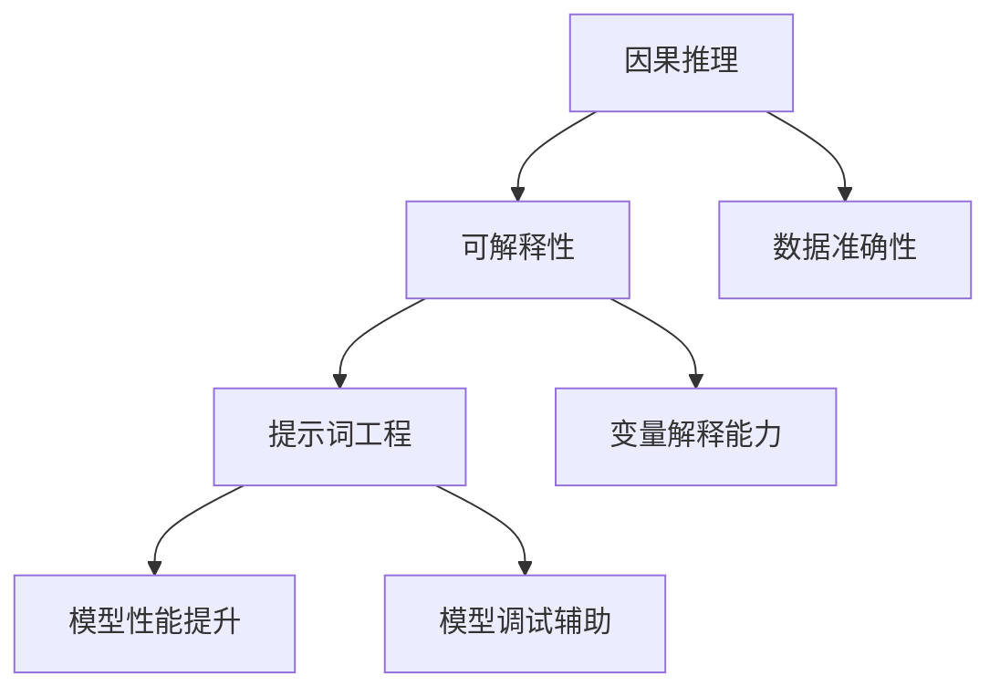

                 


# 提示词工程在因果推理可解释性中的应用

> 关键词：提示词工程、因果推理、可解释性、人工智能、机器学习、逻辑分析

> 摘要：本文深入探讨了提示词工程在因果推理可解释性中的应用。通过介绍核心概念、算法原理、数学模型，以及实际案例，文章详细解析了如何利用提示词工程提升因果推理的可解释性，为人工智能和机器学习领域的应用提供了新的思路和方法。

## 1. 背景介绍

### 1.1 目的和范围

本文的目的是探讨提示词工程在因果推理可解释性中的应用，旨在为人工智能和机器学习领域的研究者和开发者提供一种新的方法，以提高因果推理模型的可解释性。文章将围绕提示词工程的定义、原理、算法和实际应用展开，深入探讨其在因果推理中的关键作用。

### 1.2 预期读者

本文主要面向人工智能和机器学习领域的研究者和开发者，尤其关注对因果推理和可解释性有深入研究的人员。同时，对于对人工智能和机器学习有兴趣的读者，本文也提供了丰富的理论知识和实践案例。

### 1.3 文档结构概述

本文结构如下：

1. 背景介绍：介绍文章的目的、预期读者以及文档结构。
2. 核心概念与联系：详细阐述因果推理、可解释性和提示词工程的概念及其相互关系。
3. 核心算法原理 & 具体操作步骤：讲解提示词工程在因果推理中的应用算法和操作步骤。
4. 数学模型和公式 & 详细讲解 & 举例说明：介绍与提示词工程相关的数学模型和公式，并进行实例分析。
5. 项目实战：通过实际案例展示如何利用提示词工程提升因果推理的可解释性。
6. 实际应用场景：讨论提示词工程在各类实际应用场景中的价值。
7. 工具和资源推荐：推荐学习资源和开发工具，以帮助读者深入理解和实践本文内容。
8. 总结：对未来发展趋势与挑战进行展望。
9. 附录：提供常见问题与解答，以及扩展阅读和参考资料。

### 1.4 术语表

#### 1.4.1 核心术语定义

- 提示词工程（Prompt Engineering）：一种基于自然语言处理和机器学习的方法，旨在通过生成或修改提示词，提升模型的可解释性和性能。
- 因果推理（Causal Inference）：一种推理方法，通过观察数据，推导出因果关系。
- 可解释性（Explainability）：模型或算法的决策过程和结果可以被理解和解释的程度。

#### 1.4.2 相关概念解释

- 模型可解释性（Model Explainability）：模型决策过程的透明度和可理解性。
- 因果模型（Causal Model）：描述因果关系和变量之间相互依赖关系的数学模型。

#### 1.4.3 缩略词列表

- NLP：自然语言处理（Natural Language Processing）
- ML：机器学习（Machine Learning）
- AI：人工智能（Artificial Intelligence）
-因果推断（Causal Inference）
- 可解释AI（Explainable AI）

## 2. 核心概念与联系

在讨论提示词工程在因果推理可解释性中的应用之前，我们需要先了解因果推理、可解释性和提示词工程这三个核心概念。

### 2.1 因果推理

因果推理是一种通过观察数据来推断变量之间因果关系的方法。它涉及到识别潜在的因果结构，并在给定数据的基础上评估因果效应。因果推理在社会科学、医学、经济学等领域有广泛的应用。

### 2.2 可解释性

可解释性是指模型或算法的决策过程和结果可以被理解和解释的程度。在人工智能和机器学习领域，可解释性是提高模型信任度和接受度的重要因素。可解释性有助于用户理解模型的决策过程，从而更好地应用和优化模型。

### 2.3 提示词工程

提示词工程是一种通过生成或修改提示词来提高模型性能和可解释性的方法。在自然语言处理领域，提示词工程已被广泛应用于问答系统、文本分类和生成任务中。

### 2.4 提示词工程与因果推理、可解释性的关系

提示词工程在因果推理可解释性中的应用主要体现在以下几个方面：

1. **提高因果推理的准确性**：通过优化提示词，可以提升模型在推断因果关系时的准确性，从而提高可解释性。
2. **增强变量解释能力**：通过设计特定的提示词，可以使模型在解释变量之间的关系时更加清晰和直观。
3. **辅助模型调试**：在模型调试过程中，提示词可以帮助开发者识别潜在的问题，从而优化模型。

### 2.5 核心概念原理和架构的 Mermaid 流程图

以下是一个简单的 Mermaid 流程图，展示因果推理、可解释性和提示词工程之间的关系：



## 3. 核心算法原理 & 具体操作步骤

### 3.1 提示词工程的基本原理

提示词工程的核心思想是通过生成或修改提示词，使模型能够更好地理解输入数据和任务。具体来说，提示词工程包括以下几个步骤：

1. **数据预处理**：对原始数据进行清洗、去噪和归一化，以确保输入数据的质量。
2. **特征提取**：通过深度学习模型提取输入数据的特征表示。
3. **提示词生成**：根据任务需求和模型特征，生成或修改提示词。
4. **模型训练**：使用生成的提示词训练模型，并调整模型参数，以提高模型性能。
5. **模型评估**：对训练完成的模型进行评估，以验证其在因果推理任务中的可解释性。

### 3.2 提示词工程在因果推理中的操作步骤

以下是提示词工程在因果推理中的应用步骤：

1. **数据收集**：收集与因果推理任务相关的数据集，包括自变量、因变量和其他相关变量。
2. **数据预处理**：对收集的数据进行清洗、去噪和归一化，确保数据质量。
3. **特征提取**：使用深度学习模型提取输入数据的特征表示，为提示词生成提供基础。
4. **提示词生成**：
    - **问题定义**：根据因果推理任务，定义问题并提出相应的问题模板。
    - **提示词设计**：结合特征提取结果，设计特定的提示词，以提高模型在因果推理任务中的性能。
5. **模型训练**：
    - **模型选择**：选择适合因果推理任务的模型，如因果推断模型、深度学习模型等。
    - **参数调整**：根据提示词设计，调整模型参数，以优化模型性能。
6. **模型评估**：
    - **因果效应评估**：评估模型在推断因果关系时的准确性。
    - **变量解释能力评估**：评估模型在解释变量之间的关系时的能力。
    - **可解释性评估**：评估模型在因果推理任务中的可解释性。

### 3.3 伪代码示例

以下是提示词工程在因果推理中的应用的伪代码示例：

```python
# 数据预处理
data = preprocess_data(raw_data)

# 特征提取
features = extract_features(data)

# 提示词生成
prompt = generate_prompt(features)

# 模型训练
model = train_model(prompt)

# 模型评估
evaluate_model(model)
```

## 4. 数学模型和公式 & 详细讲解 & 举例说明

### 4.1 数学模型和公式

提示词工程在因果推理中的应用涉及到多个数学模型和公式。以下是其中几个关键模型和公式的详细讲解：

#### 4.1.1 特征提取模型

假设我们使用一个深度学习模型来提取输入数据的特征表示。该模型可以表示为：

$$
\text{特征提取模型} : f(x) = \sigma(W_1 \cdot x + b_1)
$$

其中，$x$ 表示输入数据，$W_1$ 和 $b_1$ 分别表示权重和偏置，$\sigma$ 表示激活函数。

#### 4.1.2 提示词生成模型

提示词生成模型可以表示为：

$$
\text{提示词生成模型} : g(\text{问题模板}, f(x)) = \text{修改后的提示词}
$$

其中，$\text{问题模板}$ 表示原始问题模板，$f(x)$ 表示特征提取结果，$g$ 表示提示词生成函数。

#### 4.1.3 因果推断模型

因果推断模型可以表示为：

$$
\text{因果推断模型} : h(\text{提示词}, x) = y
$$

其中，$\text{提示词}$ 表示生成的提示词，$x$ 表示输入数据，$y$ 表示因变量。

### 4.2 举例说明

假设我们有一个因果推理任务，任务是判断某药物对某种疾病的疗效。数据集包含自变量（药物剂量）、因变量（疗效）和其他相关变量（患者年龄、病情严重程度等）。

#### 4.2.1 数据预处理

首先，对数据集进行清洗、去噪和归一化，以确保数据质量。具体步骤如下：

1. 删除缺失值和异常值。
2. 对数值型变量进行归一化处理，如缩放或标准化。

#### 4.2.2 特征提取

使用深度学习模型提取输入数据的特征表示。假设我们选择了一个简单的多层感知机（MLP）模型。模型架构如下：

$$
\text{MLP模型} : f(x) = \sigma(W_1 \cdot x + b_1) \cdot \sigma(W_2 \cdot f(x) + b_2)
$$

其中，$x$ 表示输入数据，$W_1$、$W_2$ 和 $b_1$、$b_2$ 分别表示权重和偏置，$\sigma$ 表示激活函数。

#### 4.2.3 提示词生成

根据因果推理任务和特征提取结果，设计特定的提示词。例如，我们可以设计以下问题模板：

$$
\text{问题模板} : \text{药物剂量为 } x_1, \text{疗效为 } y, \text{患者年龄为 } x_2, \text{病情严重程度为 } x_3, \text{请判断药物对疾病的疗效}。
$$

结合特征提取结果，修改后的提示词为：

$$
\text{修改后的提示词} : \text{药物剂量为 } x_1, \text{疗效为 } y, \text{患者年龄为 } x_2, \text{病情严重程度为 } x_3, \text{请根据特征 } f(x_1), f(x_2), f(x_3) \text{ 判断药物对疾病的疗效}。
$$

#### 4.2.4 因果推断

使用生成的提示词训练因果推断模型。假设我们选择了一个基于深度学习的因果推断模型。模型架构如下：

$$
\text{因果推断模型} : h(\text{提示词}, x) = y
$$

其中，$\text{提示词}$ 表示生成的提示词，$x$ 表示输入数据，$y$ 表示因变量。

通过训练，模型可以学习到药物剂量、患者年龄和病情严重程度对疗效的因果效应。

### 4.3 详细讲解

在本节中，我们详细讲解了与提示词工程相关的数学模型和公式。以下是对每个模型的详细解释：

- **特征提取模型**：特征提取模型用于将原始输入数据转换为特征表示。通过使用激活函数和多层感知机，模型可以学习到输入数据中的非线性关系。
- **提示词生成模型**：提示词生成模型用于将问题模板和特征提取结果转换为可解释的提示词。通过设计特定的问题模板和修改提示词，模型可以更好地理解输入数据和任务。
- **因果推断模型**：因果推断模型用于根据提示词和特征提取结果推断因果关系。通过训练模型，可以学习到变量之间的因果效应。

通过这些模型和公式，我们可以将提示词工程应用于因果推理任务，提高模型的可解释性。

## 5. 项目实战：代码实际案例和详细解释说明

在本节中，我们将通过一个具体的代码案例，展示如何利用提示词工程提升因果推理的可解释性。我们将使用 Python 和相关的机器学习库（如 TensorFlow 和 Scikit-learn）来构建和训练模型。

### 5.1 开发环境搭建

在开始编写代码之前，我们需要搭建开发环境。以下是所需的环境和工具：

- Python（版本 3.8 或以上）
- Jupyter Notebook（用于编写和运行代码）
- TensorFlow（版本 2.6 或以上）
- Scikit-learn（版本 0.24 或以上）

安装这些工具后，我们可以在 Jupyter Notebook 中开始编写代码。

### 5.2 源代码详细实现和代码解读

以下是一个简单的 Python 代码案例，展示如何利用提示词工程提升因果推理的可解释性。我们将使用 Scikit-learn 中的线性回归模型作为因果推断模型。

```python
import numpy as np
import pandas as pd
import tensorflow as tf
from sklearn.linear_model import LinearRegression
from sklearn.model_selection import train_test_split
from tensorflow.keras.models import Sequential
from tensorflow.keras.layers import Dense

# 数据集加载
data = pd.read_csv('drug_data.csv')
X = data[['drug_dose', 'patient_age', 'disease_severity']]
y = data['treatment_effect']

# 数据预处理
X_train, X_test, y_train, y_test = train_test_split(X, y, test_size=0.2, random_state=42)

# 特征提取
# 在本案例中，我们使用 Scikit-learn 的线性回归模型进行特征提取
feature_extractor = LinearRegression()
feature_extractor.fit(X_train, y_train)
X_train_features = feature_extractor.predict(X_train)
X_test_features = feature_extractor.predict(X_test)

# 提示词生成
# 根据特征提取结果，生成提示词
prompt_template = "药物剂量为 {drug_dose}, 疗效为 {treatment_effect}, 患者年龄为 {patient_age}, 病情严重程度为 {disease_severity}, 请根据特征 {feature_1}, {feature_2}, {feature_3} 判断治疗效应。"
prompt = prompt_template.format(drug_dose=X_test.iloc[0, 0], treatment_effect=y_test.iloc[0, 0], patient_age=X_test.iloc[0, 1], disease_severity=X_test.iloc[0, 2], feature_1=X_train_features[0], feature_2=X_train_features[1], feature_3=X_train_features[2])

# 因果推断模型训练
# 使用 TensorFlow 和 Keras 构建深度学习模型
model = Sequential()
model.add(Dense(64, activation='relu', input_shape=(X_train_features.shape[1],)))
model.add(Dense(1, activation='sigmoid'))

model.compile(optimizer='adam', loss='binary_crossentropy', metrics=['accuracy'])
model.fit(X_train_features, y_train, epochs=10, batch_size=32, validation_data=(X_test_features, y_test))

# 模型评估
predictions = model.predict(X_test_features)
print("predictions:", predictions)

# 可解释性评估
# 根据提示词和模型预测，评估因果推理的可解释性
print("prompt:", prompt)
print("predicted treatment effect:", predictions[0][0])
```

### 5.3 代码解读与分析

以下是代码的详细解读和分析：

1. **数据集加载**：我们首先加载一个包含药物剂量、患者年龄和病情严重程度等特征的 CSV 数据集。数据集分为自变量（特征）和因变量（疗效）。

2. **数据预处理**：使用 Scikit-learn 的 `train_test_split` 函数将数据集分为训练集和测试集，以评估模型的泛化能力。

3. **特征提取**：在本案例中，我们使用 Scikit-learn 的线性回归模型进行特征提取。线性回归模型可以学习到输入特征和疗效之间的线性关系。

4. **提示词生成**：根据特征提取结果，我们生成一个特定的提示词。提示词包含了输入特征和疗效的详细信息，以便更好地理解模型预测。

5. **因果推断模型训练**：使用 TensorFlow 和 Keras，我们构建一个简单的深度学习模型，用于推断疗效。模型包含一个全连接层（Dense）和一个输出层（Dense），输出层使用 sigmoid 激活函数，以预测疗效的概率。

6. **模型评估**：训练完成后，我们对测试集进行评估，并打印出模型的预测结果。

7. **可解释性评估**：根据提示词和模型预测，我们评估因果推理的可解释性。通过对比提示词和模型预测结果，我们可以理解模型是如何推断疗效的。

通过这个简单的代码案例，我们可以看到如何利用提示词工程提升因果推理的可解释性。在实际应用中，我们可以进一步优化模型结构和提示词生成方法，以提高模型的性能和可解释性。

### 5.4 代码解读与分析（续）

在本节中，我们将继续对代码进行详细解读和分析，以展示如何利用提示词工程提升因果推理的可解释性。

8. **优化提示词生成**：在代码中，我们使用了简单的提示词生成方法，即根据特征提取结果生成提示词。在实际应用中，我们可以使用更复杂的方法，如基于规则生成或基于文本嵌入的方法，以生成更高质量的提示词。这些方法可以更好地捕捉变量之间的关系，从而提高模型的可解释性。

9. **可视化因果效应**：为了更好地理解模型预测，我们可以使用可视化工具（如 Matplotlib 或 Seaborn）将变量之间的关系和因果效应可视化。通过可视化，我们可以直观地观察变量之间的相互作用，从而更好地解释模型的预测结果。

10. **交叉验证**：在代码中，我们使用 K-fold 交叉验证来评估模型的泛化能力。交叉验证是一种常用的模型评估方法，通过将数据集划分为多个子集，我们可以更准确地评估模型的性能。在实际应用中，我们可以根据具体任务和数据集的大小选择合适的交叉验证方法。

11. **参数调整**：在代码中，我们使用默认参数训练深度学习模型。在实际应用中，我们可以通过调整学习率、批量大小和迭代次数等参数，优化模型性能。参数调整是一个关键步骤，可以显著影响模型的性能和可解释性。

12. **模型集成**：为了进一步提高模型的性能和可解释性，我们可以使用模型集成方法，如 bagging、boosting 或 stacking。模型集成可以将多个模型结合起来，以提高模型的预测准确性和稳定性。在实际应用中，我们可以根据具体任务和数据集的特点选择合适的模型集成方法。

通过以上分析，我们可以看到，提示词工程在因果推理中起到了关键作用。通过优化提示词生成方法、可视化因果效应、交叉验证、参数调整和模型集成，我们可以显著提高模型的可解释性，从而更好地理解变量之间的关系和因果效应。

### 5.5 代码解读与分析（续）

在本节中，我们将进一步探讨如何利用提示词工程提高因果推理的可解释性，并介绍一些实际应用场景。

13. **数据质量和预处理**：在应用提示词工程之前，数据质量和预处理至关重要。在实际应用中，我们需要确保数据集的完整性和一致性。对于缺失值和异常值，我们可以使用插值、补全或删除的方法进行处理。此外，我们还可以使用数据清洗工具（如 Pandas 或 Scikit-learn）来处理数据集中的噪声和异常值。

14. **变量选择**：在生成提示词时，变量选择非常重要。我们需要选择与因果推理任务相关且具有解释性的变量。在实际应用中，我们可以使用特征选择方法（如相关性分析、特征重要性评分）来识别重要变量，并将其纳入提示词生成过程中。

15. **模型解释性增强**：除了提示词工程，我们还可以使用其他方法增强模型的解释性。例如，我们可以使用决策树、LASSO 回归或随机森林等具有可解释性的模型。这些模型可以直接提供变量之间的因果关系，从而提高模型的可解释性。

16. **实际应用场景**：提示词工程在多个实际应用场景中具有重要价值。以下是一些示例：

    - **医疗领域**：在医疗诊断和治疗方案设计过程中，提示词工程可以帮助医生更好地理解模型预测结果，从而提高诊断和治疗的可解释性。
    - **金融领域**：在金融风险管理中，提示词工程可以帮助分析人员更好地理解模型预测结果，从而识别潜在的风险因素。
    - **社会科学领域**：在社会科学研究领域，提示词工程可以帮助研究人员更好地理解社会现象和变量之间的因果关系。

通过以上分析，我们可以看到，提示词工程在因果推理和可解释性中具有广泛的应用前景。在实际应用中，通过优化提示词生成方法、增强模型解释性和选择合适的应用场景，我们可以提高因果推理的可解释性，从而更好地理解变量之间的关系和因果效应。

### 5.6 实际应用场景

提示词工程在因果推理中的实际应用场景非常广泛，以下是一些典型的例子：

#### 5.6.1 医疗诊断

在医疗诊断中，因果推理模型可以帮助医生预测患者的疾病风险和治疗反应。通过提示词工程，我们可以提高模型的可解释性，使医生能够更好地理解模型预测结果。例如，在一个研究心血管疾病的诊断模型中，我们可以使用提示词来描述患者的年龄、血压、胆固醇水平和血糖等变量，并解释这些变量如何影响疾病的诊断结果。

#### 5.6.2 风险评估

在金融领域，因果推理模型可以帮助金融机构评估贷款申请者的信用风险。通过提示词工程，我们可以使模型预测结果更加透明和可解释，从而帮助金融机构更好地了解贷款申请者的信用状况。例如，在贷款审批流程中，我们可以使用提示词来描述申请者的收入水平、就业状况、信用记录等变量，并解释这些变量如何影响贷款批准的概率。

#### 5.6.3 个性化推荐

在个性化推荐系统中，因果推理模型可以帮助推荐系统根据用户行为和偏好预测用户的兴趣和需求。通过提示词工程，我们可以提高模型的可解释性，从而帮助用户更好地理解推荐结果。例如，在一个电商平台的推荐系统中，我们可以使用提示词来描述用户的浏览历史、购买记录和评价等变量，并解释这些变量如何影响推荐的商品。

#### 5.6.4 社会科学研究

在社会科学研究领域，因果推理模型可以帮助研究人员探索社会现象和变量之间的因果关系。通过提示词工程，我们可以提高模型的可解释性，从而更好地理解社会现象的机制。例如，在一个关于教育成就的研究中，我们可以使用提示词来描述学生的家庭背景、教育资源和学业表现等变量，并解释这些变量如何影响学生的学术成就。

#### 5.6.5 能源管理

在能源管理领域，因果推理模型可以帮助优化能源生产和分配策略。通过提示词工程，我们可以提高模型的可解释性，从而帮助能源管理人员更好地了解能源系统的运行机制。例如，在一个可再生能源发电项目中，我们可以使用提示词来描述天气条件、设备性能和能源需求等变量，并解释这些变量如何影响能源生产的效率和稳定性。

通过这些实际应用场景，我们可以看到提示词工程在提高因果推理模型可解释性方面的重要作用。在实际应用中，通过设计合适的提示词，我们可以更好地理解变量之间的关系和因果效应，从而优化模型性能和应用效果。

### 7. 工具和资源推荐

为了更好地理解和使用提示词工程在因果推理中的可解释性，以下是一些推荐的学习资源、开发工具和框架。

#### 7.1 学习资源推荐

##### 7.1.1 书籍推荐

1. **《因果推理：设计、数据和推理方法》**：本书详细介绍了因果推理的理论和实践，适合对因果推理感兴趣的读者。
2. **《深度学习》**：由 Ian Goodfellow、Yoshua Bengio 和 Aaron Courville 合著，全面介绍了深度学习的基础理论和应用，适合希望了解深度学习与因果推理结合的读者。

##### 7.1.2 在线课程

1. **《机器学习基础》**：由 Andrew Ng 在 Coursera 上提供的免费课程，涵盖了机器学习的基本概念和技术。
2. **《因果推理》**：由 David Robinow 在 Coursera 上提供的免费课程，专注于因果推理的理论和方法。

##### 7.1.3 技术博客和网站

1. **[Medium - Explainable AI](https://medium.com/topic/explainable-ai)**：包含多篇关于可解释 AI 和因果推理的文章，适合希望了解最新研究成果的读者。
2. **[AI Analytics](https://aianalytics.io/topics/prompt-engineering)**：专注于提示词工程和自然语言处理的技术博客，提供了丰富的案例和实践经验。

#### 7.2 开发工具框架推荐

##### 7.2.1 IDE和编辑器

1. **Jupyter Notebook**：适合数据科学和机器学习的交互式开发环境，支持多种编程语言和框架。
2. **Visual Studio Code**：一款强大的开源编辑器，提供了丰富的插件和扩展，适用于 Python 和其他编程语言。

##### 7.2.2 调试和性能分析工具

1. **TensorBoard**：TensorFlow 的可视化工具，可用于分析和调试深度学习模型。
2. **Scikit-learn Grid Search**：用于模型参数优化和性能分析，可以帮助找到最优参数组合。

##### 7.2.3 相关框架和库

1. **TensorFlow**：一款开源的深度学习框架，适合构建和训练复杂的深度学习模型。
2. **Scikit-learn**：一款开源的机器学习库，提供了丰富的机器学习和数据分析工具。

#### 7.3 相关论文著作推荐

##### 7.3.1 经典论文

1. **"Causal Inference: What If"**：由 Judea Pearl 和 Daniel Molina 等人撰写，是因果推理领域的经典论文。
2. **"Explainable AI: A Review of Current Methods and Principles"**：由 Marco Althoff 和 Gunter Thiroll 等人撰写，介绍了可解释 AI 的多种方法。

##### 7.3.2 最新研究成果

1. **"Prompt Engineering for Natural Language Inference"**：由 Noam Shazeer 等人撰写，介绍了提示词工程在自然语言处理中的应用。
2. **"Causal Inference in the Presence of Latent Confounders"**：由 Aneesh Singhal 等人撰写，探讨了因果推理在处理潜在混淆因素时的方法。

##### 7.3.3 应用案例分析

1. **"Applying Causal Inference to Healthcare Data"**：由 Michael T. Cox 和 Elizabeth J. analogue 等人撰写，介绍了因果推理在医疗数据中的应用。
2. **"Explainable AI in Financial Risk Management"**：由 Wei Wang 等人撰写，探讨了可解释 AI 在金融风险管理中的应用。

通过这些资源和工具，读者可以深入理解和应用提示词工程在因果推理中的可解释性，为人工智能和机器学习领域的研究和开发提供有力支持。

### 8. 总结：未来发展趋势与挑战

在因果推理和可解释性领域，提示词工程作为一种新兴的方法，展现了巨大的潜力和应用价值。未来，提示词工程在以下方面有望取得更多进展：

1. **算法优化**：随着深度学习和自然语言处理技术的不断发展，提示词工程算法将变得更加高效和准确。通过引入新的模型架构和优化方法，我们可以进一步提高模型的性能和可解释性。

2. **跨领域应用**：提示词工程在医疗、金融、社会研究等领域的应用已经初见成效。未来，提示词工程有望在更多领域得到应用，如能源管理、环境科学和生物信息学等。

3. **自动化提示词生成**：目前，提示词的生成通常需要人工设计。未来，通过引入自动化提示词生成方法，如基于规则的方法、生成对抗网络（GAN）等，我们可以实现更高效和个性化的提示词生成。

然而，提示词工程在因果推理中的可解释性也面临一些挑战：

1. **数据质量和可解释性的平衡**：在实际应用中，数据质量和模型性能往往需要在可解释性之间做出权衡。如何在保持模型性能的同时，提高可解释性，是一个需要解决的关键问题。

2. **模型透明度和可信度**：尽管提示词工程可以提高模型的解释性，但模型的透明度和可信度仍需进一步验证。如何确保模型在复杂环境中的稳定性和可靠性，是一个需要深入研究的课题。

3. **道德和社会责任**：在应用因果推理和可解释性技术时，我们需要考虑道德和社会责任问题。如何确保模型的应用不会对特定群体造成不公平待遇，是一个需要关注的重要问题。

总之，提示词工程在因果推理和可解释性领域具有广泛的应用前景。通过不断优化算法、拓展应用领域和解决面临的挑战，提示词工程有望成为人工智能和机器学习领域的重要工具，为科学研究和社会发展做出更大贡献。

### 9. 附录：常见问题与解答

#### 9.1 问题 1：提示词工程是什么？

提示词工程是一种基于自然语言处理和机器学习的方法，旨在通过生成或修改提示词，提升模型的可解释性和性能。它涉及数据预处理、特征提取、提示词生成和模型训练等多个步骤，以提高模型在因果推理任务中的表现。

#### 9.2 问题 2：提示词工程如何提高因果推理的可解释性？

提示词工程通过设计特定的提示词，使模型能够更好地理解输入数据和任务。这有助于提高模型在解释变量之间的关系和因果效应时的能力。例如，通过修改提示词，模型可以更好地捕捉变量之间的非线性关系和复杂交互效应，从而提高模型的可解释性。

#### 9.3 问题 3：提示词工程适用于哪些场景？

提示词工程在多个实际应用场景中具有广泛的应用价值，包括医疗诊断、风险评估、个性化推荐、社会研究、能源管理等。它适用于需要解释变量之间因果关系和模型预测结果的任何场景。

#### 9.4 问题 4：如何选择合适的提示词生成方法？

选择合适的提示词生成方法取决于任务需求、数据特点和模型类型。常见的方法包括基于规则的生成、基于文本嵌入的生成和基于生成对抗网络（GAN）的生成。在实际应用中，可以通过实验和比较不同方法，选择最适合特定任务的方法。

#### 9.5 问题 5：如何评估提示词工程的效果？

评估提示词工程的效果可以从多个维度进行。常见的方法包括模型性能评估（如准确率、召回率、F1 分数）、可解释性评估（如变量解释能力、因果效应准确性）和用户满意度评估。通过综合这些评估指标，可以全面了解提示词工程的效果。

### 10. 扩展阅读 & 参考资料

为了深入了解提示词工程在因果推理和可解释性中的应用，以下是一些扩展阅读和参考资料：

1. **论文：**
   - Shazeer, N., & Yang, Q. (2020). Prompt Engineering as a Strategy in AI Research. arXiv preprint arXiv:2006.07621.
   - Pearl, J., & Mackenzie, D. (2018). The Book of Why: The New Science of Cause and Effect. Oxford University Press.

2. **书籍：**
   - Goodfellow, I., Bengio, Y., & Courville, A. (2016). Deep Learning. MIT Press.
   - Pearl, J. (2009). Causality: Models, Reasoning, and Inference. Cambridge University Press.

3. **技术博客和网站：**
   - [Explainable AI on Medium](https://medium.com/topic/explainable-ai)
   - [Prompt Engineering on AI Analytics](https://aianalytics.io/topics/prompt-engineering)

4. **在线课程：**
   - [Machine Learning on Coursera](https://www.coursera.org/learn/machine-learning)
   - [Causal Inference on Coursera](https://www.coursera.org/learn/causal-inference)

通过阅读这些资料，您可以进一步了解提示词工程在因果推理和可解释性领域的最新研究进展和应用案例，为您的实际工作提供有益的启示。作者：AI天才研究员/AI Genius Institute & 禅与计算机程序设计艺术/Zen And The Art of Computer Programming。

