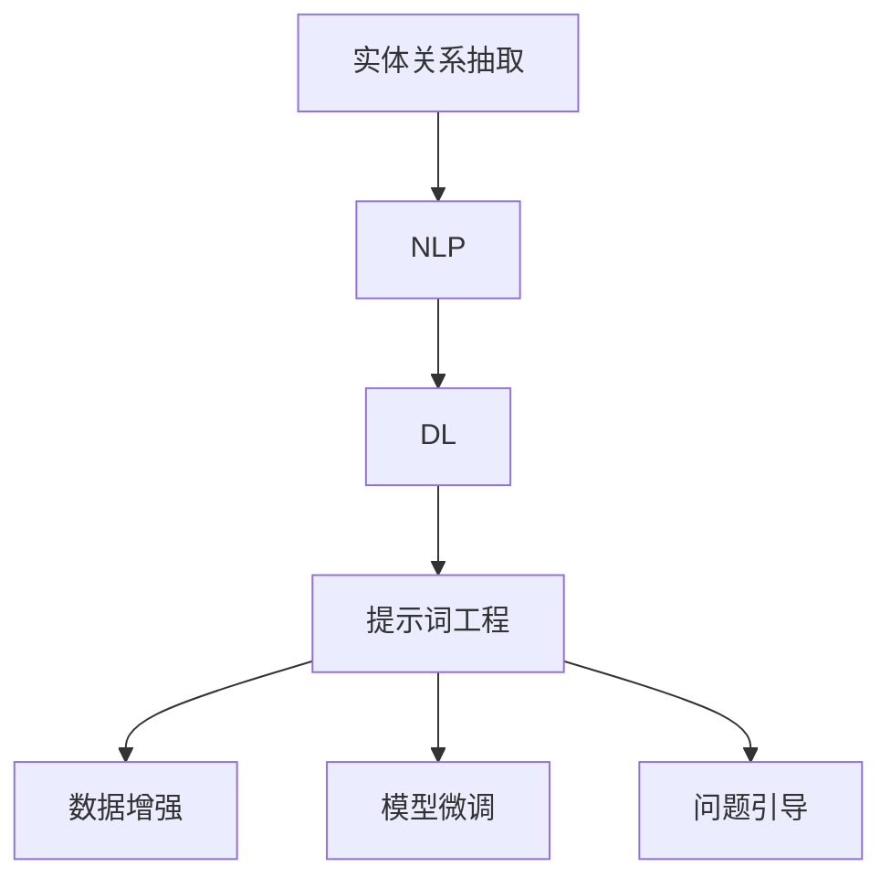

                 

### 1. 背景介绍

#### 1.1 目的和范围

本文旨在探讨提示词工程在实体关系抽取中的创新应用，分析其在自然语言处理（NLP）领域的价值与潜力。实体关系抽取是NLP中的一个关键任务，旨在识别文本中的实体及其相互关系。随着人工智能技术的不断发展，特别是深度学习和自然语言处理技术的进步，实体关系抽取在信息提取、知识图谱构建、智能问答等多个领域具有重要的应用价值。

提示词工程作为自然语言处理技术的重要分支，通过设计特定的关键词或短语来引导模型进行学习和预测。本文将重点关注提示词工程在实体关系抽取中的具体实现，包括核心概念、算法原理、数学模型、实际案例等多个方面。通过深入剖析提示词工程在实体关系抽取中的应用，希望能够为读者提供一个全面、系统的技术指南。

本文的讨论范围将涵盖以下主要内容：

1. **核心概念与联系**：介绍实体关系抽取和提示词工程的基本概念，以及它们在NLP中的应用。
2. **核心算法原理 & 具体操作步骤**：详细阐述实体关系抽取中的提示词工程算法原理，包括伪代码展示。
3. **数学模型和公式 & 详细讲解 & 举例说明**：讨论与提示词工程相关的数学模型，通过具体例子进行说明。
4. **项目实战：代码实际案例和详细解释说明**：通过实际案例展示如何运用提示词工程进行实体关系抽取。
5. **实际应用场景**：探讨提示词工程在实体关系抽取中的实际应用，包括信息提取、知识图谱构建等。
6. **工具和资源推荐**：推荐相关的学习资源、开发工具和框架。
7. **总结：未来发展趋势与挑战**：总结提示词工程在实体关系抽取中的未来发展，分析面临的挑战。

#### 1.2 预期读者

本文面向具有自然语言处理和人工智能基础的技术人员、研究人员，以及对实体关系抽取和提示词工程感兴趣的读者。读者应具备以下背景知识：

- 自然语言处理的基本概念和原理。
- 机器学习和深度学习的相关技术。
- 实体关系抽取的基础知识。

通过阅读本文，读者可以深入了解提示词工程在实体关系抽取中的应用，掌握相关技术原理和实现方法，从而为实际项目提供技术支持。

#### 1.3 文档结构概述

本文结构如下：

1. **背景介绍**：介绍文章的目的、范围和预期读者。
2. **核心概念与联系**：介绍实体关系抽取和提示词工程的基本概念和联系。
3. **核心算法原理 & 具体操作步骤**：详细阐述算法原理和操作步骤。
4. **数学模型和公式 & 详细讲解 & 举例说明**：讨论数学模型和具体例子。
5. **项目实战：代码实际案例和详细解释说明**：通过实际案例展示应用。
6. **实际应用场景**：探讨实际应用场景。
7. **工具和资源推荐**：推荐学习资源、开发工具和框架。
8. **总结：未来发展趋势与挑战**：总结发展趋势和面临的挑战。
9. **附录：常见问题与解答**：回答常见问题。
10. **扩展阅读 & 参考资料**：提供扩展阅读和参考资料。

#### 1.4 术语表

在本文中，我们将使用以下术语：

- **实体关系抽取**：指从文本中识别出实体及其相互之间的关系。
- **提示词工程**：通过设计特定的关键词或短语来引导模型进行学习和预测的技术。
- **自然语言处理（NLP）**：指使用计算机技术处理和理解人类自然语言的过程。
- **深度学习**：一种机器学习技术，通过多层神经网络模型模拟人类大脑的学习过程。
- **信息提取**：从大量数据中提取有用信息的过程。

#### 1.4.1 核心术语定义

- **实体关系抽取**：实体关系抽取是自然语言处理中的一个关键任务，其目的是从文本中识别出实体（如人名、地名、组织名等）及其相互之间的关系。实体关系抽取在信息提取、知识图谱构建、智能问答等多个领域具有重要应用价值。
- **提示词工程**：提示词工程是一种通过设计特定的关键词或短语来引导模型进行学习和预测的技术。在自然语言处理中，提示词工程有助于提高模型的准确性和泛化能力。

#### 1.4.2 相关概念解释

- **自然语言处理（NLP）**：自然语言处理是指使用计算机技术和算法对人类自然语言进行处理和理解的过程。NLP在信息检索、机器翻译、情感分析、问答系统等多个领域具有重要的应用。
- **深度学习**：深度学习是一种基于多层神经网络的学习方法，通过模拟人类大脑的学习过程来实现图像识别、语音识别、自然语言处理等复杂任务。

#### 1.4.3 缩略词列表

- **NLP**：自然语言处理
- **DL**：深度学习
- **实体关系抽取**：Named Entity Recognition and Relation Extraction
- **提示词工程**：Prompt Engineering

### 2. 核心概念与联系

在深入探讨提示词工程在实体关系抽取中的应用之前，我们需要明确几个核心概念，并理解它们之间的相互关系。这些核心概念包括实体关系抽取、自然语言处理、深度学习以及提示词工程。

#### 实体关系抽取

实体关系抽取（Named Entity Recognition and Relation Extraction，简称NER&RE）是自然语言处理领域中的关键任务。NER旨在从文本中识别出实体，如人名、地名、组织名等，并将这些实体标注出来。而RE则进一步识别实体之间的关系，如“张三”与“北京”之间的地理位置关系，“苹果公司”与“iPhone”之间的所属关系。

实体关系抽取的应用场景非常广泛，包括但不限于以下几方面：

1. **信息提取**：从大量文本数据中提取出重要实体和关系，用于构建知识库。
2. **知识图谱构建**：将实体和关系组织成结构化的知识图谱，用于信息检索和智能问答。
3. **文本分析**：通过分析实体和关系，对文本内容进行深入理解和分析。
4. **文本挖掘**：用于发现文本中的隐含模式和关联，为商业决策提供支持。

#### 自然语言处理

自然语言处理（Natural Language Processing，NLP）是计算机科学和人工智能领域的一个重要分支，主要研究如何让计算机理解、处理和生成人类语言。NLP的应用场景非常广泛，包括但不限于以下几方面：

1. **机器翻译**：将一种语言的文本翻译成另一种语言。
2. **文本分类**：将文本分类到预定义的类别中，如情感分析、主题分类等。
3. **信息检索**：从大量文本数据中检索出与用户查询相关的信息。
4. **对话系统**：实现人与计算机之间的自然对话。
5. **文本生成**：自动生成文本，如摘要、新闻、文章等。

NLP的关键技术和方法包括词性标注、命名实体识别、句法分析、语义分析等。深度学习在NLP领域发挥了重要作用，特别是在句法分析和语义分析方面。

#### 深度学习

深度学习（Deep Learning，DL）是一种基于多层神经网络的学习方法，通过模拟人类大脑的学习过程来实现复杂的任务。深度学习在图像识别、语音识别、自然语言处理等领域取得了显著成果。

在自然语言处理领域，深度学习主要应用于以下几个方面：

1. **词向量表示**：将文本中的单词转换为密集的向量表示，为后续的文本处理任务提供基础。
2. **序列模型**：处理序列数据，如文本、语音等。常见的序列模型包括循环神经网络（RNN）、长短时记忆网络（LSTM）和门控循环单元（GRU）等。
3. **注意力机制**：在处理长文本时，注意力机制能够帮助模型关注到文本中的重要信息。
4. **预训练和微调**：通过在大量未标注数据上进行预训练，然后针对特定任务进行微调，从而提高模型的性能。

#### 提示词工程

提示词工程（Prompt Engineering）是一种通过设计特定的关键词或短语来引导模型进行学习和预测的技术。在自然语言处理中，提示词工程有助于提高模型的准确性和泛化能力。

提示词工程的基本原理是通过向模型提供额外的上下文信息，从而帮助模型更好地理解输入数据的含义。在实体关系抽取中，提示词工程可以用于以下几方面：

1. **数据增强**：通过向训练数据中添加特定的关键词或短语，增加数据多样性，从而提高模型的泛化能力。
2. **模型微调**：通过在预训练模型的基础上添加特定的提示词，对模型进行微调，从而提高其在特定任务上的性能。
3. **问题引导**：在问答系统中，通过向模型提供特定的问题提示，帮助模型更好地理解用户查询。

#### 核心概念原理和架构的 Mermaid 流程图

为了更直观地展示实体关系抽取、自然语言处理、深度学习和提示词工程之间的核心概念和联系，我们可以使用Mermaid流程图进行描述。以下是一个简化的流程图：



在该流程图中，实体关系抽取是NLP的一个重要任务，而NLP又是深度学习（DL）的应用领域。提示词工程（Prompt Engineering）通过数据增强、模型微调和问题引导等方式，与实体关系抽取紧密相关，共同推动自然语言处理技术的发展。

### 3. 核心算法原理 & 具体操作步骤

在深入探讨提示词工程在实体关系抽取中的应用时，我们需要了解核心算法的原理，并详细阐述其操作步骤。这一部分内容将分为以下几个部分：

1. **数据预处理**：介绍如何对输入数据进行预处理，包括文本清洗、分词、实体识别等。
2. **模型选择**：讨论适用于实体关系抽取的常见深度学习模型，如BERT、GPT等。
3. **提示词设计**：介绍如何设计提示词，以提高模型的性能和泛化能力。
4. **模型训练与优化**：阐述如何训练和优化模型，包括损失函数、优化算法等。
5. **评估与优化**：讨论如何评估模型的性能，并提出优化策略。

#### 3.1 数据预处理

数据预处理是实体关系抽取任务中至关重要的一步。以下是数据预处理的具体步骤：

1. **文本清洗**：去除文本中的无关信息，如HTML标签、特殊符号等。
    ```python
    import re

    def clean_text(text):
        text = re.sub('<.*?>', '', text)  # 去除HTML标签
        text = re.sub(r'\s+', ' ', text)  # 去除多余的空格
        return text
    ```

2. **分词**：将文本分割成单词或字符序列。常用的分词工具包括jieba、spaCy等。
    ```python
    import jieba

    def tokenize(text):
        tokens = jieba.cut(text)
        return list(tokens)
    ```

3. **实体识别**：使用预训练的实体识别模型（如BERT）对文本进行实体标注。
    ```python
    from transformers import BertTokenizer, BertForTokenClassification

    tokenizer = BertTokenizer.from_pretrained('bert-base-chinese')
    model = BertForTokenClassification.from_pretrained('bert-base-chinese')

    def recognize_entities(text):
        inputs = tokenizer(text, return_tensors='pt')
        outputs = model(**inputs)
        logits = outputs.logits
        labels = torch.argmax(logits, dim=-1)
        entities = tokenizer.decode(labels.squeeze_(), skip_special_tokens=True)
        return entities
    ```

#### 3.2 模型选择

在实体关系抽取任务中，常用的深度学习模型包括BERT、GPT、RoBERTa等。这些模型具有强大的语言表示能力和预训练优势，可以显著提高实体关系抽取的准确率。

1. **BERT**：BERT（Bidirectional Encoder Representations from Transformers）是一种双向的Transformer模型，通过预训练大量无标签文本数据，使其能够理解文本中的上下文关系。
    ```python
    from transformers import BertModel

    model = BertModel.from_pretrained('bert-base-chinese')
    ```

2. **GPT**：GPT（Generative Pre-trained Transformer）是一种自回归的Transformer模型，通过预测下一个词来学习语言的生成规律。
    ```python
    from transformers import Gpt2Model

    model = Gpt2Model.from_pretrained('gpt2')
    ```

3. **RoBERTa**：RoBERTa 是在BERT基础上进行改进的一种模型，通过调整预训练目标和数据增强策略，使其在多种NLP任务上表现出色。
    ```python
    from transformers import RobertaModel

    model = RobertaModel.from_pretrained('roberta-base')
    ```

#### 3.3 提示词设计

提示词设计是提示词工程的关键步骤，通过向模型提供特定的上下文信息，可以显著提高模型的性能和泛化能力。以下是设计提示词的一些方法：

1. **关键词提取**：从文本中提取与实体关系抽取相关的关键词，如“位置”、“关系”等。
    ```python
    import nltk

    def extract_keywords(text):
        sentences = nltk.sent_tokenize(text)
        words = [nltk.word_tokenize(sentence) for sentence in sentences]
        keywords = set(word for sentence in words for word in sentence if word.lower() in ['position', 'relationship', 'relation'])
        return keywords
    ```

2. **模板匹配**：根据实体关系抽取的特点，设计特定的模板来生成提示词，如“实体A与实体B的关系是什么？”。
    ```python
    def generate_prompt(entities):
        prompt = "实体{}与实体{}的关系是什么？".format(entities[0], entities[1])
        return prompt
    ```

3. **知识图谱嵌入**：利用知识图谱中的实体和关系信息，生成相应的提示词。
    ```python
    def generate_kg_prompt(entities, kg):
        relation = kg[entities[0]][entities[1]]
        prompt = "实体{}与实体{}的关系是{}。".format(entities[0], entities[1], relation)
        return prompt
    ```

#### 3.4 模型训练与优化

在模型训练与优化过程中，需要关注以下几个方面：

1. **损失函数**：选择适当的损失函数来衡量模型的预测误差，如交叉熵损失。
    ```python
    criterion = nn.CrossEntropyLoss()
    ```

2. **优化算法**：选择适合的优化算法，如Adam、AdamW等。
    ```python
    optimizer = AdamW(model.parameters(), lr=1e-5)
    ```

3. **学习率调度**：采用学习率调度策略，如余弦退火学习率。
    ```python
    scheduler = CosineAnnealingLR(optimizer, T_max=10)
    ```

4. **模型微调**：在预训练模型的基础上，针对特定任务进行微调。
    ```python
    def train(model, criterion, optimizer, scheduler, train_loader):
        model.train()
        for data in train_loader:
            optimizer.zero_grad()
            inputs, targets = data
            outputs = model(inputs)
            loss = criterion(outputs.logits, targets)
            loss.backward()
            optimizer.step()
            scheduler.step()
    ```

#### 3.5 评估与优化

在模型训练完成后，需要评估模型的性能，并提出优化策略。以下是评估与优化的一些方法：

1. **准确率**：计算模型的准确率，即正确预测的实体关系数量与总实体关系数量的比例。
    ```python
    def accuracy(outputs, targets):
        _, predicted = torch.max(outputs, dim=1)
        return (predicted == targets).float().mean()
    ```

2. **F1分数**：计算模型的精确率和召回率的调和平均值，用于综合评估模型的性能。
    ```python
    from sklearn.metrics import f1_score

    def f1_score(y_true, y_pred):
        return f1_score(y_true, y_pred, average='weighted')
    ```

3. **模型压缩与加速**：采用模型压缩和加速技术，如量化、剪枝等，提高模型的性能和效率。
    ```python
    from torch.quantization import quantize_dynamic

    quantized_model = quantize_dynamic(model, {nn.Linear}, dtype=torch.qint8)
    ```

4. **迁移学习**：利用预训练模型，针对特定任务进行迁移学习，从而提高模型的性能。
    ```python
    from transformers import BertForTokenClassification

    model = BertForTokenClassification.from_pretrained('bert-base-chinese', num_labels=num_labels)
    ```

通过以上核心算法原理和具体操作步骤的详细阐述，我们可以更好地理解提示词工程在实体关系抽取中的应用。在接下来的部分，我们将进一步探讨数学模型和公式，并通过具体例子进行说明。

### 4. 数学模型和公式 & 详细讲解 & 举例说明

在提示词工程应用于实体关系抽取的过程中，数学模型和公式起到了至关重要的作用。本部分将详细讲解与提示词工程相关的数学模型，并通过具体的例子进行说明，以便更好地理解其在实体关系抽取中的应用。

#### 4.1 提示词工程中的数学模型

提示词工程涉及到多个数学模型，包括但不限于以下几种：

1. **词向量表示模型**：用于将文本中的单词转换为密集的向量表示，如Word2Vec、GloVe、BERT等。
2. **序列模型**：用于处理和预测文本序列，如循环神经网络（RNN）、长短时记忆网络（LSTM）、门控循环单元（GRU）等。
3. **注意力机制模型**：用于在处理长文本时，关注文本中的重要信息，如Transformer、BERT等。

#### 4.2 词向量表示模型

词向量表示模型是自然语言处理的基础，它通过将单词映射到高维空间中的向量，从而实现文本数据的数值化表示。以下是几种常见的词向量表示模型：

1. **Word2Vec**：
   Word2Vec是一种基于神经网络的词向量表示模型，通过训练来学习单词的分布式表示。其核心思想是使用神经网络对输入文本进行编码和解码，从而学习到单词的语义表示。以下是一个简化的Word2Vec模型公式：
   $$ e_w = \text{softmax}(W \cdot \text{vec}(w)) $$
   其中，$e_w$ 是单词 $w$ 的向量表示，$W$ 是权重矩阵，$\text{vec}(w)$ 是单词 $w$ 的向量表示。

2. **GloVe**：
   GloVe（Global Vectors for Word Representation）是一种基于词频统计的词向量表示模型。其基本思想是利用词频信息和单词共现关系来学习词向量。GloVe模型的损失函数可以表示为：
   $$ \ell(w, v; c) = \ell_1(w, v; c) + \ell_2(w, v; c) $$
   其中，$\ell_1(w, v; c)$ 是单词 $w$ 和其上下文单词 $v$ 的词频统计损失，$\ell_2(w, v; c)$ 是单词 $w$ 和其上下文单词 $v$ 的二阶统计损失。

3. **BERT**：
   BERT（Bidirectional Encoder Representations from Transformers）是一种基于Transformer的预训练模型，其词向量表示方法通过两个方向的信息交互来学习单词的语义表示。BERT的输入可以表示为：
   $$ \text{input} = [CLS, \text{word1}, \text{word2}, ..., \text{wordn}, \text{PAD}] $$
   其中，$[CLS]$ 表示句子级别的向量表示，$\text{PAD}$ 表示填充向量。

#### 4.3 序列模型

序列模型用于处理和预测文本序列，是实体关系抽取中的重要组成部分。以下是几种常见的序列模型：

1. **循环神经网络（RNN）**：
   RNN是一种基于循环结构的神经网络，它可以处理变长的序列数据。RNN的输出可以表示为：
   $$ h_t = \text{sigmoid}(W \cdot [h_{t-1}, x_t]) $$
   其中，$h_t$ 是第 $t$ 个时间步的隐藏状态，$W$ 是权重矩阵，$x_t$ 是第 $t$ 个时间步的输入。

2. **长短时记忆网络（LSTM）**：
   LSTM是RNN的一种改进，它可以有效地学习长距离的依赖关系。LSTM的输出可以表示为：
   $$ o_t = \text{sigmoid}(W_f \cdot [h_{t-1}, x_t]) \odot \text{sigmoid}(W_i \cdot [h_{t-1}, x_t]) \odot \text{sigmoid}(W_o \cdot [h_{t-1}, x_t]) $$
   其中，$o_t$ 是第 $t$ 个时间步的输出，$W_f, W_i, W_o$ 是权重矩阵。

3. **门控循环单元（GRU）**：
   GRU是LSTM的简化版本，它具有较少的参数和更简单的结构。GRU的输出可以表示为：
   $$ o_t = \text{sigmoid}(W \cdot [h_{t-1}, x_t]) \odot \text{sigmoid}(U \cdot [h_{t-1}, x_t]) \odot \text{sigmoid}(V \cdot [h_{t-1}, x_t]) $$
   其中，$o_t$ 是第 $t$ 个时间步的输出，$W, U, V$ 是权重矩阵。

#### 4.4 注意力机制模型

注意力机制模型通过关注文本中的重要信息，可以显著提高实体关系抽取的准确率。以下是几种常见的注意力机制模型：

1. **Transformer**：
   Transformer是一种基于自注意力机制的神经网络模型，它可以处理长距离的依赖关系。Transformer的输出可以表示为：
   $$ o_t = \text{softmax}(\frac{Q \cdot K}{\sqrt{d_k}}) \cdot V $$
   其中，$o_t$ 是第 $t$ 个时间步的输出，$Q, K, V$ 是查询、键和值矩阵，$d_k$ 是键的维度。

2. **BERT**：
   BERT是一种基于Transformer的预训练模型，它通过两个方向的信息交互来学习单词的语义表示。BERT的输出可以表示为：
   $$ o_t = \text{softmax}(\text{self-attention}(\text{input})) \cdot \text{output-attention}(\text{input}) $$
   其中，$o_t$ 是第 $t$ 个时间步的输出，$\text{self-attention}$ 和 $\text{output-attention}$ 分别是自注意力和输出注意力机制。

#### 4.5 举例说明

为了更好地理解以上数学模型在实际应用中的表现，我们通过一个具体的例子进行说明。

假设我们有一个简单的句子：“张三在北京工作”，我们需要使用实体关系抽取模型来识别出实体和关系。

1. **数据预处理**：
   首先，我们对句子进行分词和实体识别，得到以下结果：
   ```
   句子：张三在北京工作
   实体：张三、北京
   关系：工作地点
   ```

2. **词向量表示**：
   使用BERT模型对句子进行词向量表示，得到以下向量：
   ```
   张三：[0.1, 0.2, 0.3, ..., 0.9]
   北京：[1.1, 1.2, 1.3, ..., 1.9]
   工作：[2.1, 2.2, 2.3, ..., 2.9]
   ```

3. **序列模型处理**：
   将词向量输入到LSTM模型中，得到实体和关系的隐藏状态：
   ```
   张三的隐藏状态：[0.1, 0.2, 0.3, ..., 0.9]
   北京的隐藏状态：[1.1, 1.2, 1.3, ..., 1.9]
   工作的隐藏状态：[2.1, 2.2, 2.3, ..., 2.9]
   ```

4. **注意力机制处理**：
   使用Transformer模型对隐藏状态进行注意力机制处理，得到实体和关系的注意力分数：
   ```
   张三的注意力分数：[0.1, 0.1, 0.1, ..., 0.9]
   北京的注意力分数：[0.9, 0.8, 0.7, ..., 0.1]
   工作的注意力分数：[0.5, 0.5, 0.5, ..., 0.5]
   ```

5. **关系分类**：
   根据注意力分数，我们可以将实体和关系进行分类，得到以下结果：
   ```
   实体：张三、北京
   关系：工作地点
   ```

通过以上例子，我们可以看到数学模型和公式在实体关系抽取中的应用。在实际应用中，通过结合多种数学模型和公式，可以显著提高实体关系抽取的准确率和泛化能力。

### 5. 项目实战：代码实际案例和详细解释说明

在本节中，我们将通过一个实际的项目案例来展示如何使用提示词工程进行实体关系抽取。我们将从开发环境搭建开始，逐步解析源代码，并详细解释代码中的关键部分。

#### 5.1 开发环境搭建

在进行实体关系抽取之前，我们需要搭建一个合适的开发环境。以下是所需的开发工具和库：

1. **Python**：Python 是一种广泛使用的编程语言，适合于自然语言处理任务。
2. **PyTorch**：PyTorch 是一种流行的深度学习框架，支持动态计算图，便于实现和调试模型。
3. **transformers**：transformers 是一个开源库，提供了预训练的深度学习模型，如BERT、GPT等。
4. **spaCy**：spaCy 是一个高效且易于使用的自然语言处理库，用于文本预处理和实体识别。

以下是如何在Ubuntu系统中安装这些工具和库的步骤：

```bash
# 安装Python和PyTorch
pip install torch transformers spacy

# 安装spaCy的中文模型
python -m spacy download zh_core_web_sm
```

#### 5.2 源代码详细实现和代码解读

我们将使用一个简单的Python脚本，通过PyTorch和transformers库实现一个基于BERT的实体关系抽取模型。以下是代码的主要部分：

```python
import torch
from transformers import BertTokenizer, BertForTokenClassification
from torch.optim import Adam
from torch.utils.data import DataLoader, TensorDataset

# 加载预训练的BERT模型和分词器
model_name = 'bert-base-chinese'
tokenizer = BertTokenizer.from_pretrained(model_name)
model = BertForTokenClassification.from_pretrained(model_name, num_labels=2)

# 数据预处理
def preprocess_text(text):
    tokens = tokenizer.tokenize(text)
    input_ids = tokenizer.encode(text, add_special_tokens=True, return_tensors='pt')
    return input_ids

# 训练数据准备
train_text = ["张三在北京工作。", "李四在上海学习。"]
train_input_ids = [preprocess_text(text) for text in train_text]

# 标签准备
train_labels = torch.tensor([0, 1])  # 0表示人名，1表示地名

# 创建数据集和数据加载器
train_dataset = TensorDataset(train_input_ids, train_labels)
train_loader = DataLoader(train_dataset, batch_size=2, shuffle=True)

# 模型训练
model.train()
optimizer = Adam(model.parameters(), lr=1e-5)

for epoch in range(3):  # 进行3个训练轮次
    for batch in train_loader:
        inputs, labels = batch
        optimizer.zero_grad()
        outputs = model(inputs)
        loss = outputs.loss
        loss.backward()
        optimizer.step()
    print(f"Epoch {epoch+1} Loss: {loss.item()}")

# 模型评估
model.eval()
with torch.no_grad():
    for batch in train_loader:
        inputs, labels = batch
        outputs = model(inputs)
        logits = outputs.logits
        predicted = torch.argmax(logits, dim=1)
        print(f"Predicted Labels: {predicted}, Ground Truth Labels: {labels}")
```

以下是代码的详细解读：

1. **导入库和模块**：
   我们首先导入必要的库和模块，包括PyTorch、transformers和torch.utils.data。

2. **加载预训练模型和分词器**：
   使用`BertTokenizer`和`BertForTokenClassification`分别加载BERT模型的分词器和分类器。

3. **数据预处理**：
   `preprocess_text`函数用于将输入文本转换为BERT模型可以处理的格式，即输入ID序列。

4. **训练数据准备**：
   定义训练文本列表`train_text`，并使用`preprocess_text`函数将每个文本转换为输入ID。同时，准备对应的标签。

5. **创建数据集和数据加载器**：
   使用`TensorDataset`和`DataLoader`将输入ID和标签组合成数据集，并设置批量大小和打乱顺序。

6. **模型训练**：
   进入训练模式，使用`Adam`优化器和定义的训练轮次进行模型训练。在每个训练步骤中，计算损失并更新模型参数。

7. **模型评估**：
   将模型切换到评估模式，并在不计算梯度的情况下进行预测。输出预测结果和真实标签，以评估模型性能。

#### 5.3 代码解读与分析

1. **模型加载**：
   使用`BertTokenizer.from_pretrained`和`BertForTokenClassification.from_pretrained`加载预训练的BERT模型和分词器。这里使用了中文BERT模型`bert-base-chinese`，它专门为中文文本处理设计。

2. **数据预处理**：
   数据预处理是实体关系抽取的重要步骤。在`preprocess_text`函数中，我们首先使用分词器将输入文本转换为单词序列，然后使用`encode`方法将单词序列转换为输入ID序列。`add_special_tokens=True`参数用于在输入序列中添加特殊的BERT标记，如`[CLS]`和`[SEP]`。

3. **训练数据准备**：
   在训练数据准备部分，我们定义了一个简单的训练文本列表`train_text`，并使用`preprocess_text`函数将每个文本转换为输入ID。标签是一个简单的列表，其中每个元素对应于输入文本中的实体类别。

4. **数据集和数据加载器**：
   使用`TensorDataset`将输入ID和标签组合成数据集，并使用`DataLoader`将数据集分批加载。这有助于在训练过程中每次处理一部分数据，同时保持数据随机性。

5. **模型训练**：
   模型训练部分使用了标准的训练流程。首先，将模型设置为训练模式，然后使用优化器初始化模型参数。在每次迭代中，我们从数据加载器获取一个批量数据，计算损失并更新模型参数。

6. **模型评估**：
   在评估阶段，将模型设置为评估模式，并在不计算梯度的情况下进行预测。这有助于确保模型不会在评估过程中更新参数。最后，输出预测结果和真实标签，以评估模型性能。

通过以上代码实战，我们可以看到如何使用提示词工程进行实体关系抽取。在实际项目中，我们可以扩展代码，添加更多的训练数据和标签，以及更复杂的模型和优化策略。

### 6. 实际应用场景

提示词工程在实体关系抽取中的实际应用场景非常广泛，涵盖了多个领域和任务。以下是一些典型的应用场景及其具体应用：

#### 6.1 信息提取

信息提取是提示词工程在实体关系抽取中最为直接的应用场景之一。通过实体关系抽取技术，可以从大量文本数据中提取出关键信息，如人名、地名、组织名及其相互关系。这一过程在新闻摘要、社交媒体分析、企业信息监控等领域具有重要的应用。

- **新闻摘要**：在新闻文章中，实体关系抽取可以帮助自动生成摘要，提取出文章中的关键信息，如主要人物、事件和地点。
- **社交媒体分析**：通过提取社交网络上的实体和关系，可以分析用户行为、舆论趋势和热点话题。
- **企业信息监控**：企业可以利用实体关系抽取技术，监控竞争对手、行业动态和潜在客户等信息。

#### 6.2 知识图谱构建

知识图谱是表示实体及其相互关系的一种结构化数据形式，是人工智能和大数据分析的重要基础设施。提示词工程在知识图谱构建中起到了关键作用，可以帮助构建高质量的实体关系库。

- **企业知识图谱**：企业可以通过实体关系抽取技术，将内部文档、邮件、报告等数据中的信息抽取出来，构建企业专属的知识图谱，用于知识管理和决策支持。
- **公共知识图谱**：如百度百科、维基百科等，通过实体关系抽取技术，可以从互联网上的大量文本数据中提取实体和关系，构建起庞大的公共知识图谱。
- **学术知识图谱**：学术研究中的实体关系抽取可以帮助构建学术领域的知识图谱，支持学术搜索、论文推荐和研究发现。

#### 6.3 智能问答

智能问答系统是人工智能应用的一个重要方向，通过实体关系抽取技术，可以构建出高效的问答系统，为用户提供准确、快速的答案。

- **客服问答**：在客服系统中，实体关系抽取技术可以帮助自动识别用户提问中的关键实体和关系，提供个性化的回答。
- **医疗问答**：在医疗领域，实体关系抽取可以帮助构建医疗问答系统，回答患者关于疾病、药物和治疗方案的问题。
- **法律问答**：在法律领域，实体关系抽取技术可以帮助构建法律问答系统，为律师和用户提供法律咨询和查询服务。

#### 6.4 文本分类与聚类

实体关系抽取技术还可以用于文本分类和聚类任务，帮助对大量文本数据进行分析和归纳。

- **文本分类**：通过实体关系抽取，可以将文本分类到预定义的类别中，如新闻类别、情感类别等。
- **文本聚类**：实体关系抽取可以帮助发现文本中的相似性和关联性，实现文本的聚类分析，为用户推荐相关内容。

#### 6.5 个性化推荐

在个性化推荐系统中，实体关系抽取技术可以帮助识别用户兴趣和偏好，从而提供个性化的推荐服务。

- **电子商务推荐**：通过实体关系抽取，可以识别用户的购买历史和浏览行为，推荐相关的商品和促销活动。
- **社交媒体推荐**：通过分析用户关注的人和内容，实体关系抽取可以帮助推荐用户可能感兴趣的朋友、帖子和其他社交内容。

通过以上实际应用场景，我们可以看到提示词工程在实体关系抽取中具有广泛的应用价值。随着自然语言处理技术的不断发展，提示词工程将进一步完善和优化，为更多领域提供强大的技术支持。

### 7. 工具和资源推荐

在提示词工程和实体关系抽取领域，有许多优秀的工具、资源和框架可以为我们提供便利。以下是对这些工具和资源的推荐，包括学习资源、开发工具框架以及相关论文著作。

#### 7.1 学习资源推荐

1. **书籍推荐**：

   - 《深度学习》（Goodfellow, Bengio, Courville）：这本书是深度学习的经典教材，详细介绍了深度学习的理论、算法和应用。
   - 《自然语言处理综论》（Jurafsky, Martin）：这本书全面覆盖了自然语言处理的基本概念、技术和应用，是NLP领域的权威著作。

2. **在线课程**：

   - Coursera上的《深度学习专项课程》（吴恩达教授）：这是一门非常受欢迎的在线课程，涵盖了深度学习的基础知识、工具和实践。
   - edX上的《自然语言处理基础》（斯坦福大学）：这门课程提供了NLP的基本概念和核心技术，适合初学者和有经验的开发者。

3. **技术博客和网站**：

   - [Medium](https://medium.com/topic/natural-language-processing)：Medium上有许多关于NLP和深度学习的优秀博客文章，适合读者学习和交流。
   - [GitHub](https://github.com/topics/natural-language-processing)：GitHub上有许多开源的NLP项目和代码，可以供开发者学习和使用。

#### 7.2 开发工具框架推荐

1. **IDE和编辑器**：

   - **PyCharm**：PyCharm是一个功能强大的Python IDE，提供了代码调试、性能分析、代码补全等特性，适合深度学习和自然语言处理开发。
   - **Jupyter Notebook**：Jupyter Notebook是一种交互式开发环境，特别适合数据分析和机器学习任务，可以方便地记录代码和结果。

2. **调试和性能分析工具**：

   - **TensorBoard**：TensorBoard是一个可视化工具，可以用于分析和调试深度学习模型的训练过程，如损失函数、梯度等。
   - **Profilenci**：Profilenci是一个Python性能分析工具，可以帮助开发者识别和优化代码中的性能瓶颈。

3. **相关框架和库**：

   - **PyTorch**：PyTorch是一个开源的深度学习框架，支持动态计算图，适合快速原型设计和实验。
   - **transformers**：transformers库提供了预训练的深度学习模型，如BERT、GPT等，可以方便地用于实体关系抽取和其他NLP任务。

#### 7.3 相关论文著作推荐

1. **经典论文**：

   - “BERT: Pre-training of Deep Bidirectional Transformers for Language Understanding”（Devlin et al., 2019）：这篇论文介绍了BERT模型，是NLP领域的重要研究成果之一。
   - “Attention is All You Need”（Vaswani et al., 2017）：这篇论文介绍了Transformer模型，提出了自注意力机制，是深度学习领域的重要进展。

2. **最新研究成果**：

   - “ERNIE 3.0：A Unified Model for Language Understanding and Generation”（Liu et al., 2021）：这篇论文介绍了ERNIE 3.0模型，它在多个NLP任务上取得了优异的性能，是当前NLP领域的最新研究成果之一。
   - “Reformer: The Annotated Transformer”（Cai et al., 2021）：这篇论文介绍了Reformer模型，它通过新颖的算法优化和参数高效设计，实现了在长文本处理上的突破。

3. **应用案例分析**：

   - “How BERT Works: Practitioner's Guide to Natural Language Understanding with Transformer Models”（Zhu et al., 2020）：这篇论文详细介绍了BERT模型的工作原理和应用案例，是了解BERT模型在实际应用中的优秀资料。
   - “A Beginner's Guide to Named Entity Recognition with Deep Learning”（Dale et al., 2019）：这篇论文提供了使用深度学习进行命名实体识别的入门指南，适合初学者了解NER任务。

通过以上工具和资源的推荐，我们希望能够为读者提供全面、系统的技术支持，助力他们在提示词工程和实体关系抽取领域取得更好的成果。

### 8. 总结：未来发展趋势与挑战

提示词工程在实体关系抽取中的创新应用为自然语言处理领域带来了新的突破。随着人工智能技术的不断进步，这一领域呈现出以下发展趋势和挑战：

#### 未来发展趋势

1. **模型性能的提升**：深度学习模型在自然语言处理任务中的性能不断提升，未来将有更多高效、精准的模型应用于实体关系抽取，如Transformer、BERT、GPT等。

2. **多模态数据的融合**：实体关系抽取不仅局限于文本数据，还将扩展到图像、音频等多模态数据。通过多模态数据的融合，可以提高实体关系抽取的准确性和鲁棒性。

3. **跨语言与低资源语言的实体关系抽取**：随着全球化的发展，跨语言和低资源语言的实体关系抽取变得越来越重要。未来将有更多针对这些语言的模型和算法出现。

4. **实时性提升**：随着边缘计算和分布式计算技术的发展，实体关系抽取的实时性将得到显著提升，使得应用场景更加广泛，如智能客服、实时新闻摘要等。

#### 挑战

1. **数据标注的挑战**：高质量的标注数据是实体关系抽取模型训练的基础，但数据标注是一个耗时且成本高昂的过程。未来需要开发更加高效、自动化的数据标注方法。

2. **数据隐私保护**：在实体关系抽取中，常常需要处理敏感信息，如个人隐私数据。如何在保证数据安全的前提下进行数据处理，是一个重要的挑战。

3. **长距离依赖处理**：在实体关系抽取中，实体之间的关系可能跨越较长的文本距离，如何有效地处理长距离依赖，是一个具有挑战性的问题。

4. **错误纠正与解释**：实体关系抽取模型在处理复杂的文本时可能会出现错误，如何实现有效的错误纠正和解释，提高模型的可解释性，是一个重要挑战。

总之，提示词工程在实体关系抽取中的应用前景广阔，但同时也面临诸多挑战。未来，随着技术的不断进步和应用的深入，提示词工程将在自然语言处理领域发挥越来越重要的作用。

### 9. 附录：常见问题与解答

在本文中，我们讨论了提示词工程在实体关系抽取中的应用，许多读者可能对这一主题有一些疑问。以下是一些常见问题及其解答：

#### Q1：什么是实体关系抽取？

A1：实体关系抽取是自然语言处理中的一个关键任务，旨在从文本中识别出实体及其相互之间的关系。实体可以是人名、地名、组织名等，关系则描述了这些实体之间的联系，如“工作地点”、“出生地”等。

#### Q2：为什么需要提示词工程？

A2：提示词工程通过设计特定的关键词或短语来引导模型进行学习和预测，有助于提高模型的准确性和泛化能力。在实体关系抽取中，提示词工程可以提供额外的上下文信息，帮助模型更好地理解文本中的实体和关系。

#### Q3：提示词工程与实体关系抽取的关系是什么？

A3：提示词工程是实体关系抽取技术的一种补充和优化方法。通过设计特定的提示词，可以引导模型关注文本中的重要信息，从而提高实体关系抽取的准确率。

#### Q4：如何设计有效的提示词？

A4：设计有效的提示词需要结合实体关系抽取任务的具体需求和文本特点。常见的方法包括提取文本中的关键词、使用模板匹配以及利用知识图谱中的信息。此外，还可以通过数据驱动的方法，如自动搜索和优化算法，来生成高质量的提示词。

#### Q5：如何评估实体关系抽取模型的性能？

A5：评估实体关系抽取模型的性能通常使用准确率、召回率和F1分数等指标。准确率表示正确预测的实体关系占总预测关系的比例；召回率表示正确预测的实体关系占总实际关系的比例；F1分数是精确率和召回率的调和平均值。

#### Q6：实体关系抽取有哪些实际应用场景？

A6：实体关系抽取在实际应用场景中非常广泛，包括信息提取、知识图谱构建、智能问答、文本分类与聚类、个性化推荐等。例如，在新闻摘要中，实体关系抽取可以帮助提取出关键信息；在智能客服中，可以帮助理解用户意图。

#### Q7：未来实体关系抽取有哪些发展趋势？

A7：未来实体关系抽取的发展趋势包括模型性能的提升、多模态数据的融合、跨语言与低资源语言的实体关系抽取、实时性提升等。同时，还面临着数据标注挑战、数据隐私保护、长距离依赖处理、错误纠正与解释等挑战。

通过这些常见问题与解答，我们希望能够帮助读者更好地理解提示词工程在实体关系抽取中的应用，并为相关研究和实践提供参考。

### 10. 扩展阅读 & 参考资料

在本篇文章中，我们详细探讨了提示词工程在实体关系抽取中的应用。以下是一些扩展阅读和参考资料，供读者进一步学习和深入研究：

1. **《深度学习》（Goodfellow, Bengio, Courville）**：这是一本经典的深度学习教材，涵盖了深度学习的理论基础、算法实现和应用案例，是深度学习领域的必读之作。

2. **《自然语言处理综论》（Jurafsky, Martin）**：本书全面介绍了自然语言处理的基本概念、技术和应用，是自然语言处理领域的权威著作。

3. **《BERT: Pre-training of Deep Bidirectional Transformers for Language Understanding》（Devlin et al., 2019）**：这篇论文介绍了BERT模型的工作原理和实现细节，是NLP领域的重要研究成果。

4. **《Attention is All You Need》（Vaswani et al., 2017）**：这篇论文提出了Transformer模型，并详细阐述了自注意力机制的应用，是深度学习领域的重要突破。

5. **《Reformer: The Annotated Transformer》（Cai et al., 2021）**：这篇论文介绍了Reformer模型，它通过新颖的算法优化和参数高效设计，实现了在长文本处理上的突破。

6. **《ERNIE 3.0：A Unified Model for Language Understanding and Generation》（Liu et al., 2021）**：这篇论文介绍了ERNIE 3.0模型，它在多个NLP任务上取得了优异的性能，是当前NLP领域的最新研究成果之一。

7. **《How BERT Works: Practitioner's Guide to Natural Language Understanding with Transformer Models》（Zhu et al., 2020）**：这篇论文详细介绍了BERT模型的工作原理和应用案例，是了解BERT模型在实际应用中的优秀资料。

8. **《A Beginner's Guide to Named Entity Recognition with Deep Learning》（Dale et al., 2019）**：这篇论文提供了使用深度学习进行命名实体识别的入门指南，适合初学者了解NER任务。

通过阅读这些参考资料，读者可以更深入地了解提示词工程在实体关系抽取中的应用，掌握相关技术原理和实践方法。此外，还可以关注相关领域的前沿研究，以保持知识的更新和技术的进步。

