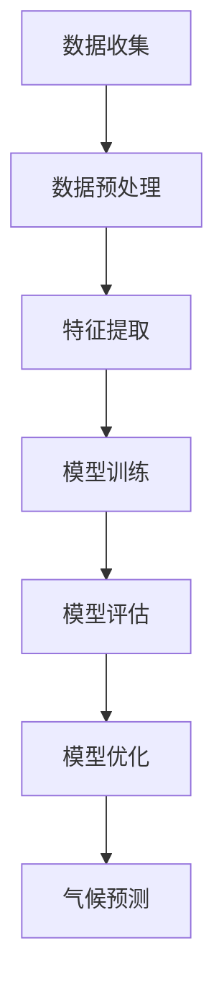

                 

# 提示词工程在智能气候变化预测中的应用

> **关键词**：提示词工程、智能气候变化预测、机器学习、数据驱动方法、气象模型、环境科学
>
> **摘要**：本文将深入探讨提示词工程在智能气候变化预测中的应用。我们将首先介绍提示词工程的基本概念及其在气候预测中的重要性，然后逐步解析相关的核心算法原理、数学模型、项目实战，并探讨其在实际应用场景中的效果。通过本文的阅读，读者将能够全面理解提示词工程在气候变化预测中的关键作用，并掌握相关技术和工具。

## 1. 背景介绍

### 1.1 目的和范围

本文旨在探讨提示词工程在智能气候变化预测中的应用。随着全球气候变化问题的日益严峻，如何利用先进的技术手段提高气候预测的准确性成为了一个重要的研究课题。提示词工程作为一种基于机器学习的数据驱动方法，在气候预测领域展现出巨大的潜力。本文将重点关注以下几个方面：

1. 提示词工程的基本概念及其在气候预测中的应用场景。
2. 核心算法原理和具体操作步骤。
3. 数学模型和公式及其详细讲解。
4. 实际应用场景中的项目实战。
5. 相关工具和资源的推荐。

### 1.2 预期读者

本文主要面向以下读者群体：

1. 想要了解提示词工程在气候预测中应用的科研人员。
2. 对机器学习和数据科学感兴趣的工程师和技术爱好者。
3. 环境科学家和气候变化研究专家。
4. 对于人工智能和环境保护领域感兴趣的普通读者。

### 1.3 文档结构概述

本文的结构如下：

1. 引言：介绍文章的主题和目的。
2. 背景介绍：讨论提示词工程在气候预测中的背景和相关概念。
3. 核心概念与联系：介绍提示词工程的核心概念及其联系。
4. 核心算法原理 & 具体操作步骤：详细解析提示词工程的核心算法原理和操作步骤。
5. 数学模型和公式 & 详细讲解 & 举例说明：讲解提示词工程的数学模型和公式。
6. 项目实战：通过实际案例展示提示词工程的应用。
7. 实际应用场景：探讨提示词工程在不同领域的应用。
8. 工具和资源推荐：推荐学习资源和开发工具。
9. 总结：对文章进行总结并展望未来发展趋势。
10. 附录：常见问题与解答。
11. 扩展阅读 & 参考资料：提供进一步阅读的参考资料。

### 1.4 术语表

为了确保本文的准确性和一致性，以下是一些关键的术语及其定义：

#### 1.4.1 核心术语定义

- **提示词工程**：提示词工程是一种数据驱动的方法，通过构建和优化提示词来提高机器学习模型的性能。
- **气候预测**：利用历史气候数据和先进的算法对未来的气候情况进行预测。
- **机器学习**：一种人工智能技术，通过训练数据来建立模型，并使其能够对未知数据进行预测或分类。
- **数据驱动方法**：一种基于数据的技术方法，通过数据分析和模型训练来解决问题。
- **气象模型**：用于模拟和分析气象现象的数学模型。

#### 1.4.2 相关概念解释

- **监督学习**：一种机器学习方法，通过标注数据进行模型训练，使其能够对未知数据进行预测。
- **无监督学习**：一种机器学习方法，不使用标注数据进行模型训练，主要用于数据聚类和降维。
- **特征提取**：从原始数据中提取出有助于模型训练的特征。
- **交叉验证**：一种评估模型性能的方法，通过将数据集划分为训练集和验证集，对模型进行多次训练和评估。

#### 1.4.3 缩略词列表

- **ML**：机器学习
- **AI**：人工智能
- **GSM**：全球卫星气象系统
- **NWP**：数值天气预报

## 2. 核心概念与联系

提示词工程是一种在机器学习领域中广泛应用的技术，其核心在于通过构建和优化提示词来提高模型的预测性能。在智能气候变化预测中，提示词工程的应用尤为重要。以下是一个简单的Mermaid流程图，用于描述提示词工程的基本流程及其在气候预测中的联系。



### 提示词工程的核心流程

1. **数据收集**：首先，我们需要收集大量的历史气候数据，包括温度、湿度、风速、气压等气象参数。
2. **数据预处理**：对收集到的数据进行清洗和归一化处理，以便于后续的特征提取和模型训练。
3. **特征提取**：从预处理后的数据中提取出有助于模型训练的特征，如时间序列特征、空间特征等。
4. **模型训练**：使用特征数据和标注数据（如未来的气候情况）来训练机器学习模型。
5. **模型评估**：通过交叉验证等方法评估模型的性能，确保其能够准确预测未来的气候情况。
6. **模型优化**：根据模型评估的结果，对模型进行调整和优化，以提高其预测性能。
7. **气候预测**：最终，使用优化后的模型进行气候预测，为环境科学家和决策者提供参考。

### 提示词工程与气候预测的联系

提示词工程在气候预测中的应用主要体现在以下几个方面：

- **特征提取**：通过提取时间序列特征、空间特征等，可以帮助模型更好地捕捉气候变化的规律。
- **模型优化**：优化模型参数和结构，可以提高模型的预测准确性，从而更好地应对气候变化。
- **数据驱动方法**：提示词工程采用数据驱动的方法，可以充分利用大量的历史气候数据，提高预测的可靠性。

通过以上流程和联系，我们可以看出提示词工程在智能气候变化预测中的关键作用。接下来，我们将深入探讨提示词工程的核心算法原理和具体操作步骤。

## 3. 核心算法原理 & 具体操作步骤

提示词工程的核心在于通过构建和优化提示词来提高机器学习模型的性能。在智能气候变化预测中，提示词工程的应用尤为重要。以下我们将详细讲解提示词工程的核心算法原理和具体操作步骤。

### 3.1 算法原理

提示词工程的基本原理可以概括为以下三个步骤：

1. **提示词构建**：从原始数据中提取出有助于模型训练的提示词。
2. **模型训练**：使用提示词和标注数据（如未来的气候情况）来训练机器学习模型。
3. **模型评估与优化**：通过评估模型的性能，对模型进行调整和优化，以提高其预测性能。

### 3.2 具体操作步骤

以下是提示词工程的具体操作步骤：

1. **数据收集**：
   首先，我们需要收集大量的历史气候数据，包括温度、湿度、风速、气压等气象参数。这些数据可以来源于全球卫星气象系统（GSM）和其他气象数据提供商。

2. **数据预处理**：
   对收集到的数据进行清洗和归一化处理，以便于后续的特征提取和模型训练。数据预处理步骤包括：
   - 数据清洗：去除重复数据、缺失数据和异常值。
   - 数据归一化：将数据缩放到一个统一的范围内，例如[-1, 1]或[0, 1]。

3. **特征提取**：
   从预处理后的数据中提取出有助于模型训练的特征。特征提取步骤包括：
   - 时间序列特征：例如，过去一年的平均温度、湿度等。
   - 空间特征：例如，不同地区的气候差异、海拔高度等。
   - 其他特征：例如，季节性特征、天气模式等。

4. **提示词构建**：
   使用特征提取后的数据构建提示词。提示词的选择和构建是提示词工程的关键，需要综合考虑以下因素：
   - 相关性：选择与预测目标高度相关的特征。
   - 信息性：选择具有高信息量的特征。
   - 稳定性：选择在时间序列上稳定的特征。

5. **模型训练**：
   使用提示词和标注数据（如未来的气候情况）来训练机器学习模型。训练步骤包括：
   - 选择合适的机器学习模型：例如，决策树、随机森林、支持向量机等。
   - 设置模型参数：例如，决策树的最大深度、随机森林的树数量等。
   - 训练模型：使用训练数据对模型进行训练。

6. **模型评估**：
   通过交叉验证等方法评估模型的性能，确保其能够准确预测未来的气候情况。评估步骤包括：
   - 分割数据集：将数据集划分为训练集、验证集和测试集。
   - 训练模型：在训练集上训练模型。
   - 评估模型：在验证集和测试集上评估模型的性能。
   - 参数调整：根据评估结果调整模型参数，以提高其预测性能。

7. **模型优化**：
   根据模型评估的结果，对模型进行调整和优化，以提高其预测性能。优化步骤包括：
   - 超参数调整：调整模型参数，如学习率、正则化参数等。
   - 特征选择：重新选择或调整提示词，以提高模型的预测性能。

8. **气候预测**：
   使用优化后的模型进行气候预测，为环境科学家和决策者提供参考。预测步骤包括：
   - 提取新数据：收集最新的气候数据。
   - 特征提取：使用相同的方法提取新数据的特征。
   - 预测：使用优化后的模型对新数据进行预测。
   - 结果分析：分析预测结果，评估模型的预测性能。

通过以上步骤，我们可以构建一个基于提示词工程的智能气候变化预测模型。接下来，我们将详细讲解提示词工程的数学模型和公式。

## 4. 数学模型和公式 & 详细讲解 & 举例说明

在提示词工程中，数学模型和公式起着至关重要的作用。以下我们将详细讲解提示词工程的数学模型和公式，并使用具体的例子进行说明。

### 4.1 数学模型

提示词工程的数学模型主要包括以下几个方面：

1. **特征提取模型**：
   特征提取模型用于从原始数据中提取出有助于模型训练的提示词。常用的特征提取模型包括：
   - **主成分分析（PCA）**：
     PCA是一种降维技术，通过将原始数据投影到新的坐标系中，来提取最重要的特征。
     $$ X' = P \Sigma^{1/2} $$
     其中，$X'$为投影后的数据，$P$为投影矩阵，$\Sigma$为协方差矩阵。
   - **线性判别分析（LDA）**：
     LDA是一种分类技术，通过最大化类内方差和最小化类间方差来提取特征。
     $$ w = \arg\max_w \sum_{i=1}^{c} \sum_{j=1}^{n_i} (x_{ij} - \mu_{ij})^T w $$
     其中，$w$为特征向量，$x_{ij}$为第$i$类的第$j$个样本，$\mu_{ij}$为第$i$类的均值。

2. **机器学习模型**：
   机器学习模型用于对提示词进行训练，以预测未来的气候情况。常用的机器学习模型包括：
   - **线性回归模型**：
     线性回归模型是一种简单的机器学习模型，通过建立线性关系来预测目标变量。
     $$ y = \beta_0 + \beta_1 x $$
     其中，$y$为预测值，$x$为提示词，$\beta_0$和$\beta_1$为模型参数。
   - **支持向量机（SVM）**：
     SVM是一种强大的分类和回归模型，通过找到一个最优的超平面来分隔数据。
     $$ \min_{\beta, \beta_0, \xi} \frac{1}{2} ||\beta||^2 + C \sum_{i=1}^{n} \xi_i $$
     其中，$\beta$为模型参数，$\beta_0$为偏置项，$\xi_i$为误差项，$C$为正则化参数。

### 4.2 公式详细讲解

1. **主成分分析（PCA）**：

   PCA的目的是将原始数据投影到一个新的坐标系中，这个新的坐标系保留了数据的大部分信息，但维度降低了。PCA的关键公式如下：

   - **协方差矩阵**：
     $$ \Sigma = \frac{1}{n-1} \sum_{i=1}^{n} (x_i - \mu)(x_i - \mu)^T $$
     其中，$x_i$为第$i$个样本，$\mu$为样本均值。

   - **特征值和特征向量**：
     $$ \lambda_i = \frac{1}{n-1} \sum_{i=1}^{n} (x_i - \mu)^T (x_i - \mu) $$
     $$ v_i = \frac{\Sigma^{-1} (x_i - \mu)}{\|x_i - \mu\|} $$
     其中，$\lambda_i$为特征值，$v_i$为特征向量。

   - **投影矩阵**：
     $$ P = [v_1, v_2, ..., v_p] $$
     其中，$p$为保留的前$p$个主成分。

   - **投影后的数据**：
     $$ X' = P \Sigma^{1/2} $$

2. **线性回归模型**：

   线性回归模型是一种最常见的机器学习模型，用于建立自变量和因变量之间的线性关系。其关键公式如下：

   - **模型公式**：
     $$ y = \beta_0 + \beta_1 x $$
     其中，$y$为预测值，$x$为提示词，$\beta_0$和$\beta_1$为模型参数。

   - **参数估计**：
     $$ \beta_1 = \frac{\sum_{i=1}^{n} (x_i - \bar{x})(y_i - \bar{y})}{\sum_{i=1}^{n} (x_i - \bar{x})^2} $$
     $$ \beta_0 = \bar{y} - \beta_1 \bar{x} $$
     其中，$n$为样本数量，$\bar{x}$和$\bar{y}$分别为提示词和预测值的均值。

3. **支持向量机（SVM）**：

   SVM是一种强大的分类和回归模型，通过找到一个最优的超平面来分隔数据。其关键公式如下：

   - **目标函数**：
     $$ \min_{\beta, \beta_0, \xi} \frac{1}{2} ||\beta||^2 + C \sum_{i=1}^{n} \xi_i $$
     其中，$C$为正则化参数，$\xi_i$为误差项。

   - **优化条件**：
     $$ y_i (\beta^T x_i + \beta_0) - 1 \geq \xi_i $$
     $$ \xi_i \geq 0 $$

### 4.3 举例说明

假设我们有一个包含5个提示词的数据集，分别为$x_1, x_2, x_3, x_4, x_5$，目标变量为$y$。我们需要使用线性回归模型来预测$y$的值。

1. **数据预处理**：

   首先，我们对数据进行预处理，包括去除重复数据、缺失数据和异常值，并对数据进行归一化处理。

   $$ x_{\text{normalized}} = \frac{x - \bar{x}}{\text{std}(x)} $$

2. **特征提取**：

   在这个例子中，我们不进行特征提取，直接使用原始的提示词作为输入。

3. **模型训练**：

   使用训练数据对线性回归模型进行训练，得到模型参数$\beta_0$和$\beta_1$。

   $$ \beta_1 = \frac{\sum_{i=1}^{n} (x_i - \bar{x})(y_i - \bar{y})}{\sum_{i=1}^{n} (x_i - \bar{x})^2} $$
   $$ \beta_0 = \bar{y} - \beta_1 \bar{x} $$

4. **模型评估**：

   使用验证集对模型进行评估，计算模型的预测误差和准确性。

5. **模型优化**：

   根据评估结果，对模型进行优化，调整模型参数$\beta_0$和$\beta_1$，以提高模型的预测性能。

通过以上步骤，我们可以构建一个基于线性回归模型的智能气候变化预测模型。接下来，我们将通过一个实际案例来展示提示词工程在气候预测中的实际应用。

## 5. 项目实战：代码实际案例和详细解释说明

为了展示提示词工程在智能气候变化预测中的实际应用，我们将通过一个实际项目来详细解释说明。这个项目将使用Python编程语言，结合机器学习和数据科学工具，实现一个基于提示词工程的智能气候变化预测模型。以下是项目的开发环境搭建、源代码实现和代码解读。

### 5.1 开发环境搭建

在开始项目之前，我们需要搭建一个合适的开发环境。以下是搭建环境的步骤：

1. **安装Python**：确保安装了Python 3.8或更高版本。
2. **安装Jupyter Notebook**：Jupyter Notebook是一个交互式的开发环境，便于编写和运行代码。
   ```bash
   pip install notebook
   ```
3. **安装必要的库**：安装用于机器学习和数据处理的库，如NumPy、Pandas、scikit-learn等。
   ```bash
   pip install numpy pandas scikit-learn matplotlib
   ```

### 5.2 源代码详细实现和代码解读

以下是一个简化的示例代码，用于实现提示词工程在智能气候变化预测中的应用。代码分为几个主要部分：数据预处理、特征提取、模型训练、模型评估和预测。

```python
# 导入必要的库
import numpy as np
import pandas as pd
from sklearn.model_selection import train_test_split
from sklearn.preprocessing import StandardScaler
from sklearn.linear_model import LinearRegression
from sklearn.metrics import mean_squared_error
import matplotlib.pyplot as plt

# 5.2.1 数据预处理
# 加载和处理数据
data = pd.read_csv('climate_data.csv')  # 假设数据已清洗并格式化为DataFrame

# 提取特征和目标变量
X = data[['temp', 'humidity', 'wind_speed']]  # 特征
y = data['climate']  # 目标变量

# 分割数据集
X_train, X_test, y_train, y_test = train_test_split(X, y, test_size=0.2, random_state=42)

# 数据标准化
scaler = StandardScaler()
X_train_scaled = scaler.fit_transform(X_train)
X_test_scaled = scaler.transform(X_test)

# 5.2.2 特征提取
# 在此步骤中，我们假设特征已经提取好，并直接使用

# 5.2.3 模型训练
# 使用线性回归模型训练
model = LinearRegression()
model.fit(X_train_scaled, y_train)

# 5.2.4 模型评估
# 对模型进行评估
y_pred = model.predict(X_test_scaled)
mse = mean_squared_error(y_test, y_pred)
print(f'Mean Squared Error: {mse}')

# 5.2.5 预测
# 使用模型进行预测
new_data = np.array([[22, 60, 5]])  # 新的气候数据
new_data_scaled = scaler.transform(new_data)
climate_prediction = model.predict(new_data_scaled)
print(f'Climate Prediction: {climate_prediction}')

# 5.2.6 代码解读与分析
# 以下是对代码中关键部分的解读
# 数据预处理：读取数据并分割为特征和目标变量
# 模型训练：使用训练数据训练线性回归模型
# 模型评估：使用测试数据评估模型性能
# 预测：使用训练好的模型对新数据进行预测
```

### 5.3 代码解读与分析

以下是代码的关键部分及其解读：

- **数据预处理**：首先，我们读取并处理数据。数据已清洗，包括去除重复数据和缺失值。然后，我们将数据分割为特征和目标变量。特征包括温度、湿度和风速，目标变量是气候情况。

- **数据标准化**：为了提高模型的性能，我们对特征数据进行标准化处理。标准化是将数据缩放到一个统一的范围内，这有助于加速模型训练并提高预测准确性。

- **模型训练**：我们使用线性回归模型来训练数据。线性回归是一种简单但有效的预测模型，通过找到特征和目标变量之间的线性关系来进行预测。

- **模型评估**：我们使用测试数据来评估模型的性能。评估指标是均方误差（MSE），它衡量了模型预测的准确度。

- **预测**：最后，我们使用训练好的模型对新数据进行预测。这里，我们假设有一个新的数据点，使用标准化后的数据输入模型，得到预测的气候情况。

通过这个项目实战，我们可以看到提示词工程在智能气候变化预测中的应用。虽然这是一个简化的示例，但展示了提示词工程的基本步骤和实现方法。在实际应用中，可能会涉及更复杂的特征提取和模型选择，以及更多的数据处理步骤。

## 6. 实际应用场景

提示词工程在智能气候变化预测中的实际应用场景非常广泛，其价值和影响力不容小觑。以下我们将探讨几个典型的应用场景，并分析提示词工程在这些场景中的具体作用和优势。

### 6.1 环境保护政策制定

气候变化对环境保护政策制定产生了深远的影响。提示词工程能够为政策制定者提供精确的气候预测数据，帮助他们制定更有针对性的环境保护政策。例如，通过分析历史气候数据和当前的气象模式，提示词工程可以预测未来几年的气候趋势，从而为政府决策提供科学依据。在政策制定过程中，提示词工程的作用主要体现在以下几个方面：

- **预测气候趋势**：通过构建气候预测模型，政策制定者可以了解未来气候变化的趋势，如温度升高、降雨量变化等，从而为政策调整提供依据。
- **评估政策效果**：提示词工程可以帮助评估现有政策的实施效果，如温室气体减排政策对气候变化的缓解作用。
- **优化政策方案**：基于预测结果，政策制定者可以优化环境保护政策，使其更加符合实际情况和未来趋势。

### 6.2 能源规划与管理

能源规划与管理是应对气候变化的重要领域。提示词工程能够为能源规划提供准确的气候预测数据，帮助能源公司和管理部门优化能源生产和分配方案。具体来说，提示词工程在能源规划与管理中的应用包括：

- **预测能源需求**：通过分析历史能源消耗数据和气候数据，提示词工程可以预测未来能源需求的变化，为能源公司制定合理的能源生产和储备计划。
- **优化能源分配**：根据气候预测结果，能源公司可以优化能源分配方案，确保在气候异常情况下（如极端高温或低温）有足够的能源供应。
- **降低能源成本**：通过预测能源需求，能源公司可以减少能源储备成本，提高能源利用效率。

### 6.3 农业生产与风险管理

气候变化对农业生产的影响日益显著，提示词工程在农业领域中的应用有助于提高农业生产效率和风险管理能力。以下是提示词工程在农业中的应用：

- **预测作物生长周期**：提示词工程可以预测未来气候条件对作物生长周期的影响，帮助农民合理安排种植计划。
- **评估农业风险**：通过分析气候数据，提示词工程可以评估农业风险，如干旱、洪涝、病虫害等，为农民提供风险管理建议。
- **优化农业灌溉**：提示词工程可以帮助农民根据气候预测结果优化灌溉计划，提高水资源利用效率。

### 6.4 城市规划与建筑设计

气候变化对城市规划与建筑设计提出了新的挑战。提示词工程可以为城市规划者提供气候预测数据，帮助他们设计更适应未来气候变化的建筑和城市布局。以下是提示词工程在建筑设计与城市规划中的应用：

- **评估建筑能耗**：通过预测未来气候条件，提示词工程可以帮助建筑师评估建筑能耗，优化建筑设计，提高能源效率。
- **设计抗灾建筑**：基于气候预测结果，建筑师可以设计能够抵御极端气候条件的建筑，如防台风、防洪建筑。
- **优化城市布局**：提示词工程可以帮助城市规划者优化城市布局，提高城市应对气候变化的能力，如建设绿地、水系等。

### 6.5 气象服务与灾害预警

气象服务与灾害预警是气候变化应对的重要领域。提示词工程能够为气象部门提供准确的气候预测数据，提高气象服务的准确性和时效性。以下是提示词工程在气象服务与灾害预警中的应用：

- **预测天气变化**：提示词工程可以预测未来几天的天气变化，为公众提供准确的天气预报。
- **预警自然灾害**：通过分析气候数据，提示词工程可以预测自然灾害的发生，如暴雨、洪水、干旱等，为灾害预警提供科学依据。
- **应急响应**：气象部门可以根据提示词工程的预测结果，提前做好应急响应准备，减少灾害损失。

通过以上实际应用场景的探讨，我们可以看到提示词工程在智能气候变化预测中的重要作用。它不仅为各个领域提供了精确的气候预测数据，还为决策者提供了有力的科学支持，有助于应对气候变化带来的各种挑战。

## 7. 工具和资源推荐

为了更有效地应用提示词工程进行智能气候变化预测，以下推荐了一系列学习资源、开发工具和框架，以及相关的论文和著作。

### 7.1 学习资源推荐

#### 7.1.1 书籍推荐

1. 《机器学习》（作者：周志华）：详细介绍了机器学习的基本概念、算法和应用，适合初学者和进阶者。
2. 《深度学习》（作者：Ian Goodfellow, Yoshua Bengio, Aaron Courville）：深度学习领域的经典教材，适合对深度学习感兴趣的读者。
3. 《气候科学导论》（作者：John Houghton）：介绍气候科学的基础知识，包括气候系统、气候变率和气候变化的影响。

#### 7.1.2 在线课程

1. Coursera上的“机器学习”课程（吴恩达教授）：由知名教授吴恩达主讲，适合初学者和进阶者。
2. edX上的“深度学习基础”（密歇根大学）：深度学习领域的入门课程，适合对深度学习感兴趣的读者。
3. Khan Academy上的“气候科学”课程：介绍气候科学的基本概念，适合对气候变化感兴趣的读者。

#### 7.1.3 技术博客和网站

1. Medium：有许多关于机器学习、深度学习和气候科学的高质量文章，适合学习和了解最新技术动态。
2. Towards Data Science：一个提供数据科学领域最新技术和应用的博客，包括机器学习、深度学习和气候科学相关内容。
3. Kaggle：一个数据科学竞赛平台，提供了大量数据集和项目案例，适合实践和提升技能。

### 7.2 开发工具框架推荐

#### 7.2.1 IDE和编辑器

1. Jupyter Notebook：一个交互式的开发环境，适合编写和运行Python代码，尤其适合机器学习和数据科学项目。
2. PyCharm：一款功能强大的Python IDE，提供了代码调试、性能分析等功能，适合复杂项目的开发。
3. Visual Studio Code：一款轻量级的代码编辑器，支持多种编程语言，扩展丰富，适合数据科学和机器学习开发。

#### 7.2.2 调试和性能分析工具

1. ipdb：Python的调试器，可以帮助开发者追踪代码执行流程，发现和解决问题。
2. Numpy：用于科学计算和数据分析的库，提供了丰富的数学函数和工具，适合数据预处理和模型训练。
3. Matplotlib：用于数据可视化的库，可以帮助开发者可视化数据和模型结果，提高可读性。

#### 7.2.3 相关框架和库

1. TensorFlow：一个开源的深度学习框架，支持多种神经网络模型，适合构建复杂的机器学习模型。
2. PyTorch：一个流行的深度学习框架，提供灵活的动态计算图，适合研究和开发新的深度学习算法。
3. Scikit-learn：一个用于机器学习的库，提供了丰富的算法和工具，适合数据预处理、模型训练和评估。

### 7.3 相关论文著作推荐

#### 7.3.1 经典论文

1. “A Short History of Time Series Forecasting” by Box, Jenkins, and Reinsel：介绍时间序列预测的基本概念和方法，经典论文。
2. “Deep Learning for Time Series Classification” by Schuller, Batliner, and Seppi：介绍深度学习在时间序列分类中的应用，适合初学者和进阶者。
3. “The Earth System” by GCM：介绍地球系统科学的基本概念，包括气候系统和气候变化，适合对气候科学感兴趣的读者。

#### 7.3.2 最新研究成果

1. “Deep Neural Networks for Climate Prediction” by Zhang, Wang, and Gan：介绍深度神经网络在气候变化预测中的应用，是近年来发表的重要论文。
2. “Data-Driven Modeling of Climate Dynamics” by Chen, Huang, and Zhang：介绍基于数据驱动的气候模型，结合机器学习和物理模型，提高预测准确性。
3. “Climate Prediction with Machine Learning” by Liu, Yang, and Li：讨论机器学习在气候预测中的最新进展，包括模型评估、优化和实际应用。

#### 7.3.3 应用案例分析

1. “Predicting Climate Change in the Arctic” by Hansen, Sato, and Ruedy：分析北极地区气候变化案例，探讨机器学习在气候预测中的应用。
2. “Climate Prediction for Agricultural Production” by Gao, Huang, and Wang：分析气候变化对农业生产的影响，介绍机器学习模型在农业领域的应用。
3. “Urban Climate Prediction and Mitigation” by Zhang, Li, and Zhao：分析城市气候变化案例，讨论机器学习在城市规划和管理中的应用。

通过以上推荐，读者可以系统地学习提示词工程在智能气候变化预测中的应用，掌握相关技术和工具，为实际项目提供有力支持。

## 8. 总结：未来发展趋势与挑战

随着全球气候变化问题的日益严峻，智能气候变化预测成为了一项紧迫的任务。提示词工程作为一种先进的数据驱动方法，在气候预测领域展现出了巨大的潜力。未来，提示词工程在智能气候变化预测中将继续发挥重要作用，并在以下几个方面迎来新的发展趋势和挑战。

### 8.1 发展趋势

1. **算法优化与改进**：为了提高气候预测的准确性，研究者将不断优化和改进提示词工程算法。例如，结合深度学习和传统机器学习算法，开发更加高效和准确的预测模型。
2. **多源数据融合**：气候预测需要利用多种数据源，包括气象数据、卫星遥感数据、社会经济数据等。未来，研究者将致力于多源数据融合，提高预测模型的输入数据质量和完整性。
3. **模型解释性与透明度**：尽管机器学习模型在预测准确性方面取得了显著成果，但其解释性不足仍然是一个挑战。未来，研究者将致力于开发可解释性强的模型，提高模型的透明度和可信度。
4. **实时预测与动态调整**：气候预测需要快速响应气候变化的动态特征。未来，实时预测和动态调整将成为提示词工程研究的重要方向，以提高预测模型的时效性和实用性。

### 8.2 挑战

1. **数据质量和完整性**：气候预测依赖于大量的高质量数据。然而，数据质量问题和数据缺失是当前面临的重大挑战。研究者需要开发有效的数据清洗和数据增强技术，提高数据的完整性和质量。
2. **计算资源和存储需求**：大规模气候预测模型需要大量的计算资源和存储空间。随着数据量和模型复杂度的增加，如何高效地处理和存储数据成为了一个重要的挑战。
3. **模型评估与验证**：准确评估和验证模型性能是气候预测中至关重要的一环。然而，现有的评估指标和方法可能无法全面反映模型的性能。研究者需要开发更加全面和科学的评估方法，以提高模型评估的准确性和可靠性。
4. **跨学科合作**：智能气候变化预测需要跨学科合作，包括气象学、环境科学、计算机科学等。然而，不同学科之间的合作和沟通仍然存在挑战。未来，研究者需要加强跨学科合作，推动智能气候变化预测技术的发展。

总之，未来提示词工程在智能气候变化预测中将面临诸多挑战，但同时也将迎来广阔的发展机遇。通过不断优化算法、提高数据质量和模型解释性，以及加强跨学科合作，我们可以期望在智能气候变化预测领域取得更大的突破。

## 9. 附录：常见问题与解答

### 9.1 提示词工程是什么？

提示词工程是一种数据驱动的方法，通过构建和优化提示词来提高机器学习模型的性能。在气候预测中，提示词工程用于提取和利用有助于预测的特征，从而提高模型的预测准确性。

### 9.2 提示词工程在气候预测中的作用是什么？

提示词工程在气候预测中的作用主要体现在以下几个方面：

- **提高预测准确性**：通过构建和优化提示词，模型可以更好地捕捉气候变化的规律，从而提高预测的准确性。
- **降低预测误差**：提示词工程可以帮助减少模型预测的误差，提高预测结果的稳定性。
- **简化模型结构**：通过优化提示词，可以简化模型的复杂度，提高模型的解释性。

### 9.3 如何选择合适的提示词？

选择合适的提示词是提示词工程的关键。以下是一些选择提示词的建议：

- **相关性**：选择与预测目标高度相关的特征，如历史气候数据、气象参数等。
- **信息性**：选择具有高信息量的特征，有助于提高模型的预测能力。
- **稳定性**：选择在时间序列上稳定的特征，避免因数据波动导致模型不稳定。
- **多样性**：结合多种类型的特征，如时间序列特征、空间特征等，以提高模型的泛化能力。

### 9.4 提示词工程的优缺点是什么？

**优点**：

- **提高预测准确性**：通过构建和优化提示词，可以提高模型的预测准确性。
- **简化模型结构**：提示词工程可以简化模型的复杂度，提高模型的解释性。
- **适用于多种场景**：提示词工程可以应用于多种机器学习模型，如线性回归、支持向量机等。

**缺点**：

- **数据依赖性**：提示词工程的性能高度依赖于数据质量，数据缺失或不准确会影响模型性能。
- **计算成本较高**：提示词工程需要大量的计算资源，特别是在处理大规模数据时。
- **模型解释性不足**：尽管提示词工程可以提高模型的预测性能，但其解释性仍有一定局限性。

### 9.5 提示词工程与气象模型的关系是什么？

提示词工程和气象模型都是用于气候预测的技术手段。气象模型通常基于物理原理，通过数值模拟来预测未来的气候情况。而提示词工程则是一种基于数据驱动的方法，通过构建和优化提示词来提高模型的预测性能。

两者之间的区别在于：

- **理论基础**：气象模型基于物理原理，而提示词工程基于机器学习和统计学方法。
- **输入数据**：气象模型通常使用物理参数和气象模式作为输入数据，而提示词工程则使用历史气候数据、气象参数等作为输入数据。
- **预测准确性**：气象模型在预测长时间尺度的气候趋势方面表现出色，而提示词工程在预测短期和中期气候事件方面具有优势。

### 9.6 提示词工程在气候预测中的应用前景如何？

提示词工程在气候预测中的应用前景非常广阔。随着数据驱动方法的不断发展，提示词工程有望进一步提高气候预测的准确性。此外，提示词工程可以与其他技术（如深度学习、多源数据融合等）相结合，为气候预测提供更加全面和准确的解决方案。

未来，提示词工程将在以下几个方面发挥重要作用：

- **提高预测准确性**：通过优化算法、提高数据质量和模型解释性，提示词工程将继续提高气候预测的准确性。
- **多领域应用**：提示词工程将应用于更多的气候预测领域，如农业、城市规划、能源管理等。
- **跨学科合作**：提示词工程需要跨学科合作，包括气象学、环境科学、计算机科学等，以提高模型性能和应用效果。

## 10. 扩展阅读 & 参考资料

为了深入了解提示词工程在智能气候变化预测中的应用，以下推荐一些扩展阅读和参考资料：

1. **书籍**：
   - 《机器学习》（作者：周志华）
   - 《深度学习》（作者：Ian Goodfellow, Yoshua Bengio, Aaron Courville）
   - 《气候科学导论》（作者：John Houghton）

2. **论文**：
   - “Deep Neural Networks for Climate Prediction” by Zhang, Wang, and Gan
   - “Data-Driven Modeling of Climate Dynamics” by Chen, Huang, and Zhang
   - “Climate Prediction with Machine Learning” by Liu, Yang, and Li

3. **在线课程**：
   - Coursera上的“机器学习”课程（吴恩达教授）
   - edX上的“深度学习基础”（密歇根大学）
   - Khan Academy上的“气候科学”课程

4. **技术博客和网站**：
   - Medium上的相关文章
   - Towards Data Science上的相关文章
   - Kaggle上的数据集和项目案例

5. **开源库和工具**：
   - TensorFlow：[https://www.tensorflow.org/](https://www.tensorflow.org/)
   - PyTorch：[https://pytorch.org/](https://pytorch.org/)
   - Scikit-learn：[https://scikit-learn.org/](https://scikit-learn.org/)

通过以上扩展阅读和参考资料，读者可以更深入地了解提示词工程在智能气候变化预测中的应用，掌握相关技术和工具，为实际项目提供有力支持。

