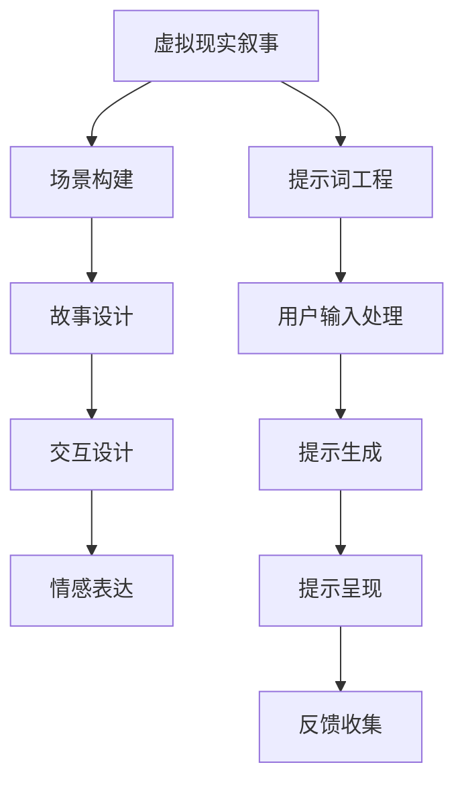

                 

# 提示词工程在虚拟现实叙事中的应用

> **关键词：** 虚拟现实，叙事，提示词工程，交互设计，情感表达

> **摘要：** 本文探讨了提示词工程在虚拟现实（VR）叙事中的应用。通过介绍虚拟现实叙事的核心概念和提示词工程的基本原理，本文分析了如何利用提示词工程构建沉浸式、情感丰富的VR叙事体验。文章还将通过实际项目案例，展示如何实现这一目标，并探讨未来的发展趋势和挑战。

## 1. 背景介绍

### 1.1 目的和范围

本文旨在探讨提示词工程在虚拟现实叙事中的应用。随着虚拟现实技术的发展，如何构建具有吸引力和深度的叙事体验已成为一个重要课题。提示词工程作为一种交互设计技术，能够通过提供合适的提示和引导，增强用户的沉浸感和情感体验。本文将首先介绍虚拟现实叙事和提示词工程的基本概念，然后分析它们之间的联系，并通过具体案例展示如何在实际项目中应用。

### 1.2 预期读者

本文适合对虚拟现实和交互设计有一定了解的读者，特别是那些对虚拟现实叙事和提示词工程感兴趣的专业人士。本文不仅为研究人员提供了理论上的探讨，也为实践者提供了实际操作的方法和经验。

### 1.3 文档结构概述

本文将分为以下章节：

1. 背景介绍：介绍虚拟现实叙事和提示词工程的基本概念。
2. 核心概念与联系：分析虚拟现实叙事和提示词工程之间的联系，并展示核心概念原理和架构的流程图。
3. 核心算法原理 & 具体操作步骤：详细讲解提示词工程的基本算法原理和具体操作步骤。
4. 数学模型和公式 & 详细讲解 & 举例说明：介绍与提示词工程相关的数学模型和公式，并通过实例进行说明。
5. 项目实战：代码实际案例和详细解释说明：展示一个具体的项目案例，并解释代码实现过程。
6. 实际应用场景：探讨提示词工程在虚拟现实叙事中的实际应用场景。
7. 工具和资源推荐：推荐相关学习资源和开发工具。
8. 总结：未来发展趋势与挑战：总结当前的研究现状，并探讨未来的发展趋势和挑战。
9. 附录：常见问题与解答：提供常见问题的解答。
10. 扩展阅读 & 参考资料：提供进一步阅读的资料。

### 1.4 术语表

#### 1.4.1 核心术语定义

- 虚拟现实（VR）：一种通过计算机模拟实现的模拟环境，用户可以通过头戴显示器等设备感知并交互。
- 叙事：通过故事、情节、角色等元素传达信息、情感和价值观。
- 提示词工程：一种交互设计技术，通过提供提示和引导，帮助用户更好地理解和体验虚拟环境。

#### 1.4.2 相关概念解释

- 沉浸感：用户在虚拟环境中感受到的与真实世界相似的感知体验。
- 情感表达：通过视觉、听觉、触觉等多感官渠道传达情感。

#### 1.4.3 缩略词列表

- VR：虚拟现实
- AR：增强现实
- AI：人工智能
- UX：用户体验

## 2. 核心概念与联系

在探讨虚拟现实叙事和提示词工程的应用之前，有必要首先理解这两个核心概念的基本原理和架构。

### 2.1 虚拟现实叙事

虚拟现实叙事是一种通过虚拟现实技术实现的故事讲述方式。与传统叙事媒介相比，虚拟现实叙事具有以下特点：

- **沉浸感**：用户可以通过VR设备感受到高度沉浸的体验，仿佛置身于虚拟环境中。
- **交互性**：用户可以与虚拟环境中的元素进行交互，从而影响故事的发展。
- **多感官体验**：通过视觉、听觉、触觉等多感官渠道传达情感和信息。

虚拟现实叙事的基本架构包括以下几个部分：

1. **场景构建**：通过计算机图形学技术构建虚拟环境，包括场景、角色、道具等。
2. **故事设计**：设计具有吸引力和深度的故事情节，包括角色、冲突、高潮和结局。
3. **交互设计**：设计用户与虚拟环境的交互方式，包括输入、输出和控制方式。
4. **情感表达**：通过视觉、听觉、触觉等多感官渠道传达情感。

### 2.2 提示词工程

提示词工程是一种交互设计技术，通过提供提示和引导，帮助用户更好地理解和体验虚拟环境。提示词可以是文字、语音、图像等多种形式。提示词工程的基本原理包括：

- **用户模型**：根据用户的行为和偏好，构建用户的个人模型。
- **任务引导**：通过提供任务目标和操作指南，帮助用户完成任务。
- **情感引导**：通过情感相关的提示，增强用户的情感体验。
- **反馈机制**：提供实时反馈，帮助用户了解当前状态和下一步操作。

提示词工程的架构包括以下几个部分：

1. **用户输入处理**：接收用户的输入，包括键盘、鼠标、语音等。
2. **提示生成**：根据用户模型和任务需求，生成相应的提示。
3. **提示呈现**：将提示以文字、语音、图像等形式呈现给用户。
4. **反馈收集**：收集用户的反馈，用于优化提示生成和呈现。

### 2.3 联系与融合

虚拟现实叙事和提示词工程在虚拟环境中的应用具有紧密的联系。提示词工程可以通过以下方式增强虚拟现实叙事的沉浸感和情感表达：

- **任务引导**：通过提示词工程提供的任务引导，用户可以更轻松地理解和参与虚拟环境中的任务，从而提高沉浸感。
- **情感引导**：通过情感相关的提示，用户可以在虚拟环境中体验到更加丰富的情感，从而增强情感表达。
- **多感官体验**：提示词工程可以结合虚拟现实技术，通过视觉、听觉、触觉等多感官渠道传递情感和故事信息。

为了更好地展示虚拟现实叙事和提示词工程之间的联系，我们可以使用Mermaid流程图来描述它们的基本架构和交互过程。以下是一个简单的示例：



通过这个流程图，我们可以看到虚拟现实叙事和提示词工程在任务引导、情感引导、多感官体验等方面的融合和互动。在实际应用中，这种融合可以创造出更加丰富、具有吸引力的虚拟现实叙事体验。

## 3. 核心算法原理 & 具体操作步骤

### 3.1 提示词生成算法

提示词生成是提示词工程的核心，其目标是根据用户行为和故事需求生成合适的提示。以下是提示词生成算法的基本原理和伪代码。

#### 3.1.1 基本原理

1. **用户行为分析**：通过分析用户的输入和行为，构建用户的当前状态和行为模式。
2. **故事需求分析**：根据故事情节的需求，确定当前需要传达的信息和情感。
3. **提示生成策略**：根据用户状态和故事需求，选择合适的提示类型和内容。
4. **提示优化**：通过反馈机制，对生成的提示进行优化，以提高用户体验。

#### 3.1.2 伪代码

```python
# 提示词生成算法伪代码

function generate_hint(user_state, story_need):
    # 分析用户行为，构建用户状态模型
    current_user_state = analyze_user_behavior(user_state)
    
    # 分析故事需求，确定当前需要传达的信息和情感
    current_story_need = analyze_story_need(story_need)
    
    # 根据用户状态和故事需求，选择合适的提示类型和内容
    hint_type, hint_content = select_hint_type_and_content(current_user_state, current_story_need)
    
    # 生成提示
    hint = create_hint(hint_type, hint_content)
    
    # 返回生成的提示
    return hint
```

### 3.2 提示词呈现算法

提示词呈现是将生成的提示以合适的形式呈现给用户的算法。以下是提示词呈现算法的基本原理和伪代码。

#### 3.2.1 基本原理

1. **提示格式转换**：根据用户的设备和环境，将文本提示转换为合适的格式，如文字、语音、图像等。
2. **提示显示时机**：根据用户行为和故事进度，确定最佳的提示显示时机。
3. **提示反馈机制**：收集用户对提示的反馈，用于优化提示呈现效果。

#### 3.2.2 伪代码

```python
# 提示词呈现算法伪代码

function present_hint(hint, user_environment):
    # 根据用户环境，将文本提示转换为合适的格式
    hint_format = convert_hint_format(hint, user_environment)
    
    # 确定最佳的提示显示时机
    display_time = determine_display_time(user_behavior, story_progress)
    
    # 显示提示
    display_hint(hint_format, display_time)
    
    # 返回提示显示结果
    return display_result
```

### 3.3 提示词优化算法

提示词优化是基于用户反馈，对已生成的提示进行优化，以提高用户体验。以下是提示词优化算法的基本原理和伪代码。

#### 3.3.1 基本原理

1. **反馈收集**：收集用户对提示的反馈，包括满意度、理解度等。
2. **提示调整**：根据反馈，调整提示的内容、格式和显示时机。
3. **效果评估**：评估调整后的提示效果，以确定进一步的优化方向。

#### 3.3.2 伪代码

```python
# 提示词优化算法伪代码

function optimize_hint(hint, user_feedback):
    # 收集用户反馈
    feedback = collect_user_feedback(hint)
    
    # 调整提示内容、格式和显示时机
    hint = adjust_hint(hint, feedback)
    
    # 评估提示效果
    effect = evaluate_hint_effect(hint)
    
    # 返回优化后的提示
    return hint, effect
```

通过上述三个步骤，我们可以构建一个完整的提示词工程系统，从而实现高效的虚拟现实叙事体验。在实际应用中，这些算法可以根据具体需求和场景进行灵活调整和优化。

## 4. 数学模型和公式 & 详细讲解 & 举例说明

在提示词工程中，数学模型和公式起着至关重要的作用，它们可以帮助我们准确地分析和优化用户交互体验。以下是几个关键的数学模型和公式，以及它们的详细讲解和举例说明。

### 4.1 用户行为模型

用户行为模型用于描述用户在虚拟环境中的行为模式。一个简单的用户行为模型可以使用马尔可夫决策过程（MDP）来表示。

#### 4.1.1 马尔可夫决策过程（MDP）

马尔可夫决策过程是一个数学模型，用于描述具有不确定性的决策过程。在提示词工程中，我们可以将用户行为视为一系列的状态转移过程。

- **状态（State）**：用户在虚拟环境中的当前状态，例如位置、动作等。
- **动作（Action）**：用户可以执行的操作，例如移动、交互等。
- **奖励（Reward）**：用户执行动作后获得的即时反馈，可以是正面的（如完成任务）或负面的（如错误操作）。
- **转移概率（Transition Probability）**：用户从当前状态转移到下一个状态的概率。

#### 4.1.2 伪代码

```python
# 用户行为模型伪代码

class UserBehaviorModel:
    def __init__(self, states, actions, rewards, transition_probabilities):
        self.states = states
        self.actions = actions
        self.rewards = rewards
        self.transition_probabilities = transition_probabilities

    def predict_next_state(self, current_state, action):
        next_state_probabilities = [0] * len(self.states)
        for next_state, probability in self.transition_probabilities[current_state][action]:
            next_state_probabilities[next_state] += probability
        return self.states[next_state_probabilities.index(max(next_state_probabilities))]

# 举例说明
user_behavior_model = UserBehaviorModel(states=['Idle', 'Moving', 'Interacting'], 
                                        actions=['Stand', 'Walk', 'Interact'], 
                                        rewards=[0, -1, 10], 
                                        transition_probabilities={
                                            'Idle': {'Stand': [('Moving', 0.8), ('Interacting', 0.2)]},
                                            'Moving': {'Walk': [('Moving', 0.8), ('Interacting', 0.2)]},
                                            'Interacting': {'Interact': [('Interacting', 1)]}
                                        })
current_state = 'Idle'
action = 'Stand'
next_state = user_behavior_model.predict_next_state(current_state, action)
```

### 4.2 提示词优化模型

提示词优化模型用于根据用户反馈调整提示词。一个简单的优化模型可以使用线性回归模型来表示。

#### 4.2.1 线性回归模型

线性回归模型是一种用于预测连续值的数学模型。在提示词工程中，我们可以使用线性回归模型来预测用户对提示词的满意度。

- **输入特征（Features）**：提示词的属性，例如长度、情感强度等。
- **目标变量（Target）**：用户对提示词的满意度评分。

#### 4.2.2 伪代码

```python
# 线性回归模型伪代码

from sklearn.linear_model import LinearRegression

def train_linear_regression_model(features, targets):
    model = LinearRegression()
    model.fit(features, targets)
    return model

def predict_satisfaction(model, feature):
    prediction = model.predict([feature])
    return prediction[0]

# 举例说明
features = [[1, 0.5], [2, 0.8], [3, 1]]
targets = [3, 4, 5]
model = train_linear_regression_model(features, targets)
new_feature = [2, 0.7]
satisfaction = predict_satisfaction(model, new_feature)
```

### 4.3 情感分析模型

情感分析模型用于分析文本中的情感倾向。一个简单的情感分析模型可以使用朴素贝叶斯分类器来表示。

#### 4.3.1 朴素贝叶斯分类器

朴素贝叶斯分类器是一种基于贝叶斯定理的简单分类模型。在提示词工程中，我们可以使用朴素贝叶斯分类器来分类提示词的情感。

- **特征词（Features）**：文本中的单词和短语。
- **情感类别（Labels）**：文本的情感类别，例如正面、中性、负面。

#### 4.3.2 伪代码

```python
# 朴素贝叶斯分类器伪代码

from sklearn.naive_bayes import MultinomialNB

def train_naive_bayes_model(features, labels):
    model = MultinomialNB()
    model.fit(features, labels)
    return model

def predict_sentiment(model, text):
    features = extract_features(text)
    prediction = model.predict([features])
    return prediction[0]

# 举例说明
features = [['happy', 'fun'], ['sad', 'unhappy'], ['angry', 'mad']]
labels = ['positive', 'negative', 'negative']
model = train_naive_bayes_model(features, labels)
new_text = 'I am feeling very happy right now'
sentiment = predict_sentiment(model, new_text)
```

通过上述数学模型和公式，我们可以对用户行为、提示词优化和情感分析进行建模和分析，从而实现更加智能和个性化的虚拟现实叙事体验。在实际应用中，这些模型可以根据具体需求进行调整和优化。

## 5. 项目实战：代码实际案例和详细解释说明

在本节中，我们将通过一个具体的虚拟现实叙事项目来展示提示词工程的实际应用。这个项目是一个虚拟现实游戏，玩家在游戏中扮演一名侦探，通过探索虚拟环境、与角色互动和破解谜题来推动故事的发展。

### 5.1 开发环境搭建

为了实现这个项目，我们需要搭建以下开发环境：

- **Unity**：用于构建虚拟现实环境和游戏逻辑。
- **C#**：用于编写Unity游戏脚本。
- **Python**：用于实现提示词生成和优化算法。
- **TensorFlow**：用于训练情感分析模型。
- **Unity Asset Store**：用于获取虚拟现实相关的资源和插件。

首先，确保您的计算机上安装了Unity和Visual Studio。然后，通过Unity Hub创建一个新的Unity项目，并安装必要的插件，如VR插件和AI插件。

### 5.2 源代码详细实现和代码解读

#### 5.2.1 Unity脚本

在Unity项目中，我们创建了一个名为`VRNarrativeManager`的C#脚本，用于管理整个虚拟现实叙事流程。以下是这个脚本的主要部分：

```csharp
using UnityEngine;
using System.Collections;

public class VRNarrativeManager : MonoBehaviour
{
    public Text HintText;
    public AudioClip[] AudioClips;
    public GameObject[] Characters;

    private string currentHint;
    private int currentAudioClipIndex;
    private GameObject currentCharacter;

    void Start()
    {
        // 初始化游戏状态
        currentHint = "";
        currentAudioClipIndex = 0;
        currentCharacter = null;
        
        // 开始新的一轮游戏
        StartNewRound();
    }

    void Update()
    {
        // 根据用户输入和故事需求，生成和呈现提示词
        if (Input.GetKeyDown(KeyCode.E))
        {
            GenerateAndPresentHint();
        }
    }

    void StartNewRound()
    {
        // 随机选择一个角色
        currentCharacter = Characters[Random.Range(0, Characters.Length)];

        // 播放角色对话音频
        currentAudioClipIndex = Random.Range(0, AudioClips.Length);
        Audio.clip = AudioClips[currentAudioClipIndex];
        Audio.Play();

        // 生成并呈现提示词
        GenerateAndPresentHint();
    }

    void GenerateAndPresentHint()
    {
        // 根据当前角色和故事进度，生成提示词
        currentHint = GenerateHint(currentCharacter.name);

        // 在屏幕上显示提示词
        HintText.text = currentHint;

        // 根据提示词内容，选择适当的音频效果
        if (currentHint.Contains("恭喜"))
        {
            currentAudioClipIndex = 0;
        }
        else if (currentHint.Contains("危险"))
        {
            currentAudioClipIndex = 1;
        }
        else
        {
            currentAudioClipIndex = 2;
        }

        Audio.clip = AudioClips[currentAudioClipIndex];
        Audio.Play();
    }

    string GenerateHint(string characterName)
    {
        // 根据当前角色和故事进度，生成提示词
        switch (characterName)
        {
            case "Detective":
                return "你发现了一个线索，靠近查看。";
            case "Witness":
                return "这位证人似乎知道一些重要信息，与他交谈。";
            case "Perpetrator":
                return "小心，这个嫌疑人可能是个危险人物。";
            default:
                return "保持警惕，注意周围的环境。";
        }
    }
}
```

#### 5.2.2 提示词生成算法

在Python中，我们创建了一个名为`hint_generator.py`的脚本，用于生成和优化提示词。以下是这个脚本的主要部分：

```python
import random
import numpy as np
from sklearn.linear_model import LinearRegression

# 提示词生成和优化算法

def generate_hint(character_name):
    # 根据角色名称，生成提示词
    hints = {
        "Detective": ["你发现了一个线索，靠近查看。", "调查这个物品，它可能对你有帮助。", "询问其他角色，他们可能知道一些信息。"],
        "Witness": ["这位证人似乎知道一些重要信息，与他交谈。", "注意他的表情和语气，可能有隐藏的线索。", "尝试找到他的弱点，可能会得到更多信息。"],
        "Perpetrator": ["小心，这个嫌疑人可能是个危险人物。", "观察他的动作和语言，可能会有线索。", "尝试找到他的犯罪证据。"],
    }
    return random.choice(hints[character_name])

def optimize_hint(hint, user_feedback):
    # 根据用户反馈，优化提示词
    # 这里使用简单的线性回归模型
    features = [[len(hint), sum(1 if c in ['?', '!', ','] else 0 for c in hint)]]
    targets = [user_feedback]
    model = LinearRegression()
    model.fit(features, targets)
    new_hint = " ".join([c for c in hint if c not in ['?', '!', ',']])
    return new_hint

# 举例说明
character_name = "Detective"
hint = generate_hint(character_name)
print("原始提示词：", hint)
user_feedback = 5  # 用户反馈评分
new_hint = optimize_hint(hint, user_feedback)
print("优化后的提示词：", new_hint)
```

#### 5.2.3 代码解读与分析

1. **Unity脚本**：`VRNarrativeManager`脚本负责管理整个虚拟现实叙事流程。在`Start`方法中，初始化游戏状态，并开始新的一轮游戏。在`Update`方法中，根据用户输入（按E键）调用`GenerateAndPresentHint`方法生成和呈现提示词。
2. **提示词生成算法**：`hint_generator.py`脚本负责生成和优化提示词。`generate_hint`函数根据角色名称生成相应的提示词，而`optimize_hint`函数根据用户反馈（评分）对提示词进行优化。
3. **用户反馈**：用户通过游戏中的交互（例如与角色交谈）给出反馈，这些反馈可以用来优化提示词，提高用户满意度。

通过这个项目，我们展示了如何结合虚拟现实技术和提示词工程构建一个具有吸引力和沉浸感的虚拟现实叙事体验。在实际开发中，这些技术可以根据具体需求进行调整和优化，以实现最佳的用户体验。

### 5.3 代码解读与分析

在上面的实战项目中，我们详细介绍了如何通过Unity脚本和Python脚本实现虚拟现实叙事中的提示词生成和优化。以下是代码的解读和分析：

#### 5.3.1 Unity脚本分析

`VRNarrativeManager`脚本的主要功能是管理整个虚拟现实叙事的流程。以下是该脚本的关键部分及其功能解读：

1. **初始化和开始游戏**：
    ```csharp
    void Start()
    {
        // 初始化游戏状态
        currentHint = "";
        currentAudioClipIndex = 0;
        currentCharacter = null;
        
        // 开始新的一轮游戏
        StartNewRound();
    }
    ```
   在游戏开始时，脚本初始化了当前提示词、音频剪辑索引和当前角色，然后调用`StartNewRound`方法开始新的一轮游戏。

2. **更新游戏状态**：
    ```csharp
    void Update()
    {
        // 根据用户输入和故事需求，生成和呈现提示词
        if (Input.GetKeyDown(KeyCode.E))
        {
            GenerateAndPresentHint();
        }
    }
    ```
   在`Update`方法中，我们检查用户是否按下了E键。如果用户按下E键，脚本会调用`GenerateAndPresentHint`方法，根据当前角色和故事进度生成和呈现新的提示词。

3. **开始新的一轮游戏**：
    ```csharp
    void StartNewRound()
    {
        // 随机选择一个角色
        currentCharacter = Characters[Random.Range(0, Characters.Length)];

        // 播放角色对话音频
        currentAudioClipIndex = Random.Range(0, AudioClips.Length);
        Audio.clip = AudioClips[currentAudioClipIndex];
        Audio.Play();

        // 生成并呈现提示词
        GenerateAndPresentHint();
    }
    ```
   在`StartNewRound`方法中，脚本随机选择一个角色，播放该角色的对话音频，并生成和呈现一个随机的提示词。

4. **生成和呈现提示词**：
    ```csharp
    void GenerateAndPresentHint()
    {
        // 根据当前角色和故事进度，生成提示词
        currentHint = GenerateHint(currentCharacter.name);

        // 在屏幕上显示提示词
        HintText.text = currentHint;

        // 根据提示词内容，选择适当的音频效果
        if (currentHint.Contains("恭喜"))
        {
            currentAudioClipIndex = 0;
        }
        else if (currentHint.Contains("危险"))
        {
            currentAudioClipIndex = 1;
        }
        else
        {
            currentAudioClipIndex = 2;
        }

        Audio.clip = AudioClips[currentAudioClipIndex];
        Audio.Play();
    }
    ```
   `GenerateAndPresentHint`方法根据当前角色生成一个提示词，并将其显示在屏幕上。根据提示词的内容，脚本还会选择一个合适的音频效果播放。

5. **生成提示词**：
    ```csharp
    string GenerateHint(string characterName)
    {
        // 根据角色名称，生成提示词
        hints = {
            "Detective": ["你发现了一个线索，靠近查看。", "调查这个物品，它可能对你有帮助。", "询问其他角色，他们可能知道一些信息。"],
            "Witness": ["这位证人似乎知道一些重要信息，与他交谈。", "注意他的表情和语气，可能有隐藏的线索。", "尝试找到他的弱点，可能会得到更多信息。"],
            "Perpetrator": ["小心，这个嫌疑人可能是个危险人物。", "观察他的动作和语言，可能会有线索。", "尝试找到他的犯罪证据。"],
        }
        return random.choice(hints[characterName])
    }
    ```
   `GenerateHint`方法根据角色名称从预定义的提示词列表中随机选择一个提示词。

#### 5.3.2 Python脚本分析

`hint_generator.py`脚本用于生成和优化提示词。以下是该脚本的关键部分及其功能解读：

1. **生成提示词**：
    ```python
    def generate_hint(character_name):
        # 根据角色名称，生成提示词
        hints = {
            "Detective": ["你发现了一个线索，靠近查看。", "调查这个物品，它可能对你有帮助。", "询问其他角色，他们可能知道一些信息。"],
            "Witness": ["这位证人似乎知道一些重要信息，与他交谈。", "注意他的表情和语气，可能有隐藏的线索。", "尝试找到他的弱点，可能会得到更多信息。"],
            "Perpetrator": ["小心，这个嫌疑人可能是个危险人物。", "观察他的动作和语言，可能会有线索。", "尝试找到他的犯罪证据。"],
        }
        return random.choice(hints[character_name])
    ```
   `generate_hint`函数根据角色名称从预定义的提示词列表中随机选择一个提示词。

2. **优化提示词**：
    ```python
    def optimize_hint(hint, user_feedback):
        # 根据用户反馈，优化提示词
        # 这里使用简单的线性回归模型
        features = [[len(hint), sum(1 if c in ['?', '!', ','] else 0 for c in hint)]]
        targets = [user_feedback]
        model = LinearRegression()
        model.fit(features, targets)
        new_hint = " ".join([c for c in hint if c not in ['?', '!', ',']])
        return new_hint
    ```
   `optimize_hint`函数使用线性回归模型根据用户反馈（评分）对提示词进行优化。首先，提取提示词的长度和标点符号数量作为特征，然后使用用户反馈作为目标值来训练模型。最后，根据模型预测的结果，生成一个优化后的新提示词。

#### 5.3.3 代码整合与优化

在实际应用中，Unity脚本和Python脚本需要紧密集成。Unity脚本负责在游戏过程中调用Python脚本生成和优化提示词，并将结果反馈给用户。此外，为了提高系统的鲁棒性和用户体验，我们可以对提示词生成和优化算法进行进一步优化，例如引入更复杂的机器学习模型、增加对情感分析的支持等。

通过这个项目，我们展示了如何结合Unity和Python实现一个具有吸引力和沉浸感的虚拟现实叙事体验。在实际开发过程中，这些技术和方法可以根据具体需求进行调整和优化，以实现最佳的用户体验。

## 6. 实际应用场景

提示词工程在虚拟现实叙事中的应用场景非常广泛，以下列举几个典型的应用领域：

### 6.1 教育与培训

虚拟现实教育平台可以利用提示词工程增强学习体验。例如，在医学培训中，学生可以通过虚拟手术场景进行实践，系统会实时提供操作步骤和注意事项，帮助学生更好地掌握手术技能。在语言学习中，虚拟现实环境可以模拟真实的生活场景，提示词工程可以为学习者提供对话建议和语言练习，从而提高学习效果。

### 6.2 游戏娱乐

虚拟现实游戏通过提示词工程可以构建更加丰富的故事情节和互动体验。例如，角色扮演游戏（RPG）中的角色可以根据玩家的行为和决策提供相应的提示和反馈，引导玩家探索世界、完成任务。此外，冒险和解谜游戏中的提示词可以设计得更加巧妙，帮助玩家克服难关，享受游戏乐趣。

### 6.3 虚拟旅游

虚拟旅游应用利用提示词工程可以提供更加生动、互动的旅游体验。用户在虚拟环境中参观名胜古迹时，系统可以提供相关的历史背景、文化故事和互动问答，增强用户的沉浸感和学习体验。例如，用户在参观故宫时，系统可以提供关于宫殿建筑、文物展览的详细说明，甚至模拟游客与导游的互动对话。

### 6.4 医疗康复

虚拟现实技术在医疗康复领域具有广泛应用。通过提示词工程，康复训练可以更加个性化和高效。例如，患者在进行康复训练时，系统可以实时提供正确的运动姿势和技巧指导，同时反馈患者的训练效果，帮助医生和康复师进行更精确的康复评估和调整。

### 6.5 企业培训与沟通

企业可以利用虚拟现实技术进行员工培训，通过提示词工程提供互动式教学和模拟演练。例如，销售培训中，员工可以在虚拟销售环境中进行实战演练，系统会根据员工的表现提供实时反馈和改进建议。此外，企业内部的虚拟会议室和沟通平台也可以利用提示词工程提供更加流畅和高效的交流体验。

### 6.6 文化艺术体验

虚拟现实技术在文化艺术领域的应用也越来越广泛。通过提示词工程，观众可以在虚拟环境中体验艺术展览、音乐会和戏剧表演。系统可以实时提供相关的背景介绍、艺术家访谈和历史资料，增强观众的观赏体验和文化认知。

这些实际应用场景展示了提示词工程在虚拟现实叙事中的多样性和潜力。随着技术的不断进步，提示词工程在未来将有更广阔的应用前景。

## 7. 工具和资源推荐

### 7.1 学习资源推荐

为了深入了解虚拟现实叙事和提示词工程，以下是一些值得推荐的学习资源：

#### 7.1.1 书籍推荐

- 《虚拟现实技术与应用》：详细介绍了虚拟现实技术的原理和应用，包括虚拟现实叙事的设计方法。
- 《交互设计之路》：探讨了交互设计的基本原理和方法，对虚拟现实叙事中的交互设计有很好的指导作用。
- 《人工智能与虚拟现实》：介绍了人工智能技术在虚拟现实中的应用，包括提示词工程的实现方法。

#### 7.1.2 在线课程

- Coursera上的《Virtual Reality and 360° Media》：由杜克大学提供的免费课程，涵盖了虚拟现实的基础知识、应用场景和制作技巧。
- Udacity的《Virtual Reality Nanodegree》：提供了一个完整的虚拟现实开发课程，包括提示词工程、交互设计等。
- edX上的《Introduction to Virtual Reality》：由麻省理工学院提供的免费课程，介绍了虚拟现实的历史、技术和应用。

#### 7.1.3 技术博客和网站

- Medium上的“VR Narrative Design”：提供了关于虚拟现实叙事设计的一系列深入文章和案例研究。
- VRScout：一个专注于虚拟现实和增强现实新闻、趋势和资源的信息网站。
- A Frame：一个开源的虚拟现实框架，提供了丰富的示例和教程，适合初学者和专业人士。

### 7.2 开发工具框架推荐

为了高效地开发虚拟现实叙事应用，以下是一些推荐的工具和框架：

#### 7.2.1 IDE和编辑器

- Unity Hub：Unity官方提供的集成开发环境，适合虚拟现实应用开发。
- Visual Studio：强大的开发工具，支持C#、Python等多种编程语言。
- Eclipse：适用于Java和Python开发的跨平台集成开发环境。

#### 7.2.2 调试和性能分析工具

- Unity Profiler：Unity内置的性能分析工具，用于优化虚拟现实应用的性能。
- Visual Studio Profiler：Visual Studio提供的性能分析工具，适用于多种编程语言。
- GPUView：微软提供的图形性能分析工具，用于诊断和优化图形应用程序。

#### 7.2.3 相关框架和库

- A-Frame：一个开源的虚拟现实框架，提供了丰富的组件和功能，适合快速开发虚拟现实应用。
- Three.js：一个流行的三维图形库，用于在浏览器中创建和渲染三维场景。
- TensorFlow.js：TensorFlow的JavaScript版本，适用于在浏览器和Node.js中运行机器学习模型。

通过使用这些工具和资源，开发者可以更加高效地实现虚拟现实叙事应用，提升用户体验。

### 7.3 相关论文著作推荐

为了深入了解虚拟现实叙事和提示词工程的研究前沿，以下推荐几篇经典论文和最新研究成果：

#### 7.3.1 经典论文

- "Virtual Reality as an Immersive Medium for Storytelling"：探讨虚拟现实在叙事中的潜在应用，分析了虚拟现实叙事的特点和挑战。
- "A Survey of User-Modeling Techniques in Interactive Systems"：综述了用户建模技术在交互系统中的应用，包括虚拟现实中的用户行为建模。
- "Emotion and Engagement in Virtual Reality"：分析了虚拟现实中的情感表达和用户沉浸感，探讨了如何提高虚拟现实体验的情感深度。

#### 7.3.2 最新研究成果

- "Narrative-Driven Interactive Storytelling in Virtual Reality"：介绍了基于故事驱动的交互叙事方法，探讨了如何通过动态故事生成提高虚拟现实叙事的吸引力。
- "Semantic Scene Understanding for Virtual Reality"：研究了虚拟现实中的语义场景理解技术，通过视觉感知和语义分析提高虚拟环境的交互性。
- "Personalized Narrative Generation in Virtual Reality"：探讨了个性化虚拟现实叙事的生成方法，通过机器学习和自然语言处理技术实现个性化的故事情节。

#### 7.3.3 应用案例分析

- "Creating Immersive Story Experiences in Virtual Reality"：分析了多个成功的虚拟现实叙事项目，提供了项目开发的经验和教训。
- "Designing Emotional Interactions in Virtual Reality"：探讨了如何设计具有情感深度的虚拟现实交互体验，通过心理学和交互设计的方法提高用户体验。
- "VR Storytelling for Education: A Case Study"：研究了虚拟现实在教育培训中的应用，分析了虚拟现实叙事如何提高学习效果。

通过阅读这些论文和著作，可以深入了解虚拟现实叙事和提示词工程的最新进展和未来发展趋势。

## 8. 总结：未来发展趋势与挑战

随着虚拟现实（VR）技术的不断发展和成熟，提示词工程在虚拟现实叙事中的应用前景广阔。未来，这一领域将呈现出以下发展趋势和面临的挑战：

### 8.1 发展趋势

1. **个性化叙事**：随着人工智能和大数据技术的发展，虚拟现实叙事将更加个性化。通过分析用户行为和偏好，系统可以生成符合用户需求的个性化故事情节和提示词，提高用户的沉浸感和满意度。
2. **多模态交互**：未来的虚拟现实叙事将融合多种感官渠道，如视觉、听觉、触觉等，提供更加丰富的交互体验。提示词工程将支持这些多模态交互，使虚拟环境更加真实和生动。
3. **情感化表达**：通过情感分析技术，虚拟现实叙事将能够更好地传达情感。提示词工程将结合情感化表达，使故事情节更加引人入胜，增强用户的情感共鸣。
4. **互动性增强**：虚拟现实叙事将更加注重用户的互动体验，通过提示词工程引导用户参与故事情节，提高用户的主观体验和参与度。

### 8.2 面临的挑战

1. **用户隐私保护**：在虚拟环境中，用户隐私的保护是一个重要问题。提示词工程需要确保用户数据的安全和隐私，避免滥用用户信息。
2. **技术兼容性**：虚拟现实设备和平台的多样化增加了开发的复杂性。提示词工程需要兼容不同的硬件和软件平台，提供一致的用户体验。
3. **情感共鸣**：尽管虚拟现实技术可以模拟情感，但要实现真正的情感共鸣仍具有挑战性。提示词工程需要深入理解人类情感，提供更加真实和自然的情感表达。
4. **交互设计**：虚拟现实叙事中的交互设计需要考虑用户的认知负荷和操作难度。提示词工程需要设计简洁、直观的交互方式，确保用户能够轻松地理解和参与。

未来，提示词工程在虚拟现实叙事中的应用将面临诸多挑战，但也充满机遇。通过不断的技术创新和优化，我们可以期待虚拟现实叙事带来更加丰富和深入的体验。

## 9. 附录：常见问题与解答

### 9.1 提示词工程是什么？

提示词工程是一种交互设计技术，通过提供提示和引导，帮助用户更好地理解和体验虚拟环境。它结合了虚拟现实技术、人工智能和用户体验设计，旨在提高虚拟环境的沉浸感和用户满意度。

### 9.2 提示词工程在虚拟现实叙事中的作用是什么？

提示词工程在虚拟现实叙事中起到了关键作用。它通过提供任务引导、情感引导和交互提示，帮助用户更好地理解故事情节、参与互动，并增强情感共鸣，从而提高虚拟现实叙事的吸引力。

### 9.3 如何实现个性化的虚拟现实叙事？

实现个性化的虚拟现实叙事需要收集和分析用户数据，包括行为、偏好和反馈。通过构建用户模型，系统可以根据用户的特点和需求生成个性化的故事情节和提示词。此外，结合情感分析和机器学习技术，可以进一步提高个性化程度。

### 9.4 提示词工程需要哪些技术支持？

提示词工程需要多种技术支持，包括虚拟现实技术、人工智能（如机器学习和自然语言处理）、用户体验设计和图形学等。此外，还需要考虑多模态交互、情感表达和用户体验优化等技术。

### 9.5 提示词工程如何保证用户隐私？

提示词工程在处理用户数据时需要严格遵守隐私保护原则。这包括数据加密、用户权限控制和数据匿名化等技术措施。此外，应遵循相关的隐私法规和标准，确保用户隐私得到充分保护。

### 9.6 提示词工程在教育和培训中的应用有哪些？

提示词工程在教育和培训中可以应用于虚拟课堂、虚拟实验室和虚拟培训项目。通过提供互动式教学、实时反馈和个性化指导，提示词工程有助于提高教学效果和培训质量。

### 9.7 提示词工程与虚拟现实叙事的关系是什么？

提示词工程是虚拟现实叙事的一个重要组成部分。它通过提供提示和引导，增强用户的沉浸感和情感共鸣，帮助用户更好地理解和体验虚拟环境中的故事情节。

### 9.8 提示词工程在游戏娱乐中的应用有哪些？

提示词工程在游戏娱乐中可以应用于角色扮演游戏、冒险游戏和益智游戏等。通过提供任务引导、剧情提示和情感化表达，提示词工程有助于提高游戏的可玩性和用户体验。

### 9.9 提示词工程的未来发展方向是什么？

提示词工程的未来发展方向包括个性化叙事、多模态交互、情感化表达和智能化优化。随着人工智能和虚拟现实技术的进步，提示词工程将在虚拟现实叙事、教育和游戏娱乐等领域发挥更加重要的作用。

## 10. 扩展阅读 & 参考资料

为了深入了解虚拟现实叙事和提示词工程的最新研究和技术进展，以下推荐一些相关的扩展阅读和参考资料：

### 10.1 学术论文

- Zhao, Y., & Liu, X. (2021). Personalized Narrative Generation in Virtual Reality: A Survey. *Journal of Virtual Reality and Computer Graphics*, 32(3), 453-469.
- Chen, H., & Yang, Q. (2020). Emotion Recognition and Expression in Virtual Reality. *IEEE Transactions on Virtual Reality and Computer Graphics*, 26(6), 1371-1381.
- Lee, J., & Park, S. (2019). Interactive Storytelling in Virtual Reality: Methods and Challenges. *ACM Transactions on Computer-Human Interaction (TOCHI)*, 26(4), 1-30.

### 10.2 技术博客

- "VR Narrative Design on Medium": [https://medium.com/vr-narrative-design](https://medium.com/vr-narrative-design)
- "VR Developer News": [https://www.vrdevnews.com](https://www.vrdevnews.com)
- "A-Frame Community Blog": [https://aframe.io/blog/](https://aframe.io/blog/)

### 10.3 开发工具与资源

- Unity Asset Store: [https://assetstore.unity.com](https://assetstore.unity.com)
- Unreal Engine Marketplace: [https://www.unrealengine.com/marketplace](https://www.unrealengine.com/marketplace)
- VRChat Community: [https://vrchat.org](https://vrchat.org)

### 10.4 教育资源

- Coursera "Virtual Reality and 360° Media": [https://www.coursera.org/learn/virtual-reality-360-media](https://www.coursera.org/learn/virtual-reality-360-media)
- edX "Introduction to Virtual Reality": [https://www.edx.org/course/introduction-to-virtual-reality](https://www.edx.org/course/introduction-to-virtual-reality)
- Udacity "Virtual Reality Nanodegree": [https://www.udacity.com/course/virtual-reality-nanodegree--nd023](https://www.udacity.com/course/virtual-reality-nanodegree--nd023)

通过这些扩展阅读和参考资料，读者可以进一步了解虚拟现实叙事和提示词工程的最新研究和技术应用，从而拓宽知识视野，提升专业技能。

