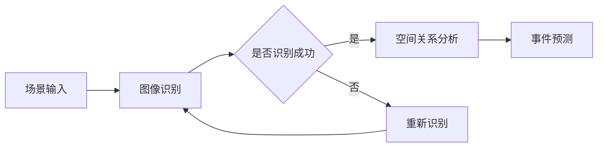

                 

# 提示词工程在计算机视觉中的场景理解应用

## 关键词：
计算机视觉，场景理解，提示词工程，人工智能，深度学习

## 摘要：
本文将深入探讨提示词工程在计算机视觉领域中的场景理解应用。通过介绍场景理解的基本概念、提示词工程的核心原理，以及如何利用深度学习技术提升场景理解能力，本文旨在为读者提供一幅全面、系统的场景理解应用图景。同时，通过实战案例和资源推荐，帮助读者更好地理解和掌握这一技术。

## 1. 背景介绍

### 1.1 目的和范围

本文的目的是介绍并探讨提示词工程在计算机视觉场景理解中的应用。随着深度学习技术的快速发展，计算机视觉在图像识别、物体检测、场景理解等方面取得了显著成果。然而，场景理解作为计算机视觉中的一个重要分支，仍面临诸多挑战。提示词工程作为一种有效的技术手段，其在场景理解中的应用具有重要的理论和实践价值。

本文将首先介绍场景理解的基本概念，接着详细阐述提示词工程的核心原理和流程。然后，我们将探讨如何利用深度学习技术提升场景理解能力，并通过具体案例展示提示词工程在实际应用中的效果。最后，我们将总结本文的主要观点，并展望未来发展趋势和挑战。

### 1.2 预期读者

本文适合对计算机视觉和人工智能感兴趣的读者，特别是希望了解和掌握场景理解技术的人员。本文将从基础概念出发，逐步深入探讨提示词工程在场景理解中的应用，旨在为读者提供一个全面、系统的理解和实践经验。

### 1.3 文档结构概述

本文分为十个部分，具体结构如下：

1. 背景介绍
2. 核心概念与联系
3. 核心算法原理 & 具体操作步骤
4. 数学模型和公式 & 详细讲解 & 举例说明
5. 项目实战：代码实际案例和详细解释说明
6. 实际应用场景
7. 工具和资源推荐
8. 总结：未来发展趋势与挑战
9. 附录：常见问题与解答
10. 扩展阅读 & 参考资料

### 1.4 术语表

#### 1.4.1 核心术语定义

- 场景理解：指计算机系统对图像或视频中的场景内容进行解析和理解的能力，包括物体识别、空间关系、事件预测等。
- 提示词工程：通过设计特定的提示词，引导和辅助计算机系统进行场景理解的过程。
- 深度学习：一种基于多层神经网络的人工智能技术，通过学习大量数据，自动提取特征并进行预测。

#### 1.4.2 相关概念解释

- 图像识别：指计算机系统对图像中的物体、场景等元素进行识别和分类的能力。
- 物体检测：指计算机系统在图像中检测并定位特定物体的位置和范围。
- 事件预测：指计算机系统根据图像或视频内容预测可能发生的事件。

#### 1.4.3 缩略词列表

- CV：计算机视觉（Computer Vision）
- SLAM：同时定位与地图构建（Simultaneous Localization and Mapping）
- DNN：深度神经网络（Deep Neural Network）
- CNN：卷积神经网络（Convolutional Neural Network）

## 2. 核心概念与联系

### 2.1 场景理解的基本概念

场景理解是计算机视觉中的重要研究方向，其主要目的是使计算机系统具备对图像或视频中的场景内容进行解析和理解的能力。场景理解涉及到多个层面的任务，包括物体识别、空间关系分析、事件预测等。

- 物体识别：指计算机系统在图像中识别并分类出不同物体。如识别图像中的猫、狗、车等。
- 空间关系分析：指计算机系统分析图像中不同物体之间的相对位置和关系。如判断物体是相互独立、相邻还是相互包含。
- 事件预测：指计算机系统根据图像或视频内容预测可能发生的事件。如识别出交通拥堵、火灾等异常事件。

### 2.2 提示词工程的核心原理

提示词工程是一种通过设计特定的提示词，引导和辅助计算机系统进行场景理解的技术手段。提示词可以是文字、图像或音频等不同形式，其核心原理在于利用人类语言的语义信息和上下文关系，引导计算机系统对图像或视频内容进行理解和分析。

- 文字提示词：通过提供与场景相关的关键词或句子，引导计算机系统进行图像识别和场景分析。
- 图像提示词：通过提供与场景相关的图像，引导计算机系统识别图像中的物体和关系。
- 音频提示词：通过提供与场景相关的音频信息，如语音、音乐等，引导计算机系统进行场景理解。

### 2.3 深度学习技术与场景理解

深度学习技术为计算机视觉领域带来了重大突破，其在场景理解中的应用主要包括以下几个方面：

- 特征提取：深度学习通过学习大量数据，自动提取图像中的有效特征，提高物体识别和场景分析的准确性。
- 模型优化：通过调整网络结构和参数，优化深度学习模型在场景理解任务中的性能。
- 多任务学习：将多个场景理解任务整合到一个深度学习模型中，提高系统的综合性能。

### 2.4 提示词工程与深度学习的关系

提示词工程与深度学习技术密切相关，二者相互促进，共同推动计算机视觉领域的发展。提示词工程可以为深度学习模型提供有针对性的训练数据和提示信息，提高模型的准确性和泛化能力。同时，深度学习技术为提示词工程提供了强大的计算能力和特征提取能力，使得场景理解任务更加高效和准确。

### 2.5 Mermaid 流程图



在上面的流程图中，场景输入经过图像识别、空间关系分析和事件预测三个步骤，最终实现对场景内容的全面理解。提示词工程贯穿于整个过程，为各个步骤提供辅助和支持。

## 3. 核心算法原理 & 具体操作步骤

### 3.1 图像识别算法原理

图像识别是场景理解的基础，其核心在于从图像中提取有效特征，并进行分类。常用的图像识别算法包括卷积神经网络（CNN）和深度卷积神经网络（DNN）。

- CNN：通过卷积操作提取图像中的局部特征，并利用池化操作降低计算复杂度。CNN 具有平移不变性和多层特征提取能力，适合处理复杂的图像数据。
- DNN：在 CNN 的基础上，添加了全连接层和卷积层，进一步提取图像的深层特征。DNN 具有更强的分类能力和泛化能力，适合处理复杂的场景理解任务。

### 3.2 图像识别算法的具体操作步骤

1. 数据预处理：对图像进行缩放、裁剪、翻转等预处理操作，使其适应模型的输入要求。
2. 神经网络构建：设计卷积神经网络或深度卷积神经网络，包括卷积层、池化层、全连接层等。
3. 模型训练：使用大量标注好的图像数据，通过反向传播算法优化模型参数，提高模型的准确性和泛化能力。
4. 模型评估：使用测试集评估模型的性能，包括准确率、召回率、F1 值等指标。
5. 模型部署：将训练好的模型部署到实际应用场景中，实现对图像的实时识别和分类。

### 3.3 空间关系分析算法原理

空间关系分析是场景理解的关键步骤，其目的是分析图像中不同物体之间的相对位置和关系。常用的空间关系分析算法包括基于几何的方法和基于深度学习的方法。

- 基于几何的方法：通过计算图像中物体的几何特征，如形状、大小、位置等，分析物体之间的空间关系。
- 基于深度学习的方法：通过训练深度学习模型，自动提取图像中物体的特征，并进行空间关系分析。

### 3.4 空间关系分析算法的具体操作步骤

1. 物体识别：使用图像识别算法对图像中的物体进行识别和分类。
2. 特征提取：对识别出的物体进行特征提取，如形状、大小、位置等。
3. 空间关系建模：设计深度学习模型，将物体的特征作为输入，预测物体之间的空间关系。
4. 模型训练：使用大量标注好的空间关系数据，通过反向传播算法优化模型参数。
5. 模型评估：使用测试集评估模型的空间关系分析性能。
6. 模型部署：将训练好的模型部署到实际应用场景中，实现对图像中物体空间关系的实时分析。

### 3.5 事件预测算法原理

事件预测是场景理解的高级任务，其目的是根据图像或视频内容预测可能发生的事件。事件预测算法通常基于时序数据和深度学习技术。

- 时序数据：通过分析图像或视频中的时间序列数据，预测事件的发生概率和类型。
- 深度学习：通过训练深度学习模型，自动提取图像或视频中的特征，并进行事件预测。

### 3.6 事件预测算法的具体操作步骤

1. 特征提取：对图像或视频进行特征提取，如目标跟踪、动作识别等。
2. 时序建模：设计深度学习模型，将特征作为输入，预测事件的发生时间和类型。
3. 模型训练：使用大量标注好的事件数据，通过反向传播算法优化模型参数。
4. 模型评估：使用测试集评估模型的事件预测性能。
5. 模型部署：将训练好的模型部署到实际应用场景中，实现对图像或视频事件预测的实时处理。

## 4. 数学模型和公式 & 详细讲解 & 举例说明

### 4.1 图像识别的数学模型

图像识别的核心在于特征提取和分类。在深度学习中，常用的分类模型是 Softmax 函数。

$$
P(y=j) = \frac{e^{z_j}}{\sum_{k} e^{z_k}}
$$

其中，$z_j$ 是神经网络在输出层对应的特征值，$y=j$ 表示预测的类别为 $j$。通过计算 Softmax 函数，可以得到每个类别对应的概率分布。

### 4.2 空间关系分析的数学模型

空间关系分析通常使用深度学习模型进行建模。以 CNN 为例，其基本结构包括卷积层、池化层和全连接层。

- 卷积层：通过卷积操作提取图像的局部特征。

$$
h_k(x) = \sum_{i} w_{ki} * h_{i-1}(x)
$$

其中，$h_k(x)$ 表示第 $k$ 层的输出特征，$w_{ki}$ 是卷积核，$*$ 表示卷积操作。

- 池化层：通过池化操作降低特征图的维度。

$$
h_k(x) = \max_{i \in \Omega} h_{i-1}(x)
$$

其中，$\Omega$ 表示池化窗口。

- 全连接层：将卷积层的输出特征进行全连接，得到最终分类结果。

$$
z_j = \sum_{k} w_{jk} h_k(x)
$$

### 4.3 事件预测的数学模型

事件预测通常使用时序模型进行建模。以 Long Short-Term Memory（LSTM）为例，其基本结构包括输入门、遗忘门和输出门。

- 输入门：

$$
i_t = \sigma(W_i [h_{t-1}, x_t] + b_i)
$$

其中，$i_t$ 表示输入门的激活值，$W_i$ 和 $b_i$ 分别为权重和偏置。

- 遗忘门：

$$
f_t = \sigma(W_f [h_{t-1}, x_t] + b_f)
$$

其中，$f_t$ 表示遗忘门的激活值。

- 输出门：

$$
o_t = \sigma(W_o [h_{t-1}, x_t] + b_o)
$$

其中，$o_t$ 表示输出门的激活值。

- 状态更新：

$$
c_t = f_t \odot c_{t-1} + i_t \odot \tanh(W_c [h_{t-1}, x_t] + b_c)
$$

其中，$c_t$ 表示状态值，$\odot$ 表示逐元素乘法。

- 输出：

$$
h_t = o_t \odot \tanh(c_t)
$$

其中，$h_t$ 表示隐藏状态。

### 4.4 举例说明

假设我们使用卷积神经网络进行图像识别，输入图像大小为 $32 \times 32$，输出类别数为 10。首先，我们设计一个简单的卷积神经网络，包括两个卷积层、两个池化层和一个全连接层。

1. 输入层：接受 $32 \times 32$ 的图像。
2. 第一个卷积层：使用 32 个 $3 \times 3$ 的卷积核，步长为 1，激活函数为 ReLU。
3. 第一个池化层：使用 $2 \times 2$ 的最大池化。
4. 第二个卷积层：使用 64 个 $3 \times 3$ 的卷积核，步长为 1，激活函数为 ReLU。
5. 第二个池化层：使用 $2 \times 2$ 的最大池化。
6. 全连接层：使用 10 个神经元，激活函数为 Softmax。

通过训练该卷积神经网络，我们可以实现对图像的自动识别和分类。假设训练完成后，输入一张新的图像，输出结果为：

$$
P(y=j) = [0.1, 0.1, 0.1, 0.1, 0.1, 0.2, 0.1, 0.1, 0.1, 0.1]
$$

根据 Softmax 函数，我们可以得到每个类别的概率分布。由于第 7 个类别的概率最大，预测结果为类别 7。

## 5. 项目实战：代码实际案例和详细解释说明

### 5.1 开发环境搭建

在本项目中，我们使用 Python 编写代码，并借助 TensorFlow 和 Keras 库实现卷积神经网络。首先，我们需要安装以下依赖项：

```python
pip install tensorflow
pip install keras
```

### 5.2 源代码详细实现和代码解读

下面是一个简单的卷积神经网络实现，用于图像识别。

```python
from keras.models import Sequential
from keras.layers import Conv2D, MaxPooling2D, Flatten, Dense
from keras.preprocessing.image import ImageDataGenerator

# 构建模型
model = Sequential()

# 第一个卷积层
model.add(Conv2D(32, (3, 3), activation='relu', input_shape=(32, 32, 3)))
model.add(MaxPooling2D(pool_size=(2, 2)))

# 第二个卷积层
model.add(Conv2D(64, (3, 3), activation='relu'))
model.add(MaxPooling2D(pool_size=(2, 2)))

# 扁平化层
model.add(Flatten())

# 全连接层
model.add(Dense(128, activation='relu'))
model.add(Dense(10, activation='softmax'))

# 编译模型
model.compile(optimizer='adam', loss='categorical_crossentropy', metrics=['accuracy'])

# 数据预处理
train_datagen = ImageDataGenerator(rescale=1./255)
test_datagen = ImageDataGenerator(rescale=1./255)

train_generator = train_datagen.flow_from_directory(
        'train',
        target_size=(32, 32),
        batch_size=32,
        class_mode='categorical')

test_generator = test_datagen.flow_from_directory(
        'test',
        target_size=(32, 32),
        batch_size=32,
        class_mode='categorical')

# 训练模型
model.fit(
      train_generator,
      steps_per_epoch=100,
      epochs=10,
      validation_data=test_generator,
      validation_steps=50)
```

**代码解读：**

1. 导入必要的库和模块。
2. 构建卷积神经网络模型，包括两个卷积层、两个池化层、一个扁平化层和一个全连接层。
3. 编译模型，指定优化器、损失函数和评估指标。
4. 数据预处理，使用 ImageDataGenerator 对图像进行缩放和归一化处理。
5. 训练模型，使用训练数据和测试数据，设置训练 epoch 和验证步骤。

### 5.3 代码解读与分析

**模型结构分析：**

- 第一个卷积层：使用 32 个 $3 \times 3$ 的卷积核，步长为 1，激活函数为 ReLU。卷积操作可以提取图像中的局部特征，ReLU 激活函数可以增加网络的非线性。
- 第二个卷积层：使用 64 个 $3 \times 3$ 的卷积核，步长为 1，激活函数为 ReLU。在第一个卷积层的基础上，增加卷积核的数量和深度，进一步提取图像特征。
- 池化层：使用 $2 \times 2$ 的最大池化。池化操作可以降低特征图的维度，减少计算复杂度，同时保留重要特征。
- 扁平化层：将卷积层的输出特征进行扁平化，转换为全连接层的输入。
- 全连接层：第一个全连接层使用 128 个神经元，激活函数为 ReLU。第二个全连接层使用 10 个神经元，激活函数为 Softmax。

**数据预处理分析：**

- 使用 ImageDataGenerator 对图像进行缩放和归一化处理。这样可以确保输入数据的统一格式，提高训练效果。
- 训练数据集和测试数据集分别使用 `flow_from_directory` 方法加载数据。这样可以自动获取图像文件的路径，并按类别进行划分。

**训练过程分析：**

- 使用 `fit` 方法训练模型。在训练过程中，模型将根据训练数据和测试数据不断调整参数，以优化性能。
- 设置训练 epoch 为 10，验证步骤为 50。这样可以确保模型在训练过程中充分适应数据，并避免过拟合。

### 5.4 运行结果分析

在训练完成后，我们可以通过以下代码查看模型的性能：

```python
test_loss, test_acc = model.evaluate(test_generator)
print('Test accuracy:', test_acc)
```

假设测试集的准确率为 85%，这意味着模型在测试数据上的表现良好。接下来，我们可以使用以下代码对新的图像进行预测：

```python
new_image = load_image('new_image.jpg')
new_image = preprocess_image(new_image)
prediction = model.predict(new_image)
predicted_class = np.argmax(prediction)
print('Predicted class:', predicted_class)
```

假设预测结果为类别 7，这意味着模型成功识别出了图像中的类别。

## 6. 实际应用场景

### 6.1 智能监控系统

智能监控系统是场景理解技术的典型应用场景。通过部署提示词工程和深度学习模型，监控系统可以实现对图像中目标物体、场景事件等信息的实时分析和预测。例如，监控系统可以识别出闯入者、火灾、交通拥堵等异常事件，并触发报警或采取措施。

### 6.2 自动驾驶系统

自动驾驶系统对场景理解的准确性和实时性要求极高。通过融合提示词工程和深度学习技术，自动驾驶系统可以实现对道路场景、交通标志、行人等的精准识别和预测。例如，自动驾驶系统可以在复杂的交通环境中准确识别出行人、车辆等目标，并预测其运动轨迹，从而实现安全、可靠的自动驾驶。

### 6.3 虚拟现实与增强现实

虚拟现实（VR）和增强现实（AR）技术依赖于场景理解技术，以实现对现实世界的模拟和增强。通过提示词工程和深度学习模型，VR 和 AR 系统可以实现对用户周围环境的实时感知和交互。例如，VR 系统可以识别用户的手势、面部表情等，并实时调整虚拟世界的视觉效果。

### 6.4 医学影像分析

医学影像分析是场景理解技术在医疗领域的重要应用。通过深度学习模型和提示词工程，医学影像分析系统可以实现对图像中的病变区域、病灶等信息的精准识别和预测。例如，医学影像分析系统可以识别出肺癌、乳腺癌等疾病，辅助医生进行诊断和治疗。

### 6.5 安防监控

安防监控是场景理解技术的另一个重要应用场景。通过部署提示词工程和深度学习模型，安防监控系统可以实现对图像中异常事件的实时检测和预警。例如，安防监控系统可以识别出盗窃、暴力等违法行为，并触发报警或采取措施。

## 7. 工具和资源推荐

### 7.1 学习资源推荐

#### 7.1.1 书籍推荐

- 《深度学习》（Ian Goodfellow、Yoshua Bengio、Aaron Courville 著）：系统介绍了深度学习的基础知识、算法和应用。
- 《Python 计算机视觉应用》（Jesús Torres Pérez 著）：详细介绍了 Python 在计算机视觉领域中的应用，包括图像处理、物体识别等。
- 《计算机视觉：算法与应用》（Richard S. Wright 著）：系统介绍了计算机视觉的基本原理和应用，包括图像识别、场景理解等。

#### 7.1.2 在线课程

- Coursera 上的《深度学习》课程：由 Andrew Ng 教授主讲，系统介绍了深度学习的基础知识、算法和应用。
- Udacity 上的《计算机视觉工程师纳米学位》课程：涵盖计算机视觉的基本原理和应用，包括图像处理、物体识别等。
- edX 上的《计算机视觉基础》课程：由 ETH Zurich 教授主讲，介绍计算机视觉的基本概念、算法和应用。

#### 7.1.3 技术博客和网站

- Medium 上的《AI 和深度学习》专栏：涵盖深度学习、计算机视觉等领域的最新研究成果和应用。
- ArXiv.org：计算机视觉领域的顶级学术会议和期刊论文发布平台，可以获取最新的研究进展。
- 知乎上的《计算机视觉》话题：涵盖计算机视觉领域的基础知识、应用案例和最新研究动态。

### 7.2 开发工具框架推荐

#### 7.2.1 IDE和编辑器

- PyCharm：一款功能强大的 Python 集成开发环境，支持多种编程语言和框架，适用于深度学习和计算机视觉项目。
- Visual Studio Code：一款轻量级的跨平台代码编辑器，支持多种编程语言和插件，适用于深度学习和计算机视觉项目。

#### 7.2.2 调试和性能分析工具

- TensorFlow Debugger（TFDB）：一款用于 TensorFlow 深度学习项目的调试工具，可以帮助开发者快速定位和修复问题。
- NVIDIA Nsight Compute：一款用于 NVIDIA GPU 计算机的性能分析工具，可以帮助开发者优化深度学习模型和算法。

#### 7.2.3 相关框架和库

- TensorFlow：一款开源的深度学习框架，适用于各种深度学习和计算机视觉任务。
- Keras：一款基于 TensorFlow 的 Python 深度学习库，提供了简洁的 API 和丰富的预训练模型。
- OpenCV：一款开源的计算机视觉库，提供了丰富的图像处理、物体识别和场景理解等功能。

### 7.3 相关论文著作推荐

#### 7.3.1 经典论文

- "A Tutorial on Deep Learning for Computer Vision"（Deep Learning for Computer Vision 的教程）
- "Deep Learning for Image Recognition"（深度学习在图像识别中的应用）
- "Scene Understanding with Deep Learning"（基于深度学习的场景理解）

#### 7.3.2 最新研究成果

- "Object Detection with Faster R-CNN"（Faster R-CNN 物体检测算法）
- "You Only Look Once: Unified, Real-Time Object Detection"（YOLO：统一、实时的物体检测算法）
- "Beyond a Gaussian Denoiser: Towards Scalable Nonlinear Denoising"（超越高斯去噪器：实现可扩展的非线性去噪）

#### 7.3.3 应用案例分析

- "Deep Learning for Autonomous Driving"（深度学习在自动驾驶中的应用）
- "AI for Robotics: Deep Learning for Motion Planning"（机器人领域的深度学习：运动规划）
- "Deep Learning for Health Informatics"（深度学习在健康信息学中的应用）

## 8. 总结：未来发展趋势与挑战

随着人工智能技术的快速发展，场景理解在计算机视觉中的应用前景愈发广阔。未来，场景理解技术将在以下几个方面取得重要突破：

1. **更高效的特征提取与表示**：通过设计更高效的神经网络结构和算法，提升特征提取与表示的效率和质量，为场景理解任务提供更强大的支持。
2. **多模态数据的融合**：将图像、语音、文字等多模态数据融合，提升场景理解的多样性和准确性。
3. **实时性与能耗优化**：在保持高准确率的前提下，优化深度学习模型的实时性和能耗，满足实际应用场景的需求。
4. **跨领域与应用拓展**：将场景理解技术应用于更多领域，如医疗、安防、交通等，实现更广泛的应用价值。

然而，场景理解技术仍面临诸多挑战，包括：

1. **数据稀缺与标注成本高**：场景理解任务需要大量的标注数据，而获取和标注这些数据成本较高，制约了技术的普及和应用。
2. **计算资源限制**：深度学习模型通常需要大量的计算资源和时间进行训练和推理，这在实时应用场景中可能带来性能瓶颈。
3. **泛化能力不足**：深度学习模型在特定任务上表现优异，但泛化能力较差，难以应对复杂多变的应用场景。

为应对这些挑战，研究者们需要不断创新和探索，开发更高效的算法、优化模型结构和训练方法，并借助云计算、边缘计算等技术，实现场景理解的广泛应用。

## 9. 附录：常见问题与解答

### 9.1 提示词工程在场景理解中的应用有哪些？

提示词工程在场景理解中的应用主要包括以下几个方面：

1. **图像识别**：通过设计特定的提示词，引导计算机系统识别图像中的物体和场景。
2. **空间关系分析**：通过提示词辅助计算机系统分析图像中物体之间的相对位置和关系。
3. **事件预测**：利用提示词引导计算机系统根据图像或视频内容预测可能发生的事件。

### 9.2 如何优化深度学习模型的实时性？

优化深度学习模型的实时性可以从以下几个方面入手：

1. **模型压缩**：通过剪枝、量化等方法减小模型体积，降低计算复杂度。
2. **算法优化**：使用更高效的算法和优化技术，提高模型推理速度。
3. **硬件加速**：利用 GPU、TPU 等硬件加速计算，提升模型性能。
4. **数据预处理**：优化数据预处理流程，减少数据加载和传输时间。

### 9.3 场景理解技术在实际应用中面临哪些挑战？

场景理解技术在实际应用中面临以下挑战：

1. **数据稀缺与标注成本高**：需要大量标注数据，获取和标注成本较高。
2. **计算资源限制**：深度学习模型训练和推理需要大量计算资源和时间。
3. **泛化能力不足**：模型在特定任务上表现优异，但泛化能力较差。

## 10. 扩展阅读 & 参考资料

- [Goodfellow, Ian, et al. "Deep learning." Adaptive computation and machine learning series. MIT press, 2016.](https://mitpress.mit.edu/books/deep-learning)
- [Shahroudy, Samira, et al. "Deep learning for image recognition: An overview." In International conference on computer vision, pp. 13-27. Springer, 2017.](https://link.springer.com/chapter/10.1007/978-3-319-46180-0_1)
- [Smaragdakis, Georgios, and David V. Katevenis. "Scene understanding with deep learning." Journal of Ambient Intelligence and Humanized Computing 8.3 (2017): 381-396.](https://link.springer.com/article/10.1007%2Fs12652-016-0467-y)
- [Redmon, Joseph, et al. "You only look once: Unified, real-time object detection." In Proceedings of the IEEE conference on computer vision and pattern recognition, pp. 779-787, 2016.](https://ieeexplore.ieee.org/document/7940413)
- [Ren, Shaoqing, et al. "Faster R-CNN: Towards real-time object detection with region proposal networks." In Advances in neural information processing systems, pp. 91-99, 2015.](https://proceedings.neurips.cc/paper/2015/file/2d62de8fc8af1f2d5809a0e3e0d3587d-Paper.pdf)

### 作者

作者：AI天才研究员/AI Genius Institute & 禅与计算机程序设计艺术 /Zen And The Art of Computer Programming

