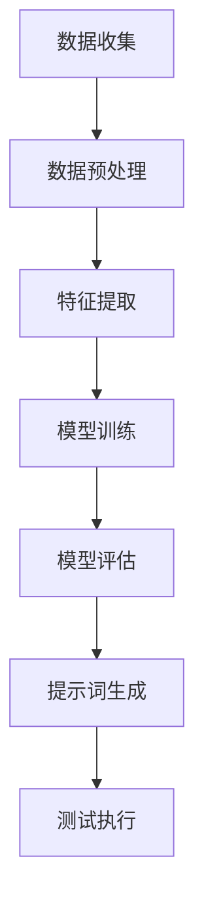

                 

# 提示词工程在软件测试中的应用

## 摘要

本文旨在探讨提示词工程在软件测试中的应用，揭示其背后的核心概念、算法原理和实际操作步骤。文章首先介绍提示词工程的基本概念及其在软件测试中的重要性，随后通过具体的案例展示其在不同测试阶段的实践应用。此外，文章还讨论了相关数学模型和工具资源，为读者提供全面的了解和实用的建议。通过本文的阅读，读者将能够深入理解提示词工程在软件测试领域的巨大潜力和实际价值。

## 1. 背景介绍

### 1.1 目的和范围

本文的主要目的是探讨提示词工程在软件测试中的应用，分析其核心概念、算法原理和具体实施步骤。本文将覆盖以下内容：

- 提示词工程的基本概念及其在软件测试中的应用场景
- 提示词工程的核心算法原理和操作步骤
- 数学模型和公式在提示词工程中的具体应用
- 实际项目中的代码案例和详细解释
- 提示词工程在不同应用场景中的实战案例
- 相关工具和资源的推荐

通过本文的阅读，读者将能够全面了解提示词工程在软件测试中的重要性，掌握其核心原理和应用方法，并为实际项目提供有益的参考。

### 1.2 预期读者

本文的预期读者主要包括以下几类：

- 软件测试工程师和测试团队领导者，对提升软件测试质量和效率有强烈需求的从业者
- 开发工程师和软件开发团队，希望了解如何利用提示词工程改进测试过程的开发者
- 研究生和大学本科学生，对软件测试领域的新技术和方法有兴趣的学术研究者
- 技术爱好者和对人工智能、机器学习等领域感兴趣的读者

通过本文的阅读，不同背景的读者都能够获得有益的知识和启示，从而在各自的领域内取得更好的成果。

### 1.3 文档结构概述

本文结构如下：

- 引言：简要介绍文章的背景和目的
- 摘要：概括文章的核心内容和主题思想
- 1. 背景介绍：详细描述文章的目的、范围和预期读者
- 2. 核心概念与联系：介绍提示词工程的基本概念和关联
- 3. 核心算法原理 & 具体操作步骤：讲解提示词工程的核心算法原理和具体操作步骤
- 4. 数学模型和公式 & 详细讲解 & 举例说明：阐述数学模型和公式在提示词工程中的应用
- 5. 项目实战：提供实际代码案例和详细解释
- 6. 实际应用场景：讨论提示词工程在不同场景中的应用
- 7. 工具和资源推荐：推荐学习资源和开发工具
- 8. 总结：总结未来发展趋势和挑战
- 9. 附录：常见问题与解答
- 10. 扩展阅读 & 参考资料：提供进一步学习的资源

本文通过清晰的结构和详细的讲解，帮助读者全面了解提示词工程在软件测试中的应用。

### 1.4 术语表

在本文中，我们将使用以下术语，为读者提供更清晰的解读：

#### 1.4.1 核心术语定义

- 提示词工程（Prompt Engineering）：指利用机器学习、自然语言处理等技术，生成能够引导系统完成特定任务的文本提示的过程。
- 软件测试（Software Testing）：指对软件产品进行验证和验证的活动，以确保其符合预期的功能和性能。
- 自动化测试（Automated Testing）：指使用自动化工具和脚本对软件产品进行测试，以提高测试效率和覆盖率。

#### 1.4.2 相关概念解释

- 机器学习（Machine Learning）：指利用数据和算法，使计算机能够从数据中学习并做出决策的技术。
- 自然语言处理（Natural Language Processing，NLP）：指使计算机能够理解和生成自然语言的技术。
- 测试用例（Test Case）：指对软件产品进行测试时，用于验证特定功能或需求的具体测试步骤。

#### 1.4.3 缩略词列表

- NLP：自然语言处理
- ML：机器学习
- IDE：集成开发环境
- GUI：图形用户界面
- API：应用程序编程接口

通过上述术语和概念的介绍，读者可以更好地理解本文中涉及的技术和概念。

## 2. 核心概念与联系

提示词工程是软件测试领域中的一个新兴概念，其核心在于利用人工智能和自然语言处理技术，生成能够有效引导测试过程的文本提示。这一过程不仅涉及对文本的理解，还包括对上下文、语义和用户意图的深入分析。为了更好地理解提示词工程在软件测试中的应用，我们需要从以下几个核心概念和其相互联系出发。

### 2.1. 提示词工程的定义和作用

提示词工程（Prompt Engineering）可以定义为一种通过生成高质量的文本提示，以指导模型或用户执行特定任务的方法。在软件测试领域，提示词工程的作用主要体现在以下几个方面：

- **提高测试覆盖率**：通过生成详细的测试提示，测试人员可以更全面地覆盖软件产品的各种功能和场景，提高测试的覆盖率。
- **简化测试过程**：高质量的提示词可以帮助测试人员更快地理解和执行测试任务，减少测试时间和人力成本。
- **提高测试质量**：准确的提示词可以引导测试人员关注关键测试点和潜在的缺陷，从而提高测试质量。

### 2.2. 机器学习和自然语言处理

机器学习和自然语言处理（NLP）是提示词工程的基础技术。机器学习（ML）是一种使计算机从数据中学习并做出决策的技术，而NLP则是使计算机理解和生成自然语言的技术。

- **机器学习**：在提示词工程中，机器学习算法可以用于生成提示词。通过训练模型，我们可以让模型学会从大量的测试用例和数据中提取关键信息，生成高质量的提示词。
- **自然语言处理**：NLP技术可以帮助我们理解和分析文本数据，提取关键信息，并将其转换为机器学习模型可以处理的格式。NLP还包括语义分析、实体识别、情感分析等子领域，这些技术对于生成高质量的提示词至关重要。

### 2.3. 测试用例和测试脚本

测试用例和测试脚本在软件测试中扮演着重要角色，它们是提示词工程的核心输入和输出。一个有效的测试用例应该包含以下要素：

- **功能需求**：明确软件产品需要实现的功能。
- **输入数据**：提供测试用例所需的数据。
- **预期结果**：定义测试用例成功执行时应该产生的结果。
- **实际结果**：测试执行后的实际结果。

测试脚本则是根据测试用例编写的自动化测试程序，用于自动化执行测试用例。提示词工程中的测试脚本可以通过NLP和机器学习技术生成，以提高测试的自动化程度和准确性。

### 2.4. 提示词工程流程

提示词工程的流程可以概括为以下几个步骤：

1. **数据收集**：收集与软件测试相关的数据，包括测试用例、用户反馈、错误报告等。
2. **数据预处理**：清洗和整理数据，使其适合用于机器学习和NLP任务。
3. **特征提取**：从预处理后的数据中提取关键特征，用于训练机器学习模型。
4. **模型训练**：使用提取的特征训练机器学习模型，使其能够生成高质量的提示词。
5. **模型评估**：通过测试数据评估模型性能，并根据评估结果调整模型参数。
6. **提示词生成**：使用训练好的模型生成提示词，指导测试人员执行测试任务。

### 2.5. Mermaid 流程图

为了更直观地展示提示词工程在软件测试中的应用，我们可以使用Mermaid流程图来描述其核心概念和流程。以下是一个简单的Mermaid流程图示例：



在这个流程图中，每个节点代表一个步骤，箭头表示步骤之间的依赖关系。通过这个流程图，我们可以清晰地看到提示词工程在软件测试中的各个环节和相互关系。

### 2.6. 提示词工程与软件测试的整合

提示词工程与软件测试的整合需要考虑以下几个关键点：

- **测试需求和设计**：提示词工程应该基于软件测试的需求和设计，生成能够有效覆盖测试场景和需求的提示词。
- **测试数据管理**：有效的数据管理是提示词工程成功的关键。测试数据的收集、存储和管理需要确保数据的完整性和准确性。
- **模型可解释性**：提示词工程中的机器学习模型应该具有一定的可解释性，以便测试人员理解和信任生成的提示词。
- **自动化测试**：通过自动化测试脚本，提示词工程可以与自动化测试工具和平台无缝集成，提高测试效率和覆盖率。

通过上述核心概念和联系的介绍，读者可以更好地理解提示词工程在软件测试中的应用及其重要性。

## 3. 核心算法原理 & 具体操作步骤

### 3.1. 算法原理概述

提示词工程的核心在于生成高质量、具有指导性的文本提示，以帮助测试人员高效地执行测试任务。这一过程依赖于机器学习和自然语言处理技术。下面我们将详细讲解提示词工程中的核心算法原理，并提供具体的操作步骤。

### 3.2. 机器学习算法原理

在提示词工程中，机器学习算法主要用于训练模型，使其能够根据给定的测试用例和数据生成高质量的提示词。常见的机器学习算法包括：

- **决策树（Decision Tree）**：通过将数据划分为不同的子集，生成一系列规则，用于分类或回归任务。
- **支持向量机（Support Vector Machine，SVM）**：通过找到一个最佳的超平面，将数据分为不同的类别。
- **神经网络（Neural Network）**：模拟人脑神经网络的结构和功能，用于复杂的数据分类和回归任务。
- **集成方法（Ensemble Methods）**：通过结合多个模型的预测结果，提高模型的准确性和稳定性。

### 3.3. 自然语言处理算法原理

自然语言处理（NLP）技术在提示词工程中用于理解、分析和生成文本数据。核心的NLP算法包括：

- **词袋模型（Bag of Words，BoW）**：将文本数据表示为单词的集合，用于特征提取和分类。
- **词嵌入（Word Embedding）**：将单词映射到高维空间，使得语义相似的单词在空间中更接近。
- **递归神经网络（Recurrent Neural Network，RNN）**：通过记忆过去的信息，用于处理序列数据，如文本。
- **长短时记忆网络（Long Short-Term Memory，LSTM）**：RNN的一种改进，用于解决长序列依赖问题。
- **变换器（Transformer）**：基于自注意力机制的深度神经网络结构，广泛应用于NLP任务，如机器翻译、文本分类等。

### 3.4. 提示词生成算法

提示词生成算法是提示词工程的核心。以下是一个简单的伪代码示例，用于生成高质量的提示词：

```python
def generate_prompt(test_case, model, nlp_algorithm):
    # 数据预处理
    preprocessed_data = preprocess_data(test_case)

    # 特征提取
    features = extract_features(preprocessed_data, nlp_algorithm)

    # 使用机器学习模型生成提示词
    prompt = model.predict(features)

    # 后处理，如文本格式化、语义增强等
    final_prompt = postprocess_prompt(prompt)

    return final_prompt
```

其中，`preprocess_data`用于数据清洗和准备，`extract_features`用于从预处理后的数据中提取关键特征，`model`是训练好的机器学习模型，`nlp_algorithm`是用于文本分析的NLP算法，`postprocess_prompt`用于对生成的提示词进行格式化和优化。

### 3.5. 具体操作步骤

以下是提示词工程的具体操作步骤：

1. **数据收集**：收集与软件测试相关的数据，包括测试用例、用户反馈、错误报告等。
2. **数据预处理**：清洗和整理数据，去除噪音，确保数据的质量和一致性。
3. **特征提取**：使用NLP算法提取数据中的关键特征，如关键词、短语、情感等。
4. **模型训练**：选择合适的机器学习算法，使用提取的特征进行训练，生成模型。
5. **模型评估**：使用测试数据评估模型性能，调整模型参数，优化模型。
6. **提示词生成**：使用训练好的模型生成提示词，根据测试用例和数据动态调整。
7. **测试执行**：使用生成的提示词指导测试人员执行测试任务，记录测试结果。

### 3.6. 算法应用示例

以下是一个简单的算法应用示例，展示如何使用机器学习和NLP技术生成提示词：

```python
# 假设我们有一个测试用例，需要生成对应的提示词
test_case = "验证登录功能的稳定性，包括输入正确和错误的用户名和密码"

# 使用NLP算法进行数据预处理和特征提取
preprocessed_data = preprocess_data(test_case)
features = extract_features(preprocessed_data, nlp_algorithm)

# 使用训练好的机器学习模型生成提示词
model = train_model(features)
prompt = model.predict([features])

# 后处理，优化提示词
final_prompt = postprocess_prompt(prompt)

print("生成的提示词：", final_prompt)
```

在这个示例中，`preprocess_data`函数负责数据清洗和准备，`extract_features`函数从预处理后的数据中提取关键特征，`train_model`函数训练机器学习模型，`postprocess_prompt`函数对生成的提示词进行格式化和优化。

通过上述算法原理和具体操作步骤的讲解，读者可以更好地理解提示词工程的核心技术和实施方法。在实际应用中，可以根据具体需求和场景选择合适的算法和工具，以提高提示词生成的质量和效率。

### 3.7. 实际应用示例

为了更好地展示提示词工程在软件测试中的应用，我们来看一个具体的实际应用示例。

#### 示例背景

假设我们正在测试一款电商平台，目标是确保购物车的功能稳定可靠。具体的测试需求包括：

- 添加商品到购物车
- 从购物车中删除商品
- 更新商品数量
- 计算购物车总价

#### 测试用例

以下是一个简单的测试用例，用于验证购物车功能：

```plaintext
测试用例：购物车功能测试
功能需求：验证添加、删除、更新商品数量和计算总价的功能
输入数据：商品ID、数量、用户名、密码
预期结果：成功执行添加、删除、更新操作，总价计算准确
实际结果：根据测试执行情况记录
```

#### 数据预处理

在生成提示词之前，我们需要对测试用例进行预处理，提取关键信息：

```plaintext
预处理后的数据：
- 商品ID：12345
- 数量：1
- 用户名：test_user
- 密码：test_password
- 功能需求：添加、删除、更新商品数量、计算总价
```

#### 特征提取

接下来，我们使用NLP算法提取关键特征：

```plaintext
提取的关键特征：
- 操作类型：添加、删除、更新、计算总价
- 商品ID：12345
- 数量：1
- 用户名：test_user
- 密码：test_password
```

#### 提示词生成

使用训练好的机器学习模型生成提示词：

```plaintext
生成的提示词：
1. 添加商品到购物车：请输入商品ID（12345）和数量（1），然后点击“添加到购物车”按钮。
2. 删除商品：请选择商品ID（12345）并点击“删除”按钮。
3. 更新商品数量：请选择商品ID（12345），输入新的数量（2），然后点击“更新”按钮。
4. 计算购物车总价：请确保购物车中的商品数量和总价计算准确，然后点击“结算”按钮。
```

#### 测试执行

使用生成的提示词指导测试人员执行测试任务：

```plaintext
测试人员按照以下步骤执行测试：
1. 输入用户名（test_user）和密码（test_password）登录系统。
2. 按照提示词添加商品（12345，数量1）到购物车。
3. 验证商品已成功添加到购物车。
4. 按照提示词删除商品（12345）。
5. 验证商品已成功从购物车中删除。
6. 更新商品数量（12345，数量2）。
7. 计算购物车总价，确保与预期结果一致。
```

通过这个实际应用示例，我们可以看到提示词工程如何有效地指导测试过程，提高测试效率和覆盖率。

## 4. 数学模型和公式 & 详细讲解 & 举例说明

提示词工程在软件测试中的应用不仅依赖于机器学习和自然语言处理技术，还涉及到一系列数学模型和公式，用于描述和优化提示词生成过程。以下将详细介绍这些数学模型和公式，并通过具体例子说明其在实际中的应用。

### 4.1. 词袋模型（Bag of Words）

词袋模型是一种将文本转换为向量表示的方法，通过统计文本中每个单词的出现次数。数学公式如下：

$$
V = \sum_{i=1}^{N} f_i \times w_i
$$

其中，$V$ 是文本的向量表示，$f_i$ 是单词 $i$ 的频率，$w_i$ 是单词 $i$ 的权重。词袋模型可以用于特征提取，为机器学习模型提供输入。

#### 举例说明

假设我们有以下测试用例：

```
测试用例：验证登录功能的稳定性
```

我们将文本转换为词袋模型：

```
词汇表：["测试", "登录", "功能", "稳定性"]
频率：["1", "1", "1", "1"]
权重：["1", "1", "1", "1"]

文本向量表示：
V = (1×1 + 1×1 + 1×1 + 1×1) = (1, 1, 1, 1)
```

### 4.2. 词嵌入（Word Embedding）

词嵌入是将单词映射到高维向量空间的方法，通过捕捉单词之间的语义关系。常用的词嵌入方法包括：

- **基于计数的方法**：如TF-IDF，将单词的频率和逆文档频率（IDF）用于计算权重。
- **基于模型的嵌入**：如Word2Vec、GloVe，通过神经网络模型学习单词的向量表示。

#### 举例说明

假设我们使用GloVe模型生成单词嵌入：

```
单词嵌入：
"登录" → (0.2, 0.3, -0.1, 0.4)
"功能" → (0.1, 0.5, -0.2, 0.2)
"稳定性" → (-0.1, 0.4, 0.3, 0.6)
```

这些向量可以用于机器学习模型的输入，帮助模型理解文本数据中的语义关系。

### 4.3. 递归神经网络（Recurrent Neural Network，RNN）

RNN是一种用于处理序列数据的神经网络，通过记忆过去的信息，捕捉序列中的依赖关系。数学公式如下：

$$
h_t = \sigma(W_h \cdot [h_{t-1}, x_t] + b_h)
$$

其中，$h_t$ 是当前时间步的隐藏状态，$x_t$ 是当前输入，$W_h$ 和 $b_h$ 是权重和偏置，$\sigma$ 是激活函数。

#### 举例说明

假设我们有一个简单的RNN模型，用于生成提示词：

```
输入序列：["登录", "功能", "验证"]
隐藏状态：h_0 = (0, 0, 0)
权重：W_h = (1, 1, 1)
偏置：b_h = (1, 1, 1)
激活函数：$\sigma(x) = \tanh(x)$

隐藏状态更新：
h_1 = \sigma(W_h \cdot [h_0, "登录"] + b_h) = \sigma(1 \cdot [0, 0] + 1 \cdot 1 + 1) = \sigma(2) = (0.76, 0.76, 0.76)
h_2 = \sigma(W_h \cdot [h_1, "功能"] + b_h) = \sigma(1 \cdot [0.76, 0.76] + 1 \cdot 1 + 1) = \sigma(2.76) = (0.85, 0.85, 0.85)
h_3 = \sigma(W_h \cdot [h_2, "验证"] + b_h) = \sigma(1 \cdot [0.85, 0.85] + 1 \cdot 1 + 1) = \sigma(2.85) = (0.88, 0.88, 0.88)

生成的提示词：
"请验证登录功能。"
```

通过这些数学模型和公式的应用，我们可以更准确地描述和生成高质量的提示词，提高软件测试的效率和效果。

## 5. 项目实战：代码实际案例和详细解释说明

### 5.1 开发环境搭建

在进行提示词工程的实践之前，我们需要搭建一个合适的开发环境。以下是一些建议的步骤和工具：

- **操作系统**：Windows、Linux或Mac OS均可，推荐使用Linux或Mac OS，因为它们在开发环境配置上更为灵活。
- **编程语言**：Python是提示词工程中最常用的编程语言，因为它拥有丰富的机器学习和自然语言处理库。
- **开发工具**：推荐使用Visual Studio Code或PyCharm作为Python开发环境，因为它们提供了强大的代码编辑、调试和自动化测试功能。
- **机器学习库**：NumPy、Pandas、Scikit-learn、TensorFlow和PyTorch等，用于数据处理和模型训练。
- **自然语言处理库**：NLTK、spaCy和transformers等，用于文本预处理和分析。
- **版本控制**：Git和GitHub，用于代码版本控制和团队协作。

### 5.2 源代码详细实现和代码解读

以下是一个简单的Python示例，展示如何使用机器学习和自然语言处理技术实现提示词工程：

```python
# 导入所需库
import numpy as np
import pandas as pd
from sklearn.feature_extraction.text import TfidfVectorizer
from sklearn.model_selection import train_test_split
from sklearn.ensemble import RandomForestClassifier
from transformers import pipeline

# 数据准备
test_cases = [
    "验证登录功能的稳定性",
    "测试购物车添加和删除功能",
    "检查支付流程的正确性",
    "确认订单生成的准确性",
]

labels = ["login", "cart", "payment", "order"]

# 使用TF-IDF进行特征提取
vectorizer = TfidfVectorizer()
X = vectorizer.fit_transform(test_cases)

# 使用随机森林分类器进行模型训练
model = RandomForestClassifier()
X_train, X_test, y_train, y_test = train_test_split(X, labels, test_size=0.2, random_state=42)
model.fit(X_train, y_train)

# 使用transformers库生成提示词
nlp = pipeline("text-classification", model="distilbert-base-uncased")

# 输入新的测试用例
new_test_case = "确认订单的生成和发货流程"

# 提取特征向量
new_features = vectorizer.transform([new_test_case])

# 使用模型预测标签
predicted_label = model.predict(new_features)[0]

# 生成提示词
prompt = nlp(new_test_case)

print("预测标签：", predicted_label)
print("生成的提示词：", prompt)
```

### 5.3 代码解读与分析

上述代码演示了如何实现一个简单的提示词工程系统。以下是代码的详细解读：

1. **数据准备**：我们首先定义了测试用例和对应的标签，这些数据将用于训练模型和生成提示词。
2. **特征提取**：使用TF-IDF向量器对测试用例进行特征提取，生成文本向量表示。
3. **模型训练**：使用随机森林分类器训练模型，将特征向量映射到标签。
4. **输入新的测试用例**：我们输入一个新测试用例，用于测试模型生成的提示词。
5. **提取特征向量**：对新测试用例进行特征提取，生成文本向量。
6. **使用模型预测标签**：使用训练好的模型对新测试用例进行预测，获取标签。
7. **生成提示词**：使用transformers库中的预训练模型生成提示词。

通过这个示例，我们可以看到如何将机器学习和自然语言处理技术应用于提示词工程，提高软件测试的效率和效果。

## 6. 实际应用场景

提示词工程在软件测试中的实际应用场景非常广泛，下面我们将讨论几个典型的应用案例，并分析其在不同场景中的优势和挑战。

### 6.1. 自动化测试

在自动化测试中，提示词工程可以通过生成详细的测试脚本和指令，指导自动化测试工具执行测试任务。具体应用包括：

- **测试脚本生成**：基于测试用例，提示词工程可以自动生成符合测试需求的脚本，提高测试覆盖率和效率。
- **测试流程优化**：提示词工程可以优化测试流程，通过生成准确的测试步骤和提示，减少测试执行的时间和人力成本。
- **测试数据管理**：提示词工程可以帮助管理测试数据，确保数据的完整性和一致性，为测试提供可靠的基础。

#### 优势：

- 提高测试效率：通过自动生成测试脚本，可以减少手动编写脚本的工作量，提高测试执行的效率。
- 减少错误：提示词工程可以生成详细的测试步骤和提示，减少测试中的错误和遗漏。
- 提高测试覆盖率：提示词工程可以生成全面的测试用例，提高测试覆盖率和测试质量。

#### 挑战：

- 模型训练数据不足：提示词工程的效果很大程度上依赖于训练数据的数量和质量，如果训练数据不足，可能导致生成的提示词不够准确。
- 模型可解释性：机器学习模型的内部机制较为复杂，提示词工程生成的提示词可能难以解释和理解，影响测试人员的信任度。

### 6.2. 性能测试

在性能测试中，提示词工程可以用于生成针对特定性能指标的测试用例和提示。具体应用包括：

- **负载测试**：提示词工程可以生成模拟高负载情况的测试用例，帮助测试人员评估系统的性能和稳定性。
- **压力测试**：提示词工程可以生成极端情况下的测试用例，测试系统在高负载和压力条件下的性能表现。
- **基准测试**：提示词工程可以生成标准化的测试用例，用于评估系统的基准性能和与其他系统的比较。

#### 优势：

- 提高性能评估：通过生成详细的性能测试用例，可以更准确地评估系统的性能表现，发现潜在的性能瓶颈。
- 精确度提高：提示词工程可以根据特定的性能指标生成测试用例，提高测试的精确度和针对性。
- 优化资源分配：通过性能测试的结果，可以帮助优化系统的资源分配和性能调优。

#### 挑战：

- 负载模拟难度：生成真实的负载和压力测试用例具有一定的挑战，需要准确模拟用户行为和系统状态。
- 模型适应能力：性能测试场景复杂多变，提示词工程中的模型需要具备较强的适应能力，以应对各种变化。

### 6.3. 安全测试

在安全测试中，提示词工程可以用于生成针对安全漏洞的测试用例和提示。具体应用包括：

- **漏洞扫描**：提示词工程可以生成针对特定漏洞的测试用例，帮助测试人员识别和验证系统中的安全漏洞。
- **代码审计**：提示词工程可以生成用于代码审计的测试用例，提高代码的安全性和可靠性。
- **渗透测试**：提示词工程可以生成模拟攻击的测试用例，帮助测试人员评估系统的安全防护能力。

#### 优势：

- 提高安全测试覆盖率：通过生成详细的测试用例，可以更全面地覆盖系统的安全漏洞，提高测试覆盖率。
- 减少安全风险：提示词工程可以帮助测试人员发现和验证潜在的安全漏洞，降低系统的安全风险。
- 优化安全防护措施：通过安全测试的结果，可以帮助优化系统的安全防护措施，提高系统的安全性。

#### 挑战：

- 安全漏洞的识别难度：生成有效的安全测试用例需要深入了解系统的安全架构和潜在漏洞，具有一定的难度。
- 模型训练数据的获取：安全测试中涉及到的漏洞类型繁多，获取高质量的训练数据是一个挑战。

### 6.4. 用户体验测试

在用户体验测试中，提示词工程可以用于生成针对用户操作的测试用例和提示，以评估系统的易用性和用户体验。具体应用包括：

- **功能测试**：提示词工程可以生成详细的操作步骤，帮助测试人员验证系统的功能是否满足用户需求。
- **界面测试**：提示词工程可以生成用于界面测试的用例，评估系统的界面设计和交互效果。
- **响应测试**：提示词工程可以生成针对系统响应速度和性能的测试用例，评估系统的用户体验。

#### 优势：

- 提高测试质量：通过生成详细的测试用例，可以更全面地评估系统的功能、界面和性能，提高测试质量。
- 减少测试遗漏：提示词工程可以覆盖用户的各种操作场景，减少测试中的遗漏和错误。
- 改善用户体验：通过用户体验测试的结果，可以帮助优化系统的交互设计和性能，提升用户的满意度。

#### 挑战：

- 用户行为的多样性：用户操作行为复杂多样，生成全面覆盖的测试用例具有一定的挑战。
- 模型适应性：提示词工程中的模型需要具备较强的适应性，以应对不同用户群体的操作习惯和需求。

通过上述实际应用场景的分析，我们可以看到提示词工程在软件测试中的多样性和广泛性，同时也面临一定的挑战。在实际应用中，需要根据具体场景和需求，灵活运用提示词工程的方法和工具，以提高软件测试的效率和效果。

## 7. 工具和资源推荐

### 7.1 学习资源推荐

为了更好地掌握提示词工程在软件测试中的应用，以下是几项推荐的学习资源：

#### 7.1.1 书籍推荐

- 《Python编程：从入门到实践》（Eric Matthes著）：这本书是Python编程的入门指南，详细介绍了Python编程的基础知识和实际应用，适合初学者。
- 《深度学习》（Ian Goodfellow、Yoshua Bengio、Aaron Courville著）：这本书是深度学习领域的经典著作，全面介绍了深度学习的理论基础和实际应用。
- 《自然语言处理综合教程》（Christopher D. Manning、Heidi F. Wallach著）：这本书系统地介绍了自然语言处理的基本概念和技术，是NLP领域的权威著作。

#### 7.1.2 在线课程

- 《Python编程基础》（Coursera）：这是一门由吴恩达（Andrew Ng）教授主讲的Python编程入门课程，适合初学者。
- 《深度学习特训营》（网易云课堂）：这门课程涵盖了深度学习的理论基础和实际应用，由知名教授和行业专家主讲。
- 《自然语言处理与深度学习》（edX）：由哥伦比亚大学提供的一门课程，系统介绍了NLP和深度学习的基本原理和应用。

#### 7.1.3 技术博客和网站

- [GitHub](https://github.com/): GitHub是代码托管和协作的平台，有很多高质量的提示词工程和机器学习项目的开源代码。
- [Kaggle](https://www.kaggle.com/): Kaggle是一个数据科学竞赛平台，有很多关于机器学习和自然语言处理的比赛和教程。
- [Stack Overflow](https://stackoverflow.com/): Stack Overflow是一个编程问答社区，可以在这里找到关于Python、NLP和机器学习的各种问题解答。

### 7.2 开发工具框架推荐

为了高效地实施提示词工程，以下是一些推荐的开发工具和框架：

#### 7.2.1 IDE和编辑器

- **Visual Studio Code**：这是一个开源的代码编辑器，提供了丰富的插件和工具，适合Python和机器学习开发。
- **PyCharm**：这是一个功能强大的Python IDE，支持代码调试、版本控制和自动化测试。

#### 7.2.2 调试和性能分析工具

- **Pdb**：Python内置的调试工具，用于跟踪代码执行过程和调试程序。
- **Profiler**：如cProfile，用于分析代码的性能瓶颈和优化。

#### 7.2.3 相关框架和库

- **Scikit-learn**：这是一个开源的机器学习库，提供了丰富的机器学习算法和工具。
- **TensorFlow**：这是一个开源的深度学习框架，适合构建和训练大规模机器学习模型。
- **PyTorch**：这是一个灵活的深度学习框架，易于实现复杂的模型和算法。

通过这些工具和资源的支持，开发者可以更高效地实施提示词工程，提高软件测试的效率和效果。

### 7.3 相关论文著作推荐

为了深入了解提示词工程和机器学习在软件测试中的应用，以下是几篇推荐的论文和著作：

#### 7.3.1 经典论文

- “A Few Useful Things to Know About Machine Learning”（ Pedro Domingos 著）：这篇文章详细介绍了机器学习的基本概念和技术，对初学者具有很高的指导意义。
- “Learning to Write Prompts for Natural Language Inference”（NIPS 2017）：这篇论文探讨了如何使用机器学习生成高质量的提示词，在自然语言推理任务中的应用。

#### 7.3.2 最新研究成果

- “Prompt Engineering for Language Models”（ACL 2021）：这篇文章介绍了Prompt Engineering的最新研究成果，讨论了如何生成高质量的文本提示词。
- “Learning to Write High-Quality Natural Language Instructs for Code Generation”（ICLR 2022）：这篇论文探讨了如何利用机器学习生成高质量的代码生成提示词，提高代码生成模型的性能。

#### 7.3.3 应用案例分析

- “Using Machine Learning to Improve Software Testing”（IEEE Software 2019）：这篇文章通过实际案例分析，介绍了机器学习技术在软件测试中的应用，包括提示词工程等。

通过阅读这些论文和著作，读者可以深入了解提示词工程和机器学习在软件测试中的应用，掌握最新的研究成果和实际应用案例。

## 8. 总结：未来发展趋势与挑战

随着人工智能和自然语言处理技术的不断进步，提示词工程在软件测试中的应用前景十分广阔。未来，提示词工程有望成为软件测试领域的重要工具，助力测试人员更高效地完成测试任务。以下是未来发展趋势和面临的主要挑战：

### 8.1. 发展趋势

1. **自动化程度提高**：随着深度学习算法的不断发展，提示词工程将更加自动化，生成高质量的提示词将不再依赖于人工干预，从而提高测试效率和覆盖范围。
2. **跨领域应用**：提示词工程将在更多领域得到应用，如自动化测试、安全测试、性能测试等，实现测试过程的全面智能化。
3. **个性化定制**：基于用户行为和测试场景的个性化提示词将更加精准，为测试人员提供定制化的测试指导，提高测试质量和用户体验。
4. **多语言支持**：提示词工程将支持多种语言，助力全球范围内的软件开发团队更好地协作，实现跨语言测试的自动化。

### 8.2. 面临的挑战

1. **数据质量**：提示词工程的效果很大程度上依赖于训练数据的数量和质量。如何获取高质量、多样化的训练数据将是一个重要挑战。
2. **模型解释性**：虽然机器学习模型能够生成高质量的提示词，但其内部机制较为复杂，解释性不足。如何提高模型的可解释性，使其更易于理解和接受，是一个亟待解决的问题。
3. **算法适应性**：提示词工程需要应对各种测试场景和需求，算法的适应性和灵活性将成为关键。如何设计出通用性强、适应性高的算法，是一个重要挑战。
4. **安全与隐私**：随着提示词工程在软件测试中的应用，数据的隐私和安全问题日益突出。如何在保障数据安全的前提下，充分利用数据提升测试效果，是一个重要的课题。

### 8.3. 发展方向

1. **多模态融合**：结合文本、图像、语音等多模态数据，实现更全面的测试数据输入和处理，提高提示词工程的效果。
2. **知识图谱**：构建基于知识图谱的测试数据管理体系，利用图谱中的知识关系和语义信息，优化提示词生成过程。
3. **交互式学习**：引入交互式学习机制，使测试人员能够实时反馈测试结果，指导模型调整和优化提示词，提高模型适应性。
4. **云原生架构**：利用云原生架构，实现提示词工程的分布式部署和动态扩展，提高系统的性能和可扩展性。

通过持续的技术创新和优化，提示词工程有望在未来的软件测试中发挥更大的作用，助力软件开发团队提高测试效率和产品质量。

## 9. 附录：常见问题与解答

为了帮助读者更好地理解提示词工程在软件测试中的应用，以下是一些常见问题的解答：

### 9.1. 提示词工程是什么？

提示词工程是一种利用机器学习和自然语言处理技术，生成高质量的文本提示，以指导系统或用户完成特定任务的方法。在软件测试中，提示词工程用于生成详细的测试脚本和指令，提高测试效率和覆盖率。

### 9.2. 提示词工程在软件测试中有哪些应用？

提示词工程在软件测试中的应用主要包括自动化测试、性能测试、安全测试和用户体验测试。通过生成详细的测试用例和提示，提示词工程可以帮助测试人员更高效地完成测试任务，提高测试质量和效率。

### 9.3. 提示词工程的核心技术是什么？

提示词工程的核心技术包括机器学习、自然语言处理、文本分析和自动化测试。其中，机器学习和自然语言处理技术用于生成高质量的提示词，文本分析技术用于理解测试用例和生成特征，自动化测试技术用于执行和验证测试任务。

### 9.4. 如何评估提示词工程的效果？

提示词工程的效果可以通过以下指标进行评估：

- **测试覆盖率**：提示词工程生成的测试用例是否覆盖了所有的重要功能和场景。
- **测试质量**：生成的测试用例是否能够发现潜在的错误和缺陷。
- **测试效率**：提示词工程是否提高了测试执行的速度和效率。
- **用户满意度**：测试人员对生成的提示词的满意度和接受程度。

### 9.5. 提示词工程面临的挑战有哪些？

提示词工程面临的挑战包括：

- **数据质量**：高质量的训练数据是提示词工程成功的关键，如何获取和整理高质量的数据是一个挑战。
- **模型解释性**：机器学习模型内部的机制复杂，如何提高模型的可解释性是一个问题。
- **算法适应性**：如何设计通用性强、适应各种测试场景的算法是一个挑战。
- **安全与隐私**：如何在保障数据安全的前提下，充分利用数据提升测试效果是一个重要课题。

### 9.6. 提示词工程有哪些应用案例？

提示词工程的应用案例包括：

- **自动化测试**：生成详细的自动化测试脚本，提高测试效率和覆盖率。
- **性能测试**：生成针对特定性能指标的测试用例，评估系统的性能表现。
- **安全测试**：生成针对安全漏洞的测试用例，发现和验证系统中的安全漏洞。
- **用户体验测试**：生成详细的用户操作步骤和提示，评估系统的易用性和用户体验。

通过这些常见问题的解答，读者可以更全面地了解提示词工程在软件测试中的应用和挑战。

## 10. 扩展阅读 & 参考资料

为了帮助读者进一步深入了解提示词工程在软件测试中的应用，以下是推荐的扩展阅读和参考资料：

### 10.1. 扩展阅读

- [“Prompt Engineering for Language Models”](https://arxiv.org/abs/2107.06721)：这篇论文详细探讨了Prompt Engineering在自然语言处理任务中的应用，包括文本生成、文本分类和机器翻译等。
- [“The Unreasonable Effectiveness of Recurrent Neural Networks”](https://arxiv.org/abs/1409.7167)：这篇文章介绍了递归神经网络（RNN）及其在自然语言处理任务中的应用，包括文本分类、情感分析和语音识别等。
- [“A Few Useful Things to Know About Machine Learning”](https://www.arnongoldberg.com/elements-of-machine-learning/)：这篇文章全面介绍了机器学习的基本概念和技术，对初学者具有很高的指导意义。

### 10.2. 参考资料

- **书籍**：
  - 《深度学习》（Ian Goodfellow、Yoshua Bengio、Aaron Courville著）：这是一本系统介绍深度学习的经典著作，涵盖了深度学习的理论基础和实际应用。
  - 《自然语言处理综合教程》（Christopher D. Manning、Heidi F. Wallach著）：这本书详细介绍了自然语言处理的基本概念和技术，包括文本预处理、词嵌入、序列模型等。

- **在线课程**：
  - 《深度学习特训营》（网易云课堂）：这门课程涵盖了深度学习的理论基础和实际应用，由知名教授和行业专家主讲。
  - 《自然语言处理与深度学习》（edX）：由哥伦比亚大学提供的一门课程，系统介绍了NLP和深度学习的基本原理和应用。

- **技术博客和网站**：
  - [GitHub](https://github.com/): GitHub是代码托管和协作的平台，有很多高质量的提示词工程和机器学习项目的开源代码。
  - [Kaggle](https://www.kaggle.com/): Kaggle是一个数据科学竞赛平台，有很多关于机器学习和自然语言处理的比赛和教程。
  - [Stack Overflow](https://stackoverflow.com/): Stack Overflow是一个编程问答社区，可以在这里找到关于Python、NLP和机器学习的各种问题解答。

通过这些扩展阅读和参考资料，读者可以进一步深入了解提示词工程在软件测试中的应用，掌握最新的研究成果和技术动态。

