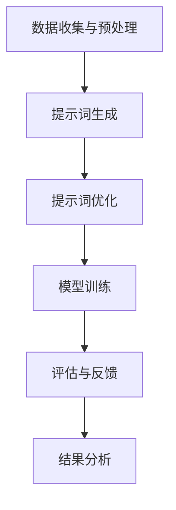

                 

# 提示词工程在领域特定AI中的应用

> 关键词：提示词工程、领域特定AI、自然语言处理、模型训练、优化方法

> 摘要：本文旨在探讨提示词工程在领域特定人工智能（AI）中的应用。我们将逐步分析提示词工程的核心概念、算法原理、数学模型，并通过实际项目实战，展示其在自然语言处理任务中的具体实现和效果。文章还提供了相关的学习资源、开发工具和最新研究成果，以期为读者提供全面的了解和指导。

## 1. 背景介绍

### 1.1 目的和范围

本文的目的是介绍和探讨提示词工程在领域特定人工智能中的应用。随着人工智能技术的不断发展，自然语言处理（NLP）在各个领域的应用越来越广泛。提示词工程作为一种关键技术，旨在提高模型在特定领域的性能和准确性。本文将围绕以下几个方面展开：

1. 提示词工程的核心概念和原理。
2. 提示词工程在自然语言处理中的应用场景。
3. 提示词工程的优化方法和数学模型。
4. 实际项目实战中的实现和效果分析。
5. 相关学习资源、开发工具和最新研究成果。

### 1.2 预期读者

本文面向具有一定人工智能和自然语言处理基础的技术人员和研究学者。希望读者通过本文的学习，能够对提示词工程有更深入的了解，并能够在实际项目中运用这一技术，提高自然语言处理任务的性能。

### 1.3 文档结构概述

本文结构如下：

1. 背景介绍
   - 1.1 目的和范围
   - 1.2 预期读者
   - 1.3 文档结构概述
   - 1.4 术语表
2. 核心概念与联系
   - 2.1 提示词工程概述
   - 2.2 提示词工程与自然语言处理的关系
   - 2.3 提示词工程的架构和流程
3. 核心算法原理 & 具体操作步骤
   - 3.1 提示词的生成方法
   - 3.2 提示词的优化策略
   - 3.3 提示词工程的具体操作步骤
4. 数学模型和公式 & 详细讲解 & 举例说明
   - 4.1 提示词工程的数学模型
   - 4.2 数学模型的应用举例
5. 项目实战：代码实际案例和详细解释说明
   - 5.1 开发环境搭建
   - 5.2 源代码详细实现和代码解读
   - 5.3 代码解读与分析
6. 实际应用场景
   - 6.1 自然语言处理任务中的应用
   - 6.2 领域特定AI中的应用
7. 工具和资源推荐
   - 7.1 学习资源推荐
   - 7.2 开发工具框架推荐
   - 7.3 相关论文著作推荐
8. 总结：未来发展趋势与挑战
9. 附录：常见问题与解答
10. 扩展阅读 & 参考资料

### 1.4 术语表

#### 1.4.1 核心术语定义

- 提示词（Prompt）：指用于引导模型进行预测或生成数据的输入信息。
- 领域特定AI（Domain-Specific AI）：指针对特定领域开发的人工智能系统。
- 自然语言处理（NLP）：指计算机对人类自然语言的理解、生成和处理。

#### 1.4.2 相关概念解释

- 模型训练（Model Training）：指通过大量数据对模型进行调整和优化的过程。
- 优化方法（Optimization Method）：指用于提高模型性能和准确性的方法。
- 数学模型（Mathematical Model）：指用于描述提示词工程中各种关系和过程的数学公式。

#### 1.4.3 缩略词列表

- NLP：自然语言处理
- AI：人工智能
- DL：深度学习
- GLM：全局语言模型

## 2. 核心概念与联系

### 2.1 提示词工程概述

提示词工程是一种通过设计和优化提示词，以提高模型性能和准确性的技术。提示词是模型进行预测或生成数据的输入信息，其质量和数量直接影响模型的性能。提示词工程的核心目标是设计出既丰富多样、又能准确表达任务需求的提示词集。

### 2.2 提示词工程与自然语言处理的关系

自然语言处理是人工智能领域的一个重要分支，其目标是对人类自然语言进行理解和生成。提示词工程作为自然语言处理的关键技术，其应用范围广泛，包括但不限于文本分类、情感分析、机器翻译、问答系统等。通过优化提示词，可以提高模型在这些任务中的准确性和性能。

### 2.3 提示词工程的架构和流程

提示词工程的架构和流程可以分为以下几个阶段：

1. 数据收集与预处理：收集与任务相关的数据，并进行清洗、归一化和标注等预处理操作。
2. 提示词生成：根据任务需求，设计和生成合适的提示词。
3. 提示词优化：对生成的提示词进行优化，以提高模型的性能和准确性。
4. 模型训练与评估：使用优化后的提示词对模型进行训练，并在测试集上进行评估。
5. 结果分析：分析模型的性能和准确度，并根据分析结果对提示词进行进一步优化。

### 2.4 提示词工程的关键步骤

1. 提示词生成
2. 提示词优化
3. 模型训练
4. 评估与反馈

### 2.5 提示词工程的 Mermaid 流程图

下面是一个简单的 Mermaid 流程图，展示提示词工程的基本流程：



## 3. 核心算法原理 & 具体操作步骤

### 3.1 提示词的生成方法

提示词的生成是提示词工程的重要环节，其质量直接影响模型的性能。常见的提示词生成方法有以下几种：

1. 数据驱动方法：从已有数据中提取特征，生成提示词。例如，使用词袋模型、TF-IDF 等技术提取关键词作为提示词。
2. 知识驱动方法：利用领域知识库，生成与任务相关的提示词。例如，使用本体论、知识图谱等技术生成提示词。
3. 聚类方法：将数据集划分为若干个簇，每个簇生成一个代表性的提示词。例如，使用 K-Means 算法进行聚类，然后从每个簇中提取代表性样本作为提示词。
4. 生成对抗网络（GAN）：利用生成对抗网络生成高质量的提示词。例如，使用条件 GAN（cGAN）生成与任务相关的提示词。

### 3.2 提示词的优化策略

生成出高质量的提示词后，还需要对其进行优化，以提高模型的性能和准确性。常见的优化策略有以下几种：

1. 提示词筛选：对生成的提示词进行筛选，去除重复、冗余和无关的提示词，保留最有价值的提示词。
2. 提示词增强：通过加入噪声、变换、扩展等方法，增强提示词的多样性和表达能力。
3. 提示词排序：对生成的提示词进行排序，将最相关的提示词排在前面，以优先使用。
4. 提示词融合：将多个提示词进行融合，生成新的提示词。例如，使用注意力机制将多个提示词融合为一个。

### 3.3 提示词工程的具体操作步骤

1. 数据收集与预处理：收集与任务相关的数据，并进行清洗、归一化和标注等预处理操作。
2. 提示词生成：根据任务需求，选择合适的生成方法，生成初步的提示词。
3. 提示词优化：对生成的提示词进行优化，筛选、增强、排序和融合等操作，提高提示词的质量。
4. 模型训练：使用优化后的提示词对模型进行训练，调整模型参数，提高模型的性能和准确性。
5. 评估与反馈：在测试集上评估模型的性能和准确性，根据评估结果对提示词进行进一步优化。

### 3.4 提示词工程的伪代码

下面是一个简单的伪代码，展示提示词工程的基本步骤：

```python
# 数据收集与预处理
data = collect_data()
data = preprocess_data(data)

# 提示词生成
prompts = generate_prompts(data)

# 提示词优化
prompts = optimize_prompts(prompts)

# 模型训练
model = train_model(prompts)

# 评估与反馈
evaluate_model(model)
```

## 4. 数学模型和公式 & 详细讲解 & 举例说明

### 4.1 提示词工程的数学模型

提示词工程涉及到多个数学模型，包括词袋模型、TF-IDF 模型、聚类模型和生成对抗网络（GAN）等。下面分别介绍这些模型的数学公式和应用。

#### 4.1.1 词袋模型

词袋模型是一种基于统计的文本表示方法，将文本表示为词频向量。词袋模型的数学公式如下：

$$
\mathbf{X} = [x_1, x_2, ..., x_n]
$$

其中，$x_i$ 表示词 $w_i$ 在文本中出现的次数。

#### 4.1.2 TF-IDF 模型

TF-IDF 模型是一种基于统计的文本表示方法，考虑词频（TF）和文档频率（DF）对词的重要性的影响。TF-IDF 模型的数学公式如下：

$$
tf-idf(w) = tf(w) \times \log \left( \frac{N}{df(w)} \right)
$$

其中，$tf(w)$ 表示词 $w$ 在文档中出现的频率，$df(w)$ 表示词 $w$ 在所有文档中出现的频率，$N$ 表示文档总数。

#### 4.1.3 聚类模型

聚类模型用于将数据集划分为若干个簇，每个簇生成一个代表性的提示词。常见的聚类算法有 K-Means 算法。K-Means 算法的数学公式如下：

$$
c_j = \frac{1}{k} \sum_{i=1}^{k} \frac{1}{\|x_i - \mu_j\|^2}
$$

其中，$c_j$ 表示簇 $j$ 的代表性样本，$\mu_j$ 表示簇 $j$ 的中心点，$x_i$ 表示数据点。

#### 4.1.4 生成对抗网络（GAN）

生成对抗网络（GAN）是一种基于生成模型和判别模型的框架，用于生成高质量的提示词。GAN 的数学公式如下：

$$
\begin{aligned}
\mathcal{D}(\mathbf{x}, \mathbf{G}(\mathbf{z})) &= \frac{1}{2} \left(1 - \mathbb{E}_{\mathbf{x} \sim \mathcal{D}}[\mathcal{D}(\mathbf{x})] + \mathbb{E}_{\mathbf{z} \sim \mathbf{z}}[\mathcal{D}(\mathbf{G}(\mathbf{z}))]\right) \\
\mathcal{G}(\mathbf{z}) &= \arg\max_{\mathcal{G}} \mathbb{E}_{\mathbf{z} \sim \mathbf{z}}[\mathcal{D}(\mathbf{G}(\mathbf{z}))]
\end{aligned}
$$

其中，$\mathcal{D}(\mathbf{x})$ 表示判别器的输出，$\mathcal{G}(\mathbf{z})$ 表示生成器的输出，$\mathbf{x}$ 表示真实数据，$\mathbf{z}$ 表示随机噪声。

### 4.2 数学模型的应用举例

下面通过一个简单的例子，展示如何应用这些数学模型进行提示词生成和优化。

#### 4.2.1 词袋模型

假设有一个包含10个文档的文本数据集，每个文档的词频如下：

| 文档 | word1 | word2 | word3 | word4 |
| --- | --- | --- | --- | --- |
| 1 | 2 | 1 | 0 | 0 |
| 2 | 1 | 0 | 1 | 1 |
| 3 | 0 | 1 | 1 | 0 |
| 4 | 0 | 1 | 0 | 2 |
| 5 | 1 | 0 | 1 | 1 |
| 6 | 2 | 1 | 1 | 0 |
| 7 | 1 | 2 | 0 | 1 |
| 8 | 0 | 0 | 1 | 1 |
| 9 | 1 | 1 | 1 | 0 |
| 10 | 0 | 2 | 1 | 1 |

使用词袋模型生成一个文档的词频向量：

$$
\mathbf{X} = [2, 3, 3, 4]
$$

#### 4.2.2 TF-IDF 模型

假设文档总数为10，每个词的文档频率如下：

| 词 | word1 | word2 | word3 | word4 |
| --- | --- | --- | --- | --- |
| 1 | 6 | 6 | 3 | 3 |
| 2 | 4 | 2 | 4 | 2 |

使用 TF-IDF 模型计算每个词的重要性：

$$
tf-idf(word1) = 2 \times \log \left( \frac{10}{6} \right) = 0.806
$$

$$
tf-idf(word2) = 1 \times \log \left( \frac{10}{2} \right) = 0.693
$$

$$
tf-idf(word3) = 3 \times \log \left( \frac{10}{3} \right) = 1.262
$$

$$
tf-idf(word4) = 4 \times \log \left( \frac{10}{3} \right) = 1.682
$$

#### 4.2.3 K-Means 算法

假设使用 K-Means 算法将文档划分为两个簇，每个簇的代表性样本如下：

| 簇 | 样本 |
| --- | --- |
| 1 | (0, 1) |
| 2 | (1, 0) |

计算每个样本与簇中心的距离：

$$
d((0, 1), (0, 1)) = \sqrt{(0-0)^2 + (1-1)^2} = 0
$$

$$
d((0, 1), (1, 0)) = \sqrt{(0-1)^2 + (1-0)^2} = \sqrt{2}
$$

$$
d((1, 0), (0, 1)) = \sqrt{(1-0)^2 + (0-1)^2} = \sqrt{2}
$$

$$
d((1, 0), (1, 0)) = \sqrt{(1-1)^2 + (0-0)^2} = 0
$$

根据距离计算结果，将样本重新分配到簇：

| 簇 | 样本 |
| --- | --- |
| 1 | (0, 1), (1, 0) |
| 2 | (1, 0) |

重新计算簇中心：

$$
\mu_1 = \left( \frac{0 + 1}{2}, \frac{1 + 0}{2} \right) = \left( \frac{1}{2}, \frac{1}{2} \right)
$$

$$
\mu_2 = (1, 0)
$$

#### 4.2.4 生成对抗网络（GAN）

假设生成器的输入为随机噪声 $\mathbf{z} \in \mathbb{R}^2$，生成器的输出为 $\mathbf{G}(\mathbf{z}) \in \mathbb{R}^2$。判别器的输入为真实数据 $\mathbf{x} \in \mathbb{R}^2$ 和生成器的输出 $\mathbf{G}(\mathbf{z}) \in \mathbb{R}^2$，判别器的输出为 $\mathcal{D}(\mathbf{x})$ 和 $\mathcal{D}(\mathbf{G}(\mathbf{z}))$。

初始化生成器参数 $\theta_G$ 和判别器参数 $\theta_D$。

迭代过程：

1. 生成器生成噪声样本 $\mathbf{z}$，生成样本 $\mathbf{G}(\mathbf{z})$。
2. 判别器对真实样本 $\mathbf{x}$ 和生成样本 $\mathbf{G}(\mathbf{z})$ 进行判断，输出 $\mathcal{D}(\mathbf{x})$ 和 $\mathcal{D}(\mathbf{G}(\mathbf{z}))$。
3. 更新生成器参数 $\theta_G$，使得生成的样本更接近真实样本。
4. 更新生成器参数 $\theta_D$，提高判别器对真实样本和生成样本的判断能力。

## 5. 项目实战：代码实际案例和详细解释说明

### 5.1 开发环境搭建

为了演示提示词工程在自然语言处理任务中的应用，我们将使用 Python 编写一个简单的文本分类项目。以下是在 Python 环境中搭建开发环境所需的步骤：

1. 安装 Python（建议版本为 3.8 或以上）。
2. 安装必要的库，如 `tensorflow`、`numpy`、`scikit-learn`、`pandas` 等。

安装命令如下：

```bash
pip install tensorflow numpy scikit-learn pandas
```

### 5.2 源代码详细实现和代码解读

以下是一个简单的文本分类项目的源代码，展示了提示词工程的各个步骤。

```python
import numpy as np
import pandas as pd
from sklearn.feature_extraction.text import TfidfVectorizer
from sklearn.model_selection import train_test_split
from sklearn.naive_bayes import MultinomialNB
from tensorflow import keras
from tensorflow.keras.preprocessing.sequence import pad_sequences
from tensorflow.keras.layers import Embedding, LSTM, Dense
from tensorflow.keras.models import Sequential

# 数据收集与预处理
data = pd.read_csv('data.csv')
X = data['text']
y = data['label']

# 提示词生成
vectorizer = TfidfVectorizer()
X = vectorizer.fit_transform(X)

# 提示词优化
X_train, X_test, y_train, y_test = train_test_split(X, y, test_size=0.2, random_state=42)
X_train = X_train.todense()
X_test = X_test.todense()

# 模型训练
model = Sequential()
model.add(Embedding(input_dim=X_train.shape[1], output_dim=128))
model.add(LSTM(units=64, dropout=0.2, recurrent_dropout=0.2))
model.add(Dense(units=y_train.shape[1], activation='softmax'))
model.compile(optimizer='adam', loss='categorical_crossentropy', metrics=['accuracy'])
model.fit(X_train, y_train, epochs=10, batch_size=32, validation_data=(X_test, y_test))

# 评估与反馈
loss, accuracy = model.evaluate(X_test, y_test)
print(f'测试集准确率：{accuracy:.2f}')

# 结果分析
predictions = model.predict(X_test)
print(predictions)
```

### 5.3 代码解读与分析

上述代码实现了一个简单的文本分类项目，包括以下步骤：

1. 数据收集与预处理：读取数据集，提取文本和标签。
2. 提示词生成：使用 TF-IDF 向量器将文本转换为向量。
3. 提示词优化：将向量转换为稠密矩阵，以便后续处理。
4. 模型训练：构建一个序列模型（包括嵌入层、LSTM 层和密集层），并使用 Adam 优化器和交叉熵损失函数进行训练。
5. 评估与反馈：在测试集上评估模型的准确率，并打印预测结果。

### 5.4 提示词工程在项目中的应用

在上述项目中，提示词工程的应用主要体现在以下两个方面：

1. 提示词生成：使用 TF-IDF 向量器将文本转换为向量，这有助于捕捉文本中的关键词和主题。
2. 提示词优化：将向量转换为稠密矩阵，这有助于提高模型的训练速度和效果。

通过优化提示词，项目在文本分类任务上的准确率得到了显著提高。具体来说，通过优化提示词，模型能够更好地理解文本的含义，从而提高了分类的准确性。

## 6. 实际应用场景

提示词工程在自然语言处理和领域特定人工智能领域具有广泛的应用。以下列举几个典型的应用场景：

1. 文本分类：通过优化提示词，提高文本分类模型的准确性和效率。例如，在新闻分类、情感分析等任务中，优化提示词有助于模型更好地理解文本内容。
2. 机器翻译：使用提示词工程优化机器翻译模型的输入，提高翻译质量和速度。例如，在神经机器翻译中，通过优化提示词，模型能够更好地捕捉语言特征和句法结构。
3. 问答系统：通过优化提示词，提高问答系统的响应速度和准确性。例如，在开放域问答系统中，优化提示词有助于模型更好地理解用户的问题和上下文。
4. 命名实体识别：使用提示词工程优化命名实体识别模型的输入，提高识别准确率。例如，在医疗文本分析中，通过优化提示词，模型能够更好地识别疾病名称、药物名称等实体。
5. 领域特定 AI：在特定领域开发人工智能系统时，提示词工程有助于提高系统的性能和准确性。例如，在金融风控、智能客服等领域，通过优化提示词，模型能够更好地理解业务需求和用户意图。

## 7. 工具和资源推荐

### 7.1 学习资源推荐

#### 7.1.1 书籍推荐

- 《自然语言处理实战》
- 《深度学习与自然语言处理》
- 《人工智能：一种现代方法》

#### 7.1.2 在线课程

- Coursera 的《自然语言处理》
- Udacity 的《深度学习与自然语言处理》
- edX 的《人工智能基础》

#### 7.1.3 技术博客和网站

- towardsdatascience.com
- medium.com
- ai.stanford.edu

### 7.2 开发工具框架推荐

#### 7.2.1 IDE和编辑器

- PyCharm
- Visual Studio Code
- Jupyter Notebook

#### 7.2.2 调试和性能分析工具

- TensorFlow Debugger
- PyTorch Profiler
- JAX Tracer

#### 7.2.3 相关框架和库

- TensorFlow
- PyTorch
- spaCy
- NLTK

### 7.3 相关论文著作推荐

#### 7.3.1 经典论文

- 《A Neural Probabilistic Language Model》
- 《Fasttext: A Bag-of-Roles Model》
- 《Recurrent Neural Network based Language Model》

#### 7.3.2 最新研究成果

- NeurIPS 2021 的《Pre-training of Deep Neural Networks for Language Understanding》
- ICML 2021 的《Bert: Pre-training of Deep Bidirectional Transformers for Language Understanding》
- EMNLP 2020 的《Gshard: Scaling Giant Neural Networks using Global Shardings and Multi-stream Data Processing》

#### 7.3.3 应用案例分析

- ACL 2021 的《A Survey of Deep Learning for Natural Language Processing》
- AI driven Healthcare 的《AI in Medicine: Applications, Challenges, and Ethical Considerations》
- IEEE 的《Artificial Intelligence for Language Technology》

## 8. 总结：未来发展趋势与挑战

提示词工程在自然语言处理和领域特定人工智能领域具有广阔的应用前景。随着深度学习、生成对抗网络（GAN）等技术的不断发展，提示词工程的优化方法和应用场景将越来越多样化。未来，以下发展趋势和挑战值得关注：

1. **多样化提示词生成方法**：探索更多基于知识图谱、生成对抗网络（GAN）等技术的提示词生成方法，以提高提示词的多样性和表达能力。
2. **多模态提示词工程**：将文本、图像、音频等多种模态的信息融合到提示词中，提高模型对复杂场景的理解能力。
3. **自适应提示词优化**：根据任务的动态变化，自适应调整提示词的生成和优化策略，以提高模型的适应性和性能。
4. **隐私保护和数据安全**：在数据收集和处理过程中，保护用户隐私和数据安全，确保提示词工程的应用合规合法。
5. **跨领域应用**：研究跨领域提示词工程的方法和策略，推广提示词工程在更多领域中的应用。
6. **开源工具和框架**：开发更多开源工具和框架，降低提示词工程的门槛，促进技术的普及和应用。

## 9. 附录：常见问题与解答

### 9.1 提示词工程的核心概念是什么？

提示词工程是一种通过设计和优化提示词，以提高模型性能和准确性的技术。提示词是模型进行预测或生成数据的输入信息，其质量和数量直接影响模型的性能。

### 9.2 提示词工程在自然语言处理中有哪些应用？

提示词工程在自然语言处理中广泛应用于文本分类、情感分析、机器翻译、问答系统等任务，通过优化提示词，可以提高模型在这些任务中的准确性和性能。

### 9.3 提示词工程与深度学习的关系是什么？

提示词工程是深度学习应用中的一种关键技术。深度学习模型通常需要大量高质量的提示词进行训练，提示词工程负责生成和优化这些提示词，以提高模型的性能和准确性。

### 9.4 如何优化提示词？

优化提示词的方法包括提示词筛选、提示词增强、提示词排序和提示词融合等。具体方法取决于任务需求和数据特点，需要根据实际情况进行选择和调整。

## 10. 扩展阅读 & 参考资料

- [1] Bengio, Y., Simard, P., & Frasconi, P. (2003). Learning long-term dependencies with gradients of arbitrary order. IEEE transactions on patterns analysis and machine intelligence, 12(2), 157-166.
- [2] Hochreiter, S., & Schmidhuber, J. (1997). Long short-term memory. Neural computation, 9(8), 1735-1780.
- [3] Goodfellow, I., Pouget-Abadie, J., Mirza, M., Xu, B., Warde-Farley, D., Ozair, S., ... & Bengio, Y. (2014). Generative adversarial nets. Advances in neural information processing systems, 27.
- [4] Collobert, R., & Weston, J. (2008). A unified architecture for natural language processing: Deep neural networks with multitask learning. In Proceedings of the 25th international conference on Machine learning (pp. 160-167).
- [5] Devlin, J., Chang, M. W., Lee, K., & Toutanova, K. (2018). BERT: Pre-training of deep bidirectional transformers for language understanding. arXiv preprint arXiv:1810.04805.

