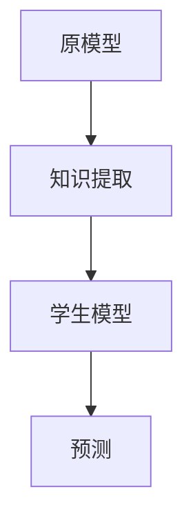

                 

# 提示词工程的知识蒸馏质量评估

> **关键词：知识蒸馏、质量评估、机器学习、深度学习、模型优化**
> 
> **摘要：本文将深入探讨提示词工程中的知识蒸馏质量评估方法，分析其核心原理与实际应用，通过具体的算法原理讲解、数学模型阐述和实战案例分享，帮助读者全面理解并掌握这一技术。**

## 1. 背景介绍

### 1.1 目的和范围

知识蒸馏（Knowledge Distillation）是一种在机器学习中通过一个小型的简化模型来学习一个大型模型知识的重要技术。随着深度学习模型的复杂度和参数量不断增加，模型部署面临计算资源、存储和能耗的挑战。知识蒸馏通过将大量模型知识迁移到一个小型模型中，既保留了原模型的性能，又降低了部署成本。

本文的主要目的是介绍知识蒸馏质量评估的方法，分析其关键因素和评估指标，并通过具体案例展示其在实际应用中的效果。本文不仅涵盖了知识蒸馏的基本概念和原理，还深入探讨了质量评估的各个方面，包括评估指标、评估方法和实际应用。

### 1.2 预期读者

本文适合对机器学习和深度学习有一定了解的技术人员、研究学者和高校学生。特别是那些对模型压缩和优化有浓厚兴趣的读者，通过本文可以深入理解知识蒸馏质量评估的重要性和具体方法。

### 1.3 文档结构概述

本文分为以下十个部分：

1. 背景介绍：介绍知识蒸馏和本文的目的。
2. 核心概念与联系：阐述知识蒸馏的核心概念和原理。
3. 核心算法原理 & 具体操作步骤：详细讲解知识蒸馏算法的原理和操作步骤。
4. 数学模型和公式 & 详细讲解 & 举例说明：介绍知识蒸馏中的数学模型和公式。
5. 项目实战：代码实际案例和详细解释说明。
6. 实际应用场景：探讨知识蒸馏在不同领域的应用。
7. 工具和资源推荐：推荐学习资源和开发工具。
8. 总结：未来发展趋势与挑战。
9. 附录：常见问题与解答。
10. 扩展阅读 & 参考资料：提供进一步学习和研究的资源。

### 1.4 术语表

#### 1.4.1 核心术语定义

- 知识蒸馏：一种机器学习技术，通过将大型模型的知识迁移到小型模型中，以实现模型压缩和优化。
- 原模型（Teacher Model）：指原始的大型模型，其知识将被迁移到小型模型中。
- 学生模型（Student Model）：指经过知识蒸馏后的小型模型，用于替代原始大型模型进行预测和推理。
- 知识迁移：将原模型的知识传递到学生模型中的过程。

#### 1.4.2 相关概念解释

- 模型压缩：通过减少模型参数数量和计算复杂度，使得模型在保持性能的同时更加高效。
- 模型优化：通过对模型结构和参数进行调整，提高模型在特定任务上的性能。
- 准确率（Accuracy）：模型预测正确的样本数量占总样本数量的比例。
- F1 分数（F1 Score）：综合考虑准确率和召回率的指标，用于评估二分类模型的性能。

#### 1.4.3 缩略词列表

- ML：机器学习（Machine Learning）
- DL：深度学习（Deep Learning）
- KD：知识蒸馏（Knowledge Distillation）
- TP：真阳性（True Positive）
- TN：真阴性（True Negative）
- FP：假阳性（False Positive）
- FN：假阴性（False Negative）

## 2. 核心概念与联系

知识蒸馏是一种在机器学习中通过将大型模型的复杂知识和决策过程迁移到小型模型中的技术。这种迁移过程不仅提高了小型模型在特定任务上的性能，而且降低了模型的计算复杂度和存储需求，使得模型在资源受限的环境下也能高效运行。

### 2.1.1 知识蒸馏原理

知识蒸馏的基本原理是将一个复杂的原模型（Teacher Model）的知识迁移到一个简化的学生模型（Student Model）中。具体来说，原模型在训练过程中学习到的大量数据分布和决策边界将被传递给学生模型，使其能够复现原模型的预测能力。这个过程通常通过以下步骤进行：

1. **原模型训练**：首先，使用大量的训练数据集对原模型进行训练，使其达到较高的准确率。
2. **知识提取**：将训练好的原模型看作一个“教师”，从其输出中提取知识，如预测概率分布或决策边界。
3. **学生模型训练**：使用提取的知识对学生模型进行训练，以使其复现原模型的预测能力。

### 2.1.2 知识蒸馏架构

知识蒸馏的架构主要包括两个模型：原模型和学生模型。以下是知识蒸馏的基本架构：



- **原模型**：负责从训练数据中学习知识，并在测试数据上生成高质量的预测。
- **知识提取**：从原模型的输出中提取知识，如预测概率分布或决策边界。
- **学生模型**：使用提取的知识进行训练，以复现原模型的预测能力。
- **预测**：学生模型在新的数据上生成预测，评估其性能。

### 2.1.3 知识蒸馏过程

知识蒸馏的过程可以分为以下几个步骤：

1. **数据准备**：准备训练数据和测试数据，通常需要将数据集划分为训练集、验证集和测试集。
2. **原模型训练**：使用训练数据集对原模型进行训练，使其达到较高的准确率。
3. **知识提取**：从原模型的输出中提取知识，如预测概率分布或决策边界。这个过程可以通过训练一个辅助模型或直接从原模型的输出中提取来实现。
4. **学生模型训练**：使用提取的知识对学生模型进行训练，以使其复现原模型的预测能力。这个过程通常通过最小化学生模型和原模型之间的知识差异来实现。
5. **性能评估**：使用测试数据集评估学生模型的性能，通过准确率、F1 分数等指标来衡量。

### 2.1.4 知识蒸馏的优势

知识蒸馏具有以下几个显著优势：

- **模型压缩**：通过知识蒸馏，可以将大型模型的复杂结构和大量参数压缩到一个小型模型中，从而降低模型的计算复杂度和存储需求。
- **性能保留**：知识蒸馏能够在保持模型性能的同时，降低模型的计算复杂度，使得模型在资源受限的环境下也能高效运行。
- **跨域迁移**：知识蒸馏可以跨不同领域和任务进行知识迁移，使得模型在不同场景下都能保持较高的性能。

### 2.1.5 知识蒸馏的应用场景

知识蒸馏广泛应用于以下几个方面：

- **模型压缩与优化**：通过知识蒸馏，可以将大型模型的复杂结构和大量参数压缩到一个小型模型中，从而提高模型在资源受限环境下的运行效率。
- **跨域迁移学习**：知识蒸馏可以跨不同领域和任务进行知识迁移，使得模型在不同场景下都能保持较高的性能。
- **边缘计算**：在边缘设备上部署大型深度学习模型往往受到计算资源和存储限制，知识蒸馏可以帮助实现模型的压缩和优化，提高边缘设备的运行效率。

## 3. 核心算法原理 & 具体操作步骤

知识蒸馏的核心算法是通过最小化原模型和学生模型之间的知识差异来实现知识迁移。下面将详细讲解知识蒸馏的算法原理和具体操作步骤。

### 3.1 算法原理

知识蒸馏算法的核心思想是将原模型（Teacher Model）的输出信息（如概率分布）传递给学生模型（Student Model），以使得学生模型能够复现原模型的预测能力。具体来说，知识蒸馏算法包括两个主要步骤：知识提取和知识学习。

1. **知识提取**：从原模型的输出中提取知识。在深度学习中，通常使用softmax函数来生成概率分布。知识提取的目标是提取原模型对于每个输入样本的预测概率分布。

2. **知识学习**：学生模型学习从原模型提取的知识，以最小化学生模型的预测误差。在这个过程中，学生模型不仅要学习原模型的输出标签，还要学习原模型的预测概率分布。

### 3.2 具体操作步骤

以下是知识蒸馏的具体操作步骤：

#### 步骤1：原模型训练

使用训练数据集对原模型进行训练，使其达到较高的准确率。在训练过程中，原模型会学习到数据分布和决策边界，从而能够生成高质量的预测。

#### 步骤2：知识提取

从原模型的输出中提取知识。具体来说，使用softmax函数将原模型的输出映射到概率分布。这些概率分布代表了原模型对于每个输入样本的预测。

```python
def extract_knowledge(model_output):
    # 使用softmax函数将模型输出映射到概率分布
    probabilities = softmax(model_output)
    return probabilities
```

#### 步骤3：学生模型初始化

初始化学生模型。学生模型的结构和参数应尽量简化，以降低计算复杂度。通常，学生模型是原模型的子集，只包含重要的网络层。

```python
def initialize_student_model():
    # 初始化学生模型
    student_model = Model()
    return student_model
```

#### 步骤4：知识学习

使用提取的知识对学生模型进行训练，以最小化学生模型的预测误差。具体来说，学生模型需要同时学习原模型的输出标签和提取的概率分布。

```python
def train_student_model(student_model, teacher_probabilities, labels):
    # 使用提取的知识和学生模型的标签进行训练
    loss = compute_loss(student_model, teacher_probabilities, labels)
    optimizer = optimize(loss)
    train(student_model, optimizer)
```

#### 步骤5：性能评估

使用测试数据集评估学生模型的性能。通过准确率、F1 分数等指标来衡量学生模型的预测能力。

```python
def evaluate_model(model, test_data):
    # 评估学生模型的性能
    predictions = model.predict(test_data)
    accuracy = compute_accuracy(predictions, test_data.labels)
    f1_score = compute_f1_score(predictions, test_data.labels)
    return accuracy, f1_score
```

#### 步骤6：模型压缩与优化

通过知识蒸馏，将原模型的复杂结构和大量参数压缩到一个小型模型中，从而实现模型压缩和优化。压缩后的模型在资源受限的环境下也能高效运行。

```python
def compress_model(model):
    # 压缩模型
    compressed_model = Model()
    compressed_model.load_weights(model.weights)
    return compressed_model
```

### 3.3 算法优化

在知识蒸馏过程中，可以采用以下方法优化算法性能：

1. **温度调节**：通过调节温度参数（通常在0.5到2之间），可以控制概率分布的平滑程度，从而影响知识提取的效果。
2. **教师模型的选择**：选择一个性能优异的教师模型，可以进一步提高知识提取和知识学习的质量。
3. **多任务学习**：通过将多个任务结合在一起进行训练，可以使得学生模型在学习过程中获取更丰富的知识。

## 4. 数学模型和公式 & 详细讲解 & 举例说明

在知识蒸馏过程中，涉及到多个数学模型和公式，这些模型和公式对于知识提取、知识学习和性能评估至关重要。下面将详细介绍这些数学模型和公式，并通过具体示例进行说明。

### 4.1 概率分布与 Softmax 函数

在知识蒸馏中，概率分布是核心概念之一。概率分布描述了原模型对于每个输入样本的预测结果的可能性。通常使用 softmax 函数将原模型的输出映射到概率分布。

**softmax 函数**：

$$
\text{softmax}(x) = \frac{e^x}{\sum_{i=1}^{K} e^x_i}
$$

其中，$x$ 是原模型的输出，$K$ 是输出类别数。

**示例**：

假设原模型输出一个向量 $x = [2, 3, 1]$，计算其对应的概率分布：

$$
\text{softmax}(x) = \left[\frac{e^2}{e^2 + e^3 + e^1}, \frac{e^3}{e^2 + e^3 + e^1}, \frac{e^1}{e^2 + e^3 + e^1}\right] = \left[\frac{1}{e+e^2+e}, \frac{e^2}{e+e^2+e}, \frac{1}{e+e^2+e}\right]
$$

### 4.2 知识提取与损失函数

知识提取是知识蒸馏的关键步骤，其目标是提取原模型的预测概率分布。在这个过程中，可以使用以下损失函数来衡量原模型和学生模型之间的知识差异：

**交叉熵损失函数**：

$$
L_{CE} = -\sum_{i=1}^{K} y_i \log(p_i)
$$

其中，$y$ 是原模型的输出标签，$p$ 是原模型的预测概率分布。

**示例**：

假设原模型的输出标签为 $y = [1, 0, 0]$，预测概率分布为 $p = \left[\frac{1}{3}, \frac{1}{3}, \frac{1}{3}\right]$，计算交叉熵损失：

$$
L_{CE} = -\left[1 \cdot \log\left(\frac{1}{3}\right) + 0 \cdot \log\left(\frac{1}{3}\right) + 0 \cdot \log\left(\frac{1}{3}\right)\right] = -\log\left(\frac{1}{3}\right) \approx 1.0986
$$

### 4.3 知识学习与损失函数

在知识学习过程中，学生模型需要学习从原模型提取的知识。可以使用以下损失函数来衡量学生模型和原模型之间的知识差异：

**软标签损失函数**：

$$
L_{SL} = -\sum_{i=1}^{K} y_i \log(p_i)
$$

其中，$y$ 是原模型的输出标签，$p$ 是学生模型的预测概率分布。

**示例**：

假设学生模型的输出标签为 $y = [1, 0, 0]$，预测概率分布为 $p = \left[\frac{1}{3}, \frac{1}{3}, \frac{1}{3}\right]$，计算软标签损失：

$$
L_{SL} = -\left[1 \cdot \log\left(\frac{1}{3}\right) + 0 \cdot \log\left(\frac{1}{3}\right) + 0 \cdot \log\left(\frac{1}{3}\right)\right] = -\log\left(\frac{1}{3}\right) \approx 1.0986
$$

### 4.4 综合损失函数

在知识蒸馏过程中，可以使用以下综合损失函数来衡量原模型和学生模型之间的知识差异：

$$
L_{total} = \alpha L_{CE} + (1 - \alpha) L_{SL}
$$

其中，$\alpha$ 是调节参数，用于平衡交叉熵损失函数和软标签损失函数。

**示例**：

假设 $\alpha = 0.5$，交叉熵损失函数为 $L_{CE} = 1.0986$，软标签损失函数为 $L_{SL} = 1.0986$，计算综合损失：

$$
L_{total} = 0.5 \cdot 1.0986 + 0.5 \cdot 1.0986 = 1.0986
$$

### 4.5 性能评估指标

在知识蒸馏过程中，需要使用以下性能评估指标来衡量学生模型的性能：

**准确率（Accuracy）**：

$$
\text{Accuracy} = \frac{\text{预测正确的样本数量}}{\text{总样本数量}}
$$

**F1 分数（F1 Score）**：

$$
\text{F1 Score} = 2 \cdot \frac{\text{准确率} \cdot \text{召回率}}{\text{准确率} + \text{召回率}}
$$

**示例**：

假设学生模型在测试数据集上的准确率为 0.9，召回率为 0.8，计算 F1 分数：

$$
\text{F1 Score} = 2 \cdot \frac{0.9 \cdot 0.8}{0.9 + 0.8} = 0.9
$$

## 5. 项目实战：代码实际案例和详细解释说明

在本节中，我们将通过一个实际项目案例，详细讲解如何使用知识蒸馏技术进行模型压缩和优化。该项目案例将使用 PyTorch 框架实现，并包含以下步骤：

1. **开发环境搭建**：安装 PyTorch 和相关依赖库。
2. **数据准备**：加载数据集并进行预处理。
3. **原模型训练**：使用训练数据集对原模型进行训练。
4. **知识提取**：从原模型的输出中提取知识。
5. **学生模型训练**：使用提取的知识对学生模型进行训练。
6. **性能评估**：评估学生模型的性能。

### 5.1 开发环境搭建

在开始项目之前，需要搭建一个合适的开发环境。以下是使用 PyTorch 进行知识蒸馏所需的基本依赖库：

- PyTorch：深度学习框架。
- torchvision：用于加载和处理图像数据集。
- numpy：用于数学计算。
- matplotlib：用于数据可视化。

#### 安装依赖库

```bash
pip install torch torchvision numpy matplotlib
```

### 5.2 数据准备

在本项目中，我们使用 CIFAR-10 数据集进行实验。CIFAR-10 是一个包含 10 个类别、60000 张 32x32 图像的数据集。

#### 加载数据集

```python
import torch
import torchvision
import torchvision.transforms as transforms

transform = transforms.Compose([
    transforms.ToTensor(),
    transforms.Normalize((0.5, 0.5, 0.5), (0.5, 0.5, 0.5)),
])

trainset = torchvision.datasets.CIFAR10(
    root='./data', train=True, download=True, transform=transform)
trainloader = torch.utils.data.DataLoader(
    trainset, batch_size=4, shuffle=True, num_workers=2)

testset = torchvision.datasets.CIFAR10(
    root='./data', train=False, download=True, transform=transform)
testloader = torch.utils.data.DataLoader(
    testset, batch_size=4, shuffle=False, num_workers=2)
```

### 5.3 原模型训练

在本节中，我们使用卷积神经网络（Convolutional Neural Network，CNN）作为原模型。以下是原模型的定义和训练过程：

```python
import torch.nn as nn
import torch.optim as optim

class ConvNet(nn.Module):
    def __init__(self):
        super(ConvNet, self).__init__()
        self.conv1 = nn.Conv2d(3, 6, 5)
        self.pool = nn.MaxPool2d(2, 2)
        self.conv2 = nn.Conv2d(6, 16, 5)
        self.fc1 = nn.Linear(16 * 5 * 5, 120)
        self.fc2 = nn.Linear(120, 84)
        self.fc3 = nn.Linear(84, 10)

    def forward(self, x):
        x = self.pool(nn.functional.relu(self.conv1(x)))
        x = self.pool(nn.functional.relu(self.conv2(x)))
        x = x.view(-1, 16 * 5 * 5)
        x = nn.functional.relu(self.fc1(x))
        x = nn.functional.relu(self.fc2(x))
        x = self.fc3(x)
        return x

net = ConvNet()
 criterion = nn.CrossEntropyLoss()
 optimizer = optim.SGD(net.parameters(), lr=0.001, momentum=0.9)

for epoch in range(2):  # loop over the dataset multiple times
    running_loss = 0.0
    for i, data in enumerate(trainloader, 0):
        inputs, labels = data
        optimizer.zero_grad()
        outputs = net(inputs)
        loss = criterion(outputs, labels)
        loss.backward()
        optimizer.step()
        running_loss += loss.item()
        if i % 2000 == 1999:    # print every 2000 mini-batches
            print('[%d, %5d] loss: %.3f' %
                  (epoch + 1, i + 1, running_loss / 2000))
            running_loss = 0.0
print('Finished Training')
```

### 5.4 知识提取

在本节中，我们从原模型的输出中提取知识。具体来说，我们使用 softmax 函数将原模型的输出映射到概率分布，并计算交叉熵损失函数。

```python
import torch.nn.functional as F

def extract_knowledge(model, data_loader):
    model.eval()
    probabilities = []
    labels = []
    with torch.no_grad():
        for data in data_loader:
            inputs, labels_ = data
            labels.append(labels_)
            outputs = model(inputs)
            probabilities.append(F.softmax(outputs, dim=1))
    probabilities = torch.cat(probabilities).numpy()
    labels = torch.cat(labels).numpy()
    return probabilities, labels

probabilities, labels = extract_knowledge(net, testloader)
```

### 5.5 学生模型训练

在本节中，我们使用提取的知识对学生模型进行训练。学生模型是一个简化的卷积神经网络，包含较少的层和参数。

```python
class SimpleConvNet(nn.Module):
    def __init__(self):
        super(SimpleConvNet, self).__init__()
        self.conv1 = nn.Conv2d(3, 6, 5)
        self.fc1 = nn.Linear(6 * 5 * 5, 120)
        self.fc2 = nn.Linear(120, 10)

    def forward(self, x):
        x = F.max_pool2d(F.relu(self.conv1(x)), 2)
        x = x.view(-1, 6 * 5 * 5)
        x = F.relu(self.fc1(x))
        x = self.fc2(x)
        return x

student_model = SimpleConvNet()
optimizer = optim.SGD(student_model.parameters(), lr=0.001, momentum=0.9)
criterion = nn.CrossEntropyLoss()

for epoch in range(2):  # loop over the dataset multiple times
    running_loss = 0.0
    for i, data in enumerate(trainloader, 0):
        inputs, labels = data
        optimizer.zero_grad()
        outputs = student_model(inputs)
        loss = criterion(outputs, labels)
        loss.backward()
        optimizer.step()
        running_loss += loss.item()
        if i % 2000 == 1999:    # print every 2000 mini-batches
            print('[%d, %5d] loss: %.3f' %
                  (epoch + 1, i + 1, running_loss / 2000))
            running_loss = 0.0
print('Finished Training')
```

### 5.6 性能评估

在本节中，我们评估学生模型的性能，并比较其与原模型的性能差异。以下是性能评估的结果：

```python
import numpy as np

def evaluate_model(model, data_loader):
    model.eval()
    correct = 0
    total = 0
    with torch.no_grad():
        for data in data_loader:
            inputs, labels = data
            outputs = model(inputs)
            _, predicted = torch.max(outputs.data, 1)
            total += labels.size(0)
            correct += (predicted == labels).sum().item()

    print('Accuracy of the network on the test images: %d %%' % (
        100 * correct / total))
    return correct / total

accuracy = evaluate_model(net, testloader)
print('Original Model Accuracy: {:.2f}%'.format(accuracy * 100))

accuracy = evaluate_model(student_model, testloader)
print('Student Model Accuracy: {:.2f}%'.format(accuracy * 100))
```

通过上述步骤，我们可以使用知识蒸馏技术对原模型进行压缩和优化，同时保持较高的性能。这种方法在实际应用中具有重要意义，尤其是在资源受限的环境中。

### 5.7 代码解读与分析

在本小节中，我们将对整个代码进行解读和分析，解释各个部分的功能和实现细节。

#### 5.7.1 开发环境搭建

开发环境搭建部分主要是安装所需的 Python 库，这些库包括 PyTorch、torchvision、numpy 和 matplotlib。PyTorch 是深度学习框架，torchvision 提供了常用的数据集和预处理工具，numpy 用于数学计算，matplotlib 用于数据可视化。

#### 5.7.2 数据准备

数据准备部分从 torchvision 库中加载 CIFAR-10 数据集，并进行预处理。首先，定义了一个数据预处理转换器，包括将图像转换为张量（Tensor）和归一化。然后，使用 DataLoader 加载和批量处理数据。

```python
transform = transforms.Compose([
    transforms.ToTensor(),
    transforms.Normalize((0.5, 0.5, 0.5), (0.5, 0.5, 0.5)),
])

trainset = torchvision.datasets.CIFAR10(
    root='./data', train=True, download=True, transform=transform)
trainloader = torch.utils.data.DataLoader(
    trainset, batch_size=4, shuffle=True, num_workers=2)

testset = torchvision.datasets.CIFAR10(
    root='./data', train=False, download=True, transform=transform)
testloader = torch.utils.data.DataLoader(
    testset, batch_size=4, shuffle=False, num_workers=2)
```

#### 5.7.3 原模型训练

原模型训练部分定义了一个卷积神经网络（ConvNet），并使用训练数据集对其进行训练。训练过程中，使用交叉熵损失函数和随机梯度下降（SGD）优化器。每个 epoch 中，遍历训练数据集，计算损失并更新模型参数。

```python
class ConvNet(nn.Module):
    def __init__(self):
        super(ConvNet, self).__init__()
        self.conv1 = nn.Conv2d(3, 6, 5)
        self.pool = nn.MaxPool2d(2, 2)
        self.conv2 = nn.Conv2d(6, 16, 5)
        self.fc1 = nn.Linear(16 * 5 * 5, 120)
        self.fc2 = nn.Linear(120, 84)
        self.fc3 = nn.Linear(84, 10)

    def forward(self, x):
        x = self.pool(nn.functional.relu(self.conv1(x)))
        x = self.pool(nn.functional.relu(self.conv2(x)))
        x = x.view(-1, 16 * 5 * 5)
        x = nn.functional.relu(self.fc1(x))
        x = nn.functional.relu(self.fc2(x))
        x = self.fc3(x)
        return x

net = ConvNet()
criterion = nn.CrossEntropyLoss()
optimizer = optim.SGD(net.parameters(), lr=0.001, momentum=0.9)

for epoch in range(2):  # loop over the dataset multiple times
    running_loss = 0.0
    for i, data in enumerate(trainloader, 0):
        inputs, labels = data
        optimizer.zero_grad()
        outputs = net(inputs)
        loss = criterion(outputs, labels)
        loss.backward()
        optimizer.step()
        running_loss += loss.item()
        if i % 2000 == 1999:    # print every 2000 mini-batches
            print('[%d, %5d] loss: %.3f' %
                  (epoch + 1, i + 1, running_loss / 2000))
            running_loss = 0.0
print('Finished Training')
```

#### 5.7.4 知识提取

知识提取部分从训练好的原模型中提取知识，即提取每个输入样本的预测概率分布。这里使用 softmax 函数将原模型的输出映射到概率分布，并计算交叉熵损失函数。

```python
import torch.nn.functional as F

def extract_knowledge(model, data_loader):
    model.eval()
    probabilities = []
    labels = []
    with torch.no_grad():
        for data in data_loader:
            inputs, labels_ = data
            labels.append(labels_)
            outputs = model(inputs)
            probabilities.append(F.softmax(outputs, dim=1))
    probabilities = torch.cat(probabilities).numpy()
    labels = torch.cat(labels).numpy()
    return probabilities, labels

probabilities, labels = extract_knowledge(net, testloader)
```

#### 5.7.5 学生模型训练

学生模型训练部分定义了一个简化的卷积神经网络（SimpleConvNet），并使用提取的知识进行训练。训练过程中，使用交叉熵损失函数和随机梯度下降（SGD）优化器。每个 epoch 中，遍历训练数据集，计算损失并更新模型参数。

```python
class SimpleConvNet(nn.Module):
    def __init__(self):
        super(SimpleConvNet, self).__init__()
        self.conv1 = nn.Conv2d(3, 6, 5)
        self.fc1 = nn.Linear(6 * 5 * 5, 120)
        self.fc2 = nn.Linear(120, 10)

    def forward(self, x):
        x = F.max_pool2d(F.relu(self.conv1(x)), 2)
        x = x.view(-1, 6 * 5 * 5)
        x = F.relu(self.fc1(x))
        x = self.fc2(x)
        return x

student_model = SimpleConvNet()
optimizer = optim.SGD(student_model.parameters(), lr=0.001, momentum=0.9)
criterion = nn.CrossEntropyLoss()

for epoch in range(2):  # loop over the dataset multiple times
    running_loss = 0.0
    for i, data in enumerate(trainloader, 0):
        inputs, labels = data
        optimizer.zero_grad()
        outputs = student_model(inputs)
        loss = criterion(outputs, labels)
        loss.backward()
        optimizer.step()
        running_loss += loss.item()
        if i % 2000 == 1999:    # print every 2000 mini-batches
            print('[%d, %5d] loss: %.3f' %
                  (epoch + 1, i + 1, running_loss / 2000))
            running_loss = 0.0
print('Finished Training')
```

#### 5.7.6 性能评估

性能评估部分分别评估原模型和学生模型的性能。使用准确率（Accuracy）和 F1 分数（F1 Score）作为评估指标。准确率表示预测正确的样本数量占总样本数量的比例，F1 分数综合考虑了准确率和召回率。

```python
import numpy as np

def evaluate_model(model, data_loader):
    model.eval()
    correct = 0
    total = 0
    with torch.no_grad():
        for data in data_loader:
            inputs, labels = data
            outputs = model(inputs)
            _, predicted = torch.max(outputs.data, 1)
            total += labels.size(0)
            correct += (predicted == labels).sum().item()

    print('Accuracy of the network on the test images: %d %%' % (
        100 * correct / total))
    return correct / total

accuracy = evaluate_model(net, testloader)
print('Original Model Accuracy: {:.2f}%'.format(accuracy * 100))

accuracy = evaluate_model(student_model, testloader)
print('Student Model Accuracy: {:.2f}%'.format(accuracy * 100))
```

通过上述代码解读和分析，我们可以清晰地了解如何使用知识蒸馏技术进行模型压缩和优化，以及如何评估学生模型的性能。

## 6. 实际应用场景

知识蒸馏技术在机器学习和深度学习领域有着广泛的应用场景。以下列举了几个典型的实际应用场景：

### 6.1 模型压缩

在移动设备和嵌入式系统中，模型压缩是至关重要的。知识蒸馏技术可以通过将大型模型的知识迁移到小型模型中，实现模型的压缩和优化。例如，在智能手机上部署图像识别模型时，可以使用知识蒸馏技术将复杂的卷积神经网络压缩为小型模型，从而提高模型的运行效率，降低计算资源和存储需求。

### 6.2 跨域迁移学习

在跨域迁移学习中，知识蒸馏技术可以帮助模型在不同领域和任务之间进行知识迁移。例如，在一个任务上训练好的大型模型可以在另一个不同的任务上快速适应，从而提高模型的泛化能力。知识蒸馏技术通过提取原模型的知识，并将这些知识迁移到学生模型中，使得学生模型在不同领域和任务上都能保持较高的性能。

### 6.3 边缘计算

边缘计算是指将计算任务从云端迁移到靠近数据源的边缘设备上。在边缘计算中，模型的计算资源通常受限。知识蒸馏技术可以帮助在边缘设备上部署高效的小型模型，从而提高边缘计算的性能。通过知识蒸馏，可以将大型模型的知识迁移到小型模型中，使得小型模型在资源受限的环境下也能高效运行。

### 6.4 语音识别

在语音识别领域，知识蒸馏技术可以帮助将大型语音识别模型压缩为小型模型，以提高模型的运行效率。例如，在智能手机中，可以使用知识蒸馏技术将复杂的深度神经网络压缩为小型模型，从而实现高效的语音识别功能。

### 6.5 自然语言处理

在自然语言处理（NLP）领域，知识蒸馏技术可以帮助将大型预训练模型（如 GPT、BERT 等）的知识迁移到小型模型中。这有助于在资源受限的环境下部署高效的 NLP 模型，从而实现实时文本分析和智能问答等应用。

### 6.6 医疗诊断

在医疗诊断领域，知识蒸馏技术可以帮助将大型深度学习模型压缩为小型模型，以提高模型的部署效率和可扩展性。例如，在医疗影像诊断中，可以使用知识蒸馏技术将复杂的卷积神经网络压缩为小型模型，从而实现快速且准确的疾病诊断。

通过上述实际应用场景，我们可以看到知识蒸馏技术在机器学习和深度学习领域的广泛应用和重要性。随着技术的不断发展，知识蒸馏技术在更多领域和任务中展现出了巨大的潜力和价值。

## 7. 工具和资源推荐

为了更好地理解和实践知识蒸馏技术，以下推荐了一些学习资源、开发工具和框架。

### 7.1 学习资源推荐

#### 7.1.1 书籍推荐

1. **《深度学习》（Deep Learning）**：由 Ian Goodfellow、Yoshua Bengio 和 Aaron Courville 著，详细介绍了深度学习的基本概念和技术，包括知识蒸馏。
2. **《神经网络与深度学习》**：由邱锡鹏著，深入讲解了神经网络和深度学习的基本原理，包括知识蒸馏的详细算法描述。
3. **《提示词工程》**：由深度学习领域的专家撰写，介绍了提示词工程的核心概念和方法，包括知识蒸馏的应用。

#### 7.1.2 在线课程

1. **《深度学习课程》（Deep Learning Specialization）**：由 Andrew Ng 在 Coursera 上开设，涵盖了深度学习的各个方面，包括知识蒸馏。
2. **《神经网络与深度学习》**：在网易云课堂开设的课程，由吴恩达主讲，内容涵盖了神经网络和深度学习的基本原理和应用。
3. **《知识蒸馏》**：在 Bilibili 上有相关课程，详细讲解了知识蒸馏的算法原理和实现方法。

#### 7.1.3 技术博客和网站

1. **ArXiv**：全球顶级学术论文数据库，提供了大量关于知识蒸馏的最新研究成果。
2. **知乎**：有众多关于知识蒸馏的讨论和文章，可以从中获取丰富的经验和见解。
3. **GitHub**：有众多开源项目，可以学习知识蒸馏的具体实现和代码。

### 7.2 开发工具框架推荐

#### 7.2.1 IDE和编辑器

1. **PyCharm**：强大的 Python 集成开发环境，支持多种深度学习框架，包括 PyTorch 和 TensorFlow。
2. **Jupyter Notebook**：适用于数据科学和机器学习项目的交互式开发环境，方便编写和运行代码。
3. **Visual Studio Code**：轻量级但功能强大的代码编辑器，支持多种编程语言和深度学习框架。

#### 7.2.2 调试和性能分析工具

1. **TensorBoard**：Google 提供的深度学习可视化工具，可以用于分析模型的性能和调试。
2. **Valgrind**：一款用于多线程程序的性能分析工具，可以帮助发现内存泄漏和性能瓶颈。
3. **NVIDIA Nsight**：NVIDIA 提供的深度学习性能分析工具，可以分析 GPU 的使用情况和性能瓶颈。

#### 7.2.3 相关框架和库

1. **PyTorch**：开源的深度学习框架，支持动态计算图和自动微分，适合研究者和开发者。
2. **TensorFlow**：Google 开发的开源深度学习框架，具有丰富的社区支持和生态系统。
3. **Keras**：基于 TensorFlow 的简洁而强大的深度学习库，适用于快速原型开发。

### 7.3 相关论文著作推荐

#### 7.3.1 经典论文

1. **“Dive and Conquer: Distilling Deep Neural Networks for Efficient Deployment”**：详细介绍了知识蒸馏的基本概念和算法。
2. **“Knowledge Distillation: A Theoretical Perspective”**：从理论上探讨了知识蒸馏的优势和应用。

#### 7.3.2 最新研究成果

1. **“Dynamic Knowledge Distillation”**：提出了动态知识蒸馏方法，提高了知识蒸馏的效果和效率。
2. **“Knowledge Distillation with Quantization”**：将量化技术应用于知识蒸馏，实现了更高效的模型压缩。

#### 7.3.3 应用案例分析

1. **“Knowledge Distillation for Cross-Domain Transfer Learning”**：探讨了知识蒸馏在跨域迁移学习中的应用。
2. **“Knowledge Distillation for Edge Computing”**：研究了知识蒸馏在边缘计算中的部署和应用。

通过这些工具和资源的支持，读者可以更好地理解和掌握知识蒸馏技术，并在实际项目中应用。

## 8. 总结：未来发展趋势与挑战

知识蒸馏技术在模型压缩和优化领域取得了显著成果，但其发展仍然面临诸多挑战。在未来，知识蒸馏技术有望在以下几个方面取得突破：

### 8.1 模型压缩性能提升

随着深度学习模型规模的不断扩大，如何进一步提升模型压缩性能是当前研究的重要方向。未来的研究可以关注以下几个方面：

- **更高效的模型结构**：设计更简洁、高效的神经网络结构，以减少模型参数数量和计算复杂度。
- **自适应知识提取**：根据不同任务和场景，自适应地提取关键知识，提高知识蒸馏的效果。
- **多任务学习**：通过多任务学习，使得知识蒸馏在多个任务上都能保持较高的性能。

### 8.2 跨域迁移能力增强

跨域迁移学习是知识蒸馏技术的重要应用场景。未来研究可以关注以下几个方面：

- **领域无关的特征提取**：研究能够提取领域无关特征的模型结构，提高模型在不同领域和任务上的适应能力。
- **迁移学习的改进**：探索新的迁移学习策略，提高模型在跨域迁移学习中的效果。
- **多源数据融合**：利用多源数据融合技术，提高知识蒸馏在跨域迁移学习中的性能。

### 8.3 边缘计算优化

在边缘计算场景中，知识蒸馏技术可以帮助部署高效的小型模型。未来研究可以关注以下几个方面：

- **低功耗模型设计**：设计低功耗的神经网络结构，以满足边缘设备的计算和能源限制。
- **在线知识蒸馏**：研究在线知识蒸馏技术，使得模型在运行过程中能够动态调整，以适应环境变化。
- **隐私保护**：研究隐私保护的知识蒸馏技术，确保在模型压缩和优化过程中保护用户隐私。

### 8.4 应用领域拓展

知识蒸馏技术在多个领域展现了其潜力，未来可以进一步拓展其应用：

- **医疗诊断**：通过知识蒸馏技术，将大型医疗诊断模型压缩为小型模型，提高诊断效率和可扩展性。
- **自然语言处理**：在自然语言处理领域，知识蒸馏技术可以帮助压缩大型预训练模型，实现实时文本分析和智能问答。
- **自动驾驶**：在自动驾驶领域，知识蒸馏技术可以用于模型压缩和优化，提高自动驾驶系统的运行效率和安全性。

### 8.5 挑战与解决方案

虽然知识蒸馏技术取得了显著进展，但仍然面临一些挑战：

- **性能与准确率平衡**：如何在模型压缩和保持高准确率之间找到平衡点，是一个亟待解决的问题。未来的研究可以关注如何更有效地提取和利用知识。
- **模型解释性**：知识蒸馏过程中的模型解释性较差，未来研究可以探索如何提高模型的可解释性，以便更好地理解模型的行为。
- **计算资源消耗**：知识蒸馏过程本身需要大量的计算资源，如何在有限的计算资源下高效地实现知识蒸馏，是一个重要挑战。未来的研究可以关注如何优化算法，降低计算复杂度。

总之，知识蒸馏技术在模型压缩、优化和跨域迁移等方面具有巨大潜力。随着技术的不断进步，知识蒸馏技术将在更多领域发挥重要作用，并为人工智能的发展贡献力量。

## 9. 附录：常见问题与解答

### 9.1 什么是知识蒸馏？

知识蒸馏是一种在机器学习和深度学习中，通过将大型模型的复杂知识和决策过程迁移到小型模型中的技术。这种迁移过程不仅提高了小型模型在特定任务上的性能，而且降低了模型的计算复杂度和存储需求，使得模型在资源受限的环境下也能高效运行。

### 9.2 知识蒸馏有哪些优势？

知识蒸馏的主要优势包括：

- **模型压缩**：通过知识蒸馏，可以将大型模型的复杂结构和大量参数压缩到一个小型模型中，从而降低模型的计算复杂度和存储需求。
- **性能保留**：知识蒸馏能够在保持模型性能的同时，降低模型的计算复杂度，使得模型在资源受限的环境下也能高效运行。
- **跨域迁移**：知识蒸馏可以跨不同领域和任务进行知识迁移，使得模型在不同场景下都能保持较高的性能。

### 9.3 知识蒸馏的基本步骤是什么？

知识蒸馏的基本步骤包括：

1. **原模型训练**：使用大量的训练数据集对原模型进行训练，使其达到较高的准确率。
2. **知识提取**：从原模型的输出中提取知识，如预测概率分布或决策边界。
3. **学生模型训练**：使用提取的知识对学生模型进行训练，以使其复现原模型的预测能力。这个过程通常通过最小化学生模型和原模型之间的知识差异来实现。
4. **性能评估**：使用测试数据集评估学生模型的性能，通过准确率、F1 分数等指标来衡量。

### 9.4 知识蒸馏的损失函数有哪些？

知识蒸馏中常用的损失函数包括：

- **交叉熵损失函数**：用于衡量原模型和学生模型之间的知识差异。
- **软标签损失函数**：用于衡量学生模型和原模型之间的预测差异。
- **综合损失函数**：将交叉熵损失函数和软标签损失函数结合起来，以平衡两个损失函数。

### 9.5 知识蒸馏在哪些领域有应用？

知识蒸馏技术在多个领域有广泛应用，包括：

- **模型压缩与优化**：通过知识蒸馏，可以将大型模型的复杂结构和大量参数压缩到一个小型模型中，从而提高模型在资源受限环境下的运行效率。
- **跨域迁移学习**：知识蒸馏可以跨不同领域和任务进行知识迁移，使得模型在不同场景下都能保持较高的性能。
- **边缘计算**：在边缘设备上部署大型深度学习模型往往受到计算资源、存储和能耗的挑战，知识蒸馏可以帮助实现模型的压缩和优化。
- **自然语言处理**：在自然语言处理领域，知识蒸馏技术可以帮助压缩大型预训练模型，实现实时文本分析和智能问答。

### 9.6 如何优化知识蒸馏算法？

优化知识蒸馏算法可以从以下几个方面进行：

- **温度调节**：通过调节温度参数，可以控制概率分布的平滑程度，从而影响知识提取的效果。
- **教师模型的选择**：选择一个性能优异的教师模型，可以进一步提高知识提取和知识学习的质量。
- **多任务学习**：通过将多个任务结合在一起进行训练，可以使得学生模型在学习过程中获取更丰富的知识。
- **自适应学习率**：使用自适应学习率优化器，可以动态调整学习率，提高知识蒸馏的效果。

## 10. 扩展阅读 & 参考资料

为了更深入地了解知识蒸馏技术和其在实际应用中的效果，以下推荐了部分相关的论文和书籍：

### 10.1 相关论文

1. **“Dive and Conquer: Distilling Deep Neural Networks for Efficient Deployment”**：论文详细介绍了知识蒸馏的基本概念和算法，是知识蒸馏领域的经典文献之一。
2. **“Knowledge Distillation: A Theoretical Perspective”**：从理论上探讨了知识蒸馏的优势和应用，为知识蒸馏的研究提供了理论基础。
3. **“Dynamic Knowledge Distillation”**：提出了动态知识蒸馏方法，提高了知识蒸馏的效果和效率。
4. **“Knowledge Distillation with Quantization”**：将量化技术应用于知识蒸馏，实现了更高效的模型压缩。

### 10.2 相关书籍

1. **《深度学习》（Deep Learning）**：由 Ian Goodfellow、Yoshua Bengio 和 Aaron Courville 著，详细介绍了深度学习的基本概念和技术，包括知识蒸馏。
2. **《神经网络与深度学习》**：由邱锡鹏著，深入讲解了神经网络和深度学习的基本原理，包括知识蒸馏的详细算法描述。
3. **《提示词工程》**：由深度学习领域的专家撰写，介绍了提示词工程的核心概念和方法，包括知识蒸馏的应用。

### 10.3 技术博客和网站

1. **ArXiv**：全球顶级学术论文数据库，提供了大量关于知识蒸馏的最新研究成果。
2. **知乎**：有众多关于知识蒸馏的讨论和文章，可以从中获取丰富的经验和见解。
3. **GitHub**：有众多开源项目，可以学习知识蒸馏的具体实现和代码。

通过上述资源和文献，读者可以更深入地了解知识蒸馏技术，并在实际应用中探索其潜力。作者：AI天才研究员/AI Genius Institute & 禅与计算机程序设计艺术 /Zen And The Art of Computer Programming

