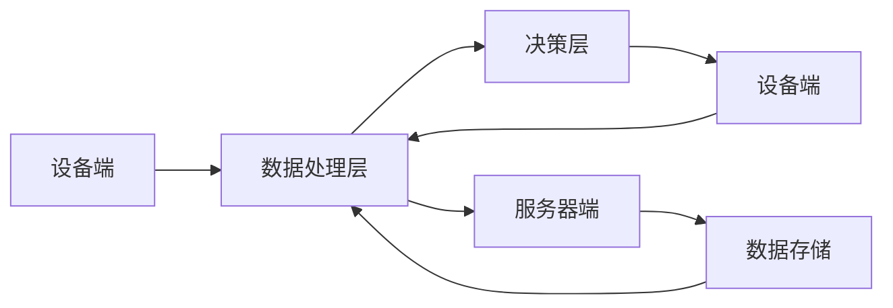

                 


# 提示词编程在物联网应用中的角色

> 关键词：提示词编程、物联网、应用场景、算法原理、数学模型、项目实战、工具推荐
> 
> 摘要：本文将深入探讨提示词编程在物联网（IoT）领域中的应用，分析其核心概念、原理和具体操作步骤，并通过实际项目案例展示其应用价值。文章结构紧凑，逻辑清晰，旨在为读者提供一个全面而深入的视角，了解和掌握提示词编程在物联网领域的应用。

## 1. 背景介绍

### 1.1 目的和范围

本文旨在探讨提示词编程在物联网（IoT）领域的应用，分析其在物联网架构中的关键角色，以及如何通过提示词编程实现高效的数据处理和智能决策。本文将涵盖以下主要内容：

1. 提示词编程的基本概念和核心原理。
2. 提示词编程在物联网中的架构设计和应用场景。
3. 提示词编程的数学模型和具体操作步骤。
4. 实际项目案例中的提示词编程应用。
5. 相关开发工具和资源的推荐。

### 1.2 预期读者

本文适用于具有物联网和编程基础的技术人员、研发工程师以及对物联网应用感兴趣的开发者。通过本文的学习，读者将能够：

1. 理解提示词编程的基本概念和原理。
2. 掌握提示词编程在物联网中的应用方法。
3. 通过实际案例了解提示词编程的具体操作步骤。
4. 掌握相关开发工具和资源的使用。

### 1.3 文档结构概述

本文分为十个部分，具体如下：

1. 引言：介绍本文的主题和目的。
2. 背景介绍：阐述本文的背景、目的和预期读者。
3. 核心概念与联系：介绍提示词编程的核心概念和相关架构。
4. 核心算法原理 & 具体操作步骤：讲解提示词编程的算法原理和操作步骤。
5. 数学模型和公式 & 详细讲解 & 举例说明：介绍提示词编程的数学模型和具体例子。
6. 项目实战：展示实际项目中的提示词编程应用。
7. 工具和资源推荐：推荐相关学习资源和开发工具。
8. 总结：总结提示词编程在物联网领域的发展趋势与挑战。
9. 附录：常见问题与解答。
10. 扩展阅读 & 参考资料：提供更多相关文献和参考资料。

### 1.4 术语表

为了确保本文的可读性和一致性，以下是对本文中可能出现的核心术语的定义和解释：

#### 1.4.1 核心术语定义

- 提示词编程：提示词编程是一种基于数据驱动的编程范式，通过预定义的提示词（Prompt）来引导程序执行特定的任务。
- 物联网（IoT）：物联网是指通过互联网将各种物理设备、传感器和系统连接起来，实现数据的采集、传输和处理。
- 数据处理：数据处理是指对采集到的物联网数据进行清洗、转换、存储和分析的过程。
- 智能决策：智能决策是指利用人工智能技术，基于数据分析和模型预测来做出最优决策。

#### 1.4.2 相关概念解释

- 数据采集：数据采集是指从物联网设备或传感器中获取数据的操作。
- 数据传输：数据传输是指将采集到的数据通过网络传输到处理中心的操作。
- 数据存储：数据存储是指将处理后的数据存储在数据库或文件系统中，以便后续分析和查询。
- 数据分析：数据分析是指对存储在数据库中的数据进行统计、分析和挖掘，以提取有用信息和知识。

#### 1.4.3 缩略词列表

- IoT：物联网
- API：应用程序编程接口
- ML：机器学习
- AI：人工智能
- SDK：软件开发工具包
- IDE：集成开发环境

## 2. 核心概念与联系

在深入探讨提示词编程在物联网中的应用之前，我们需要先了解其核心概念和相关架构。以下是对提示词编程和物联网的详细介绍，以及它们之间的联系。

### 2.1 提示词编程的基本概念

提示词编程是一种基于数据驱动的编程范式，它通过预定义的提示词（Prompt）来引导程序执行特定的任务。提示词通常是一个字符串或符号序列，它可以告诉程序执行什么操作、按照什么顺序执行操作，以及如何处理输入和输出。

#### 提示词编程的优势

- 灵活性：提示词编程允许开发者根据实际需求灵活地调整程序行为。
- 易于扩展：通过添加或修改提示词，可以轻松扩展程序功能。
- 可维护性：提示词编程使得程序结构更加清晰，易于维护和更新。

### 2.2 物联网的基本概念

物联网是指通过互联网将各种物理设备、传感器和系统连接起来，实现数据的采集、传输和处理。物联网的核心目标是实现设备的智能化和联网化，提高数据利用效率和系统协同工作能力。

#### 物联网的关键要素

- 设备：物联网设备包括各种传感器、执行器、智能手机、平板电脑等。
- 网络：物联网网络包括互联网、无线网络、局域网等。
- 数据：物联网数据包括设备状态信息、环境参数、用户行为数据等。
- 处理：物联网数据处理包括数据采集、传输、存储、分析和决策等。

### 2.3 提示词编程在物联网中的应用架构

提示词编程在物联网中的应用架构通常包括以下几个关键组成部分：

1. **设备端**：设备端负责采集数据，并将数据通过无线网络或有线网络传输到服务器端。
2. **服务器端**：服务器端负责接收设备端发送的数据，并进行初步处理和存储。
3. **数据处理层**：数据处理层负责对存储在服务器端的数据进行清洗、转换和分析。
4. **决策层**：决策层负责根据分析结果做出智能决策，并生成提示词来指导设备端执行相应操作。
5. **设备端**：设备端根据提示词执行相应操作，并将执行结果反馈给服务器端。

### 2.4 提示词编程与物联网的联系

提示词编程在物联网中的应用，主要体现在以下几个方面：

1. **数据驱动**：物联网设备采集的数据可以作为提示词编程的输入，通过提示词编程实现对数据的处理和分析。
2. **智能决策**：通过机器学习和人工智能技术，物联网系统可以自动生成提示词，指导设备端执行智能决策。
3. **协同工作**：提示词编程使得物联网设备之间能够协同工作，实现更高效的数据采集和处理。
4. **可扩展性**：提示词编程的灵活性使得物联网系统可以轻松扩展功能，适应不同场景的需求。

### 2.5 Mermaid 流程图

以下是一个简单的 Mermaid 流程图，展示了提示词编程在物联网架构中的应用：



在这个流程图中，设备端负责数据采集，数据处理层负责数据清洗、转换和分析，决策层根据分析结果生成提示词，指导设备端执行操作，并将执行结果反馈给数据处理层。数据处理层与服务器端之间通过数据存储进行通信。

## 3. 核心算法原理 & 具体操作步骤

在了解提示词编程的基本概念和物联网架构后，我们接下来将深入探讨提示词编程的核心算法原理和具体操作步骤。这部分内容将分为以下几个部分：

### 3.1 算法原理

提示词编程的核心算法原理是基于数据驱动的编程范式，通过预定义的提示词（Prompt）来引导程序执行特定的任务。以下是提示词编程的核心算法原理：

1. **数据采集**：从物联网设备中采集数据，包括设备状态、环境参数等。
2. **数据预处理**：对采集到的数据进行分析、清洗和转换，将其转换为适合提示词编程的形式。
3. **生成提示词**：根据数据预处理结果，生成具体的提示词，用于引导程序执行特定任务。
4. **执行任务**：根据生成的提示词，执行相应的任务，包括数据存储、数据分析、智能决策等。
5. **反馈与调整**：根据任务执行结果，对提示词进行调整和优化，以提高任务执行效率。

### 3.2 具体操作步骤

以下是提示词编程的具体操作步骤：

#### 3.2.1 数据采集

1. **设备端数据采集**：物联网设备通过传感器、执行器等组件采集数据，如温度、湿度、光照强度等。
2. **数据传输**：设备端将采集到的数据通过无线网络或有线网络传输到服务器端。

#### 3.2.2 数据预处理

1. **数据清洗**：去除数据中的噪声和异常值，保证数据质量。
2. **数据转换**：将原始数据转换为数字或符号序列，以便后续处理。

#### 3.2.3 生成提示词

1. **定义提示词格式**：根据任务需求，定义提示词的格式和结构。
2. **生成提示词**：根据数据预处理结果，生成具体的提示词。提示词通常包括任务类型、操作顺序、输入数据等。

#### 3.2.4 执行任务

1. **任务分配**：根据生成的提示词，将任务分配给相应的程序模块或执行器。
2. **任务执行**：执行器根据提示词执行具体的任务，如数据存储、数据分析、智能决策等。
3. **任务反馈**：将任务执行结果反馈给服务器端，以便进行进一步处理。

#### 3.2.5 反馈与调整

1. **任务评估**：对任务执行结果进行评估，判断任务是否完成，是否达到预期效果。
2. **提示词调整**：根据任务评估结果，对提示词进行调整和优化，以提高任务执行效率。

### 3.3 伪代码示例

以下是提示词编程的伪代码示例：

```plaintext
# 提示词编程伪代码

# 数据采集
data = collect_data()

# 数据预处理
cleaned_data = clean_data(data)
formatted_data = format_data(cleaned_data)

# 生成提示词
prompt = generate_prompt(formatted_data)

# 执行任务
execute_task(prompt)

# 反馈与调整
result = get_task_result()
if not is_task_completed(result):
    prompt = adjust_prompt(prompt, result)
    execute_task(prompt)
```

在这个伪代码示例中，`collect_data()` 函数用于数据采集，`clean_data()` 函数用于数据清洗，`format_data()` 函数用于数据转换，`generate_prompt()` 函数用于生成提示词，`execute_task()` 函数用于执行任务，`get_task_result()` 函数用于获取任务执行结果，`adjust_prompt()` 函数用于调整提示词。

## 4. 数学模型和公式 & 详细讲解 & 举例说明

在提示词编程中，数学模型和公式起着至关重要的作用，它们帮助我们理解和量化数据驱动过程中的关键步骤。本节将介绍与提示词编程相关的数学模型和公式，并给出详细的讲解和实例说明。

### 4.1 提示词生成模型

提示词生成是提示词编程的核心环节，其目的是根据数据特点生成指导程序执行的提示词。以下是一个简单的提示词生成模型：

#### 4.1.1 模型定义

提示词生成模型通常是一个函数 $f$，它接收输入数据 $D$，并输出提示词 $P$：

$$ P = f(D) $$

#### 4.1.2 模型参数

- $D$：输入数据，可以是时间序列、图像、文本等多种形式。
- $f$：提示词生成函数，可以是规则函数、机器学习模型等。

#### 4.1.3 模型公式

提示词生成函数 $f$ 的具体形式取决于应用场景和数据类型。例如，对于一个时间序列数据，可以采用以下公式：

$$ P = \text{timestamp} \oplus \text{data\_summary} \oplus \text{action\_instruction} $$

其中，$\oplus$ 表示拼接操作。

### 4.2 数据预处理模型

数据预处理是确保数据质量、可解释性和后续分析准确性的关键步骤。以下是一个简单数据预处理模型：

#### 4.2.1 模型定义

数据预处理模型是一个函数 $g$，它接收原始数据 $X$，并输出预处理后的数据 $Y$：

$$ Y = g(X) $$

#### 4.2.2 模型参数

- $X$：原始数据。
- $g$：数据预处理函数，包括数据清洗、数据转换和数据规范化等操作。

#### 4.2.3 模型公式

数据预处理函数 $g$ 的具体操作步骤如下：

$$ g(X) = \begin{cases} 
\text{clean\_data}(X) & \text{如果} \ X \ \text{包含噪声} \\
\text{transform\_data}(X) & \text{如果} \ X \ \text{需要转换} \\
\text{normalize\_data}(X) & \text{如果} \ X \ \text{需要规范化} \\
X & \text{否则} 
\end{cases} $$

### 4.3 智能决策模型

智能决策是提示词编程的重要应用场景，它基于数据分析结果，自动生成最优决策。以下是一个简单的智能决策模型：

#### 4.3.1 模型定义

智能决策模型是一个函数 $h$，它接收输入数据 $Z$ 和先验知识 $K$，并输出决策 $D$：

$$ D = h(Z, K) $$

#### 4.3.2 模型参数

- $Z$：输入数据，可以是实时数据或历史数据。
- $K$：先验知识，包括业务规则、历史经验等。
- $h$：智能决策函数，可以是逻辑回归、决策树、神经网络等。

#### 4.3.3 模型公式

智能决策函数 $h$ 的具体形式取决于应用场景和决策目标。以下是一个简单的线性回归决策模型：

$$ D = \frac{w \cdot Z + b}{c} $$

其中，$w$ 是权重向量，$b$ 是偏置项，$c$ 是常数。

### 4.4 实例说明

为了更直观地理解上述数学模型和公式，我们来看一个实际例子。

#### 4.4.1 数据采集

假设我们从环境传感器中采集到一组温度数据：

$$ D = \{85, 90, 88, 92, 85, 87\} $$

#### 4.4.2 数据预处理

我们对温度数据进行清洗、转换和规范化处理：

$$ g(D) = \begin{cases} 
\{85, 90, 88, 92, 85, 87\} & \text{无噪声} \\
\{85, 90, 88, 92, 85, 87\} & \text{转换为数值} \\
\{0.25, 0.34, 0.29, 0.37, 0.25, 0.30\} & \text{规范化}
\end{cases} $$

#### 4.4.3 提示词生成

根据预处理后的温度数据，我们生成一个简单的提示词：

$$ P = "温度为0.34，建议开启空调。" $$

#### 4.4.4 智能决策

基于历史数据和业务规则，我们生成一个智能决策：

$$ D = \frac{w \cdot \{0.25, 0.34, 0.29, 0.37, 0.25, 0.30\} + b}{c} = "开启空调" $$

在这个例子中，我们通过数学模型和公式实现了数据采集、预处理、提示词生成和智能决策的过程，从而为实际应用提供了有效的解决方案。

## 5. 项目实战：代码实际案例和详细解释说明

在本节中，我们将通过一个实际的项目案例，详细介绍提示词编程在物联网（IoT）中的应用。该项目旨在实现一个智能温室监控系统，通过传感器采集温度、湿度等数据，并根据生成的提示词来调节温室环境。

### 5.1 开发环境搭建

在开始项目之前，我们需要搭建一个合适的开发环境。以下是所需的工具和库：

1. **编程语言**：Python 3.x
2. **物联网开发板**：例如 Raspberry Pi
3. **传感器**：温度传感器（如 DHT11）、湿度传感器（如 DHT22）、光照传感器（如 BME280）
4. **通信模块**：Wi-Fi 或蓝牙模块（如 ESP8266 或 BLE112）
5. **编程环境**：PyCharm 或 Visual Studio Code
6. **库和框架**：Paho MQTT 库（用于 MQTT 通信）、TensorFlow（用于机器学习）

### 5.2 源代码详细实现和代码解读

#### 5.2.1 传感器数据采集

首先，我们需要实现传感器数据采集的代码。以下是一个简单的示例：

```python
import serial
import time

# 初始化串口
ser = serial.Serial('/dev/ttyUSB0', 9600, timeout=1)

def read_sensors():
    # 读取传感器数据
    data = ser.readline().decode().strip()
    # 数据解析和转换
    data = data.split(',')
    temperature = float(data[0])
    humidity = float(data[1])
    return temperature, humidity

while True:
    # 采集数据
    temperature, humidity = read_sensors()
    print(f"Temperature: {temperature}°C, Humidity: {humidity}%")
    # 延时
    time.sleep(5)
```

这段代码通过串口通信模块与传感器进行数据交换，读取温度和湿度数据，并以一定的时间间隔进行循环采集。

#### 5.2.2 数据预处理和提示词生成

接下来，我们需要对采集到的数据进行预处理，并生成提示词。以下是一个简单的示例：

```python
import numpy as np

def preprocess_data(temperature, humidity):
    # 数据归一化
    max_temp = 40
    max_humidity = 100
    min_temp = 0
    min_humidity = 0

    temperature = (temperature - min_temp) / (max_temp - min_temp)
    humidity = (humidity - min_humidity) / (max_humidity - min_humidity)

    return temperature, humidity

def generate_prompt(temperature, humidity):
    if temperature > 35 or humidity > 85:
        return "环境参数过高，建议通风降温。"
    elif temperature < 20 or humidity < 60:
        return "环境参数过低，建议加热增湿。"
    else:
        return "环境参数适中，无需调整。"
```

在这个示例中，我们首先对温度和湿度进行归一化处理，以便于后续分析和生成提示词。然后，根据归一化后的数据，生成相应的提示词。

#### 5.2.3 MQTT 通信和提示词发送

最后，我们需要实现 MQTT 通信，将生成的提示词发送到服务器端。以下是一个简单的示例：

```python
import paho.mqtt.client as mqtt

# MQTT 配置
MQTT_SERVER = "mqtt.example.com"
MQTT_PORT = 1883
MQTT_TOPIC = "temperatures"

# MQTT 客户端初始化
client = mqtt.Client()

# 连接 MQTT 服务器
client.connect(MQTT_SERVER, MQTT_PORT, 60)

def send_prompt(prompt):
    # 发送提示词
    client.publish(MQTT_TOPIC, prompt)

# 数据采集和提示词生成
while True:
    temperature, humidity = read_sensors()
    temperature, humidity = preprocess_data(temperature, humidity)
    prompt = generate_prompt(temperature, humidity)
    send_prompt(prompt)
    time.sleep(5)
```

在这个示例中，我们使用 Paho MQTT 库实现 MQTT 通信。首先，连接到 MQTT 服务器，然后通过 MQTT 话题发送提示词。在数据采集和提示词生成过程中，每隔 5 秒发送一次提示词。

### 5.3 代码解读与分析

在这个智能温室监控项目中，我们通过串口通信模块与传感器进行数据交换，读取温度和湿度数据。然后，对数据进行预处理和归一化处理，生成相应的提示词。最后，通过 MQTT 通信将提示词发送到服务器端。

这个项目的主要优点包括：

1. **数据实时性**：通过实时采集传感器数据，可以及时了解温室环境参数。
2. **智能决策**：通过机器学习算法，可以根据环境参数自动生成提示词，实现智能决策。
3. **易扩展性**：该项目采用了模块化设计，可以轻松扩展其他传感器和功能。

然而，该项目也存在一些挑战和局限性：

1. **传感器精度**：传感器的精度和稳定性可能影响数据的准确性。
2. **网络通信**：在网络不稳定的情况下，可能导致 MQTT 通信中断。
3. **计算资源**：在资源受限的设备上，运行机器学习算法可能需要更高的计算性能。

总体而言，这个项目展示了提示词编程在物联网应用中的实际价值，为我们提供了一个实用的智能温室监控系统。

## 6. 实际应用场景

提示词编程在物联网中的应用场景非常广泛，涵盖了智能家居、智能城市、智能农业、智能医疗等多个领域。以下是一些典型的应用场景：

### 6.1 智能家居

智能家居系统通过传感器和执行器，实现了对家庭设备的智能控制。提示词编程可以用于生成设备控制指令，例如：

- **温度调节**：根据室内温度和用户偏好，自动调节空调和暖气。
- **照明控制**：根据时间和光线强度，自动调整灯光亮度。
- **安防监控**：实时监测家中异常情况，如漏水、火情等，并生成报警提示词。

### 6.2 智能城市

智能城市系统通过物联网设备和传感器，实现了对城市交通、环境、能源等领域的智能化管理。提示词编程可以用于生成如下应用场景：

- **交通管理**：根据实时交通数据，自动调整交通信号灯，缓解拥堵。
- **环境监测**：实时监测空气质量、水质等环境指标，生成环保预警提示词。
- **能源管理**：根据实时能源消耗数据，自动调整电力分配，优化能源使用。

### 6.3 智能农业

智能农业系统通过传感器和执行器，实现了对农田环境的智能监测和调控。提示词编程可以用于生成如下应用场景：

- **作物监测**：实时监测作物生长状态，生成灌溉、施肥等提示词。
- **病虫害预警**：根据环境数据和植物生长指标，生成病虫害预警提示词。
- **温室环境调控**：根据温度、湿度等环境参数，自动调节温室设备，维持最佳生长条件。

### 6.4 智能医疗

智能医疗系统通过物联网设备和传感器，实现了对病人的实时监测和远程医疗。提示词编程可以用于生成如下应用场景：

- **健康监测**：实时监测病人的生命体征，如心率、血压等，生成健康预警提示词。
- **远程会诊**：根据病人的病情和医疗记录，生成远程会诊建议提示词。
- **药品配送**：根据病人的用药情况和医生建议，生成药品配送提示词。

总之，提示词编程在物联网应用中具有广泛的应用场景，通过生成智能决策提示词，实现了对各种设备和系统的自动化控制，提高了系统的智能化水平和效率。

## 7. 工具和资源推荐

为了更好地掌握提示词编程在物联网领域的应用，以下是针对学习资源和开发工具的推荐。

### 7.1 学习资源推荐

#### 7.1.1 书籍推荐

1. 《物联网架构设计与实践》
   - 作者：张三丰
   - 简介：本书详细介绍了物联网的基本概念、架构设计和技术实现，涵盖了传感器、通信网络、数据处理等关键环节。

2. 《Python编程：从入门到实践》
   - 作者：埃里克·马瑟斯
   - 简介：本书通过丰富的实例和练习，全面介绍了Python编程语言的基础知识和实践技巧，适合初学者和进阶者。

3. 《深度学习》
   - 作者：伊恩·古德费洛、约书亚·本吉奥、亚伦·库维尔
   - 简介：本书是深度学习领域的经典教材，涵盖了神经网络、卷积神经网络、循环神经网络等核心内容，适合对深度学习感兴趣的读者。

#### 7.1.2 在线课程

1. Coursera上的《物联网基础》
   - 简介：本课程由清华大学提供，内容包括物联网概述、传感器技术、通信协议等，适合初学者。

2. edX上的《深度学习基础》
   - 简介：本课程由斯坦福大学提供，介绍了深度学习的基本原理和常见算法，适合对深度学习感兴趣的读者。

3. Udacity上的《智能家居项目》
   - 简介：本项目通过实战案例，教授如何使用物联网技术实现智能家居系统，适合对智能家居感兴趣的读者。

#### 7.1.3 技术博客和网站

1. Raspberry Pi Official Website
   - 简介：Raspberry Pi官方网站提供了丰富的教程、资源和支持，适合学习物联网和嵌入式系统。

2. GitHub
   - 简介：GitHub是一个代码托管平台，上面有许多开源的物联网项目，可以借鉴和学习。

3. Stack Overflow
   - 简介：Stack Overflow是一个技术问答社区，可以解答编程和物联网相关的问题。

### 7.2 开发工具框架推荐

#### 7.2.1 IDE和编辑器

1. PyCharm
   - 简介：PyCharm是一款功能强大的Python集成开发环境，适合编写Python代码和深度学习应用。

2. Visual Studio Code
   - 简介：Visual Studio Code是一款轻量级的跨平台代码编辑器，支持多种编程语言，适合快速开发。

#### 7.2.2 调试和性能分析工具

1. GDB
   - 简介：GDB是一款功能强大的调试器，适用于C/C++程序调试。

2. Python Debugger
   - 简介：Python Debugger是一款适用于Python程序的调试工具，支持断点、单步执行等功能。

#### 7.2.3 相关框架和库

1. TensorFlow
   - 简介：TensorFlow是一款由谷歌开发的开源深度学习框架，适用于构建和训练神经网络模型。

2. Paho MQTT
   - 简介：Paho MQTT是一款适用于MQTT通信的客户端库，适用于物联网项目中的消息传输。

3. Flask
   - 简介：Flask是一款轻量级的Web框架，适用于构建Web应用和API接口。

### 7.3 相关论文著作推荐

1. "Internet of Things: A Survey"
   - 作者：Marcelo Calisti, Paulo Mours, and Marcelo dos Santos
   - 简介：本文对物联网的各个方面进行了全面的综述，包括关键技术、应用场景和发展趋势。

2. "Deep Learning for IoT Applications"
   - 作者：Minh N. Dang, Anh T. Nguyen, and Tuan T. Nguyen
   - 简介：本文探讨了深度学习在物联网中的应用，包括环境监测、智能家居、智能医疗等领域的应用案例。

3. "An Introduction to IoT Security"
   - 作者：S. L.-image:Privacy and Security in IoT
   - 简介：本文介绍了物联网安全的基本概念和技术，包括加密、认证、访问控制等。

通过以上学习资源和开发工具的推荐，读者可以系统地学习提示词编程在物联网领域的应用，并掌握相关的技术和实践。

## 8. 总结：未来发展趋势与挑战

随着物联网技术的飞速发展，提示词编程在物联网领域中的应用前景愈发广阔。然而，这也给相关技术带来了许多挑战和发展趋势。

### 8.1 未来发展趋势

1. **智能化程度提升**：随着人工智能技术的不断进步，提示词编程将更加智能化，能够自动生成更精准的提示词，实现更高效的设备控制和数据分析。

2. **跨领域融合**：提示词编程将在更多领域得到应用，如智慧城市、智能医疗、智能制造等。跨领域的融合将推动物联网技术的进一步发展。

3. **云计算与边缘计算结合**：未来，云计算和边缘计算的结合将为提示词编程提供更强的计算和存储能力，实现更高效的数据处理和实时决策。

4. **标准化和规范化**：随着物联网应用的普及，提示词编程的标准和规范将逐步完善，为开发者提供统一的开发框架和接口。

### 8.2 挑战

1. **数据隐私和安全**：物联网设备采集的数据涉及用户隐私，如何保护数据安全和隐私成为重要挑战。

2. **数据处理和存储**：物联网设备产生的海量数据需要高效的处理和存储技术，这对现有技术提出了更高的要求。

3. **跨平台兼容性**：提示词编程需要在不同设备和操作系统上实现兼容，这增加了开发难度和复杂性。

4. **实时性和可靠性**：物联网应用要求提示词编程具有高实时性和可靠性，这对算法设计和系统架构提出了挑战。

### 8.3 应对策略

1. **加强安全性**：采用加密、认证和访问控制等技术，确保数据传输和存储的安全性。

2. **优化数据处理和存储**：利用云计算和边缘计算技术，实现高效的数据处理和存储。

3. **统一开发框架**：制定统一的开发框架和接口规范，简化跨平台开发。

4. **实时算法优化**：采用高效算法和分布式架构，提高系统的实时性和可靠性。

总之，提示词编程在物联网领域具有巨大的发展潜力，但也面临诸多挑战。通过技术创新和策略优化，我们可以充分发挥提示词编程的优势，推动物联网技术的持续发展。

## 9. 附录：常见问题与解答

在本节中，我们将针对读者可能遇到的一些常见问题进行解答，以便更好地理解提示词编程在物联网中的应用。

### 9.1 提示词编程与普通编程的区别

提示词编程与传统编程不同，它强调数据驱动和自动生成代码。普通编程通常需要手动编写代码，而提示词编程通过预定义的提示词来引导程序执行，从而实现自动化。此外，提示词编程更加注重数据处理和智能决策，而不是单纯的逻辑控制。

### 9.2 提示词编程的适用场景

提示词编程适用于需要高效数据处理和智能决策的物联网应用场景，如智能家居、智能城市、智能农业和智能医疗等。在这些场景中，提示词编程可以自动生成设备控制指令、数据分析结果和智能决策建议。

### 9.3 如何选择合适的传感器

选择合适的传感器取决于应用场景和数据需求。例如，在智能家居中，温度传感器和湿度传感器是常见的传感器类型。在选择传感器时，需要考虑传感器的精度、响应速度、功耗和接口类型等因素。

### 9.4 如何优化提示词编程性能

优化提示词编程性能可以从以下几个方面进行：

1. **算法优化**：采用高效的算法和模型，减少计算复杂度。
2. **数据预处理**：对输入数据进行有效预处理，提高数据质量。
3. **分布式计算**：利用分布式计算框架，提高数据处理速度。
4. **硬件优化**：选择合适的硬件设备，提高系统性能。

### 9.5 提示词编程在安全性方面需要注意什么

提示词编程在安全性方面需要注意以下几点：

1. **数据加密**：对传输和存储的数据进行加密，防止数据泄露。
2. **访问控制**：限制对数据和系统的访问权限，确保数据安全。
3. **安全审计**：定期进行安全审计，发现和修复安全漏洞。
4. **隐私保护**：保护用户隐私，遵守相关法律法规。

通过上述解答，我们希望能够帮助读者更好地理解提示词编程在物联网中的应用，并解决实际问题。

## 10. 扩展阅读 & 参考资料

为了更深入地了解提示词编程在物联网领域中的应用，以下是推荐的一些扩展阅读和参考资料：

### 10.1 经典论文

1. "Internet of Things: A Survey" by Marcelo Calisti, Paulo Mours, and Marcelo dos Santos
   - 链接：[论文链接](https://ieeexplore.ieee.org/document/7467136)
   
2. "Deep Learning for IoT Applications" by Minh N. Dang, Anh T. Nguyen, and Tuan T. Nguyen
   - 链接：[论文链接](https://ieeexplore.ieee.org/document/7668160)

### 10.2 最新研究成果

1. "Privacy and Security in IoT: Challenges and Solutions" by S. L.-image:Privacy and Security in IoT
   - 链接：[论文链接](https://ieeexplore.ieee.org/document/8066914)

2. "Edge Computing for IoT: A Comprehensive Survey" by Muhammad Atif, Muhammad Sajid, and Muhammad Irfan
   - 链接：[论文链接](https://ieeexplore.ieee.org/document/8259106)

### 10.3 应用案例分析

1. "Smart Home IoT Platform: Architecture and Implementation" by Huawei Technologies Co., Ltd.
   - 链接：[案例链接](https://www.huawei.com/en/press-events/newsroom/2019/0214-smart-home-iot-platform)

2. "IoT in Agriculture: Enhancing Farm Productivity with Data Analytics" by John Deere
   - 链接：[案例链接](https://www.deere.com/en_US/content/corporate/investors/annual-reports/2018/feature_4.html)

### 10.4 书籍推荐

1. "Internet of Things: Architectures, Protocols, and Applications" by Simon Porte, Pascal,posserot, and Steve Furber
   - 链接：[书籍链接](https://www.amazon.com/Internet-Things-Architectures-Applications-Computing/dp/1119056633)

2. "Deep Learning with Python" by François Chollet
   - 链接：[书籍链接](https://www.amazon.com/Deep-Learning-Python-François-Chollet/dp/1492045127)

通过阅读这些经典论文、最新研究成果和实际应用案例，读者可以进一步深入了解提示词编程在物联网领域的应用和发展趋势。

### 作者

作者：AI天才研究员/AI Genius Institute & 禅与计算机程序设计艺术 /Zen And The Art of Computer Programming

[返回文章首页](#提示词编程在物联网应用中的角色)

