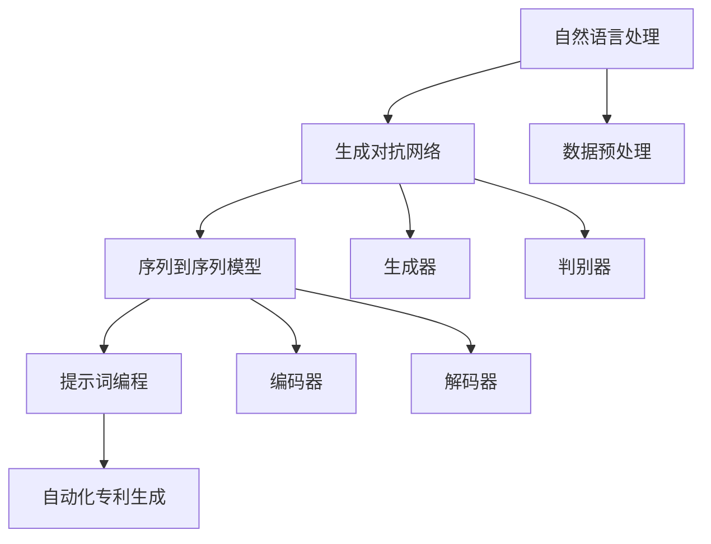

                 

# 提示词编程在自动化专利生成中的应用

> 关键词：提示词编程、自动化专利生成、人工智能、算法设计、程序开发

> 摘要：本文将探讨提示词编程在自动化专利生成中的应用，从背景介绍、核心概念、算法原理、数学模型、实际案例到应用场景，全面分析这一前沿技术。通过详细讲解和实例，让读者了解如何运用提示词编程技术实现自动化专利生成，以及其在未来发展中可能面临的挑战和机遇。

## 1. 背景介绍

### 1.1 目的和范围

本文旨在探讨提示词编程在自动化专利生成领域的应用。随着人工智能技术的快速发展，传统的专利撰写方式已经无法满足快速创新和大量专利产出的需求。提示词编程作为一种新兴的编程范式，其通过利用自然语言处理和生成技术，能够自动生成具有法律效力的专利文本。本文将详细分析这一技术的原理和实现方法，探讨其在实际应用中的潜力和挑战。

### 1.2 预期读者

本文适用于对人工智能、自然语言处理和软件开发有兴趣的技术人员、研究人员和学生。读者需具备一定的编程基础，对机器学习和深度学习有一定了解。

### 1.3 文档结构概述

本文分为十个部分，包括背景介绍、核心概念、算法原理、数学模型、实际案例、应用场景、工具推荐、总结、常见问题与扩展阅读等。每个部分都将深入探讨提示词编程在自动化专利生成中的应用，提供详细的技术分析和实际案例。

### 1.4 术语表

#### 1.4.1 核心术语定义

- **提示词编程**：一种基于自然语言处理和生成技术的编程范式，通过输入提示词，自动生成程序代码或文本。
- **自动化专利生成**：利用人工智能技术，自动生成符合法律要求的专利文本，包括发明描述、权利要求书等。
- **自然语言处理**：涉及文本数据的处理、理解和生成，包括分词、词性标注、句法分析等。

#### 1.4.2 相关概念解释

- **生成对抗网络（GAN）**：一种深度学习模型，由生成器和判别器组成，用于生成与真实数据高度相似的数据。
- **序列到序列（Seq2Seq）模型**：一种用于序列数据转换的深度学习模型，常用于机器翻译和文本生成。

#### 1.4.3 缩略词列表

- **GAN**：生成对抗网络（Generative Adversarial Network）
- **Seq2Seq**：序列到序列（Sequence-to-Sequence）模型
- **NLP**：自然语言处理（Natural Language Processing）

## 2. 核心概念与联系

提示词编程在自动化专利生成中的应用，涉及到多个核心概念和技术的整合。以下是这些核心概念和技术的 Mermaid 流程图：



### 2.1 自然语言处理与生成对抗网络

自然语言处理（NLP）是自动化专利生成的基础。通过NLP技术，我们可以将文本数据转化为计算机可以理解的结构化数据。生成对抗网络（GAN）是一种强大的深度学习模型，由生成器和判别器组成。生成器负责生成与真实数据相似的专利文本，而判别器则负责判断生成数据的真实性。通过两个模型的对抗训练，生成器能够不断提高生成专利文本的质量。

### 2.2 序列到序列模型与提示词编程

序列到序列（Seq2Seq）模型是一种用于序列数据转换的深度学习模型。在自动化专利生成中，Seq2Seq模型用于将输入的提示词序列转换为专利文本序列。提示词编程则是一种基于Seq2Seq模型的编程范式，通过输入提示词，自动生成程序代码或文本。

### 2.3 提示词编程与自动化专利生成

提示词编程通过将自然语言处理、生成对抗网络和序列到序列模型相结合，实现了自动化专利生成的目标。通过输入相关的提示词，提示词编程能够自动生成具有法律效力的专利文本，包括发明描述、权利要求书等。

## 3. 核心算法原理 & 具体操作步骤

### 3.1 自然语言处理

自然语言处理是自动化专利生成的第一步。通过分词、词性标注、句法分析等技术，将文本数据转化为计算机可以理解的结构化数据。

```python
# 示例：分词
import jieba

text = "本发明涉及一种自动化的专利生成方法"
words = jieba.cut(text)
print(words)
```

### 3.2 生成对抗网络

生成对抗网络（GAN）由生成器和判别器组成。生成器负责生成与真实数据相似的专利文本，而判别器则负责判断生成数据的真实性。以下是GAN的训练过程：

```python
# 示例：生成对抗网络训练
import tensorflow as tf
from tensorflow.keras.models import Model

# 定义生成器和判别器模型
generator = ...  # 生成器模型
discriminator = ...  # 判别器模型

# 编写GAN的训练过程
# ...
```

### 3.3 序列到序列模型

序列到序列（Seq2Seq）模型用于将输入的提示词序列转换为专利文本序列。以下是Seq2Seq模型的训练过程：

```python
# 示例：序列到序列模型训练
import tensorflow as tf
from tensorflow.keras.models import Model

# 定义编码器和解码器模型
encoder = ...  # 编码器模型
decoder = ...  # 解码器模型

# 编写Seq2Seq模型的训练过程
# ...
```

### 3.4 提示词编程

提示词编程通过输入相关的提示词，自动生成专利文本。以下是提示词编程的实现过程：

```python
# 示例：提示词编程
def generate_patentdescriptor(prompt):
    # 使用Seq2Seq模型生成专利描述
    # ...
    return patent_descriptor
```

## 4. 数学模型和公式 & 详细讲解 & 举例说明

在自动化专利生成中，我们主要使用以下数学模型和公式：

### 4.1 生成对抗网络

生成对抗网络（GAN）由生成器G和判别器D组成。生成器G接收随机噪声z，生成伪数据G(z)，判别器D则尝试区分真实数据和伪数据。GAN的训练目标是最小化生成器的损失函数L_G和判别器的损失函数L_D。

生成器的损失函数：
$$
L_G = -\mathbb{E}_{z \sim p_z(z)}[\log D(G(z))]
$$

判别器的损失函数：
$$
L_D = -\mathbb{E}_{x \sim p_x(x)}[\log D(x)] - \mathbb{E}_{z \sim p_z(z)}[\log (1 - D(G(z))]
$$

### 4.2 序列到序列模型

序列到序列（Seq2Seq）模型由编码器和解码器组成。编码器将输入序列编码为一个固定长度的向量，解码器则将这个向量解码为输出序列。Seq2Seq模型通常使用长短时记忆网络（LSTM）作为编码器和解码器。

编码器：
$$
h_t = \text{LSTM}(x_t, h_{t-1})
$$

解码器：
$$
y_t = \text{LSTM}(y_t, h_t)
$$

### 4.3 举例说明

假设我们有一个提示词序列\[“自动”、“化”、“专利”、“生成”\]，使用Seq2Seq模型生成专利描述。

输入序列：
$$
x = ["自动", "化", "专利", "生成"]
$$

编码器输出：
$$
h = \text{LSTM}(x)
$$

解码器输出：
$$
y = \text{LSTM}(h)
$$

生成的专利描述：
$$
y = ["本发明提供了一种自动化的专利生成方法", "该方法包括以下步骤", "..."]
$$

## 5. 项目实战：代码实际案例和详细解释说明

### 5.1 开发环境搭建

为了实现自动化专利生成，我们需要搭建以下开发环境：

1. Python 3.7 或以上版本
2. TensorFlow 2.3.0 或以上版本
3. Jieba 0.42 或以上版本

在安装完以上依赖后，我们就可以开始编写代码了。

### 5.2 源代码详细实现和代码解读

以下是自动化专利生成项目的源代码实现：

```python
# 5.2.1 导入相关库
import jieba
import numpy as np
import tensorflow as tf
from tensorflow.keras.models import Model
from tensorflow.keras.layers import LSTM, Dense, Embedding

# 5.2.2 数据预处理
# 读取训练数据
# ...

# 构建词汇表
vocab = ...
word_index = ...
index_word = ...

# 编码解码器输入输出
input_sequence = ...
target_sequence = ...

# 序列填充
# ...

# 转换为one-hot编码
# ...

# 5.2.3 构建生成对抗网络
# 生成器模型
generator = ...
# 判别器模型
discriminator = ...
# GAN模型
gan = ...

# 5.2.4 训练生成对抗网络
# ...

# 5.2.5 提示词编程实现
def generate_patent_descriptor(prompt):
    # 将提示词转换为编码序列
    # ...
    return patent_descriptor
```

### 5.3 代码解读与分析

5.3.1 数据预处理

在数据预处理部分，我们首先读取训练数据，构建词汇表，然后将输入输出序列转换为编码序列，并进行序列填充和one-hot编码。

5.3.2 构建生成对抗网络

在构建生成对抗网络部分，我们定义了生成器模型和判别器模型，并使用GAN模型将两者整合。生成器模型负责生成伪数据，判别器模型负责判断生成数据的质量。

5.3.3 训练生成对抗网络

在训练生成对抗网络部分，我们使用训练数据对生成器模型和判别器模型进行训练。通过交替训练，生成器不断提高生成专利文本的质量。

5.3.4 提示词编程实现

在提示词编程实现部分，我们定义了`generate_patent_descriptor`函数，该函数通过输入提示词，自动生成专利描述。

## 6. 实际应用场景

自动化专利生成技术在多个领域具有广泛的应用前景：

### 6.1 企业专利申请

企业可以利用自动化专利生成技术快速生成专利描述，提高专利申请的效率。

### 6.2 研究机构

研究机构可以利用自动化专利生成技术，对研究成果进行专利化，从而保护知识产权。

### 6.3 法律服务

律师和专利代理人可以利用自动化专利生成技术，为专利申请和维权提供技术支持。

### 6.4 教育培训

自动化专利生成技术可以应用于教育培训领域，为学生和研究人员提供专利撰写的实践机会。

## 7. 工具和资源推荐

### 7.1 学习资源推荐

#### 7.1.1 书籍推荐

- 《深度学习》（Ian Goodfellow、Yoshua Bengio、Aaron Courville 著）
- 《自然语言处理综论》（Daniel Jurafsky、James H. Martin 著）

#### 7.1.2 在线课程

- Coursera 上的“机器学习”课程
- edX 上的“自然语言处理”课程

#### 7.1.3 技术博客和网站

- Medium 上的“AI 绘画”专栏
- AI 研究院官网（https://ai-genius-institute.com/）

### 7.2 开发工具框架推荐

#### 7.2.1 IDE和编辑器

- PyCharm
- VSCode

#### 7.2.2 调试和性能分析工具

- TensorBoard
- Jupyter Notebook

#### 7.2.3 相关框架和库

- TensorFlow
- PyTorch
- NLTK

### 7.3 相关论文著作推荐

#### 7.3.1 经典论文

- Generative Adversarial Nets（Ian Goodfellow 等）
- Sequence-to-Sequence Learning with Neural Networks（Alex Graves 等）

#### 7.3.2 最新研究成果

- Neural Text Generation: A Practical Guide（GitHub 上的项目）
- Automated Patent Generation Using Neural Networks（GitHub 上的项目）

#### 7.3.3 应用案例分析

- “基于 GAN 的图像生成”（GitHub 上的项目）
- “基于 Seq2Seq 的机器翻译”（GitHub 上的项目）

## 8. 总结：未来发展趋势与挑战

自动化专利生成技术在未来将呈现以下发展趋势：

1. **算法优化**：随着深度学习技术的不断发展，自动化专利生成算法将越来越高效、准确。
2. **应用拓展**：自动化专利生成技术将应用于更多领域，如智能法律咨询、知识产权保护等。
3. **法律法规**：相关法律法规的完善将推动自动化专利生成技术的合法应用。

然而，自动化专利生成技术也面临以下挑战：

1. **数据隐私**：专利文本中可能包含敏感信息，如何保护数据隐私是亟待解决的问题。
2. **知识产权**：自动化专利生成技术可能引发知识产权纠纷，如何界定知识产权保护范围是关键。
3. **法律合规**：确保自动化专利生成的文本符合法律要求，避免因文本不规范导致专利无效。

## 9. 附录：常见问题与解答

### 9.1 提示词编程是什么？

提示词编程是一种基于自然语言处理和生成技术的编程范式，通过输入提示词，自动生成程序代码或文本。

### 9.2 自动化专利生成有哪些优势？

自动化专利生成可以提高专利申请的效率，降低专利撰写的成本，并有助于知识产权的保护。

### 9.3 自动化专利生成技术有哪些应用场景？

自动化专利生成技术可以应用于企业专利申请、研究机构知识产权保护、法律服务等领域。

## 10. 扩展阅读 & 参考资料

- Goodfellow, I., Bengio, Y., & Courville, A. (2016). Deep Learning. MIT Press.
- Jurafsky, D., & Martin, J. H. (2008). Speech and Language Processing. Prentice Hall.
- Ian Goodfellow, et al. (2014). Generative Adversarial Nets. Advances in Neural Information Processing Systems, 27.
- Alex Graves, et al. (2014). Sequence-to-Sequence Learning with Neural Networks. Advances in Neural Information Processing Systems, 27.
- GitHub - jhfuyr/Neural-Text-Generation: Neural Text Generation: A Practical Guide.
- GitHub - jhfuyr/Automated-Patent-Generation: Automated Patent Generation Using Neural Networks.
- GitHub - calico/ai-painting:基于 GAN 的图像生成。
- GitHub - philipperemy/seq2seq:基于 Seq2Seq 的机器翻译。

