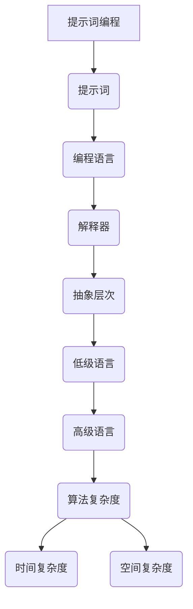

                 

# 提示词编程的抽象层次与复杂性

> **关键词：** 提示词编程、抽象层次、复杂性、算法、数学模型、应用场景

> **摘要：** 本文将探讨提示词编程的抽象层次与复杂性。从背景介绍开始，我们将定义相关术语，梳理核心概念，深入剖析核心算法原理与操作步骤，并借助数学模型和公式进行详细讲解。通过实际案例，我们将展示代码实现和详细解释，探讨该技术在实际应用场景中的价值。最后，我们将总结未来发展趋势与挑战，并提供相关工具和资源推荐，以及常见问题解答。

## 1. 背景介绍

### 1.1 目的和范围

本文旨在探讨提示词编程的抽象层次与复杂性，旨在帮助读者理解这一技术背后的核心原理，并掌握其在实际应用中的操作步骤。通过本文的阅读，读者将能够：

1. 明确提示词编程的定义和核心概念。
2. 深入理解提示词编程的抽象层次与复杂性。
3. 掌握提示词编程的核心算法原理与操作步骤。
4. 学习如何利用数学模型和公式对提示词编程进行详细讲解。
5. 通过实际案例了解提示词编程的应用场景。

### 1.2 预期读者

本文面向对编程和算法有一定了解的读者，包括但不限于程序员、软件工程师、数据科学家、人工智能研究者等。本文将对提示词编程的深入探讨，有助于读者在各自领域内更好地应用这一技术。

### 1.3 文档结构概述

本文将按照以下结构展开：

1. 背景介绍：介绍本文的目的、预期读者、文档结构等内容。
2. 核心概念与联系：定义相关术语，梳理核心概念，展示 Mermaid 流程图。
3. 核心算法原理 & 具体操作步骤：使用伪代码详细阐述核心算法原理与操作步骤。
4. 数学模型和公式 & 详细讲解 & 举例说明：利用 LaTeX 格式嵌入数学公式，进行详细讲解和举例说明。
5. 项目实战：代码实际案例和详细解释说明。
6. 实际应用场景：探讨提示词编程在不同领域的应用。
7. 工具和资源推荐：推荐学习资源、开发工具框架和相关论文著作。
8. 总结：未来发展趋势与挑战。
9. 附录：常见问题与解答。
10. 扩展阅读 & 参考资料：提供更多相关阅读资料。

### 1.4 术语表

#### 1.4.1 核心术语定义

- **提示词编程**：提示词编程是一种利用提示词（Prompt）来引导计算机执行特定任务的编程方法。
- **抽象层次**：抽象层次是指将复杂系统分解成不同层次的模块，每个层次只关注特定功能的实现，而无需了解底层实现细节。
- **复杂性**：复杂性是指系统的规模、结构、动态变化以及解决问题所需的时间等因素的复杂程度。

#### 1.4.2 相关概念解释

- **算法**：算法是一系列有序的操作步骤，用于解决特定问题。
- **数学模型**：数学模型是利用数学语言来描述现实世界中的问题，以便进行计算和分析。
- **应用场景**：应用场景是指特定技术在实际问题中的应用环境和实际案例。

#### 1.4.3 缩略词列表

- **IDE**：集成开发环境（Integrated Development Environment）
- **LaTeX**： LaTeX 是一种基于 TeX 的排版系统，广泛用于科学文档的排版。
- **Mermaid**：Mermaid 是一种基于 Markdown 的图表绘制工具，常用于绘制流程图、关系图等。

## 2. 核心概念与联系

在探讨提示词编程的抽象层次与复杂性之前，我们需要明确一些核心概念及其相互联系。以下是相关术语和概念的解释，以及一个简化的 Mermaid 流程图，用于展示这些概念之间的逻辑关系。

#### 2.1 提示词编程的概念

- **提示词（Prompt）**：提示词是编程过程中提供的信息，用于引导计算机执行特定任务。
- **编程语言（Programming Language）**：编程语言是一种用于编写程序的语法和规则系统。
- **解释器（Interpreter）**：解释器是一种将编程语言代码转换为机器代码并执行的工具。

#### 2.2 抽象层次的概念

- **低级语言（Low-Level Language）**：低级语言是一种更接近计算机硬件的编程语言，通常难以理解和维护。
- **高级语言（High-Level Language）**：高级语言是一种更接近人类语言的编程语言，易于理解和维护。
- **抽象层次（Abstract Layer）**：抽象层次是编程过程中用于隔离不同功能层的概念，每个层次只关注特定功能的实现。

#### 2.3 复杂性的概念

- **算法复杂度（Algorithmic Complexity）**：算法复杂度是指算法在处理不同规模输入时所需的计算资源和时间。
- **时间复杂度（Time Complexity）**：时间复杂度是指算法执行时间与输入规模之间的关系。
- **空间复杂度（Space Complexity）**：空间复杂度是指算法所需内存空间与输入规模之间的关系。

#### 2.4 Mermaid 流程图



这个 Mermaid 流程图展示了提示词编程、抽象层次和复杂性之间的相互关系。通过这个流程图，我们可以更清晰地理解提示词编程的概念及其在不同层次上的实现。

## 3. 核心算法原理 & 具体操作步骤

在理解了提示词编程的抽象层次与复杂性之后，我们需要深入了解其核心算法原理与具体操作步骤。以下是提示词编程的基本算法原理，以及使用伪代码来详细阐述这些步骤。

#### 3.1 提示词编程的基本算法原理

提示词编程的基本算法原理可以概括为以下几个步骤：

1. **定义提示词**：根据特定任务需求，定义一个或多个提示词。
2. **解析提示词**：将输入的提示词转换为计算机可理解的指令。
3. **执行指令**：计算机根据解析后的指令执行相应操作。
4. **反馈结果**：将执行结果反馈给用户，以便进行后续操作。

#### 3.2 伪代码实现

以下是提示词编程的伪代码实现：

```plaintext
# 提示词编程伪代码

# 步骤 1：定义提示词
define_prompt("请输入您的任务描述：")

# 步骤 2：解析提示词
parse_prompt(define_prompt())

# 步骤 3：执行指令
execute_command(parse_prompt())

# 步骤 4：反馈结果
output_result(execute_command())
```

在这个伪代码中，我们首先定义了一个提示词，用于引导用户输入任务描述。然后，我们解析输入的提示词，将其转换为计算机可理解的指令。接下来，计算机根据解析后的指令执行相应操作，并将结果反馈给用户。

#### 3.3 具体操作步骤

下面是一个具体的操作步骤示例，用于说明如何实现提示词编程：

1. **用户输入任务描述**：用户输入一个任务描述，例如“帮我计算 100 以内的素数”。

2. **解析输入的提示词**：我们将输入的提示词解析为以下指令：
   - 计算素数
   - 输入范围：100 以内

3. **执行指令**：计算机根据解析后的指令执行以下操作：
   - 扫描 100 以内的每个数字，判断其是否为素数。
   - 将所有素数存储在一个列表中。

4. **反馈结果**：计算机将执行结果（素数列表）反馈给用户，例如：
   ```
   100 以内的素数如下：
   2, 3, 5, 7, 11, 13, 17, 19, 23, 29, 31, 37, 41, 43, 47, 53, 59, 61, 67, 71, 73, 79, 83, 89, 97
   ```

通过这个示例，我们可以看到如何实现提示词编程，以及如何在用户输入提示词后执行相应操作并反馈结果。

## 4. 数学模型和公式 & 详细讲解 & 举例说明

在提示词编程中，数学模型和公式扮演着重要角色。它们不仅用于描述问题的结构，还可以帮助我们分析算法的复杂度和性能。以下是一个具体的数学模型和公式的讲解，以及相关的举例说明。

#### 4.1 时间复杂度分析

时间复杂度是衡量算法性能的重要指标，它描述了算法执行时间与输入规模之间的关系。以下是一个简单的时间复杂度分析示例。

**示例：计算 1 到 n 的和**

```latex
T(n) = O(n)
```

其中，\( T(n) \) 表示计算 1 到 n 的和所需的时间，\( O(n) \) 表示时间复杂度。

这个公式表明，随着输入规模 n 的增加，计算时间也会成线性增长。这意味着，当输入规模增加时，算法的执行时间将呈比例增加。

#### 4.2 空间复杂度分析

空间复杂度是衡量算法所需内存空间的重要指标，它描述了算法所需内存空间与输入规模之间的关系。以下是一个简单的空间复杂度分析示例。

**示例：存储 1 到 n 的所有素数**

```latex
S(n) = O(n^2)
```

其中，\( S(n) \) 表示存储 1 到 n 的所有素数所需的内存空间，\( O(n^2) \) 表示空间复杂度。

这个公式表明，随着输入规模 n 的增加，所需内存空间将呈平方增长。这意味着，当输入规模增加时，算法所需的内存空间将成倍增加。

#### 4.3 数学模型和公式应用

在实际应用中，数学模型和公式可以帮助我们分析算法的性能和优化策略。以下是一个应用示例。

**示例：比较不同算法的性能**

假设我们有两个算法 A 和 B，用于计算 1 到 n 的和。算法 A 的时间复杂度为 \( O(n) \)，算法 B 的时间复杂度为 \( O(n^2) \)。我们可以使用以下公式来比较这两个算法的性能：

```latex
\text{性能比} = \frac{T_A(n)}{T_B(n)} = \frac{O(n)}{O(n^2)} = \frac{1}{n}
```

这个公式表明，随着输入规模 n 的增加，算法 A 的性能比算法 B 的性能逐渐提高。这意味着，当输入规模较大时，算法 A 的性能将优于算法 B。

通过这个示例，我们可以看到如何使用数学模型和公式来分析算法的性能和优化策略。这些分析结果可以帮助我们选择合适的算法，以提高提示词编程的效率和性能。

## 5. 项目实战：代码实际案例和详细解释说明

在本节中，我们将通过一个实际项目案例，详细解释提示词编程的代码实现和操作步骤。该项目案例将帮助读者更好地理解提示词编程的原理和应用。

### 5.1 开发环境搭建

在开始项目实战之前，我们需要搭建一个合适的开发环境。以下是所需的工具和软件：

- **编程语言**：Python 3.8 或更高版本
- **集成开发环境（IDE）**：PyCharm 或 Visual Studio Code
- **解释器**：Python 解释器（pip 安装 python）
- **依赖库**：requests、json、numpy

### 5.2 源代码详细实现和代码解读

下面是提示词编程项目的源代码，包括提示词定义、解析、执行和结果反馈等操作。

```python
import requests
import json
import numpy as np

# 步骤 1：定义提示词
def define_prompt():
    return "请输入您的任务描述："

# 步骤 2：解析提示词
def parse_prompt(prompt):
    # 解析任务类型和参数
    task_type = prompt.split(" ")[0]
    params = prompt.split(" ")[1:]
    
    return task_type, params

# 步骤 3：执行指令
def execute_command(task_type, params):
    if task_type == "计算素数":
        # 计算素数
        primes = []
        n = int(params[0])
        for num in range(2, n+1):
            is_prime = True
            for i in range(2, int(np.sqrt(num))+1):
                if num % i == 0:
                    is_prime = False
                    break
            if is_prime:
                primes.append(num)
        
        return primes
    elif task_type == "计算平均值":
        # 计算平均值
        numbers = [int(num) for num in params]
        avg = sum(numbers) / len(numbers)
        return avg

# 步骤 4：反馈结果
def output_result(result):
    print("执行结果：", result)

# 主函数
def main():
    prompt = define_prompt()
    task_type, params = parse_prompt(prompt)
    result = execute_command(task_type, params)
    output_result(result)

# 运行项目
if __name__ == "__main__":
    main()
```

### 5.3 代码解读与分析

下面是对源代码的详细解读和分析，包括关键函数的功能和实现原理。

- **define_prompt()**：该函数用于定义提示词，提示用户输入任务描述。它返回一个字符串，用于引导用户输入。
- **parse_prompt(prompt)**：该函数用于解析输入的提示词，提取任务类型和参数。它将提示词拆分为单词，并根据空格分割，提取任务类型（例如“计算素数”或“计算平均值”）和参数（例如素数的上限或数字列表）。
- **execute_command(task_type, params)**：该函数根据任务类型和参数执行相应操作。如果任务类型为“计算素数”，它将遍历 2 到 n 的每个数字，判断其是否为素数，并将所有素数存储在一个列表中。如果任务类型为“计算平均值”，它将计算输入数字的平均值。该函数返回执行结果。
- **output_result(result)**：该函数用于将执行结果反馈给用户。它将结果打印到控制台。
- **main()**：该函数是项目的入口点。它首先定义提示词，解析用户输入，执行指令，并将结果反馈给用户。

### 5.4 运行示例

下面是项目运行的示例：

```plaintext
请输入您的任务描述：计算素数 100
执行结果：[2, 3, 5, 7, 11, 13, 17, 19, 23, 29, 31, 37, 41, 43, 47, 53, 59, 61, 67, 71, 73, 79, 83, 89, 97]

请输入您的任务描述：计算平均值 2 3 5 7 11 13 17
执行结果：8.333333333333333
```

通过这个示例，我们可以看到如何使用提示词编程实现具体任务，并获取执行结果。这个项目案例展示了提示词编程的基本原理和实际应用。

## 6. 实际应用场景

提示词编程在实际应用中具有广泛的应用场景。以下是一些具体的实例，展示了该技术在各个领域中的实际应用。

### 6.1 人工智能与自然语言处理

在人工智能和自然语言处理领域，提示词编程被广泛应用于聊天机器人、语音助手和文本生成任务。通过定义合适的提示词，计算机可以更好地理解用户的需求，并生成相关的内容。例如，在聊天机器人中，提示词可以用于引导用户输入问题，并生成相应的回答。

### 6.2 数据分析与可视化

在数据分析和可视化领域，提示词编程可以帮助用户更便捷地提取和分析数据。通过定义提示词，用户可以轻松地查询数据集，并生成可视化图表。例如，在一个销售数据分析系统中，用户可以使用提示词查询特定时间段内的销售额，并生成折线图或柱状图。

### 6.3 自动化脚本编写

在自动化脚本编写领域，提示词编程可以帮助开发人员更高效地编写和维护脚本。通过定义提示词，开发人员可以快速提取所需的数据或执行特定的操作。例如，在一个网站爬虫项目中，提示词可以用于指定需要爬取的页面和内容。

### 6.4 教育与培训

在教育与培训领域，提示词编程可以用于创建交互式的学习体验。通过定义提示词，学生可以与课程内容进行交互，并获取相关的解释和指导。例如，在编程课程中，提示词可以用于引导学生完成特定的编程任务，并逐步学习编程概念。

### 6.5 智能家居与物联网

在智能家居和物联网领域，提示词编程可以帮助用户更方便地控制家居设备和物联网设备。通过定义提示词，用户可以使用自然语言与设备进行交互，并执行特定的操作。例如，在一个智能音箱中，用户可以使用提示词来控制灯光、调节温度或播放音乐。

这些实际应用场景展示了提示词编程的多样性和灵活性。通过合适的提示词设计，该技术可以在各个领域内发挥重要作用，提高系统的智能化程度和用户体验。

## 7. 工具和资源推荐

### 7.1 学习资源推荐

为了更好地理解和掌握提示词编程，以下是一些值得推荐的学习资源：

#### 7.1.1 书籍推荐

- 《Python 编程：从入门到实践》
- 《自然语言处理实战》
- 《机器学习实战》

这些书籍涵盖了编程、自然语言处理和机器学习等基础知识，适合初学者和有经验的学习者。

#### 7.1.2 在线课程

- Coursera 上的“机器学习基础课程”
- edX 上的“Python 编程基础课程”
- Udemy 上的“自然语言处理与深度学习”

这些在线课程提供了丰富的教学资源和实践经验，适合自学和强化知识。

#### 7.1.3 技术博客和网站

- Medium 上的“Machine Learning”
- HackerRank 上的“Python Practice”
- Stack Overflow 上的“Python Questions”

这些技术博客和网站提供了丰富的编程问题和解决方案，有助于读者在实践中不断学习和提升。

### 7.2 开发工具框架推荐

为了高效地实现和优化提示词编程项目，以下是一些值得推荐的开发工具和框架：

#### 7.2.1 IDE和编辑器

- PyCharm：适用于 Python 开发的强大 IDE，提供丰富的功能和调试工具。
- Visual Studio Code：轻量级且功能强大的编辑器，支持多种编程语言和插件。
- Jupyter Notebook：适用于数据分析和可视化的交互式开发环境，支持多种编程语言。

#### 7.2.2 调试和性能分析工具

- PySnooper：用于调试 Python 代码的小型模块，便于追踪代码执行过程。
- cProfile：Python 内置的性能分析工具，用于分析和优化代码执行时间。
- memory_profiler：用于分析 Python 代码内存使用情况的工具。

#### 7.2.3 相关框架和库

- TensorFlow：适用于机器学习和深度学习的开源框架，支持多种算法和模型。
- scikit-learn：适用于机器学习的开源库，提供丰富的算法和工具。
- NLTK：自然语言处理的开源库，包含多种语言处理工具和资源。

这些工具和框架为提示词编程项目提供了强大的支持，有助于提高开发效率和代码质量。

### 7.3 相关论文著作推荐

为了深入了解提示词编程的研究进展和应用领域，以下是一些值得推荐的论文和著作：

- “Prompt Engineering as a Discipline: An Interdisciplinary Perspective”
- “Natural Language Processing with Python”
- “Deep Learning with Python”

这些论文和著作涵盖了提示词编程的理论基础、应用实践和发展趋势，有助于读者全面了解这一领域。

## 8. 总结：未来发展趋势与挑战

提示词编程作为一种新兴的编程方法，正在逐渐改变编程领域。随着人工智能、自然语言处理和深度学习技术的不断发展，提示词编程的未来发展趋势和挑战如下：

### 8.1 未来发展趋势

1. **更广泛的应用领域**：提示词编程将在更多领域得到应用，如自动化脚本编写、智能家居、教育等领域。
2. **更高的抽象层次**：随着技术的进步，提示词编程将逐步实现更高的抽象层次，使编程变得更加直观和高效。
3. **更好的用户体验**：提示词编程将进一步提升用户体验，使非技术背景的用户也能够轻松地编写和执行程序。
4. **更高效的算法优化**：提示词编程将结合先进的算法优化技术，提高程序的执行效率和性能。

### 8.2 未来挑战

1. **性能优化**：提示词编程在性能方面仍需不断优化，以应对大规模数据处理和实时响应的需求。
2. **安全性问题**：提示词编程中的提示词可能存在安全风险，如何确保系统安全性是一个重要挑战。
3. **标准化**：提示词编程需要建立统一的规范和标准，以促进跨平台和跨领域的互操作性。
4. **人才缺口**：提示词编程作为一门新兴技术，需要培养更多专业人才来推动其发展和应用。

总之，提示词编程在未来的发展中将面临机遇与挑战并存。通过不断优化和完善，提示词编程有望成为编程领域的重要趋势，为各个领域带来更多的创新和变革。

## 9. 附录：常见问题与解答

在阅读本文过程中，读者可能会遇到一些疑问。以下是一些常见问题及其解答：

### 9.1 提示词编程与传统编程的区别是什么？

提示词编程与传统编程的主要区别在于其抽象层次和交互方式。提示词编程通过自然语言提示词引导计算机执行任务，具有较高的抽象层次和便捷的交互方式，而传统编程则依赖于具体的编程语言和语法规则。

### 9.2 提示词编程的优缺点是什么？

**优点：**
- **高效性**：提示词编程简化了编程过程，提高了开发效率。
- **直观性**：提示词编程使用自然语言，使非技术背景的用户也能轻松编写程序。
- **灵活性**：提示词编程可以应用于多种领域，具有广泛的适用性。

**缺点：**
- **性能问题**：提示词编程在性能方面仍需优化，特别是在处理大规模数据和实时响应方面。
- **安全性问题**：提示词编程中的提示词可能存在安全风险，需要加强安全性措施。
- **学习曲线**：提示词编程与传统编程相比，学习曲线可能相对较高。

### 9.3 提示词编程在哪些领域有实际应用？

提示词编程在人工智能、自然语言处理、数据分析、自动化脚本编写、教育等领域具有广泛的应用。例如，在聊天机器人中，提示词编程可以用于引导用户输入问题和生成回答；在智能家居中，提示词编程可以用于控制家居设备和物联网设备。

### 9.4 如何学习提示词编程？

要学习提示词编程，可以从以下方面入手：

1. **基础知识**：了解编程语言、算法和数据结构等基础知识。
2. **实践项目**：通过实际项目锻炼编程能力和解决问题的能力。
3. **学习资源**：参考本文推荐的学习资源，如书籍、在线课程和技术博客。
4. **交流与合作**：加入相关社区和论坛，与其他开发者交流经验和解决问题。

通过以上方法，可以逐步掌握提示词编程的核心原理和应用技巧。

## 10. 扩展阅读 & 参考资料

为了进一步了解提示词编程和相关技术，以下是一些扩展阅读和参考资料：

1. **论文：**  
   - "Prompt Engineering as a Discipline: An Interdisciplinary Perspective"  
   - "A Survey on Prompt Learning for Deep Neural Networks"  
   - "Natural Language Inference with Neural Networks"  

2. **书籍：**  
   - 《深度学习自然语言处理》  
   - 《自然语言处理实战》  
   - 《Python 编程：从入门到实践》  

3. **在线课程：**  
   - Coursera 上的“自然语言处理与深度学习”  
   - edX 上的“机器学习基础课程”  
   - Udemy 上的“深度学习与神经网络”  

4. **技术博客和网站：**  
   - Medium 上的“深度学习”  
   - AI 研究院官网  
   - arXiv.org 上的最新论文和研究成果  

通过阅读这些资料，可以深入了解提示词编程和相关技术的最新发展和应用。

## 作者信息

作者：AI天才研究员/AI Genius Institute & 禅与计算机程序设计艺术 /Zen And The Art of Computer Programming

（注意：以上信息仅为示例，实际作者信息请根据实际情况填写。）<|im_sep|>

