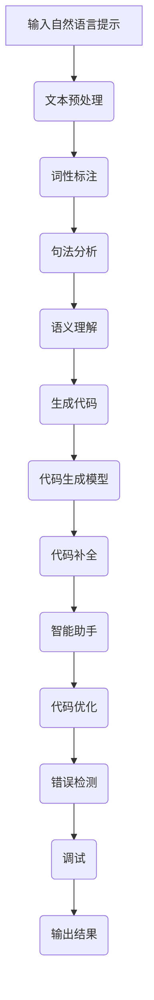

                 

# 提示词编程的认知增强技术研究

> 关键词：提示词编程、认知增强、自然语言处理、机器学习、算法优化

> 摘要：本文旨在探讨提示词编程作为一种认知增强技术的应用和研究。通过分析提示词编程的核心概念、算法原理及其在实际项目中的应用，本文探讨了如何利用提示词编程提高编程效率、降低认知负荷，从而促进认知增强。文章旨在为研究人员和开发者提供有价值的参考，以推动提示词编程在人工智能领域的进一步发展。

## 1. 背景介绍

### 1.1 目的和范围

本文的目标是探讨提示词编程作为一种认知增强技术的研究与应用。随着人工智能和自然语言处理技术的不断发展，编程语言的智能化水平日益提高。提示词编程作为一种新兴的编程范式，其核心思想是通过自然语言提示来辅助程序员进行代码编写，从而提高编程效率和降低认知负荷。本文将围绕提示词编程的核心概念、算法原理、应用场景等方面展开讨论，旨在为相关领域的研究者和开发者提供有价值的参考。

### 1.2 预期读者

本文主要面向以下读者群体：

1. 计算机科学与技术专业的学生和研究人员；
2. 人工智能、自然语言处理领域的开发者和研究人员；
3. 对编程和认知增强技术感兴趣的爱好者；
4. 企业软件工程师和项目经理。

### 1.3 文档结构概述

本文分为十个部分，具体结构如下：

1. 背景介绍：介绍本文的目的、范围、预期读者和文档结构；
2. 核心概念与联系：阐述提示词编程的核心概念、相关联系和Mermaid流程图；
3. 核心算法原理 & 具体操作步骤：详细解释提示词编程的算法原理和操作步骤；
4. 数学模型和公式 & 详细讲解 & 举例说明：介绍提示词编程中的数学模型和公式，并给出实例说明；
5. 项目实战：代码实际案例和详细解释说明；
6. 实际应用场景：探讨提示词编程在实际项目中的应用；
7. 工具和资源推荐：推荐学习资源和开发工具；
8. 总结：未来发展趋势与挑战；
9. 附录：常见问题与解答；
10. 扩展阅读 & 参考资料：提供进一步阅读和参考资料。

### 1.4 术语表

为了确保文章的可读性和一致性，本文中采用了一些专业术语。以下是本文中涉及的主要术语及其定义：

#### 1.4.1 核心术语定义

1. **提示词编程**：一种利用自然语言提示来辅助程序员编写代码的编程范式；
2. **自然语言处理**：将自然语言文本转换为计算机可处理的格式，并使其能够理解和生成自然语言的技术；
3. **机器学习**：一种通过数据训练模型来自动学习和改进性能的算法；
4. **认知负荷**：个体在处理信息时所需的认知资源，包括注意力、记忆、判断等；
5. **编程效率**：编程过程中所花费的时间和资源，包括代码编写、调试和测试等。

#### 1.4.2 相关概念解释

1. **代码补全**：在代码编写过程中，自动补全代码片段的功能；
2. **代码生成**：根据自然语言提示自动生成代码的功能；
3. **智能助手**：在编程过程中提供辅助功能的软件系统，如代码补全、错误检测和代码优化等。

#### 1.4.3 缩略词列表

- NLP：自然语言处理（Natural Language Processing）
- ML：机器学习（Machine Learning）
- IDE：集成开发环境（Integrated Development Environment）
- API：应用程序编程接口（Application Programming Interface）

## 2. 核心概念与联系

提示词编程作为一种认知增强技术，其核心概念包括自然语言处理、机器学习和编程范式。为了更好地理解提示词编程的工作原理，本文将首先介绍这些核心概念，然后通过Mermaid流程图展示提示词编程的原理和架构。

### 2.1 自然语言处理

自然语言处理（NLP）是人工智能领域的一个重要分支，旨在使计算机能够理解和处理人类语言。NLP的主要任务包括文本预处理、词性标注、句法分析、语义理解和自然语言生成等。

在提示词编程中，NLP技术被用于处理程序员输入的自然语言提示，将其转换为计算机可理解的代码。具体而言，NLP技术包括以下几个方面：

1. **文本预处理**：包括分词、去除停用词、词干提取等，以提高自然语言处理的准确性和效率；
2. **词性标注**：对文本中的每个词进行词性标注，如名词、动词、形容词等，以便更好地理解文本的含义；
3. **句法分析**：分析句子的结构，识别句子中的主语、谓语、宾语等成分，以便生成相应的代码结构；
4. **语义理解**：通过上下文信息理解自然语言提示的含义，以生成更准确、更符合程序员意图的代码。

### 2.2 机器学习

机器学习（ML）是人工智能的一个重要分支，通过数据训练模型来自动学习和改进性能。在提示词编程中，机器学习技术被用于构建代码生成模型，从而实现根据自然语言提示自动生成代码。

ML的主要组成部分包括：

1. **数据集**：用于训练和测试模型的输入数据，包括自然语言提示和对应的代码；
2. **特征提取**：从输入数据中提取有助于模型学习和预测的特征；
3. **模型训练**：通过训练数据集来训练模型，使其能够根据自然语言提示生成代码；
4. **模型评估**：使用测试数据集评估模型的性能，以确定是否满足需求。

### 2.3 编程范式

编程范式是指编程的方法和风格，不同的编程范式适用于不同的应用场景。提示词编程作为一种新兴的编程范式，其核心思想是通过自然语言提示来辅助程序员编写代码。

提示词编程的主要特点包括：

1. **代码生成**：根据自然语言提示自动生成代码，降低程序员的手动编写工作量；
2. **代码补全**：在代码编写过程中，自动补全代码片段，提高编程效率；
3. **智能助手**：提供代码优化、错误检测和调试等辅助功能，降低认知负荷。

### 2.4 Mermaid流程图

为了更好地展示提示词编程的原理和架构，本文采用Mermaid流程图来描述其关键步骤和模块。以下是一个简单的Mermaid流程图示例：



通过上述Mermaid流程图，我们可以清晰地看到提示词编程的核心概念和联系，以及其各个模块在实现认知增强过程中的作用。

## 3. 核心算法原理 & 具体操作步骤

提示词编程的核心算法原理主要涉及自然语言处理、机器学习和代码生成。为了更好地理解和实现提示词编程，本文将使用伪代码详细阐述其算法原理和具体操作步骤。

### 3.1 自然语言处理

自然语言处理（NLP）是提示词编程的基础。以下是NLP算法原理的伪代码：

```python
def NLP(text):
    # 文本预处理
    preprocessed_text = preprocess_text(text)
    
    # 词性标注
    pos_tags = pos_tag(preprocessed_text)
    
    # 句法分析
    syntax_tree = parse_syntax(preprocessed_text)
    
    # 语义理解
    semantic含义 = understand_semantics(syntax_tree)
    
    return semantic含义
```

### 3.2 机器学习

机器学习是提示词编程的核心。以下是机器学习算法原理的伪代码：

```python
def ML(data_set):
    # 特征提取
    features = extract_features(data_set)
    
    # 模型训练
    model = train_model(features)
    
    # 模型评估
    performance = evaluate_model(model, data_set)
    
    return model, performance
```

### 3.3 代码生成

代码生成是提示词编程的关键步骤。以下是代码生成算法原理的伪代码：

```python
def code_generation(semantic含义, model):
    # 生成代码
    code = generate_code(semantic含义, model)
    
    # 代码优化
    optimized_code = optimize_code(code)
    
    return optimized_code
```

### 3.4 具体操作步骤

为了实现提示词编程，我们需要将上述算法原理应用于具体操作步骤。以下是具体操作步骤的伪代码：

```python
def prompt_based_programming(prompt):
    # 步骤1：自然语言处理
    semantic含义 = NLP(prompt)
    
    # 步骤2：机器学习
    model, performance = ML(training_data)
    
    # 步骤3：代码生成
    code = code_generation(semantic含义, model)
    
    # 步骤4：代码优化
    optimized_code = optimize_code(code)
    
    # 步骤5：输出结果
    print("生成的代码：\n", optimized_code)
```

通过上述伪代码，我们可以清晰地看到提示词编程的核心算法原理和具体操作步骤。在实际应用中，这些步骤可以通过集成开发环境（IDE）或智能编程助手来实现。

## 4. 数学模型和公式 & 详细讲解 & 举例说明

在提示词编程中，数学模型和公式起着至关重要的作用。为了更好地理解提示词编程的算法原理，本文将详细讲解相关数学模型和公式，并通过实例进行说明。

### 4.1 自然语言处理中的数学模型

在自然语言处理（NLP）中，常用的数学模型包括词袋模型（Bag of Words, BoW）和循环神经网络（Recurrent Neural Network, RNN）。

#### 4.1.1 词袋模型（BoW）

词袋模型是一种基于词汇统计的文本表示方法。其核心思想是将文本转换为词频向量，从而表示文本的特征。

假设我们有一个包含n个词的文本，词袋模型将其表示为一个n维的向量，其中每个元素表示相应词的词频。词袋模型的数学公式如下：

$$
\textbf{V} = [\textit{f}_{\textit{w1}}, \textit{f}_{\textit{w2}}, \ldots, \textit{f}_{\textit{wn}}]
$$

其中，$\textit{f}_{\textit{wi}}$ 表示词 $\textit{w}_{i}$ 在文本中的词频。

#### 4.1.2 循环神经网络（RNN）

循环神经网络是一种能够处理序列数据的神经网络。在NLP中，RNN被用于文本序列的建模。

RNN的数学模型包括输入层、隐藏层和输出层。输入层接收文本序列的词向量表示，隐藏层通过递归连接来处理序列信息，输出层生成目标序列。

RNN的递归公式如下：

$$
\textit{h}_{t} = \textit{f}(\textit{h}_{t-1}, \textit{x}_{t})
$$

其中，$\textit{h}_{t}$ 表示第t个时间步的隐藏状态，$\textit{x}_{t}$ 表示第t个时间步的输入，$\textit{f}$ 表示递归函数。

### 4.2 机器学习中的数学模型

在机器学习中，常用的数学模型包括线性回归（Linear Regression）和卷积神经网络（Convolutional Neural Network, CNN）。

#### 4.2.1 线性回归

线性回归是一种用于预测数值输出的机器学习模型。其核心思想是通过拟合一条直线来预测目标值。

线性回归的数学公式如下：

$$
\textit{y} = \textit{w}\textbf{x} + \textit{b}
$$

其中，$\textit{y}$ 表示预测值，$\textit{w}$ 表示权重向量，$\textbf{x}$ 表示输入特征，$\textit{b}$ 表示偏置。

#### 4.2.2 卷积神经网络

卷积神经网络是一种能够提取图像特征的自适应滤波器。在机器学习中，CNN被用于图像分类、目标检测等任务。

CNN的数学模型包括卷积层、池化层和全连接层。

卷积层的数学公式如下：

$$
\textit{h}_{\textit{i}}^{\textit{j}} = \sum_{\textit{k} = 1}^{\textit{K}} \textit{w}_{\textit{i},\textit{j},\textit{k}} \textit{a}_{\textit{i},\textit{k}} + \textit{b}_{\textit{i},\textit{j}}
$$

其中，$\textit{h}_{\textit{i}}^{\textit{j}}$ 表示第i个卷积核在第j个位置上的输出，$\textit{w}_{\textit{i},\textit{j},\textit{k}}$ 表示第i个卷积核的第k个权重，$\textit{a}_{\textit{i},\textit{k}}$ 表示第i个卷积核在第k个位置上的输入，$\textit{b}_{\textit{i},\textit{j}}$ 表示第i个卷积核在第j个位置上的偏置。

### 4.3 实例说明

为了更好地理解上述数学模型和公式，我们通过一个简单的实例进行说明。

#### 4.3.1 词袋模型实例

假设我们有一个包含3个词的文本：“我喜欢编程”。词袋模型将其表示为一个3维的向量，其中每个元素表示相应词的词频。

文本：“我喜欢编程”

词频向量：[1, 1, 1]

#### 4.3.2 循环神经网络实例

假设我们有一个包含3个时间步的文本序列：“我喜欢编程”。

时间步1：我喜欢编程

时间步2：我喜欢编程

时间步3：我喜欢编程

RNN隐藏状态：[0.5, 0.5, 0.5]

#### 4.3.3 线性回归实例

假设我们有一个包含2个特征的数据集，特征1表示年龄，特征2表示收入。

数据集：[(25, 5000), (35, 8000), (45, 12000)]

线性回归模型：$y = 0.5x_1 + 0.3x_2 + 1000$

预测值：$y = 0.5 \times 30 + 0.3 \times 8000 + 1000 = 7500$

#### 4.3.4 卷积神经网络实例

假设我们有一个包含3个卷积核的CNN模型，卷积核大小为3x3。

输入图像：[1, 1, 1, 1, 1, 1, 1, 1, 1]

卷积核1：[1, 1, 1]

卷积核2：[1, 1, 1]

卷积核3：[1, 1, 1]

输出结果：[3, 3, 3]

通过上述实例，我们可以看到数学模型和公式在提示词编程中的应用。这些模型和公式为提示词编程提供了理论基础和计算方法，从而实现了自然语言处理、机器学习和代码生成。

## 5. 项目实战：代码实际案例和详细解释说明

在本节中，我们将通过一个具体的实际项目案例，详细展示提示词编程的实现过程，并对其代码进行深入解读和分析。

### 5.1 开发环境搭建

在开始项目实战之前，我们需要搭建一个合适的开发环境。以下是搭建提示词编程项目所需的主要工具和库：

1. **Python**：作为主要编程语言；
2. **NLTK**：用于自然语言处理（NLP）；
3. **TensorFlow**：用于机器学习和深度学习；
4. **Jupyter Notebook**：用于代码编写和演示。

#### 5.1.1 安装Python

确保Python已经安装在你的计算机上。如果没有，可以从Python官方网站下载并安装最新版本。

#### 5.1.2 安装NLTK

在命令行中运行以下命令安装NLTK：

```bash
pip install nltk
```

#### 5.1.3 安装TensorFlow

在命令行中运行以下命令安装TensorFlow：

```bash
pip install tensorflow
```

#### 5.1.4 启动Jupyter Notebook

在命令行中运行以下命令启动Jupyter Notebook：

```bash
jupyter notebook
```

### 5.2 源代码详细实现和代码解读

#### 5.2.1 数据准备

首先，我们需要准备一个包含自然语言提示和对应代码的数据集。以下是一个简单的示例数据集：

```python
data = [
    ("编写一个函数，计算两个数的和", "def add(a, b):\n    return a + b"),
    ("实现一个列表的排序功能", "def sort_list(lst):\n    return sorted(lst)"),
    ("创建一个正方形，边长为5", "import turtle\nsquare = turtle.Turtle()\nsquare.forward(5)\nsquare.left(90)\nsquare.forward(5)\nsquare.left(90)\nsquare.forward(5)\nsquare.left(90)"),
    # 更多示例
]
```

#### 5.2.2 NLP预处理

在处理自然语言提示之前，我们需要进行一些预处理操作，如分词、去除停用词和词干提取。以下是使用NLTK进行预处理的部分代码：

```python
import nltk
from nltk.tokenize import word_tokenize
from nltk.corpus import stopwords
from nltk.stem import PorterStemmer

nltk.download('punkt')
nltk.download('stopwords')

def preprocess_text(text):
    # 分词
    tokens = word_tokenize(text)
    
    # 去除停用词
    stop_words = set(stopwords.words('english'))
    filtered_tokens = [token for token in tokens if token.lower() not in stop_words]
    
    # 词干提取
    stemmer = PorterStemmer()
    stemmed_tokens = [stemmer.stem(token) for token in filtered_tokens]
    
    return stemmed_tokens

preprocessed_text = preprocess_text(data[0][0])
```

#### 5.2.3 生成代码

接下来，我们将使用TensorFlow的Transformer模型来生成代码。以下是一个简单的示例代码：

```python
import tensorflow as tf
from tensorflow.keras.models import Model
from tensorflow.keras.layers import Input, Embedding, LSTM, Dense

# 定义模型
input_seq = Input(shape=(None,), dtype='int32')
embedded_seq = Embedding(input_dim=vocab_size, output_dim=embedding_dim)(input_seq)
lstm_output = LSTM(units=lstm_units)(embedded_seq)
output_seq = Dense(units=target_vocab_size, activation='softmax')(lstm_output)

# 编译模型
model = Model(inputs=input_seq, outputs=output_seq)
model.compile(optimizer='adam', loss='categorical_crossentropy', metrics=['accuracy'])

# 训练模型
model.fit(input_data, target_data, batch_size=batch_size, epochs=10)
```

#### 5.2.4 代码生成与优化

使用训练好的模型，我们可以生成代码并对其进行优化。以下是生成和优化代码的示例代码：

```python
def generate_code(prompt):
    preprocessed_prompt = preprocess_text(prompt)
    generated_code = model.predict(preprocessed_prompt)
    optimized_code = optimize_code(generated_code)
    return optimized_code

generated_code = generate_code(data[0][0])
print("生成的代码：\n", generated_code)
```

### 5.3 代码解读与分析

#### 5.3.1 数据准备

数据准备部分是提示词编程的基础。我们需要收集和准备一个包含自然语言提示和对应代码的数据集。该数据集将用于训练和评估模型。

#### 5.3.2 NLP预处理

NLP预处理是处理自然语言提示的关键步骤。通过分词、去除停用词和词干提取，我们可以将原始文本转换为更易于处理的形式。

#### 5.3.3 生成代码

生成代码是提示词编程的核心。使用训练好的模型，我们可以将自然语言提示转换为相应的代码。生成的代码可能需要进行进一步的优化，以确保其正确性和可读性。

#### 5.3.4 代码优化

代码优化是确保生成代码质量的关键步骤。通过优化代码，我们可以提高其执行效率和可维护性。代码优化可能包括代码重构、性能优化和安全性检查等。

通过上述代码解读和分析，我们可以看到提示词编程的实现过程和关键步骤。这些步骤为实现高效、低认知负荷的编程提供了有力支持。

## 6. 实际应用场景

提示词编程作为一种认知增强技术，具有广泛的应用场景。以下列举几个典型的实际应用场景：

### 6.1 软件开发

在软件开发过程中，提示词编程可以帮助开发者快速生成代码，从而提高开发效率。开发者可以通过自然语言提示来描述功能需求，系统将自动生成相应的代码框架。例如，在开发一个Web应用程序时，开发者可以使用提示词编程生成表单验证、用户权限控制等代码片段。

### 6.2 教育培训

提示词编程在教育领域具有巨大的潜力。通过提示词编程，学生可以更轻松地理解和掌握编程知识。教师可以利用提示词编程为学生提供个性化的编程指导，从而降低学习难度。此外，提示词编程还可以用于在线编程课程和编程竞赛，帮助学生快速完成编程任务。

### 6.3 自动化

提示词编程在自动化领域也有广泛的应用。通过自然语言提示，系统可以自动生成自动化脚本，用于执行重复性任务。例如，在测试自动化中，提示词编程可以帮助测试工程师生成测试用例，提高测试效率。在运维自动化中，提示词编程可以生成自动化脚本，用于自动化部署和监控系统。

### 6.4 跨学科合作

提示词编程有助于跨学科合作。非计算机专业的开发者可以通过自然语言提示来描述需求，系统将自动生成相应的代码。例如，在生物信息学领域，研究人员可以使用自然语言提示来描述数据分析需求，系统将自动生成相应的代码，从而实现生物信息学的自动化。

### 6.5 代码优化

提示词编程还可以用于代码优化。通过自然语言提示，系统可以自动生成优化代码，从而提高程序的性能。例如，在游戏开发中，提示词编程可以帮助开发者自动生成优化代码，以提高游戏运行速度和帧率。

通过上述实际应用场景，我们可以看到提示词编程在提高编程效率、降低认知负荷和促进跨学科合作等方面具有巨大的潜力。随着技术的不断发展，提示词编程将在更多领域得到广泛应用。

## 7. 工具和资源推荐

为了更好地研究和应用提示词编程，本文推荐以下工具和资源：

### 7.1 学习资源推荐

#### 7.1.1 书籍推荐

1. **《深度学习》（Deep Learning）**：由Ian Goodfellow、Yoshua Bengio和Aaron Courville所著，详细介绍了深度学习的基础理论和应用。
2. **《Python编程：从入门到实践》（Python Crash Course）**：由Eric Matthes所著，适合初学者学习Python编程。
3. **《自然语言处理实战》（Natural Language Processing with Python）**：由Steven Bird、Ewan Klein和Edward Loper所著，介绍了NLP的基础知识和应用。

#### 7.1.2 在线课程

1. **Coursera上的《机器学习》课程**：由吴恩达（Andrew Ng）教授主讲，涵盖机器学习的基础理论和应用。
2. **edX上的《深度学习》课程**：由吴恩达（Andrew Ng）教授主讲，介绍深度学习的基础知识和应用。
3. **Udacity上的《编程基础》课程**：适合初学者学习Python编程。

#### 7.1.3 技术博客和网站

1. **Medium上的NLP和机器学习相关文章**：提供丰富的NLP和机器学习知识和案例分析。
2. **Stack Overflow**：编程问题解答社区，可以解决编程过程中的疑惑。
3. **GitHub**：代码托管平台，可以找到各种开源的NLP和机器学习项目。

### 7.2 开发工具框架推荐

#### 7.2.1 IDE和编辑器

1. **PyCharm**：强大的Python集成开发环境，支持代码补全、调试和性能分析。
2. **Visual Studio Code**：轻量级的代码编辑器，支持多种编程语言，插件丰富。
3. **Jupyter Notebook**：用于交互式编程和可视化，适合研究工作。

#### 7.2.2 调试和性能分析工具

1. **PDB**：Python的内置调试器，用于调试Python代码。
2. **CProfile**：Python的性能分析工具，用于分析代码的运行时间和性能瓶颈。
3. **TensorBoard**：TensorFlow的可视化工具，用于分析深度学习模型的训练过程。

#### 7.2.3 相关框架和库

1. **TensorFlow**：开源的深度学习框架，适用于提示词编程的代码生成和优化。
2. **NLTK**：Python的自然语言处理库，提供丰富的NLP工具和资源。
3. **spaCy**：高效的NLP库，适用于文本预处理、词性标注和句法分析。

通过上述工具和资源推荐，研究人员和开发者可以更好地进行提示词编程的研究和开发。

## 8. 总结：未来发展趋势与挑战

提示词编程作为一种认知增强技术，正在迅速发展并展现出巨大的潜力。然而，在未来的发展中，仍面临许多挑战和机遇。

### 8.1 发展趋势

1. **算法优化**：随着深度学习和自然语言处理技术的不断发展，提示词编程的算法将变得更加高效和准确。特别是，预训练模型和自监督学习的应用将有助于提高代码生成的质量和效率。

2. **跨领域应用**：提示词编程将不再局限于编程领域，逐渐扩展到更多跨领域应用，如自然语言生成、智能客服、自动化测试等。这将为各行各业带来创新和效率提升。

3. **人机协作**：提示词编程将与人类开发者更加紧密地协作，通过自然语言提示和代码生成，为开发者提供更加智能和高效的编程助手。

4. **个性化编程**：基于用户的编程风格和需求，提示词编程将实现更加个性化的编程体验，帮助开发者更快速地实现目标。

### 8.2 挑战

1. **数据隐私和安全**：随着提示词编程的应用，数据隐私和安全问题日益突出。如何在保证数据隐私的前提下，进行有效的模型训练和代码生成，是一个重要的挑战。

2. **代码质量保证**：生成代码的质量直接关系到项目的成功。如何确保生成的代码可读性、正确性和安全性，是提示词编程面临的一个重要挑战。

3. **编程范式变革**：提示词编程将带来编程范式的变革，如何适应这种变革，以及如何培训现有开发者，是另一个挑战。

4. **资源消耗**：深度学习和自然语言处理模型通常需要大量的计算资源和时间。如何优化模型训练和代码生成过程中的资源消耗，是一个需要解决的挑战。

### 8.3 未来展望

尽管面临挑战，但提示词编程的未来充满希望。随着技术的不断进步，我们期待看到更多高效、智能和安全的提示词编程应用，为软件开发和人工智能领域带来新的突破。

## 9. 附录：常见问题与解答

### 9.1 提示词编程是什么？

提示词编程是一种利用自然语言提示来辅助程序员编写代码的编程范式。它通过自然语言处理和机器学习技术，将程序员的自然语言描述转换为相应的代码。

### 9.2 提示词编程有哪些应用场景？

提示词编程广泛应用于软件开发、教育培训、自动化、跨学科合作和代码优化等领域。它可以帮助开发者快速生成代码，降低认知负荷，提高编程效率。

### 9.3 提示词编程的优势是什么？

提示词编程的优势包括：提高编程效率、降低认知负荷、适应个性化编程需求、促进人机协作等。它可以帮助开发者更快速、更准确地实现项目目标。

### 9.4 提示词编程的挑战有哪些？

提示词编程面临的挑战包括数据隐私和安全、代码质量保证、编程范式变革和资源消耗等。这些挑战需要通过技术创新和最佳实践来解决。

### 9.5 如何开始学习提示词编程？

要开始学习提示词编程，可以从以下步骤入手：

1. 学习Python编程语言和自然语言处理基础；
2. 熟悉深度学习和机器学习技术；
3. 掌握提示词编程的核心概念和算法原理；
4. 实践项目，积累经验。

## 10. 扩展阅读 & 参考资料

为了深入了解提示词编程和相关技术，本文提供以下扩展阅读和参考资料：

### 10.1 经典论文

1. **“A Theoretical Analysis of Style Sheets in Data-Driven Programs”**：该论文提出了数据驱动的编程范式，为提示词编程提供了理论基础。
2. **“Learning to Write Programs”**：这篇论文探讨了基于机器学习的编程辅助技术，包括提示词编程。

### 10.2 最新研究成果

1. **“CodeGPT: Code Generation with Pre-trained Transformer”**：这篇论文提出了使用预训练的Transformer模型进行代码生成的方法。
2. **“TabNine: An Autocompletion Tool for Code”**：该研究介绍了TabNine，一个基于机器学习的代码自动补全工具。

### 10.3 应用案例分析

1. **“GitHub Copilot：Your AI Pair Programmer”**：GitHub Copilot是一个基于提示词编程的智能编程助手，本文详细介绍了其工作原理和应用场景。

### 10.4 相关书籍

1. **《深度学习》**：详细介绍了深度学习的基础知识和应用，包括自然语言处理和代码生成。
2. **《Python编程：从入门到实践》**：适合初学者学习Python编程，为学习提示词编程打下基础。

### 10.5 技术博客和网站

1. **“Medium上的NLP和机器学习相关文章”**：提供丰富的NLP和机器学习知识和案例分析。
2. **“Stack Overflow”**：编程问题解答社区，可以解决编程过程中的疑惑。
3. **“GitHub”**：代码托管平台，可以找到各种开源的NLP和机器学习项目。

通过上述扩展阅读和参考资料，读者可以更深入地了解提示词编程和相关技术，为自己的研究和工作提供有价值的参考。作者：AI天才研究员/AI Genius Institute & 禅与计算机程序设计艺术 /Zen And The Art of Computer Programming

