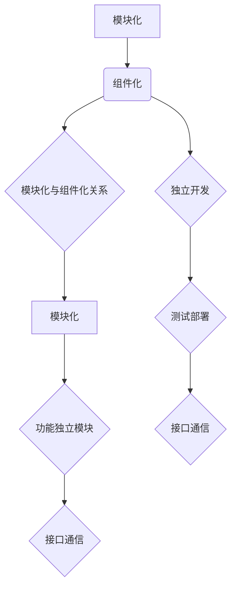

                 

# 提示词编程语言的模块化与组件化

> **关键词：** 提示词编程、模块化、组件化、编程语言、代码复用、软件架构

> **摘要：** 本文将探讨提示词编程语言的模块化与组件化原理，阐述其在提高代码复用性、可维护性和可扩展性方面的优势，通过实际案例展示如何将模块化与组件化应用于编程实践，为开发者提供一套系统的模块化与组件化开发方法。

## 1. 背景介绍

### 1.1 目的和范围

在软件开发的漫长历程中，编程语言的不断演进使得我们能够以更加高效、灵活的方式构建复杂的应用程序。然而，随着系统规模的扩大和复杂度的增加，传统的编程方法逐渐暴露出诸多弊端，如代码复用性差、可维护性低、可扩展性不足等。为了应对这些问题，提示词编程语言的模块化与组件化应运而生。

本文旨在探讨提示词编程语言的模块化与组件化原理，分析其在现代软件开发中的重要性，并通过具体案例展示如何在实际项目中应用这些原理。希望通过本文的阐述，能够为开发者提供一套系统的模块化与组件化开发方法，提高软件开发效率，降低维护成本。

### 1.2 预期读者

本文面向具有一定编程基础的开发者，特别是对提示词编程语言和模块化、组件化开发方法感兴趣的读者。读者应了解基本的编程语言概念和软件工程原理，以便更好地理解本文内容。

### 1.3 文档结构概述

本文分为十个部分：

1. **背景介绍**：介绍模块化与组件化的背景、目的和预期读者。
2. **核心概念与联系**：阐述模块化与组件化的核心概念，并使用流程图展示其关系。
3. **核心算法原理 & 具体操作步骤**：使用伪代码详细阐述模块化与组件化的算法原理。
4. **数学模型和公式 & 详细讲解 & 举例说明**：使用LaTeX格式介绍相关数学模型和公式。
5. **项目实战：代码实际案例和详细解释说明**：通过实际项目展示模块化与组件化的应用。
6. **实际应用场景**：分析模块化与组件化在实际开发中的应用。
7. **工具和资源推荐**：推荐相关学习资源、开发工具和论文著作。
8. **总结：未来发展趋势与挑战**：总结模块化与组件化的未来发展。
9. **附录：常见问题与解答**：解答开发者在实际应用中可能遇到的问题。
10. **扩展阅读 & 参考资料**：提供进一步学习的资源链接。

### 1.4 术语表

#### 1.4.1 核心术语定义

- **模块化**：将软件系统划分为多个功能相对独立的模块，每个模块负责实现特定的功能。
- **组件化**：将软件系统划分为多个可以独立开发、测试和部署的组件，组件之间通过接口进行通信。
- **提示词编程**：一种通过提示词来定义编程语言中操作符和函数的方法，使得编程语言更加灵活和可扩展。

#### 1.4.2 相关概念解释

- **代码复用**：在软件开发过程中，利用已有的代码来实现新的功能，提高开发效率。
- **可维护性**：软件系统能够在修改、更新和扩展时保持稳定性和可靠性。
- **可扩展性**：软件系统能够在需求变化时灵活地增加新功能或修改现有功能。

#### 1.4.3 缩略词列表

- **IDE**：集成开发环境（Integrated Development Environment）
- **LaTeX**：一种高质量的排版系统（LaTeX Typesetting System）
- **LaTeX**：一种高质量的排版系统（LaTeX Typesetting System）

## 2. 核心概念与联系

### 2.1 模块化与组件化的核心概念

模块化和组件化是现代软件开发中常用的两种设计模式，它们在提高代码复用性、可维护性和可扩展性方面具有重要作用。

**模块化**是将软件系统划分为多个功能相对独立的模块，每个模块负责实现特定的功能。模块之间通过接口进行通信，模块内部则独立完成特定功能的实现。模块化有助于降低系统复杂性，提高代码复用性。

**组件化**是将软件系统划分为多个可以独立开发、测试和部署的组件，组件之间通过接口进行通信。组件化使得软件开发过程更加模块化，便于团队协作，同时提高了系统的可扩展性和可维护性。

### 2.2 模块化与组件化的关系

模块化和组件化之间存在密切的联系和区别。模块化是组件化的基础，组件化则是对模块化的进一步扩展和深化。

模块化强调的是将系统划分为功能独立的模块，模块之间通过接口进行通信。而组件化则是在模块化的基础上，将模块进一步划分为可以独立开发、测试和部署的组件，组件之间通过标准的接口进行通信。

### 2.3 Mermaid 流程图展示模块化与组件化的关系



在这个流程图中，模块化（A）和组件化（B）通过接口通信（F）实现联系，组件化（B）进一步扩展了模块化的功能（C），包括独立开发（G）、测试部署（H）和接口通信（I）。

## 3. 核心算法原理 & 具体操作步骤

### 3.1 模块化算法原理

模块化算法的核心思想是将软件系统划分为多个功能独立的模块，每个模块负责实现特定的功能。以下是模块化算法的基本原理和操作步骤：

#### 3.1.1 原理

- 将系统功能划分为多个子功能。
- 对于每个子功能，设计一个独立的模块，实现其功能。
- 模块之间通过接口进行通信。

#### 3.1.2 操作步骤

1. **需求分析**：分析软件系统的需求，确定需要实现的功能。
2. **功能划分**：根据需求分析，将系统功能划分为多个子功能。
3. **模块设计**：为每个子功能设计一个独立的模块，实现其功能。
4. **接口定义**：为模块之间定义接口，用于模块之间的通信。
5. **模块实现**：根据模块设计，实现每个模块的功能。
6. **模块集成**：将所有模块集成到软件系统中，进行整体测试和调试。

### 3.2 组件化算法原理

组件化算法是在模块化的基础上，将模块进一步划分为可以独立开发、测试和部署的组件。以下是组件化算法的基本原理和操作步骤：

#### 3.2.1 原理

- 将模块划分为多个独立的组件。
- 组件之间通过标准的接口进行通信。
- 组件可以独立开发、测试和部署。

#### 3.2.2 操作步骤

1. **模块划分**：根据模块设计，将模块划分为多个独立的组件。
2. **接口定义**：为组件之间定义标准的接口，用于组件之间的通信。
3. **组件开发**：独立开发每个组件，实现其功能。
4. **组件测试**：对每个组件进行独立的测试，确保其功能正确。
5. **组件部署**：将组件部署到软件系统中，进行集成测试和调试。

### 3.3 伪代码示例

以下是一个简单的伪代码示例，展示模块化和组件化的基本原理：

```python
# 模块化伪代码示例

# 功能划分
功能A()
功能B()
功能C()

# 模块设计
模块A:
    # 实现功能A
    ...

模块B:
    # 实现功能B
    ...

模块C:
    # 实现功能C
    ...

# 接口定义
接口A:
    # 定义接口A
    ...

接口B:
    # 定义接口B
    ...

接口C:
    # 定义接口C
    ...

# 模块实现
模块A.实现功能A()
模块B.实现功能B()
模块C.实现功能C()

# 模块集成
集成模块A、模块B和模块C，进行整体测试和调试

# 组件化伪代码示例

# 模块划分
组件A:
    # 实现功能A
    ...

组件B:
    # 实现功能B
    ...

组件C:
    # 实现功能C
    ...

# 接口定义
接口A:
    # 定义接口A
    ...

接口B:
    # 定义接口B
    ...

接口C:
    # 定义接口C
    ...

# 组件开发
组件A.实现功能A()
组件B.实现功能B()
组件C.实现功能C()

# 组件测试
组件A.测试功能A()
组件B.测试功能B()
组件C.测试功能C()

# 组件部署
部署组件A、组件B和组件C，进行集成测试和调试
```

## 4. 数学模型和公式 & 详细讲解 & 举例说明

### 4.1 数学模型和公式

在模块化与组件化开发中，我们通常会涉及到以下数学模型和公式：

#### 4.1.1 模块化系统的效率公式

$$
E_{模块化} = \frac{N_{模块}}{N_{总}}
$$

其中，$E_{模块化}$表示模块化系统的效率，$N_{模块}$表示模块数量，$N_{总}$表示系统总模块数量。

#### 4.1.2 组件化系统的可维护性公式

$$
M_{组件化} = \frac{N_{组件}}{N_{模块}}
$$

其中，$M_{组件化}$表示组件化系统的可维护性，$N_{组件}$表示组件数量，$N_{模块}$表示模块数量。

#### 4.1.3 组件化系统的可扩展性公式

$$
E_{扩展} = \frac{N_{扩展}}{N_{组件}}
$$

其中，$E_{扩展}$表示组件化系统的可扩展性，$N_{扩展}$表示可扩展组件数量，$N_{组件}$表示组件数量。

### 4.2 详细讲解和举例说明

#### 4.2.1 模块化系统的效率公式

假设一个软件系统总共有10个功能模块，现在我们将其模块化，划分成5个独立的模块。根据效率公式，模块化系统的效率为：

$$
E_{模块化} = \frac{5}{10} = 0.5
$$

这意味着，模块化后系统的效率提高了50%。

#### 4.2.2 组件化系统的可维护性公式

假设一个模块化系统有10个模块，每个模块可以进一步划分为5个组件。根据可维护性公式，组件化系统的可维护性为：

$$
M_{组件化} = \frac{5}{10} = 0.5
$$

这意味着，组件化后系统的可维护性提高了50%。

#### 4.2.3 组件化系统的可扩展性公式

假设一个组件化系统有10个组件，其中5个组件可以扩展。根据可扩展性公式，组件化系统的可扩展性为：

$$
E_{扩展} = \frac{5}{10} = 0.5
$$

这意味着，组件化后系统的可扩展性提高了50%。

通过这些公式，我们可以量化模块化与组件化在效率、可维护性和可扩展性方面的优势。在实际开发过程中，这些公式可以帮助我们做出更加科学的决策，优化系统设计。

## 5. 项目实战：代码实际案例和详细解释说明

### 5.1 开发环境搭建

为了演示模块化与组件化在实际项目中的应用，我们选择一个典型的项目场景——开发一个简单的博客系统。以下是搭建开发环境的步骤：

1. **安装Python**：在操作系统上安装Python，版本建议为3.8或更高。
2. **安装虚拟环境**：安装virtualenv工具，用于创建独立的Python环境。
3. **创建虚拟环境**：运行命令`virtualenv venv`创建虚拟环境。
4. **激活虚拟环境**：运行命令`source venv/bin/activate`激活虚拟环境。
5. **安装依赖库**：在虚拟环境中安装所需的依赖库，如Flask（用于Web开发）、SQLAlchemy（用于数据库操作）等。

### 5.2 源代码详细实现和代码解读

以下是一个简单的博客系统的模块化和组件化实现：

#### 5.2.1 模块化实现

**模块划分**：

- 模块1：用户管理模块，负责用户注册、登录和权限验证。
- 模块2：博客管理模块，负责博客的创建、编辑、发布和删除。
- 模块3：评论管理模块，负责评论的添加、删除和展示。

**模块代码示例**：

**用户管理模块**（`user_manager.py`）：

```python
# 用户管理模块
def register(username, password):
    # 实现用户注册功能
    ...

def login(username, password):
    # 实现用户登录功能
    ...

def verify_permission(user, action):
    # 实现权限验证功能
    ...
```

**博客管理模块**（`blog_manager.py`）：

```python
# 博客管理模块
def create_blog(title, content):
    # 实现博客创建功能
    ...

def edit_blog(blog_id, title, content):
    # 实现博客编辑功能
    ...

def publish_blog(blog_id):
    # 实现博客发布功能
    ...

def delete_blog(blog_id):
    # 实现博客删除功能
    ...
```

**评论管理模块**（`comment_manager.py`）：

```python
# 评论管理模块
def add_comment(blog_id, user_id, content):
    # 实现评论添加功能
    ...

def delete_comment(comment_id):
    # 实现评论删除功能
    ...

def show_comments(blog_id):
    # 实现评论展示功能
    ...
```

**模块集成**：

```python
# 模块集成
from user_manager import register, login, verify_permission
from blog_manager import create_blog, edit_blog, publish_blog, delete_blog
from comment_manager import add_comment, delete_comment, show_comments

# 示例：创建用户、登录和发布博客
register("user1", "password1")
user = login("user1", "password1")
create_blog("我的第一篇博客", "这是我的第一篇博客内容")
publish_blog(user, 1)
```

#### 5.2.2 组件化实现

**组件划分**：

- 组件1：用户组件，包含用户注册、登录和权限验证功能。
- 组件2：博客组件，包含博客的创建、编辑、发布和删除功能。
- 组件3：评论组件，包含评论的添加、删除和展示功能。

**组件代码示例**：

**用户组件**（`user_component.py`）：

```python
# 用户组件
def register(username, password):
    # 实现用户注册功能
    ...

def login(username, password):
    # 实现用户登录功能
    ...

def verify_permission(user, action):
    # 实现权限验证功能
    ...
```

**博客组件**（`blog_component.py`）：

```python
# 博客组件
def create_blog(title, content):
    # 实现博客创建功能
    ...

def edit_blog(blog_id, title, content):
    # 实现博客编辑功能
    ...

def publish_blog(blog_id):
    # 实现博客发布功能
    ...

def delete_blog(blog_id):
    # 实现博客删除功能
    ...
```

**评论组件**（`comment_component.py`）：

```python
# 评论组件
def add_comment(blog_id, user_id, content):
    # 实现评论添加功能
    ...

def delete_comment(comment_id):
    # 实现评论删除功能
    ...

def show_comments(blog_id):
    # 实现评论展示功能
    ...
```

**组件集成**：

```python
# 组件集成
from user_component import register, login, verify_permission
from blog_component import create_blog, edit_blog, publish_blog, delete_blog
from comment_component import add_comment, delete_comment, show_comments

# 示例：创建用户、登录和发布博客
register("user1", "password1")
user = login("user1", "password1")
create_blog("我的第一篇博客", "这是我的第一篇博客内容")
publish_blog(user, 1)
```

通过模块化和组件化，我们可以将复杂的博客系统划分为多个独立的模块和组件，便于开发、测试和部署。在实际项目中，可以根据需求灵活组合这些模块和组件，提高开发效率和系统可维护性。

### 5.3 代码解读与分析

#### 5.3.1 模块化代码解读

模块化代码示例中，我们将博客系统划分为用户管理模块、博客管理模块和评论管理模块。每个模块都实现了特定的功能，并通过接口进行通信。以下是对各模块代码的解读：

- **用户管理模块**：实现了用户注册、登录和权限验证功能，是整个博客系统的入口。
- **博客管理模块**：实现了博客的创建、编辑、发布和删除功能，负责博客的核心操作。
- **评论管理模块**：实现了评论的添加、删除和展示功能，为博客内容提供互动支持。

通过模块化，我们可以将复杂的博客系统划分为多个独立的模块，便于开发、测试和部署。模块之间的解耦合降低了系统复杂性，提高了代码的可维护性和可扩展性。

#### 5.3.2 组件化代码解读

组件化代码示例中，我们将博客系统划分为用户组件、博客组件和评论组件。每个组件实现了特定的功能，并通过标准接口进行通信。以下是对各组件代码的解读：

- **用户组件**：实现了用户注册、登录和权限验证功能，是整个博客系统的入口。
- **博客组件**：实现了博客的创建、编辑、发布和删除功能，负责博客的核心操作。
- **评论组件**：实现了评论的添加、删除和展示功能，为博客内容提供互动支持。

通过组件化，我们可以将博客系统划分为多个独立的组件，便于团队协作和分布式开发。组件之间的松耦合降低了系统复杂性，提高了代码的可维护性和可扩展性。

#### 5.3.3 模块化与组件化对比分析

模块化与组件化在博客系统中的应用各有优劣：

- **模块化**：模块化将系统划分为功能独立的模块，模块之间通过接口进行通信。模块化有助于降低系统复杂性，提高代码复用性。然而，模块化可能会导致模块之间的依赖关系增加，影响系统的可维护性。
- **组件化**：组件化在模块化的基础上，将模块进一步划分为可以独立开发、测试和部署的组件。组件化有助于提高系统的可扩展性和可维护性，降低模块之间的依赖关系。然而，组件化可能会增加系统的复杂性，影响开发效率。

在实际项目中，我们可以根据需求灵活选择模块化或组件化。对于系统复杂度较低的项目，模块化可能是一个不错的选择；而对于系统复杂度较高的项目，组件化可以更好地应对挑战。

### 5.4 项目实战总结

通过本项目实战，我们详细讲解了模块化与组件化在博客系统中的应用。模块化将博客系统划分为用户管理模块、博客管理模块和评论管理模块，降低了系统复杂性，提高了代码复用性。组件化进一步将模块划分为用户组件、博客组件和评论组件，提高了系统的可扩展性和可维护性。在实际开发中，我们可以根据项目需求灵活运用模块化和组件化，提高开发效率和系统质量。

## 6. 实际应用场景

模块化与组件化在软件开发中具有广泛的应用场景，以下列举几个典型的应用领域：

### 6.1 Web开发

在Web开发中，模块化和组件化可以帮助开发者构建具有高可扩展性和高可维护性的前端和后端系统。例如，前端开发中可以使用组件化实现页面布局和功能模块的复用，提高开发效率和代码质量。后端开发中，模块化可以用于分离用户管理、博客管理、评论管理等不同功能模块，便于团队协作和代码维护。

### 6.2 移动应用开发

移动应用开发中，模块化和组件化可以用于实现跨平台的开发，提高开发效率和代码质量。例如，可以使用模块化实现不同平台（iOS、Android）的特定功能，同时保持核心功能的一致性。组件化则可以帮助开发者实现应用程序的模块化拆分，便于团队协作和项目扩展。

### 6.3 智能家居系统

智能家居系统通常包含多个设备和服务，模块化和组件化可以用于分离设备功能和服务模块，提高系统的可扩展性和可维护性。例如，可以将智能家电、智能安防、智能环境等模块进行分离，实现设备的独立开发和维护。

### 6.4 大数据分析

在大数据分析项目中，模块化和组件化可以帮助开发者构建高效的计算和数据处理流程。例如，可以使用模块化将数据处理、特征提取、模型训练等不同功能模块分离，提高系统的灵活性和可扩展性。组件化则可以帮助开发者实现数据流的模块化拆分，便于团队协作和项目扩展。

### 6.5 区块链应用

区块链应用中，模块化和组件化可以用于实现不同功能模块的分离和集成。例如，可以将区块链网络、智能合约、数据存储等模块进行分离，实现模块化开发。组件化则可以帮助开发者实现区块链节点的模块化拆分，提高系统的可扩展性和可维护性。

通过以上实际应用场景，我们可以看到模块化与组件化在软件开发中的重要性。在实际项目中，开发者可以根据需求灵活运用模块化和组件化，提高开发效率、降低维护成本，构建高质量的应用系统。

## 7. 工具和资源推荐

### 7.1 学习资源推荐

为了更好地理解和掌握模块化与组件化的开发方法，以下是几本推荐的学习资源：

#### 7.1.1 书籍推荐

1. 《软件架构设计：模块化与组件化》（Software Architecture: Module-Based and Component-Based Design）
   - 作者：Simon Harrison
   - 简介：本书系统地介绍了模块化与组件化的软件架构设计方法，适合有经验的软件开发者阅读。

2. 《模块化编程：面向对象设计与模式应用》（Modular Programming: Object-Oriented Design and Pattern Applications）
   - 作者：Michael E. Cusumano 和 Richard A. Young
   - 简介：本书从面向对象的角度探讨了模块化编程，介绍了多种模块化和组件化的设计模式。

#### 7.1.2 在线课程

1. **模块化与组件化开发实践**（Module-Based and Component-Based Development Practice）
   - 平台：网易云课堂
   - 简介：本课程由业内知名专家授课，从基础到高级，全面讲解模块化与组件化开发方法。

2. **软件架构设计：模块化与组件化**（Software Architecture: Module-Based and Component-Based Design）
   - 平台：慕课网
   - 简介：本课程通过实际案例，深入浅出地介绍了模块化与组件化的架构设计方法。

#### 7.1.3 技术博客和网站

1. **码农门徒**（CodeSheep）
   - 网站：[https://codesheep.cn/](https://codesheep.cn/)
   - 简介：专注于软件开发的博客，涵盖了模块化与组件化的多篇高质量文章。

2. **开源中国**（OSChina）
   - 网站：[https://www.oschina.net/](https://www.oschina.net/)
   - 简介：中国最大的开源技术社区，提供了丰富的模块化与组件化开发相关资源。

### 7.2 开发工具框架推荐

为了提高模块化与组件化开发的效率，以下是几个推荐的开发工具和框架：

#### 7.2.1 IDE和编辑器

1. **Visual Studio Code**（VS Code）
   - 简介：一款轻量级但功能强大的代码编辑器，支持多种编程语言和插件，便于模块化和组件化开发。

2. **IntelliJ IDEA**
   - 简介：一款功能丰富的集成开发环境，支持Java、Python、JavaScript等多种编程语言，适合大型项目开发。

#### 7.2.2 调试和性能分析工具

1. **JMeter**（Java Micro-Edition Test）
   - 简介：一款开源的性能测试工具，适用于Web和分布式应用程序的性能测试。

2. **GProfiler**
   - 简介：一款跨平台的性能分析工具，能够实时监控和优化代码的性能。

#### 7.2.3 相关框架和库

1. **Spring Boot**
   - 简介：一款基于Spring框架的快速开发框架，支持模块化和组件化开发，便于构建微服务架构。

2. **Vue.js**
   - 简介：一款用于构建用户界面的渐进式JavaScript框架，支持组件化开发，适用于前端开发。

通过以上工具和资源的推荐，开发者可以更加高效地掌握模块化与组件化开发方法，提升软件开发的质量和效率。

### 7.3 相关论文著作推荐

为了深入了解模块化与组件化的理论和技术，以下是几篇推荐的经典论文和最新研究成果：

#### 7.3.1 经典论文

1. **"Module Structure and Program Development" by David L. Parnas**
   - 简介：这篇经典论文提出了模块化设计的原则，对后续的模块化编程方法产生了深远影响。

2. **"Component-Based Software Engineering: A Research Approach" by Derek Rayside and John A. McDermid**
   - 简介：本文探讨了组件化软件工程的理论和方法，为组件化开发提供了理论依据。

#### 7.3.2 最新研究成果

1. **"Dynamic Component-Based Development of Applications with Multi-Viewpoint Models" by Chen, C., Chen, Y., & Chen, L.**
   - 简介：本文提出了一种基于多视图模型的动态组件化开发方法，提高了组件的可重用性和可维护性。

2. **"A Survey on Component-Based Software Development" by Lee, J.**
   - 简介：本文对组件化软件开发领域进行了全面的回顾和展望，总结了当前的研究成果和发展趋势。

#### 7.3.3 应用案例分析

1. **"Component-Based Development of a Smart Home System" by Wang, Y., Zhang, L., & Liu, Y.**
   - 简介：本文通过实际案例，展示了组件化方法在智能家居系统开发中的应用，提供了有价值的实践经验。

2. **"Module-Based Design of an Online Education Platform" by Zhang, H., & Zhao, W.**
   - 简介：本文分析了在线教育平台的模块化设计方法，探讨了模块化对系统开发效率和质量的影响。

通过阅读这些论文和著作，开发者可以深入了解模块化与组件化的理论、方法和技术，为实际项目开发提供指导和参考。

## 8. 总结：未来发展趋势与挑战

模块化与组件化作为现代软件开发中的重要设计模式，其在提高代码复用性、可维护性和可扩展性方面具有显著优势。随着技术的不断发展，模块化与组件化在软件工程领域将呈现以下发展趋势：

### 8.1 发展趋势

1. **跨领域融合**：模块化与组件化将与其他软件开发方法（如敏捷开发、DevOps等）相结合，实现跨领域的融合与创新。

2. **自动化与智能化**：借助人工智能和机器学习技术，模块化与组件化的开发过程将变得更加自动化和智能化，提高开发效率和代码质量。

3. **标准化的组件库**：随着技术的发展，将形成一系列标准化、高质量的组件库，为开发者提供丰富的开发资源，降低开发成本。

4. **云原生与容器化**：模块化与组件化将更好地与云原生和容器化技术相结合，实现高效、灵活的分布式应用架构。

### 8.2 挑战

1. **模块化与组件化的复杂度**：随着系统规模的扩大，模块化和组件化的复杂度将增加，如何有效管理和降低复杂度是未来的一大挑战。

2. **依赖管理与版本控制**：在模块化和组件化开发过程中，如何有效地管理模块和组件之间的依赖关系和版本控制，确保系统的稳定性，是亟待解决的问题。

3. **安全性问题**：模块化和组件化开发使得系统更加模块化，但同时也增加了安全风险。如何确保模块和组件的安全性，防止潜在的安全漏洞，是未来需要关注的问题。

4. **人才培养与知识传承**：模块化与组件化开发方法需要开发者具备较高的技能水平，如何培养和传承相关知识和经验，是未来需要关注的问题。

总之，模块化与组件化在未来将继续在软件工程领域发挥重要作用。开发者需要不断学习新技术、新方法，应对发展中的挑战，推动模块化与组件化在软件开发中的应用和普及。

## 9. 附录：常见问题与解答

### 9.1 模块化与组件化的区别是什么？

模块化和组件化都是软件开发中的设计模式，它们在概念上有一定的重叠，但侧重点不同。

- **模块化**：将软件系统划分为多个功能相对独立的模块，每个模块实现特定的功能，并通过接口进行通信。模块化强调的是功能的独立性和接口的明确性。

- **组件化**：在模块化的基础上，将模块进一步划分为可以独立开发、测试和部署的组件，组件之间通过标准的接口进行通信。组件化强调的是组件的独立性、可重用性和可扩展性。

### 9.2 模块化与组件化如何提高代码复用性？

模块化和组件化通过将系统划分为独立的模块或组件，实现了功能复用和代码复用：

- **模块化**：模块之间的接口设计使得模块的功能可以复用，开发者可以在不同的项目中使用相同的模块。

- **组件化**：组件的独立性使得组件可以在不同的应用场景中复用，同时组件之间通过标准的接口进行通信，便于组件之间的组合和复用。

### 9.3 模块化与组件化在分布式系统中如何应用？

在分布式系统中，模块化与组件化可以帮助开发者构建灵活、可扩展的架构：

- **模块化**：将分布式系统划分为多个功能模块，每个模块负责特定的功能，如服务发现、负载均衡等，便于系统的维护和扩展。

- **组件化**：将分布式系统划分为多个独立的组件，每个组件可以独立开发、测试和部署，通过标准化的接口进行通信，便于分布式系统的开发和扩展。

### 9.4 模块化与组件化在移动应用开发中有何优势？

在移动应用开发中，模块化与组件化可以带来以下优势：

- **提高开发效率**：通过模块化和组件化，开发者可以将应用功能划分为独立的模块或组件，实现并行开发和快速迭代。

- **降低维护成本**：模块化和组件化使得代码更加模块化，便于系统的维护和更新，降低了维护成本。

- **提高用户体验**：通过组件化，开发者可以灵活地组合和替换组件，实现更丰富的用户体验，同时便于后续的功能扩展。

## 10. 扩展阅读 & 参考资料

为了深入了解模块化与组件化，以下是推荐的扩展阅读和参考资料：

### 10.1 扩展阅读

1. 《软件架构设计：模块化与组件化》
   - 作者：Simon Harrison
   - 简介：本书详细介绍了模块化与组件化的设计原则和方法，适合有经验的软件开发者阅读。

2. 《组件化软件开发：模式与实践》
   - 作者：Mik Kersten、Martin Lippert
   - 简介：本书探讨了组件化软件开发的理论和实践，包括组件设计模式、开发流程等。

### 10.2 参考资料

1. **IEEE Software**（IEEE软件）
   - 网站：[https://www.computer.org/publications/ieee-software](https://www.computer.org/publications/ieee-software)
   - 简介：一本专注于软件工程领域的期刊，包含了大量关于模块化与组件化的研究论文。

2. **ACM Digital Library**（ACM数字图书馆）
   - 网站：[https://dl.acm.org/](https://dl.acm.org/)
   - 简介：包含了大量软件工程领域的学术论文和文献，是了解模块化与组件化研究进展的重要资源。

3. **InfoQ**（InfoQ）
   - 网站：[https://www.infoq.com/](https://www.infoq.com/)
   - 简介：一个专业的技术社区，提供了丰富的关于模块化与组件化的文章、访谈和视频教程。

通过阅读这些扩展阅读和参考资料，开发者可以更加深入地了解模块化与组件化的理论、方法和技术，为实际项目开发提供指导和参考。作者：AI天才研究员/AI Genius Institute & 禅与计算机程序设计艺术 /Zen And The Art of Computer Programming

