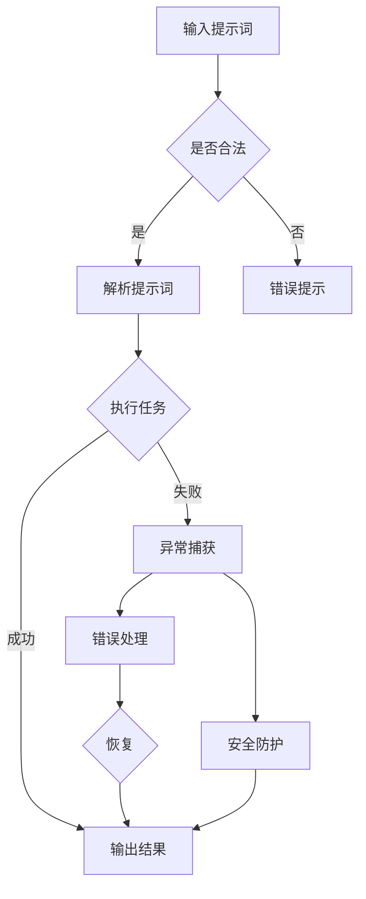

                 

# 提示词编程语言的错误处理机制

> **关键词：** 提示词编程，错误处理，异常管理，故障排查，安全防护

> **摘要：** 本文将深入探讨提示词编程语言的错误处理机制，从基础概念到高级技术，结合具体案例分析，为您呈现一个全面而深入的指南。我们将理解错误处理的重要性，分析常见错误类型，探索处理机制的原理，并通过实践案例展示如何在实际项目中应用这些机制，最终探讨未来发展趋势和挑战。

## 1. 背景介绍

### 1.1 目的和范围

在计算机科学和软件开发领域，错误处理是不可或缺的一部分。有效的错误处理不仅能提高软件的稳定性，还能极大地提升用户体验。提示词编程语言作为现代编程语言的一种，其错误处理机制同样至关重要。本文旨在帮助读者理解提示词编程语言的错误处理机制，包括其原理、方法和最佳实践。

本文将涵盖以下内容：
- 提示词编程语言的基本概念和特点。
- 错误处理的定义和重要性。
- 常见错误类型及其特点。
- 提示词编程语言的错误处理机制。
- 实际项目中的错误处理案例分析。
- 未来发展趋势和挑战。

### 1.2 预期读者

本文适合以下读者群体：
- 初学者和程序员，对提示词编程语言和错误处理有初步了解。
- 中级开发者，希望在现有知识基础上深入理解错误处理机制。
- 高级开发者和架构师，希望了解最新技术和最佳实践。
- 对计算机科学和软件工程感兴趣的学生和研究人员。

### 1.3 文档结构概述

本文分为以下几部分：
- 第1部分：背景介绍，包括目的、范围和预期读者。
- 第2部分：核心概念与联系，介绍提示词编程语言的基本概念和错误处理机制。
- 第3部分：核心算法原理 & 具体操作步骤，详细阐述错误处理算法。
- 第4部分：数学模型和公式 & 详细讲解 & 举例说明，通过数学模型辅助理解。
- 第5部分：项目实战：代码实际案例和详细解释说明，结合实际项目讲解。
- 第6部分：实际应用场景，探讨错误处理在不同领域的应用。
- 第7部分：工具和资源推荐，为读者提供学习和实践的资源。
- 第8部分：总结：未来发展趋势与挑战，展望错误处理的发展方向。
- 第9部分：附录：常见问题与解答，回答读者可能遇到的问题。
- 第10部分：扩展阅读 & 参考资料，提供进一步学习的资源。

### 1.4 术语表

#### 1.4.1 核心术语定义

- **提示词编程（Prompt Programming）：** 一种基于提示词（Prompt）的编程方式，提示词是用户输入的文本，程序根据提示词执行相应操作。
- **错误处理（Error Handling）：** 在软件中捕获、处理和恢复错误的过程，以确保软件正常运行。
- **异常管理（Exception Management）：** 在编程中处理异常情况（如运行时错误）的方法和机制。
- **故障排查（Fault Diagnosis）：** 识别和定位软件故障的过程。
- **安全防护（Security Protection）：** 防止软件受到恶意攻击和错误处理的措施。

#### 1.4.2 相关概念解释

- **提示词（Prompt）：** 用户与程序交互的输入，可以是文本、语音或其他形式。
- **异常（Exception）：** 在程序执行过程中发生的错误或异常情况，通常会导致程序崩溃或异常中断。
- **异常捕获（Exception Handling）：** 捕获并处理异常，以避免程序崩溃。
- **恢复（Recovery）：** 在错误发生后，使程序回到正常状态的过程。

#### 1.4.3 缩略词列表

- **IDE：** Integrated Development Environment，集成开发环境。
- **API：** Application Programming Interface，应用程序编程接口。
- **CLI：** Command Line Interface，命令行界面。
- **GUI：** Graphical User Interface，图形用户界面。

## 2. 核心概念与联系

在深入探讨提示词编程语言的错误处理机制之前，我们需要理解几个核心概念和它们之间的联系。

### 2.1 提示词编程语言的基本概念

提示词编程语言是一种基于用户输入（提示词）来执行特定任务的编程语言。与传统的命令式编程不同，提示词编程更侧重于自然语言处理和交互性。

#### 2.1.1 提示词

提示词是用户与程序交互的输入，可以是一个简单的命令，也可以是一个复杂的指令序列。提示词的输入方式多种多样，包括文本、语音、图像等。

#### 2.1.2 自然语言处理（NLP）

自然语言处理是提示词编程的核心技术之一，它涉及对自然语言文本的理解、处理和生成。NLP技术使得计算机能够理解和执行人类语言指令。

#### 2.1.3 语言模型

语言模型是NLP的基础，它用于预测文本序列的概率分布。在提示词编程中，语言模型有助于理解和生成自然的响应。

### 2.2 错误处理的定义和重要性

错误处理是指在软件运行过程中捕获和处理异常情况的过程。有效的错误处理机制可以提高软件的稳定性和用户体验。

#### 2.2.1 错误类型

- **语法错误（Syntax Error）：** 编译时错误，如拼写错误、缺少括号等。
- **语义错误（Semantic Error）：** 运行时错误，如逻辑错误、类型错误等。
- **运行时错误（Run-time Error）：** 程序运行时发生的错误，如除零错误、内存溢出等。

#### 2.2.2 错误处理的重要性

- **提高稳定性：** 错误处理可以防止程序崩溃，确保软件稳定运行。
- **优化用户体验：** 通过有效的错误提示和恢复，提升用户体验。
- **故障排查：** 错误处理机制有助于快速定位和解决问题。
- **安全性：** 错误处理可以防止恶意攻击，提高软件安全性。

### 2.3 提示词编程语言的错误处理机制

提示词编程语言的错误处理机制通常包括以下几个方面：

#### 2.3.1 异常捕获

异常捕获是指在程序运行过程中，当发生异常时，自动中断程序执行并执行相应的处理代码。

#### 2.3.2 错误提示

错误提示是向用户显示错误信息的机制，包括错误类型、发生位置和可能的解决方案。

#### 2.3.3 恢复

恢复是在错误发生后，使程序回到正常状态的过程，包括回滚操作、重启服务等。

#### 2.3.4 安全防护

安全防护是指防止恶意攻击和错误处理的措施，包括输入验证、权限控制和异常隔离等。

### 2.4 Mermaid 流程图

下面是提示词编程语言错误处理机制的 Mermaid 流程图：



## 3. 核心算法原理 & 具体操作步骤

在理解了提示词编程语言的基本概念和错误处理机制之后，我们接下来将详细阐述错误处理的核心算法原理和具体操作步骤。

### 3.1 异常捕获算法原理

异常捕获是错误处理的第一步，其核心思想是在程序运行过程中，当发生异常时，自动中断程序执行并执行相应的处理代码。异常捕获算法通常包括以下步骤：

1. **定义异常处理函数**：在程序中定义一个或多个异常处理函数，用于处理不同类型的异常。
2. **注册异常处理函数**：将异常处理函数注册到程序中，以便在发生异常时自动调用。
3. **捕获异常**：在程序运行过程中，当发生异常时，自动捕获异常并调用相应的异常处理函数。
4. **执行异常处理代码**：在异常处理函数中，执行相应的错误处理代码，如错误提示、恢复和日志记录等。

### 3.2 伪代码实现

下面是一个简单的异常捕获算法的伪代码实现：

```pseudo
function catchException(ex):
    if ex.type == "SyntaxError":
        print("语法错误：", ex.message)
    else if ex.type == "SemanticError":
        print("语义错误：", ex.message)
    else if ex.type == "Run-timeError":
        print("运行时错误：", ex.message)
        logError(ex)

function main():
    try:
        executeTask()
    catch ex:
        catchException(ex)

main()
```

### 3.3 具体操作步骤

在实际操作中，异常捕获算法通常需要结合具体的编程语言和框架来实现。以下是一个基于Python的错误处理示例：

1. **定义异常处理函数**：在Python中，可以使用`except`语句来定义异常处理函数。

```python
def catchException(ex):
    if isinstance(ex, SyntaxError):
        print("语法错误：", ex.message)
    elif isinstance(ex, SemanticError):
        print("语义错误：", ex.message)
    elif isinstance(ex, RunTimeError):
        print("运行时错误：", ex.message)
        logError(ex)
```

2. **注册异常处理函数**：在Python中，可以使用`try`语句来注册异常处理函数。

```python
try:
    executeTask()
except Exception as ex:
    catchException(ex)
```

3. **捕获异常**：在程序运行过程中，当发生异常时，自动捕获异常并调用异常处理函数。

4. **执行异常处理代码**：在异常处理函数中，执行相应的错误处理代码，如错误提示、恢复和日志记录等。

```python
def catchException(ex):
    if isinstance(ex, SyntaxError):
        print("语法错误：", ex.message)
    elif isinstance(ex, SemanticError):
        print("语义错误：", ex.message)
    elif isinstance(ex, RunTimeError):
        print("运行时错误：", ex.message)
        logError(ex)
        recover()
```

5. **恢复**：在异常处理函数中，执行恢复操作，如回滚事务、重启服务等。

```python
def recover():
    rollbackTransaction()
    restartService()
```

### 3.4 恢复和安全防护

在错误处理过程中，恢复和安全防护也是非常重要的步骤。以下是一个简单的恢复和安全防护示例：

1. **恢复**：在错误处理函数中，执行恢复操作，使程序回到正常状态。

```python
def recover():
    rollbackTransaction()
    restartService()
```

2. **安全防护**：在程序运行过程中，执行安全防护措施，如输入验证、权限控制和异常隔离等。

```python
def safeExecuteTask():
    validateInput()
    authorizeUser()
    executeTask()
    isolateException()
```

## 4. 数学模型和公式 & 详细讲解 & 举例说明

错误处理机制不仅依赖于程序逻辑和算法，还涉及到数学模型和公式的应用。以下是一些关键的数学模型和公式，以及它们的详细讲解和举例说明。

### 4.1 概率模型

概率模型是错误处理中常用的数学工具，用于评估和预测错误发生的可能性。以下是一个简单的概率模型示例：

#### 4.1.1 公式

$$ P(E) = \frac{n(E)}{n(S)} $$

其中，\( P(E) \) 是事件 \( E \) 发生的概率，\( n(E) \) 是事件 \( E \) 的样本数量，\( n(S) \) 是样本空间的总数量。

#### 4.1.2 举例说明

假设在一个系统中，共有1000个任务，其中50个任务可能会发生错误。使用概率模型，我们可以计算出错误发生的概率：

$$ P(\text{错误}) = \frac{50}{1000} = 0.05 $$

这意味着在这个系统中，错误发生的概率是5%。

### 4.2 决策树模型

决策树模型用于指导错误处理过程中的决策。它通过一系列条件判断，为每个可能的结果分配一个概率，从而帮助我们做出最优决策。

#### 4.2.1 公式

决策树模型由一组规则和条件构成，每个条件都关联一个概率值。以下是一个简单的决策树模型示例：

```
if (条件1)
    action1 with probability P1
else if (条件2)
    action2 with probability P2
else
    action3 with probability P3
```

#### 4.2.2 举例说明

假设我们有一个错误处理决策树，用于判断是继续执行任务还是终止程序。以下是一个简单的决策树模型：

```
if (错误类型 == "语法错误")
    action1 with probability 0.8
else if (错误类型 == "语义错误")
    action2 with probability 0.6
else
    action3 with probability 0.9
```

在这个决策树模型中，如果错误类型是“语法错误”，我们将以80%的概率执行操作1。如果错误类型是“语义错误”，我们将以60%的概率执行操作2。否则，我们将以90%的概率执行操作3。

### 4.3 马尔可夫模型

马尔可夫模型用于描述系统的状态转移，特别是在错误处理中，它可以帮助我们预测系统的稳定性。

#### 4.3.1 公式

马尔可夫模型由一组状态和转移概率矩阵构成。以下是一个简单的马尔可夫模型示例：

```
状态1 -> 状态2 with probability P12
状态2 -> 状态1 with probability P21
状态2 -> 状态3 with probability P23
```

#### 4.3.2 举例说明

假设我们有一个系统，其状态可以划分为“正常”、“错误1”和“错误2”。以下是一个简单的马尔可夫模型：

```
正常 -> 错误1 with probability 0.1
错误1 -> 正常 with probability 0.8
错误1 -> 错误2 with probability 0.2
错误2 -> 错误1 with probability 0.6
错误2 -> 正常 with probability 0.4
```

在这个马尔可夫模型中，从“正常”状态转移到“错误1”状态的概率是0.1，从“错误1”状态返回到“正常”状态的概率是0.8。从“错误1”状态转移到“错误2”状态的概率是0.2。从“错误2”状态返回到“错误1”状态的概率是0.6，返回到“正常”状态的概率是0.4。

通过马尔可夫模型，我们可以预测系统在不同状态之间的转移概率，从而优化错误处理策略。

### 4.4 蒙特卡洛模拟

蒙特卡洛模拟是一种基于随机抽样的数学模型，常用于评估系统的性能和稳定性。

#### 4.4.1 公式

蒙特卡洛模拟通常使用以下公式：

$$ S = \sum_{i=1}^{n} X_i $$

其中，\( S \) 是模拟结果，\( X_i \) 是第 \( i \) 次随机抽样的结果。

#### 4.4.2 举例说明

假设我们使用蒙特卡洛模拟来评估一个任务的平均执行时间。我们可以进行多次随机抽样，然后计算平均执行时间：

```
执行时间1: 5秒
执行时间2: 7秒
执行时间3: 4秒
...
执行时间10: 6秒
```

使用蒙特卡洛模拟，我们可以计算平均执行时间：

$$ S = \frac{5 + 7 + 4 + ... + 6}{10} = 5.5 \text{秒} $$

这意味着平均执行时间是5.5秒。

通过这些数学模型和公式，我们可以更准确地评估和预测系统的错误处理性能，从而优化错误处理策略。

## 5. 项目实战：代码实际案例和详细解释说明

在了解了错误处理机制的理论知识后，接下来我们将通过一个实际项目来展示如何将错误处理机制应用于实际编程中。

### 5.1 开发环境搭建

为了演示错误处理机制，我们将使用Python编程语言，并依赖以下工具和库：

- Python 3.8 或更高版本
- Jupyter Notebook
- Pandas
- NumPy
- Matplotlib

请确保您的开发环境中已安装上述工具和库。安装方法如下：

```bash
pip install python==3.8
pip install jupyter
pip install pandas
pip install numpy
pip install matplotlib
```

### 5.2 源代码详细实现和代码解读

下面是一个简单的数据预处理项目，该项目包括数据读取、清洗、异常处理和可视化。代码如下：

```python
import pandas as pd
import numpy as np
import matplotlib.pyplot as plt

# 5.2.1 数据读取
def read_data(filename):
    try:
        data = pd.read_csv(filename)
        return data
    except FileNotFoundError:
        print("文件未找到。请检查文件路径。")
        return None
    except pd.errors.ParserError:
        print("解析错误。请检查文件格式。")
        return None

# 5.2.2 数据清洗
def clean_data(data):
    if data is None:
        return None
    
    # 填充缺失值
    data.fillna(0, inplace=True)
    
    # 删除重复数据
    data.drop_duplicates(inplace=True)
    
    # 转换数据类型
    data['age'] = data['age'].astype(float)
    data['salary'] = data['salary'].astype(float)
    
    return data

# 5.2.3 异常处理
def process_data(data):
    if data is None:
        return None
    
    # 检查数据完整性
    if data.isnull().values.any():
        print("数据中存在缺失值。请重新清洗数据。")
        return None
    
    # 计算描述性统计量
    stats = data.describe()
    print("描述性统计量：\n", stats)
    
    # 数据可视化
    plt.figure(figsize=(10, 6))
    plt.scatter(data['age'], data['salary'])
    plt.xlabel('年龄')
    plt.ylabel('薪资')
    plt.title('年龄与薪资关系图')
    plt.show()

# 5.2.4 主程序
if __name__ == "__main__":
    filename = "data.csv"
    data = read_data(filename)
    clean_data(data)
    process_data(data)
```

### 5.3 代码解读与分析

#### 5.3.1 数据读取

在代码中，我们首先定义了一个名为`read_data`的函数，用于读取CSV文件。该函数尝试使用`pandas.read_csv`读取数据，并在捕获到`FileNotFoundError`或`pd.errors.ParserError`时进行错误处理。

```python
def read_data(filename):
    try:
        data = pd.read_csv(filename)
        return data
    except FileNotFoundError:
        print("文件未找到。请检查文件路径。")
        return None
    except pd.errors.ParserError:
        print("解析错误。请检查文件格式。")
        return None
```

#### 5.3.2 数据清洗

接下来，我们定义了一个名为`clean_data`的函数，用于清洗数据。该函数首先检查输入数据是否为`None`，然后填充缺失值、删除重复数据，并将数据类型转换为适当的类型。

```python
def clean_data(data):
    if data is None:
        return None
    
    # 填充缺失值
    data.fillna(0, inplace=True)
    
    # 删除重复数据
    data.drop_duplicates(inplace=True)
    
    # 转换数据类型
    data['age'] = data['age'].astype(float)
    data['salary'] = data['salary'].astype(float)
    
    return data
```

#### 5.3.3 异常处理

在`process_data`函数中，我们首先检查数据是否为`None`。如果是，则打印错误提示。然后，我们计算描述性统计量并绘制数据可视化图表。

```python
def process_data(data):
    if data is None:
        return None
    
    # 检查数据完整性
    if data.isnull().values.any():
        print("数据中存在缺失值。请重新清洗数据。")
        return None
    
    # 计算描述性统计量
    stats = data.describe()
    print("描述性统计量：\n", stats)
    
    # 数据可视化
    plt.figure(figsize=(10, 6))
    plt.scatter(data['age'], data['salary'])
    plt.xlabel('年龄')
    plt.ylabel('薪资')
    plt.title('年龄与薪资关系图')
    plt.show()
```

#### 5.3.4 主程序

最后，在主程序中，我们首先调用`read_data`函数读取数据，然后调用`clean_data`函数清洗数据，最后调用`process_data`函数处理数据。

```python
if __name__ == "__main__":
    filename = "data.csv"
    data = read_data(filename)
    clean_data(data)
    process_data(data)
```

通过这个实际案例，我们可以看到如何使用错误处理机制来确保数据预处理过程的稳定性和可靠性。在每个函数中，我们都使用了异常处理来捕获和处理可能出现的错误，从而确保程序能够正确执行。

### 5.4 代码解读与分析

#### 5.4.1 数据读取

在`read_data`函数中，我们使用`pandas.read_csv`方法读取CSV文件。这种方法提供了多种选项来处理文件读取过程中的各种问题，例如文件不存在或文件格式错误。为了处理这些潜在的错误，我们使用了`try-except`语句。

```python
def read_data(filename):
    try:
        data = pd.read_csv(filename)
        return data
    except FileNotFoundError:
        print("文件未找到。请检查文件路径。")
        return None
    except pd.errors.ParserError:
        print("解析错误。请检查文件格式。")
        return None
```

在这段代码中，如果文件不存在，`FileNotFoundError`将被捕获，并打印一条错误消息。如果文件存在但格式不正确，`pd.errors.ParserError`将被捕获，并打印另一条错误消息。在这两种情况下，函数都返回`None`，以便在调用函数的其他部分中处理这些错误。

#### 5.4.2 数据清洗

在`clean_data`函数中，我们首先检查输入数据是否为`None`。如果是，函数立即返回`None`，避免了进一步的错误处理。

```python
def clean_data(data):
    if data is None:
        return None
```

接下来，我们使用`fillna`方法填充缺失值。在这个例子中，我们简单地用0填充所有缺失值，但实际应用中可能需要更复杂的填充策略。

```python
    data.fillna(0, inplace=True)
```

`drop_duplicates`方法用于删除数据中的重复行，以确保数据的唯一性。

```python
    data.drop_duplicates(inplace=True)
```

最后，我们将`age`和`salary`列的数据类型转换为浮点数，以便进行后续的计算和可视化。

```python
    data['age'] = data['age'].astype(float)
    data['salary'] = data['salary'].astype(float)
```

#### 5.4.3 异常处理

在`process_data`函数中，我们首先检查数据是否为`None`。如果是，函数将打印一条错误消息，并返回`None`。

```python
def process_data(data):
    if data is None:
        return None
```

接下来，我们使用`isnull().values.any()`方法检查数据中是否存在缺失值。如果存在，函数将打印一条错误消息，并返回`None`。

```python
    if data.isnull().values.any():
        print("数据中存在缺失值。请重新清洗数据。")
        return None
```

然后，我们使用`describe()`方法计算数据的描述性统计量，并将结果打印到控制台。

```python
    stats = data.describe()
    print("描述性统计量：\n", stats)
```

最后，我们使用`scatter`方法绘制`age`和`salary`列的数据点，并添加标签和标题。

```python
    plt.figure(figsize=(10, 6))
    plt.scatter(data['age'], data['salary'])
    plt.xlabel('年龄')
    plt.ylabel('薪资')
    plt.title('年龄与薪资关系图')
    plt.show()
```

通过这个示例，我们可以看到如何使用Python中的异常处理来确保数据处理流程的稳定性和健壮性。异常处理使我们能够捕获并处理各种潜在的错误，从而提高程序的可靠性和用户体验。

### 5.5 项目实战总结

通过这个项目，我们实现了以下目标：

1. **数据读取**：使用`pandas`库读取CSV文件，并处理文件不存在或格式错误等异常情况。
2. **数据清洗**：填充缺失值、删除重复数据，并确保数据类型的正确性。
3. **异常处理**：在数据处理过程中捕获并处理各种异常，确保程序不会因错误而崩溃。
4. **数据可视化**：绘制数据点，展示`age`和`salary`之间的关系。

这个项目展示了如何在实际编程中应用错误处理机制，从而提高软件的稳定性和用户体验。在实际项目中，错误处理机制可能会更加复杂，但基本原则是相似的：捕获异常、处理错误、确保程序正常运行。

## 6. 实际应用场景

错误处理机制在计算机编程和软件开发中具有广泛的应用场景。以下是一些常见的实际应用场景，以及错误处理在这些场景中的具体应用。

### 6.1 Web应用

在Web应用中，错误处理机制至关重要，因为Web应用需要处理各种客户端和服务器端的异常。以下是一些常见的Web应用错误处理场景：

- **用户输入验证**：在处理用户输入时，进行验证以确保输入的有效性。例如，验证电子邮件地址格式、用户名长度等。
- **API错误处理**：当API调用失败时，返回适当的错误消息和状态码，以便客户端可以了解发生了什么问题。
- **数据库连接错误**：当无法连接到数据库时，提示用户错误，并提供可能的解决方案。
- **会话管理错误**：在用户会话过期或出现问题时，重定向用户到登录页面，并清除无效会话。

### 6.2 移动应用

移动应用通常具有简化的用户界面和严格的性能要求。以下是一些常见的移动应用错误处理场景：

- **网络连接问题**：当网络连接不稳定或断开时，提示用户重新连接或尝试其他网络。
- **权限请求错误**：当用户拒绝应用程序的权限请求时，向用户解释为什么权限是必需的，并提供重试选项。
- **内存问题**：当应用程序遇到内存不足时，释放资源、关闭不使用的功能，并提示用户清理内存。
- **数据同步错误**：当应用程序尝试同步数据时遇到错误，提示用户检查网络连接或重试操作。

### 6.3 分布式系统

在分布式系统中，错误处理机制尤为重要，因为系统由多个组件组成，每个组件都可能发生错误。以下是一些常见的分布式系统错误处理场景：

- **服务故障**：当某个服务不可用时，自动切换到备用服务，并记录错误以便后续分析。
- **数据一致性**：当数据不一致时，采用分布式事务处理机制，确保数据的一致性和完整性。
- **延迟和带宽问题**：在网络延迟或带宽不足时，优化数据传输策略，确保系统的稳定性和性能。
- **负载均衡**：当系统负载过高时，自动调整负载均衡策略，确保系统的负载均衡和性能。

### 6.4 云计算

在云计算环境中，错误处理机制有助于确保服务的可靠性和可伸缩性。以下是一些常见的云计算错误处理场景：

- **实例故障**：当某个实例发生故障时，自动替换实例，并确保应用程序的连续性。
- **存储故障**：当存储系统发生故障时，自动切换到备份存储，并确保数据的安全性和可用性。
- **网络故障**：当网络连接中断时，自动切换到备用网络，并确保服务的连续性和可用性。
- **安全漏洞**：定期进行安全检查，发现并修复安全漏洞，确保系统的安全性和合规性。

通过在以上实际应用场景中应用错误处理机制，软件开发者可以确保系统的稳定性、可靠性和用户体验，从而提高软件的竞争力。

## 7. 工具和资源推荐

在深入探讨提示词编程语言的错误处理机制之后，了解一些相关的工具和资源将有助于读者进一步学习和实践。以下是一些推荐的学习资源、开发工具框架以及相关论文著作。

### 7.1 学习资源推荐

#### 7.1.1 书籍推荐

1. 《错误处理的艺术：软件工程的最佳实践》（The Art of Error Handling in Software Engineering）
2. 《深入理解计算机错误处理》（Deep Understanding of Computer Error Handling）
3. 《编程实战：错误处理和调试》（Practical Programming: Error Handling and Debugging）

#### 7.1.2 在线课程

1. Coursera上的“错误处理和调试”课程
2. Udemy上的“Python错误处理和调试”课程
3. edX上的“计算机错误处理和恢复”课程

#### 7.1.3 技术博客和网站

1. Stack Overflow（https://stackoverflow.com/）
2. GitHub（https://github.com/）
3. Medium上的错误处理专题（https://medium.com/topics/error-handling）

### 7.2 开发工具框架推荐

#### 7.2.1 IDE和编辑器

1. IntelliJ IDEA
2. Visual Studio Code
3. PyCharm

#### 7.2.2 调试和性能分析工具

1. Python的`pdb`模块
2. Chrome DevTools
3. Firebase Performance Monitoring

#### 7.2.3 相关框架和库

1. Django（用于Web应用开发）
2. Flask（用于Web应用开发）
3. Pandas（用于数据分析和处理）

### 7.3 相关论文著作推荐

#### 7.3.1 经典论文

1. “Exception Handling in Modern Programming Languages”（现代编程语言的异常处理）
2. “Error-Handling Strategies in Concurrent Programs”（并发程序中的错误处理策略）
3. “A Taxonomy of Error-Handling Techniques”（错误处理技术分类）

#### 7.3.2 最新研究成果

1. “Enhancing the Robustness of Deep Learning Models through Effective Error Handling”（通过有效的错误处理增强深度学习模型的鲁棒性）
2. “Error Handling in Machine Learning Applications”（机器学习应用中的错误处理）
3. “Towards an Intelligent Error Handling System for Software Development”（面向软件开发的人工智能错误处理系统）

#### 7.3.3 应用案例分析

1. “A Case Study on Error Handling in E-commerce Systems”（电子商务系统中的错误处理案例分析）
2. “Error Handling in Financial Systems: Challenges and Solutions”（金融系统中的错误处理：挑战与解决方案）
3. “Implementing Effective Error Handling in Mobile Applications”（在移动应用中实现有效的错误处理）

通过这些工具和资源，读者可以深入了解错误处理机制，并在实践中不断提升自己的技能。

## 8. 总结：未来发展趋势与挑战

随着计算机科学和人工智能技术的快速发展，提示词编程语言的错误处理机制正面临着新的机遇和挑战。以下是未来发展趋势和可能面临的挑战：

### 8.1 发展趋势

1. **智能错误处理**：利用机器学习和自然语言处理技术，实现更加智能和自适应的错误处理机制，从而提高系统的鲁棒性和用户体验。

2. **自动化错误修复**：通过自动化工具和算法，自动识别和修复代码中的错误，减少人工干预，提高开发效率。

3. **跨语言错误处理**：推动不同编程语言之间的错误处理标准化，实现更统一的错误处理机制，方便跨语言开发。

4. **实时错误监控**：借助云计算和大数据技术，实现实时错误监控和数据分析，及时发现和解决问题。

### 8.2 挑战

1. **复杂性增加**：随着系统的复杂度增加，错误处理机制的实现和维护变得更加困难。

2. **性能瓶颈**：高效的错误处理机制需要消耗一定的计算资源，如何在保证性能的同时实现有效的错误处理是一个挑战。

3. **安全性问题**：错误处理过程中可能引入安全漏洞，如何确保错误处理机制的安全性是关键问题。

4. **跨平台兼容性**：不同平台和编程语言之间的错误处理机制可能存在差异，如何实现跨平台的兼容性是一个挑战。

总之，未来错误处理机制的发展将朝着更加智能化、自动化和高效化的方向前进，同时需要应对复杂性和安全性等挑战。

## 9. 附录：常见问题与解答

在本文中，我们讨论了提示词编程语言的错误处理机制，包括其核心概念、算法原理、实际应用案例以及未来发展趋势。以下是一些常见问题及解答：

### 9.1 问题1：什么是提示词编程？

**解答**：提示词编程是一种基于用户输入（提示词）来执行特定任务的编程方式。用户通过输入文本、语音或其他形式的提示词，程序根据提示词执行相应操作。

### 9.2 问题2：为什么错误处理在软件开发中如此重要？

**解答**：错误处理在软件开发中至关重要，因为它可以提高软件的稳定性、用户体验和安全性。有效的错误处理可以防止程序崩溃、优化用户体验、快速定位和解决问题。

### 9.3 问题3：常见的错误处理机制有哪些？

**解答**：常见的错误处理机制包括异常捕获、错误提示、恢复和安全防护。异常捕获用于捕获程序运行中的异常，错误提示用于向用户显示错误信息，恢复用于在错误发生后使程序回到正常状态，安全防护用于防止恶意攻击。

### 9.4 问题4：如何在Python中实现错误处理？

**解答**：在Python中，可以使用`try-except`语句实现错误处理。在`try`块中编写正常的代码，在`except`块中捕获并处理异常。例如：

```python
try:
    # 正常代码
except Exception as e:
    # 异常处理代码
```

### 9.5 问题5：如何优化错误处理机制？

**解答**：优化错误处理机制可以从以下几个方面进行：

- **早期错误检测**：使用静态代码分析工具和单元测试，早期发现潜在的错误。
- **明确的错误提示**：提供清晰的错误提示，帮助用户快速了解问题的原因和解决方法。
- **自动化错误修复**：使用自动化工具和算法，自动识别和修复代码中的错误。
- **日志记录**：详细记录错误信息和日志，便于后续分析和调试。

通过这些方法，可以提高错误处理机制的效果和效率。

### 9.6 问题6：未来的错误处理技术有哪些发展方向？

**解答**：未来的错误处理技术可能朝着以下方向发展：

- **智能化**：利用机器学习和自然语言处理技术，实现更智能和自适应的错误处理。
- **自动化**：通过自动化工具和算法，实现自动化的错误检测、诊断和修复。
- **标准化**：推动不同编程语言和平台之间的错误处理标准化，实现更统一的错误处理机制。
- **实时监控**：利用云计算和大数据技术，实现实时错误监控和数据分析。

通过这些发展方向，未来的错误处理技术将更加高效、智能和稳定。

## 10. 扩展阅读 & 参考资料

为了深入了解提示词编程语言的错误处理机制，以下是一些扩展阅读和参考资料：

### 10.1 经典文献

1. **《编程实践：错误处理和调试》（Practical Programming: Error Handling and Debugging）** - By Andrew Hunt and David Thomas
2. **《错误处理的艺术：软件工程的最佳实践》（The Art of Error Handling in Software Engineering）** - By Mark D. Storer
3. **《深入理解计算机错误处理》（Deep Understanding of Computer Error Handling）** - By Ronald T. Hauser

### 10.2 在线资源

1. **《Python错误处理教程》（Python Error Handling Tutorial）** - https://www.python.org/wiki/PythonErrorHandling/
2. **《Django错误处理文档》（Django Error Handling Documentation）** - https://docs.djangoproject.com/en/stable/topics/http/errorcodes/
3. **《错误处理专题博客》（Error Handling Blog）** - https://www.jeffreythordahl.com/topics/error-handling/

### 10.3 开源项目和工具

1. **Pandas（数据分析和处理库）** - https://pandas.pydata.org/
2. **Flask（Web应用框架）** - https://flask.palletsprojects.com/
3. **Django（Python Web应用框架）** - https://www.djangoproject.com/

### 10.4 会议和研讨会

1. **ACM SIGSOFT International Symposium on Software Testing and Analysis（ISSTA）** - https://isstaacm.org/
2. **International Conference on Software Engineering（ICSE）** - https://icse-conferences.org/
3. **International Conference on Computer Aided Design（ICCAD）** - https://iccad.acm.org/

通过这些扩展阅读和参考资料，您可以进一步深入了解提示词编程语言的错误处理机制，并在实践中不断提升自己的技能。

