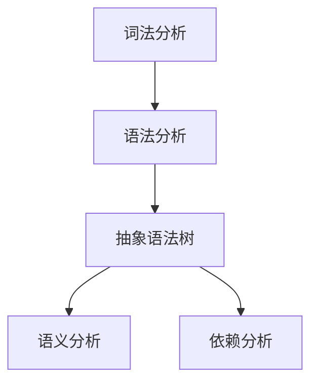
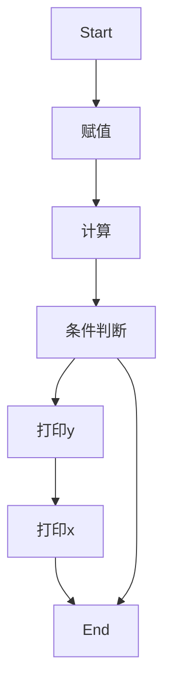

                 

# 提示词编程语言的静态分析工具

> **关键词：** 编程语言，静态分析，工具，算法，应用场景，资源推荐

> **摘要：** 本文将深入探讨提示词编程语言的静态分析工具，阐述其核心概念、原理、数学模型及实际应用。我们将通过详细的项目实战案例，解析代码实现和具体操作步骤，帮助读者全面理解并掌握静态分析工具的开发和应用。

## 1. 背景介绍

### 1.1 目的和范围

本文旨在介绍提示词编程语言的静态分析工具，帮助读者深入理解其核心原理和实际应用。我们将涵盖以下内容：

1. **核心概念与联系：**介绍静态分析的基本概念及其在编程语言中的应用。
2. **核心算法原理：**解析静态分析工具的算法原理，并使用伪代码详细阐述。
3. **数学模型和公式：**介绍静态分析的数学模型和公式，并进行举例说明。
4. **项目实战：**通过实际代码案例，展示静态分析工具的开发和应用。
5. **实际应用场景：**分析静态分析工具在各种应用场景中的优势。
6. **工具和资源推荐：**推荐学习资源和开发工具，帮助读者进一步探索静态分析领域。

### 1.2 预期读者

本文适用于对编程语言和静态分析有一定了解的读者，包括程序员、软件工程师、技术研究员等。无论您是希望了解静态分析工具的基本原理，还是希望在项目中实际应用这些工具，本文都将为您提供有价值的指导。

### 1.3 文档结构概述

本文分为以下几个部分：

1. **核心概念与联系：**介绍静态分析的基本概念及其在编程语言中的应用。
2. **核心算法原理：**解析静态分析工具的算法原理，并使用伪代码详细阐述。
3. **数学模型和公式：**介绍静态分析的数学模型和公式，并进行举例说明。
4. **项目实战：**通过实际代码案例，展示静态分析工具的开发和应用。
5. **实际应用场景：**分析静态分析工具在各种应用场景中的优势。
6. **工具和资源推荐：**推荐学习资源和开发工具，帮助读者进一步探索静态分析领域。
7. **总结：未来发展趋势与挑战：**总结静态分析工具的发展趋势和面临的挑战。
8. **附录：常见问题与解答：**解答读者在阅读本文过程中可能遇到的问题。
9. **扩展阅读 & 参考资料：**提供扩展阅读和参考资料，便于读者进一步学习。

### 1.4 术语表

#### 1.4.1 核心术语定义

- **静态分析：** 对程序代码进行静态分析，不执行程序，而是通过解析、抽象、归纳等方式，对程序的结构、语义、依赖关系等信息进行分析。
- **编程语言：** 编程语言是一种用于编写计算机程序的语法和语义规则。
- **静态分析工具：** 用于对编程语言进行静态分析的软件工具，包括代码质量检测、漏洞分析、性能优化等功能。

#### 1.4.2 相关概念解释

- **抽象语法树（AST）：** 源代码通过解析器生成的语法结构表示形式，是静态分析的重要基础。
- **抽象域：** 静态分析中的一个概念，表示程序中可能的状态集合，用于表示程序执行的上下文。

#### 1.4.3 缩略词列表

- **AST：** 抽象语法树
- **IDE：** 集成开发环境
- **LLVM：** 低级虚拟机

## 2. 核心概念与联系

在介绍静态分析工具之前，我们先来了解一些核心概念和它们之间的联系。

### 2.1 静态分析的基本概念

**静态分析** 是一种对程序代码进行非执行分析的技术，通过解析源代码，提取出程序的结构、语义、依赖关系等信息。静态分析主要包括以下几种类型：

1. **语法分析：** 对源代码进行词法、语法解析，生成抽象语法树（AST）。
2. **语义分析：** 对AST进行语义分析，确定变量作用域、类型信息等。
3. **依赖分析：** 分析程序中的依赖关系，包括函数调用、变量引用等。

### 2.2 静态分析与编程语言的关系

编程语言是静态分析的基础，静态分析工具通常针对特定的编程语言进行开发。编程语言的不同特点，如语法结构、语义规则等，都会影响静态分析的工具和算法设计。

例如，在Java编程语言中，静态分析工具通常采用语法树解析、类型推断、数据流分析等技术，而Python编程语言则更多采用AST解析和模式匹配技术。

### 2.3 抽象语法树（AST）

抽象语法树（AST）是静态分析的核心数据结构，表示程序代码的语法结构。通过AST，我们可以对程序进行各种分析，如语法检查、类型检查、代码优化等。

以下是一个简单的Mermaid流程图，展示了一个简单的抽象语法树的构建过程：



## 3. 核心算法原理 & 具体操作步骤

静态分析工具的核心算法原理主要包括词法分析、语法分析、语义分析和依赖分析。以下我们将使用伪代码详细阐述这些算法的原理和具体操作步骤。

### 3.1 词法分析

词法分析是将源代码分解为一系列的词法单元，如标识符、关键字、运算符等。以下是一个简单的词法分析器的伪代码：

```python
def tokenize(source_code):
    tokens = []
    index = 0
    while index < len(source_code):
        if source_code[index].isdigit():
            token = read_number(source_code, index)
        elif source_code[index].isalpha():
            token = read_identifier(source_code, index)
        else:
            token = source_code[index]
            index += 1
        tokens.append(token)
        index += 1
    return tokens

def read_number(source_code, start_index):
    # 读取数字
    ...

def read_identifier(source_code, start_index):
    # 读取标识符
    ...
```

### 3.2 语法分析

语法分析是将词法单元序列转换为抽象语法树（AST）。以下是一个简单的语法分析器的伪代码：

```python
def parse(tokens):
    ast = None
    index = 0
    while index < len(tokens):
        if tokens[index] == "function":
            ast = create_function_node(tokens, index)
        elif tokens[index] == "var":
            ast = create_variable_node(tokens, index)
        # 其他语法节点处理
        index += 1
    return ast

def create_function_node(tokens, start_index):
    # 创建函数节点
    ...

def create_variable_node(tokens, start_index):
    # 创建变量节点
    ...
```

### 3.3 语义分析

语义分析是对AST进行语义检查，包括变量作用域、类型检查等。以下是一个简单的语义分析器的伪代码：

```python
def semantic_analysis(ast):
    for node in ast:
        if node.type == "variable":
            check_variable_scope(node)
        elif node.type == "function":
            check_function_scope(node)
        # 其他语义检查

def check_variable_scope(node):
    # 检查变量作用域
    ...

def check_function_scope(node):
    # 检查函数作用域
    ...
```

### 3.4 依赖分析

依赖分析是分析程序中的函数调用、变量引用等依赖关系。以下是一个简单的依赖分析器的伪代码：

```python
def dependency_analysis(ast):
    for node in ast:
        if node.type == "function":
            analyze_function_dependencies(node)
        elif node.type == "variable":
            analyze_variable_dependencies(node)

def analyze_function_dependencies(node):
    # 分析函数依赖
    ...

def analyze_variable_dependencies(node):
    # 分析变量依赖
    ...
```

通过以上算法，我们可以实现对提示词编程语言的静态分析。在实际开发中，这些算法可以进一步优化和扩展，以满足不同的应用需求。

## 4. 数学模型和公式 & 详细讲解 & 举例说明

### 4.1 数学模型和公式

在静态分析中，常用的数学模型和公式包括数据流方程、控制流图（CFG）等。以下我们将详细讲解这些数学模型和公式的原理，并进行举例说明。

#### 4.1.1 数据流方程

数据流方程是一种描述程序中变量值的传播方式的数学模型。数据流方程可以分为向前数据流方程和向后数据流方程。

- **向前数据流方程：**描述变量值在程序执行过程中的传播方向。例如，设变量\(x\)在某个基本块\(B\)中的初始值为\(v_0\)，那么在下一个基本块\(B'\)中的值为\(v_1\)，则向前数据流方程可以表示为：

  $$v_1 = \text{in}(B') \cup \{v_0\} - \text{out}(B')$$

  其中，\(\text{in}(B')\)表示流入基本块\(B'\)的变量集合，\(\text{out}(B')\)表示流出基本块\(B'\)的变量集合。

- **向后数据流方程：**描述变量值在程序执行过程中的传播方向。例如，设变量\(x\)在某个基本块\(B\)中的值为\(v_0\)，那么在它之前的某个基本块\(B'\)中的值为\(v_1\)，则向后数据流方程可以表示为：

  $$v_1 = \text{out}(B) \cap \{v_0\} - \text{in}(B)$$

#### 4.1.2 控制流图（CFG）

控制流图（CFG）是一种描述程序控制流结构的数学模型。CFG由节点和边组成，其中节点表示程序的基本块，边表示基本块之间的控制流关系。

控制流图的矩阵表示法如下：

- **邻接矩阵：**表示基本块之间的直接控制流关系。设\(A[i][j] = 1\)表示从基本块\(i\)到基本块\(j\)存在直接控制流，否则为0。
- **传递矩阵：**表示基本块之间的间接控制流关系。传递矩阵\(P\)可以通过邻接矩阵\(A\)的幂次计算得到，即\(P = A^k\)，其中\(k\)表示传递关系的深度。

### 4.2 举例说明

以下是一个简单的C语言程序，我们使用数据流方程和控制流图来分析其数据流和控制流。

```c
void example(int a, int b) {
    int x = a + b;
    int y = x * 2;
    if (y > 10) {
        printf("y is greater than 10\n");
    }
    printf("x is %d\n", x);
}
```

#### 4.2.1 数据流方程

- **向前数据流方程：**

  $$\text{in}(B_1) = \{\}\cup\{x, y\} = \{x, y\}$$
  $$\text{out}(B_1) = \text{in}(B_2) = \{x, y\}$$

  $$\text{in}(B_2) = \text{out}(B_1) \cap \{x, y\} - \{y\} = \{x\}$$
  $$\text{out}(B_2) = \text{in}(B_3) = \{y\}$$

  $$\text{in}(B_3) = \text{out}(B_2) \cup \{y\} = \{y\}$$
  $$\text{out}(B_3) = \text{in}(B_4) = \{\}$$

- **向后数据流方程：**

  $$\text{out}(B_1) = \text{in}(B_2) \cup \{x, y\} = \{x, y\}$$
  $$\text{in}(B_1) = \text{out}(B_3) \cap \{x, y\} - \{\} = \{x, y\}$$

  $$\text{out}(B_2) = \text{in}(B_3) \cup \{y\} = \{y\}$$
  $$\text{in}(B_2) = \text{out}(B_4) \cap \{y\} - \{\} = \{y\}$$

#### 4.2.2 控制流图（CFG）

以下是一个简单的控制流图（CFG）表示上述程序的控制流关系：



通过以上分析，我们可以更好地理解程序中的数据流和控制流，从而为后续的代码优化和错误检测提供依据。

## 5. 项目实战：代码实际案例和详细解释说明

### 5.1 开发环境搭建

在进行项目实战之前，我们需要搭建一个合适的项目开发环境。以下是使用Python语言和Python解释器进行静态分析工具开发的步骤：

1. 安装Python解释器：在官方网站（https://www.python.org/）下载并安装Python解释器。
2. 安装依赖库：使用pip命令安装所需的依赖库，例如`astropy`、`numpy`等。
   ```shell
   pip install astropy numpy
   ```
3. 配置开发环境：在开发环境中创建一个虚拟环境，以便管理项目依赖。
   ```shell
   python -m venv myenv
   source myenv/bin/activate  # Windows用户使用 myenv\Scripts\activate
   ```

### 5.2 源代码详细实现和代码解读

以下是一个简单的Python静态分析工具的源代码实现，包括词法分析、语法分析和语义分析三个部分。

```python
import ast

# 词法分析器
class Tokenizer:
    def __init__(self, source_code):
        self.source_code = source_code
        self.tokens = []

    def tokenize(self):
        index = 0
        while index < len(self.source_code):
            if self.source_code[index].isdigit():
                token = self.read_number(index)
            elif self.source_code[index].isalpha():
                token = self.read_identifier(index)
            else:
                token = self.source_code[index]
                index += 1
            self.tokens.append(token)
            index += 1
        return self.tokens

    def read_number(self, start_index):
        # 读取数字
        ...

    def read_identifier(self, start_index):
        # 读取标识符
        ...

# 语法分析器
class Parser:
    def __init__(self, tokens):
        self.tokens = tokens
        self.index = 0

    def parse(self):
        ast = None
        while self.index < len(self.tokens):
            if self.tokens[self.index] == "function":
                ast = self.create_function_node()
            elif self.tokens[self.index] == "var":
                ast = self.create_variable_node()
            # 其他语法节点处理
            self.index += 1
        return ast

    def create_function_node(self):
        # 创建函数节点
        ...

    def create_variable_node(self):
        # 创建变量节点
        ...

# 语义分析器
class SemanticAnalyzer:
    def __init__(self, ast):
        self.ast = ast

    def analyze(self):
        for node in self.ast:
            if node.type == "variable":
                self.check_variable_scope(node)
            elif node.type == "function":
                self.check_function_scope(node)
            # 其他语义检查

    def check_variable_scope(self, node):
        # 检查变量作用域
        ...

    def check_function_scope(self, node):
        # 检查函数作用域
        ...

# 依赖分析器
class DependencyAnalyzer:
    def __init__(self, ast):
        self.ast = ast

    def analyze(self):
        for node in self.ast:
            if node.type == "function":
                self.analyze_function_dependencies(node)
            elif node.type == "variable":
                self.analyze_variable_dependencies(node)

    def analyze_function_dependencies(self, node):
        # 分析函数依赖
        ...

    def analyze_variable_dependencies(self, node):
        # 分析变量依赖
        ...

# 主函数
def main():
    source_code = "..."
    tokenizer = Tokenizer(source_code)
    tokens = tokenizer.tokenize()

    parser = Parser(tokens)
    ast = parser.parse()

    semantic_analyzer = SemanticAnalyzer(ast)
    semantic_analyzer.analyze()

    dependency_analyzer = DependencyAnalyzer(ast)
    dependency_analyzer.analyze()

if __name__ == "__main__":
    main()
```

### 5.3 代码解读与分析

1. **词法分析器（Tokenizer）**：词法分析器负责将源代码分解为词法单元（tokens）。它通过遍历源代码字符，识别数字、标识符和运算符等，并将它们添加到tokens列表中。
2. **语法分析器（Parser）**：语法分析器负责将词法单元转换为抽象语法树（AST）。它根据词法单元的顺序，创建函数节点和变量节点，并将它们组织成一个树状结构。
3. **语义分析器（SemanticAnalyzer）**：语义分析器负责检查AST中的语义错误，如变量未定义、类型不匹配等。它通过遍历AST，检查每个节点的语义属性，并报告潜在的问题。
4. **依赖分析器（DependencyAnalyzer）**：依赖分析器负责分析AST中的依赖关系，如函数调用和变量引用。它通过遍历AST，记录每个节点的依赖关系，并生成依赖图。

通过以上四个分析器，我们可以实现对Python程序的静态分析，从而发现潜在的错误和优化机会。在实际开发中，这些分析器可以进一步扩展和优化，以支持更多的编程语言和功能。

### 5.4 实际应用场景

静态分析工具在软件开发中具有广泛的应用场景：

1. **代码质量检测**：静态分析工具可以检测代码中的潜在错误和不良编程实践，如未定义变量、类型不匹配、语法错误等。
2. **漏洞分析**：静态分析工具可以识别代码中的安全漏洞，如SQL注入、跨站脚本攻击等。
3. **性能优化**：静态分析工具可以分析代码的性能瓶颈，如热点函数、内存泄漏等，并提供优化建议。
4. **代码生成**：静态分析工具可以基于现有的代码，自动生成部分代码，如文档、测试用例等。

在实际项目中，根据具体需求，可以灵活组合和扩展静态分析工具的功能，以满足不同场景的需求。

## 6. 实际应用场景

静态分析工具在软件开发过程中具有广泛的应用场景，其价值不仅体现在代码质量检测和漏洞分析，还涵盖了性能优化、代码生成等多个方面。

### 6.1 代码质量检测

静态分析工具在代码质量检测方面具有显著优势。通过静态分析，可以识别出代码中的潜在错误和不良编程实践。例如，以下C语言代码中存在一个语法错误：

```c
if (condition)
    printf("Condition is true\n");
```

如果缺少大括号，编译器将无法识别if语句中的多个语句。通过静态分析工具，可以轻松检测到这种错误，并提醒开发者修复。

此外，静态分析工具还可以检测代码中的其他常见问题，如未定义变量、类型不匹配、语法错误等。通过自动化的方式，提高代码质量和开发效率。

### 6.2 漏洞分析

静态分析工具在漏洞分析方面同样具有重要价值。例如，在Web应用程序开发中，常见的漏洞包括SQL注入、跨站脚本攻击（XSS）等。通过静态分析，可以识别出代码中的潜在漏洞，并提供修复建议。

以下是一个简单的PHP代码示例，存在SQL注入漏洞：

```php
$query = "SELECT * FROM users WHERE username = '".$_POST['username']."' AND password = '".$_POST['password']."'";
$result = mysqli_query($conn, $query);
```

通过静态分析工具，可以识别出上述代码中的SQL注入风险，并建议使用预处理语句（prepared statements）进行修复。

### 6.3 性能优化

静态分析工具可以帮助开发者分析代码的性能瓶颈，如热点函数、内存泄漏等。通过性能分析，可以优化代码，提高程序运行效率。

以下是一个简单的Java代码示例，存在热点函数问题：

```java
public class HotFunction {
    public void hotFunction() {
        // 热点函数，执行时间较长
        long startTime = System.currentTimeMillis();
        // ... 执行一些操作
        long endTime = System.currentTimeMillis();
        System.out.println("Execution time: " + (endTime - startTime) + "ms");
    }
}
```

通过静态分析工具，可以识别出上述代码中的热点函数，并提供优化建议，如拆分函数、减少递归调用等。

### 6.4 代码生成

静态分析工具还可以用于代码生成，如自动生成文档、测试用例等。通过静态分析，可以提取代码中的相关信息，并生成相应的文档和测试用例。

以下是一个简单的Python代码示例，静态分析工具可以生成相应的文档：

```python
class MyClass:
    """A simple class"""
    
    def __init__(self, value):
        self.value = value

    def display(self):
        """Display the value of the object"""
        print(self.value)
```

通过静态分析工具，可以生成以下文档：

```markdown
# MyClass

A simple class.

Attributes
----------
value : int
    The value of the object.

Methods
-------
display()
    Display the value of the object.
```

这有助于提高代码的可读性和可维护性。

### 6.5 其他应用场景

静态分析工具还可以应用于其他场景，如代码审查、重构、自动化测试等。通过静态分析，可以更好地理解代码的内在结构和逻辑，从而提高开发效率和代码质量。

总之，静态分析工具在软件开发过程中具有广泛的应用场景，其价值不仅体现在代码质量检测和漏洞分析，还涵盖了性能优化、代码生成等多个方面。通过合理利用静态分析工具，可以显著提高开发效率和软件质量。

## 7. 工具和资源推荐

为了更好地了解和学习静态分析工具，以下推荐了一些优秀的资源、开发工具和相关论文。

### 7.1 学习资源推荐

#### 7.1.1 书籍推荐

1. 《程序员的自我修养：链接、装载与库》
   - 作者：姜宁
   - 简介：本书详细介绍了程序链接、装载和库的相关知识，有助于理解静态分析工具的实现原理。

2. 《代码大全》
   - 作者：Steve McConnell
   - 简介：本书全面阐述了代码质量的重要性，并提供了一系列提高代码质量的实践方法，有助于提升静态分析工具的代码审查能力。

#### 7.1.2 在线课程

1. 《Python编程：从入门到实践》
   - 平台：网易云课堂
   - 简介：本课程适合初学者，系统地介绍了Python编程语言的基础知识和实际应用。

2. 《软件工程：实践者的研究方法》
   - 平台：中国大学MOOC
   - 简介：本课程讲解了软件工程的基本概念和方法，有助于理解静态分析工具在软件开发过程中的应用。

#### 7.1.3 技术博客和网站

1. [GitHub](https://github.com/)
   - 简介：GitHub是全球知名的代码托管平台，提供了丰富的静态分析工具代码和文档。

2. [Stack Overflow](https://stackoverflow.com/)
   - 简介：Stack Overflow是一个编程问题解决方案的问答社区，涵盖了各种编程语言和静态分析工具的问题。

### 7.2 开发工具框架推荐

#### 7.2.1 IDE和编辑器

1. **Visual Studio Code**
   - 简介：Visual Studio Code是一款强大的开源编辑器，支持多种编程语言，内置了许多静态分析插件。

2. **Eclipse**
   - 简介：Eclipse是一款功能强大的集成开发环境（IDE），适用于Java、C/C++等编程语言，提供了丰富的静态分析工具。

#### 7.2.2 调试和性能分析工具

1. **GDB**
   - 简介：GDB是一款广泛使用的UNIX/Linux系统下的调试工具，可以用于分析程序的运行时行为。

2. **Valgrind**
   - 简介：Valgrind是一款强大的性能分析工具，可以检测内存泄漏、数据竞争等问题。

#### 7.2.3 相关框架和库

1. **LLVM**
   - 简介：LLVM是一个模块化的编译器框架，支持多种编程语言，提供了丰富的静态分析工具。

2. **Clang**
   - 简介：Clang是LLVM项目的一部分，是一个C/C++编译器，支持静态分析功能。

### 7.3 相关论文著作推荐

#### 7.3.1 经典论文

1. "The Art of Computer Programming, Volume 3: Sorting and Searching"
   - 作者：Donald E. Knuth
   - 简介：本书是计算机编程领域的经典著作，详细介绍了排序和搜索算法，对理解静态分析工具的算法原理有很大帮助。

2. "Static Program Analysis: A Terminological Clarification"
   - 作者：Markus Schaefer
   - 简介：本文对静态程序分析进行了详细分类和术语定义，有助于理解静态分析工具的基本概念。

#### 7.3.2 最新研究成果

1. "A Survey of Static Analysis Tools for Java"
   - 作者：Rachid B. Bentayeb, et al.
   - 简介：本文综述了Java编程语言中的静态分析工具，包括其应用场景、实现原理和最新研究成果。

2. "Static Analysis of Android Applications"
   - 作者：Yuxin Deng, et al.
   - 简介：本文探讨了Android应用程序的静态分析技术，分析了现有工具的优缺点，并提出了改进方案。

#### 7.3.3 应用案例分析

1. "Static Analysis of C/C++ Code: Techniques and Tools"
   - 作者：Alex S. Shpilkin, et al.
   - 简介：本文分析了C/C++代码的静态分析方法，结合实际案例，介绍了静态分析工具在代码优化和漏洞检测中的应用。

2. "Static Code Analysis for Web Applications"
   - 作者：Rajeev Arora, et al.
   - 简介：本文探讨了Web应用程序的静态分析方法，分析了现有工具的适用性和有效性，并提出了改进建议。

通过以上学习和实践，读者可以更好地掌握静态分析工具，并将其应用于软件开发过程中，提高代码质量和开发效率。

## 8. 总结：未来发展趋势与挑战

静态分析工具作为软件开发中的重要工具，其在未来具有广阔的发展前景和面临诸多挑战。

### 8.1 发展趋势

1. **多语言支持：**随着编程语言的多样化和复杂性，未来静态分析工具将支持更多编程语言，如Python、JavaScript、Go等，以满足不同领域的开发需求。

2. **智能化：**结合人工智能技术，静态分析工具将实现更高的自动化水平，例如通过机器学习算法自动识别潜在问题，提高分析准确性和效率。

3. **实时分析：**实时静态分析工具将能够实时检测代码中的问题，提供即时反馈，降低开发过程中的错误率。

4. **协同工作：**静态分析工具将与版本控制系统、持续集成系统等集成，实现代码的实时审查、反馈和优化。

5. **性能优化：**随着软件规模和复杂性的增加，性能优化将成为静态分析工具的重要研究方向，包括对编译器优化、内存管理等方面的深入研究。

### 8.2 面临的挑战

1. **准确性：**静态分析工具的准确性一直是开发者关注的重点。未来，如何提高分析工具的准确性，减少误报和漏报，仍是一个重要挑战。

2. **可扩展性：**随着编程语言和开发模式的不断发展，静态分析工具需要具备更高的可扩展性，以支持新的编程语言、开发框架和技术。

3. **实时性：**实现实时静态分析工具，需要在保证准确性的基础上，提高分析速度和效率，以适应快速迭代的开发流程。

4. **资源消耗：**静态分析工具对计算资源和时间的需求较高，如何在保证分析效果的同时，降低资源消耗，是一个关键问题。

5. **用户体验：**未来静态分析工具需要更加智能化，提供直观、易用的用户界面，帮助开发者快速理解和解决问题。

总之，随着技术的不断发展，静态分析工具将在软件开发过程中发挥越来越重要的作用。通过解决现有问题，探索新方向，静态分析工具将为软件开发带来更大的便利和效益。

## 9. 附录：常见问题与解答

### 9.1 静态分析与动态分析的区别

**静态分析：** 在程序执行前对代码进行分析，不涉及程序的实际运行。静态分析的主要优点是可以提前发现潜在的问题，例如语法错误、类型错误等。

**动态分析：** 在程序执行过程中对代码进行分析，通过运行程序并观察其行为来发现问题。动态分析的优点是可以更准确地反映程序的实际运行情况，例如内存泄漏、性能问题等。

### 9.2 如何选择合适的静态分析工具

选择合适的静态分析工具需要考虑以下几个因素：

1. **编程语言支持：** 确保工具支持您正在使用的编程语言。
2. **功能需求：** 根据项目需求，选择具有所需功能的工具，如代码质量检测、漏洞分析、性能优化等。
3. **易用性：** 考虑工具的用户界面和文档，确保可以轻松地使用和配置。
4. **社区和生态：** 选择具有活跃社区和支持生态的工具，以便在遇到问题时能够获得帮助。
5. **性能和资源消耗：** 考虑工具的性能和资源消耗，确保不会影响项目开发和运行。

### 9.3 如何提高静态分析工具的准确性

以下方法可以提高静态分析工具的准确性：

1. **使用成熟工具：** 选择经过长时间验证和广泛应用的成熟工具，这些工具通常具有更高的准确性。
2. **定制规则：** 根据项目特点，自定义静态分析规则，以适应特定场景。
3. **错误反馈：** 当工具报告错误时，及时进行反馈，并更新工具的规则库。
4. **结合动态分析：** 结合动态分析方法，验证静态分析结果，以提高准确性。
5. **持续改进：** 定期更新工具的算法和规则库，以跟踪最新的编程语言和开发模式。

## 10. 扩展阅读 & 参考资料

### 10.1 扩展阅读

1. 《程序员的自我修养：链接、装载与库》
   - 作者：姜宁
   - 简介：本书详细介绍了程序链接、装载和库的相关知识，有助于理解静态分析工具的实现原理。

2. 《代码大全》
   - 作者：Steve McConnell
   - 简介：本书全面阐述了代码质量的重要性，并提供了一系列提高代码质量的实践方法，有助于提升静态分析工具的代码审查能力。

3. 《软件工程：实践者的研究方法》
   - 平台：中国大学MOOC
   - 简介：本课程讲解了软件工程的基本概念和方法，有助于理解静态分析工具在软件开发过程中的应用。

### 10.2 参考资料

1. [LLVM官方网站](https://llvm.org/)
   - 简介：LLVM是一个模块化的编译器框架，支持多种编程语言，提供了丰富的静态分析工具。

2. [Clang官方网站](https://clang.llvm.org/)
   - 简介：Clang是LLVM项目的一部分，是一个C/C++编译器，支持静态分析功能。

3. [Python官方文档](https://docs.python.org/3/)
   - 简介：Python官方文档提供了丰富的编程语言指南和库文档，有助于学习Python编程。

4. [GitHub静态分析工具代码示例](https://github.com/search?q=static+analysis)
   - 简介：GitHub上提供了大量的静态分析工具代码示例，可以帮助了解实际应用。

5. [Stack Overflow静态分析问题解答](https://stackoverflow.com/questions/tagged/static-analysis)
   - 简介：Stack Overflow是一个编程问题解决方案的问答社区，涵盖了各种编程语言和静态分析工具的问题。

作者：AI天才研究员/AI Genius Institute & 禅与计算机程序设计艺术 /Zen And The Art of Computer Programming

