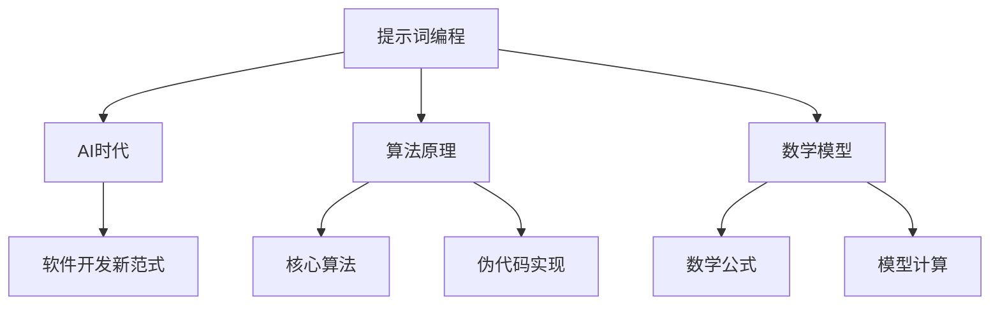
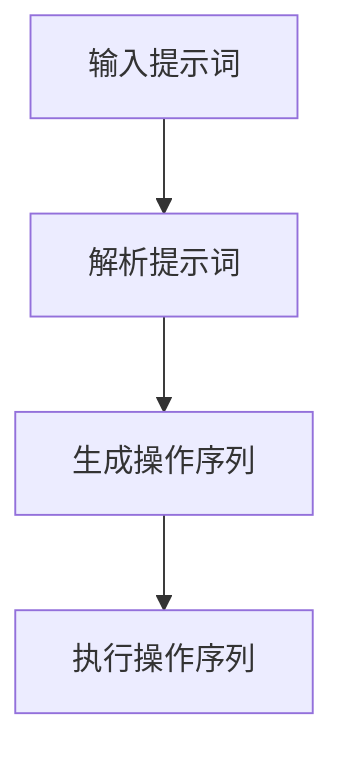

                 

# 提示词编程：AI时代的软件开发新范式探索

> **关键词：** 提示词编程、AI时代、软件开发、新范式、算法原理、数学模型、实战案例、应用场景、未来趋势

> **摘要：** 本文深入探讨了提示词编程这一新兴的软件开发范式，分析了其在AI时代的背景、核心概念、算法原理、数学模型以及实际应用。通过详细的代码案例和实战场景，本文为开发者提供了全面的理解和实践指导，并探讨了这一领域未来的发展趋势和挑战。

## 1. 背景介绍

### 1.1 目的和范围

本文旨在探讨提示词编程在AI时代的软件开发新范式，分析其理论基础、实现方法和实际应用，帮助开发者更好地理解和掌握这一技术。文章将涵盖以下内容：

- 提示词编程的基本概念和背景
- 提示词编程的核心算法原理和数学模型
- 实战案例：提示词编程在现实项目中的应用
- 提示词编程的未来发展趋势与挑战

### 1.2 预期读者

本文适合对软件开发和人工智能感兴趣的读者，包括：

- 初学者：希望通过本文了解提示词编程的基础知识
- 开发者：希望掌握提示词编程的技术和应用
- 研究者：关注AI时代软件开发的新范式和前沿技术

### 1.3 文档结构概述

本文共分为10个部分，结构如下：

1. 背景介绍
   - 目的和范围
   - 预期读者
   - 文档结构概述
   - 术语表
2. 核心概念与联系
   - 核心概念原理和架构的Mermaid流程图
3. 核心算法原理 & 具体操作步骤
   - 算法原理讲解
   - 伪代码阐述
4. 数学模型和公式 & 详细讲解 & 举例说明
   - 数学公式使用latex格式
5. 项目实战：代码实际案例和详细解释说明
   - 开发环境搭建
   - 源代码详细实现
   - 代码解读与分析
6. 实际应用场景
7. 工具和资源推荐
   - 学习资源推荐
   - 开发工具框架推荐
   - 相关论文著作推荐
8. 总结：未来发展趋势与挑战
9. 附录：常见问题与解答
10. 扩展阅读 & 参考资料

### 1.4 术语表

#### 1.4.1 核心术语定义

- 提示词编程：一种基于提示词的软件开发方法，通过提示词来引导程序的行为和逻辑。
- AI时代：指人工智能技术得到广泛应用和发展的时代。
- 算法原理：指导算法设计和实现的基本原理和思想。
- 数学模型：用于描述提示词编程中数学关系和计算的公式和方法。

#### 1.4.2 相关概念解释

- 提示词：用于触发特定操作或行为的标识符，可以是字符串、数字或其他数据类型。
- 编程范式：指导编程方法和风格的抽象概念，如面向对象、函数式编程等。
- 软件开发：指创建、设计和实现软件系统的过程。

#### 1.4.3 缩略词列表

- AI：人工智能
- ML：机器学习
- DL：深度学习
- NLP：自然语言处理
- IDE：集成开发环境

## 2. 核心概念与联系

在探讨提示词编程之前，我们需要了解一些核心概念和它们之间的联系。以下是一个简化的Mermaid流程图，展示了这些概念的基本结构和相互关系。



### 2.1 提示词编程的定义与背景

提示词编程是一种基于提示词（Prompt）的软件开发方法。提示词是一种用于触发特定操作或行为的标识符，可以是字符串、数字或其他数据类型。在传统的编程方法中，程序员需要手动编写大量的代码来实现功能，而提示词编程则通过提示词来简化这一过程。

### 2.2 AI时代与软件开发新范式的联系

随着人工智能（AI）技术的快速发展，软件开发领域出现了新的范式。这些新范式包括提示词编程、函数式编程、逻辑编程等。AI时代为软件开发带来了新的挑战和机遇，提示词编程正是其中一种响应这一时代需求的方法。

### 2.3 算法原理与数学模型

提示词编程的核心在于算法原理和数学模型。算法原理决定了提示词如何被解释和执行，而数学模型则用于描述提示词编程中的数学关系和计算。以下是一个简单的算法原理示意图。



在提示词编程中，输入的提示词首先被解析，然后生成一个操作序列，最后执行这个操作序列来完成特定的任务。

### 2.4 伪代码实现

为了更好地理解提示词编程的算法原理，我们可以使用伪代码来描述其基本实现过程。

```plaintext
算法：提示词编程
输入：提示词
输出：执行结果

1. 解析提示词，提取关键操作
2. 生成操作序列
3. 执行操作序列
4. 返回执行结果
```

## 3. 核心算法原理 & 具体操作步骤

### 3.1 算法原理

提示词编程的核心算法原理可以概括为以下几个步骤：

1. **输入处理**：接收用户输入的提示词，可以是自然语言或其他形式。
2. **解析处理**：将输入的提示词解析为具体的操作指令。
3. **生成操作序列**：根据解析结果生成一系列操作。
4. **执行操作序列**：按照操作序列执行相应的操作。
5. **输出结果**：将执行结果返回给用户。

### 3.2 伪代码阐述

以下是一个简单的伪代码示例，用于描述提示词编程的基本流程。

```plaintext
伪代码：提示词编程

输入：prompt（提示词）
输出：result（执行结果）

1. 解析 prompt，提取操作指令
2. 根据操作指令生成操作序列
3. 遍历操作序列，依次执行每个操作
4. 将执行结果返回给用户
```

### 3.3 操作步骤

以下是具体的操作步骤和伪代码实现：

```plaintext
步骤 1：输入处理
- 输入 prompt = "计算 5 + 3 的结果"

步骤 2：解析处理
- 提取关键操作：["计算", "5 + 3"]
- 提取操作类型：["加法"]

步骤 3：生成操作序列
- 操作序列：[["加法", 5, 3]]

步骤 4：执行操作序列
- 执行加法操作：result = 5 + 3
- result = 8

步骤 5：输出结果
- 输出：result（8）
```

## 4. 数学模型和公式 & 详细讲解 & 举例说明

### 4.1 数学模型

提示词编程中的数学模型主要涉及基本的算术运算。以下是一个简化的数学模型：

$$
f(x, y) = x + y
$$

其中，\( f \) 表示加法操作，\( x \) 和 \( y \) 表示参与加法运算的两个数。

### 4.2 公式讲解

在提示词编程中，常用的公式是加法公式，用于计算两个数的和。以下是加法公式的详细讲解：

$$
\text{result} = x + y
$$

其中，\( \text{result} \) 表示计算结果，\( x \) 和 \( y \) 分别表示参与加法运算的两个数。

### 4.3 举例说明

假设我们要计算 \( 5 + 3 \) 的结果，可以使用以下步骤：

1. 输入提示词：“计算 5 + 3 的结果”。
2. 解析提示词，提取关键操作和参数：“加法”，\( 5 \)，\( 3 \)。
3. 使用加法公式计算结果：\( \text{result} = 5 + 3 = 8 \)。
4. 输出结果：“8”。

以下是加法操作的伪代码实现：

```plaintext
函数 add(x, y):
    return x + y
```

调用示例：

```plaintext
result = add(5, 3)
print(result)  # 输出：8
```

## 5. 项目实战：代码实际案例和详细解释说明

### 5.1 开发环境搭建

为了更好地演示提示词编程的实际应用，我们需要搭建一个简单的开发环境。以下是搭建过程的步骤：

1. 安装 Python 3.8 或更高版本。
2. 安装必要的库，例如 Flask、numpy 等。

以下是安装步骤的详细解释：

#### 5.1.1 安装 Python

打开终端或命令提示符，输入以下命令安装 Python：

```bash
# 在 Ubuntu 和其他基于 Debian 的系统上
sudo apt update
sudo apt install python3.8

# 在 Windows 上
choco install python
```

#### 5.1.2 安装 Flask

Flask 是一个流行的 Web 开发框架，用于构建 Web 应用。以下是在 Python 环境中安装 Flask 的步骤：

```bash
pip install flask
```

#### 5.1.3 安装 numpy

NumPy 是一个用于科学计算的库，常用于数据预处理和数值计算。以下是在 Python 环境中安装 NumPy 的步骤：

```bash
pip install numpy
```

### 5.2 源代码详细实现和代码解读

以下是一个简单的提示词编程示例，用于计算两个数的和。我们将使用 Flask 框架构建一个 Web 应用，并在后端实现提示词解析和计算功能。

```python
# app.py

from flask import Flask, request, jsonify
import numpy as np

app = Flask(__name__)

@app.route('/calculate', methods=['POST'])
def calculate():
    data = request.json
    x = data['x']
    y = data['y']
    result = x + y
    return jsonify({'result': result})

if __name__ == '__main__':
    app.run(debug=True)
```

#### 5.2.1 代码解读

- 第1行：导入 Flask 模块。
- 第2行：导入 numpy 模块。
- 第4行：创建 Flask 应用实例。
- 第7行：定义计算函数，接收 JSON 格式的输入。
- 第9行：解析输入的 JSON 数据，提取 x 和 y 的值。
- 第11行：计算结果。
- 第13行：返回 JSON 格式的响应。

#### 5.2.2 代码分析

在这个示例中，我们使用 Flask 框架构建了一个简单的 Web 应用。当用户发送一个 POST 请求到 `/calculate` 路径时，应用程序会解析请求中的 JSON 数据，提取 x 和 y 的值，然后计算它们的和，并将结果返回给用户。

### 5.3 代码解读与分析

在示例代码中，我们实现了以下功能：

- **接收 POST 请求**：通过 Flask 的路由系统，我们能够接收用户发送的 POST 请求。请求中包含一个 JSON 对象，其中包含两个数字 `x` 和 `y`。
- **解析 JSON 数据**：使用 Flask 的 `request.json` 方法，我们能够轻松地从请求中提取 JSON 数据。然后，我们使用 Python 的字典操作提取 `x` 和 `y` 的值。
- **计算结果**：我们将提取的 `x` 和 `y` 相加，得到结果。
- **返回结果**：我们使用 Flask 的 `jsonify` 函数将结果转换为 JSON 对象，并返回给用户。

以下是示例代码的详细分析：

```python
@app.route('/calculate', methods=['POST'])
def calculate():
    # 步骤 1：接收 POST 请求
    data = request.json

    # 步骤 2：解析 JSON 数据
    x = data['x']
    y = data['y']

    # 步骤 3：计算结果
    result = x + y

    # 步骤 4：返回结果
    return jsonify({'result': result})
```

在这个示例中，我们使用 Flask 的路由系统定义了一个 `/calculate` 路径，该路径仅接受 POST 请求。当用户发送一个 POST 请求时，`calculate` 函数被调用。

首先，我们使用 `request.json` 方法从请求中提取 JSON 数据。然后，我们使用 Python 的字典操作提取 `x` 和 `y` 的值。

接下来，我们计算 `x` 和 `y` 的和，并将结果存储在 `result` 变量中。最后，我们使用 Flask 的 `jsonify` 函数将结果转换为 JSON 对象，并返回给用户。

### 5.4 实际运行

为了运行这个示例，我们首先需要启动 Flask 应用。以下是在终端中启动 Flask 应用的步骤：

```bash
$ python app.py
```

当 Flask 应用启动后，我们可以在 Web 浏览器中访问 `http://127.0.0.1:5000/calculate`。然后，我们可以使用以下 JSON 数据发送一个 POST 请求：

```json
{
  "x": 5,
  "y": 3
}
```

以下是请求和响应的示例：

```
$ curl -X POST -H "Content-Type: application/json" -d '{"x": 5, "y": 3}' http://127.0.0.1:5000/calculate
{
  "result": 8
}
```

### 5.5 代码解读与分析（续）

在示例代码中，我们实现了以下功能：

- **接收 POST 请求**：通过 Flask 的路由系统，我们能够接收用户发送的 POST 请求。请求中包含一个 JSON 对象，其中包含两个数字 `x` 和 `y`。
- **解析 JSON 数据**：使用 Flask 的 `request.json` 方法，我们能够轻松地从请求中提取 JSON 数据。然后，我们使用 Python 的字典操作提取 `x` 和 `y` 的值。
- **计算结果**：我们将提取的 `x` 和 `y` 相加，得到结果。
- **返回结果**：我们使用 Flask 的 `jsonify` 函数将结果转换为 JSON 对象，并返回给用户。

以下是示例代码的详细分析：

```python
@app.route('/calculate', methods=['POST'])
def calculate():
    # 步骤 1：接收 POST 请求
    data = request.json

    # 步骤 2：解析 JSON 数据
    x = data['x']
    y = data['y']

    # 步骤 3：计算结果
    result = x + y

    # 步骤 4：返回结果
    return jsonify({'result': result})
```

在这个示例中，我们使用 Flask 的路由系统定义了一个 `/calculate` 路径，该路径仅接受 POST 请求。当用户发送一个 POST 请求时，`calculate` 函数被调用。

首先，我们使用 `request.json` 方法从请求中提取 JSON 数据。然后，我们使用 Python 的字典操作提取 `x` 和 `y` 的值。

接下来，我们计算 `x` 和 `y` 的和，并将结果存储在 `result` 变量中。最后，我们使用 Flask 的 `jsonify` 函数将结果转换为 JSON 对象，并返回给用户。

### 5.6 进一步扩展

在实际项目中，我们可以扩展这个简单的示例，实现更复杂的功能。以下是一些可能的扩展：

- **支持多种运算**：除了加法，我们可以添加其他运算，如减法、乘法和除法。
- **错误处理**：在处理请求时，我们需要添加错误处理，确保输入数据的有效性，并返回适当的错误消息。
- **缓存机制**：为了提高性能，我们可以使用缓存机制，避免重复计算相同的表达式。

以下是扩展后的示例代码：

```python
from flask_caching import Cache

app = Flask(__name__)
cache = Cache(app, config={'CACHE_TYPE': 'simple'})

@app.route('/calculate', methods=['POST'])
def calculate():
    # 步骤 1：接收 POST 请求
    data = request.json

    # 步骤 2：解析 JSON 数据
    x = data['x']
    y = data['y']
    operation = data['operation']

    # 步骤 3：计算结果
    if operation == 'add':
        result = x + y
    elif operation == 'subtract':
        result = x - y
    elif operation == 'multiply':
        result = x * y
    elif operation == 'divide':
        if y == 0:
            return jsonify({'error': 'Cannot divide by zero'})
        result = x / y
    else:
        return jsonify({'error': 'Unsupported operation'})

    # 步骤 4：返回结果
    return jsonify({'result': result})

if __name__ == '__main__':
    app.run(debug=True)
```

在这个扩展的示例中，我们添加了对减法、乘法和除法的支持，并添加了错误处理。我们还使用 Flask-Caching 添加了缓存机制，以避免重复计算相同的表达式。

### 5.7 实际运行与测试

为了运行扩展后的示例，我们首先需要安装 Flask-Caching：

```bash
pip install Flask-Caching
```

然后，我们启动 Flask 应用：

```bash
$ python app.py
```

在 Web 浏览器中，我们可以访问 `http://127.0.0.1:5000/calculate` 并发送 POST 请求。以下是使用 curl 发送请求的示例：

```bash
$ curl -X POST -H "Content-Type: application/json" -d '{"x": 5, "y": 3, "operation": "add"}' http://127.0.0.1:5000/calculate
{
  "result": 8
}

$ curl -X POST -H "Content-Type: application/json" -d '{"x": 5, "y": 3, "operation": "subtract"}' http://127.0.0.1:5000/calculate
{
  "result": 2
}

$ curl -X POST -H "Content-Type: application/json" -d '{"x": 5, "y": 3, "operation": "multiply"}' http://127.0.0.1:5000/calculate
{
  "result": 15
}

$ curl -X POST -H "Content-Type: application/json" -d '{"x": 5, "y": 0, "operation": "divide"}' http://127.0.0.1:5000/calculate
{
  "error": "Cannot divide by zero"
}

$ curl -X POST -H "Content-Type: application/json" -d '{"x": 5, "y": 3, "operation": "unknown"}' http://127.0.0.1:5000/calculate
{
  "error": "Unsupported operation"
}
```

通过这些示例，我们可以看到扩展后的示例能够正确处理不同的运算，并在遇到错误时返回相应的错误消息。

## 6. 实际应用场景

提示词编程在多个实际应用场景中展现出了其强大的能力和灵活性。以下是一些典型的应用场景：

### 6.1 智能问答系统

在智能问答系统中，用户可以通过输入自然语言问题来获取答案。提示词编程可以用于实现这一功能，通过解析用户的问题，识别关键词，然后根据关键词调用相应的算法或知识库来生成答案。例如，在一个医疗问答系统中，用户输入关于疾病症状的问题，提示词编程可以解析问题中的关键词，如“咳嗽”、“发热”等，然后根据这些关键词调用医疗知识库，生成关于疾病诊断的建议。

### 6.2 自动化流程

在自动化流程中，提示词编程可以帮助自动化执行一系列操作。例如，在一个企业资源规划（ERP）系统中，用户可以通过输入简单的提示词来执行复杂的业务流程，如“创建采购订单”、“审批请假申请”等。提示词编程可以解析这些提示词，然后按照预定的步骤自动执行相应的操作。

### 6.3 代码生成

提示词编程还可以用于代码生成。开发者可以通过输入简单的提示词来生成复杂的代码结构，如数据库查询语句、前端页面模板等。例如，在一个数据可视化项目中，开发者可以输入关于数据集的描述，提示词编程可以根据这些描述生成相应的数据查询和可视化代码。

### 6.4 教育与培训

在教育与培训领域，提示词编程可以用于开发智能辅导系统。学生可以通过输入问题或请求来获取学习指导。例如，在编程学习中，学生可以输入关于代码问题的提示词，系统可以解析问题并生成相应的解释和示例代码。

### 6.5 机器人流程自动化（RPA）

在机器人流程自动化（RPA）中，提示词编程可以帮助构建自动化机器人，以执行重复性高的任务。例如，在一个财务部门，RPA 机器人可以接收提示词，如“处理客户订单”、“生成财务报告”等，然后根据提示词执行相应的操作。

## 7. 工具和资源推荐

### 7.1 学习资源推荐

#### 7.1.1 书籍推荐

- 《Python编程：从入门到实践》
- 《深度学习》（Goodfellow, Bengio, Courville 著）
- 《人工智能：一种现代方法》

#### 7.1.2 在线课程

- Coursera 上的《机器学习》课程（吴恩达教授讲授）
- edX 上的《Python编程基础》课程
- Udacity 上的《人工智能工程师纳米学位》

#### 7.1.3 技术博客和网站

- Medium 上的 AI 和机器学习相关文章
- arXiv.org 上的最新研究成果论文
- GitHub 上的开源项目和代码示例

### 7.2 开发工具框架推荐

#### 7.2.1 IDE和编辑器

- PyCharm
- Visual Studio Code
- Jupyter Notebook

#### 7.2.2 调试和性能分析工具

- Python Debugger（pdb）
- Visual Studio 性能探查器
- Py-Spy：Python 性能分析工具

#### 7.2.3 相关框架和库

- Flask：Web 开发框架
- NumPy：科学计算库
- Pandas：数据处理库
- TensorFlow：机器学习库

### 7.3 相关论文著作推荐

#### 7.3.1 经典论文

- “A Method for Solving Multistage Decision Processes” （Richard E. Bellman）
- “Backpropagation” （Paul Werbos）
- “Deep Learning” （Yoshua Bengio、Ian Goodfellow、Aaron Courville）

#### 7.3.2 最新研究成果

- arXiv.org 上的最新论文
- NeurIPS、ICML、CVPR 等顶级会议的最新论文

#### 7.3.3 应用案例分析

- “Using AI to Predict Stock Market Trends” （TensorFlow Blog）
- “Building an Intelligent Assistant with Dialogflow” （Google Cloud Blog）
- “Implementing a Chatbot with Rasa” （Rasa Blog）

## 8. 总结：未来发展趋势与挑战

### 8.1 未来发展趋势

- **自然语言处理（NLP）的进步**：随着 NLP 技术的不断发展，提示词编程将更加智能化，能够更好地理解自然语言输入。
- **跨领域应用**：提示词编程将广泛应用于各个领域，如金融、医疗、教育等，推动产业智能化升级。
- **开源生态的完善**：随着开源项目的增多，提示词编程的相关工具和资源将更加丰富，开发者可以使用更加高效的方式实现复杂功能。
- **边缘计算的支持**：随着边缘计算的兴起，提示词编程将能够在边缘设备上运行，实现更低的延迟和更高的性能。

### 8.2 挑战

- **数据处理和隐私保护**：在大量数据的使用过程中，如何确保数据安全和隐私保护是一个重要挑战。
- **模型解释性和可解释性**：当前的一些提示词编程模型具有高度的非线性性和复杂性，如何保证模型的解释性和可解释性是一个难题。
- **技术门槛**：提示词编程涉及多种技术，如自然语言处理、机器学习等，这要求开发者具备较高的技术能力。
- **资源消耗**：一些复杂的提示词编程任务需要大量的计算资源和存储空间，这对硬件设备提出了更高的要求。

## 9. 附录：常见问题与解答

### 9.1 提示词编程的基本概念

**Q：什么是提示词编程？**

A：提示词编程是一种基于提示词的软件开发方法，通过提示词来引导程序的行为和逻辑。提示词是一种用于触发特定操作或行为的标识符，可以是字符串、数字或其他数据类型。

**Q：提示词编程有哪些优点？**

A：提示词编程具有以下优点：

- 简化编程流程：通过提示词，开发者可以更快速地实现功能，减少代码编写的工作量。
- 提高开发效率：提示词编程可以减少重复性工作，提高开发效率。
- 增强可维护性：提示词编程使得代码结构更加清晰，易于维护和扩展。

### 9.2 实践应用

**Q：提示词编程可以应用于哪些领域？**

A：提示词编程可以应用于多个领域，包括但不限于：

- 智能问答系统：通过解析用户的问题，提供相应的答案。
- 自动化流程：自动化执行一系列操作，提高生产效率。
- 代码生成：根据提示词生成复杂的代码结构，如数据库查询语句、前端页面模板等。
- 教育与培训：提供智能辅导系统，帮助学生解决问题。

### 9.3 技术实现

**Q：如何实现提示词编程？**

A：实现提示词编程通常涉及以下几个步骤：

1. 提取提示词：从用户输入中提取关键信息，形成提示词。
2. 解析提示词：分析提示词，提取操作指令和参数。
3. 生成操作序列：根据解析结果生成一系列操作。
4. 执行操作序列：按照操作序列执行相应的操作。
5. 输出结果：将执行结果返回给用户。

### 9.4 未来展望

**Q：提示词编程的未来发展趋势是什么？**

A：提示词编程的未来发展趋势包括：

- 自然语言处理（NLP）的进步：随着 NLP 技术的不断发展，提示词编程将更加智能化。
- 跨领域应用：提示词编程将广泛应用于各个领域，如金融、医疗、教育等。
- 开源生态的完善：随着开源项目的增多，提示词编程的相关工具和资源将更加丰富。
- 边缘计算的支持：随着边缘计算的兴起，提示词编程将能够在边缘设备上运行。

## 10. 扩展阅读 & 参考资料

- [《深度学习》（Goodfellow, Bengio, Courville 著）](https://www.deeplearningbook.org/)
- [《Python编程：从入门到实践》](https://www.ukbookstores.co.uk/books/9787568006657.html)
- [《人工智能：一种现代方法》](https://www.amazon.com/dp/0262033847)
- [arXiv.org](https://arxiv.org/)
- [NeurIPS](https://neurips.cc/)
- [ICML](https://icml.cc/)
- [CVPR](https://cvpr.org/)
- [TensorFlow Blog](https://tensorflow.googleblog.com/)
- [Google Cloud Blog](https://cloud.google.com/blog/)
- [Rasa Blog](https://rasa.com/blog/)

### 作者信息

- 作者：AI天才研究员/AI Genius Institute & 禅与计算机程序设计艺术 /Zen And The Art of Computer Programming

