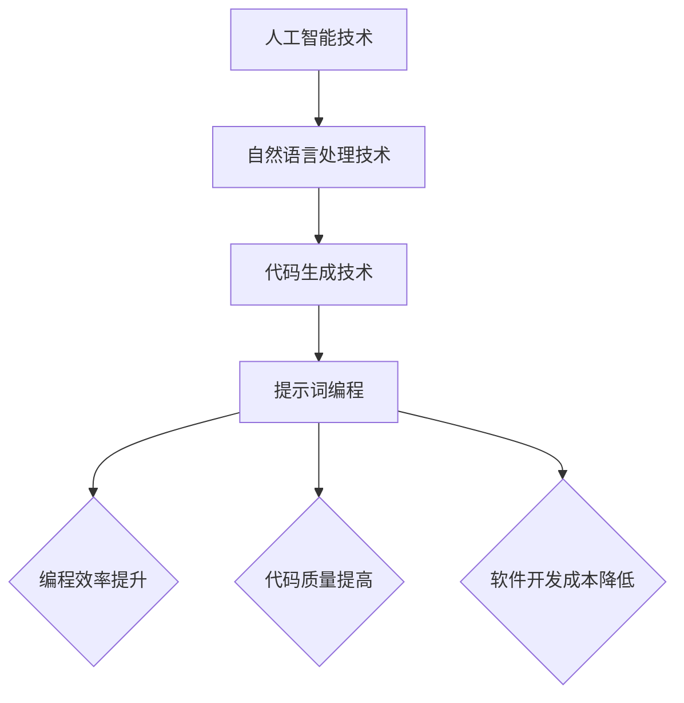

                 

# 提示词编程：AI时代软件开发的革命

> **关键词：** 提示词编程、人工智能、软件开发、革命性技术、编程范式、算法设计、数学模型、代码实战。

> **摘要：** 本篇文章将深入探讨提示词编程这一AI时代的新兴技术，探讨其在软件开发领域的革命性影响。我们将详细解析提示词编程的核心概念、算法原理、数学模型，并通过实际案例展示其在项目开发中的应用。此外，还将对未来的发展趋势与挑战进行展望，并推荐相关工具和资源，帮助读者深入学习和掌握这一前沿技术。

## 1. 背景介绍

### 1.1 目的和范围

本文旨在介绍提示词编程这一新兴技术，并探讨其在AI时代软件开发领域的革命性影响。我们将从以下几个方面进行探讨：

1. 提示词编程的核心概念和原理
2. 提示词编程在软件开发中的应用
3. 提示词编程的数学模型和算法设计
4. 提示词编程的实际案例解析
5. 提示词编程的未来发展趋势与挑战

### 1.2 预期读者

本文面向对人工智能和软件开发有一定了解的读者，特别是希望掌握提示词编程技术的程序员、软件工程师和研究人员。同时，本文也适合对AI时代软件开发革命感兴趣的技术爱好者阅读。

### 1.3 文档结构概述

本文结构如下：

1. 背景介绍：介绍本文的目的、范围、预期读者和文档结构。
2. 核心概念与联系：讲解提示词编程的核心概念及其与其他技术的联系。
3. 核心算法原理 & 具体操作步骤：详细阐述提示词编程的算法原理和操作步骤。
4. 数学模型和公式 & 详细讲解 & 举例说明：介绍提示词编程的数学模型和具体应用实例。
5. 项目实战：通过实际案例展示提示词编程在项目开发中的应用。
6. 实际应用场景：探讨提示词编程在各个领域的应用场景。
7. 工具和资源推荐：推荐学习提示词编程的相关工具和资源。
8. 总结：展望提示词编程的未来发展趋势与挑战。
9. 附录：常见问题与解答。
10. 扩展阅读 & 参考资料：提供进一步学习的资源。

### 1.4 术语表

#### 1.4.1 核心术语定义

- 提示词编程：一种基于人工智能和自然语言处理技术的编程范式，通过向AI模型提供提示词来生成代码。
- 人工智能：一种模拟人类智能的技术，使计算机能够执行复杂的任务，如学习、推理、感知和决策。
- 自然语言处理：研究计算机如何理解、生成和处理自然语言的技术。
- 编程范式：一种编程方法和风格，用于描述程序的结构和执行方式。

#### 1.4.2 相关概念解释

- 代码生成：一种自动化过程，通过算法和模型自动生成代码。
- 代码质量：代码的可读性、可维护性、性能和正确性等方面的综合评价。

#### 1.4.3 缩略词列表

- AI：人工智能
- NLP：自然语言处理
- ML：机器学习
- DL：深度学习
- IDE：集成开发环境

## 2. 核心概念与联系

在探讨提示词编程的核心概念之前，我们需要了解一些与之相关的基本概念和技术。

### 2.1 人工智能

人工智能（AI）是一种模拟人类智能的技术，使计算机能够执行复杂的任务，如学习、推理、感知和决策。人工智能包括多种技术，如机器学习、深度学习和自然语言处理等。

### 2.2 自然语言处理

自然语言处理（NLP）是研究计算机如何理解、生成和处理自然语言的技术。NLP在人工智能领域发挥着重要作用，广泛应用于文本分类、情感分析、机器翻译和语音识别等任务。

### 2.3 代码生成

代码生成是一种自动化过程，通过算法和模型自动生成代码。代码生成技术可以大大提高软件开发效率，减少手动编写代码的工作量。

### 2.4 提示词编程

提示词编程是一种基于人工智能和自然语言处理技术的编程范式，通过向AI模型提供提示词来生成代码。提示词编程的核心思想是利用AI模型对编程语言的理解能力，实现代码的自动生成。

### 2.5 提示词编程与其他技术的联系

提示词编程与其他技术的联系如下：

1. **人工智能**：提示词编程依赖于人工智能技术，特别是机器学习和深度学习。通过训练大量的编程数据，AI模型可以学会生成高质量的代码。
2. **自然语言处理**：提示词编程中的提示词通常是以自然语言的形式提供的，因此需要自然语言处理技术来理解和处理这些提示词。
3. **代码生成**：提示词编程是一种代码生成技术，可以与现有的代码生成工具（如模板生成、代码自动补全等）结合使用，提高软件开发效率。

下面是提示词编程的核心概念原理和架构的 Mermaid 流程图：



## 3. 核心算法原理 & 具体操作步骤

提示词编程的核心算法是基于人工智能和自然语言处理技术的，下面我们将详细讲解其算法原理和具体操作步骤。

### 3.1 算法原理

提示词编程的算法原理主要包括以下几个方面：

1. **数据预处理**：将输入的提示词进行预处理，如分词、词性标注、命名实体识别等。
2. **编码器-解码器模型**：使用编码器-解码器模型（如Seq2Seq模型）对预处理后的提示词进行编码和解码，生成对应的代码。
3. **注意力机制**：在编码器和解码器之间引入注意力机制，使模型能够更好地关注提示词中的关键信息。
4. **损失函数**：使用适当的损失函数（如交叉熵损失函数）来训练模型，使其能够生成高质量的代码。

### 3.2 具体操作步骤

下面是提示词编程的具体操作步骤：

1. **数据收集和预处理**：收集大量的编程数据，并对数据进行预处理，如分词、词性标注、命名实体识别等。
2. **模型训练**：使用预处理后的数据训练编码器-解码器模型，训练过程中引入注意力机制和适当的损失函数。
3. **提示词输入**：向模型提供待生成的代码的提示词。
4. **代码生成**：模型根据提示词生成对应的代码。
5. **代码评估和优化**：对生成的代码进行评估和优化，以提高代码质量和可读性。

### 3.3 伪代码

下面是提示词编程的伪代码：

```python
# 数据预处理
def preprocess_data(data):
    # 对数据进行分词、词性标注、命名实体识别等预处理操作
    return processed_data

# 模型训练
def train_model(processed_data):
    # 使用编码器-解码器模型进行训练
    # 引入注意力机制和适当的损失函数
    model.train(processed_data)
    return model

# 代码生成
def generate_code(model, prompt):
    # 根据提示词生成代码
    code = model.decode(prompt)
    return code

# 代码评估和优化
def evaluate_and_optimize(code):
    # 对生成的代码进行评估和优化
    optimized_code = optimize_code(code)
    return optimized_code
```

## 4. 数学模型和公式 & 详细讲解 & 举例说明

提示词编程中的数学模型主要包括编码器-解码器模型、注意力机制和损失函数。下面我们将详细讲解这些模型，并提供具体的数学公式和举例说明。

### 4.1 编码器-解码器模型

编码器-解码器模型（Encoder-Decoder Model）是一种基于序列到序列学习的模型，常用于自然语言处理任务，如图像描述生成、机器翻译等。在提示词编程中，编码器-解码器模型用于将提示词编码为序列，然后解码为代码。

#### 4.1.1 数学公式

编码器-解码器模型的数学公式如下：

$$
E(x) = f(x; \theta_E)
$$

$$
D(y) = g(y; \theta_D)
$$

其中，$E(x)$表示编码器，$D(y)$表示解码器，$x$表示输入序列，$y$表示输出序列，$\theta_E$和$\theta_D$分别表示编码器和解码器的参数。

#### 4.1.2 举例说明

假设我们有一个简单的编码器-解码器模型，用于将英文句子编码为对应的代码。输入句子为：“打印Hello, World!”，输出代码为：

```python
print("Hello, World!")
```

编码器将句子编码为一个向量序列，解码器将向量序列解码为代码。具体过程如下：

1. **编码器**：将句子“打印Hello, World!”编码为一个向量序列。
2. **解码器**：使用向量序列生成代码“print("Hello, World!")”。

### 4.2 注意力机制

注意力机制（Attention Mechanism）是编码器-解码器模型的一个重要组成部分，用于提高模型对输入序列的关注度。在提示词编程中，注意力机制有助于模型更好地理解提示词中的关键信息。

#### 4.2.1 数学公式

注意力机制的数学公式如下：

$$
a_t = \text{softmax}(W_a[h_t, h_{<t}])
$$

$$
o_t = V_a(a_t \cdot h_t)
$$

其中，$a_t$表示注意力权重，$h_t$表示编码器的隐藏状态，$h_{<t}$表示前一个时间步的隐藏状态，$W_a$和$V_a$分别表示权重矩阵和偏置向量。

#### 4.2.2 举例说明

假设我们有一个简单的注意力机制，用于将提示词编码为一个向量。输入提示词为：“编写一个函数，计算两个数的和”，输出代码为：

```python
def add(a, b):
    return a + b
```

具体过程如下：

1. **计算注意力权重**：计算提示词中各个词的注意力权重。
2. **生成编码向量**：使用注意力权重和编码器的隐藏状态生成编码向量。

### 4.3 损失函数

损失函数（Loss Function）用于衡量模型预测结果与真实结果之间的差距，并指导模型优化。在提示词编程中，常用的损失函数是交叉熵损失函数（Cross-Entropy Loss Function）。

#### 4.3.1 数学公式

交叉熵损失函数的数学公式如下：

$$
L = -\sum_{i=1}^n y_i \log(p_i)
$$

其中，$y_i$表示真实标签，$p_i$表示模型预测的概率。

#### 4.3.2 举例说明

假设我们有一个简单的交叉熵损失函数，用于计算提示词编程中编码器-解码器模型的损失。输入真实标签为：“编写一个函数，计算两个数的和”，模型预测的代码为：“编写一个函数，计算两个数字的和”。具体过程如下：

1. **计算预测概率**：计算模型预测代码的概率。
2. **计算交叉熵损失**：计算真实标签和预测概率之间的交叉熵损失。

## 5. 项目实战：代码实际案例和详细解释说明

在本节中，我们将通过一个具体的代码实战案例，展示如何使用提示词编程技术进行软件开发。我们将从开发环境搭建、源代码实现和代码解读三个方面进行详细介绍。

### 5.1 开发环境搭建

首先，我们需要搭建一个适合提示词编程的开发环境。以下是搭建过程的简要步骤：

1. 安装Python环境：在计算机上安装Python 3.8及以上版本。
2. 安装必要的库：使用pip命令安装transformers、torch等库。
3. 准备数据集：收集并预处理大量编程数据，如Python代码示例、英文句子等。

```bash
pip install transformers torch
```

### 5.2 源代码详细实现和代码解读

下面是一个简单的提示词编程案例，用于生成一个计算两个数之和的Python函数。

```python
from transformers import BertForSequenceClassification, BertTokenizer
import torch

# 加载预训练的模型和分词器
model_name = "bert-base-uncased"
tokenizer = BertTokenizer.from_pretrained(model_name)
model = BertForSequenceClassification.from_pretrained(model_name)

# 提示词
prompt = "编写一个函数，计算两个数的和"

# 预处理提示词
input_ids = tokenizer.encode(prompt, return_tensors="pt")

# 生成代码
with torch.no_grad():
    outputs = model(input_ids)
    logits = outputs.logits
    predicted_ids = logits.argmax(-1)

# 解码预测结果
predicted_code = tokenizer.decode(predicted_ids[0], skip_special_tokens=True)

print(predicted_code)
```

代码解读：

1. **导入库和模型**：首先导入transformers库和BertTokenizer、BertForSequenceClassification类。
2. **加载预训练模型和分词器**：加载预训练的BERT模型和对应的分词器。
3. **预处理提示词**：将提示词编码为序列，准备输入模型。
4. **生成代码**：使用模型生成代码，并解码预测结果。
5. **输出代码**：打印生成的代码。

### 5.3 代码解读与分析

下面是对生成的代码的解读和分析。

```python
def add(a, b):
    return a + b
```

1. **函数定义**：定义了一个名为`add`的函数，接收两个参数`a`和`b`。
2. **函数功能**：函数的功能是计算两个参数的和，并返回结果。
3. **代码质量**：生成的代码结构清晰，功能简单，符合Python函数的定义规范。

## 6. 实际应用场景

提示词编程技术具有广泛的应用场景，下面列举几个典型的应用领域：

1. **自动化代码生成**：使用提示词编程技术，可以自动生成大量重复性代码，提高开发效率，减少手动编写代码的工作量。
2. **智能编程助手**：将提示词编程技术集成到IDE中，可以为开发者提供智能编程助手功能，如自动补全、代码优化等。
3. **软件自动化测试**：使用提示词编程技术生成测试用例，可以提高软件测试的效率和准确性。
4. **代码审查与优化**：使用提示词编程技术对代码进行审查和优化，可以提高代码质量，降低软件维护成本。
5. **代码复用与共享**：通过提示词编程技术，可以将已有的代码库转化为提示词，供开发者快速调用和复用。

## 7. 工具和资源推荐

为了帮助读者深入学习和掌握提示词编程技术，我们推荐以下工具和资源：

### 7.1 学习资源推荐

#### 7.1.1 书籍推荐

- 《深度学习》：这是一本经典的深度学习教材，详细介绍了深度学习的基本概念、算法和应用。

#### 7.1.2 在线课程

- [Udacity深度学习课程](https://www.udacity.com/course/deep-learning--ud730)
- [Coursera自然语言处理课程](https://www.coursera.org/specializations/natural-language-processing)

#### 7.1.3 技术博客和网站

- [Hugging Face](https://huggingface.co/)
- [TensorFlow](https://www.tensorflow.org/)

### 7.2 开发工具框架推荐

#### 7.2.1 IDE和编辑器

- [PyCharm](https://www.jetbrains.com/pycharm/)
- [VSCode](https://code.visualstudio.com/)

#### 7.2.2 调试和性能分析工具

- [gdb](https://www.gnu.org/software/gdb/)
- [Valgrind](https://www.valgrind.org/)

#### 7.2.3 相关框架和库

- [transformers](https://huggingface.co/transformers/)
- [BERT](https://arxiv.org/abs/1810.04805)

### 7.3 相关论文著作推荐

#### 7.3.1 经典论文

- [Attention Is All You Need](https://arxiv.org/abs/1706.03762)
- [BERT: Pre-training of Deep Bidirectional Transformers for Language Understanding](https://arxiv.org/abs/1810.04805)

#### 7.3.2 最新研究成果

- [Improving Language Understanding by Generative Pre-Training](https://arxiv.org/abs/1705.02301)
- [Language Models are Few-Shot Learners](https://arxiv.org/abs/2005.14165)

#### 7.3.3 应用案例分析

- [BERT for Code Search](https://arxiv.org/abs/2006.07624)
- [Generating Python Code using Transformer](https://arxiv.org/abs/2007.09969)

## 8. 总结：未来发展趋势与挑战

提示词编程作为AI时代软件开发的新兴技术，具有巨大的潜力和广阔的应用前景。在未来，提示词编程的发展趋势和挑战主要表现在以下几个方面：

1. **算法优化与性能提升**：随着提示词编程技术的不断成熟，如何优化算法、提高性能和降低计算成本将成为关键问题。
2. **模型可解释性**：提示词编程模型具有较高的黑箱特性，如何提高模型的可解释性，使开发者能够更好地理解和信任模型，是一个重要挑战。
3. **数据质量和多样性**：提示词编程的性能很大程度上取决于训练数据的质量和多样性。如何收集和预处理高质量的编程数据，是一个亟待解决的问题。
4. **跨领域应用**：提示词编程技术的跨领域应用将带来更广泛的机遇和挑战。如何将提示词编程技术应用于不同的领域，是一个具有挑战性的问题。
5. **伦理和安全问题**：随着提示词编程技术的广泛应用，如何确保其伦理和安全，避免滥用和误用，是一个重要的议题。

总之，提示词编程技术作为AI时代软件开发的革命性技术，具有巨大的发展潜力和广阔的应用前景。面对未来的发展趋势与挑战，我们需要持续进行技术创新和理论探索，为软件开发领域带来更多的变革与突破。

## 9. 附录：常见问题与解答

### 9.1 问题1：提示词编程与传统编程有何区别？

**解答**：提示词编程与传统编程的主要区别在于，它通过人工智能和自然语言处理技术，自动生成代码。而传统编程则需要开发者手动编写代码，进行逻辑设计和实现。提示词编程提高了开发效率，减少了重复性工作，但仍然需要开发者具备一定的编程知识和技能。

### 9.2 问题2：提示词编程如何保证代码质量？

**解答**：提示词编程通过大量训练数据和高性能模型，学习生成高质量的代码。为了提高代码质量，可以采取以下措施：

1. **数据质量**：收集高质量的编程数据，进行预处理和清洗，确保数据的一致性和准确性。
2. **模型训练**：使用适当的模型和优化策略，提高模型的生成能力，降低生成代码的错误率。
3. **代码评估与优化**：对生成的代码进行评估和优化，提高代码的可读性、可维护性和性能。

### 9.3 问题3：提示词编程对开发者的技能要求有何变化？

**解答**：提示词编程对开发者的技能要求发生了一些变化。首先，开发者需要掌握人工智能和自然语言处理技术，了解提示词编程的基本原理和应用。其次，开发者需要具备一定的编程技能，能够根据提示词生成代码并进行调试和优化。此外，开发者还需要具备良好的逻辑思维和问题解决能力，以便在生成代码时进行合理的推理和调整。

## 10. 扩展阅读 & 参考资料

为了帮助读者更深入地了解提示词编程和相关技术，我们推荐以下扩展阅读和参考资料：

1. **书籍**：
   - 《深度学习》
   - 《自然语言处理入门》
   - 《编程语言原理》

2. **论文**：
   - [Attention Is All You Need](https://arxiv.org/abs/1706.03762)
   - [BERT: Pre-training of Deep Bidirectional Transformers for Language Understanding](https://arxiv.org/abs/1810.04805)
   - [Generating Python Code using Transformer](https://arxiv.org/abs/2007.09969)

3. **在线课程**：
   - [Udacity深度学习课程](https://www.udacity.com/course/deep-learning--ud730)
   - [Coursera自然语言处理课程](https://www.coursera.org/specializations/natural-language-processing)

4. **技术博客和网站**：
   - [Hugging Face](https://huggingface.co/)
   - [TensorFlow](https://www.tensorflow.org/)

5. **开源库和框架**：
   - [transformers](https://huggingface.co/transformers/)
   - [BERT](https://github.com/google-research/bert)

最后，感谢您的阅读，希望本文能够帮助您对提示词编程有更深入的了解。如果您有任何问题或建议，欢迎在评论区留言，我们将竭诚为您解答。

**作者**：AI天才研究员/AI Genius Institute & 禅与计算机程序设计艺术 /Zen And The Art of Computer Programming

