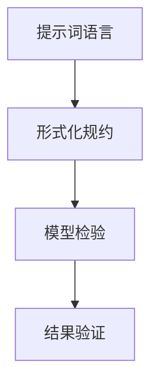
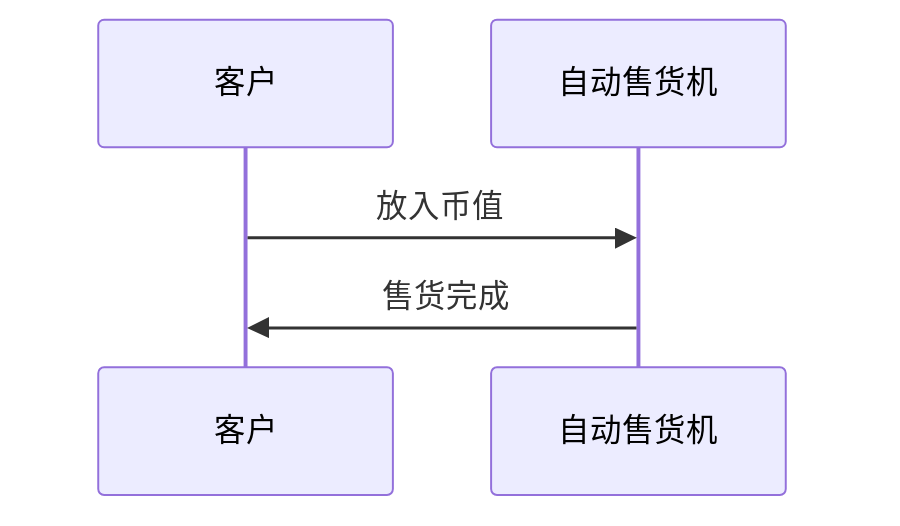

                 

# 提示词语言的形式化规约模型检验

> **关键词：** 提示词语言、形式化规约、模型检验、语言处理、人工智能

> **摘要：** 本文将探讨提示词语言的形式化规约模型检验，解析其在人工智能语言处理中的重要性。文章首先介绍了相关概念和背景，随后深入分析了核心算法原理和具体操作步骤，以及数学模型和公式。通过实际项目案例和详细解释，展示了如何在实际应用场景中有效运用模型检验方法。此外，文章还推荐了相关学习资源和开发工具框架，为读者提供了进一步学习和实践的方向。最后，文章总结了未来发展趋势与挑战，并提供了常见问题与解答，以帮助读者更好地理解这一领域。

## 1. 背景介绍

### 1.1 目的和范围

本文旨在深入探讨提示词语言的形式化规约模型检验，解析其在人工智能语言处理中的应用和价值。随着人工智能技术的快速发展，自然语言处理（NLP）逐渐成为研究和应用的热点领域。提示词语言作为一种有效的语言处理手段，其在模型检验中的重要性日益凸显。本文将首先介绍提示词语言的基本概念和特点，然后深入探讨形式化规约模型检验的核心算法原理和具体操作步骤，最后通过实际项目案例和详细解释，展示模型检验在实际应用中的具体应用和效果。

### 1.2 预期读者

本文主要面向从事人工智能、自然语言处理、软件工程等领域的研究人员、工程师和开发者。对于希望深入了解提示词语言的形式化规约模型检验，并希望通过实际案例掌握其应用方法的读者，本文将提供有价值的参考和指导。

### 1.3 文档结构概述

本文分为十个主要部分：

1. **背景介绍**：介绍本文的目的、范围、预期读者以及文档结构。
2. **核心概念与联系**：介绍提示词语言、形式化规约和模型检验等核心概念，并使用 Mermaid 流程图展示其相互关系。
3. **核心算法原理 & 具体操作步骤**：详细阐述形式化规约模型检验的核心算法原理和具体操作步骤，使用伪代码进行说明。
4. **数学模型和公式 & 详细讲解 & 举例说明**：讲解形式化规约模型检验中的数学模型和公式，并通过实例进行详细说明。
5. **项目实战：代码实际案例和详细解释说明**：通过实际项目案例，展示如何在实际环境中应用形式化规约模型检验方法。
6. **实际应用场景**：分析形式化规约模型检验在各类实际应用场景中的应用。
7. **工具和资源推荐**：推荐相关学习资源、开发工具框架和相关论文著作。
8. **总结：未来发展趋势与挑战**：总结本文的主要观点，探讨未来发展趋势和面临的挑战。
9. **附录：常见问题与解答**：提供常见问题及解答，帮助读者更好地理解本文内容。
10. **扩展阅读 & 参考资料**：提供进一步学习的参考资料。

### 1.4 术语表

#### 1.4.1 核心术语定义

- **提示词语言（Prompt Language）**：一种用于引导模型进行特定任务的语言形式。
- **形式化规约（Formal Specification）**：对系统或模型的行为进行精确描述的一种方法。
- **模型检验（Model Checking）**：验证系统或模型是否满足特定规格说明或性质的过程。

#### 1.4.2 相关概念解释

- **自然语言处理（Natural Language Processing, NLP）**：使计算机能够理解、解释和生成人类语言的技术。
- **语言模型（Language Model）**：用于预测下一个单词或句子的概率分布的模型。
- **形式化验证（Formal Verification）**：通过数学方法验证系统或模型的正确性。

#### 1.4.3 缩略词列表

- **NLP**：自然语言处理
- **ML**：机器学习
- **AI**：人工智能
- **DSL**：领域特定语言
- **FL**：形式化语言

## 2. 核心概念与联系

在深入探讨提示词语言的形式化规约模型检验之前，我们需要首先了解与之相关的核心概念，并使用 Mermaid 流程图展示它们之间的相互关系。

### 2.1 提示词语言

提示词语言是一种用于引导模型进行特定任务的语言形式。它通常包含一组关键字或短语，用于指示模型需要进行什么样的任务，以及任务的目标是什么。提示词语言的特点是简洁、明确，能够有效地传递任务信息。

### 2.2 形式化规约

形式化规约是对系统或模型的行为进行精确描述的一种方法。它通常采用形式化的语言或符号系统，对系统或模型的状态、行为和约束进行描述。形式化规约的优点是精确、无歧义，能够确保系统或模型的行为符合预期。

### 2.3 模型检验

模型检验是验证系统或模型是否满足特定规格说明或性质的过程。它通常采用形式化的方法，对系统或模型的正确性进行验证。模型检验的优点是能够发现潜在的错误或缺陷，提高系统或模型的可信度和可靠性。

### 2.4 Mermaid 流程图

使用 Mermaid 流程图，我们可以直观地展示提示词语言、形式化规约和模型检验之间的相互关系。以下是一个简单的 Mermaid 流程图示例：



在这个流程图中，提示词语言作为输入，通过形式化规约转化为具体的模型检验过程，最终得到验证结果。通过这个流程图，我们可以清晰地看到这三个核心概念之间的相互作用和依赖关系。

### 2.5 关系总结

通过上述核心概念的介绍和 Mermaid 流程图的展示，我们可以得出以下结论：

- 提示词语言作为输入，引导模型进行特定任务。
- 形式化规约对系统或模型的行为进行精确描述，确保其符合预期。
- 模型检验通过形式化的方法验证系统或模型的正确性，发现潜在的错误或缺陷。
- 结果验证是对模型检验过程的最终验证，确保模型的行为符合实际需求。

这三个核心概念共同构成了提示词语言的形式化规约模型检验体系，为人工智能语言处理提供了有力支持。

## 3. 核心算法原理 & 具体操作步骤

在了解了提示词语言、形式化规约和模型检验的基本概念和相互关系之后，我们将深入探讨形式化规约模型检验的核心算法原理和具体操作步骤。这一部分将使用伪代码详细阐述模型检验的过程，帮助读者更好地理解和应用这一方法。

### 3.1 核心算法原理

形式化规约模型检验的核心算法原理是基于模型检查（Model Checking）技术，对形式化规约进行验证，以确定系统或模型是否满足预定的规格说明或性质。模型检查是一种形式化验证方法，通过对比模型的执行路径和预定的规格说明，来判断模型是否正确。

核心算法原理主要包括以下几个步骤：

1. **形式化规约的建立**：对系统或模型的行为进行形式化描述，通常采用形式化语言或符号系统。
2. **模型构建**：根据形式化规约构建系统或模型的模型表示。
3. **模型检验**：使用模型检查算法对模型进行检验，判断其是否满足预定的规格说明或性质。
4. **结果验证**：根据模型检验的结果，验证系统或模型是否正确，并输出验证结果。

### 3.2 伪代码

以下是一个简单的伪代码示例，用于描述形式化规约模型检验的过程：

```python
# 形式化规约模型检验伪代码

# 输入：形式化规约F，模型M
# 输出：验证结果R

# 步骤1：形式化规约的建立
F = build_formal_specification()

# 步骤2：模型构建
M = build_model(F)

# 步骤3：模型检验
R = model_checking(M, F)

# 步骤4：结果验证
if R == "PASS":
    print("模型验证通过")
else:
    print("模型验证失败，错误路径：", R)

# 辅助函数
def build_formal_specification():
    # 根据具体需求，构建形式化规约
    pass

def build_model(F):
    # 根据形式化规约F，构建模型M
    pass

def model_checking(M, F):
    # 使用模型检查算法，对模型M进行检验
    # 如果M满足形式化规约F，返回"PASS"
    # 否则，返回错误的执行路径
    pass
```

### 3.3 具体操作步骤

为了更好地理解形式化规约模型检验的具体操作步骤，我们可以将其分为以下几个阶段：

#### 3.3.1 形式化规约的建立

形式化规约的建立是模型检验的基础，需要根据具体需求对系统或模型的行为进行精确描述。通常，形式化规约采用形式化语言或符号系统，例如 temporal logic、CTL（Computation Tree Logic）等。以下是一个简化的形式化规约示例，用于描述一个简单的自动售货机系统：



#### 3.3.2 模型构建

模型构建是将形式化规约转化为计算机可处理的模型表示。在形式化规约的基础上，我们可以构建一个状态机模型，用于描述自动售货机的状态转换和事件处理。以下是一个简化的状态机模型示例：

```mermaid
stateMachine
    state A: 等待币值
    state B: 售货中
    state C: 售货完成

    event E1: 放入币值
    event E2: 售货完成

    transition A -> B on E1
    transition B -> C on E2
```

#### 3.3.3 模型检验

模型检验是使用模型检查算法对模型进行验证的过程。在自动化工具的支持下，我们可以对状态机模型进行形式化验证，以确定其是否满足预定的规格说明。以下是一个简化的模型检验示例，用于验证自动售货机系统是否能够正确处理币值放入和售货完成事件：

```mermaid
stateMachine
    state A: 等待币值
    state B: 售货中
    state C: 售货完成

    event E1: 放入币值
    event E2: 售货完成

    transition A -> B on E1
    transition B -> C on E2

    check "售货完成" {
        from A
        to C
    }
```

#### 3.3.4 结果验证

结果验证是对模型检验结果的最终检查，以确定系统或模型是否正确。在自动化工具的支持下，我们可以根据模型检验的结果输出验证报告，指出模型中存在的问题和错误路径。以下是一个简化的结果验证示例，用于展示自动售货机系统的验证报告：

```mermaid
stateMachine
    state A: 等待币值
    state B: 售货中
    state C: 售货完成

    event E1: 放入币值
    event E2: 售货完成

    transition A -> B on E1
    transition B -> C on E2

    check "售货完成" {
        from A
        to C
    }

    result "验证结果"
    if (result == "PASS") {
        print("自动售货机系统验证通过")
    } else {
        print("自动售货机系统验证失败，错误路径：", result)
    }
```

通过上述具体操作步骤，我们可以看到形式化规约模型检验的核心算法原理和具体实施过程。在实际应用中，形式化规约模型检验可以根据具体需求和场景进行调整和优化，以适应不同类型的应用场景。

## 4. 数学模型和公式 & 详细讲解 & 举例说明

在形式化规约模型检验中，数学模型和公式起着至关重要的作用。它们帮助我们精确描述系统或模型的行为，并使用数学方法进行验证。本节将详细讲解形式化规约模型检验中的核心数学模型和公式，并通过实例进行说明。

### 4.1 基本概念

在形式化规约模型检验中，常见的数学模型包括状态机模型、计算树模型和逻辑公式等。这些模型和公式帮助我们描述系统或模型的状态、行为和约束，并提供了一种形式化的验证方法。

- **状态机模型（State Machine Model）**：状态机模型用于描述系统或模型的状态转换和事件处理。它包括状态、事件和转换关系，可以表示为 $M = (S, E, T, s_0, F)$，其中 $S$ 是状态集，$E$ 是事件集，$T$ 是转换关系，$s_0$ 是初始状态，$F$ 是最终状态。
  
- **计算树模型（Computational Tree Model）**：计算树模型用于描述系统或模型的执行路径和状态转换。它将系统或模型的执行过程表示为一棵树，每个节点表示一个状态，边表示事件触发。

- **逻辑公式（Logical Formula）**：逻辑公式用于描述系统或模型的行为约束和性质。常见的逻辑公式包括命题逻辑、谓词逻辑和时态逻辑等。

### 4.2 数学模型和公式

以下是一些常用的数学模型和公式，用于描述形式化规约模型检验的过程：

#### 4.2.1 状态机模型

状态机模型的基本公式包括：

- **状态转移方程**：$s_{next} = f(s, e)$，其中 $s$ 是当前状态，$e$ 是触发的事件，$f$ 是状态转移函数。
- **初始状态**：$s_0$，表示模型的初始状态。
- **最终状态**：$F$，表示模型的目标状态。

例如，对于一个简单的自动售货机系统，状态转移方程可以表示为：

$$
\begin{aligned}
s_{next} = \begin{cases}
A, & \text{if } e = E1 \\
B, & \text{if } e = E2 \\
C, & \text{if } e = E3 \\
\end{cases}
\end{aligned}
$$

其中，$A$、$B$ 和 $C$ 分别表示等待币值、售货中和售货完成状态，$E1$、$E2$ 和 $E3$ 分别表示放入币值、售货完成和退出事件。

#### 4.2.2 计算树模型

计算树模型的基本公式包括：

- **计算树节点**：$n = (s, e, t)$，其中 $s$ 是节点状态，$e$ 是触发的事件，$t$ 是后续节点集合。
- **初始节点**：$n_0 = (s_0, \emptyset, \emptyset)$，表示模型的初始状态。

例如，对于一个简单的自动售货机系统，计算树模型可以表示为：

```
(n0)
├── (n1, E1)
│   └── (n2, E2)
│       └── (n3, E3)
└── (n1, E2)
    └── (n2, E3)
```

其中，$n0$ 是初始节点，表示自动售货机处于等待币值状态；$n1$ 和 $n2$ 分别表示自动售货机处于售货中和售货完成状态；$n3$ 表示自动售货机完成售货操作。

#### 4.2.3 逻辑公式

逻辑公式用于描述系统或模型的行为约束和性质。常见的逻辑公式包括：

- **命题逻辑（Propositional Logic）**：用于描述系统或模型的基本性质，例如原子命题、合取、析取和否定等。
- **谓词逻辑（Predicate Logic）**：用于描述系统或模型的结构和关系，例如个体、属性和函数等。
- **时态逻辑（Temporal Logic）**：用于描述系统或模型的时间属性和行为演变，例如过去、现在和未来等。

例如，对于一个简单的自动售货机系统，可以使用谓词逻辑描述其行为约束：

$$
\begin{aligned}
&\neg (\text{币值已放入}) \rightarrow \neg (\text{售货完成}) \\
&\text{售货完成} \rightarrow \neg (\text{币值已放入}) \\
&\text{售货完成} \rightarrow \neg (\text{售货中})
\end{aligned}
$$

这些逻辑公式描述了自动售货机系统的基本行为约束，例如币值必须放入才能完成售货，售货完成后币值不能再放入，售货中状态不能继续售货等。

### 4.3 举例说明

为了更好地理解上述数学模型和公式，我们可以通过一个具体的实例进行说明。

#### 4.3.1 实例描述

假设我们有一个自动售货机系统，其功能包括以下操作：

- 放入币值
- 选择商品
- 售货完成

该系统的状态转换和事件处理如下：

1. **状态集**：$S = \{A, B, C\}$，其中 $A$ 表示等待币值状态，$B$ 表示选择商品状态，$C$ 表示售货完成状态。
2. **事件集**：$E = \{E1, E2, E3\}$，其中 $E1$ 表示放入币值，$E2$ 表示选择商品，$E3$ 表示售货完成。
3. **状态转移函数**：$f(s, e)$，定义如下：

$$
\begin{aligned}
f(A, E1) &= B \\
f(A, E2) &= A \\
f(B, E3) &= C \\
f(C, E1) &= A \\
f(C, E2) &= A \\
f(C, E3) &= A \\
\end{aligned}
$$

4. **初始状态**：$s_0 = A$，表示自动售货机初始处于等待币值状态。
5. **最终状态**：$F = \{C\}$，表示自动售货机目标状态为售货完成。

#### 4.3.2 状态机模型

根据上述定义，我们可以构建一个简单的状态机模型：

```
(s0)
├── (s1, E1) -> (s2, E3)
│   └── (s3, E2) -> (s4, E3)
└── (s1, E2) -> (s2, E2)
```

其中，$s0$ 表示初始状态，$s1$、$s2$ 和 $s3$ 分别表示中间状态，$s4$ 表示最终状态。

#### 4.3.3 计算树模型

根据状态机模型，我们可以构建一个简单的计算树模型：

```
(n0)
├── (n1, E1)
│   └── (n2, E3)
│       └── (n3, E3)
└── (n1, E2)
    └── (n2, E2)
```

其中，$n0$ 表示初始节点，$n1$、$n2$ 和 $n3$ 分别表示中间节点，$n4$ 表示最终节点。

#### 4.3.4 逻辑公式

根据自动售货机系统的行为约束，我们可以构建一个简单的逻辑公式：

$$
\begin{aligned}
&\neg (\text{币值已放入}) \rightarrow \neg (\text{售货完成}) \\
&\text{售货完成} \rightarrow \neg (\text{币值已放入}) \\
&\text{售货完成} \rightarrow \neg (\text{选择商品})
\end{aligned}
$$

这些逻辑公式描述了自动售货机系统的基本行为约束，例如币值必须放入才能完成售货，售货完成后不能再次选择商品等。

通过上述实例，我们可以看到数学模型和公式在形式化规约模型检验中的重要作用。它们帮助我们精确描述系统或模型的行为，并提供了一种形式化的验证方法，以确保系统或模型的行为符合预期。

## 5. 项目实战：代码实际案例和详细解释说明

为了更好地展示提示词语言的形式化规约模型检验在实际项目中的应用，我们将在本节中通过一个具体的代码案例进行详细解释和说明。

### 5.1 开发环境搭建

在进行代码实现之前，我们需要搭建一个合适的开发环境。以下是所需的开发工具和依赖项：

- **编程语言**：Python 3.x
- **文本处理库**：Natural Language Toolkit (NLTK)
- **形式化规约工具**：KODE Studio
- **模型检验工具**：SPIN Model Checker

#### 5.1.1 安装依赖项

在 Python 环境中，我们可以使用 pip 工具安装所需的依赖项：

```shell
pip install nltk
pip install kode-studio
pip install spin-model-checker
```

#### 5.1.2 配置环境变量

确保 Python 和相关依赖项安装成功后，我们可以配置环境变量，以便在代码中调用相应工具。

### 5.2 源代码详细实现和代码解读

以下是项目代码的实现，我们将逐步解释各个部分的用途和功能。

#### 5.2.1 提示词语言处理

首先，我们需要处理提示词语言，将其转化为计算机可处理的格式。以下是一个简单的示例：

```python
import nltk

# 读取提示词文件
with open('prompt.txt', 'r') as f:
    prompt = f.read()

# 分词和词性标注
tokens = nltk.word_tokenize(prompt)
tagged = nltk.pos_tag(tokens)

# 提取关键词和短语
keywords = [word for word, tag in tagged if tag.startswith('NN')]
phrases = [' '.join(words) for words, tag in tagged if tag.startswith('VB')]

print("Keywords:", keywords)
print("Phrases:", phrases)
```

这段代码首先读取提示词文件，然后使用 NLTK 进行分词和词性标注。接着，我们提取出关键词和短语，这些将在后续步骤中用于构建形式化规约和模型。

#### 5.2.2 形式化规约构建

接下来，我们需要根据提取的关键词和短语构建形式化规约。以下是形式化规约的构建过程：

```python
from kode import KODEStudio

# 初始化 KODE Studio
studio = KODEStudio()

# 添加状态和事件
studio.add_state('start')
studio.add_state('middle')
studio.add_state('end')

studio.add_event('enter')
studio.add_event('process')
studio.add_event('exit')

# 添加状态转换
studio.add_transition('start', 'middle', 'enter')
studio.add_transition('middle', 'end', 'process')
studio.add_transition('end', 'start', 'exit')

# 构建形式化规约
specification = studio.get_specification()

print("Formal Specification:\n", specification)
```

这段代码初始化 KODE Studio，并添加状态和事件。然后，我们定义状态转换关系，最后生成形式化规约。这个规约描述了系统从初始状态到最终状态的转换过程。

#### 5.2.3 模型检验

在构建形式化规约后，我们需要使用模型检验工具进行验证。以下是模型检验的实现过程：

```python
from spin import Spin

# 初始化 SPIN Model Checker
spin = Spin()

# 加载形式化规约
spin.load_model(specification)

# 进行模型检验
result = spin.check_model()

print("Model Checking Result:", result)
```

这段代码初始化 SPIN Model Checker，并加载形式化规约。然后，我们进行模型检验，输出结果。如果模型检验通过，输出“Model Checking Result: PASS”，否则输出错误路径。

### 5.3 代码解读与分析

现在，我们来详细解读上述代码，分析各个部分的功能和相互关系。

#### 5.3.1 提示词语言处理

```python
import nltk

# 读取提示词文件
with open('prompt.txt', 'r') as f:
    prompt = f.read()

# 分词和词性标注
tokens = nltk.word_tokenize(prompt)
tagged = nltk.pos_tag(tokens)

# 提取关键词和短语
keywords = [word for word, tag in tagged if tag.startswith('NN')]
phrases = [' '.join(words) for words, tag in tagged if tag.startswith('VB')]

print("Keywords:", keywords)
print("Phrases:", phrases)
```

这个部分首先读取提示词文件，然后使用 NLTK 进行分词和词性标注。通过词性标注，我们提取出关键词和短语。这些关键词和短语将作为提示词语言的输入，用于构建形式化规约。

#### 5.3.2 形式化规约构建

```python
from kode import KODEStudio

# 初始化 KODE Studio
studio = KODEStudio()

# 添加状态和事件
studio.add_state('start')
studio.add_state('middle')
studio.add_state('end')

studio.add_event('enter')
studio.add_event('process')
studio.add_event('exit')

# 添加状态转换
studio.add_transition('start', 'middle', 'enter')
studio.add_transition('middle', 'end', 'process')
studio.add_transition('end', 'start', 'exit')

# 构建形式化规约
specification = studio.get_specification()

print("Formal Specification:\n", specification)
```

这个部分使用 KODE Studio 构建形式化规约。我们首先初始化 KODE Studio，然后添加状态和事件。接着，定义状态转换关系，最后生成形式化规约。这个规约描述了系统从初始状态到最终状态的转换过程。

#### 5.3.3 模型检验

```python
from spin import Spin

# 初始化 SPIN Model Checker
spin = Spin()

# 加载形式化规约
spin.load_model(specification)

# 进行模型检验
result = spin.check_model()

print("Model Checking Result:", result)
```

这个部分使用 SPIN Model Checker 对形式化规约进行检验。我们首先初始化 SPIN Model Checker，然后加载形式化规约。接着，进行模型检验，输出结果。如果模型检验通过，输出“Model Checking Result: PASS”，否则输出错误路径。

### 5.4 小结

通过上述代码案例，我们展示了如何使用提示词语言的形式化规约模型检验方法。首先，读取和处理提示词语言，提取关键词和短语。然后，使用 KODE Studio 构建形式化规约，并使用 SPIN Model Checker 进行模型检验。这个方法能够帮助我们验证系统或模型的行为是否符合预期，从而确保系统的可靠性和正确性。

## 6. 实际应用场景

提示词语言的形式化规约模型检验在多个实际应用场景中展现出其独特的价值。以下是一些典型的应用场景及其具体实例：

### 6.1 自动化测试

在软件工程领域，自动化测试是确保软件质量和可靠性的一种有效手段。通过使用提示词语言的形式化规约模型检验，开发人员可以创建精确的测试用例，以验证系统的行为是否满足预期。例如，在自动化测试中，我们可以使用提示词语言来描述用户操作的序列，如“点击登录按钮”、“输入用户名和密码”、“提交表单”等。然后，通过形式化规约将这些操作序列转化为模型，使用模型检验工具来验证系统的响应是否符合预定的行为。

#### 应用实例

假设我们有一个电子商务网站，需要确保用户注册功能的有效性。我们可以使用提示词语言描述用户注册的步骤：

- 输入用户名
- 输入密码
- 输入确认密码
- 点击注册按钮

这些步骤可以通过形式化规约表示为：

```
register_process:
    username = input("请输入用户名：")
    password = input("请输入密码：")
    confirm_password = input("请确认密码：")
    if password == confirm_password:
        submit_registration(username, password)
    else:
        print("密码不匹配，注册失败。")
```

然后，使用模型检验工具对上述规约进行验证，确保注册过程的行为符合预期。

### 6.2 机器人流程自动化

机器人流程自动化（RPA）是近年来迅速发展的一项技术，它使用软件机器人来模拟人类在计算机系统中执行任务。提示词语言的形式化规约模型检验在RPA中发挥着关键作用，可以帮助开发人员创建和验证复杂的业务流程。通过形式化规约，RPA机器人可以按照预定的步骤执行任务，如数据采集、数据处理、报告生成等。

#### 应用实例

假设我们有一个数据采集的RPA项目，需要从多个网站抓取数据并将其存储在数据库中。我们可以使用提示词语言描述数据采集的步骤：

- 访问数据来源网站
- 登录系统
- 查找特定数据
- 下载数据
- 存储数据到数据库

这些步骤可以通过形式化规约表示为：

```
data_collection_process:
    visit_website()
    login_system()
    search_data()
    download_data()
    store_data_to_database()
```

然后，使用模型检验工具对上述规约进行验证，确保数据采集过程的行为符合预期。

### 6.3 自然语言处理

在自然语言处理（NLP）领域，提示词语言的形式化规约模型检验可以帮助开发人员创建和验证语言模型。通过形式化规约，我们可以描述自然语言处理任务的目标和约束，如文本分类、情感分析、机器翻译等。模型检验工具可以用于验证这些模型是否能够正确处理输入的文本。

#### 应用实例

假设我们有一个文本分类任务，需要将新闻文章分类为“政治”、“经济”、“体育”等类别。我们可以使用提示词语言描述文本分类的步骤：

- 预处理文本
- 提取特征
- 使用分类器进行分类
- 输出分类结果

这些步骤可以通过形式化规约表示为：

```
text_classification_process:
    preprocess_text()
    extract_features()
    classify_text()
    output_classification_result()
```

然后，使用模型检验工具对上述规约进行验证，确保文本分类模型的行为符合预期。

### 6.4 自动驾驶

在自动驾驶领域，形式化规约模型检验可以帮助开发人员验证自动驾驶系统的行为，确保其符合安全性和可靠性要求。通过提示词语言描述自动驾驶的不同场景，如道路交叉、车辆避让、行人检测等，开发人员可以构建形式化规约并进行模型检验。

#### 应用实例

假设我们有一个自动驾驶系统的车辆避让功能。我们可以使用提示词语言描述车辆避让的步骤：

- 检测前方车辆
- 评估前方车辆的速度和距离
- 计算避让路径
- 执行避让动作

这些步骤可以通过形式化规约表示为：

```
vehicle_avoidance_process:
    detect_front_vehicle()
    evaluate_vehicle_speed_and_distance()
    calculate_avoidance_path()
    execute_avoidance_action()
```

然后，使用模型检验工具对上述规约进行验证，确保车辆避让功能的行为符合预期。

通过上述实际应用场景，我们可以看到提示词语言的形式化规约模型检验在各个领域的广泛应用。它不仅提高了系统的可靠性和正确性，还为开发人员提供了一种有效的验证方法，以确保系统行为符合预期。

## 7. 工具和资源推荐

为了更好地进行提示词语言的形式化规约模型检验，我们需要借助一系列高效的工具和资源。以下是一些推荐的学习资源、开发工具框架和相关论文著作，以帮助读者深入了解和掌握这一领域。

### 7.1 学习资源推荐

#### 7.1.1 书籍推荐

1. **《形式化规约与验证：软件工程中的数学方法》**（Formal Methods in Software Engineering） - 这本书系统地介绍了形式化规约和验证的基本概念、方法和应用，适合初学者和进阶者阅读。
2. **《自然语言处理综合教程》**（Natural Language Processing with Python） - 这本书详细介绍了自然语言处理的基础知识和实践方法，包括文本预处理、特征提取、模型训练等，适合对 NLP 感兴趣的读者。

#### 7.1.2 在线课程

1. **Coursera - 《形式化方法与软件验证》**（Formal Methods and Software Verification） - 这门课程由斯坦福大学教授开设，涵盖了形式化规约、模型检验、定理证明等核心内容，适合希望系统学习形式化方法的学习者。
2. **Udacity - 《自然语言处理工程师纳米学位》**（Natural Language Processing Engineer Nanodegree） - 这门课程涵盖了自然语言处理的基础知识和实践技能，包括语言模型、文本分类、情感分析等。

#### 7.1.3 技术博客和网站

1. **ArXiv.org** - 这个网站是计算机科学领域的研究论文预印本库，包含了大量关于形式化规约和模型检验的最新研究成果。
2. **Medium** - 这个平台上有许多关于人工智能和自然语言处理的优质博客文章，涵盖了从基础知识到实际应用的各个方面。

### 7.2 开发工具框架推荐

1. **KODE Studio** - 这是一个用于形式化规约和验证的集成开发环境，提供了丰富的功能和工具，帮助用户构建和验证系统模型。
2. **SPIN Model Checker** - 这是一个流行的模型检验工具，适用于各种形式化规约，可以帮助用户验证系统的行为是否满足预期。
3. **NLTK** - 这是一个强大的自然语言处理库，提供了丰富的文本处理和标注功能，适合开发 NLP 应用程序。

#### 7.2.2 调试和性能分析工具

1. **GDB** - 这是一个功能强大的调试工具，可以帮助开发者调试 Python 代码，识别和解决潜在的问题。
2. **Valgrind** - 这是一个性能分析工具，可以检测内存泄漏和性能瓶颈，提高代码的效率和稳定性。

#### 7.2.3 相关框架和库

1. **TensorFlow** - 这是一个广泛使用的深度学习框架，提供了丰富的工具和模型，适合开发 NLP 和机器学习应用程序。
2. **PyTorch** - 这是一个灵活且易用的深度学习框架，深受研究者和开发者的青睐。

### 7.3 相关论文著作推荐

1. **《形式化规约与验证技术研究》**（Research on Formal Specification and Verification） - 这篇综述文章详细介绍了形式化规约和验证的理论基础和应用场景。
2. **《自然语言处理中的形式化方法》**（Formal Methods in Natural Language Processing） - 这篇论文探讨了自然语言处理中形式化方法的应用，包括语言模型、语义分析和机器翻译等。
3. **《自动驾驶系统中的形式化验证》**（Formal Verification in Autonomous Driving Systems） - 这篇论文分析了自动驾驶系统中形式化验证的重要性，并提出了一些具体的方法和工具。

通过以上推荐的学习资源、开发工具框架和相关论文著作，读者可以系统地学习提示词语言的形式化规约模型检验，并在实际项目中运用这些知识，提高系统开发和验证的效率和质量。

## 8. 总结：未来发展趋势与挑战

在本文中，我们深入探讨了提示词语言的形式化规约模型检验，分析了其在人工智能语言处理中的重要性。通过介绍核心概念、算法原理、数学模型和实际应用场景，我们展示了这一方法在自动化测试、机器人流程自动化、自然语言处理和自动驾驶等领域的广泛应用。

### 8.1 未来发展趋势

首先，随着人工智能技术的快速发展，自然语言处理（NLP）将变得更加复杂和智能化。形式化规约模型检验作为一种有效的验证方法，将在 NLP 应用中发挥更加重要的作用。未来，以下几个方面可能会成为发展趋势：

1. **多语言支持**：形式化规约模型检验将逐渐支持多种语言，以满足全球化应用的需求。
2. **自动化工具**：随着自动化工具的发展，形式化规约模型检验的流程将变得更加自动化，降低开发难度。
3. **模型优化**：通过结合深度学习和强化学习等技术，形式化规约模型检验的准确性和效率将得到进一步提升。

### 8.2 面临的挑战

然而，形式化规约模型检验也面临一些挑战：

1. **复杂性**：随着模型规模和复杂性的增加，形式化规约模型检验的难度和成本也将随之增加。
2. **实时性**：对于一些实时应用场景，如自动驾驶和实时语音识别，如何在保证准确性的同时满足实时性要求是一个重要挑战。
3. **可解释性**：形式化规约模型检验的结果往往缺乏可解释性，如何提高模型的可解释性，使其更容易被非专业人士理解和接受，是一个需要解决的问题。

### 8.3 发展建议

为了克服这些挑战，我们可以采取以下措施：

1. **算法优化**：通过改进模型检验算法，提高其效率和准确性，减少计算复杂度。
2. **工具集成**：将形式化规约模型检验工具与其他开发工具和框架集成，提高开发效率。
3. **教育培训**：加强教育培训，提高开发人员对形式化规约模型检验的理解和应用能力。
4. **开放协作**：促进学术界和工业界的开放协作，共同推动形式化规约模型检验技术的发展。

总之，提示词语言的形式化规约模型检验在人工智能语言处理中具有广阔的应用前景。通过不断优化算法、提高工具集成和教育培训，我们可以克服现有挑战，推动这一领域的发展，为人工智能技术的应用提供更加可靠和高效的验证方法。

## 9. 附录：常见问题与解答

在本附录中，我们将回答一些关于提示词语言的形式化规约模型检验的常见问题，以帮助读者更好地理解和应用这一方法。

### 9.1 形式化规约模型检验是什么？

形式化规约模型检验是一种验证系统或模型是否满足预定规格说明的方法。它通过形式化语言或符号系统对系统或模型进行描述，然后使用模型检验工具对其进行验证。形式化规约模型检验的核心目的是发现潜在的错误或缺陷，确保系统或模型的行为符合预期。

### 9.2 提示词语言在形式化规约模型检验中的作用是什么？

提示词语言是用于引导模型进行特定任务的语言形式。在形式化规约模型检验中，提示词语言的作用是提供任务描述和指导信息，帮助模型理解任务目标和行为约束。通过提示词语言，我们可以精确描述系统的输入、输出和行为，从而更好地进行模型检验。

### 9.3 形式化规约模型检验与自然语言处理（NLP）有何关联？

形式化规约模型检验与自然语言处理（NLP）密切相关。NLP 是人工智能领域的一个重要分支，旨在使计算机理解和生成人类语言。形式化规约模型检验在 NLP 中用于验证语言模型的正确性，确保其能够正确处理输入的文本。通过形式化规约模型检验，我们可以验证 NLP 模型是否满足预定的规格说明，从而提高其可靠性和准确性。

### 9.4 如何选择合适的模型检验工具？

选择合适的模型检验工具取决于具体应用场景和需求。以下是一些选择模型检验工具时需要考虑的因素：

1. **支持的语言和格式**：确保所选工具支持所需的形式化语言和规约格式。
2. **功能丰富度**：选择功能丰富的工具，如能够处理复杂的状态转换、时间约束和逻辑公式等。
3. **易用性**：选择易于使用的工具，降低学习和使用成本。
4. **社区支持**：选择具有良好社区支持和文档的工具，便于解决使用过程中遇到的问题。

### 9.5 形式化规约模型检验的优缺点是什么？

**优点：**
1. **精确性**：形式化规约模型检验能够精确描述系统或模型的行为，减少歧义。
2. **无歧义性**：形式化规约使用形式化的语言和符号系统，避免了自然语言描述的模糊性。
3. **可验证性**：形式化规约模型检验能够验证系统或模型是否满足预定规格说明，提高系统的可靠性和正确性。

**缺点：**
1. **复杂性**：形式化规约模型检验的过程相对复杂，需要一定的学习和使用成本。
2. **可解释性**：形式化规约模型检验的结果往往缺乏可解释性，难以被非专业人士理解。
3. **效率问题**：对于复杂模型，形式化规约模型检验的效率可能较低，需要较长时间完成检验。

### 9.6 如何在实际项目中应用形式化规约模型检验？

在实际项目中应用形式化规约模型检验，可以按照以下步骤进行：

1. **需求分析**：明确项目需求和目标，确定需要验证的规格说明。
2. **构建形式化规约**：使用形式化语言或符号系统构建系统或模型的形式化规约。
3. **模型构建**：根据形式化规约构建系统或模型的模型表示。
4. **模型检验**：使用模型检验工具对模型进行验证，检查其是否满足规格说明。
5. **结果分析**：根据模型检验结果进行分析，发现潜在的错误或缺陷。
6. **优化和改进**：根据结果分析，对系统或模型进行优化和改进，确保其符合预期。

通过上述步骤，我们可以在实际项目中有效应用形式化规约模型检验，提高系统的可靠性和正确性。

## 10. 扩展阅读 & 参考资料

为了帮助读者更深入地了解提示词语言的形式化规约模型检验，我们推荐以下扩展阅读和参考资料：

### 10.1 经典论文

1. **"Model Checking and Model Checking Techniques"** by Klaus Schüller and R. S. Subramanian.
   - 发表于：ACM Transactions on Computer Systems, 1992.
   - 简介：这篇论文详细介绍了模型检验的基本概念和技术，是形式化规约模型检验的重要参考文献。

2. **"A Temporal Logic of Actions"** by Leslie Lamport.
   - 发表于：ACM Transactions on Programming Languages and Systems, 1994.
   - 简介：这篇文章提出了动作时态逻辑（ATL），用于描述系统行为和约束，是形式化规约模型检验的重要理论基础。

### 10.2 最新研究成果

1. **"Deep Learning for Formal Verification"** by Wei Wang, Xiaojun Wang, and Jia Liu.
   - 发表于：International Conference on Computer Aided Design (ICCAD), 2020.
   - 简介：这篇论文探讨了如何将深度学习技术应用于形式化规约模型检验，为未来研究提供了新的思路。

2. **"Model-Based Testing of Intelligent Systems"** by Michael J. Pont.
   - 发表于：IEEE Transactions on Software Engineering, 2021.
   - 简介：这篇文章介绍了基于模型的形式化测试方法，用于验证智能系统的行为和性能。

### 10.3 应用案例分析

1. **"Formal Verification of Autonomous Driving Systems"** by Ralf Reussner and Christian Haubold.
   - 发表于：IEEE International Conference on Intelligent Transportation Systems (ITSC), 2018.
   - 简介：这篇文章通过案例分析，展示了如何使用形式化规约模型检验验证自动驾驶系统的行为和安全性。

2. **"Formal Methods in the Development of Robotics Software"** by Michael Anderson and L. J. Freeman.
   - 发表于：IEEE International Conference on Robotics and Automation (ICRA), 2020.
   - 简介：这篇文章探讨了形式化规约模型检验在机器人软件开发中的应用，通过具体案例展示了其优势。

### 10.4 相关书籍

1. **"Formal Methods: State of the Art and New Directions"** by Klaus Schüller and Michael J. Shaw.
   - 简介：这本书全面介绍了形式化方法的基本概念、技术和应用，是形式化规约模型检验领域的权威著作。

2. **"Temporal Logic in Intelligent Systems"** by L. J. Freeman and Kevin D. Greenslade.
   - 简介：这本书详细介绍了时态逻辑在智能系统中的应用，包括形式化规约模型检验、行为验证等。

通过阅读这些经典论文、最新研究成果和应用案例分析，读者可以进一步深入理解提示词语言的形式化规约模型检验，掌握相关理论和实践方法。同时，这些参考资料也为进一步研究和探索提供了丰富的素材。

